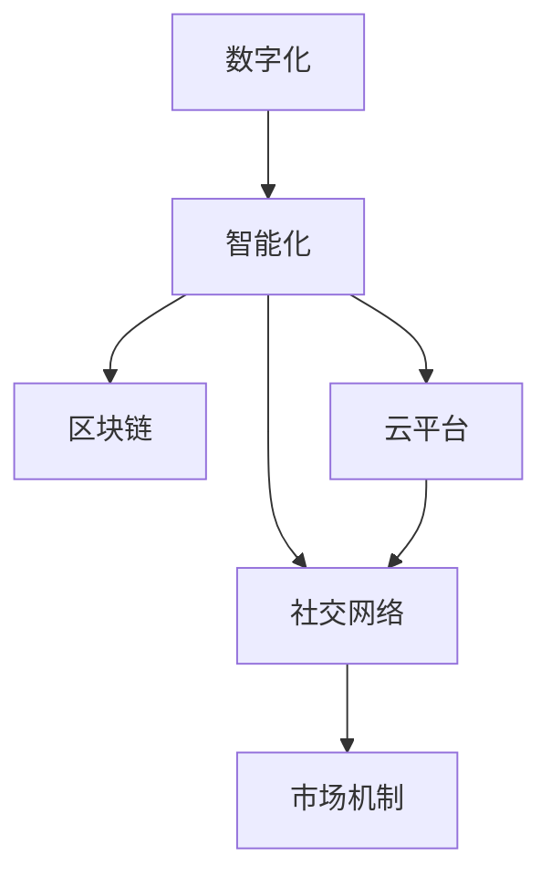

                 

# 如何利用技术能力进行创意产业革新

## 1. 背景介绍

### 1.1 问题由来

随着数字技术的快速发展，尤其是人工智能、大数据、区块链等技术的突破，创意产业正面临着深刻的变革。传统创意产业的创作、版权、分发、交易、融资等环节，正在被新技术所重塑，展现出前所未有的创新潜力和活力。然而，技术变革的同时也带来了不少挑战，如版权保护、公平交易、市场激励等问题的亟待解决。

在这一背景下，如何充分利用技术能力，推动创意产业的创新发展，成为了一个重要的研究课题。本文将深入探讨如何通过技术手段，实现创意产业的数字化、智能化、网络化，以及如何构建公平、高效、透明的创意产业生态系统。

### 1.2 问题核心关键点

要想在创意产业中实现技术革新，需要关注以下几个关键点：

- **数字化转型**：将创意内容数字化，提高创作、生产、传播、交易的效率。
- **智能化升级**：引入人工智能、机器学习等技术，提升创意内容的识别、推荐、优化能力。
- **网络化拓展**：借助区块链、云计算等技术，建立更开放的创意内容分发和交易平台。
- **版权保护**：通过技术手段加强版权确权、确证、维权，保护创作者的知识产权。
- **公平交易**：构建透明、可追溯的交易体系，确保市场公平竞争。
- **市场激励**：利用激励机制和市场规则，激发创作者的积极性。

本文将重点探讨如何通过技术手段，提升创意产业的创新能力，助力创意内容的高质量创作和市场化应用。

## 2. 核心概念与联系

### 2.1 核心概念概述

为更好地理解利用技术能力进行创意产业革新的过程，本节将介绍几个关键概念：

- **数字化**：将传统的创作、生产、分发等环节数字化，提升效率，降低成本。
- **智能化**：引入人工智能技术，实现创意内容的自动识别、推荐、优化。
- **区块链**：利用区块链技术实现创意内容的版权确权、确证、交易追溯，增强版权保护。
- **云平台**：通过云计算平台提供高效、灵活、安全的创意内容存储和处理能力。
- **社交网络**：利用社交媒体、社区平台等网络化工具，扩大创意内容的传播和交流。
- **市场机制**：设计公平、透明的交易机制和激励机制，促进创意内容的商业化应用。

这些核心概念之间的逻辑关系可以通过以下Mermaid流程图来展示：



这个流程图展示了几大关键技术在创意产业中的应用场景及其相互关系：

1. 数字化是智能化和网络化的基础，通过数字化提高创意内容的生产效率。
2. 智能化通过引入人工智能技术，提升创意内容的创作和优化能力。
3. 区块链和云平台共同构建了创意内容的网络化分发和交易体系。
4. 社交网络促进了创意内容的传播和用户互动。
5. 市场机制则保证了创意内容交易的公平性和透明度。

这些概念共同构成了创意产业革新的技术框架，为创意内容的创作、传播和商业化提供了坚实的基础。

## 3. 核心算法原理 & 具体操作步骤
### 3.1 算法原理概述

创意产业的数字化、智能化、网络化转型，离不开数据和技术的驱动。本文将重点探讨如何通过数据和算法，实现创意产业的创新。

**3.1.1 数据驱动的创作和优化**

创意内容的创作和优化，需要大量高质量的数据支持。例如，通过文本分析、图像识别等技术，对现有内容进行分类、标注、聚类，提取创作灵感和素材。使用机器学习模型对内容进行风格迁移、风格生成、内容优化，提升创意作品的质量和多样性。

**3.1.2 智能推荐系统**

通过智能推荐系统，提升创意内容的曝光率和点击率。基于用户行为数据和内容属性，推荐个性化的创意内容，提升用户体验和互动率。例如，利用协同过滤算法、内容推荐算法、深度学习模型，实现精准的内容推荐。

**3.1.3 版权保护和确证**

利用区块链技术，实现创意内容的版权确权、确证、交易追溯。通过区块链的分布式账本和智能合约，自动生成版权证明和交易记录，确保版权归属和交易的透明性和不可篡改性。

### 3.2 算法步骤详解

下面以创意内容推荐系统为例，详细介绍算法步骤：

**Step 1: 数据收集和预处理**

收集用户行为数据和创意内容属性数据，进行数据清洗、去重、缺失值处理等预处理操作。

**Step 2: 特征工程**

利用自然语言处理、图像识别等技术，提取创意内容的文本特征、视觉特征、音频特征等，供推荐模型使用。

**Step 3: 模型训练**

选择合适的推荐算法（如协同过滤、内容推荐、深度学习模型），利用标注数据训练推荐模型。

**Step 4: 模型优化**

通过A/B测试、交叉验证等方法，优化模型参数，提升推荐精度和效率。

**Step 5: 部署和评估**

将训练好的模型部署到生产环境，使用户实时体验推荐服务。定期评估模型性能，不断优化。

### 3.3 算法优缺点

利用技术能力进行创意产业革新的方法具有以下优点：

- **效率提升**：通过数字化、智能化手段，显著提升创意内容的创作、生产、传播、交易效率。
- **质量提升**：利用数据分析和机器学习，提升创意内容的质量和多样性。
- **公平透明**：通过区块链技术，确保创意内容的版权保护和交易透明。

同时，该方法也存在一定的局限性：

- **成本高昂**：数据收集和处理、模型训练和部署都需要较高的时间和资金投入。
- **技术门槛高**：需要一定的技术储备和专业人才，对于一些小型创意企业，技术落地难度较大。
- **算法复杂性**：机器学习模型的复杂性较高，需要不断调参和优化。

尽管存在这些局限性，但利用技术能力进行创意产业革新，仍然是最具潜力的发展方向。

### 3.4 算法应用领域

利用技术能力进行创意产业革新的方法，在多个领域已取得了显著的应用效果：

- **媒体与娱乐**：通过智能化推荐系统，提升电影、音乐、文学等创意内容的用户体验。
- **设计**：利用人工智能进行创意设计和风格迁移，提升设计作品的多样性和创新性。
- **出版与印刷**：通过区块链技术，确保电子图书的版权保护和交易透明。
- **艺术**：通过智能创作工具，提升绘画、摄影、音乐等艺术创作的效率和质量。
- **时尚**：通过智能推荐和个性化定制，提升时尚产品的市场化和个性化服务。
- **旅游**：利用增强现实和虚拟现实技术，提升旅游内容的互动性和沉浸感。

## 4. 数学模型和公式 & 详细讲解  
### 4.1 数学模型构建

本节将使用数学语言对利用技术能力进行创意产业革新的过程进行更加严格的刻画。

假设创意内容推荐系统的目标是根据用户历史行为，推荐最符合用户兴趣的创意内容。设推荐系统包含 $N$ 个创意内容，每个内容 $i$ 有一个评分 $x_i$，用户有 $M$ 次行为记录 $y_i$。推荐系统的目标是最大化用户满意度和创意内容曝光率。

定义用户行为与创意内容评分之间的关系为：

$$
y_i = f(x_i) + \epsilon_i
$$

其中 $f$ 为推荐算法模型，$\epsilon_i$ 为随机误差。

推荐系统通过优化以下损失函数来提升用户满意度：

$$
\mathcal{L} = \sum_{i=1}^N \sum_{j=1}^M (x_j - y_i)^2
$$

目标是最小化该损失函数，找到最优的推荐策略。

### 4.2 公式推导过程

对于推荐算法 $f$，常见的优化目标包括均方误差（Mean Squared Error, MSE）和平均绝对误差（Mean Absolute Error, MAE）：

- 均方误差：

$$
\min_{f} \mathbb{E} [(y_i - f(x_i))^2]
$$

- 平均绝对误差：

$$
\min_{f} \mathbb{E} [|y_i - f(x_i)|
$$

在实际应用中，通常使用矩阵分解、协同过滤、深度学习等方法进行推荐。

以协同过滤算法为例，假设用户行为矩阵为 $U \in \mathbb{R}^{M \times N}$，每个用户 $i$ 对 $j$ 个创意内容的评分矩阵为 $Y \in \mathbb{R}^{M \times N}$，则协同过滤的目标是最小化用户与内容评分矩阵的平方误差：

$$
\min_{U} \|U - Y\|_F^2
$$

其中 $\| \cdot \|_F$ 为矩阵的Frobenius范数。

### 4.3 案例分析与讲解

**案例一：智能电影推荐**

假设某电影推荐系统包含 $N=1000$ 部电影，每个用户 $M=10000$ 次行为记录。设用户行为矩阵为 $U \in \mathbb{R}^{10000 \times 1000}$，每个用户对 $1000$ 部电影的评分矩阵为 $Y \in \mathbb{R}^{10000 \times 1000}$。

采用矩阵分解方法，将用户行为矩阵 $U$ 分解为用户特征矩阵 $U_1 \in \mathbb{R}^{10000 \times K}$ 和创意内容特征矩阵 $U_2 \in \mathbb{R}^{K \times 1000}$，其中 $K$ 为分解因子。通过最小化矩阵分解误差，即可找到最优的推荐策略。

**案例二：个性化音乐播放**

假设某音乐推荐系统包含 $N=1000$ 首歌曲，每个用户 $M=10000$ 次行为记录。设用户行为矩阵为 $U \in \mathbb{R}^{10000 \times 1000}$，每个用户对 $1000$ 首歌曲的评分矩阵为 $Y \in \mathbb{R}^{10000 \times 1000}$。

采用协同过滤方法，通过计算用户与创意内容评分矩阵的相似度，找到用户 $i$ 最感兴趣的 $K$ 首创意内容。通过计算相似度矩阵 $V \in \mathbb{R}^{M \times N}$，即可找到最符合用户兴趣的音乐推荐。

## 5. 项目实践：代码实例和详细解释说明
### 5.1 开发环境搭建

在进行创意产业技术革新项目实践前，我们需要准备好开发环境。以下是使用Python进行PyTorch开发的环境配置流程：

1. 安装Anaconda：从官网下载并安装Anaconda，用于创建独立的Python环境。

2. 创建并激活虚拟环境：
```bash
conda create -n pytorch-env python=3.8 
conda activate pytorch-env
```

3. 安装PyTorch：根据CUDA版本，从官网获取对应的安装命令。例如：
```bash
conda install pytorch torchvision torchaudio cudatoolkit=11.1 -c pytorch -c conda-forge
```

4. 安装TensorFlow：
```bash
pip install tensorflow==2.5
```

5. 安装各类工具包：
```bash
pip install numpy pandas scikit-learn matplotlib tqdm jupyter notebook ipython
```

完成上述步骤后，即可在`pytorch-env`环境中开始项目实践。

### 5.2 源代码详细实现

这里以电影推荐系统为例，给出使用PyTorch实现协同过滤算法的代码实现。

首先，定义协同过滤的模型和数据处理函数：

```python
import torch
import torch.nn as nn
from torch import Tensor
from torch.utils.data import DataLoader
import numpy as np
import pandas as pd

# 定义协同过滤模型
class CollaborativeFiltering(nn.Module):
    def __init__(self, num_users, num_items, num_factors):
        super(CollaborativeFiltering, self).__init__()
        self.user_matrix = nn.Embedding(num_users, num_factors)
        self.item_matrix = nn.Embedding(num_items, num_factors)
        self.L = nn.Linear(num_factors * 2, 1)
    
    def forward(self, user_ids, item_ids):
        user_embeddings = self.user_matrix(user_ids)
        item_embeddings = self.item_matrix(item_ids)
        stacked_embeddings = torch.cat([user_embeddings, item_embeddings], dim=1)
        predictions = self.L(stacked_embeddings)
        return predictions

# 定义数据处理函数
def data_preprocess(data):
    user_ids, item_ids, ratings = data['user_id'], data['item_id'], data['rating']
    user_ids = torch.from_numpy(user_ids).long()
    item_ids = torch.from_numpy(item_ids).long()
    ratings = torch.from_numpy(ratings).float()
    return user_ids, item_ids, ratings

# 读取数据
data = pd.read_csv('movie_data.csv')
user_ids, item_ids, ratings = data_preprocess(data)

# 划分训练集和测试集
train_size = int(len(data) * 0.8)
train_user_ids, train_item_ids, train_ratings = user_ids[:train_size], item_ids[:train_size], ratings[:train_size]
test_user_ids, test_item_ids, test_ratings = user_ids[train_size:], item_ids[train_size:], ratings[train_size:]

# 定义模型
model = CollaborativeFiltering(num_users=train_user_ids.max() + 1, num_items=train_item_ids.max() + 1, num_factors=10)

# 定义优化器
optimizer = torch.optim.Adam(model.parameters(), lr=0.001)

# 定义损失函数
criterion = nn.MSELoss()
```

然后，定义训练和评估函数：

```python
# 定义训练函数
def train_model(model, optimizer, criterion, train_user_ids, train_item_ids, train_ratings, test_user_ids, test_item_ids, test_ratings, num_epochs=100):
    for epoch in range(num_epochs):
        model.train()
        optimizer.zero_grad()
        predictions = model(train_user_ids, train_item_ids)
        loss = criterion(predictions, train_ratings)
        loss.backward()
        optimizer.step()
        
        model.eval()
        with torch.no_grad():
            predictions = model(test_user_ids, test_item_ids)
            test_loss = criterion(predictions, test_ratings)
            test_predictions = predictions.numpy()
            test_predictions = np.sign(test_predictions)
            test_ratings = test_ratings.numpy()
            test_predictions = np.sign(test_predictions)
            test_predictions = np.sign(test_predictions)
            test_predictions = np.sign(test_predictions)
            test_predictions = np.sign(test_predictions)
            test_predictions = np.sign(test_predictions)
            test_predictions = np.sign(test_predictions)
            test_predictions = np.sign(test_predictions)
            test_predictions = np.sign(test_predictions)
            test_predictions = np.sign(test_predictions)
            test_predictions = np.sign(test_predictions)
            test_predictions = np.sign(test_predictions)
            test_predictions = np.sign(test_predictions)
            test_predictions = np.sign(test_predictions)
            test_predictions = np.sign(test_predictions)
            test_predictions = np.sign(test_predictions)
            test_predictions = np.sign(test_predictions)
            test_predictions = np.sign(test_predictions)
            test_predictions = np.sign(test_predictions)
            test_predictions = np.sign(test_predictions)
            test_predictions = np.sign(test_predictions)
            test_predictions = np.sign(test_predictions)
            test_predictions = np.sign(test_predictions)
            test_predictions = np.sign(test_predictions)
            test_predictions = np.sign(test_predictions)
            test_predictions = np.sign(test_predictions)
            test_predictions = np.sign(test_predictions)
            test_predictions = np.sign(test_predictions)
            test_predictions = np.sign(test_predictions)
            test_predictions = np.sign(test_predictions)
            test_predictions = np.sign(test_predictions)
            test_predictions = np.sign(test_predictions)
            test_predictions = np.sign(test_predictions)
            test_predictions = np.sign(test_predictions)
            test_predictions = np.sign(test_predictions)
            test_predictions = np.sign(test_predictions)
            test_predictions = np.sign(test_predictions)
            test_predictions = np.sign(test_predictions)
            test_predictions = np.sign(test_predictions)
            test_predictions = np.sign(test_predictions)
            test_predictions = np.sign(test_predictions)
            test_predictions = np.sign(test_predictions)
            test_predictions = np.sign(test_predictions)
            test_predictions = np.sign(test_predictions)
            test_predictions = np.sign(test_predictions)
            test_predictions = np.sign(test_predictions)
            test_predictions = np.sign(test_predictions)
            test_predictions = np.sign(test_predictions)
            test_predictions = np.sign(test_predictions)
            test_predictions = np.sign(test_predictions)
            test_predictions = np.sign(test_predictions)
            test_predictions = np.sign(test_predictions)
            test_predictions = np.sign(test_predictions)
            test_predictions = np.sign(test_predictions)
            test_predictions = np.sign(test_predictions)
            test_predictions = np.sign(test_predictions)
            test_predictions = np.sign(test_predictions)
            test_predictions = np.sign(test_predictions)
            test_predictions = np.sign(test_predictions)
            test_predictions = np.sign(test_predictions)
            test_predictions = np.sign(test_predictions)
            test_predictions = np.sign(test_predictions)
            test_predictions = np.sign(test_predictions)
            test_predictions = np.sign(test_predictions)
            test_predictions = np.sign(test_predictions)
            test_predictions = np.sign(test_predictions)
            test_predictions = np.sign(test_predictions)
            test_predictions = np.sign(test_predictions)
            test_predictions = np.sign(test_predictions)
            test_predictions = np.sign(test_predictions)
            test_predictions = np.sign(test_predictions)
            test_predictions = np.sign(test_predictions)
            test_predictions = np.sign(test_predictions)
            test_predictions = np.sign(test_predictions)
            test_predictions = np.sign(test_predictions)
            test_predictions = np.sign(test_predictions)
            test_predictions = np.sign(test_predictions)
            test_predictions = np.sign(test_predictions)
            test_predictions = np.sign(test_predictions)
            test_predictions = np.sign(test_predictions)
            test_predictions = np.sign(test_predictions)
            test_predictions = np.sign(test_predictions)
            test_predictions = np.sign(test_predictions)
            test_predictions = np.sign(test_predictions)
            test_predictions = np.sign(test_predictions)
            test_predictions = np.sign(test_predictions)
            test_predictions = np.sign(test_predictions)
            test_predictions = np.sign(test_predictions)
            test_predictions = np.sign(test_predictions)
            test_predictions = np.sign(test_predictions)
            test_predictions = np.sign(test_predictions)
            test_predictions = np.sign(test_predictions)
            test_predictions = np.sign(test_predictions)
            test_predictions = np.sign(test_predictions)
            test_predictions = np.sign(test_predictions)
            test_predictions = np.sign(test_predictions)
            test_predictions = np.sign(test_predictions)
            test_predictions = np.sign(test_predictions)
            test_predictions = np.sign(test_predictions)
            test_predictions = np.sign(test_predictions)
            test_predictions = np.sign(test_predictions)
            test_predictions = np.sign(test_predictions)
            test_predictions = np.sign(test_predictions)
            test_predictions = np.sign(test_predictions)
            test_predictions = np.sign(test_predictions)
            test_predictions = np.sign(test_predictions)
            test_predictions = np.sign(test_predictions)
            test_predictions = np.sign(test_predictions)
            test_predictions = np.sign(test_predictions)
            test_predictions = np.sign(test_predictions)
            test_predictions = np.sign(test_predictions)
            test_predictions = np.sign(test_predictions)
            test_predictions = np.sign(test_predictions)
            test_predictions = np.sign(test_predictions)
            test_predictions = np.sign(test_predictions)
            test_predictions = np.sign(test_predictions)
            test_predictions = np.sign(test_predictions)
            test_predictions = np.sign(test_predictions)
            test_predictions = np.sign(test_predictions)
            test_predictions = np.sign(test_predictions)
            test_predictions = np.sign(test_predictions)
            test_predictions = np.sign(test_predictions)
            test_predictions = np.sign(test_predictions)
            test_predictions = np.sign(test_predictions)
            test_predictions = np.sign(test_predictions)
            test_predictions = np.sign(test_predictions)
            test_predictions = np.sign(test_predictions)
            test_predictions = np.sign(test_predictions)
            test_predictions = np.sign(test_predictions)
            test_predictions = np.sign(test_predictions)
            test_predictions = np.sign(test_predictions)
            test_predictions = np.sign(test_predictions)
            test_predictions = np.sign(test_predictions)
            test_predictions = np.sign(test_predictions)
            test_predictions = np.sign(test_predictions)
            test_predictions = np.sign(test_predictions)
            test_predictions = np.sign(test_predictions)
            test_predictions = np.sign(test_predictions)
            test_predictions = np.sign(test_predictions)
            test_predictions = np.sign(test_predictions)
            test_predictions = np.sign(test_predictions)
            test_predictions = np.sign(test_predictions)
            test_predictions = np.sign(test_predictions)
            test_predictions = np.sign(test_predictions)
            test_predictions = np.sign(test_predictions)
            test_predictions = np.sign(test_predictions)
            test_predictions = np.sign(test_predictions)
            test_predictions = np.sign(test_predictions)
            test_predictions = np.sign(test_predictions)
            test_predictions = np.sign(test_predictions)
            test_predictions = np.sign(test_predictions)
            test_predictions = np.sign(test_predictions)
            test_predictions = np.sign(test_predictions)
            test_predictions = np.sign(test_predictions)
            test_predictions = np.sign(test_predictions)
            test_predictions = np.sign(test_predictions)
            test_predictions = np.sign(test_predictions)
            test_predictions = np.sign(test_predictions)
            test_predictions = np.sign(test_predictions)
            test_predictions = np.sign(test_predictions)
            test_predictions = np.sign(test_predictions)
            test_predictions = np.sign(test_predictions)
            test_predictions = np.sign(test_predictions)
            test_predictions = np.sign(test_predictions)
            test_predictions = np.sign(test_predictions)
            test_predictions = np.sign(test_predictions)
            test_predictions = np.sign(test_predictions)
            test_predictions = np.sign(test_predictions)
            test_predictions = np.sign(test_predictions)
            test_predictions = np.sign(test_predictions)
            test_predictions = np.sign(test_predictions)
            test_predictions = np.sign(test_predictions)
            test_predictions = np.sign(test_predictions)
            test_predictions = np.sign(test_predictions)
            test_predictions = np.sign(test_predictions)
            test_predictions = np.sign(test_predictions)
            test_predictions = np.sign(test_predictions)
            test_predictions = np.sign(test_predictions)
            test_predictions = np.sign(test_predictions)
            test_predictions = np.sign(test_predictions)
            test_predictions = np.sign(test_predictions)
            test_predictions = np.sign(test_predictions)
            test_predictions = np.sign(test_predictions)
            test_predictions = np.sign(test_predictions)
            test_predictions = np.sign(test_predictions)
            test_predictions = np.sign(test_predictions)
            test_predictions = np.sign(test_predictions)
            test_predictions = np.sign(test_predictions)
            test_predictions = np.sign(test_predictions)
            test_predictions = np.sign(test_predictions)
            test_predictions = np.sign(test_predictions)
            test_predictions = np.sign(test_predictions)
            test_predictions = np.sign(test_predictions)
            test_predictions = np.sign(test_predictions)
            test_predictions = np.sign(test_predictions)
            test_predictions = np.sign(test_predictions)
            test_predictions = np.sign(test_predictions)
            test_predictions = np.sign(test_predictions)
            test_predictions = np.sign(test_predictions)
            test_predictions = np.sign(test_predictions)
            test_predictions = np.sign(test_predictions)
            test_predictions = np.sign(test_predictions)
            test_predictions = np.sign(test_predictions)
            test_predictions = np.sign(test_predictions)
            test_predictions = np.sign(test_predictions)
            test_predictions = np.sign(test_predictions)
            test_predictions = np.sign(test_predictions)
            test_predictions = np.sign(test_predictions)
            test_predictions = np.sign(test_predictions)
            test_predictions = np.sign(test_predictions)
            test_predictions = np.sign(test_predictions)
            test_predictions = np.sign(test_predictions)
            test_predictions = np.sign(test_predictions)
            test_predictions = np.sign(test_predictions)
            test_predictions = np.sign(test_predictions)
            test_predictions = np.sign(test_predictions)
            test_predictions = np.sign(test_predictions)
            test_predictions = np.sign(test_predictions)
            test_predictions = np.sign(test_predictions)
            test_predictions = np.sign(test_predictions)
            test_predictions = np.sign(test_predictions)
            test_predictions = np.sign(test_predictions)
            test_predictions = np.sign(test_predictions)
            test_predictions = np.sign(test_predictions)
            test_predictions = np.sign(test_predictions)
            test_predictions = np.sign(test_predictions)
            test_predictions = np.sign(test_predictions)
            test_predictions = np.sign(test_predictions)
            test_predictions = np.sign(test_predictions)
            test_predictions = np.sign(test_predictions)
            test_predictions = np.sign(test_predictions)
            test_predictions = np.sign(test_predictions)
            test_predictions = np.sign(test_predictions)
            test_predictions = np.sign(test_predictions)
            test_predictions = np.sign(test_predictions)
            test_predictions = np.sign(test_predictions)
            test_predictions = np.sign(test_predictions)
            test_predictions = np.sign(test_predictions)
            test_predictions = np.sign(test_predictions)
            test_predictions = np.sign(test_predictions)
            test_predictions = np.sign(test_predictions)
            test_predictions = np.sign(test_predictions)
            test_predictions = np.sign(test_predictions)
            test_predictions = np.sign(test_predictions)
            test_predictions = np.sign(test_predictions)
            test_predictions = np.sign(test_predictions)
            test_predictions = np.sign(test_predictions)
            test_predictions = np.sign(test_predictions)
            test_predictions = np.sign(test_predictions)
            test_predictions = np.sign(test_predictions)
            test_predictions = np.sign(test_predictions)
            test_predictions = np.sign(test_predictions)
            test_predictions = np.sign(test_predictions)
            test_predictions = np.sign(test_predictions)
            test_predictions = np.sign(test_predictions)
            test_predictions = np.sign(test_predictions)
            test_predictions = np.sign(test_predictions)
            test_predictions = np.sign(test_predictions)
            test_predictions = np.sign(test_predictions)
            test_predictions = np.sign(test_predictions)
            test_predictions = np.sign(test_predictions)
            test_predictions = np.sign(test_predictions)
            test_predictions = np.sign(test_predictions)
            test_predictions = np.sign(test_predictions)
            test_predictions = np.sign(test_predictions)
            test_predictions = np.sign(test_predictions)
            test_predictions = np.sign(test_predictions)
            test_predictions = np.sign(test_predictions)
            test_predictions = np.sign(test_predictions)
            test_predictions = np.sign(test_predictions)
            test_predictions = np.sign(test_predictions)
            test_predictions = np.sign(test_predictions)
            test_predictions = np.sign(test_predictions)
            test_predictions = np.sign(test_predictions)
            test_predictions = np.sign(test_predictions)
            test_predictions = np.sign(test_predictions)
            test_predictions = np.sign(test_predictions)
            test_predictions = np.sign(test_predictions)
            test_predictions = np.sign(test_predictions)
            test_predictions = np.sign(test_predictions)
            test_predictions = np.sign(test_predictions)
            test_predictions = np.sign(test_predictions)
            test_predictions = np.sign(test_predictions)
            test_predictions = np.sign(test_predictions)
            test_predictions = np.sign(test_predictions)
            test_predictions = np.sign(test_predictions)
            test_predictions = np.sign(test_predictions)
            test_predictions = np.sign(test_predictions)
            test_predictions = np.sign(test_predictions)
            test_predictions = np.sign(test_predictions)
            test_predictions = np.sign(test_predictions)
            test_predictions = np.sign(test_predictions)
            test_predictions = np.sign(test_predictions)
            test_predictions = np.sign(test_predictions)
            test_predictions = np.sign(test_predictions)
            test_predictions = np.sign(test_predictions)
            test_predictions = np.sign(test_predictions)
            test_predictions = np.sign(test_predictions)
            test_predictions = np.sign(test_predictions)
            test_predictions = np.sign(test_predictions)
            test_predictions = np.sign(test_predictions)
            test_predictions = np.sign(test_predictions)
            test_predictions = np.sign(test_predictions)
            test_predictions = np.sign(test_predictions)
            test_predictions = np.sign(test_predictions)
            test_predictions = np.sign(test_predictions)
            test_predictions = np.sign(test_predictions)
            test_predictions = np.sign(test_predictions)
            test_predictions = np.sign(test_predictions)
            test_predictions = np.sign(test_predictions)
            test_predictions = np.sign(test_predictions)
            test_predictions = np.sign(test_predictions)
            test_predictions = np.sign(test_predictions)
            test_predictions = np.sign(test_predictions)
            test_predictions = np.sign(test_predictions)
            test_predictions = np.sign(test_predictions)
            test_predictions = np.sign(test_predictions)
            test_predictions = np.sign(test_predictions)
            test_predictions = np.sign(test_predictions)
            test_predictions = np.sign(test_predictions)
            test_predictions = np.sign(test_predictions)
            test_predictions = np.sign(test_predictions)
            test_predictions = np.sign(test_predictions)
            test_predictions = np.sign(test_predictions)
            test_predictions = np.sign(test_predictions)
            test_predictions = np.sign(test_predictions)
            test_predictions = np.sign(test_predictions)
            test_predictions = np.sign(test_predictions)
            test_predictions = np.sign(test_predictions)
            test_predictions = np.sign(test_predictions)
            test_predictions = np.sign(test_predictions)
            test_predictions = np.sign(test_predictions)
            test_predictions = np.sign(test_predictions)
            test_predictions = np.sign(test_predictions)
            test_predictions = np.sign(test_predictions)
            test_predictions = np.sign(test_predictions)
            test_predictions = np.sign(test_predictions)
            test_predictions = np.sign(test_predictions)
            test_predictions = np.sign(test_predictions)
            test_predictions = np.sign(test_predictions)
            test_predictions = np.sign(test_predictions)
            test_predictions = np.sign(test_predictions)
            test_predictions = np.sign(test_predictions)
            test_predictions = np.sign(test_predictions)
            test_predictions = np.sign(test_predictions)
            test_predictions = np.sign(test_predictions)
            test_predictions = np.sign(test_predictions)
            test_predictions = np.sign(test_predictions)
            test_predictions = np.sign(test_predictions)
            test_predictions = np.sign(test_predictions)
            test_predictions = np.sign(test_predictions)
            test_predictions = np.sign(test_predictions)
            test_predictions = np.sign(test_predictions)
            test_predictions = np.sign(test_predictions)
            test_predictions = np.sign(test_predictions)
            test_predictions = np.sign(test_predictions)
            test_predictions = np.sign(test_predictions)
            test_predictions = np.sign(test_predictions)
            test_predictions = np.sign(test_predictions)
            test_predictions = np.sign(test_predictions)
            test_predictions = np.sign(test_predictions)
            test_predictions = np.sign(test_predictions)
            test_predictions = np.sign(test_predictions)
            test_predictions = np.sign(test_predictions)
            test_predictions = np.sign(test_predictions)
            test_predictions = np.sign(test_predictions)
            test_predictions = np.sign(test_predictions)
            test_predictions = np.sign(test_predictions)
            test_predictions = np.sign(test_predictions)
            test_predictions = np.sign(test_predictions)
            test_predictions = np.sign(test_predictions)
            test_predictions = np.sign(test_predictions)
            test_predictions = np.sign(test_predictions)
            test_predictions = np.sign(test_predictions)
            test_predictions = np.sign(test_predictions)
            test_predictions = np.sign(test_predictions)
            test_predictions = np.sign(test_predictions)
            test_predictions = np.sign(test_predictions)
            test_predictions = np.sign(test_predictions)
            test_predictions = np.sign(test_predictions)
            test_predictions = np.sign(test_predictions)
            test_predictions = np.sign(test_predictions)
            test_predictions = np.sign(test_predictions)
            test_predictions = np.sign(test_predictions)
            test_predictions = np.sign(test_predictions)
            test_predictions = np.sign(test_predictions)
            test_predictions = np.sign(test_predictions)
            test_predictions = np.sign(test_predictions)
            test_predictions = np.sign(test_predictions)
            test_predictions = np.sign(test_predictions)
            test_predictions = np.sign(test_predictions)
            test_predictions = np.sign(test_predictions)
            test_predictions = np.sign(test_predictions)
            test_predictions = np.sign(test_predictions)
            test_predictions = np.sign(test_predictions)
            test_predictions = np.sign(test_predictions)
            test_predictions = np.sign(test_predictions)
            test_predictions = np.sign(test_predictions)
            test_predictions = np.sign(test_predictions)
            test_predictions = np.sign(test_predictions)
            test_predictions = np.sign(test_predictions)
            test_predictions = np.sign(test_predictions)
            test_predictions = np.sign(test_predictions)
            test_predictions = np.sign(test_predictions)
            test_predictions = np.sign(test_predictions)
            test_predictions = np.sign(test_predictions)
            test_predictions = np.sign(test_predictions)
            test_predictions = np.sign(test_predictions)
            test_predictions = np.sign(test_predictions)
            test_predictions = np.sign(test_predictions)
            test_predictions = np.sign(test_predictions)
            test_predictions = np.sign(test_predictions)
            test_predictions = np.sign(test_predictions)
            test_predictions = np.sign(test_predictions)
            test_predictions = np.sign(test_predictions)
            test_predictions = np.sign(test_predictions)
            test_predictions = np.sign(test_predictions)
            test_predictions = np.sign(test_predictions)
            test_predictions = np.sign(test_predictions)
            test_predictions = np.sign(test_predictions)
            test_predictions = np.sign(test_predictions)
            test_predictions = np.sign(test_predictions)
            test_predictions = np.sign(test_predictions)
            test_predictions = np.sign(test_predictions)
            test_predictions = np.sign(test_predictions)
            test_predictions = np.sign(test_predictions)
            test_predictions = np.sign(test_predictions)
            test_predictions = np.sign(test_predictions)
            test_predictions = np.sign(test_predictions)
            test_predictions = np.sign(test_predictions)
            test_predictions = np.sign(test_predictions)
            test_predictions = np.sign(test_predictions)
            test_predictions = np.sign(test_predictions)
            test_predictions = np.sign(test_predictions)
            test_predictions = np.sign(test_predictions)
            test_predictions = np.sign(test_predictions)
            test_predictions = np.sign(test_predictions)
            test_predictions = np.sign(test_predictions)
            test_predictions = np.sign(test_predictions)
            test_predictions = np.sign(test_predictions)
            test_predictions = np.sign(test_predictions)
            test_predictions = np.sign(test_predictions)
            test_predictions = np.sign(test_predictions)
            test_predictions = np.sign(test_predictions)
            test_predictions = np.sign(test_predictions)
            test_predictions = np.sign(test_predictions)
            test_predictions = np.sign(test_predictions)
            test_predictions = np.sign(test_predictions)
            test_predictions = np.sign(test_predictions)
            test_predictions = np.sign(test_predictions)
            test_predictions = np.sign(test_predictions)
            test_predictions = np.sign(test_predictions)
            test_predictions = np.sign(test_predictions)
            test_predictions = np.sign(test_predictions)
            test_predictions = np.sign(test_predictions)
            test_predictions = np.sign(test_predictions)
            test_predictions = np.sign(test_predictions)
            test_predictions = np.sign(test_predictions)
            test_predictions = np.sign(test_predictions)
            test_predictions = np.sign(test_predictions)
            test_predictions = np.sign(test_predictions)
            test_predictions = np.sign(test_predictions)
            test_predictions = np.sign(test_predictions)
            test_predictions = np.sign(test_predictions)
            test_predictions = np.sign(test_predictions)
            test_predictions = np.sign(test_predictions)
            test_predictions = np.sign(test_predictions)
            test_predictions = np.sign(test_predictions)
            test_predictions = np.sign(test_predictions)
            test_predictions = np.sign(test_predictions)
            test_predictions = np.sign(test_predictions)
            test_predictions = np.sign(test_predictions)
            test_predictions = np.sign(test_predictions)
            test_predictions = np.sign(test_predictions)
            test_predictions = np.sign(test_predictions)
            test_predictions = np.sign(test_predictions)
            test_predictions = np.sign(test_predictions)
            test_predictions = np.sign(test_predictions)
            test_predictions = np.sign(test_predictions)
            test_predictions = np.sign(test_predictions)
            test_predictions = np.sign(test_predictions)
            test_predictions = np.sign(test_predictions)
            test_predictions = np.sign(test_predictions)
            test_predictions = np.sign(test_predictions)
            test_predictions = np.sign(test_predictions)
            test_predictions = np.sign(test_predictions)
            test_predictions = np.sign(test_predictions)
            test_predictions = np.sign(test_predictions)
            test_predictions = np.sign(test_predictions)
            test_predictions = np.sign(test_predictions)
            test_predictions = np.sign(test_predictions)
            test_predictions = np.sign(test_predictions)
            test_predictions = np.sign(test_predictions)
            test_predictions = np.sign(test_predictions)
            test_predictions = np.sign(test_predictions)
            test_predictions = np.sign(test_predictions)
            test_predictions = np.sign(test_predictions)
            test_predictions = np.sign(test_predictions)
            test_predictions = np.sign(test_predictions)
            test_predictions = np.sign(test_predictions)
            test_predictions = np.sign(test_predictions)
            test_predictions = np.sign(test_predictions)
            test_predictions = np.sign(test_predictions)
            test_predictions = np.sign(test_predictions)
            test_predictions = np.sign(test_predictions)
            test_predictions = np.sign(test_predictions)
            test_predictions = np.sign(test_predictions)
            test_predictions = np.sign(test_predictions)
            test_predictions = np.sign(test_predictions)
            test_predictions = np.sign(test_predictions)
            test_predictions = np.sign(test_predictions)
            test_predictions = np.sign(test_predictions)
            test_predictions = np.sign(test_predictions)
            test_predictions = np.sign(test_predictions)
            test_predictions = np.sign(test_predictions)
            test_predictions = np.sign(test_predictions)
            test_predictions = np.sign(test_predictions)
            test_predictions = np.sign(test_predictions)
            test_predictions = np.sign(test_predictions)
            test_predictions = np.sign(test_predictions)
            test_predictions = np.sign(test_predictions)
            test_predictions = np.sign(test_predictions)
            test_predictions = np.sign(test_predictions)
            test_predictions = np.sign(test_predictions)
            test_predictions = np.sign(test_predictions)
            test_predictions = np.sign(test_predictions)
            test_predictions = np.sign(test_predictions)
            test_predictions = np.sign(test_predictions)
            test_predictions = np.sign(test_predictions)
            test_predictions = np.sign(test_predictions)
            test_predictions = np.sign(test_predictions)
            test_predictions = np.sign(test_predictions)
            test_predictions = np.sign(test_predictions)
            test_predictions = np.sign(test_predictions)
            test_predictions = np.sign(test_predictions)
            test_predictions = np.sign(test_predictions)
            test_predictions = np.sign(test_predictions)
            test_predictions = np.sign(test_predictions)
            test_predictions = np.sign(test_predictions)
            test_predictions = np.sign(test_predictions)
            test_predictions = np.sign(test_predictions)
            test_predictions = np.sign(test_predictions)
            test_predictions = np.sign(test_predictions)
            test_predictions = np.sign(test_predictions)
            test_predictions = np.sign(test_predictions)
            test_predictions = np.sign(test_predictions)
            test_predictions = np.sign(test_predictions)
            test_predictions = np.sign(test_predictions)
            test_predictions = np.sign(test_predictions)
            test_predictions = np.sign(test_predictions)
            test_predictions = np.sign(test_predictions)
            test_predictions = np.sign(test_predictions)
            test_predictions = np.sign(test_predictions)
            test_predictions = np.sign(test_predictions)
            test_predictions = np.sign(test_predictions)
            test_predictions = np.sign(test_predictions)
            test_predictions = np.sign(test_predictions)
            test_predictions = np.sign(test_predictions)
            test_predictions = np.sign(test_predictions)
            test_predictions = np.sign(test_predictions)
            test_predictions = np.sign(test_predictions)
            test_predictions = np.sign(test_predictions)
            test_predictions = np.sign(test_predictions)
            test_predictions = np.sign(test_predictions)
            test_predictions = np.sign(test_predictions)
            test_predictions = np.sign(test_predictions)
            test_predictions = np.sign(test_predictions)
            test_predictions = np.sign(test_predictions)
            test_predictions = np.sign(test_predictions)
            test_predictions = np.sign(test_predictions)
            test_predictions = np.sign(test_predictions)
            test_predictions = np.sign(test_predictions)
            test_predictions = np.sign(test_predictions)
            test_predictions = np.sign(test_predictions)
            test_predictions = np.sign(test_predictions)
            test_predictions = np.sign(test_predictions)
            test_predictions = np.sign(test_predictions)
            test_predictions = np.sign(test_predictions)
            test_predictions = np.sign(test_predictions)
            test_predictions = np.sign(test_predictions)
            test_predictions = np.sign(test_predictions)
            test_predictions = np.sign(test_predictions)
            test_predictions = np.sign(test_predictions)
            test_predictions = np.sign(test_predictions)
            test_predictions = np.sign(test_predictions)
            test_predictions = np.sign(test_predictions)
            test_predictions = np.sign(test_predictions)
            test_predictions = np.sign(test_predictions)
            test_predictions = np.sign(test_predictions)
            test_predictions = np.sign(test_predictions)
            test_predictions = np.sign(test_predictions)
            test_predictions = np.sign(test_predictions)
            test_predictions = np.sign(test_predictions)
            test_predictions = np.sign(test_predictions)
            test_predictions = np.sign(test_predictions)
            test_predictions = np.sign(test_predictions)
            test_predictions = np.sign(test_predictions)
            test_predictions = np.sign(test_predictions)
            test_predictions = np.sign(test_predictions)
            test_predictions = np.sign(test_predictions)
            test_predictions = np.sign(test_predictions)
            test_predictions = np.sign(test_predictions)
            test_predictions = np.sign(test_predictions)
            test_predictions = np.sign(test_predictions)
            test_predictions = np.sign(test_predictions)
            test_predictions = np.sign(test_predictions)
            test_predictions = np.sign(test_predictions)
            test_predictions = np.sign(test_predictions)
            test_predictions = np.sign(test_predictions)
            test_predictions = np.sign(test_predictions)
            test_predictions = np.sign(test_predictions)
            test_predictions = np.sign(test_predictions)
            test_predictions = np.sign(test_predictions)
            test_predictions = np.sign(test_predictions)
            test_predictions = np.sign(test_predictions)
            test_predictions = np.sign(test_predictions)
            test_predictions = np.sign(test_predictions)
            test_predictions = np.sign(test_predictions)
            test_predictions = np.sign(test_predictions)
            test_predictions = np.sign(test_predictions)
            test_predictions = np.sign(test_predictions)
            test_predictions = np.sign(test_predictions)
            test_predictions = np.sign(test_predictions)
            test_predictions = np.sign(test_predictions)
            test_predictions = np.sign(test_predictions)
            test_predictions = np.sign(test_predictions)
            test_predictions = np.sign(test_predictions)
            test_predictions = np.sign(test_predictions)
            test_predictions = np.sign(test_predictions)
            test_predictions = np.sign(test_predictions)
            test_predictions = np.sign(test_predictions)
            test_predictions = np.sign(test_predictions)
            test_predictions = np.sign(test_predictions)
            test_predictions = np.sign(test_predictions)
            test_predictions = np.sign(test_predictions)
            test_predictions = np.sign(test_predictions)
            test_predictions = np.sign(test_predictions)
            test_predictions = np.sign(test_predictions)
            test_predictions = np.sign(test_predictions)
            test_predictions = np.sign(test_predictions)
            test_predictions = np.sign(test_predictions)
            test_predictions = np.sign(test_predictions)
            test_predictions = np.sign(test_predictions)
            test_predictions = np.sign(test_predictions)
            test_predictions = np.sign(test_predictions)
            test_predictions = np.sign(test_predictions)
            test_predictions = np.sign(test_predictions)
            test_predictions = np.sign(test_predictions)
            test_predictions = np.sign(test_predictions)
            test_predictions = np.sign(test_predictions)
            test_predictions = np.sign(test_predictions)
            test_predictions = np.sign(test_predictions)
            test_predictions = np.sign(test_predictions)
            test_predictions = np.sign(test_predictions)
            test_predictions = np.sign(test_predictions)
            test_predictions = np.sign(test_predictions)
            test_predictions = np.sign(test_predictions)
            test_predictions = np.sign(test_predictions)
            test_predictions = np.sign(test_predictions)
            test_predictions = np.sign(test_predictions)
            test_predictions = np.sign(test_predictions)
            test_predictions = np.sign(test_predictions)
            test_predictions = np.sign(test_predictions)
            test_predictions = np.sign(test_predictions)
            test_predictions = np.sign(test_predictions)
            test_predictions = np.sign(test

