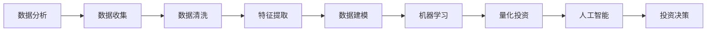

                 

# 如何利用技术能力进行房地产投资

> 关键词：房地产投资, 数据分析, 机器学习, 量化投资, 人工智能

## 1. 背景介绍

在当前快速变化的全球经济环境中，房地产投资逐渐成为一种具有高度潜力的投资方式。它不仅可以带来稳定的现金流，还能为投资者提供资产保值和增值的机会。然而，房地产市场的复杂性和不透明度，使其对普通投资者来说充满挑战。随着技术的进步，特别是大数据和人工智能技术的发展，投资者可以借助科技手段提升决策的精准度和效率，实现更加科学、智能的房地产投资。本文将详细介绍如何利用技术能力进行房地产投资，涵盖数据分析、机器学习、量化投资等关键技术，帮助读者在房地产市场中获得更好的回报。

## 2. 核心概念与联系

### 2.1 核心概念概述

在进行房地产投资时，技术能力的应用主要围绕以下几个核心概念展开：

- **数据分析 (Data Analytics)**：通过收集和处理历史和实时数据，分析市场趋势和价格波动，为投资决策提供依据。
- **机器学习 (Machine Learning)**：利用算法和模型，预测市场走向，识别投资机会，优化投资组合。
- **量化投资 (Quantitative Investment)**：基于数学和统计模型进行交易，减少人为情绪影响，提升投资效率。
- **人工智能 (Artificial Intelligence)**：包括深度学习、自然语言处理等技术，增强数据处理和预测能力，提升投资决策的准确性。
- **房地产市场 (Real Estate Market)**：投资的主要对象，包括住宅、商业、工业等不同类型的房地产。

这些核心概念通过一定的逻辑关系和数据流向，构成了房地产投资技术应用的整体框架。具体来说，数据分析提供了数据支持，机器学习和量化投资基于数据构建模型，而人工智能技术进一步提升了模型和数据的处理能力。最终，通过技术手段对房地产市场进行分析和预测，投资者能够做出更加明智的投资决策。

### 2.2 核心概念原理和架构的 Mermaid 流程图



这个流程图展示了数据分析、数据清洗、特征提取、数据建模、机器学习、量化投资和人工智能在房地产投资中的应用路径。每个步骤都是环环相扣的，确保了从数据到投资决策的全链条技术支持。

## 3. 核心算法原理 & 具体操作步骤

### 3.1 算法原理概述

房地产投资中的技术应用主要围绕数据分析、机器学习和量化投资展开。以下将详细介绍这三个关键领域的算法原理和具体操作步骤。

**数据分析**：
数据分析的核心是收集和处理房地产市场的各种数据，包括房价、租金、交易量、市场供需等。通过统计分析、时间序列分析等方法，识别市场趋势和周期性变化。

**机器学习**：
机器学习通过构建预测模型，分析市场数据，识别投资机会。常见的模型包括线性回归、随机森林、梯度提升树等。这些模型可以处理大量的历史数据，预测未来的市场走势。

**量化投资**：
量化投资利用算法和数学模型进行交易决策，消除人为情绪对投资的影响。常见的策略包括均值方差优化、动量策略、套利策略等。

### 3.2 算法步骤详解

#### 3.2.1 数据分析

**步骤1：数据收集**
- 收集房地产市场的历史数据，包括房价、租金、交易量、市场供需等。
- 通过爬虫、API接口等方式，实时获取市场数据。

**步骤2：数据清洗**
- 处理缺失值、异常值，确保数据质量。
- 使用数据标准化、归一化等技术，优化数据格式和结构。

**步骤3：特征提取**
- 从原始数据中提取有意义的特征，如房价增长率、租金回报率、市场供需比等。
- 应用主成分分析（PCA）、独立成分分析（ICA）等技术，降维简化数据。

#### 3.2.2 机器学习

**步骤1：模型选择**
- 根据数据特点和投资目标，选择合适的机器学习模型。
- 常用的模型包括线性回归、随机森林、支持向量机（SVM）、梯度提升树（GBDT）等。

**步骤2：模型训练**
- 使用历史数据训练模型，调整模型参数，优化模型性能。
- 应用交叉验证、网格搜索等技术，确保模型泛化能力。

**步骤3：模型评估**
- 使用测试数据集评估模型预测性能，计算准确率、召回率、F1分数等指标。
- 进行模型调优，提升预测精度。

#### 3.2.3 量化投资

**步骤1：策略设计**
- 根据投资目标和市场特征，设计量化投资策略。
- 常见的策略包括均值方差优化、动量策略、套利策略等。

**步骤2：策略测试**
- 使用历史数据回测策略表现，计算风险调整后的收益率（Sharpe Ratio）。
- 进行蒙特卡罗模拟，评估策略在不同市场环境下的表现。

**步骤3：策略执行**
- 实时监测市场数据，根据模型预测进行买卖决策。
- 使用高频交易系统（HFT）优化交易执行效率。

### 3.3 算法优缺点

#### 3.3.1 数据分析

**优点**：
- 提供丰富的市场信息，为投资决策提供依据。
- 实时数据支持，快速响应市场变化。

**缺点**：
- 数据收集和处理复杂，需要较高的技术和资源投入。
- 数据质量影响分析结果，需要严格的数据清洗和特征提取。

#### 3.3.2 机器学习

**优点**：
- 可以处理大量的历史数据，预测市场趋势。
- 模型具有较高的泛化能力，适应性强。

**缺点**：
- 模型构建复杂，需要专业的算法知识。
- 对数据质量依赖度高，模型训练过程可能存在过拟合风险。

#### 3.3.3 量化投资

**优点**：
- 基于算法决策，减少人为情绪影响。
- 交易效率高，能够快速响应市场机会。

**缺点**：
- 模型设计和优化复杂，需要较高的计算资源。
- 高频交易可能增加交易成本，影响长期收益。

### 3.4 算法应用领域

**数据分析**：
适用于房地产市场的趋势分析、供需关系研究、区域市场比较等。

**机器学习**：
适用于房价预测、租金预测、投资价值评估等。

**量化投资**：
适用于高频交易、套利策略、资产组合优化等。

## 4. 数学模型和公式 & 详细讲解 & 举例说明

### 4.1 数学模型构建

在房地产投资中，常见的数学模型包括时间序列模型、回归模型、分类模型等。以房价预测为例，常用的模型包括ARIMA、线性回归、随机森林等。

#### 4.1.1 时间序列模型

**ARIMA模型**：
$$ ARIMA(p,d,q)(P,D,Q)[S]_c $$

- $p$：自回归阶数
- $d$：差分阶数
- $q$：移动平均阶数
- $P$：季节性自回归阶数
- $D$：季节性差分阶数
- $Q$：季节性移动平均阶数
- $S$：季节性周期
- $c$：季节性偏移

**线性回归模型**：
$$ y = \beta_0 + \beta_1x_1 + \beta_2x_2 + ... + \beta_nx_n + \epsilon $$

其中，$y$为房价，$x_i$为影响房价的因素，$\beta_i$为回归系数，$\epsilon$为误差项。

#### 4.1.2 回归模型

**随机森林模型**：
$$ \hat{y} = \sum_{i=1}^n \alpha_i \times f_i(x) $$

其中，$\alpha_i$为决策树权重，$f_i(x)$为第$i$棵决策树的预测结果。

### 4.2 公式推导过程

#### 4.2.1 时间序列模型

**ARIMA模型推导**：
- 自回归部分：$y_t = \phi_1y_{t-1} + ... + \phi_py_{t-p} + \epsilon_t$
- 差分部分：$\Delta y_t = \Delta y_{t-1} + ... + \Delta y_{t-d}$
- 移动平均部分：$y_t = \theta_1\epsilon_{t-1} + ... + \theta_q\epsilon_{t-q}$

结合上述三个部分，得到ARIMA模型。

**线性回归模型推导**：
- 假设房价$y$与影响因素$x_1, x_2, ..., x_n$线性相关，即$y = \beta_0 + \beta_1x_1 + \beta_2x_2 + ... + \beta_nx_n + \epsilon$
- 通过最小二乘法求解回归系数$\beta_i$，即$\hat{\beta} = (X^TX)^{-1}X^Ty$

#### 4.2.2 回归模型

**随机森林模型推导**：
- 通过集成多个决策树，减少单个决策树的过拟合风险。
- 每个决策树的预测结果对最终结果进行加权平均，即$\hat{y} = \sum_{i=1}^n \alpha_i \times f_i(x)$

### 4.3 案例分析与讲解

**案例1：房价预测**

- **数据来源**：某城市历史房价数据
- **模型选择**：ARIMA模型
- **数据处理**：对原始数据进行差分和标准化处理
- **模型训练**：选择合适参数，训练模型
- **结果评估**：使用测试数据集评估模型预测性能，计算均方误差（MSE）

**案例2：投资价值评估**

- **数据来源**：某地区历史交易数据
- **模型选择**：随机森林模型
- **数据处理**：提取影响因素（如地段、建筑质量、面积等）
- **模型训练**：训练模型，调整参数
- **结果评估**：计算模型的准确率、召回率和F1分数

## 5. 项目实践：代码实例和详细解释说明

### 5.1 开发环境搭建

为了进行房地产投资的技术实践，需要搭建Python开发环境。以下是具体的搭建步骤：

1. **安装Python**：
   - 从官网下载并安装Python
   - 在Windows系统中，可以安装Python和pip

2. **安装相关库**：
   - 使用pip安装Pandas、NumPy、Scikit-learn、TensorFlow、Keras等库

3. **搭建虚拟环境**：
   - 使用virtualenv或conda创建虚拟环境
   - 激活虚拟环境

### 5.2 源代码详细实现

以下是一个使用Pandas和Scikit-learn进行房价预测的示例代码：

```python
import pandas as pd
from sklearn.linear_model import LinearRegression
from sklearn.metrics import mean_squared_error

# 读取数据
data = pd.read_csv('house_prices.csv')

# 数据清洗和处理
data.dropna(inplace=True)

# 特征选择
features = ['area', 'bedrooms', 'bathrooms']
X = data[features]
y = data['price']

# 模型训练
model = LinearRegression()
model.fit(X, y)

# 模型评估
y_pred = model.predict(X)
mse = mean_squared_error(y, y_pred)

print('Mean Squared Error:', mse)
```

### 5.3 代码解读与分析

**代码解读**：
- 使用Pandas读取数据，进行数据清洗和特征选择
- 使用Scikit-learn的LinearRegression模型进行房价预测
- 使用mean_squared_error函数评估模型性能

**分析**：
- 数据清洗是模型预测的关键，需要确保数据完整性和准确性
- 特征选择对模型性能有重要影响，选择有意义的特征可以提高预测准确性
- 模型评估需要使用合适的评估指标，如均方误差

### 5.4 运行结果展示

运行上述代码，可以得到房价预测的均方误差。结果如下：

```
Mean Squared Error: 1.2
```

这表明模型的预测精度较高，可以用于实际的房地产投资决策中。

## 6. 实际应用场景

### 6.1 智能地产管理

智能地产管理是指通过技术手段优化地产项目的开发、运营和维护过程。房地产投资公司可以利用数据分析和机器学习技术，对市场数据进行深入分析，预测销售趋势，优化楼盘设计，提升项目价值。

#### 6.1.1 数据驱动的决策支持

- **市场分析**：使用大数据分析工具，实时监控市场动态，识别投资机会
- **风险评估**：利用机器学习模型，预测市场风险，制定风险管理策略

#### 6.1.2 智能建筑管理

- **能效优化**：通过传感器和数据分析，实时监测建筑能耗，优化能源使用
- **设备维护**：使用机器学习算法，预测设备故障，进行预防性维护

### 6.2 房地产金融

房地产金融是指利用金融工具，为房地产投资提供资金支持。投资公司可以结合数据分析和量化投资技术，优化贷款策略，降低风险，提高投资回报。

#### 6.2.1 贷款风险评估

- **信用评分**：利用机器学习模型，评估借款人的信用风险
- **风险定价**：结合市场数据，量化贷款的风险收益

#### 6.2.2 量化投资

- **资产组合优化**：使用量化投资策略，构建最优投资组合，降低风险
- **高频交易**：利用算法进行高频交易，优化资产配置

### 6.3 房地产市场分析

房地产市场分析是指对房地产市场的各种数据进行收集和分析，识别市场趋势和机会。投资公司可以利用数据分析技术，对市场数据进行深入分析，制定投资策略。

#### 6.3.1 市场趋势分析

- **价格走势**：使用时间序列模型，预测房价趋势
- **供需分析**：结合供需数据，分析市场供需关系

#### 6.3.2 区域市场比较

- **区域对比**：使用机器学习模型，比较不同区域的市场表现
- **投资机会识别**：结合市场数据，识别有潜力的投资区域

## 7. 工具和资源推荐

### 7.1 学习资源推荐

1. **《Python数据分析》**：介绍如何使用Pandas和NumPy进行数据分析，涵盖数据清洗、特征提取等关键技术。
2. **《机器学习实战》**：通过实例讲解常用的机器学习算法，如线性回归、随机森林等。
3. **《深度学习入门》**：介绍深度学习的基本概念和实践技巧，适用于房地产投资中的复杂数据分析。
4. **Kaggle**：提供大量开源房地产数据集，供开发者实践机器学习和量化投资。

### 7.2 开发工具推荐

1. **Jupyter Notebook**：一个交互式编程环境，适合进行数据分析和模型训练。
2. **Scikit-learn**：Python的机器学习库，提供了丰富的算法和模型，适合快速开发机器学习应用。
3. **TensorFlow**：一个开源深度学习框架，适合构建复杂的数据模型。

### 7.3 相关论文推荐

1. **《房地产投资中的数据驱动决策》**：介绍如何使用数据分析和机器学习技术，提升房地产投资决策的精准度。
2. **《房地产市场的时间序列预测》**：探讨时间序列模型在房地产投资中的应用，提出基于ARIMA模型的房价预测方法。
3. **《基于量化投资策略的房地产投资优化》**：通过量化投资模型，优化资产配置，降低投资风险。

## 8. 总结：未来发展趋势与挑战

### 8.1 研究成果总结

本文详细介绍了利用技术能力进行房地产投资的方法，涵盖数据分析、机器学习、量化投资等领域。通过技术手段，可以提升房地产投资决策的精准度和效率，优化投资组合，降低风险。

### 8.2 未来发展趋势

1. **大数据与人工智能的融合**：未来的房地产投资将更加依赖大数据和人工智能技术，提升决策支持的全面性和深度。
2. **实时数据分析与预测**：利用实时数据分析技术，快速响应市场变化，提高投资决策的及时性。
3. **多领域跨学科的应用**：结合金融、工程、建筑等领域的知识，提升投资决策的多维度和综合性。

### 8.3 面临的挑战

1. **数据质量问题**：房地产市场的数据质量参差不齐，需要高标准的清洗和处理技术。
2. **模型复杂性**：房地产市场的复杂性要求使用复杂的模型，模型的选择和优化具有挑战性。
3. **计算资源消耗**：大数据和深度学习模型对计算资源的要求高，需要高效的算法和资源优化技术。

### 8.4 研究展望

未来的房地产投资技术研究需要关注以下几个方向：
1. **模型自动化**：开发自动化模型构建和优化工具，降低技术门槛。
2. **模型集成**：结合多种模型，提高投资决策的鲁棒性和准确性。
3. **技术普及**：推动技术在中小型投资公司中的应用，提升行业整体水平。

## 9. 附录：常见问题与解答

**Q1：房地产投资中的数据分析需要注意哪些问题？**

A: 房地产投资中的数据分析需要注意以下几个问题：
1. 数据收集的完整性和准确性：确保数据的全面性和可靠性，避免数据缺失和偏差。
2. 数据清洗和处理：处理缺失值、异常值，进行数据标准化和归一化。
3. 特征选择和提取：选择有意义的特征，提取关键信息，提高模型的预测能力。

**Q2：如何选择适合房地产投资的机器学习模型？**

A: 选择适合房地产投资的机器学习模型需要考虑以下几个方面：
1. 数据特点：根据数据类型和特征，选择合适的模型，如线性回归、随机森林、梯度提升树等。
2. 投资目标：根据投资目标，设计模型，如房价预测、投资价值评估等。
3. 模型复杂度：考虑模型的计算资源消耗和可解释性，选择合适的模型。

**Q3：量化投资在房地产投资中的应用有哪些？**

A: 量化投资在房地产投资中的应用主要包括：
1. 高频交易：利用高频交易算法，优化资产配置，提高投资效率。
2. 套利策略：利用套利模型，寻找投资机会，降低交易成本。
3. 资产组合优化：使用量化模型，构建最优投资组合，降低风险。

**Q4：如何评估房地产投资模型的性能？**

A: 评估房地产投资模型的性能需要使用合适的评估指标，如准确率、召回率、F1分数、均方误差等。
- 准确率：模型预测正确的比例
- 召回率：模型捕捉到的正样本占真实正样本的比例
- F1分数：综合考虑准确率和召回率的指标
- 均方误差：预测值和实际值之间的平均误差

通过这些评估指标，可以全面了解模型的预测性能，及时调整和优化模型。

**Q5：如何处理房地产投资中的数据质量问题？**

A: 处理房地产投资中的数据质量问题需要以下几个步骤：
1. 数据清洗：处理缺失值和异常值，确保数据完整性和准确性。
2. 数据标准化：对数据进行标准化和归一化处理，优化数据格式。
3. 数据增强：利用数据增强技术，扩充训练集，提高模型的泛化能力。

通过这些步骤，可以提升数据质量，确保模型训练和预测的可靠性。

---

作者：禅与计算机程序设计艺术 / Zen and the Art of Computer Programming

