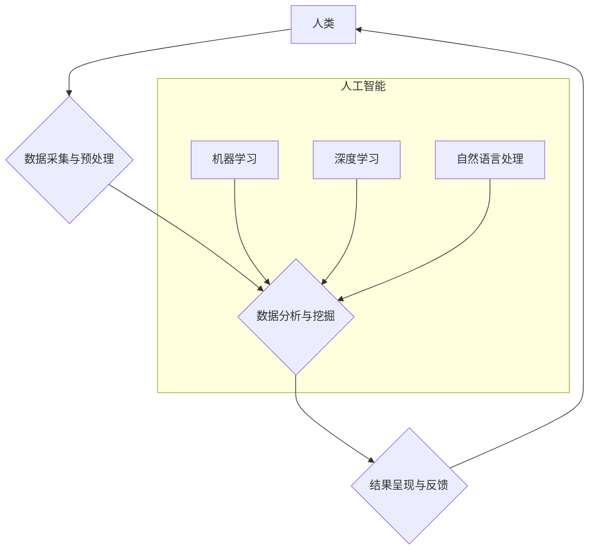

> 人类计算，大数据，人工智能，机器学习，深度学习，数据挖掘，算法优化，云计算

## 1. 背景介绍

在信息爆炸的时代，海量数据无处不在，从社交媒体到金融交易，从医疗诊断到科学研究，数据已成为不可或缺的资源。如何有效地处理、分析和利用这些数据，成为了当今科技发展的重要课题。人类计算作为一种新兴的计算模式，以其独特的优势，为解决大数据时代面临的挑战提供了新的思路和方法。

传统的计算模式主要依赖于计算机硬件的处理能力，而人类计算则强调人类的智慧和认知能力。它将人类的智能融入到计算过程中，通过协同合作，共同完成复杂的任务。

## 2. 核心概念与联系

**2.1 人类计算的概念**

人类计算是指将人类的智慧和认知能力与计算机技术相结合，共同完成计算任务的一种新型计算模式。它强调人类和机器的协同合作，充分发挥各自的优势，以实现更高效、更智能的计算。

**2.2 人类计算与大数据的联系**

大数据时代，海量数据的处理和分析成为瓶颈。人类计算通过将人类的智慧融入到数据处理过程中，可以有效地解决大数据分析的难题。

**2.3 人类计算与人工智能的联系**

人工智能旨在模拟人类的智能行为，而人类计算则将人类的智能与人工智能技术相结合，实现更强大的智能计算能力。

**2.4 人类计算的架构**



## 3. 核心算法原理 & 具体操作步骤

**3.1 算法原理概述**

人类计算的核心算法原理是将人类的认知能力，如推理、判断、决策等，转化为计算机可执行的算法。这些算法通常基于统计学、概率论、逻辑学等学科，并结合人类专家知识，实现对数据的智能分析和处理。

**3.2 算法步骤详解**

1. **数据采集与预处理:** 收集相关数据，并进行清洗、转换、格式化等预处理操作，以确保数据的质量和一致性。
2. **特征提取:** 从原始数据中提取关键特征，这些特征能够反映数据的本质属性和潜在模式。
3. **模型构建:** 根据提取的特征，构建相应的机器学习模型，例如决策树、支持向量机、神经网络等。
4. **模型训练:** 使用训练数据对模型进行训练，使其能够学习数据中的规律和模式。
5. **模型评估:** 使用测试数据对模型进行评估，并根据评估结果进行模型优化和调整。
6. **预测与决策:** 将训练好的模型应用于新的数据，进行预测和决策。

**3.3 算法优缺点**

**优点:**

* 能够处理复杂、非结构化数据。
* 能够发现数据中的隐含模式和规律。
* 能够提供更准确、更智能的决策支持。

**缺点:**

* 需要大量的训练数据。
* 模型训练过程复杂，耗时较长。
* 模型解释性较差，难以理解模型的决策过程。

**3.4 算法应用领域**

* **医疗诊断:** 基于患者的病史、症状、检查结果等数据，辅助医生进行诊断。
* **金融风险管理:** 分析市场数据、客户行为等信息，识别和评估金融风险。
* **精准营销:** 根据用户的兴趣、行为等数据，进行个性化营销推广。
* **智能客服:** 利用自然语言处理技术，实现与用户的智能对话和服务。

## 4. 数学模型和公式 & 详细讲解 & 举例说明

**4.1 数学模型构建**

人类计算的数学模型通常基于概率论、统计学和机器学习等学科。例如，在机器学习中，常用的模型包括线性回归、逻辑回归、支持向量机等。这些模型通过数学公式来描述数据之间的关系，并利用算法进行参数估计和优化。

**4.2 公式推导过程**

例如，线性回归模型的损失函数为均方误差，其公式如下：

$$
J(\theta) = \frac{1}{2m} \sum_{i=1}^{m} (h_\theta(x^{(i)}) - y^{(i)})^2
$$

其中：

* $J(\theta)$ 表示损失函数
* $\theta$ 表示模型参数
* $m$ 表示训练样本数量
* $h_\theta(x^{(i)})$ 表示模型对第 $i$ 个样本的预测值
* $y^{(i)}$ 表示第 $i$ 个样本的真实值

通过最小化损失函数，可以得到模型参数的最佳值。

**4.3 案例分析与讲解**

例如，在预测房价问题中，我们可以使用线性回归模型。模型输入包括房屋面积、房间数量、地理位置等特征，输出为房屋价格。通过训练数据，模型可以学习到这些特征与房价之间的关系，并用于预测新房子的价格。

## 5. 项目实践：代码实例和详细解释说明

**5.1 开发环境搭建**

* 操作系统：Windows/macOS/Linux
* Python 版本：3.6+
* 必要的库：NumPy、Pandas、Scikit-learn

**5.2 源代码详细实现**

```python
import numpy as np
from sklearn.linear_model import LinearRegression

# 准备数据
X = np.array([[100, 2], [150, 3], [200, 4], [250, 5]])  # 房屋面积和房间数量
y = np.array([200000, 300000, 400000, 500000])  # 房屋价格

# 创建线性回归模型
model = LinearRegression()

# 训练模型
model.fit(X, y)

# 预测新房子的价格
new_house = np.array([[300, 3]])
predicted_price = model.predict(new_house)

# 打印预测结果
print(f"新房子的预测价格为：{predicted_price[0]}")
```

**5.3 代码解读与分析**

* 首先，我们准备了房屋面积和房间数量作为特征，以及对应的房屋价格作为目标变量。
* 然后，我们创建了一个线性回归模型，并使用训练数据对模型进行训练。
* 训练完成后，我们可以使用模型预测新房子的价格。

**5.4 运行结果展示**

运行上述代码，可以得到新房子的预测价格。

## 6. 实际应用场景

**6.1 医疗诊断辅助**

人类计算可以帮助医生分析患者的病史、症状、检查结果等数据，辅助进行诊断。例如，可以利用机器学习算法识别肿瘤的类型和阶段，帮助医生制定更精准的治疗方案。

**6.2 金融风险管理**

人类计算可以帮助金融机构分析市场数据、客户行为等信息，识别和评估金融风险。例如，可以利用机器学习算法预测股票价格的波动，帮助投资者做出更明智的投资决策。

**6.3 精准营销**

人类计算可以帮助企业分析用户的兴趣、行为等数据，进行个性化营销推广。例如，可以利用机器学习算法推荐用户感兴趣的产品或服务，提高营销效果。

**6.4 智能客服**

人类计算可以帮助企业构建智能客服系统，利用自然语言处理技术，实现与用户的智能对话和服务。例如，可以利用聊天机器人自动回答用户的常见问题，提高客户服务效率。

**6.5 未来应用展望**

随着人工智能技术的不断发展，人类计算将在更多领域得到应用，例如：

* **科学研究:** 帮助科学家分析大规模实验数据，加速科学发现。
* **教育教学:** 提供个性化学习方案，提高学习效率。
* **城市管理:** 优化交通流量、能源消耗等，提高城市管理水平。

## 7. 工具和资源推荐

**7.1 学习资源推荐**

* **书籍:**
    * 人工智能：一种现代方法
    * 深度学习
    * 人类计算：大数据时代的关键技术
* **在线课程:**
    * Coursera: 人工智能
    * edX: 深度学习
    * Udacity: 机器学习工程师

**7.2 开发工具推荐**

* **Python:** 广泛应用于机器学习和人工智能领域，拥有丰富的库和工具。
* **TensorFlow:** Google 开发的开源机器学习框架，支持深度学习。
* **PyTorch:** Facebook 开发的开源机器学习框架，灵活易用。

**7.3 相关论文推荐**

* 人类计算：一种新的计算范式
* 人类计算与人工智能的融合
* 人类计算在医疗诊断中的应用

## 8. 总结：未来发展趋势与挑战

**8.1 研究成果总结**

人类计算作为一种新兴的计算模式，在数据分析、人工智能、智能决策等领域取得了显著成果。

**8.2 未来发展趋势**

* **更强大的计算能力:** 随着硬件技术的进步，人类计算将能够处理更大规模、更复杂的数据。
* **更智能的算法:** 人工智能技术的不断发展，将使人类计算算法更加智能、更加高效。
* **更广泛的应用场景:** 人类计算将应用于更多领域，例如科学研究、教育教学、城市管理等。

**8.3 面临的挑战**

* **数据隐私和安全:** 人类计算需要处理大量个人数据，如何保障数据隐私和安全是一个重要的挑战。
* **算法解释性和可信度:** 人工智能算法的决策过程往往难以理解，如何提高算法的解释性和可信度是一个重要的研究方向。
* **伦理问题:** 人类计算的应用可能会带来一些伦理问题，例如算法偏见、工作岗位替代等，需要引起重视和讨论。

**8.4 研究展望**

未来，人类计算的研究将继续深入，探索更强大的计算能力、更智能的算法、更广泛的应用场景，并积极应对相关挑战，推动人类社会进步。

## 9. 附录：常见问题与解答

**9.1 如何选择合适的算法？**

选择合适的算法取决于具体应用场景和数据特点。例如，对于分类问题，可以考虑使用逻辑回归、支持向量机等算法；对于回归问题，可以考虑使用线性回归、决策树等算法。

**9.2 如何评估模型的性能？**

常用的模型性能评估指标包括准确率、召回率、F1-score、AUC等。

**9.3 如何处理数据中的缺失值？**

常用的处理缺失值的方法包括删除缺失值、用平均值或中位数填充缺失值、使用机器学习算法进行预测等。


作者：禅与计算机程序设计艺术 / Zen and the Art of Computer Programming 
<end_of_turn>