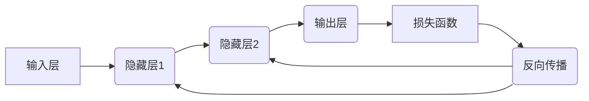

> 大模型、反馈神经网络、反向传播算法、深度学习、机器学习、神经网络、梯度下降

## 1. 背景介绍

近年来，深度学习技术取得了令人瞩目的成就，在图像识别、自然语言处理、语音识别等领域取得了突破性的进展。这些成就离不开大模型的快速发展。大模型是指参数量庞大的深度学习模型，通常拥有数十亿甚至数千亿个参数。

大模型的训练需要海量数据和强大的计算资源，但其强大的学习能力和泛化能力使其在各种应用场景中展现出巨大的潜力。然而，训练大模型也面临着诸多挑战，例如训练时间长、资源消耗大、模型过拟合等问题。

反向传播算法是深度学习训练的核心算法之一，它通过计算梯度来更新模型参数，从而不断优化模型性能。本文将深入介绍反向传播算法的原理、步骤和应用，帮助读者理解大模型训练背后的核心机制。

## 2. 核心概念与联系

**2.1 核心概念**

* **神经网络:** 仿照人脑神经网络结构的计算模型，由多个层级的神经元组成，每个神经元接收输入信号，进行处理并输出信号。
* **激活函数:** 用于将神经元的输入信号转换为输出信号的函数，例如 sigmoid 函数、ReLU 函数等。
* **损失函数:** 用于衡量模型预测结果与真实值的差距的函数，例如均方误差、交叉熵等。
* **梯度:** 损失函数对模型参数的偏导数，表示参数变化对损失函数的影响方向和大小。
* **反向传播:** 通过计算梯度，反向传播误差信息到模型各层，更新模型参数的过程。

**2.2 架构图**



## 3. 核心算法原理 & 具体操作步骤

**3.1 算法原理概述**

反向传播算法的核心思想是利用链式法则计算梯度，并根据梯度更新模型参数。

1. **前向传播:** 将输入数据通过神经网络传递，计算输出结果。
2. **损失计算:** 计算模型输出结果与真实值的差距，即损失值。
3. **反向传播:** 计算损失值对各层参数的梯度，并利用梯度下降算法更新参数。

**3.2 算法步骤详解**

1. **初始化参数:** 为模型参数赋予初始值。
2. **前向传播:** 将输入数据输入神经网络，逐层计算输出结果。
3. **损失计算:** 计算模型输出结果与真实值的损失值。
4. **反向传播:**
    * 从输出层开始，计算损失值对输出层参数的梯度。
    * 利用链式法则，将梯度反向传播到隐藏层，计算隐藏层参数的梯度。
    * 继续反向传播，直到计算出所有参数的梯度。
5. **参数更新:** 利用梯度下降算法更新模型参数，减小损失值。
6. **重复步骤2-5:** 迭代训练模型，直到损失值达到预设阈值或训练次数达到上限。

**3.3 算法优缺点**

* **优点:**
    * 能够有效地训练深度神经网络。
    * 理论基础扎实，算法原理清晰。
    * 广泛应用于各种机器学习任务。
* **缺点:**
    * 训练过程可能需要大量时间和计算资源。
    * 容易陷入局部最优解。
    * 对初始参数的设置较为敏感。

**3.4 算法应用领域**

反向传播算法广泛应用于各种机器学习任务，例如：

* **图像识别:** 识别图像中的物体、场景和人物。
* **自然语言处理:** 处理文本数据，例如机器翻译、文本摘要、情感分析等。
* **语音识别:** 将语音信号转换为文本。
* **推荐系统:** 根据用户的历史行为推荐相关商品或服务。

## 4. 数学模型和公式 & 详细讲解 & 举例说明

**4.1 数学模型构建**

假设我们有一个神经网络模型，包含输入层、隐藏层和输出层。每个神经元接收多个输入信号，并通过激活函数进行处理，输出一个信号。

* **输入层:**  $x_1, x_2, ..., x_n$
* **隐藏层:** $h_1, h_2, ..., h_m$
* **输出层:** $y_1, y_2, ..., y_k$

**4.2 公式推导过程**

* **损失函数:**  $L(y, \hat{y})$，其中 $y$ 是真实值，$\hat{y}$ 是模型预测值。
* **梯度下降算法:**  $\theta = \theta - \alpha \frac{\partial L}{\partial \theta}$，其中 $\theta$ 是模型参数，$\alpha$ 是学习率。

**4.3 案例分析与讲解**

假设我们有一个简单的线性回归模型，目标是预测房价。输入特征包括房屋面积和房间数量，输出是房价。

* **损失函数:** 均方误差 $L = \frac{1}{n} \sum_{i=1}^{n} (y_i - \hat{y}_i)^2$
* **梯度下降算法:**  $\theta = \theta - \alpha \frac{\partial L}{\partial \theta}$

通过计算梯度，我们可以更新模型参数，使得模型预测的房价与真实房价的差距最小化。

## 5. 项目实践：代码实例和详细解释说明

**5.1 开发环境搭建**

* Python 3.x
* TensorFlow 或 PyTorch 等深度学习框架

**5.2 源代码详细实现**

```python
import tensorflow as tf

# 定义模型
model = tf.keras.models.Sequential([
    tf.keras.layers.Dense(64, activation='relu', input_shape=(2,)),
    tf.keras.layers.Dense(1)
])

# 定义损失函数和优化器
model.compile(loss='mse', optimizer='adam')

# 训练模型
model.fit(X_train, y_train, epochs=10)

# 评估模型
loss = model.evaluate(X_test, y_test)
```

**5.3 代码解读与分析**

* `tf.keras.models.Sequential`: 创建一个顺序模型，层级结构清晰。
* `tf.keras.layers.Dense`: 定义全连接层，每个神经元连接到上一层的所有神经元。
* `activation='relu'`: 使用ReLU激活函数，引入非线性。
* `loss='mse'`: 使用均方误差作为损失函数。
* `optimizer='adam'`: 使用Adam优化器更新模型参数。
* `model.fit`: 训练模型，输入训练数据和训练轮数。
* `model.evaluate`: 评估模型，输入测试数据并计算损失值。

**5.4 运行结果展示**

训练完成后，我们可以使用测试数据评估模型性能，例如计算预测房价与真实房价的均方误差。

## 6. 实际应用场景

反向传播算法在各种实际应用场景中发挥着重要作用，例如：

* **图像识别:**  识别人脸、物体、场景等，应用于人脸识别、自动驾驶、医疗诊断等领域。
* **自然语言处理:**  机器翻译、文本摘要、情感分析、聊天机器人等，应用于语言理解、信息检索、客户服务等领域。
* **语音识别:**  将语音信号转换为文本，应用于语音助手、语音搜索、语音控制等领域。

**6.4 未来应用展望**

随着深度学习技术的不断发展，反向传播算法将在更多领域得到应用，例如：

* **药物研发:**  预测药物的活性，加速药物研发过程。
* **材料科学:**  设计新型材料，提高材料性能。
* **金融预测:**  预测股票价格、风险评估等，辅助金融决策。

## 7. 工具和资源推荐

**7.1 学习资源推荐**

* **书籍:**
    * 《深度学习》
    * 《神经网络与深度学习》
* **在线课程:**
    * Coursera: 深度学习
    * Udacity: 深度学习工程师
* **博客:**
    * TensorFlow Blog
    * PyTorch Blog

**7.2 开发工具推荐**

* **TensorFlow:**  开源深度学习框架，支持多种硬件平台。
* **PyTorch:**  开源深度学习框架，以其灵活性和易用性而闻名。
* **Keras:**  高层深度学习API，可以运行在TensorFlow、Theano或CNTK等底层框架上。

**7.3 相关论文推荐**

* **《反向传播算法》**
* **《深度学习》**
* **《梯度下降算法》**

## 8. 总结：未来发展趋势与挑战

**8.1 研究成果总结**

反向传播算法是深度学习训练的核心算法，其发展推动了深度学习技术的进步，并在各个领域取得了显著成果。

**8.2 未来发展趋势**

* **更高效的训练算法:**  研究更快速、更有效的训练算法，例如混合精度训练、模型并行训练等。
* **更强大的模型架构:**  设计更强大的模型架构，例如Transformer、BERT等，提高模型的表达能力和泛化能力。
* **更广泛的应用场景:**  将深度学习技术应用于更多领域，例如医疗、教育、金融等。

**8.3 面临的挑战**

* **数据获取和标注:**  深度学习模型需要海量数据进行训练，数据获取和标注成本高昂。
* **模型解释性和可解释性:**  深度学习模型的决策过程难以解释，缺乏透明度。
* **模型安全性和可靠性:**  深度学习模型容易受到攻击，需要提高模型的安全性和可靠性。

**8.4 研究展望**

未来，我们将继续研究反向传播算法及其应用，探索更有效、更安全、更可解释的深度学习方法，推动深度学习技术的发展和应用。

## 9. 附录：常见问题与解答

**9.1 什么是梯度下降算法？**

梯度下降算法是一种迭代优化算法，用于找到函数的最小值。它通过计算函数的梯度，沿着梯度负方向更新参数，逐步逼近最小值。

**9.2 反向传播算法与梯度下降算法的关系是什么？**

反向传播算法利用梯度下降算法更新模型参数。它通过计算损失函数对各层参数的梯度，并利用梯度下降算法更新参数，从而优化模型性能。

**9.3 反向传播算法的局限性是什么？**

反向传播算法存在以下局限性：

* 训练过程可能需要大量时间和计算资源。
* 容易陷入局部最优解。
* 对初始参数的设置较为敏感。


作者：禅与计算机程序设计艺术 / Zen and the Art of Computer Programming 
<end_of_turn>