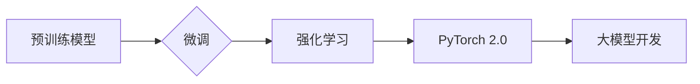

> 大模型开发, 微调, 强化学习, PyTorch 2.0, Transformer, 自然语言处理, 计算机视觉

## 1. 背景介绍

近年来，深度学习在人工智能领域取得了突破性进展，其中大模型的出现更是推动了这一领域的快速发展。大模型是指参数规模庞大、训练数据海量的人工智能模型，其强大的学习能力和泛化能力使其在自然语言处理、计算机视觉、语音识别等多个领域展现出巨大的应用潜力。

然而，大模型的开发和部署也面临着诸多挑战，例如：

* **高昂的训练成本:** 大模型的训练需要消耗大量的计算资源和时间，这对于个人开发者和小型团队来说是一个巨大的经济负担。
* **模型规模的限制:** 现有的硬件设备和软件框架难以支持训练和部署超大规模的模型。
* **数据获取和标注的困难:** 大模型的训练需要海量高质量的数据，而获取和标注这些数据往往是一项耗时费力的工作。

为了解决这些问题，微调技术应运而生。微调是指在预训练的大模型基础上，针对特定任务进行进一步的训练，以提高模型在该任务上的性能。微调技术可以有效降低训练成本，减少数据标注量，并提高模型的泛化能力。

## 2. 核心概念与联系

### 2.1 预训练模型

预训练模型是指在大量通用数据上进行训练的模型，其已经具备一定的语义理解和知识表示能力。常见的预训练模型包括BERT、GPT-3、T5等。

### 2.2 微调

微调是指在预训练模型的基础上，针对特定任务进行进一步的训练。微调过程通常包括以下步骤：

1. **选择预训练模型:** 根据任务需求选择合适的预训练模型。
2. **数据准备:** 准备特定任务的数据集，并进行数据预处理。
3. **模型微调:** 将预训练模型加载到训练环境中，并对模型参数进行微调。
4. **性能评估:** 使用验证集评估模型的性能，并根据评估结果调整训练参数。

### 2.3 强化学习

强化学习是一种机器学习方法，它通过奖励机制来训练智能体，使其在环境中采取最优行动。强化学习的核心概念包括：

* **状态:** 智能体在环境中的当前状态。
* **动作:** 智能体可以采取的行动。
* **奖励:** 智能体采取行动后获得的反馈。
* **策略:** 智能体选择动作的策略。

### 2.4 PyTorch 2.0

PyTorch 2.0 是一个开源的深度学习框架，它提供了丰富的工具和功能，支持大模型的开发和训练。PyTorch 2.0 的主要特点包括：

* **高效的计算图:** PyTorch 2.0 使用新的计算图机制，提高了模型训练的效率。
* **支持分布式训练:** PyTorch 2.0 支持分布式训练，可以利用多台机器的计算资源进行大模型的训练。
* **丰富的模型库:** PyTorch 2.0 提供了丰富的预训练模型和模型构建工具，方便开发者快速构建和训练模型。

**核心概念与联系流程图:**



## 3. 核心算法原理 & 具体操作步骤

### 3.1 算法原理概述

强化学习算法的核心思想是通过不断地与环境交互，学习一个策略，使得智能体在环境中获得最大的累积奖励。

强化学习算法通常包括以下几个关键组件：

* **状态空间:** 智能体在环境中可能存在的各种状态。
* **动作空间:** 智能体可以采取的各种动作。
* **奖励函数:** 评估智能体采取特定动作在特定状态下获得的奖励。
* **策略:** 智能体选择动作的策略。

### 3.2 算法步骤详解

1. **初始化:** 初始化智能体的策略和奖励函数。
2. **环境交互:** 智能体与环境交互，观察环境的状态和获得奖励。
3. **策略更新:** 根据获得的奖励和环境状态，更新智能体的策略。
4. **重复步骤2-3:** 重复步骤2-3，直到智能体学习到一个能够获得最大累积奖励的策略。

### 3.3 算法优缺点

**优点:**

* 可以学习复杂的行为策略。
* 不需要明确的监督信号，可以从环境中学习。
* 可以应用于各种各样的任务，例如游戏、机器人控制、推荐系统等。

**缺点:**

* 训练过程可能很慢，需要大量的样本数据和计算资源。
* 难以设计有效的奖励函数，奖励函数的设计直接影响学习效果。
* 难以解释模型的决策过程。

### 3.4 算法应用领域

强化学习算法在以下领域有广泛的应用:

* **游戏:** 训练游戏 AI，例如 AlphaGo、AlphaStar 等。
* **机器人控制:** 训练机器人执行复杂的任务，例如导航、抓取等。
* **推荐系统:** 训练推荐系统，例如个性化推荐、商品推荐等。
* **医疗保健:** 训练医疗诊断系统、药物发现系统等。

## 4. 数学模型和公式 & 详细讲解 & 举例说明

### 4.1 数学模型构建

强化学习的数学模型通常包括以下几个关键要素:

* **状态空间:** 用集合 S 表示，其中每个元素 s 代表智能体在环境中的一个状态。
* **动作空间:** 用集合 A 表示，其中每个元素 a 代表智能体可以采取的一个动作。
* **奖励函数:** 用函数 R(s, a) 表示，其中 s 是智能体当前的状态，a 是智能体采取的动作，R(s, a) 是智能体在状态 s 下采取动作 a 后获得的奖励。
* **策略:** 用函数 π(s) 表示，其中 s 是智能体当前的状态，π(s) 是智能体在状态 s 下采取动作的概率分布。

### 4.2 公式推导过程

强化学习的目标是找到一个策略 π，使得智能体在环境中获得最大的累积奖励。

累积奖励可以用以下公式表示:

$$
R_t = \sum_{k=t}^{\infty} \gamma^k r_{k}
$$

其中:

* $R_t$ 是从时间步 t 开始的累积奖励。
* $\gamma$ 是折扣因子，控制未来奖励的权重。
* $r_k$ 是时间步 k 的奖励。

策略的价值函数可以用以下公式表示:

$$
V^\pi(s) = E_{\pi}[R_t | S_t = s]
$$

其中:

* $V^\pi(s)$ 是策略 π 下状态 s 的价值函数。
* $E_{\pi}[R_t | S_t = s]$ 是在策略 π 下，从状态 s 开始的累积奖励的期望值。

### 4.3 案例分析与讲解

例如，在玩游戏时，智能体可以采取不同的动作，例如向上、向下、向左、向右移动。每个动作都会导致游戏状态的变化，并获得相应的奖励。

强化学习算法可以帮助智能体学习一个策略，使得它在游戏中获得尽可能高的分数。

## 5. 项目实践：代码实例和详细解释说明

### 5.1 开发环境搭建

1. 安装 Python 3.8 或更高版本。
2. 安装 PyTorch 2.0。
3. 安装其他必要的库，例如 NumPy、Pandas 等。

### 5.2 源代码详细实现

```python
import torch
import torch.nn as nn

# 定义一个简单的强化学习模型
class QNetwork(nn.Module):
    def __init__(self, state_size, action_size):
        super(QNetwork, self).__init__()
        self.fc1 = nn.Linear(state_size, 64)
        self.fc2 = nn.Linear(64, 32)
        self.fc3 = nn.Linear(32, action_size)

    def forward(self, state):
        x = torch.relu(self.fc1(state))
        x = torch.relu(self.fc2(x))
        return self.fc3(x)

# 初始化模型参数
state_size = 4
action_size = 2
model = QNetwork(state_size, action_size)

# 定义损失函数和优化器
criterion = nn.MSELoss()
optimizer = torch.optim.Adam(model.parameters())

# 训练模型
for episode in range(100):
    # ... (训练过程)
    # 计算损失
    loss = criterion(q_values, target_q_values)
    # 更新模型参数
    optimizer.zero_grad()
    loss.backward()
    optimizer.step()

```

### 5.3 代码解读与分析

* **模型定义:** 代码中定义了一个简单的强化学习模型 QNetwork，它是一个多层感知机，用于估计每个状态下每个动作的价值。
* **损失函数:** 使用均方误差损失函数来衡量模型预测值与真实值之间的差异。
* **优化器:** 使用 Adam 优化器来更新模型参数。
* **训练过程:** 训练过程包括收集经验数据、计算损失、更新模型参数等步骤。

### 5.4 运行结果展示

训练完成后，可以评估模型的性能，例如在测试集上计算准确率、奖励等指标。

## 6. 实际应用场景

### 6.1 自然语言处理

* **机器翻译:** 微调预训练语言模型，例如 BERT、T5，可以提高机器翻译的准确率和流畅度。
* **文本摘要:** 微调预训练语言模型，可以自动生成文本摘要，节省人工时间和成本。
* **问答系统:** 微调预训练语言模型，可以构建问答系统，回答用户的问题。

### 6.2 计算机视觉

* **图像分类:** 微调预训练图像分类模型，例如 ResNet、EfficientNet，可以提高图像分类的准确率。
* **目标检测:** 微调预训练目标检测模型，例如 YOLO、Faster R-CNN，可以提高目标检测的精度和速度。
* **图像分割:** 微调预训练图像分割模型，例如 U-Net，可以实现图像的像素级分割。

### 6.3 其他领域

* **语音识别:** 微调预训练语音识别模型，可以提高语音识别的准确率和鲁棒性。
* **推荐系统:** 微调预训练推荐模型，可以个性化推荐商品、内容等。
* **药物发现:** 微调预训练药物发现模型，可以加速药物研发过程。

### 6.4 未来应用展望

随着大模型技术的不断发展，微调技术将在更多领域得到应用，例如：

* **个性化教育:** 根据学生的学习情况，定制个性化的学习方案。
* **医疗诊断辅助:** 辅助医生进行疾病诊断，提高诊断准确率。
* **自动驾驶:** 训练自动驾驶汽车，使其能够安全可靠地行驶。

## 7. 工具和资源推荐

### 7.1 学习资源推荐

* **书籍:**
    * 深度学习
    * 强化学习：原理、算法和应用
* **在线课程:**
    * Coursera: 深度学习
    * Udacity: 强化学习
* **博客:**
    * OpenAI Blog
    * DeepMind Blog

### 7.2 开发工具推荐

* **PyTorch:** 开源深度学习框架
* **TensorFlow:** 开源深度学习框架
* **Jupyter Notebook:** 用于代码编写和可视化

### 7.3 相关论文推荐

* **Attention Is All You Need**
* **BERT: Pre-training of Deep Bidirectional Transformers for Language Understanding**
* **Deep Reinforcement Learning: An Overview**

## 8. 总结：未来发展趋势与挑战

### 8.1 研究成果总结

近年来，大模型开发与微调技术取得了显著进展，在自然语言处理、