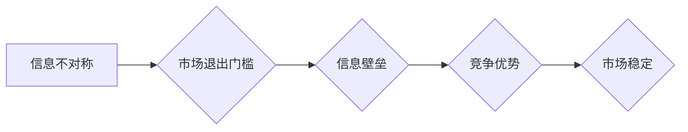

> 信息差、信息不对称、市场退出门槛、竞争优势、技术壁垒、数据驱动、算法模型、机器学习、深度学习

## 1. 背景介绍

在当今信息爆炸的时代，信息已成为企业和个人竞争的核心要素。然而，信息并非平等地分布，信息不对称现象普遍存在。信息差是指不同主体对同一事物或事件拥有不同程度的信息，导致一方掌握优势，另一方处于劣势。这种信息不对称会对市场竞争、资源配置、决策制定等方面产生深远影响。

市场退出门槛是指企业从市场中退出所需的成本和难度。信息差会直接影响市场退出门槛，形成一种“信息壁垒”。对于掌握核心信息的企业，其市场退出门槛相对较低，因为它们可以利用信息优势快速调整策略，甚至在市场竞争激烈时选择退出。而对于缺乏核心信息的企业，其市场退出门槛相对较高，因为它们难以及时了解市场变化，做出有效的应对措施，最终可能面临亏损甚至倒闭的风险。

## 2. 核心概念与联系

**信息不对称**是指信息主体之间存在信息获取、处理和利用能力的差异，导致信息获取、理解和应用能力不平衡。

**市场退出门槛**是指企业从市场中退出所需的成本和难度，包括但不限于：

* **财务成本:** 资产清算、债务偿还、员工遣散等。
* **时间成本:** 退出程序的办理、资源的整合等。
* **声誉成本:** 退出可能会损害企业的声誉和品牌形象。

**信息差与市场退出门槛之间的关系**

信息差会直接影响市场退出门槛，形成一种“信息壁垒”。

* **信息优势方:** 掌握核心信息的企业，其市场退出门槛相对较低，因为它们可以利用信息优势快速调整策略，甚至在市场竞争激烈时选择退出。
* **信息劣势方:** 缺乏核心信息的企业，其市场退出门槛相对较高，因为它们难以及时了解市场变化，做出有效的应对措施，最终可能面临亏损甚至倒闭的风险。

**Mermaid 流程图**



## 3. 核心算法原理 & 具体操作步骤

### 3.1  算法原理概述

信息差的识别和利用是构建竞争优势的关键。我们可以利用机器学习算法，例如深度学习，来分析海量数据，识别信息中的潜在价值，并将其转化为可操作的决策依据。

### 3.2  算法步骤详解

1. **数据收集:** 收集与目标领域相关的各种数据，包括文本、图像、音频、视频等。
2. **数据预处理:** 对收集到的数据进行清洗、转换、格式化等处理，使其适合算法训练。
3. **特征提取:** 从数据中提取有价值的特征，例如关键词、主题、情感、图像识别等。
4. **模型训练:** 利用深度学习算法，例如卷积神经网络（CNN）、循环神经网络（RNN）等，对提取的特征进行训练，构建信息识别模型。
5. **模型评估:** 使用测试数据对模型进行评估，并根据评估结果进行模型调优。
6. **应用部署:** 将训练好的模型部署到实际应用场景中，例如信息检索、内容推荐、风险预警等。

### 3.3  算法优缺点

**优点:**

* **自动化:** 机器学习算法可以自动识别信息中的潜在价值，无需人工干预。
* **精准度高:** 深度学习算法能够学习复杂的模式，识别信息中的细微差别，提高识别精准度。
* **可扩展性强:** 机器学习算法可以处理海量数据，并随着数据量的增加不断提升识别能力。

**缺点:**

* **数据依赖:** 机器学习算法需要大量高质量的数据进行训练，否则识别效果会下降。
* **算法复杂:** 深度学习算法的训练和调优需要专业的技术人员和强大的计算资源。
* **解释性差:** 深度学习算法的决策过程较为复杂，难以解释其识别结果背后的逻辑。

### 3.4  算法应用领域

* **金融领域:** 风险评估、欺诈检测、信用评分等。
* **医疗领域:** 疾病诊断、药物研发、患者画像等。
* **电商领域:** 商品推荐、用户画像、精准营销等。
* **教育领域:** 个性化学习、学生评估、教学辅助等。

## 4. 数学模型和公式 & 详细讲解 & 举例说明

### 4.1  数学模型构建

信息差可以被量化，并用数学模型进行描述。例如，我们可以使用信息熵的概念来衡量信息的不确定性。信息熵越高，信息的不确定性越大，信息差也就越大。

**信息熵公式:**

$$H(X) = - \sum_{i=1}^{n} p(x_i) \log_2 p(x_i)$$

其中：

* $H(X)$ 是随机变量 $X$ 的信息熵。
* $p(x_i)$ 是随机变量 $X$ 取值为 $x_i$ 的概率。
* $n$ 是随机变量 $X$ 的取值个数。

### 4.2  公式推导过程

信息熵公式的推导过程基于概率论和信息论的基本原理。

* **概率论:** 概率论研究随机事件的发生可能性。
* **信息论:** 信息论研究信息量的度量和传输。

信息熵公式的本质是将随机变量 $X$ 的概率分布转化为信息量的度量。

### 4.3  案例分析与讲解

假设有两个随机变量 $X$ 和 $Y$，分别代表两个不同的市场。

* $X$ 的信息熵为 $H(X) = 2$，表示市场 $X$ 的信息不确定性较大。
* $Y$ 的信息熵为 $H(Y) = 1$，表示市场 $Y$ 的信息不确定性较小。

根据信息熵的定义，我们可以推断出市场 $X$ 的信息差更大，市场 $Y$ 的信息更集中。

## 5. 项目实践：代码实例和详细解释说明

### 5.1  开发环境搭建

* 操作系统: Ubuntu 20.04
* Python 版本: 3.8
* 必要的库: TensorFlow, Keras, NumPy, Pandas

### 5.2  源代码详细实现

```python
import tensorflow as tf
from tensorflow.keras.models import Sequential
from tensorflow.keras.layers import Embedding, LSTM, Dense

# 数据预处理
# ...

# 模型构建
model = Sequential()
model.add(Embedding(input_dim=vocab_size, output_dim=embedding_dim))
model.add(LSTM(units=128))
model.add(Dense(units=1, activation='sigmoid'))

# 模型编译
model.compile(optimizer='adam', loss='binary_crossentropy', metrics=['accuracy'])

# 模型训练
model.fit(X_train, y_train, epochs=10, batch_size=32)

# 模型评估
loss, accuracy = model.evaluate(X_test, y_test)
print('Loss:', loss)
print('Accuracy:', accuracy)
```

### 5.3  代码解读与分析

* **Embedding 层:** 将词向量表示为稠密的向量，用于捕捉词语之间的语义关系。
* **LSTM 层:** 用于处理序列数据，例如文本，能够学习文本中的长距离依赖关系。
* **Dense 层:** 全连接层，用于将 LSTM 层的输出映射到目标输出。

### 5.4  运行结果展示

训练完成后，我们可以使用测试数据评估模型的性能，并根据评估结果进行模型调优。

## 6. 实际应用场景

### 6.1  市场分析

利用信息差识别市场趋势，预测市场变化，为企业决策提供依据。

### 6.2  产品开发

根据用户行为数据分析，识别用户需求，开发符合市场需求的产品。

### 6.3  风险管理

识别潜在风险，制定风险应对策略，降低企业风险。

### 6.4  未来应用展望

随着人工智能技术的不断发展，信息差的识别和利用将更加精准高效，在更多领域发挥重要作用。

## 7. 工具和资源推荐

### 7.1  学习资源推荐

* **书籍:**
    * 《深度学习》
    * 《机器学习》
* **在线课程:**
    * Coursera
    * edX

### 7.2  开发工具推荐

* **Python:** 
* **TensorFlow:** 深度学习框架
* **Keras:** 高级API，简化TensorFlow的使用

### 7.3  相关论文推荐

* **Attention Is All You Need**
* **BERT: Pre-training of Deep Bidirectional Transformers for Language Understanding**

## 8. 总结：未来发展趋势与挑战

### 8.1  研究成果总结

信息差的识别和利用是人工智能领域的重要研究方向，取得了一系列成果。

### 8.2  未来发展趋势

* **更精准的识别:** 利用更先进的算法和模型，识别更细微的信息差。
* **更广泛的应用:** 将信息差的识别应用到更多领域，例如医疗、教育、金融等。
* **更智能的决策:** 利用信息差，为企业和个人提供更智能的决策支持。

### 8.3  面临的挑战

* **数据质量:** 信息差的识别依赖于高质量的数据，数据质量问题是制约发展的关键因素。
* **算法解释性:** 深度学习算法的决策过程较为复杂，难以解释其识别结果背后的逻辑，这限制了其在一些领域应用的推广。
* **伦理问题:** 信息差的识别和利用可能会带来伦理问题，例如隐私泄露、信息操控等，需要引起重视。

### 8.4  研究展望

未来，我们将继续致力于信息差的识别和利用研究，探索更精准、更智能、更安全的解决方案，为社会发展做出贡献。

## 9. 附录：常见问题与解答

* **Q1: 信息差的识别需要哪些数据？**

* **A1:** 信息差的识别需要与目标领域相关的各种数据，例如文本、图像、音频、视频等。

* **Q2: 如何评估信息差的识别效果？**

* **A2:** 可以使用准确率、召回率、F1-score等指标来评估信息差的识别效果。

* **Q3: 信息差的识别会带来哪些伦理问题？**

* **A3:** 信息差的识别可能会带来隐私泄露、信息操控等伦理问题，需要引起重视。


作者：禅与计算机程序设计艺术 / Zen and the Art of Computer Programming 
<end_of_turn>