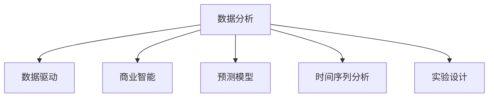

                 

# 如何利用数据分析指导运营决策

> 关键词：数据分析, 运营决策, 数据驱动, 商业智能(BI), 预测模型, 时间序列分析

## 1. 背景介绍

### 1.1 问题由来

在当今数据驱动的时代，企业运营决策越来越依赖于数据和分析。无论是传统行业还是新兴的互联网企业，数据都已成为企业最宝贵的资产之一。从销售预测、库存管理、客户满意度评估到营销活动效果评估，数据分析在企业运营的各个环节中扮演着至关重要的角色。然而，如何高效利用数据，发现隐藏在数据背后的规律和机会，始终是一个不小的挑战。

### 1.2 问题核心关键点

高效利用数据分析指导运营决策的核心关键点包括：
- 数据质量：确保数据的准确性、完整性和一致性。
- 数据整合：将来自不同渠道和格式的数据整合到一起，形成统一的数据视图。
- 数据可视化：通过图表、仪表盘等方式直观展示数据，帮助决策者理解和洞察。
- 预测模型：建立和应用预测模型，如回归、分类、聚类等，预测未来趋势和行为。
- 时间序列分析：处理和分析时间序列数据，揭示时间上的变化规律和周期性。
- 实验设计：通过A/B测试、多臂老虎机等方法，评估决策效果并进行优化。

### 1.3 问题研究意义

利用数据分析指导运营决策，对于提升企业运营效率、降低成本、提高客户满意度、增强市场竞争力具有重要意义。具体而言：

1. **提升效率和降低成本**：通过优化生产、物流、营销等流程，减少浪费和低效环节，显著提升企业运营效率，降低运营成本。
2. **提高客户满意度**：深入理解客户需求和行为，改进产品和服务，提升客户满意度和忠诚度。
3. **增强市场竞争力**：及时把握市场变化，捕捉新兴机会，灵活调整策略，保持竞争优势。
4. **提供数据支撑的决策**：数据驱动的决策更加科学和客观，避免主观臆断，降低决策风险。
5. **实现持续改进**：通过数据分析不断优化运营流程，实现持续改进和创新。

## 2. 核心概念与联系

### 2.1 核心概念概述

为更好地理解数据分析在运营决策中的应用，本节将介绍几个密切相关的核心概念：

- 数据分析(Analytics)：利用统计学、机器学习等方法，对大量数据进行收集、处理和分析，从中提取有用信息，支持决策。
- 数据驱动(Data-Driven)：基于数据分析结果，而非传统经验或直觉，进行决策和行动。
- 商业智能(Business Intelligence, BI)：结合数据仓库、数据挖掘、数据可视化等技术，辅助企业决策和业务分析。
- 预测模型(Predictive Modeling)：通过历史数据训练模型，预测未来趋势和结果，支持决策预判和优化。
- 时间序列分析(Time Series Analysis)：处理和分析按时间顺序排列的数据序列，揭示时间上的变化规律和周期性。
- 实验设计(A/B Testing)：通过对比实验评估不同决策效果，优化决策方案。

这些核心概念之间的逻辑关系可以通过以下Mermaid流程图来展示：



这个流程图展示了大数据分析的核心概念及其之间的关系：

1. 数据分析是从原始数据中提取有用信息的起点。
2. 数据驱动是利用数据分析结果进行决策的核心方式。
3. 商业智能为数据分析提供了技术和工具支持。
4. 预测模型是数据分析中常用的重要工具。
5. 时间序列分析处理时间数据，揭示规律和周期性。
6. 实验设计通过实验对比，优化决策效果。

这些概念共同构成了数据分析在运营决策中的应用框架，使得企业能够科学、高效地进行运营管理。

## 3. 核心算法原理 & 具体操作步骤
### 3.1 算法原理概述

数据分析指导运营决策，主要通过以下步骤实现：

1. **数据收集**：从内部系统和外部渠道收集相关数据。
2. **数据清洗和整合**：处理数据缺失、异常和重复，将数据整合成统一格式。
3. **数据分析和建模**：利用统计学、机器学习等方法，建立模型并分析数据。
4. **结果解读**：将分析结果转化为可视化的报表和图表，辅助决策。
5. **实验验证**：通过A/B测试等方法验证决策效果。

### 3.2 算法步骤详解

以下详细介绍数据分析指导运营决策的具体操作步骤：

#### Step 1: 数据收集和整合

数据收集是数据分析的基础。一般来说，数据来源包括：

- **内部数据**：如销售记录、库存数据、客户反馈等，可以从企业现有的业务系统、数据库等获取。
- **外部数据**：如市场调研报告、社交媒体数据、天气信息等，可以通过第三方数据提供商或公开数据集获取。

数据整合的目的是将来自不同渠道和格式的数据整合成统一的数据视图。常见的数据整合技术包括：

- **ETL流程**：通过抽取、转换、加载的流程，将数据从不同源系统导入到数据仓库。
- **数据湖**：建立一个巨大的、分散的、易于访问的数据存储系统，支持大规模数据整合。
- **数据管道**：使用数据流技术，实时地将数据从一个系统传输到另一个系统。

#### Step 2: 数据清洗和预处理

数据清洗和预处理是数据分析的预处理步骤，主要目的是去除噪声和异常值，提升数据质量。具体步骤如下：

- **数据去重**：识别并去除重复数据，避免分析结果失真。
- **数据缺失处理**：通过插值、填补等方法处理缺失值。
- **数据转换**：将原始数据转换为分析模型需要的格式，如将日期格式转换为时间序列数据。
- **数据归一化**：对数据进行归一化处理，使数据值在一个固定的范围内，便于后续分析。

#### Step 3: 数据分析和建模

数据分析和建模是数据分析的核心步骤。通过建立模型并分析数据，可以揭示数据背后的规律和趋势。常用的数据分析和建模技术包括：

- **统计分析**：利用描述性统计、回归分析、假设检验等方法分析数据。
- **机器学习**：利用分类、聚类、回归等算法，建立预测模型，预测未来趋势。
- **时间序列分析**：利用ARIMA、SARIMA、季节性分解等方法，分析时间序列数据。

#### Step 4: 结果解读和可视化

将数据分析结果转化为可视化的报表和图表，是数据分析的最后一个步骤。具体步骤如下：

- **数据可视化**：使用数据可视化工具如Tableau、Power BI、D3.js等，将分析结果直观展示。
- **仪表盘制作**：将多个可视化图表整合到仪表盘中，便于实时监控和决策。
- **报表生成**：生成文本形式的报表，提供结构化的数据分析结果。

#### Step 5: 实验验证和决策优化

实验验证是检验数据分析结果是否可靠的必要步骤。通过A/B测试、多臂老虎机等方法，可以评估不同决策方案的效果。具体步骤如下：

- **A/B测试**：通过对比两个或多个版本的差异，评估不同决策方案的效果。
- **多臂老虎机**：在同时有多个决策可选的情况下，通过奖励机制选择最优决策。
- **效果评估**：利用统计学方法评估实验结果，确定最佳决策方案。

### 3.3 算法优缺点

数据分析指导运营决策的主要优点包括：

- **科学决策**：数据驱动的决策更加客观和科学，减少主观偏差。
- **效率提升**：通过优化流程和资源分配，显著提升运营效率。
- **风险降低**：数据分析帮助识别潜在风险，提前采取措施，降低决策风险。
- **成本节约**：通过优化资源配置，降低运营成本。
- **洞察深入**：深入理解数据背后的规律和趋势，获得更深层次的洞察。

主要缺点包括：

- **数据质量问题**：如果数据质量低，数据分析结果可能失真，影响决策。
- **数据隐私和安全**：数据分析涉及大量敏感数据，数据隐私和安全问题需严格处理。
- **模型复杂性**：复杂模型可能导致过度拟合，降低模型泛化能力。
- **计算资源需求高**：大规模数据分析需要高性能计算资源，成本较高。
- **技术门槛高**：数据分析需要一定的技术和工具支持，对非专业人士要求较高。

### 3.4 算法应用领域

数据分析指导运营决策的应用领域非常广泛，以下列举几个典型案例：

#### 1. 销售预测和库存管理

通过历史销售数据和市场趋势，建立预测模型，预测未来的销售量和库存需求。利用预测结果进行库存调整，避免库存积压和缺货问题。

#### 2. 客户流失预警

分析客户历史行为数据，建立预测模型，预警可能流失的客户。根据预警结果采取措施，如邮件营销、个性化推荐等，减少客户流失率。

#### 3. 营销活动效果评估

利用A/B测试和多臂老虎机方法，评估不同营销活动的效果。根据效果评估结果，优化营销策略，提升营销活动ROI。

#### 4. 供应链优化

通过数据分析识别供应链中的瓶颈和优化机会，建立优化模型，提升供应链效率和响应速度。

## 4. 数学模型和公式 & 详细讲解  
### 4.1 数学模型构建

数据分析指导运营决策的数学模型构建主要包括以下几个方面：

- **描述性统计**：计算数据的均值、中位数、标准差等描述性统计量，反映数据的基本特征。
- **回归分析**：建立线性回归、逻辑回归等模型，预测因变量的值。
- **时间序列分析**：建立ARIMA、SARIMA等模型，分析时间序列数据。

### 4.2 公式推导过程

以线性回归模型为例，推导其数学公式和求解过程。

设$y$为因变量，$x$为自变量，$b_0$和$b_1$为回归系数，$e$为误差项。线性回归模型为：

$$
y = b_0 + b_1x + e
$$

通过最小二乘法求解回归系数$b_0$和$b_1$：

$$
b_0 = \bar{y} - b_1\bar{x}
$$

$$
b_1 = \frac{\sum_{i=1}^n (x_i - \bar{x})(y_i - \bar{y})}{\sum_{i=1}^n (x_i - \bar{x})^2}
$$

其中，$\bar{x}$和$\bar{y}$分别为$x$和$y$的均值。

### 4.3 案例分析与讲解

以客户流失预警为例，介绍如何利用数据分析指导运营决策。

设客户流失率为$y$，客户历史行为数据为$x_1, x_2, ..., x_n$，其中$x_i$包含客户年龄、购买频率、投诉次数等特征。建立线性回归模型，预测流失率：

$$
y = b_0 + b_1x_1 + b_2x_2 + ... + b_nx_n + e
$$

通过分析回归系数$b_1, b_2, ..., b_n$，可以发现哪些特征对流失率有显著影响，如投诉次数、购买频率等。进而采取相应措施，如提高客户服务质量、优化推荐系统等，减少流失率。

## 5. 项目实践：代码实例和详细解释说明
### 5.1 开发环境搭建

在进行数据分析项目实践前，我们需要准备好开发环境。以下是使用Python进行Pandas、NumPy、Scikit-learn等工具开发的环境配置流程：

1. 安装Anaconda：从官网下载并安装Anaconda，用于创建独立的Python环境。

2. 创建并激活虚拟环境：
```bash
conda create -n analytics-env python=3.8 
conda activate analytics-env
```

3. 安装必要的工具包：
```bash
pip install pandas numpy scikit-learn matplotlib seaborn statsmodels
```

4. 安装可视化工具：
```bash
pip install matplotlib seaborn statsmodels plotly
```

5. 安装时间序列分析工具：
```bash
pip install statsmodels statsmodels.tsa.api
```

完成上述步骤后，即可在`analytics-env`环境中开始数据分析实践。

### 5.2 源代码详细实现

这里以销售预测和库存管理为例，给出使用Python进行数据分析和预测的代码实现。

首先，导入必要的工具包和数据：

```python
import pandas as pd
import numpy as np
import matplotlib.pyplot as plt
import seaborn as sns
from sklearn.linear_model import LinearRegression
from statsmodels.tsa.arima_model import ARIMA
from statsmodels.tsa.stattools import adfuller

# 导入数据
sales_data = pd.read_csv('sales_data.csv')
```

接着，进行数据清洗和预处理：

```python
# 数据清洗
sales_data.dropna(inplace=True)
sales_data['date'] = pd.to_datetime(sales_data['date'])

# 数据预处理
sales_data.set_index('date', inplace=True)
```

然后，进行数据分析和建模：

```python
# 数据可视化
sns.lineplot(data=sales_data, x='date', y=' sales', label='sales')
plt.title('Sales Data Over Time')
plt.xlabel('Date')
plt.ylabel('Sales')
plt.show()

# 时间序列分析
def adfuller_test(data):
    test = adfuller(data)
    return test[1]

adfuller_test(sales_data['sales'])

# 构建ARIMA模型
model = ARIMA(sales_data['sales'], order=(1, 1, 1))
results = model.fit()
print(results.summary())
```

最后，进行结果解读和可视化：

```python
# 结果解读和可视化
plt.plot(sales_data['sales'], label='Actual Sales')
plt.plot(results.fittedvalues, label='Forecasted Sales')
plt.legend()
plt.show()
```

以上就是使用Python进行数据分析和预测的完整代码实现。可以看到，Python结合Pandas、NumPy、Scikit-learn等工具，可以非常方便地进行数据清洗、预处理、建模和结果解读。

### 5.3 代码解读与分析

让我们再详细解读一下关键代码的实现细节：

**数据清洗**：
- 使用`dropna()`方法去除数据中的缺失值。
- 使用`to_datetime()`方法将日期数据转换为时间序列格式。

**时间序列分析**：
- 使用`adfuller()`函数进行单位根检验，判断时间序列是否平稳。
- 使用`ARIMA()`函数建立时间序列模型，并使用`fit()`方法进行拟合。
- 使用`summary()`方法输出模型结果。

**结果解读和可视化**：
- 使用`plot()`方法绘制实际销售数据和预测值，并进行可视化展示。

可以看出，Python的数据分析工具非常强大，可以轻松完成数据清洗、预处理、建模和结果解读。开发者可以根据具体需求，灵活运用各种工具和方法，实现高效的数据分析。

## 6. 实际应用场景

### 6.1 销售预测和库存管理

销售预测和库存管理是数据分析的重要应用场景之一。通过分析历史销售数据和市场趋势，可以预测未来的销售量和库存需求，优化库存管理。

#### 应用案例：某电商平台的销售预测

某电商平台通过分析历史销售数据和市场趋势，建立了销售预测模型。模型使用了多种时间序列分析方法和机器学习算法，最终预测出未来每个月的销售量。根据预测结果，平台调整了库存，减少了积压和缺货问题，提升了客户满意度。

### 6.2 客户流失预警

客户流失预警是数据分析在客户关系管理中的重要应用。通过分析客户历史行为数据，可以预测哪些客户可能流失，采取相应措施，减少流失率。

#### 应用案例：某银行的客户流失预警

某银行通过分析客户历史行为数据，建立了客户流失预警模型。模型使用了逻辑回归算法，根据客户历史交易、投诉、服务满意度等数据，预测客户流失概率。根据预警结果，银行采取了个性化营销、改善客户服务等措施，显著减少了客户流失率。

### 6.3 营销活动效果评估

营销活动效果评估是数据分析在市场营销中的重要应用。通过对比不同营销活动的效果，可以优化营销策略，提升营销活动ROI。

#### 应用案例：某旅游公司的A/B测试

某旅游公司通过A/B测试评估不同营销活动的效果。在Facebook广告中，公司同时推广两种广告文案，分别展示不同文案的点击率和转化率。根据测试结果，公司优化了广告文案，提升了广告效果，降低了广告成本。

### 6.4 供应链优化

供应链优化是数据分析在供应链管理中的重要应用。通过分析供应链数据，可以识别瓶颈和优化机会，提升供应链效率和响应速度。

#### 应用案例：某制造企业的供应链优化

某制造企业通过分析供应链数据，识别了物流运输中的瓶颈。通过优化运输路线和物流管理，公司显著提升了供应链效率，降低了物流成本。

## 7. 工具和资源推荐
### 7.1 学习资源推荐

为了帮助开发者系统掌握数据分析的理论基础和实践技巧，这里推荐一些优质的学习资源：

1. 《Python数据分析实战》系列博文：由知名数据科学家撰写，深入浅出地介绍了Python在数据分析中的应用，适合初学者入门。

2. 《R语言数据科学》系列书籍：R语言在数据科学领域的应用非常广泛，这些书籍系统介绍了R语言的数据分析方法和工具。

3. 《商业智能与数据可视化》课程：由Coursera平台提供，介绍了商业智能和数据可视化的基本概念和工具，适合数据分析初学者。

4. 《统计学习基础》书籍：由斯坦福大学教授撰写，系统介绍了统计学习的基础知识和应用方法，适合数据分析师进阶学习。

5. 《时间序列分析》书籍：由Rensselaer Polytechnic Institute的教授撰写，深入介绍了时间序列分析的原理和应用方法，适合数据分析师进阶学习。

通过对这些资源的学习实践，相信你一定能够快速掌握数据分析的精髓，并用于解决实际的商业问题。

### 7.2 开发工具推荐

高效的数据分析离不开优秀的工具支持。以下是几款用于数据分析开发的常用工具：

1. Jupyter Notebook：开源的交互式编程环境，支持多种编程语言，适合数据分析和可视化。

2. R语言：强大的统计分析工具，适合数据探索、可视化和建模。

3. Python：广泛使用的编程语言，拥有丰富的数据分析和可视化库，如Pandas、NumPy、Matplotlib等。

4. Tableau：强大的商业智能和数据可视化工具，适合生成报表和仪表盘。

5. Power BI：微软推出的商业智能和数据可视化工具，适合生成报表和仪表盘。

合理利用这些工具，可以显著提升数据分析的开发效率，加快创新迭代的步伐。

### 7.3 相关论文推荐

数据分析在各个领域的应用广泛，相关论文也层出不穷。以下是几篇奠基性的相关论文，推荐阅读：

1. "An Introduction to Statistical Learning"：介绍了统计学习的基础知识和应用方法，适合数据分析师进阶学习。

2. "Time Series Analysis and Its Applications: With R Examples"：系统介绍了时间序列分析的原理和应用方法，适合数据分析师进阶学习。

3. "The Elements of Statistical Learning"：深入介绍了统计学习的原理和方法，适合数据分析师进阶学习。

4. "Machine Learning Yearning"：介绍了机器学习在实际应用中的经验和技巧，适合数据分析师进阶学习。

这些论文代表了大数据分析的理论进展，通过学习这些前沿成果，可以帮助研究者把握学科前进方向，激发更多的创新灵感。

## 8. 总结：未来发展趋势与挑战

### 8.1 总结

本文对数据分析指导运营决策进行了全面系统的介绍。首先阐述了数据分析在运营决策中的重要性，明确了数据分析在提升运营效率、降低成本、提高客户满意度等方面的价值。其次，从原理到实践，详细讲解了数据分析指导运营决策的数学模型和操作步骤，给出了数据分析任务开发的完整代码实例。同时，本文还广泛探讨了数据分析方法在多个行业领域的应用前景，展示了数据分析技术的巨大潜力。此外，本文精选了数据分析技术的各类学习资源，力求为读者提供全方位的技术指引。

通过本文的系统梳理，可以看到，数据分析指导运营决策已经成为企业运营的重要手段，极大地提升了企业运营的效率和质量。未来，伴随数据分析技术的持续演进，数据分析方法将在更多领域得到应用，为各行各业带来变革性影响。

### 8.2 未来发展趋势

展望未来，数据分析指导运营决策将呈现以下几个发展趋势：

1. **数据规模持续增大**：随着物联网、大数据、云计算等技术的发展，数据的规模将持续增长，数据分析技术也将随之进步。

2. **自动化和智能化**：通过机器学习、深度学习等技术，数据分析将更加自动化和智能化，减少人工干预。

3. **实时分析**：实时数据流的分析和处理，将使得企业能够更加灵活和快速地响应市场变化。

4. **跨领域融合**：数据分析将与其他技术如物联网、人工智能等深度融合，形成更为综合和全面的解决方案。

5. **数据隐私和安全**：在数据驱动的决策中，数据隐私和安全问题将得到更加严格的控制和处理。

6. **云计算和大数据平台**：云计算和大数据平台将为企业提供更强大的数据处理和分析能力，降低数据处理的成本。

以上趋势凸显了数据分析指导运营决策的广阔前景。这些方向的探索发展，必将进一步提升数据分析技术在运营决策中的应用，为企业带来更大的价值。

### 8.3 面临的挑战

尽管数据分析指导运营决策已经取得了瞩目成就，但在迈向更加智能化、普适化应用的过程中，它仍面临着诸多挑战：

1. **数据质量问题**：如果数据质量低，数据分析结果可能失真，影响决策。

2. **数据隐私和安全**：数据分析涉及大量敏感数据，数据隐私和安全问题需严格处理。

3. **模型复杂性**：复杂模型可能导致过度拟合，降低模型泛化能力。

4. **计算资源需求高**：大规模数据分析需要高性能计算资源，成本较高。

5. **技术门槛高**：数据分析需要一定的技术和工具支持，对非专业人士要求较高。

正视数据分析面临的这些挑战，积极应对并寻求突破，将是大数据分析技术迈向成熟的必由之路。相信随着学界和产业界的共同努力，这些挑战终将一一被克服，数据分析技术必将在构建智能运营系统中扮演越来越重要的角色。

### 8.4 研究展望

面对数据分析面临的挑战，未来的研究需要在以下几个方面寻求新的突破：

1. **探索自动化和智能化技术**：通过机器学习、深度学习等技术，实现数据分析的自动化和智能化，减少人工干预。

2. **研究跨领域融合方法**：将数据分析与其他技术如物联网、人工智能等深度融合，形成更为综合和全面的解决方案。

3. **引入更多先验知识**：将符号化的先验知识，如知识图谱、逻辑规则等，与数据分析技术进行巧妙融合，引导数据分析过程。

4. **优化数据隐私和安全技术**：研究如何在保证数据隐私和安全的前提下，实现数据分析和决策。

5. **引入更多实时数据处理技术**：通过流计算、实时数据处理等技术，实现实时数据分析和决策。

这些研究方向的探索，必将引领数据分析技术迈向更高的台阶，为构建智能运营系统提供新的动力。面向未来，数据分析技术还需要与其他技术进行更深入的融合，如知识表示、因果推理、强化学习等，多路径协同发力，共同推动企业运营管理的进步。只有勇于创新、敢于突破，才能不断拓展数据分析技术的边界，让数据分析技术更好地服务于企业的运营决策。

## 9. 附录：常见问题与解答

**Q1：数据分析能否解决所有运营问题？**

A: 数据分析在解决运营问题方面具有显著的优势，但并不是万能的。数据分析需要结合具体问题的背景和特点，选择合适的模型和方法。例如，对于一些复杂的非线性问题，数据分析可能无法直接解决，需要结合其他技术手段，如人工智能、专家知识等。

**Q2：数据分析和商业智能有何不同？**

A: 数据分析和商业智能都是帮助企业决策和业务分析的工具，但它们的应用场景和侧重点有所不同。数据分析主要侧重于对原始数据的挖掘和分析，发现数据背后的规律和趋势。商业智能则侧重于将数据可视化和报表化，支持企业决策和业务分析。

**Q3：数据分析对数据质量和数据隐私有何要求？**

A: 数据分析对数据质量和数据隐私的要求非常高。数据质量问题会影响数据分析结果的准确性，数据隐私问题则涉及法律和道德问题。因此，在数据分析过程中，需要确保数据的准确性、完整性和一致性，同时采取数据脱敏等措施保护数据隐私。

**Q4：数据分析在企业中的应用主要有哪些？**

A: 数据分析在企业中的应用非常广泛，包括：

- 销售预测和库存管理
- 客户流失预警
- 营销活动效果评估
- 供应链优化
- 财务分析
- 人力资源管理

数据分析在企业运营的各个环节中都可以发挥重要作用。

**Q5：数据分析需要哪些技术和工具？**

A: 数据分析需要多种技术和工具，包括：

- 数据清洗和预处理工具：如Pandas、NumPy、Scikit-learn等。
- 数据可视化工具：如Matplotlib、Seaborn、Tableau等。
- 时间序列分析工具：如ARIMA、SARIMA等。
- 统计分析工具：如R语言、SPSS等。
- 机器学习工具：如Scikit-learn、TensorFlow、PyTorch等。

合理利用这些技术和工具，可以显著提升数据分析的开发效率和准确性。

---

作者：禅与计算机程序设计艺术 / Zen and the Art of Computer Programming

