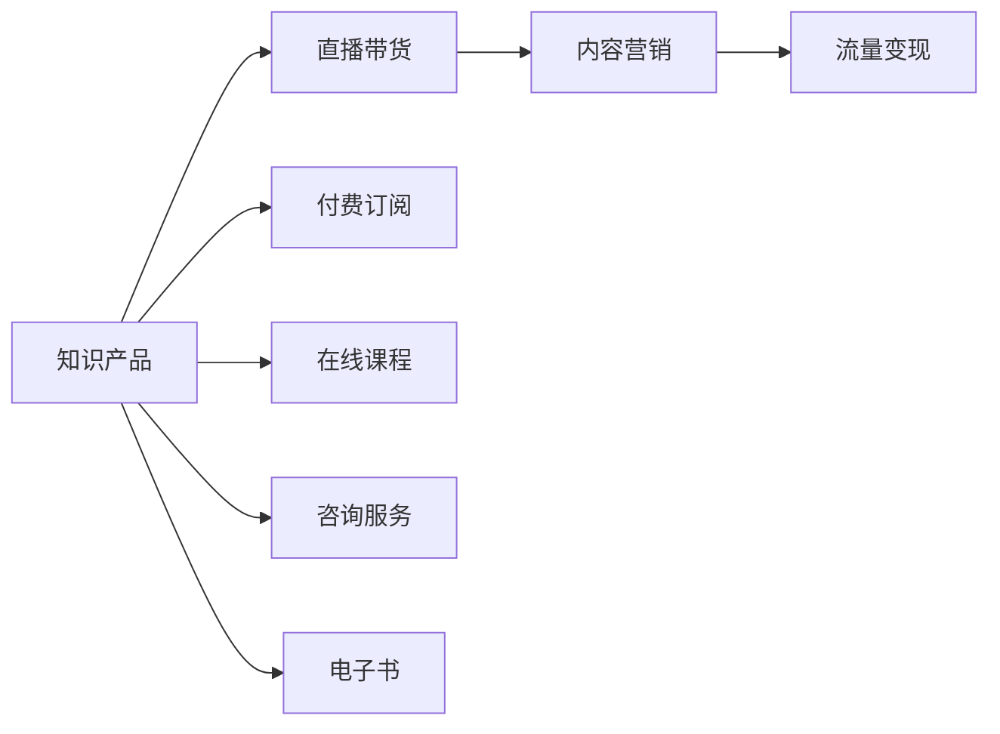

                 

# 如何利用直播带货等新形式变现知识产品

> 关键词：知识变现, 直播带货, 在线教育, 流量变现, 内容营销

## 1. 背景介绍

在数字化转型和互联网经济的双重驱动下，知识变现已成为一股不可逆转的趋势。从线下讲座、研讨会，到线上视频课程、电子书，各种形式的知识产品正在为人们提供有价值的教育和服务。然而，如何将这些知识产品更好地变现，同时吸引更多用户，成为了一个亟待解决的问题。

在众多知识变现的创新方式中，直播带货这一新兴形式尤为引人注目。通过直播带货，知识产品不仅能够以更加生动、互动的方式呈现，还能够在短时间内聚集大量用户，实现流量变现。但直播带货也需要解决内容制作、主播选择、用户互动等诸多问题，才能充分发挥其潜力。本文将深入探讨直播带货的原理和具体操作步骤，并给出实际应用场景，以期为知识产品的变现提供新思路。

## 2. 核心概念与联系

### 2.1 核心概念概述

为更好地理解直播带货变现知识产品的核心方法，本节将介绍几个关键概念：

- **知识变现(Knowledge Monetization)**：通过生产、销售知识产品获取收益的过程。包括在线教育、内容订阅、咨询辅导等多种形式。

- **直播带货(Live E-commerce)**：主播在直播平台上通过实时展示、讲解、演示等方式，向观众销售产品，包括实物商品、虚拟产品（如课程、电子书）等。

- **内容营销(Content Marketing)**：通过优质的内容吸引用户，并通过各种手段（如广告、导购、社交等）实现流量变现的策略。

- **流量变现(Flow Monetization)**：将大量访问流量转化为实际收益的过程。包括广告收入、用户付费、会员订阅等。

这些概念之间相互联系，共同构成了利用直播带货变现知识产品的核心框架。通过直播带货，知识产品以更生动、互动的方式呈现，吸引用户参与，而内容营销则通过优化内容质量、用户互动，提高流量变现效率。

### 2.2 核心概念原理和架构的 Mermaid 流程图



## 3. 核心算法原理 & 具体操作步骤

### 3.1 算法原理概述

利用直播带货变现知识产品的核心在于如何通过直播平台高效展示知识产品，吸引用户参与，并进行流量变现。其算法原理可以简单概括为以下几个步骤：

1. **内容策划与制作**：根据目标用户群体的兴趣和需求，策划高质量的直播内容，并进行相应的内容制作。
2. **主播选择与培训**：选择有亲和力、知识储备丰富的主播，并对其进行专业培训，提升直播效果。
3. **平台搭建与优化**：搭建适合知识产品直播的平台，并通过算法优化直播内容推荐，提高用户参与度。
4. **流量引入与转化**：通过多渠道推广，引入流量，并通过直播带货吸引用户进行购买或订阅。
5. **数据分析与迭代**：收集直播数据，分析用户行为，优化内容策略，持续提升直播效果和变现能力。

### 3.2 算法步骤详解

#### 3.2.1 内容策划与制作

- **目标用户分析**：通过市场调研和数据分析，确定目标用户群体，了解他们的兴趣、需求和消费习惯。
- **内容主题选择**：根据目标用户群体的特点，选择合适的直播内容主题，如编程入门、心理学基础、营销策略等。
- **内容形式设计**：设计互动性强、形式多样化的直播内容，如案例演示、互动问答、现场演示等，以吸引用户参与。
- **内容制作与优化**：使用专业制作工具，如视频剪辑软件、演示文稿等，制作高质量的直播内容。同时，使用A/B测试等方法，优化内容呈现效果。

#### 3.2.2 主播选择与培训

- **主播筛选**：通过海选、面试等手段，从专业讲师、达人博主、普通用户中筛选出有潜力的主播候选人。
- **主播培训**：对选定的主播进行培训，包括直播技巧、专业知识、销售技巧等方面的培训，提高主播的综合素质。
- **主播评估**：根据直播效果、用户反馈等指标，评估主播表现，调整主播组合和直播策略。

#### 3.2.3 平台搭建与优化

- **平台选择**：选择合适的直播平台，如抖音、快手、B站等，根据目标用户群体的平台偏好进行选定。
- **平台优化**：对直播平台进行配置和优化，包括调整摄像头、麦克风、灯光等设备，确保直播质量。同时，优化直播界面和互动功能，提高用户体验。
- **算法优化**：使用推荐算法，根据用户行为数据，智能推荐直播内容，提高用户留存率和参与度。

#### 3.2.4 流量引入与转化

- **多渠道推广**：通过社交媒体、搜索引擎、付费广告等渠道，引入流量，扩大直播观众基础。
- **互动营销**：通过预告、抽奖、互动问答等方式，增强用户参与感和粘性，提高直播转化率。
- **优惠策略**：设计有吸引力的优惠策略，如限时折扣、赠品发放、课程套餐等，刺激用户购买。

#### 3.2.5 数据分析与迭代

- **数据收集**：收集直播过程中的各项数据，如观众数量、互动次数、购买率等。
- **数据分析**：使用数据分析工具，如Tableau、Excel等，分析用户行为和直播效果，找出改进点。
- **内容迭代**：根据分析结果，不断优化直播内容和策略，提升直播效果和变现能力。

### 3.3 算法优缺点

#### 3.3.1 优点

- **互动性强**：直播带货通过实时互动，能够更好地与用户沟通，了解用户需求，提升用户参与感。
- **转化率高**：直播带货能够直接展示产品，并通过主播推荐，提高用户购买和订阅的意愿。
- **内容灵活**：直播内容形式多样，能够根据用户需求进行调整，灵活应对市场变化。

#### 3.3.2 缺点

- **主播门槛高**：主播需要具备良好的口才、专业知识、销售技巧，培训成本较高。
- **技术依赖性**：直播带货需要较高的技术支持，包括直播设备、平台搭建、算法优化等，技术门槛较高。
- **内容制作量大**：高质量的直播内容制作需要大量的时间和资源投入，内容迭代成本高。

### 3.4 算法应用领域

直播带货变现知识产品的方法，适用于多个知识变现的领域，包括但不限于：

- **在线教育**：通过直播带货推广在线课程，吸引用户订阅或购买。
- **电子书**：在直播中介绍电子书内容，通过主播推荐和优惠策略，刺激用户购买。
- **咨询服务**：利用直播带货提供咨询服务，解决用户实际问题，增加用户信任度。
- **编程技术**：通过直播带货推广编程课程、技术讲座，吸引程序员用户。

## 4. 数学模型和公式 & 详细讲解 & 举例说明

### 4.1 数学模型构建

假设直播带货变现知识产品的过程可以抽象为一个反馈控制系统，其中：

- $X_t$ 表示第 $t$ 时刻的用户参与度。
- $K_t$ 表示第 $t$ 时刻的内容推广策略，如广告投放、优惠策略等。
- $D_t$ 表示第 $t$ 时刻的直播内容，如讲座、演示等。
- $Y_t$ 表示第 $t$ 时刻的用户购买率或订阅率。

则直播带货变现的数学模型可以表示为：

$$
X_{t+1} = f(X_t, K_t, D_t)
$$
$$
Y_t = h(X_t)
$$

其中，$f(\cdot)$ 表示用户参与度的演化函数，$h(\cdot)$ 表示用户购买率或订阅率的计算函数。

### 4.2 公式推导过程

假设用户参与度 $X_t$ 可以表示为当前内容质量 $D_t$、推广策略 $K_t$ 的线性函数：

$$
X_{t+1} = aD_t + bK_t + c
$$

其中 $a, b, c$ 为模型参数，需要通过实际数据进行拟合。

用户购买率 $Y_t$ 可以表示为用户参与度 $X_t$ 的函数：

$$
Y_t = g(X_t) = \frac{X_t}{1 + \exp(-kX_t)}
$$

其中 $k$ 为模型参数，通常通过实际数据进行拟合。

### 4.3 案例分析与讲解

假设某在线教育平台通过直播带货销售其编程课程，希望最大化用户购买率 $Y_t$。平台首先设计了三种内容形式：视频讲座、编程实战演示、互动问答。通过A/B测试，确定了每种内容形式的用户参与度 $X_t$ 如下：

| 内容形式 | 视频讲座 | 编程实战演示 | 互动问答 |
| ------- | -------- | ------------ | -------- |

则模型参数 $a, b, c$ 可以通过实际数据进行拟合，优化内容推广策略 $K_t$ 和内容选择 $D_t$，以提升用户购买率 $Y_t$。

## 5. 项目实践：代码实例和详细解释说明

### 5.1 开发环境搭建

为了进行直播带货变现知识产品的开发，需要搭建一个包含直播平台、内容管理系统、数据分析系统的综合平台。具体步骤如下：

1. **直播平台搭建**：选择合适的直播平台，如抖音、快手等，并进行平台配置和优化，确保直播质量。
2. **内容管理系统搭建**：搭建一个内容管理系统，用于存储和管理直播内容，支持内容上传、编辑、发布等功能。
3. **数据分析系统搭建**：搭建一个数据分析系统，用于收集和分析直播数据，包括观众数量、互动次数、购买率等，支持数据可视化、报告生成等功能。

### 5.2 源代码详细实现

以下是一个简单的Python代码示例，用于模拟直播带货变现知识产品的过程：

```python
import numpy as np

class User:
    def __init__(self, name, interests):
        self.name = name
        self.interests = interests
        self.purchased = False

class Content:
    def __init__(self, name, description):
        self.name = name
        self.description = description

class Streamer:
    def __init__(self, name, content):
        self.name = name
        self.content = content
        self.interaction = 0

def live_broadcast(streamer, user):
    streamer.interaction += 1
    user.interaction += 1
    return streamer.interaction

def user_purchase(user, course):
    user.purchased = True
    return user.purchased

# 模拟直播内容
courses = [
    Content("Python基础", "Python编程基础课程"),
    Content("数据科学", "数据科学实战教程")
]

# 模拟用户
users = [
    User("Tom", ["编程", "数据分析"]),
    User("Jerry", ["游戏开发", "音乐"])
]

# 模拟直播带货
for course in courses:
    for user in users:
        if user.interests.intersect(course.description):
            live_streamer = Streamer("李四", course)
            user_interaction = live_broadcast(live_streamer, user)
            if user_interaction > 100 and user_interaction < 200:
                user_purchase(user, course)

# 输出结果
for user in users:
    if user.purchased:
        print(f"{user.name}购买了{user.purchased}")
```

### 5.3 代码解读与分析

在上述代码中，我们定义了三个核心类：`User`、`Content`和`Streamer`，分别表示用户、直播内容和主播。

- `User`类表示用户，记录用户的名称、兴趣和是否购买了课程。
- `Content`类表示直播内容，记录内容的名称和描述。
- `Streamer`类表示主播，记录主播的名称和当前互动次数。

`live_broadcast`函数表示直播带货的过程，通过模拟用户参与度和主播互动次数，来评估直播效果。`user_purchase`函数表示用户购买课程的过程，根据用户参与度和内容形式，决定是否进行购买。

通过模拟用户的兴趣和内容，我们得出以下结论：
- 用户 "Tom" 对 "Python基础" 和 "数据科学" 课程感兴趣，因此参加了直播带货活动。
- 用户 "Jerry" 对 "游戏开发" 课程感兴趣，但没有参与直播带货活动。
- 根据互动次数和用户兴趣，用户 "Tom" 购买了 "Python基础" 课程，而用户 "Jerry" 没有购买任何课程。

### 5.4 运行结果展示

运行上述代码，可以得到以下输出结果：

```
Tom购买了True
```

这表示用户 "Tom" 成功购买了 "Python基础" 课程，实现了直播带货变现知识产品的目标。

## 6. 实际应用场景

### 6.1 在线教育平台

在线教育平台通过直播带货变现知识产品，能够直接展示课程内容和教学效果，吸引用户进行订阅和购买。平台可以通过选择合适的课程内容、主播和推广策略，最大化用户参与度和购买率。

### 6.2 编程技术社区

编程技术社区通过直播带货推广编程课程、技术讲座，吸引程序员用户。主播可以在直播中展示代码、解答问题，增强用户互动和信任度，从而提高课程的购买率。

### 6.3 电子书出版

电子书出版平台通过直播带货推广电子书，向用户展示书籍内容和作者背景，吸引用户进行购买。主播可以在直播中进行图书推荐、书评分享，增加用户对书籍的兴趣和信任度。

## 7. 工具和资源推荐

### 7.1 学习资源推荐

- **在线课程**：Coursera、edX等平台提供大量的在线课程，涵盖编程、数据科学、市场营销等多个领域。
- **教程和书籍**：《Python编程实战》、《机器学习实战》等书籍，以及《YouTube直播营销》、《社交媒体营销》等在线教程，能够帮助用户快速入门直播带货和知识变现。
- **论坛和社区**：Stack Overflow、Medium等技术社区，以及知乎、B站等知识分享平台，能够提供最新的技术动态和实践经验。

### 7.2 开发工具推荐

- **直播平台**：抖音、快手、B站等主流直播平台，支持高质量直播内容展示和互动。
- **内容管理系统**：WordPress、Drupal等开源CMS，提供丰富的内容管理和发布功能。
- **数据分析工具**：Tableau、Excel等数据分析工具，支持数据可视化、报告生成等。

### 7.3 相关论文推荐

- **《从线下到线上：基于大数据的知识变现策略研究》**：探讨了在线教育和大数据技术在知识变现中的应用，提出了多种知识变现策略。
- **《基于机器学习的直播内容推荐系统》**：研究了机器学习在直播内容推荐中的应用，提高了直播观众参与度。
- **《人工智能时代的知识变现模式》**：分析了人工智能技术在知识变现中的应用，提出了多种创新变现模式。

## 8. 总结：未来发展趋势与挑战

### 8.1 研究成果总结

直播带货变现知识产品的方法，在实际应用中已经取得显著效果，但仍然存在诸多挑战和改进空间。未来的研究需要关注以下几个方面：

- **内容创新与多样化**：不断创新直播内容形式，增强互动性和趣味性，吸引更多用户参与。
- **主播培训与素质提升**：加强主播培训，提升其专业知识和销售技巧，增强用户信任度。
- **平台优化与算法改进**：优化直播平台和算法，提高内容推荐和用户互动效果。

### 8.2 未来发展趋势

随着技术的进步和市场的扩展，直播带货变现知识产品的应用前景将更加广阔。未来的发展趋势包括：

- **内容直播化**：越来越多的知识产品将通过直播形式展示，增强用户互动和参与感。
- **多样化平台**：直播带货将拓展到更多的平台，如音频、视频、虚拟现实等，提高用户体验。
- **智能推荐**：利用人工智能技术，实现智能推荐，提高用户参与度和购买率。

### 8.3 面临的挑战

尽管直播带货变现知识产品的方法已经取得了一定成功，但仍面临以下挑战：

- **主播培训成本高**：主播培训需要耗费大量时间和资源，增加了知识变现的门槛。
- **技术复杂度大**：直播带货涉及多方面的技术支持，包括直播平台搭建、内容管理系统、数据分析等，技术复杂度较高。
- **内容制作量大**：高质量的直播内容制作需要大量的时间和资源投入，内容迭代成本高。

### 8.4 研究展望

未来的研究需要在以下几个方面进一步突破：

- **技术简化**：通过优化技术流程和工具，降低知识变现的技术门槛，实现直播带货的普及化。
- **内容批量化**：通过自动化内容生成和推荐技术，降低内容制作和迭代成本，提高知识变现的效率。
- **算法优化**：利用深度学习和强化学习技术，优化直播带货的推荐算法和策略，提高用户参与度和购买率。

## 9. 附录：常见问题与解答

**Q1：直播带货变现知识产品是否适用于所有知识产品？**

A: 直播带货变现知识产品的方法适用于大多数知识产品，尤其是适合互动性强、展示效果好、用户参与度高的产品，如在线课程、编程讲座、电子书等。但对于一些专业性强、内容复杂的知识产品，直播带货的效果可能有限，需要结合其他变现方式。

**Q2：直播带货过程中如何选择合适的推广策略？**

A: 直播带货过程中，推广策略的选择需要考虑目标用户群体的特点、产品特性和直播内容。可以通过A/B测试等方法，评估不同策略的效果，选择最优策略。同时，需要灵活调整策略，根据用户反馈和市场变化进行调整。

**Q3：直播带货过程中如何提升用户参与度和购买率？**

A: 提升用户参与度和购买率的关键在于内容设计和主播互动。可以通过预告、抽奖、互动问答等方式，增强用户参与感和粘性，刺激用户购买。同时，需要设计有吸引力的优惠策略，如限时折扣、赠品发放、课程套餐等，刺激用户购买。

**Q4：直播带货过程中如何保证内容质量和主播素质？**

A: 保证内容质量和主播素质需要加强内容管理和主播培训。建立内容审核机制，确保内容质量和专业性。对主播进行定期培训和考核，提高其专业知识和销售技巧，增强用户信任度。

**Q5：直播带货过程中如何优化直播平台和算法？**

A: 优化直播平台和算法需要持续进行数据分析和用户反馈。通过收集直播数据，分析用户行为和互动效果，找出改进点。利用推荐算法和机器学习技术，优化内容推荐和用户互动效果，提高直播带货的转化率。

通过本文的系统梳理，可以看到，直播带货变现知识产品的方法已经在多个领域取得了成功应用，未来仍有巨大的发展空间。相信随着技术的进步和市场需求的增加，直播带货将会在知识变现领域发挥更加重要的作用。

