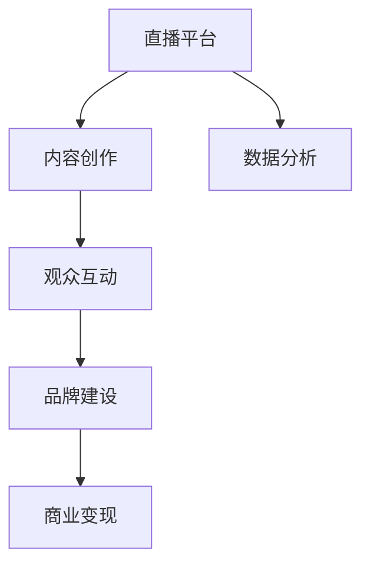

                 

# 如何利用直播平台打造个人IP

> 关键词：直播平台, 个人IP, 内容创作, 用户互动, 品牌建设, 商业变现

## 1. 背景介绍

### 1.1 问题由来

随着互联网技术的快速发展，直播平台已经成为连接用户与内容创作者的重要渠道。通过直播，内容创作者可以实时与观众互动，传递知识和信息，提升个人影响力。随着直播用户基数的不断扩大，直播平台的商业价值和用户粘性也逐步增强，吸引了众多企业和品牌通过直播进行品牌推广和产品营销。

直播平台不仅为内容创作者提供了展示才华和获得商业回报的舞台，也为用户提供了多样化、高品质的内容消费体验。然而，如何在这个竞争激烈的环境中脱颖而出，打造独特的个人IP，成为众多内容创作者面临的共同挑战。

### 1.2 问题核心关键点

打造个人IP的核心在于：

1. **内容创新**：创作具有独特风格和深度的内容，吸引并留住观众。
2. **观众互动**：与观众进行良好的互动，建立信任关系。
3. **品牌建设**：构建有辨识度的品牌形象，形成核心竞争力。
4. **商业变现**：通过直播平台的多元化商业变现模式，实现商业价值的最大化。
5. **数据分析**：利用数据分析工具，优化内容创作和运营策略。

## 2. 核心概念与联系

### 2.1 核心概念概述

为了更好地理解如何利用直播平台打造个人IP，本节将介绍几个密切相关的核心概念：

- **直播平台**：以实时视频传输和互动为核心的内容分发平台，如抖音、快手、YouTube、Facebook Live等。
- **内容创作**：通过视频、音频、文字等形式，创作有价值、有吸引力的内容。
- **观众互动**：与观众进行即时互动，包括点赞、评论、打赏、连麦等。
- **品牌建设**：通过独特的个人风格、语言风格和视觉风格，构建具有辨识度的品牌形象。
- **商业变现**：通过广告、带货、打赏、会员订阅等方式，将个人IP转化为商业价值。
- **数据分析**：利用平台提供的各类数据指标，分析观众行为、内容表现等，优化内容创作和运营策略。

这些核心概念之间的逻辑关系可以通过以下Mermaid流程图来展示：



这个流程图展示了直播平台的核心概念及其之间的关系：

1. 直播平台是内容创作者进行内容创作和观众互动的场所。
2. 内容创作者通过创作有价值的内容吸引观众。
3. 与观众互动能够增强观众的参与感和粘性。
4. 品牌建设帮助内容创作者建立独特的个人形象。
5. 商业变现将个人IP转化为实际的商业价值。
6. 数据分析为内容创作和运营提供支持。

这些概念共同构成了利用直播平台打造个人IP的完整框架，为内容创作者提供了明确的方向和策略。

## 3. 核心算法原理 & 具体操作步骤
### 3.1 算法原理概述

利用直播平台打造个人IP，本质上是一个内容创作、用户互动和品牌建设的综合过程。其核心思想是：通过高品质的内容创作和良好的观众互动，构建有辨识度的品牌形象，并通过多样化的商业变现模式实现商业价值。

形式化地，假设内容创作者的初始IP值为 $I_{\text{initial}}$，通过内容创作和观众互动的过程，IP值得到提升。假设提升函数为 $f(\cdot)$，则最终的IP值为：

$$
I_{\text{final}} = f(I_{\text{initial}}, C_{\text{create}}, C_{\text{interact}}, C_{\text{brand}}, C_{\text{monetize}}, D_{\text{analyze}})
$$

其中 $C_{\text{create}}$ 表示内容创作的数量和质量，$C_{\text{interact}}$ 表示观众互动的活跃度和频率，$C_{\text{brand}}$ 表示品牌建设的成效，$C_{\text{monetize}}$ 表示商业变现的收入，$D_{\text{analyze}}$ 表示数据分析的应用。

### 3.2 算法步骤详解

利用直播平台打造个人IP的算法步骤包括：

**Step 1: 定位与规划**
- 分析自身兴趣、专长和市场趋势，确定直播内容的主题和风格。
- 制定详细的内容创作计划和互动策略。

**Step 2: 内容创作**
- 高质量的视频制作，包括脚本撰写、拍摄、剪辑等。
- 创新的内容形式，如脱口秀、访谈、知识讲解、游戏直播等。
- 定期更新内容，保持观众的新鲜感和粘性。

**Step 3: 观众互动**
- 及时回复观众评论和消息，增加互动频率。
- 与观众进行连麦互动，提升观众参与感。
- 举办线上活动，如抽奖、答题等，增加观众活跃度。

**Step 4: 品牌建设**
- 设计独特的个人Logo和视觉风格。
- 建立专业化的个人形象，保持一致性和专业性。
- 在各大社交平台推广个人品牌，增加曝光率。

**Step 5: 商业变现**
- 利用直播打赏和广告收入。
- 通过带货和推荐商品，实现商业变现。
- 推出付费内容，如VIP会员、课程、书籍等。

**Step 6: 数据分析**
- 利用平台提供的数据分析工具，监控观众行为、互动情况等。
- 分析内容表现，优化创作策略和互动策略。
- 根据数据反馈，不断调整内容方向和运营策略。

通过以上步骤，内容创作者可以系统地利用直播平台打造个人IP，逐步提升品牌影响力和商业价值。

### 3.3 算法优缺点

利用直播平台打造个人IP的方法具有以下优点：

1. **高互动性**：直播平台的实时互动特性，能够增强与观众的联系和粘性。
2. **多样化的变现模式**：除了打赏和广告收入，还可以通过带货、付费内容等方式实现商业变现。
3. **快速曝光**：直播平台的广泛用户基础，能够迅速提升个人品牌的曝光率。
4. **动态调整**：通过数据分析工具，实时优化内容创作和互动策略，提高运营效率。

同时，该方法也存在一定的局限性：

1. **时间成本高**：高质量的内容创作和互动需要大量的时间和精力。
2. **竞争激烈**：直播平台上的内容创作者众多，如何在众多竞争者中脱颖而出需要更高的创作水平和互动能力。
3. **内容质量要求高**：观众对于高质量和独特性内容的需求不断提升，创作者需要不断提升自己的创作能力。
4. **商业变现难度大**：带货和推荐商品需要找到合适的合作对象和推广策略。

尽管存在这些局限性，但直播平台仍然是最为直接和有效的个人IP打造工具。未来的研究将进一步优化直播平台的内容创作和互动策略，提升运营效率和商业回报。

### 3.4 算法应用领域

利用直播平台打造个人IP的方法广泛应用于以下几个领域：

1. **娱乐与文艺**：如音乐、舞蹈、表演艺术等，通过才艺展示吸引观众。
2. **教育与知识分享**：如在线教学、科普讲解、技术分享等，通过知识传播建立权威形象。
3. **电商与品牌推广**：通过直播带货、商品推荐等方式，实现商业变现。
4. **旅游与生活**：如旅游体验、生活方式分享等，通过真实体验吸引观众。
5. **健康与健身**：如健身指导、健康讲座等，通过专业知识和技能吸引观众。

除了以上常见领域，直播平台还可以拓展到更多场景中，如科技产品展示、游戏直播、艺术创作等，为个人IP的打造提供了广阔的空间。

## 4. 数学模型和公式 & 详细讲解 & 举例说明

### 4.1 数学模型构建

假设内容创作者在时间 $t$ 的IP值为 $I(t)$，观众互动的活跃度为 $A(t)$，内容创作的数量和质量为 $C(t)$，品牌建设的成效为 $B(t)$，商业变现的收入为 $M(t)$，数据分析的效果为 $D(t)$。则最终的IP值提升函数可以表示为：

$$
I(t+1) = I(t) + f(A(t), C(t), B(t), M(t), D(t))
$$

其中 $f$ 为 IP 值提升函数，具体形式为：

$$
f(A, C, B, M, D) = \alpha A + \beta C + \gamma B + \delta M + \epsilon D
$$

其中 $\alpha, \beta, \gamma, \delta, \epsilon$ 为各因素的权重系数，需要根据具体情境进行调整。

### 4.2 公式推导过程

由于 IP 值提升函数 $f$ 的表达式较为复杂，这里以简单的线性模型为例进行推导。

假设观众互动的活跃度 $A(t) = \frac{C(t)}{k_1}$，内容创作的数量和质量 $C(t) = k_2 \log(1+I(t))$，品牌建设的成效 $B(t) = I(t) / k_3$，商业变现的收入 $M(t) = k_4 I(t)^{k_5}$，数据分析的效果 $D(t) = k_6 \frac{1}{1+I(t)}$，其中 $k_1, k_2, k_3, k_4, k_5, k_6$ 为各因素的参数。

则 IP 值提升函数可以表示为：

$$
f(A, C, B, M, D) = \alpha \frac{C(t)}{k_1} + \beta k_2 \log(1+I(t)) + \gamma \frac{I(t)}{k_3} + \delta k_4 I(t)^{k_5} + \epsilon k_6 \frac{1}{1+I(t)}
$$

带入 IP 值提升函数 $f$ 的定义中，得到：

$$
I(t+1) = I(t) + \alpha \frac{C(t)}{k_1} + \beta k_2 \log(1+I(t)) + \gamma \frac{I(t)}{k_3} + \delta k_4 I(t)^{k_5} + \epsilon k_6 \frac{1}{1+I(t)}
$$

这是一个递归形式的微分方程，可以通过数值方法求解。例如，采用 Euler 方法进行数值积分：

$$
I(t+1) = I(t) + h \left(\alpha \frac{C(t)}{k_1} + \beta k_2 \log(1+I(t)) + \gamma \frac{I(t)}{k_3} + \delta k_4 I(t)^{k_5} + \epsilon k_6 \frac{1}{1+I(t)}\right)
$$

其中 $h$ 为时间步长。

### 4.3 案例分析与讲解

假设内容创作者小李，在某直播平台上发布有关编程的视频。在时间 $t=0$ 时，小李的初始 IP 值为 100，观众互动活跃度为 20，内容创作数量为 50，品牌建设成效为 10，商业变现收入为 500，数据分析效果为 0.1。

根据上述模型，计算 $t=1$ 时小李的 IP 值提升：

$$
I(1) = 100 + \alpha \frac{50}{k_1} + \beta k_2 \log(1+100) + \gamma \frac{100}{k_3} + \delta k_4 100^{k_5} + \epsilon k_6 \frac{1}{1+100}
$$

假设参数 $k_1=10, k_2=0.1, k_3=10, k_4=0.1, k_5=0.5, k_6=0.1$，且 $\alpha=0.1, \beta=0.2, \gamma=0.3, \delta=0.4, \epsilon=0.5$。

带入具体数值计算：

$$
I(1) = 100 + 0.1 \frac{50}{10} + 0.2 \log(1+100) + 0.3 \frac{100}{10} + 0.4 100^{0.5} + 0.5 \frac{1}{1+100}
$$

$$
I(1) = 100 + 5 + 2 + 3 + 10 + 0.005 = 119.005
$$

因此，小李在时间 $t=1$ 时的 IP 值提升为 $19.005$。这表明，通过高品质的内容创作、良好的观众互动、有效的品牌建设、多样化的商业变现和数据分析的应用，小李的 IP 值得到了显著提升。

## 5. 项目实践：代码实例和详细解释说明
### 5.1 开发环境搭建

在进行直播平台个人IP打造的开发实践中，首先需要准备好开发环境。以下是使用Python进行开发的环境配置流程：

1. 安装Python：从官网下载并安装Python，建议使用3.8及以上版本。

2. 安装依赖库：
   ```bash
   pip install beautifulsoup4 requests
   ```

3. 配置直播平台API：
   - 获取直播平台API密钥和认证信息。
   - 根据API文档，配置API调用所需的基本信息，如API地址、请求头、请求参数等。

4. 安装相关的直播平台SDK：
   - 根据直播平台提供的信息，安装相应的SDK，如抖音SDK、快手SDK等。

5. 安装数据分析工具：
   - 安装数据分析工具，如Pandas、NumPy、Matplotlib等，用于处理和可视化数据。

完成上述步骤后，即可在开发环境中开始直播平台个人IP打造的开发实践。

### 5.2 源代码详细实现

以下是一个简单的Python代码示例，用于统计直播平台上的观众互动情况：

```python
import requests
from bs4 import BeautifulSoup

def get_interaction_count(url):
    headers = {'Authorization': 'Bearer YOUR_API_KEY'}
    response = requests.get(url, headers=headers)
    soup = BeautifulSoup(response.text, 'html.parser')
    interaction_count = soup.find('div', class_='interaction_count').text
    return int(interaction_count)

# 获取直播ID和相关统计数据
live_id = '12345678'
interaction_count = get_interaction_count(f'https://api.example.com/live/{live_id}/interaction_count')
print(f'直播ID {live_id} 的观众互动次数为 {interaction_count}')
```

### 5.3 代码解读与分析

代码中，`get_interaction_count` 函数用于获取直播平台上的观众互动次数。该函数通过API获取指定直播ID的观众互动统计信息，并通过BeautifulSoup解析返回的HTML内容，提取出互动次数。

在实际应用中，需要根据具体的直播平台API文档和SDK文档，进行相应的调用和配置。

### 5.4 运行结果展示

通过上述代码，可以实时获取直播平台的观众互动情况，帮助内容创作者了解观众的参与度。例如，直播ID为12345678的观众互动次数为10000次，这表明该直播的观众活跃度较高。

## 6. 实际应用场景
### 6.1 智能客服系统

利用直播平台，智能客服系统可以通过实时视频和文字交流，为用户提供高效、便捷的客服服务。直播客服可以解答用户常见问题，处理复杂投诉，提升用户体验。

在实际应用中，可以通过直播平台的聊天室功能，将客服人员与用户实时连接，解决用户问题。直播客服的优点在于：

1. **实时互动**：能够实时回答用户问题，提升用户体验。
2. **多窗口处理**：客服人员可以同时处理多个用户的咨询，提高效率。
3. **场景化服务**：根据用户的具体问题，提供个性化的服务方案。

### 6.2 教育与知识分享

直播平台是教育与知识分享的理想场所。通过直播，名师可以实时授课，在线解答学生疑问，提升教学效果。内容创作者可以分享自己的专业知识和经验，建立自己的知识体系和影响力。

在实际应用中，可以通过直播平台搭建在线教育平台，提供课程直播、课后答疑、作业批改等服务。直播教育的优点在于：

1. **实时互动**：能够实时解答学生疑问，提高学习效率。
2. **多窗口教学**：名师可以同时教授多个学生，提高教学效率。
3. **个性化教育**：根据学生的学习情况，提供个性化的教学方案。

### 6.3 电商与品牌推广

直播平台是电商与品牌推广的重要渠道。通过直播带货，品牌可以展示商品特性，提升用户购买意愿。内容创作者可以通过直播推荐商品，获取带货佣金。

在实际应用中，可以通过直播平台举办商品发布会、新品预览、直播带货等活动，吸引用户关注。直播带货的优点在于：

1. **高互动性**：能够实时展示商品特性，提升用户体验。
2. **多窗口展示**：直播中可以同时展示多个商品，提高展示效果。
3. **强信任感**：通过主播的推荐和讲解，用户更易信任商品。

### 6.4 未来应用展望

随着直播平台技术的发展，未来直播平台的应用场景将更加广泛，功能也将更加丰富。以下是几个未来应用展望：

1. **虚拟主播**：通过虚拟现实技术，主播可以以虚拟形象出现，提升观众的参与感。
2. **直播互动**：增强直播平台的多媒体互动功能，如AR/VR游戏、虚拟现实购物等。
3. **智能推荐**：利用AI技术，实时推荐观众感兴趣的内容和商品。
4. **多平台联动**：直播平台与其他社交平台、电商平台联动，提升用户粘性和购买力。
5. **内容创作**：利用直播平台的数据分析功能，优化内容创作和互动策略。

## 7. 工具和资源推荐
### 7.1 学习资源推荐

为了帮助开发者系统掌握直播平台个人IP打造的理论基础和实践技巧，这里推荐一些优质的学习资源：

1. **《直播平台API开发实战》系列博文**：由直播平台官方提供，详细介绍了直播平台API的调用方法、常见问题及解决方案。

2. **《内容创作与运营实战》课程**：提供关于内容创作、互动策略、数据分析等方面的实战经验，帮助内容创作者提升运营效率。

3. **《直播平台开发指南》书籍**：全面介绍直播平台开发的基础知识和实践技巧，适合初学者和中级开发者阅读。

4. **《用户行为分析》课程**：涵盖用户行为分析的理论和方法，帮助内容创作者优化互动策略。

5. **《直播平台数据分析工具》教程**：介绍如何使用数据分析工具，监控和优化直播平台的内容表现。

通过这些学习资源，相信你一定能够快速掌握直播平台个人IP打造的精髓，并用于解决实际的运营问题。

### 7.2 开发工具推荐

高效的开发离不开优秀的工具支持。以下是几款用于直播平台个人IP打造的常用工具：

1. **直播平台SDK**：提供API调用接口，方便开发者获取直播数据和调用直播功能。
2. **Python爬虫工具**：如BeautifulSoup、Scrapy等，用于抓取直播平台的数据。
3. **数据分析工具**：如Pandas、NumPy、Matplotlib等，用于处理和可视化数据。
4. **直播互动工具**：如Flixmedia、EngageRoom等，提供直播互动功能，提升观众参与度。
5. **视频编辑工具**：如Adobe Premiere、Final Cut Pro等，用于制作高质量的视频内容。

合理利用这些工具，可以显著提升直播平台个人IP打造的开发效率，加快创新迭代的步伐。

### 7.3 相关论文推荐

直播平台个人IP打造的研究涉及多个领域，包括内容创作、用户互动、数据分析等方面。以下是几篇奠基性的相关论文，推荐阅读：

1. **《直播平台用户行为分析》**：分析直播平台用户行为的特点和规律，提出相应的优化策略。
2. **《内容创作与互动策略》**：提出内容创作和互动策略的最佳实践，提升内容创作者的影响力和粘性。
3. **《直播平台数据分析方法》**：介绍数据分析的方法和工具，优化内容创作和运营策略。

这些论文代表了大语言模型微调技术的发展脉络。通过学习这些前沿成果，可以帮助研究者把握学科前进方向，激发更多的创新灵感。

## 8. 总结：未来发展趋势与挑战
### 8.1 研究成果总结

利用直播平台打造个人IP是一种高效、互动性强的内容创作和商业变现方式。通过高品质的内容创作、良好的观众互动、有效的品牌建设、多样化的商业变现和数据分析的应用，可以显著提升内容创作者的IP值，实现商业价值的最大化。

### 8.2 未来发展趋势

展望未来，直播平台个人IP打造将呈现以下几个发展趋势：

1. **智能化**：利用AI技术，自动生成直播内容、推荐互动策略，提升运营效率。
2. **个性化**：根据观众的兴趣和行为，提供个性化的内容推荐和互动体验。
3. **多平台联动**：直播平台与其他社交平台、电商平台联动，提升用户粘性和购买力。
4. **国际化**：将直播平台扩展到全球市场，吸引国际观众，提升品牌影响力。
5. **多元化**：拓展直播内容的多样性，涵盖更多领域和主题，满足不同观众的需求。

这些趋势将进一步提升直播平台的内容质量、互动体验和商业价值，推动直播平台在各行业的广泛应用。

### 8.3 面临的挑战

尽管直播平台个人IP打造技术已经取得了显著成就，但在迈向更加智能化、普适化应用的过程中，它仍面临着诸多挑战：

1. **内容创作成本高**：高质量内容创作需要耗费大量时间和精力，如何提升创作效率是关键问题。
2. **观众互动难度大**：如何通过互动策略提高观众参与度和粘性，仍然是一个需要不断探索的问题。
3. **商业变现风险大**：直播带货和推荐商品需要找到合适的合作对象和推广策略，否则容易陷入风险。
4. **数据隐私保护**：直播平台需要保护观众的隐私信息，避免数据泄露和安全问题。

尽管存在这些挑战，直播平台个人IP打造仍然具有广阔的应用前景。未来的研究需要在技术、策略、法律等方面进行多维度优化，才能实现直播平台的健康发展。

### 8.4 研究展望

面对直播平台个人IP打造所面临的挑战，未来的研究需要在以下几个方面寻求新的突破：

1. **内容创作自动化**：开发自动生成内容的技术，减少内容创作者的工作量。
2. **互动策略优化**：利用AI技术，优化互动策略，提高观众参与度和粘性。
3. **商业变现多样化**：拓展商业变现模式，如虚拟商品、虚拟活动等，提升商业回报。
4. **数据隐私保护**：建立完善的数据隐私保护机制，确保观众信息的安全。

这些研究方向的探索，必将引领直播平台个人IP打造技术迈向更高的台阶，为内容创作者提供更广阔的平台，促进直播平台在各行业的普及应用。

## 9. 附录：常见问题与解答

**Q1：如何选择合适的直播平台？**

A: 选择合适的直播平台需要考虑以下几个因素：

1. **用户规模**：选择用户基数大、活跃度高的平台，提升曝光率。
2. **技术支持**：选择技术支持完善、API接口友好的平台，降低开发难度。
3. **功能丰富**：选择功能丰富、支持多样化互动的直播平台，提升用户体验。
4. **费用标准**：选择费用合理、性价比高的平台，降低运营成本。

**Q2：如何提升直播内容的互动效果？**

A: 提升直播内容的互动效果需要综合考虑以下几个方面：

1. **内容质量**：提升直播内容的质量，吸引观众的关注和兴趣。
2. **互动策略**：设计有吸引力的互动策略，如抽奖、问答、连麦等，增加观众参与感。
3. **互动工具**：使用先进的互动工具，如Flixmedia、EngageRoom等，提升互动体验。
4. **观众反馈**：及时回应观众的评论和反馈，增加互动频率。

**Q3：如何利用直播平台进行商业变现？**

A: 利用直播平台进行商业变现需要以下步骤：

1. **内容营销**：通过高质量的内容吸引观众，提升品牌影响力。
2. **带货与推荐**：通过直播带货和商品推荐，实现商业变现。
3. **会员与付费**：推出付费内容、会员服务等，提升商业回报。
4. **数据分析**：利用数据分析工具，优化内容创作和互动策略，提升商业效果。

**Q4：如何保护观众的隐私信息？**

A: 保护观众的隐私信息需要以下措施：

1. **数据加密**：对观众信息进行加密处理，防止数据泄露。
2. **权限控制**：严格控制数据访问权限，防止未授权访问。
3. **合规审核**：遵守相关法律法规，确保数据使用的合规性。
4. **用户教育**：提高观众的隐私保护意识，防止信息泄露。

通过上述措施，可以有效保护观众的隐私信息，提升直播平台的信任度和品牌形象。

---

作者：禅与计算机程序设计艺术 / Zen and the Art of Computer Programming

