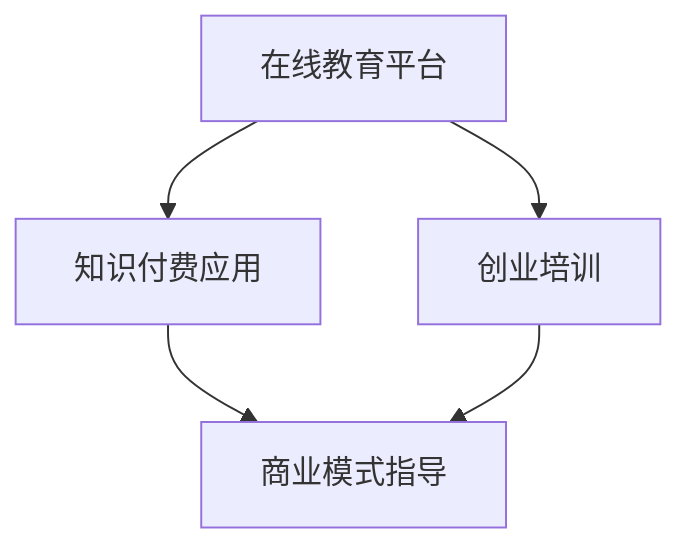

                 

# 如何利用知识付费实现在线创业培训与商业模式指导？

> 关键词：知识付费,在线教育,创业培训,商业模式,市场分析,数字营销

## 1. 背景介绍

在互联网和移动互联网的推动下，知识付费正成为一种新的经济现象。这一趋势不仅体现了知识的价值，也推动了新一轮的商业模式创新。通过在线教育平台和知识付费应用，创业者可以获得丰富的学习资源和商业指导，加速自身成长，提升创业成功率。

### 1.1 知识付费的兴起

知识付费兴起的背景是信息过载和知识碎片化。在数字化时代，用户面临海量信息的轰炸，获取有价值信息的成本增加。同时，用户对信息质量的要求也日益提高，不再满足于简单的信息浏览，而更倾向于通过付费获取高质量、系统化的知识内容。

### 1.2 在线教育平台和知识付费应用

在线教育平台如Coursera、Udacity、edX等，以及知识付费应用如得到、喜马拉雅、知乎live等，已经成为知识付费市场的重要玩家。这些平台通过聚合优质教育资源和课程内容，吸引了大量用户，并形成了稳定的盈利模式。

### 1.3 创业者对知识的需求

创业者在创业过程中需要不断学习新知识、掌握新技能，以应对市场变化和竞争压力。因此，在线教育平台和知识付费应用成为了创业者的重要学习工具。通过这些平台，创业者可以获取行业前沿资讯、市场分析报告、商业案例等，辅助决策和实践。

## 2. 核心概念与联系

### 2.1 核心概念概述

为更好地理解在线创业培训与商业模式指导的实现机制，本节将介绍几个关键概念：

- 在线教育平台：通过互联网提供教育服务的平台，如MOOC、直播课、视频课程等。
- 知识付费应用：通过订阅、购买等方式向用户提供知识内容的平台，如得到、喜马拉雅等。
- 创业培训：针对创业者设计的专业培训课程，包括市场分析、商业模式构建、融资技巧、运营管理等。
- 商业模式指导：提供企业运营、市场策略、盈利模式等商业指导，帮助创业者制定并优化商业模式。

这些概念之间的逻辑关系可以通过以下Mermaid流程图来展示：



这个流程图展示了在线教育平台、知识付费应用、创业培训、商业模式指导等概念之间的联系：

1. 在线教育平台和知识付费应用是知识传播的媒介，提供了丰富的课程和内容资源。
2. 创业培训课程往往通过这些平台进行推广和交付。
3. 商业模式指导通常与创业培训结合，帮助创业者构建和优化商业模型。

## 3. 核心算法原理 & 具体操作步骤
### 3.1 算法原理概述

在线创业培训与商业模式指导的实现，本质上是一种基于用户需求和学习行为的智能推荐算法。其核心思想是：通过分析用户的行为数据，推荐最适合该用户的学习资源和商业指导内容，帮助其提升学习效果和创业成功率。

形式化地，假设用户集合为 $U$，课程集合为 $C$，用户对课程的评分集合为 $R$。则用户 $u \in U$ 对课程 $c \in C$ 的评分 $r_{u,c}$ 可以通过如下矩阵分解得到：

$$
r_{u,c} = \sum_{p=1}^P \alpha_{u,p} \beta_{p,c}
$$

其中 $P$ 为潜在因子数量，$\alpha_{u,p}$ 和 $\beta_{p,c}$ 分别表示用户 $u$ 和课程 $c$ 在潜在因子 $p$ 上的权重。通过矩阵分解，我们可以得到用户 $u$ 和课程 $c$ 的潜在因子表示，进而构建用户 $u$ 对课程 $c$ 的评分预测模型。

### 3.2 算法步骤详解

基于上述理论，在线创业培训与商业模式指导的推荐算法主要包括以下几个关键步骤：

**Step 1: 数据准备**
- 收集用户行为数据，包括课程选择、学习进度、学习时间等。
- 收集课程内容和用户评分数据，构建评分矩阵。

**Step 2: 潜在因子分解**
- 使用矩阵分解算法（如奇异值分解SVD）对评分矩阵进行分解，得到用户和课程的潜在因子表示。
- 将潜在因子表示作为用户对课程的评分预测值，用于后续推荐。

**Step 3: 推荐模型训练**
- 根据预测值和实际评分，计算预测误差。
- 使用优化算法（如随机梯度下降SGD）更新潜在因子的权重，最小化预测误差。

**Step 4: 推荐算法应用**
- 对新用户和新课程进行评分预测。
- 根据预测值和评分阈值，推荐最适合用户的创业培训和商业模式指导课程。

**Step 5: 用户反馈收集与模型优化**
- 收集用户对推荐内容的反馈，包括课程选择、学习效果等。
- 根据反馈数据，重新训练推荐模型，优化预测效果。

### 3.3 算法优缺点

基于用户行为的数据驱动推荐算法，具有以下优点：
1. 高效精准：通过分析用户行为数据，能够实时推荐最适合用户的课程和内容。
2. 灵活多变：推荐系统可以根据用户反馈进行动态调整，不断优化推荐结果。
3. 提升效果：个性化推荐能够显著提高用户的学习效果和满意度。

但该方法也存在一些局限性：
1. 数据隐私：用户行为数据涉及隐私，需要严格保护，防止数据泄露。
2. 数据偏差：用户行为数据可能存在偏差，导致推荐结果不准确。
3. 模型复杂：推荐模型通常包含大量参数，需要较大的计算资源。
4. 动态变化：用户需求和行为可能随时间变化，模型需要定期更新。

尽管存在这些局限性，但推荐算法仍然是实现在线创业培训与商业模式指导的核心手段，具有广泛的应用前景。

### 3.4 算法应用领域

在线创业培训与商业模式指导的推荐算法，在以下领域中有着广泛的应用：

- 在线教育平台：如Coursera、Udacity等，通过推荐系统推荐最适合用户的课程。
- 知识付费应用：如得到、喜马拉雅等，推荐用户感兴趣的优质内容。
- 创业孵化器：如Y Combinator、Techstars等，根据创业者需求推荐适合的培训课程和商业指导。
- 创业社区：如斜杠青年、创业邦等，提供个性化推荐，帮助创业者获取有用的信息。

## 4. 数学模型和公式 & 详细讲解  
### 4.1 数学模型构建

本节将使用数学语言对在线创业培训与商业模式指导的推荐算法进行更加严格的刻画。

假设用户集合为 $U$，课程集合为 $C$，用户对课程的评分集合为 $R$，用户 $u \in U$ 对课程 $c \in C$ 的评分 $r_{u,c}$ 可以通过如下矩阵分解得到：

$$
r_{u,c} = \sum_{p=1}^P \alpha_{u,p} \beta_{p,c}
$$

其中 $P$ 为潜在因子数量，$\alpha_{u,p}$ 和 $\beta_{p,c}$ 分别表示用户 $u$ 和课程 $c$ 在潜在因子 $p$ 上的权重。

通过矩阵分解，我们可以得到用户 $u$ 和课程 $c$ 的潜在因子表示，进而构建用户 $u$ 对课程 $c$ 的评分预测模型。

### 4.2 公式推导过程

以用户 $u$ 对课程 $c$ 的评分预测为例，我们进行如下推导：

1. 评分矩阵 $R$ 的奇异值分解：

$$
R = U \Sigma V^T
$$

其中 $U \in \mathbb{R}^{m \times P}, V \in \mathbb{R}^{n \times P}, \Sigma \in \mathbb{R}^{P \times P}$，$m$ 和 $n$ 分别为用户和课程的数量。

2. 用户 $u$ 和课程 $c$ 的潜在因子表示：

$$
\alpha_{u,p} = \langle \alpha_p, U^T r_u \rangle
$$

$$
\beta_{p,c} = \langle \beta_p, V^T r_c \rangle
$$

其中 $\alpha_p, \beta_p$ 为潜在因子的权重向量，$r_u, r_c$ 分别为用户和课程的评分向量。

3. 用户 $u$ 对课程 $c$ 的评分预测：

$$
\hat{r}_{u,c} = \sum_{p=1}^P \alpha_{u,p} \beta_{p,c}
$$

其中 $\alpha_{u,p}$ 和 $\beta_{p,c}$ 分别为用户 $u$ 和课程 $c$ 在潜在因子 $p$ 上的权重。

通过上述推导，我们可以得到用户对课程的评分预测公式，用于后续推荐系统的构建。

### 4.3 案例分析与讲解

以下我们以Coursera平台为例，具体分析推荐系统的实现细节。

**Coursera推荐系统案例**

Coursera平台通过推荐系统，帮助用户发现感兴趣和适合自己的课程。其推荐系统主要基于用户行为数据和课程评分数据，采用协同过滤和内容过滤相结合的推荐策略。

1. 用户行为数据：Coursera记录用户浏览课程、加入课程、完成课程等行为数据，形成用户行为序列。

2. 课程评分数据：Coursera收集用户对课程的评分数据，形成评分矩阵 $R$。

3. 协同过滤推荐：Coursera使用基于矩阵分解的协同过滤算法，根据用户行为数据和评分矩阵，生成用户对课程的评分预测值。

4. 内容过滤推荐：Coursera还根据课程特征，如课程名称、难度、教师等，计算课程之间的相似度，生成课程推荐列表。

5. 综合推荐：Coursera将协同过滤推荐和内容过滤推荐相结合，生成最终的推荐结果。

通过这一推荐系统，Coursera能够显著提升用户满意度和课程完成率，促进平台的稳定增长。

## 5. 项目实践：代码实例和详细解释说明
### 5.1 开发环境搭建

在进行推荐系统开发前，我们需要准备好开发环境。以下是使用Python进行Scikit-learn开发的环境配置流程：

1. 安装Anaconda：从官网下载并安装Anaconda，用于创建独立的Python环境。

2. 创建并激活虚拟环境：
```bash
conda create -n recommend-env python=3.8 
conda activate recommend-env
```

3. 安装Scikit-learn：使用conda安装Scikit-learn库。
```bash
conda install scikit-learn
```

4. 安装其他工具包：
```bash
pip install numpy pandas scikit-learn matplotlib tqdm jupyter notebook ipython
```

完成上述步骤后，即可在`recommend-env`环境中开始推荐系统开发。

### 5.2 源代码详细实现

下面我们以基于矩阵分解的推荐系统为例，给出使用Scikit-learn实现推荐算法的Python代码实现。

```python
from sklearn.decomposition import TruncatedSVD
from sklearn.metrics.pairwise import cosine_similarity
from sklearn.model_selection import train_test_split

# 准备数据
X = coursera_data['features']
y = coursera_data['target']
X_train, X_test, y_train, y_test = train_test_split(X, y, test_size=0.2)

# 矩阵分解
svd = TruncatedSVD(n_components=100, random_state=42)
X_train = svd.fit_transform(X_train)
X_test = svd.transform(X_test)

# 评分预测
X_train_pred = X_train @ svd.components_.T
X_test_pred = X_test @ svd.components_.T

# 计算评分误差
train_rmse = np.sqrt(mean_squared_error(y_train, X_train_pred))
test_rmse = np.sqrt(mean_squared_error(y_test, X_test_pred))

print(f"Train RMSE: {train_rmse}")
print(f"Test RMSE: {test_rmse}")
```

以上代码实现了基于矩阵分解的推荐算法，具体步骤如下：

1. 准备数据：收集用户行为数据和课程评分数据，进行特征和标签的划分。
2. 矩阵分解：使用TruncatedSVD算法对评分矩阵进行分解，得到用户和课程的潜在因子表示。
3. 评分预测：根据潜在因子表示，计算用户对课程的评分预测值。
4. 评分误差：计算预测值与实际评分之间的均方误差，评估推荐系统的性能。

### 5.3 代码解读与分析

让我们再详细解读一下关键代码的实现细节：

**TruncatedSVD算法**：
- 用于矩阵分解，将评分矩阵分解为潜在因子表示，生成用户和课程的潜在因子权重。

**特征和标签划分**：
- 使用train_test_split函数将数据集分为训练集和测试集，确保模型训练和评估的独立性。

**评分预测和评分误差计算**：
- 根据潜在因子表示，计算用户对课程的评分预测值，使用均方误差评估推荐系统的性能。

通过上述代码，我们可以看到，Scikit-learn库的TruncatedSVD算法能够方便地实现矩阵分解，而均方误差计算则可以使用Scikit-learn自带的mean_squared_error函数。这些工具和库为推荐系统开发提供了高效便捷的解决方案。

当然，工业级的系统实现还需考虑更多因素，如推荐结果的展示、用户反馈的收集与处理等。但核心的推荐算法基本与此类似。

## 6. 实际应用场景
### 6.1 在线教育平台

在线教育平台如Coursera、Udacity、edX等，通过推荐系统推荐最适合用户的课程，帮助用户快速找到感兴趣的学习内容。推荐系统能够显著提升用户体验和平台粘性，促进平台的稳定增长。

在实际应用中，推荐系统通常结合协同过滤和内容过滤等多种推荐策略，综合考虑用户行为数据和课程特征，生成个性化的推荐结果。

### 6.2 知识付费应用

知识付费应用如得到、喜马拉雅、知乎live等，通过推荐系统向用户推荐感兴趣的优质内容。推荐系统能够帮助用户发现更多有价值的知识，提升学习效果和用户满意度。

知识付费应用的推荐系统通常采用多模态推荐策略，结合文本相似度计算、用户行为分析等多种方法，生成个性化的内容推荐列表。

### 6.3 创业孵化器

创业孵化器如Y Combinator、Techstars等，通过推荐系统向创业者推荐适合的培训课程和商业指导，帮助其快速成长和成功。推荐系统能够提供有针对性的学习和指导，提高创业者的成功概率。

创业孵化器的推荐系统通常结合专家推荐和算法推荐等多种方式，综合考虑创业者的背景和需求，生成个性化的推荐结果。

### 6.4 未来应用展望

随着推荐技术的不断发展，在线创业培训与商业模式指导的应用场景将更加广泛，为创业者提供更精准、更高效的学习资源和商业指导。

在智慧教育领域，推荐系统能够帮助学生发现感兴趣的课程，提升学习效果，促进教育公平。

在商业决策领域，推荐系统能够提供有针对性的市场分析和商业指导，帮助企业制定更优化的商业策略。

在社交网络领域，推荐系统能够推荐相关内容，增加用户粘性，促进社区互动。

未来，推荐系统将在更多领域得到应用，为各行各业提供更精准、更高效的信息服务，推动社会进步。

## 7. 工具和资源推荐
### 7.1 学习资源推荐

为了帮助开发者系统掌握推荐算法的理论基础和实践技巧，这里推荐一些优质的学习资源：

1. 《推荐系统实战》系列博文：由推荐系统专家撰写，深入浅出地介绍了推荐系统的原理和实现，包括协同过滤、内容过滤、混合推荐等。

2. Coursera《Recommender Systems》课程：斯坦福大学开设的推荐系统课程，涵盖推荐系统的主要算法和应用，适合初学者学习。

3. 《推荐系统》书籍：经典推荐系统教材，系统介绍了推荐系统的基本概念和主要算法，适合深入研究。

4. TensorFlow官方文档：推荐系统在TensorFlow框架上的实现，提供了丰富的算法样例和模型部署方法。

5. Surprise库：Python推荐系统库，提供了多种推荐算法实现和评估工具，适合快速开发和调试推荐系统。

通过对这些资源的学习实践，相信你一定能够快速掌握推荐算法的精髓，并用于解决实际的推荐问题。
###  7.2 开发工具推荐

高效的开发离不开优秀的工具支持。以下是几款用于推荐系统开发的常用工具：

1. Scikit-learn：Python推荐系统库，提供了多种推荐算法实现，简单易用。

2. TensorFlow：由Google主导开发的深度学习框架，适合大规模推荐系统开发。

3. PyTorch：基于Python的深度学习框架，灵活高效，适合快速迭代研究。

4. Surprise库：Python推荐系统库，提供了多种推荐算法实现和评估工具，适合快速开发和调试推荐系统。

5. TensorBoard：TensorFlow配套的可视化工具，可实时监测推荐系统训练状态，提供丰富的图表呈现方式，是调试推荐系统的得力助手。

6. Weights & Biases：模型训练的实验跟踪工具，可以记录和可视化推荐系统训练过程中的各项指标，方便对比和调优。

合理利用这些工具，可以显著提升推荐系统开发和调优的效率，加快创新迭代的步伐。

### 7.3 相关论文推荐

推荐系统的发展源于学界的持续研究。以下是几篇奠基性的相关论文，推荐阅读：

1. A collaborative filtering approach for solving large scale machine learning problems（协同过滤算法）：提出了协同过滤算法的基本思想，开创了推荐系统的先河。

2. Netflix Prize: A new approach to prize competitions（Netflix竞赛）：Netflix公司发起的推荐系统竞赛，推动了推荐系统技术的发展。

3. Interest Rate Prediction: A Predictive Model Approach with Factorization Machine（因子机算法）：提出了因子机算法，在推荐系统中得到了广泛应用。

4. Deep Matrix Factorization（深度矩阵分解）：提出了深度矩阵分解算法，提高了推荐系统的精度和泛化能力。

5. Using the Netflix Prize to Build a Recommendation System with Bayesian Matrix Factorization（贝叶斯矩阵分解算法）：提出了贝叶斯矩阵分解算法，在推荐系统中取得了优异效果。

这些论文代表了大规模推荐系统的发展脉络。通过学习这些前沿成果，可以帮助研究者把握学科前进方向，激发更多的创新灵感。

## 8. 总结：未来发展趋势与挑战
### 8.1 总结

本文对基于用户行为的推荐算法进行了全面系统的介绍。首先阐述了在线教育平台、知识付费应用、创业培训、商业模式指导等概念之间的联系，明确了推荐算法在提升用户体验和平台粘性方面的独特价值。其次，从原理到实践，详细讲解了推荐算法的数学原理和关键步骤，给出了推荐系统开发的全代码实例。同时，本文还广泛探讨了推荐算法在在线教育、知识付费、创业孵化等多个领域的应用前景，展示了推荐算法的广泛应用潜力。最后，本文精选了推荐算法的各类学习资源，力求为读者提供全方位的技术指引。

通过本文的系统梳理，可以看到，基于用户行为的推荐算法正在成为在线教育、知识付费、创业培训等领域的核心技术，显著提升了用户的学习效果和平台粘性。推荐算法的不断演进，必将引领在线创业培训与商业模式指导技术迈向新的高度，为创业者提供更精准、更高效的学习资源和商业指导。

### 8.2 未来发展趋势

展望未来，推荐算法将呈现以下几个发展趋势：

1. 算法多样化。推荐算法将结合协同过滤、内容过滤、混合推荐等多种策略，提供更全面、更个性化的推荐服务。

2. 数据驱动。推荐系统将更多地依赖数据驱动的预测模型，结合深度学习、强化学习等技术，提升推荐效果和泛化能力。

3. 实时推荐。推荐系统将支持实时推荐，结合流式数据处理技术，动态调整推荐策略，提供更及时的个性化服务。

4. 跨平台协同。推荐系统将支持跨平台协同推荐，结合用户在不同平台的行为数据，生成统一的推荐结果。

5. 社交网络融合。推荐系统将更多地结合社交网络数据，引入用户社交关系和互动信息，提升推荐准确性。

以上趋势凸显了推荐算法的发展方向，这些方向的探索将为在线创业培训与商业模式指导带来新的突破，为用户带来更优质的服务体验。

### 8.3 面临的挑战

尽管推荐算法在实践中已经取得了显著效果，但在迈向更加智能化、普适化应用的过程中，仍面临诸多挑战：

1. 数据隐私：推荐系统涉及大量用户数据，数据隐私和安全问题亟需解决。

2. 冷启动问题：新用户或新物品缺乏历史数据，推荐系统难以提供有效的推荐结果。

3. 动态变化：用户需求和物品属性随时间变化，推荐系统需要动态调整，保持预测准确性。

4. 计算资源：推荐系统通常需要大量的计算资源，如何高效优化算法和数据结构，是亟待解决的问题。

5. 内容多样性：推荐系统需要应对多种类型的内容，如文本、图片、视频等，内容多样性增加了推荐难度。

尽管存在这些挑战，但推荐算法仍然是实现在线创业培训与商业模式指导的核心手段，具有广阔的应用前景。研究者需不断探索和优化算法，结合多模态数据和多领域知识，提升推荐系统的性能和用户体验。

### 8.4 研究展望

面对推荐系统面临的挑战，未来的研究需要在以下几个方面寻求新的突破：

1. 用户隐私保护：开发基于隐私保护的技术，确保推荐系统在使用用户数据时遵守隐私法规。

2. 冷启动策略：研究适用于新用户和新物品的推荐策略，提升推荐系统的冷启动效果。

3. 多模态推荐：开发适用于多模态数据的多模态推荐算法，提高推荐系统的泛化能力和多样性。

4. 动态推荐：结合时序数据处理技术，实现动态推荐策略，提升推荐系统的实时性和预测准确性。

5. 推荐算法优化：探索更加高效的推荐算法和数据结构，减少计算资源消耗，提升推荐系统的实时性和可扩展性。

6. 跨平台协同：研究跨平台协同推荐技术，提升推荐系统在多平台上的表现。

这些研究方向将推动推荐系统技术的不断进步，为在线创业培训与商业模式指导带来新的突破，提升用户体验和平台粘性。总之，推荐系统需要从数据、算法、工程、业务等多个维度协同发力，才能真正实现人工智能技术在垂直行业的规模化落地。

## 9. 附录：常见问题与解答

**Q1：推荐算法是否适用于所有推荐场景？**

A: 推荐算法通常适用于推荐系统中的大部分场景，但一些特殊场景如个性化广告、内容推荐等可能需要额外处理。推荐算法对数据质量要求较高，需要确保数据完整性、准确性和一致性。

**Q2：推荐算法如何处理冷启动问题？**

A: 推荐算法可以通过以下方法处理冷启动问题：
1. 基于物品的推荐：使用物品之间的相似性，推荐与新物品相似的热门物品。
2. 基于内容的推荐：分析物品特征，推荐与新物品特征相似的物品。
3. 基于用户相似性的推荐：分析与新用户相似的用户，推荐其喜爱的物品。
4. 基于混合策略：结合多种推荐策略，提升推荐效果。

**Q3：推荐系统如何提高推荐效果？**

A: 推荐系统可以通过以下方法提高推荐效果：
1. 数据预处理：清洗和归一化数据，提高数据质量。
2. 特征工程：提取和选择有意义的特征，提升模型性能。
3. 模型选择：选择适合场景的推荐模型，如协同过滤、内容过滤、混合推荐等。
4. 模型优化：调整模型参数和结构，提升模型性能和泛化能力。
5. 实时更新：定期更新推荐模型，反映数据变化。

**Q4：推荐系统如何应对动态变化？**

A: 推荐系统可以通过以下方法应对动态变化：
1. 数据更新：定期更新数据集，反映用户行为和物品属性的变化。
2. 模型更新：使用在线学习技术，动态更新推荐模型，保持预测准确性。
3. 策略调整：根据用户反馈，调整推荐策略，提升用户体验。
4. 跨平台协同：结合用户在不同平台的行为数据，生成统一的推荐结果。

**Q5：推荐系统如何确保数据隐私？**

A: 推荐系统可以通过以下方法确保数据隐私：
1. 数据匿名化：对数据进行匿名处理，防止用户识别。
2. 加密存储：使用加密技术存储数据，保护数据安全。
3. 差分隐私：使用差分隐私技术，保护用户隐私。
4. 用户控制：允许用户自主选择是否参与推荐系统，保护用户隐私。

这些方法可以有效保障推荐系统在数据使用和隐私保护方面的合法性和安全性，确保用户数据不被滥用。

通过本文的系统梳理，我们可以看到，基于用户行为的推荐算法正在成为在线教育、知识付费、创业培训等领域的核心技术，显著提升了用户的学习效果和平台粘性。推荐算法的不断演进，必将引领在线创业培训与商业模式指导技术迈向新的高度，为用户带来更精准、更高效的学习资源和商业指导。总之，推荐系统需要从数据、算法、工程、业务等多个维度协同发力，才能真正实现人工智能技术在垂直行业的规模化落地。

