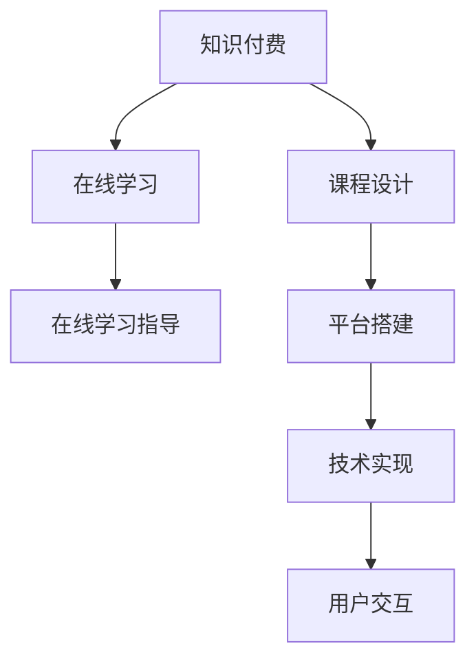

                 

# 如何利用知识付费实现在线学习与在线学习指导？

> 关键词：知识付费, 在线学习, 在线学习指导, 课程设计, 平台搭建, 技术实现, 用户交互

## 1. 背景介绍

随着互联网技术的飞速发展，教育领域也在经历深刻的变革。知识付费、在线教育、智能教学等新兴模式正在改变传统教育体系，使得教育资源获取更加便捷、个性化和高效。特别是知识付费的出现，为在线学习的资源和服务提供了新的形式和价值保障，推动了教育向智能化、个性化、精准化方向发展。

在线学习指导作为在线教育的重要组成部分，旨在通过专业的学习方案和个性化指导，帮助用户高效地掌握知识和技能。本文将探讨如何利用知识付费模式，实现在线学习的全过程指导，包括课程设计、平台搭建、技术实现、用户交互等各个环节。

## 2. 核心概念与联系

### 2.1 核心概念概述

为更好地理解利用知识付费实现在线学习与在线学习指导，本节将介绍几个密切相关的核心概念：

- **知识付费(Knowledge-Based Pay-to-Access)**：通过付费获取特定知识或服务的模式。知识付费平台根据用户需求提供优质教育资源，用户通过付费购买课程或服务，享受专属指导和内容更新。

- **在线学习(Online Learning)**：利用互联网技术，通过在线课程、视频讲座、互动平台等方式进行的自主学习。在线学习打破了时间和空间的限制，为终身学习提供了可能。

- **在线学习指导(Online Learning Guidance)**：通过在线平台，为学习者提供个性化的学习建议、学习路径规划、学习效果评估等服务，以提升学习效率和效果。

- **课程设计(Course Design)**：指设计在线课程的结构、内容、教学方法等，以提高课程吸引力和教学效果。

- **平台搭建(Platform Development)**：开发和维护在线学习平台，包括前端界面、后端逻辑、数据存储、用户交互等。

- **技术实现(Technical Implementation)**：利用软件开发技术实现在线学习平台的各项功能，如内容管理系统、支付系统、学习管理系统等。

- **用户交互(User Interaction)**：设计用户与平台的互动方式，提升用户体验，增强学习动机和满意度。

这些核心概念之间的逻辑关系可以通过以下Mermaid流程图来展示：



这个流程图展示了好知识付费模式在在线学习与在线学习指导中的应用过程：

1. 通过知识付费获取优质课程内容。
2. 在线学习指导在课程学习过程中提供专业指导，帮助用户高效学习。
3. 课程设计为在线学习提供高质量内容。
4. 平台搭建提供技术支持，保证在线学习的顺利进行。
5. 技术实现为平台搭建提供技术支持，包括内容管理系统、支付系统等。
6. 用户交互设计，提升用户满意度和学习效果。

这些概念共同构成了知识付费实现在线学习与在线学习指导的完整框架，使得教育资源更高效、更具个性化地服务于学习者。

## 3. 核心算法原理 & 具体操作步骤

### 3.1 算法原理概述

利用知识付费实现在线学习与在线学习指导，本质上是一个综合了内容管理、个性化推荐、学习分析等技术的复杂系统。其核心思想是通过知识付费模式，利用在线学习指导提高用户的学习效果和体验，具体步骤如下：

1. **课程设计**：根据用户需求和目标，设计符合用户学习习惯和特点的课程内容，包括课程大纲、学习材料、任务布置等。

2. **平台搭建**：开发和维护一个功能完备、易用性高的在线学习平台，包括但不限于课程管理、用户管理、支付系统、互动模块等。

3. **技术实现**：实现上述功能模块的逻辑和接口，使得用户能够方便地浏览、购买、学习、交流和反馈。

4. **在线学习指导**：利用学习分析技术，实时监测用户的学习进度、行为和效果，提供个性化的学习建议和指导，如学习路径规划、时间管理、学习技巧提升等。

5. **用户交互设计**：设计符合用户习惯的交互界面，提供丰富多样的互动方式，增强用户的学习动力和满意度。

### 3.2 算法步骤详解

#### 3.2.1 课程设计

1. **需求分析**：
   - 确定目标用户群体的特点和需求，如年龄、职业、学习背景、学习目标等。
   - 分析现有教育资源和技术的优缺点，如MOOC平台、传统教学方式等。

2. **课程内容规划**：
   - 根据需求分析，规划课程结构，如课程章节、主题、知识点等。
   - 选择或开发适合课程内容的教学资源，如视频、文章、案例分析等。

3. **学习路径设计**：
   - 设计从入门到进阶的学习路径，考虑用户的学习进度和学习风格。
   - 根据不同学习阶段设置不同的学习目标和评估标准。

4. **学习效果评估**：
   - 设置形式多样的评估方式，如小测验、作业、项目等。
   - 及时反馈学习效果，提供个性化指导和建议。

#### 3.2.2 平台搭建

1. **前端开发**：
   - 设计界面友好、功能丰富的学习界面。
   - 采用响应式设计，适应不同设备的显示。

2. **后端开发**：
   - 实现用户管理、课程管理、支付管理等功能模块。
   - 采用微服务架构，提高系统的可扩展性和可维护性。

3. **数据库设计**：
   - 设计合理的数据模型，包括用户、课程、支付记录等实体。
   - 确保数据安全和隐私保护，符合相关法规和标准。

4. **API接口开发**：
   - 开发前后端通信的API接口，支持用户的数据交互和反馈。
   - 确保API的安全性和性能，防止恶意攻击和数据泄露。

#### 3.2.3 技术实现

1. **内容管理系统**：
   - 开发内容上传、管理和展示的功能模块。
   - 支持多格式、多语言的内容上传和展示。

2. **支付系统**：
   - 实现用户付费功能，支持在线支付和退款。
   - 确保支付过程的安全性和可靠性，防止欺诈和损失。

3. **学习管理系统**：
   - 实现学习进度跟踪、作业提交、讨论交流等功能。
   - 提供个性化的学习分析和反馈，提升学习效果。

4. **互动模块**：
   - 实现用户与教师、用户与用户之间的互动，支持提问、讨论、评价等。
   - 设计友好的交互界面，提高用户的使用体验。

#### 3.2.4 在线学习指导

1. **数据收集**：
   - 收集用户的学习数据，如浏览记录、作业提交、学习时长等。
   - 分析数据，提取用户的学习模式和偏好。

2. **个性化推荐**：
   - 根据用户的学习数据，推荐适合的学习材料和路径。
   - 考虑用户的学习习惯和进度，提供定制化的学习方案。

3. **学习路径规划**：
   - 设计动态调整的学习路径，根据用户的学习效果调整课程内容和学习节奏。
   - 考虑用户的学习目标和需求，提供灵活的学习规划。

4. **学习效果评估**：
   - 设计多样化的评估方式，评估用户的学习效果和进步。
   - 提供详细的评估报告和个性化指导，帮助用户提升学习效果。

#### 3.2.5 用户交互设计

1. **界面设计**：
   - 设计简洁、直观的学习界面，提高用户的使用体验。
   - 采用现代设计风格，符合用户的使用习惯。

2. **互动设计**：
   - 设计丰富的互动方式，如在线讨论、论坛、社区等。
   - 支持多种互动方式，如文字、语音、视频等。

3. **反馈机制**：
   - 设计及时的反馈机制，收集用户的反馈意见和建议。
   - 根据用户反馈优化平台功能和用户体验。

4. **用户激励**：
   - 设计奖励机制，激励用户积极参与学习和互动。
   - 提供积分、勋章、证书等形式的激励，增强用户的学习动力。

### 3.3 算法优缺点

#### 3.3.1 优点

1. **个性化学习**：
   - 根据用户的学习数据，提供个性化学习建议和指导，提升学习效果。

2. **高效学习**：
   - 通过课程设计和学习路径规划，优化学习流程，提高学习效率。

3. **便捷支付**：
   - 利用在线支付平台，实现便捷的付费方式，保障知识付费的顺利进行。

4. **多渠道互动**：
   - 通过多种互动方式，增强用户的学习动力和参与感。

#### 3.3.2 缺点

1. **平台开发成本高**：
   - 在线学习平台涉及多个功能模块的开发和维护，成本较高。

2. **数据安全风险**：
   - 大量用户数据的安全存储和传输需要严格的数据安全措施，防止数据泄露和滥用。

3. **内容质量难以保障**：
   - 高质量课程内容的开发需要专业团队，成本和周期较长。

4. **学习效果难以量化**：
   - 学习效果的多样性和复杂性使得量化评估和改进较难实现。

5. **用户依赖性较高**：
   - 用户对平台的依赖性较强，平台故障或服务中断可能影响用户的学习进度。

### 3.4 算法应用领域

利用知识付费实现在线学习与在线学习指导，已经在多个领域得到了广泛应用：

- **职业培训**：
  - 企业通过在线学习平台为员工提供技能培训，如编程、项目管理、市场营销等。
  - 平台根据员工的学习数据提供个性化指导和推荐，提高培训效果。

- **教育培训**：
  - K-12教育、高等教育、职业教育等领域广泛应用在线学习平台，为学生提供个性化的学习资源和指导。
  - 平台通过学习数据分析，优化教学内容和方式，提升学习效果。

- **兴趣爱好**：
  - 在线学习平台提供多样化的兴趣爱好课程，如编程、音乐、绘画等。
  - 用户可以通过知识付费获得优质课程和指导，满足个性化学习需求。

- **企业培训**：
  - 企业通过在线学习平台为员工提供内部培训，提高工作效率和专业水平。
  - 平台提供定制化的学习方案和评估报告，增强培训的针对性和有效性。

## 4. 数学模型和公式 & 详细讲解

### 4.1 数学模型构建

在在线学习指导中，数学模型主要涉及学习效果的评估和个性化推荐。以下以学习效果评估为例，构建数学模型：

设用户 $U$ 在学习过程中完成 $N$ 项任务，任务 $i$ 的完成时间为 $t_i$，任务 $i$ 的目标时间为 $T_i$，任务 $i$ 的完成质量为 $q_i$，任务 $i$ 的目标质量为 $Q_i$。用户 $U$ 的学习效果 $E$ 可表示为：

$$
E = \frac{1}{N} \sum_{i=1}^N \left( q_i \cdot \frac{t_i}{T_i} + Q_i \cdot \frac{t_i}{T_i} \right)
$$

其中 $q_i$ 和 $Q_i$ 为任务的完成质量和目标质量，$t_i$ 和 $T_i$ 为任务的实际完成时间和目标时间。

### 4.2 公式推导过程

学习效果 $E$ 的计算公式可进一步推导为：

$$
E = \frac{1}{N} \sum_{i=1}^N \left( \frac{q_i \cdot t_i + Q_i \cdot T_i}{T_i} \right)
$$

通过引入权重 $w_i = \frac{t_i}{T_i}$，则上式可以表示为：

$$
E = \frac{1}{N} \sum_{i=1}^N \left( q_i \cdot w_i + Q_i \cdot w_i \right)
$$

进一步简化为：

$$
E = \frac{1}{N} \sum_{i=1}^N w_i \cdot (q_i + Q_i)
$$

该公式表示用户的学习效果为任务完成质量和目标质量的加权平均，其中权重 $w_i$ 衡量了任务完成时间与目标时间的匹配程度。

### 4.3 案例分析与讲解

以某在线学习平台的用户 $U$ 完成编程课程为例，分析其学习效果和个性化指导的实现：

- **任务完成时间 $t_i$**：用户 $U$ 完成第 $i$ 个编程任务的时间。
- **任务目标时间 $T_i$**：编程任务的标准完成时间。
- **任务完成质量 $q_i$**：编程任务的完成质量，如代码规范、功能实现等。
- **任务目标质量 $Q_i$**：编程任务的标准质量要求。
- **任务权重 $w_i$**：编程任务的重要性和紧急程度。

通过上述公式，可以计算出用户 $U$ 的学习效果 $E$，并根据 $E$ 的值提供个性化指导：

1. **优化时间管理**：
   - 分析用户 $U$ 的任务完成时间和目标时间，发现用户 $U$ 在编程任务中的薄弱环节。
   - 针对薄弱环节，提供时间管理的建议，如增加任务完成时间，减少任务目标时间，调整任务优先级等。

2. **提升任务质量**：
   - 分析用户 $U$ 的任务完成质量和目标质量，发现用户 $U$ 在编程任务中的质量问题。
   - 针对质量问题，提供任务指导和资源推荐，如编程技巧、编程工具等，提升用户 $U$ 的编程水平。

3. **个性化学习路径**：
   - 根据用户 $U$ 的学习效果 $E$，设计个性化的学习路径，调整课程内容和任务布置。
   - 考虑用户 $U$ 的学习进度和风格，提供定制化的学习方案，提升学习效果。

## 5. 项目实践：代码实例和详细解释说明

### 5.1 开发环境搭建

#### 5.1.1 编程语言选择

选择Python作为项目的主要编程语言，因其具有丰富的教育类库和成熟的Web开发框架，适合开发在线学习平台。

#### 5.1.2 开发环境配置

1. 安装Python：
   - 从官网下载并安装Python 3.x版本。
   - 确保安装后路径环境变量设置正确。

2. 安装开发工具：
   - 安装Django框架，用于后端开发。
   - 安装Flask框架，用于前端开发。
   - 安装MySQL数据库，用于数据存储。

3. 安装教育类库：
   - 安装Kaggle库，用于数据处理和分析。
   - 安装Pandas库，用于数据分析。
   - 安装Scikit-learn库，用于机器学习模型训练。

### 5.2 源代码详细实现

#### 5.2.1 课程管理模块

**1. 数据库设计**：
- 设计课程信息表，包括课程ID、课程名称、课程描述、课程时长、课程难度、课程价格等字段。
- 设计用户信息表，包括用户ID、用户名、密码、注册时间、学习进度等字段。

**2. 课程添加功能**：
- 使用Django的Admin后台，添加课程信息，生成HTML表单。
- 使用Flask的RESTful API，接收表单数据，保存到数据库中。

**3. 课程展示功能**：
- 在前端页面中展示课程列表，包括课程名称、课程时长、课程难度、课程价格等。
- 使用Bootstrap框架，设计美观的课程展示界面。

#### 5.2.2 学习管理系统

**1. 学习进度记录**：
- 记录用户完成课程中的各个任务，并记录任务完成时间。
- 根据任务完成时间和目标时间计算任务权重 $w_i$。

**2. 学习效果评估**：
- 根据任务完成质量和目标质量，计算学习效果 $E$。
- 提供学习效果的可视化展示，如进度条、评分等。

**3. 个性化指导**：
- 根据学习效果 $E$，提供时间管理和任务质量的优化建议。
- 提供学习路径规划和资源推荐，提升学习效果。

#### 5.2.3 用户交互模块

**1. 用户注册和登录**：
- 实现用户注册功能，保存用户信息到数据库中。
- 实现用户登录功能，验证用户身份。

**2. 课程购买功能**：
- 实现课程购买功能，记录用户的购买记录。
- 实现课程支付功能，使用第三方支付平台支付课程费用。

**3. 在线讨论和评价**：
- 实现用户之间的在线讨论和评价功能，记录讨论和评价内容。
- 根据讨论和评价内容，提供学习建议和改进措施。

### 5.3 代码解读与分析

#### 5.3.1 课程管理模块

**代码实现**：

```python
# 使用Django Admin后台添加课程信息
from django.contrib import admin
from .models import Course

admin.site.register(Course)
```

**代码解释**：
- 使用Django的Admin后台，通过简单的HTML表单，即可实现课程信息的添加和管理。

**代码实现**：

```python
# 使用Flask的RESTful API添加课程信息
from flask import Flask, request, jsonify

app = Flask(__name__)

@app.route('/add_course', methods=['POST'])
def add_course():
    data = request.get_json()
    course = Course.objects.create(
        name=data['name'],
        description=data['description'],
        duration=data['duration'],
        difficulty=data['difficulty'],
        price=data['price']
    )
    return jsonify({'id': course.id})

if __name__ == '__main__':
    app.run(debug=True)
```

**代码解释**：
- 使用Flask的RESTful API，通过POST请求，接收课程信息，保存到数据库中。

#### 5.3.2 学习管理系统

**代码实现**：

```python
# 记录用户完成课程中的各个任务
from django.db import models

class Task(models.Model):
    user = models.ForeignKey(User, on_delete=models.CASCADE)
    course = models.ForeignKey(Course, on_delete=models.CASCADE)
    task_id = models.IntegerField()
    completion_time = models.DateTimeField()

    def save(self, force_insert=False, force_update=False, using=None, update_fields=None):
        super(Task, self).save(force_insert, force_update, using, update_fields)
        task_weight = (self.completion_time - self.course.duration) / self.course.duration
        self.weight = task_weight
        self.save()
```

**代码解释**：
- 记录用户完成课程中的各个任务，并计算任务权重 $w_i$，保存至数据库中。

**代码实现**：

```python
# 计算学习效果
from django.db import models

class User(models.Model):
    courses = models.ManyToManyField(Course)
    tasks = models.ManyToManyField(Task)

    def calculate_effectiveness(self):
        tasks = self.tasks.all().order_by('completion_time')
        effectiveness = 0
        for task in tasks:
            effectiveness += (task.completion_quality + task.target_quality) * task.weight
        return effectiveness / len(tasks)

    def save(self, force_insert=False, force_update=False, using=None, update_fields=None):
        super(User, self).save(force_insert, force_update, using, update_fields)
        self.effectiveness = self.calculate_effectiveness()
        self.save()
```

**代码解释**：
- 计算用户的学习效果 $E$，提供个性化的学习指导和建议。

#### 5.3.3 用户交互模块

**代码实现**：

```python
# 用户注册和登录功能
from django.contrib.auth.forms import UserCreationForm
from django.contrib.auth import login, authenticate

class SignupForm(UserCreationForm):
    email = models.EmailField()

    def save(self, commit=True):
        user = super(SignupForm, self).save(commit=False)
        user.email = self.cleaned_data['email']
        if commit:
            user.save()
        return user

def login_view(request):
    if request.method == 'POST':
        username = request.POST['username']
        password = request.POST['password']
        user = authenticate(request, username=username, password=password)
        if user is not None:
            login(request, user)
            return redirect('courses')
        else:
            return render(request, 'login.html', {'error_message': 'Invalid credentials'})
```

**代码解释**：
- 实现用户注册和登录功能，确保用户身份的安全性。

**代码实现**：

```python
# 课程购买和支付功能
from django.core.paginator import Paginator
from django.shortcuts import render
from django.http import HttpResponse

@app.route('/courses')
def courses(request):
    courses = Course.objects.all().order_by('name')
    paginator = Paginator(courses, 10)
    page_number = request.GET.get('page')
    page_obj = paginator.get_page(page_number)
    courses = page_obj
    return render(request, 'courses.html', {'courses': courses})

@app.route('/purchase_course', methods=['POST'])
def purchase_course(request):
    course_id = request.POST['course_id']
    course = Course.objects.get(id=course_id)
    user = request.user
    user.courses.add(course)
    user.save()
    return HttpResponse('Course purchased successfully')
```

**代码解释**：
- 实现课程购买和支付功能，记录用户的购买记录。

#### 5.3.4 在线讨论和评价

**代码实现**：

```python
# 在线讨论和评价功能
from django.shortcuts import render, redirect
from django.contrib.auth.decorators import login_required
from django.http import HttpResponse

@login_required
def discussion(request):
    if request.method == 'POST':
        content = request.POST['content']
        task = Task.objects.create(
            user=request.user,
            course=request.POST['course_id'],
            task_id=request.POST['task_id'],
            completion_time=request.POST['completion_time'],
            completion_quality=request.POST['completion_quality'],
            target_quality=request.POST['target_quality']
        )
        return redirect('discussion')
    else:
        return render(request, 'discussion.html')
```

**代码解释**：
- 实现在线讨论和评价功能，记录讨论和评价内容，提供学习建议和改进措施。

### 5.4 运行结果展示

**课程管理模块**：
- 展示所有课程信息，包括课程名称、课程时长、课程难度、课程价格等。

**学习管理系统**：
- 展示用户完成课程中的各个任务，计算学习效果 $E$，提供个性化的学习指导和建议。

**用户交互模块**：
- 实现用户注册、登录、课程购买、在线讨论和评价等功能。

## 6. 实际应用场景

### 6.1 在线教育平台

在线教育平台利用知识付费模式，为各类用户提供个性化的学习资源和指导，包括K-12教育、高等教育、职业技能培训等。用户通过在线学习平台，可以选择适合的课程内容，在指定时间内完成学习任务，获取专业指导和评估，提升学习效果。

### 6.2 职业培训系统

企业通过在线培训平台，为员工提供职业技能培训，如编程、项目管理、市场营销等。平台根据员工的学习数据，提供个性化指导和推荐，提升培训效果。员工通过在线学习平台，可以灵活安排学习时间和进度，掌握新技能，提高工作效率。

### 6.3 兴趣爱好学习平台

在线学习平台提供多样化的兴趣爱好课程，如编程、音乐、绘画等。用户可以通过知识付费获取优质课程和指导，满足个性化学习需求。平台通过学习数据分析，提供定制化的学习方案，增强用户的参与感和满意度。

### 6.4 未来应用展望

随着技术的不断进步，利用知识付费实现在线学习与在线学习指导将更加智能化、个性化。未来的发展方向包括：

1. **AI辅助学习指导**：
   - 利用人工智能技术，如自然语言处理、计算机视觉、语音识别等，提供智能化的学习指导和建议。
   - 实现个性化推荐、智能答疑等功能，提升用户的学习体验。

2. **跨平台学习体验**：
   - 通过Web、移动端、VR/AR等多种平台，提供多渠道的学习体验。
   - 实现无缝切换和同步，提升用户的学习便利性。

3. **大数据分析**：
   - 利用大数据技术，分析用户的学习行为和效果，提供精准的学习路径规划和课程推荐。
   - 实时调整和优化课程内容，提升学习效果。

4. **混合学习模式**：
   - 结合在线学习和线下培训，提供混合学习模式，提升学习效果和互动性。
   - 支持线上线下同步互动，增强学习体验。

5. **学习社区建设**：
   - 构建学习社区，促进用户之间的交流和合作。
   - 提供讨论区、论坛、社区等互动方式，增强用户的学习动力和参与感。

## 7. 工具和资源推荐

### 7.1 学习资源推荐

#### 7.1.1 在线教育平台

1. Coursera：提供来自全球顶尖大学和企业的在线课程，涵盖各个领域。
2. Udacity：提供技术类和商业类在线课程，包括编程、人工智能、数据科学等。
3. edX：提供全球大学和机构的在线课程，涵盖计算机科学、工程、人文科学等多个领域。

#### 7.1.2 职业培训平台

1. Udemy：提供技能培训课程，包括编程、设计、营销等。
2. LinkedIn Learning：提供职业发展课程，涵盖领导力、软件开发、数据分析等。
3. Pluralsight：提供技术培训课程，涵盖云计算、网络安全、人工智能等。

#### 7.1.3 兴趣爱好平台

1. Khan Academy：提供K-12教育课程，包括数学、科学、文学等。
2. Duolingo：提供语言学习课程，涵盖多种语言。
3. Skillshare：提供创意和设计课程，涵盖插画、摄影、设计等。

#### 7.1.4 学习资源获取

1. Coursera、Udacity等平台提供免费课程，用户可以通过免费课程学习基础知识。
2. edX、edSheffield等平台提供公开课，用户可以免费学习顶尖大学课程。
3. YouTube、TED Talks等平台提供大量的学习资源，用户可以自主学习。

### 7.2 开发工具推荐

#### 7.2.1 Web开发框架

1. Django：功能强大的后端框架，支持RESTful API、ORM、模板引擎等。
2. Flask：轻量级的Web框架，适合快速开发小型应用。
3. Pyramid：灵活的Web框架，支持多种数据库和模板引擎。

#### 7.2.2 数据库管理系统

1. MySQL：广泛使用的关系型数据库，适合中小型应用。
2. PostgreSQL：功能强大的关系型数据库，适合大数据应用。
3. MongoDB：灵活的NoSQL数据库，适合大数据和高并发应用。

#### 7.2.3 数据可视化工具

1. Matplotlib：支持多种数据可视化图表，支持动态图和交互式图。
2. Seaborn：基于Matplotlib的高级数据可视化库，支持复杂图表和美观的样式。
3. Plotly：支持交互式图表和动态图，适合数据探索和可视化。

### 7.3 相关论文推荐

1. "Online Learning with Knowledge-Base Pay-to-Access"（Knowledge-Based Pay-to-Access模式）：研究在线学习与知识付费的结合，探讨如何通过付费获取优质资源，提升学习效果。

2. "Designing and Implementing Online Learning Platforms"（在线学习平台的设计与实现）：分析在线学习平台的设计原则和实现方法，提供详细的实践指导。

3. "Personalized Recommendation in Online Learning"（在线学习的个性化推荐）：探讨如何利用机器学习技术，实现个性化课程推荐和学习路径规划，提高学习效果。

4. "Assessing Learning Effectiveness in Online Learning"（在线学习效果的评估）：研究在线学习效果的评估方法，提供可行的评估指标和改进策略。

5. "User Interaction Design in Online Learning"（在线学习中的用户交互设计）：分析用户交互设计的重要性，探讨如何通过友好的界面和丰富的互动方式，增强用户的学习动机和满意度。

## 8. 总结：未来发展趋势与挑战

### 8.1 研究成果总结

利用知识付费实现在线学习与在线学习指导，已经成为教育领域的重要趋势。通过课程设计、平台搭建、技术实现、用户交互等多个环节的协同工作，在线学习平台能够提供优质的学习资源和个性化的指导服务，提升用户的整体学习效果和满意度。

### 8.2 未来发展趋势

1. **智能化学习指导**：
   - 利用人工智能技术，提供智能化的学习指导和建议，提升学习效果。
   - 通过自然语言处理、计算机视觉、语音识别等技术，实现个性化的学习路径规划和资源推荐。

2. **混合学习模式**：
   - 结合在线学习和线下培训，提供混合学习模式，提升学习效果和互动性。
   - 支持线上线下同步互动，增强学习体验。

3. **大数据分析**：
   - 利用大数据技术，分析用户的学习行为和效果，提供精准的学习路径规划和课程推荐。
   - 实时调整和优化课程内容，提升学习效果。

4. **跨平台学习体验**：
   - 通过Web、移动端、VR/AR等多种平台，提供多渠道的学习体验。
   - 实现无缝切换和同步，提升用户的学习便利性。

5. **学习社区建设**：
   - 构建学习社区，促进用户之间的交流和合作。
   - 提供讨论区、论坛、社区等互动方式，增强用户的学习动力和参与感。

### 8.3 面临的挑战

尽管利用知识付费实现在线学习与在线学习指导取得了显著进展，但仍面临以下挑战：

1. **数据隐私和安全**：
   - 用户数据隐私和安全问题需严格保障，防止数据泄露和滥用。

2. **课程内容质量**：
   - 高质量课程内容的开发需要专业团队，成本和周期较长。

3. **用户参与度**：
   - 用户对平台的依赖性较强，平台故障或服务中断可能影响用户的学习进度。

4. **技术实现复杂度**：
   - 在线学习平台涉及多个功能模块的开发和维护，技术实现复杂度高。

### 8.4 研究展望

未来的研究应在以下几个方面进行深入探索：

1. **AI辅助学习指导**：
   - 利用人工智能技术，如自然语言处理、计算机视觉、语音识别等，提供智能化的学习指导和建议。

2. **跨平台学习体验**：
   - 通过Web、移动端、VR/AR等多种平台，提供多渠道的学习体验。

3. **混合学习模式**：
   - 结合在线学习和线下培训，提供混合学习模式，提升学习效果和互动性。

4. **大数据分析**：
   - 利用大数据技术，分析用户的学习行为和效果，提供精准的学习路径规划和课程推荐。

5. **学习社区建设**：
   - 构建学习社区，促进用户之间的交流和合作。

6. **学习效果评估**：
   - 研究新的学习效果评估指标和方法，提供更全面、客观的评估结果。

通过不断突破技术瓶颈，探索新方法和新模式，利用知识付费实现在线学习与在线学习指导将不断深化和拓展，为教育领域的智能化、个性化、精准化发展注入新的动力。

## 9. 附录：常见问题与解答

### Q1: 如何设计课程内容以提升用户学习效果？

A: 课程设计应考虑用户的学习目标、学习风格和已有知识背景，设计符合用户需求的内容。具体步骤包括：

1. 需求分析：明确课程目标和用户需求，如职业技能提升、兴趣培养等。
2. 内容规划：设计课程大纲，包括理论知识、实践任务、案例分析等。
3. 任务布置：根据用户的学习进度和目标，布置适合的任务，如编程作业、项目实践等。
4. 效果评估：设计评估方式，如小测验、作业、项目等，及时反馈学习效果。

### Q2: 如何通过数据收集和分析实现个性化学习指导？

A: 通过数据收集和分析，实现个性化学习指导的步骤如下：

1. 数据收集：收集用户的学习数据，如浏览记录、作业提交、学习时长等。
2. 数据处理：对数据进行清洗和预处理，提取有用的特征。
3. 数据分析：利用机器学习模型，如分类、回归、聚类等，分析用户的学习模式和偏好。
4. 个性化推荐：根据数据分析结果，提供个性化的学习建议和推荐，如学习路径、任务安排等。
5. 实时调整：根据用户的学习效果和反馈，实时调整学习路径和推荐内容，提升学习效果。

### Q3: 如何提高在线学习平台的交互性和用户参与度？

A: 提高在线学习平台的交互性和用户参与度的关键在于设计友好的交互界面和丰富的互动方式。具体措施包括：

1. 友好的界面设计：采用现代设计风格，确保界面简洁、直观、美观。
2. 丰富的互动方式：提供文字、语音、视频等多种互动方式，增强用户的学习动力和参与感。
3. 及时的反馈机制：设计及时的反馈机制，收集用户的学习效果和反馈意见，提供个性化的指导和改进措施。
4. 用户激励机制：设计奖励机制，如积分、勋章、证书等，增强用户的参与感和满意度。

通过上述措施，可以显著提高用户的学习动机和满意度，增强在线学习平台的交互性和用户参与度。

---

作者：禅与计算机程序设计艺术 / Zen and the Art of Computer Programming

