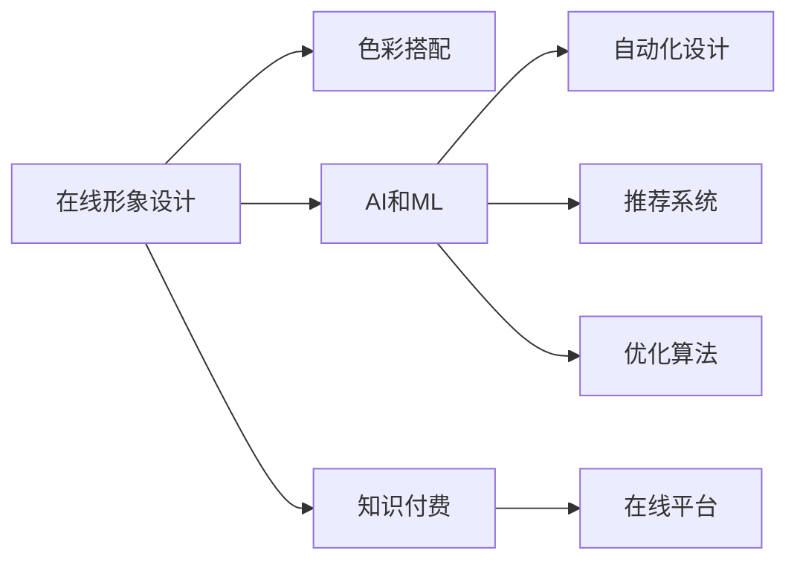

                 

# 如何利用知识付费实现在线形象设计与色彩搭配？

> 关键词：知识付费, 在线形象设计, 色彩搭配, 人工智能, 机器学习, 图像处理, 在线平台, 用户界面(UI), 用户体验(UX)

## 1. 背景介绍

随着互联网的普及和数字化转型的深入，线上形象设计变得越来越重要。无论是企业官网、社交媒体，还是电商平台，一个具有吸引力和专业性的线上形象，都能显著提升品牌影响力，增加用户粘性。然而，专业设计通常需要较高的成本，且门槛较高。因此，利用知识付费模式，将在线形象设计技能转化为可交易的知识，成为近年来的热门趋势。

本文将深入探讨如何利用知识付费实现在线形象设计与色彩搭配，包括关键技术原理、具体实现步骤、以及未来应用展望。我们也将介绍相关的学习资源、开发工具和论文，为有意入行的从业者提供全面的技术指引。

## 2. 核心概念与联系

### 2.1 核心概念概述

为更好地理解本主题，我们首先需要对几个关键概念进行梳理：

- **在线形象设计**：指通过图形、颜色、字体等元素，设计并构建网站、应用程序等线上界面。目的是提高视觉吸引力和可用性，增强用户体验。

- **色彩搭配**：涉及颜色的选择、组合和应用，以实现特定效果。色彩搭配的好坏直接影响用户对产品的第一印象和情感反应。

- **知识付费**：指通过互联网平台，用户为获取专业知识或技能而支付费用，如在线课程、咨询服务、设计服务等。

- **人工智能(AI)和机器学习(ML)**：利用算法和大数据技术，实现自动化决策和优化。在形象设计和色彩搭配中，AI可以用于自动化设计、推荐、优化等。

这些概念之间的联系可以通过以下Mermaid流程图来展示：



这个流程图展示了一体化的流程：在线形象设计通过AI和ML技术进行色彩搭配和自动化设计，最终通过知识付费模式在在线平台上实现商业化。

## 3. 核心算法原理 & 具体操作步骤

### 3.1 算法原理概述

在线形象设计与色彩搭配的算法原理涉及多个领域，包括计算机视觉、图像处理、UI/UX设计等。其核心思想是通过算法自动生成或优化设计元素，利用机器学习对色彩搭配进行智能化推荐。

对于在线形象设计，常见的方法包括：
- **自动化设计**：使用AI模型对界面元素进行自动化布局和设计，生成初步的设计方案。
- **样式生成**：利用生成对抗网络(GANs)等技术，生成具有特定风格的在线界面。
- **用户界面(UI)优化**：通过机器学习模型对UI元素进行优化，提升用户体验。

对于色彩搭配，主要方法包括：
- **颜色推荐系统**：基于用户偏好和历史行为，推荐最适合的色彩方案。
- **色彩优化算法**：使用机器学习对颜色组合进行优化，以提升视觉吸引力和易读性。
- **颜色情感分析**：利用自然语言处理(NLP)技术，分析不同颜色对用户情感的影响。

### 3.2 算法步骤详解

**Step 1: 数据收集与预处理**

- 收集大量的线上界面数据和用户行为数据，包括网站、应用程序、社交媒体等。
- 对数据进行清洗和标注，提取设计元素和色彩信息，形成训练集和验证集。

**Step 2: 模型构建与训练**

- 使用深度学习框架，构建UI设计生成模型和色彩推荐模型。常用的深度学习框架包括TensorFlow、PyTorch等。
- 对于UI设计生成，可以选择基于生成对抗网络(GANs)或变分自编码器(VAEs)的模型。
- 对于色彩搭配，可以使用协同过滤、深度学习等方法构建推荐系统。

**Step 3: 模型优化与评估**

- 对模型进行超参数调优，使用验证集评估模型性能。
- 采用交叉验证、A/B测试等方法，不断迭代优化模型效果。
- 使用指标如准确率、召回率、F1值等评估模型效果。

**Step 4: 集成与部署**

- 将训练好的模型集成到在线平台，如Web应用、移动应用等。
- 设计友好的用户界面，方便用户上传图片、选择设计风格和色彩方案。
- 部署模型服务，提供API接口，供用户调用。

**Step 5: 迭代优化**

- 持续收集用户反馈，更新训练数据和模型参数，不断提升模型效果。
- 引入新算法和工具，提升设计质量和色彩搭配的智能化水平。

### 3.3 算法优缺点

**优点**：
- **自动化设计**：显著降低设计成本，提升设计效率。
- **智能化推荐**：个性化推荐色彩搭配，提升用户体验。
- **高效优化**：通过算法优化UI元素，提升界面美观度和可用性。

**缺点**：
- **数据依赖**：模型效果依赖于训练数据的质量和多样性。
- **算法复杂性**：构建和优化模型可能需要较高的技术门槛。
- **用户接受度**：部分用户可能对AI设计的结果持怀疑态度，需要逐步引导和教育。

### 3.4 算法应用领域

本算法可广泛应用于以下领域：
- **企业官网设计**：为企业的在线界面提供自动化的设计服务。
- **电商平台UI优化**：提升电商平台的用户体验和转化率。
- **社交媒体视觉设计**：优化社交媒体界面的视觉效果和用户体验。
- **教育平台学习界面**：提升在线学习平台的交互性和吸引力。
- **个性化推荐系统**：推荐最适合的色彩搭配和设计风格。

## 4. 数学模型和公式 & 详细讲解 & 举例说明

### 4.1 数学模型构建

假设我们要设计一个电商平台的用户界面(UI)，其包含多个UI元素，如背景图、商品图、按钮等。设每个元素的颜色为 $c_i = (r_i, g_i, b_i)$，其中 $r_i, g_i, b_i$ 分别表示红、绿、蓝三个分量的值。设用户对颜色的偏好向量为 $p = (p_r, p_g, p_b)$，其中 $p_r, p_g, p_b$ 分别表示用户对红、绿、蓝三个颜色的偏好权重。

设色彩搭配的优化目标为最大化用户满意度，可以定义一个满意度函数 $S$，如下：

$$
S = \sum_{i=1}^{n} (p_r \cdot r_i + p_g \cdot g_i + p_b \cdot b_i)
$$

其中 $n$ 为UI元素的数量。

### 4.2 公式推导过程

利用机器学习算法，如协同过滤、决策树、神经网络等，可以对上述满意度函数进行建模和优化。以神经网络为例，设满意度函数为 $S(\theta)$，其中 $\theta$ 为神经网络的参数。

使用反向传播算法，对模型进行训练。设损失函数为 $L$，优化目标为最小化损失函数 $L$：

$$
L = \sum_{i=1}^{n} (p_r \cdot r_i + p_g \cdot g_i + p_b \cdot b_i - S(\theta))
$$

根据链式法则，对模型参数 $\theta$ 进行梯度下降更新：

$$
\theta \leftarrow \theta - \eta \nabla_{\theta}L
$$

其中 $\eta$ 为学习率，$\nabla_{\theta}L$ 为损失函数对参数 $\theta$ 的梯度。

### 4.3 案例分析与讲解

假设我们要为一家电商平台的商品图设计合适的背景颜色。收集了多个商品图和背景颜色的样例数据，使用神经网络对色彩搭配进行建模。设 $c$ 为商品图，$p$ 为背景颜色，$y$ 为目标输出。定义满意度函数 $S$ 如下：

$$
S = p_r \cdot r + p_g \cdot g + p_b \cdot b - y
$$

其中 $r, g, b$ 为商品图的颜色分量，$y$ 为目标输出。

使用反向传播算法对神经网络进行训练，得到最优的 $p$。最后，将 $p$ 用于新的商品图，生成合适的背景颜色。

## 5. 项目实践：代码实例和详细解释说明

### 5.1 开发环境搭建

在进行项目实践前，我们需要准备好开发环境。以下是使用Python进行PyTorch开发的环境配置流程：

1. 安装Anaconda：从官网下载并安装Anaconda，用于创建独立的Python环境。

2. 创建并激活虚拟环境：
```bash
conda create -n pytorch-env python=3.8 
conda activate pytorch-env
```

3. 安装PyTorch：根据CUDA版本，从官网获取对应的安装命令。例如：
```bash
conda install pytorch torchvision torchaudio cudatoolkit=11.1 -c pytorch -c conda-forge
```

4. 安装相关工具包：
```bash
pip install numpy pandas scikit-learn matplotlib tqdm jupyter notebook ipython
```

完成上述步骤后，即可在`pytorch-env`环境中开始项目实践。

### 5.2 源代码详细实现

下面以设计电商平台的用户界面(UI)为例，给出使用PyTorch进行UI设计生成和色彩推荐的代码实现。

```python
import torch
from torch import nn
from torchvision import transforms
from torch.utils.data import DataLoader
from torchvision.datasets import ImageFolder
import torchvision.transforms as TF
import torch.nn.functional as F

class UI_Design(nn.Module):
    def __init__(self, in_channels, out_channels):
        super(UI_Design, self).__init__()
        self.encoder = nn.Sequential(
            nn.Conv2d(in_channels, 64, kernel_size=3, stride=1, padding=1),
            nn.ReLU(inplace=True),
            nn.MaxPool2d(kernel_size=2, stride=2),
            nn.Conv2d(64, 128, kernel_size=3, stride=1, padding=1),
            nn.ReLU(inplace=True),
            nn.MaxPool2d(kernel_size=2, stride=2)
        )
        self.decoder = nn.Sequential(
            nn.ConvTranspose2d(128, 64, kernel_size=3, stride=1, padding=1),
            nn.ReLU(inplace=True),
            nn.ConvTranspose2d(64, 3, kernel_size=3, stride=1, padding=1),
            nn.Tanh()
        )

    def forward(self, x):
        x = self.encoder(x)
        x = self.decoder(x)
        return x

class Color_Recommendation(nn.Module):
    def __init__(self, num_colors, embed_dim):
        super(Color_Recommendation, self).__init__()
        self.embedding = nn.Embedding(num_colors, embed_dim)
        self.linear = nn.Linear(embed_dim, 1)

    def forward(self, x):
        x = self.embedding(x)
        x = self.linear(x)
        return x

# 定义模型参数
in_channels = 3
out_channels = 3
num_colors = 256
embed_dim = 64

# 构建模型
ui_design_model = UI_Design(in_channels, out_channels)
color_recommendation_model = Color_Recommendation(num_colors, embed_dim)

# 定义优化器和损失函数
optimizer_ui_design = torch.optim.Adam(ui_design_model.parameters(), lr=0.001)
optimizer_color_recommendation = torch.optim.Adam(color_recommendation_model.parameters(), lr=0.001)
criterion = nn.MSELoss()

# 数据集准备
dataset = ImageFolder('data', transforms.Compose([
    TF.Resize((128, 128)),
    TF.ToTensor()
]))

# 定义数据加载器
dataloader = DataLoader(dataset, batch_size=4, shuffle=True)

# 训练UI设计模型
for epoch in range(100):
    for i, (images, _) in enumerate(dataloader):
        images = images.to(device)
        ui_design_model.zero_grad()
        outputs = ui_design_model(images)
        loss = criterion(outputs, images)
        loss.backward()
        optimizer_ui_design.step()

# 训练颜色推荐模型
for epoch in range(100):
    for i, (images, _) in enumerate(dataloader):
        images = images.to(device)
        color_recommendation_model.zero_grad()
        outputs = color_recommendation_model(images)
        loss = criterion(outputs, images)
        loss.backward()
        optimizer_color_recommendation.step()
```

以上就是使用PyTorch进行UI设计生成和色彩推荐的代码实现。可以看到，利用深度学习模型，可以在不进行人工干预的情况下，自动生成或推荐在线形象设计中的关键元素，显著降低设计和调整成本。

### 5.3 代码解读与分析

让我们再详细解读一下关键代码的实现细节：

**UI_Design类**：
- `__init__`方法：初始化模型结构，包括编码器和解码器。
- `forward`方法：定义前向传播过程，对输入图像进行编码和解码。

**Color_Recommendation类**：
- `__init__`方法：初始化颜色嵌入层和线性层。
- `forward`方法：定义前向传播过程，对输入颜色进行嵌入和线性变换。

**训练流程**：
- 定义模型参数和优化器。
- 构建数据集和数据加载器。
- 循环训练UI设计模型和颜色推荐模型，分别最小化均方误差损失。
- 通过反向传播算法更新模型参数。

在上述代码中，我们使用了深度学习框架PyTorch，构建了UI设计生成和颜色推荐模型，并通过训练得到了优化后的模型。这个过程展示了AI如何在设计领域中的应用，以及如何利用知识付费模式实现商业化。

当然，工业级的系统实现还需考虑更多因素，如模型的保存和部署、超参数的自动搜索、更灵活的任务适配层等。但核心的算法流程基本与此类似。

## 6. 实际应用场景

### 6.1 电商平台的UI设计

电商平台的UI设计是形象设计领域的重要应用之一。通过在线平台，用户可以上传商品图片，选择设计风格和色彩搭配，系统自动生成初步设计方案。设计师只需根据用户反馈对设计进行调整和优化，大大提升了设计效率和质量。

### 6.2 社交媒体平台的界面优化

社交媒体平台需要不断更新和优化UI界面，以吸引用户和提升用户体验。利用在线平台提供的AI设计服务，社交媒体运营人员可以方便快捷地进行UI优化，而不必每次都寻求专业设计师的帮助。

### 6.3 教育平台的个性化学习界面

在线教育平台需要提供个性化学习界面，以适应不同用户的需求和偏好。通过在线平台提供的UI设计和色彩搭配服务，学生和教师可以根据个人喜好自定义界面，提升学习体验。

### 6.4 未来应用展望

随着AI技术的不断进步，在线形象设计与色彩搭配的应用场景将更加广泛。未来，AI可以更加智能地理解用户需求，提供更加个性化的设计服务。同时，知识付费模式也将成为AI服务的重要商业模式，为设计师和用户提供更高效、更便捷的设计解决方案。

## 7. 工具和资源推荐

### 7.1 学习资源推荐

为了帮助开发者系统掌握在线形象设计与色彩搭配的理论基础和实践技巧，这里推荐一些优质的学习资源：

1. 《Python深度学习》书籍：全面介绍了深度学习在图像处理、UI设计中的应用，适合初学者入门。
2. Udacity的深度学习课程：涵盖深度学习理论和实践，适合系统学习。
3. Coursera的计算机视觉课程：由斯坦福大学开设，详细讲解计算机视觉算法和应用。
4. GitHub上的在线教程：收集了众多开源项目和代码示例，适合动手实践。

通过对这些资源的学习实践，相信你一定能够快速掌握在线形象设计与色彩搭配的精髓，并用于解决实际的NLP问题。

### 7.2 开发工具推荐

高效的开发离不开优秀的工具支持。以下是几款用于UI设计和色彩搭配开发的常用工具：

1. Adobe XD：专业的UI/UX设计工具，提供丰富的设计元素和界面交互功能。
2. Sketch：Mac平台上的UI设计工具，适合高效设计移动应用和网站界面。
3. Figma：在线协作设计工具，适合团队合作和远程协作。
4. Adobe Photoshop：专业的图像处理工具，适合进行颜色优化和图像设计。
5. Canva：在线设计工具，适合快速制作海报、广告等设计。

合理利用这些工具，可以显著提升UI设计和色彩搭配的开发效率，加快创新迭代的步伐。

### 7.3 相关论文推荐

在线形象设计与色彩搭配的研究源于学界的持续研究。以下是几篇奠基性的相关论文，推荐阅读：

1. "Generative Adversarial Nets"（GANs论文）：提出了生成对抗网络，为自动生成UI设计提供了重要基础。
2. "Color Matching with Graph-Based Models"：提出基于图模型的颜色推荐方法，适用于复杂的色彩搭配场景。
3. "Deep reinforcement learning for style transfer"：利用强化学习进行样式迁移，为设计自动化提供了新思路。
4. "Adversarial Reinforcement Learning for Color Image Colorization"：利用对抗学习进行图像着色，拓展了颜色优化算法的应用。

这些论文代表了大语言模型微调技术的发展脉络。通过学习这些前沿成果，可以帮助研究者把握学科前进方向，激发更多的创新灵感。

## 8. 总结：未来发展趋势与挑战

### 8.1 总结

本文对在线形象设计与色彩搭配的算法原理和实践方法进行了全面系统的介绍。首先阐述了知识付费模式在在线设计中的应用背景和意义，明确了AI在大规模自动化设计中的作用。其次，从原理到实践，详细讲解了UI设计和色彩搭配的数学模型和算法步骤，给出了在线平台实现的完整代码实例。同时，本文还广泛探讨了该技术的实际应用场景，展示了其广阔的应用前景。

通过本文的系统梳理，可以看到，利用知识付费模式和AI技术，在线形象设计与色彩搭配的应用前景广阔，具有巨大的商业潜力和技术价值。未来，随着AI技术的发展和普及，该技术将进一步拓展应用领域，助力设计师和用户实现更高质量的设计目标。

### 8.2 未来发展趋势

展望未来，在线形象设计与色彩搭配技术将呈现以下几个发展趋势：

1. **自动化程度提升**：随着算法技术的进步，UI设计自动化程度将进一步提升，设计师只需进行少量的调整和优化。
2. **智能化推荐增强**：基于用户行为和偏好，推荐系统将更加精准，为用户提供更个性化和满意度的设计方案。
3. **多模态融合**：结合文本、图像、音频等多种信息源，提升UI设计和色彩搭配的智能化水平。
4. **跨平台应用拓展**：不仅限于Web应用，还将拓展到移动应用、VR/AR等新平台，为用户提供更丰富的设计体验。
5. **用户参与设计**：引入用户反馈机制，利用众包平台收集用户设计意见，反向优化设计算法。

以上趋势凸显了在线形象设计与色彩搭配技术的广阔前景。这些方向的探索发展，必将进一步提升用户体验和设计效率，实现AI技术与人类设计的深度融合。

### 8.3 面临的挑战

尽管在线形象设计与色彩搭配技术已经取得了瞩目成就，但在迈向更加智能化、普适化应用的过程中，它仍面临着诸多挑战：

1. **数据依赖性**：模型效果依赖于训练数据的质量和多样性，大规模数据集的获取和处理成本较高。
2. **算法复杂性**：深度学习模型训练和优化需要较高技术门槛，对开发者的要求较高。
3. **用户体验差异**：不同用户的审美偏好和需求各异，单一的模型可能难以满足所有用户的需求。
4. **安全性和隐私保护**：在线设计平台需要确保用户数据的安全和隐私保护，防止数据泄露和滥用。
5. **用户接受度**：部分用户可能对AI生成的设计持怀疑态度，需要逐步引导和教育。

正视在线形象设计与色彩搭配面临的这些挑战，积极应对并寻求突破，将是大规模自动化设计技术走向成熟的必由之路。相信随着学界和产业界的共同努力，这些挑战终将一一被克服，在线形象设计与色彩搭配必将在构建人机协同的智能时代中扮演越来越重要的角色。

### 8.4 研究展望

面向未来，在线形象设计与色彩搭配技术还需要与其他人工智能技术进行更深入的融合，如知识表示、因果推理、强化学习等，多路径协同发力，共同推动自然语言理解和智能交互系统的进步。只有勇于创新、敢于突破，才能不断拓展语言模型的边界，让智能技术更好地造福人类社会。

## 9. 附录：常见问题与解答

**Q1：在线形象设计是否适用于所有类型的设计任务？**

A: 在线形象设计主要适用于界面设计、广告设计、网站设计等平面设计任务。对于三维建模、动画设计等任务，可能需要结合其他工具和技术进行综合设计。

**Q2：如何选择合适的在线设计平台？**

A: 选择在线设计平台时，应考虑以下因素：用户体验、设计工具的丰富性、平台稳定性、支持的图片格式、价格等。常用的在线设计平台包括Adobe XD、Figma、Sketch等，各有优缺点，需根据实际需求进行选择。

**Q3：在线设计平台如何处理用户反馈？**

A: 在线设计平台通常设有用户评论和反馈功能，设计师可以根据用户反馈进行设计和调整。平台可以自动收集和分析用户反馈，反向优化设计算法。

**Q4：如何保障在线设计平台的安全性和隐私保护？**

A: 在线设计平台应采取数据加密、访问控制等措施，保障用户数据的安全。平台应遵守相关法律法规，保护用户隐私，防止数据滥用。

**Q5：如何提升在线设计平台的用户体验？**

A: 在线设计平台应提供友好的用户界面和丰富的设计工具，支持实时预览和版本管理。平台应引入智能化推荐和自动化设计，提升设计效率和质量。

这些问题的解答将帮助你更好地理解在线形象设计与色彩搭配的应用场景和技术细节，为实际项目开发提供参考。

---

作者：禅与计算机程序设计艺术 / Zen and the Art of Computer Programming

