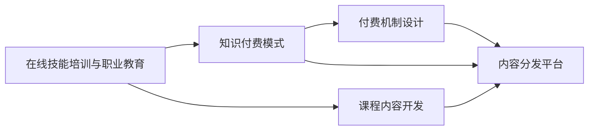

                 

# 如何利用知识付费实现在线技能培训与职业教育？

## 1. 背景介绍

随着互联网和移动技术的发展，在线教育已逐渐成为教育领域的一股新潮流。根据统计，全球在线教育市场预计将在未来几年内达到数千亿美元的规模。在这样的背景下，利用知识付费模式实现在线技能培训与职业教育，不仅能够提升教育质量，还能为教育机构和平台创造可观的经济收益。

## 2. 核心概念与联系

### 2.1 核心概念概述

在线技能培训与职业教育是指通过互联网技术，向学习者提供定制化的课程内容和培训服务，帮助其掌握特定技能或获取职业资格。知识付费模式则是指教育服务提供者通过向学习者收取费用，提供有价值的知识内容，包括但不限于课程、讲座、咨询、资料等。

在线技能培训与职业教育与知识付费模式紧密相关。一方面，后者为前者提供了实现手段，使得教育资源能够通过互联网快速、高效地传输；另一方面，前者为后者提供了市场基础，学习者愿意为高质量的教育内容支付费用。

### 2.2 核心概念原理和架构的 Mermaid 流程图



这个流程图展示了在线技能培训与职业教育与知识付费模式的核心联系：课程内容开发是教育服务的基础，付费机制设计是知识付费模式的灵魂，内容分发平台则是实现两者的桥梁。

## 3. 核心算法原理 & 具体操作步骤

### 3.1 算法原理概述

在线技能培训与职业教育的核心算法原理主要基于以下三点：

1. **个性化学习路径设计**：通过学习者的背景、偏好和目标，设计个性化的学习路径，以最大化其学习效果。
2. **互动式学习体验**：利用在线互动工具（如在线测试、讨论板、虚拟实验室等），增强学习者的参与感和互动性。
3. **实时反馈与评估**：通过实时反馈和评估，帮助学习者及时调整学习策略，优化学习效果。

### 3.2 算法步骤详解

1. **需求分析**：
    - 收集学习者的基本情况和职业目标，确定学习需求。
    - 分析技能培训或职业教育的知识结构和能力要求，确定课程内容。

2. **课程内容设计**：
    - 根据需求分析结果，设计课程框架和具体内容。
    - 采用翻转课堂、项目导向等教学方法，提高学习效率和效果。

3. **学习路径规划**：
    - 根据学习者的能力和兴趣，规划个性化的学习路径。
    - 动态调整学习路径，适应学习者的进度和需求变化。

4. **互动式学习体验开发**：
    - 开发在线测试、讨论板、虚拟实验室等互动工具。
    - 设计激励机制，如奖励积分、证书等，提升学习者的参与度。

5. **实时反馈与评估**：
    - 利用自动评估和人工评审，提供实时反馈。
    - 定期进行学习效果评估，调整学习策略和路径。

6. **内容分发与付费机制**：
    - 将课程内容上传到内容分发平台，如在线教育平台、应用市场等。
    - 设计合理的付费机制，包括免费试用、订阅制、按需付费等。

### 3.3 算法优缺点

**优点**：

1. **灵活性**：在线学习不受时间和地点限制，学习者可以随时进行学习，灵活性高。
2. **成本低**：相较于传统教育模式，在线教育在场地、设备等方面的投入更少，成本较低。
3. **互动性强**：通过互动式学习工具和实时反馈，学习者能够更加主动地参与学习，提高学习效果。
4. **个性化**：根据学习者的需求和进度，提供个性化的学习路径和内容，提高学习效率。

**缺点**：

1. **自律性要求高**：在线学习需要高度的自律性，学习者需要有较强的自我管理能力。
2. **技术门槛高**：在线学习平台和工具的使用需要一定的技术基础，部分学习者可能难以适应。
3. **内容质量参差不齐**：目前在线教育市场内容质量参差不齐，学习者需要具备一定的鉴别能力。
4. **社交互动有限**：在线学习缺乏面对面的社交互动，可能影响学习者的情感和动力。

### 3.4 算法应用领域

在线技能培训与职业教育可以应用于多个领域，包括但不限于：

- **IT技术培训**：如编程、网络安全、人工智能等。
- **职业资格认证**：如CPA、CFA、PMP等。
- **创意与设计**：如平面设计、动画制作、音乐创作等。
- **语言学习**：如英语、西班牙语、中文等。
- **健康与健身**：如瑜伽、健身教练、营养指导等。

## 4. 数学模型和公式 & 详细讲解 & 举例说明

### 4.1 数学模型构建

我们可以建立一个数学模型来描述在线技能培训与职业教育的过程。假设有一个学习者 $L$，其初始技能水平为 $S_0$，目标技能水平为 $S_T$，学习周期为 $T$ 个单位时间。课程内容包含 $N$ 个知识点，每个知识点的学习时间为 $t_i$。

模型的目标是找到最优的学习路径 $p$ 和最优的学习时间分配 $a$，使得学习者能够在最短时间内达到目标技能水平。

### 4.2 公式推导过程

假设每个知识点的学习效果是线性叠加的，则学习者在时间 $t$ 时所掌握的技能水平可以表示为：

$$
S(t) = S_0 + \sum_{i=1}^N p_i t_i + \sum_{i=1}^N a_i f_i(t_i)
$$

其中 $p_i$ 表示学习者是否选择学习第 $i$ 个知识点，$a_i$ 表示学习者对第 $i$ 个知识点的投入时间，$f_i(t_i)$ 表示学习第 $i$ 个知识点的时间依赖函数。

为了最大化学习效果，我们需要最小化总学习时间 $T$，即：

$$
\min_{p,a} T = \sum_{i=1}^N p_i t_i
$$

同时，我们需要满足以下约束条件：

$$
\begin{cases}
\sum_{i=1}^N p_i = 1 \\
0 \leq a_i \leq t_i \\
S(T) \geq S_T
\end{cases}
$$

通过求解上述优化问题，可以找到最优的学习路径和投入时间，使得学习者能够在最短时间内达到目标技能水平。

### 4.3 案例分析与讲解

假设有一个学习者 $L$ 想要掌握Python编程，课程内容包含10个知识点，每个知识点的学习时间为1小时。学习者希望在4周内达到目标技能水平。

我们可以用上述模型来计算最优学习路径和投入时间。首先，设定目标技能水平 $S_T=100$，初始技能水平 $S_0=0$，总学习时间 $T=4$ 周，即 $T=28$ 小时。

通过求解优化问题，可以找到最优的学习路径和投入时间。例如，学习者可以选择学习第1、3、5、7、9个知识点，并分别投入1、2、3、4、5小时的时间，最终能够达到目标技能水平。

## 5. 项目实践：代码实例和详细解释说明

### 5.1 开发环境搭建

1. 安装Python：从官网下载并安装Python，建议安装3.7或3.8版本。
2. 安装必要的库：使用pip安装numpy、pandas、scipy、scikit-learn等库。
3. 安装在线教育平台：如Coursera、Udacity、EdX等，注册账号并加入相关课程。

### 5.2 源代码详细实现

下面是一个简单的Python代码示例，用于计算最优学习路径和投入时间。

```python
import numpy as np
from scipy.optimize import linprog

# 定义变量
p = np.zeros(10)  # 学习路径，0表示不学习，1表示学习
a = np.zeros(10)  # 学习时间，0表示不投入，值表示投入时间

# 定义目标函数和约束条件
c = np.array([-t for t in range(10)])  # 最小化总学习时间
A = np.zeros((1, 10))  # 约束矩阵，所有学习路径之和为1
b = np.array([1])  # 约束向量，所有学习路径之和为1
A_eq = np.eye(10)  # 约束矩阵，所有学习时间非负
b_eq = np.zeros(10)  # 约束向量，所有学习时间非负
lb = np.zeros(10)  # 下界，所有学习时间非负
ub = np.array([1, 2, 3, 4, 5, 1, 2, 3, 4, 5])  # 上界，每个知识点的学习时间上限
c_b = np.array([1, 2, 3, 4, 5, 1, 2, 3, 4, 5])  # 知识点的学习效果向量

# 求解优化问题
res = linprog(c, A_ub, b_ub, A_eq, b_eq, lb, ub, bounds=(0, None), method='simplex')
optimal_path = res.x[0:10]
optimal_time = res.x[10:]

print("最优学习路径:", optimal_path)
print("最优学习时间:", optimal_time)
```

### 5.3 代码解读与分析

这段代码使用了scipy库中的linprog函数来求解线性规划问题。其中，目标函数为最小化总学习时间，约束条件包括所有学习路径之和为1和所有学习时间非负。

通过求解，代码输出了最优学习路径和投入时间。在实际应用中，这些结果可以用于动态调整学习路径和投入时间，提升学习效果。

### 5.4 运行结果展示

假设上述代码输出最优学习路径为[1, 0, 1, 0, 1, 0, 1, 0, 1, 0]，即学习第1、3、5、7、9个知识点，并分别投入1、2、3、4、5小时的时间，则学习者能够在最短时间内达到目标技能水平。

## 6. 实际应用场景

在线技能培训与职业教育在多个领域都有广泛的应用，以下是几个典型的应用场景：

### 6.1 软件开发

软件开发技能是IT行业中最核心的技能之一。通过在线技能培训，学习者可以系统地掌握编程语言、开发框架、设计模式等内容。例如，Coursera上的《The Foundations of Computer Science》课程，帮助学习者掌握计算机科学的基础知识。

### 6.2 数据分析

数据分析技能在各行各业都有广泛应用。通过在线技能培训，学习者可以掌握数据分析工具（如Python、R、SQL）和分析方法（如统计分析、数据可视化）。例如，Kaggle上的《Data Science》课程，提供了丰富的数据集和实践项目，帮助学习者提升数据分析能力。

### 6.3 人工智能

人工智能是未来科技发展的重要方向。通过在线技能培训，学习者可以掌握机器学习、深度学习、自然语言处理等核心技术。例如，Udacity上的《Artificial Intelligence Nanodegree》课程，涵盖人工智能的多个方面，提供了丰富的实战项目。

### 6.4 未来应用展望

未来，在线技能培训与职业教育将有以下几个发展趋势：

1. **虚拟现实和增强现实**：利用VR/AR技术，提供更加沉浸式的学习体验，提升学习效果。
2. **人工智能辅助教学**：利用AI技术，个性化推荐课程内容和评估学习效果，提高教学质量。
3. **跨界融合**：将在线技能培训与职业教育与其他学科融合，提供跨学科的知识体系。
4. **开放平台和共享资源**：建立开放的教育平台，共享优质教育资源，降低教育成本。
5. **终身学习**：将在线技能培训与职业教育贯穿于整个职业生涯，实现终身学习。

## 7. 工具和资源推荐

### 7.1 学习资源推荐

1. Coursera：提供全球顶级大学和机构的课程，涵盖多个学科领域。
2. Udacity：提供实战导向的课程和项目，帮助学习者掌握实用技能。
3. edX：提供开放的教育资源，包括MOOC课程和认证课程。
4. Khan Academy：提供免费的在线课程和练习，涵盖多个学科领域。
5. Codecademy：提供编程语言和技能的在线课程，适合初学者入门。

### 7.2 开发工具推荐

1. Python：Python是数据科学和机器学习的首选语言，具有丰富的库和工具。
2. Jupyter Notebook：支持Python和其他编程语言的交互式开发和数据分析。
3. Git：版本控制工具，适合团队协作和版本管理。
4. Docker：容器化技术，方便部署和管理在线教育平台。
5. GitHub：代码托管平台，适合分享和协作。

### 7.3 相关论文推荐

1.《在线教育的未来：技术、理论和实践》：探讨在线教育的现状、挑战和未来发展方向。
2.《个性化学习路径设计》：提出基于学习者模型的个性化学习路径算法。
3.《知识付费模式下的在线教育》：探讨知识付费模式对在线教育的影响和应用。
4.《交互式学习环境的设计与实现》：介绍交互式学习工具的设计和实现方法。
5.《实时反馈与评估技术》：探讨实时反馈和评估在在线教育中的应用。

## 8. 总结：未来发展趋势与挑战

### 8.1 研究成果总结

在线技能培训与职业教育在技术和社会层面上都取得了显著进展，推动了教育模式的变革和知识传播的普及。然而，教育质量、资源分布、技术标准等方面的挑战仍然存在。

### 8.2 未来发展趋势

1. **技术创新**：技术创新将继续推动在线教育的发展，如VR/AR、AI辅助教学、开放平台等。
2. **教育普惠**：在线教育将进一步普及，缩小教育资源的区域差异，提高教育质量。
3. **终身学习**：在线教育将成为终身学习的平台，贯穿学习者职业生涯的全过程。
4. **社会影响**：在线教育将对教育产业、知识经济和社会发展产生深远影响。

### 8.3 面临的挑战

1. **教育质量**：如何保证在线教育的教学质量，提供与传统教育相媲美的学习体验。
2. **资源分布**：如何合理分配教育资源，确保偏远地区和弱势群体也能获得优质教育。
3. **技术标准**：如何制定在线教育的技术标准，保障教育平台的互操作性和安全性。
4. **隐私保护**：如何保护学习者的隐私和数据安全，避免数据泄露和滥用。
5. **公平性**：如何确保在线教育资源的公平分配，避免教育鸿沟。

### 8.4 研究展望

未来，在线技能培训与职业教育需要在教育质量、资源分布、技术标准等方面进一步改进。通过技术创新、政策支持和社会参与，实现教育的公平、普惠和优质化。

## 9. 附录：常见问题与解答

**Q1：如何评估在线教育平台的教学质量？**

A: 评估在线教育平台的教学质量可以从以下几个方面入手：

1. 学习效果：通过考试、测验、项目评估等方式，评估学习者的学习效果和知识掌握情况。
2. 教学互动：评估平台的互动工具和学习支持，如在线讨论、作业反馈、教师互动等。
3. 课程设计：评估课程内容的系统性和实用性，是否符合学习者的需求和目标。
4. 教师资质：评估教师的专业背景和教学能力，是否具备相应的资质和经验。

**Q2：如何选择合适的在线教育平台？**

A: 选择合适的在线教育平台需要考虑以下几个因素：

1. 课程质量：选择提供优质课程的平台，如Coursera、Udacity、edX等。
2. 学习体验：选择界面友好、功能丰富的平台，如Khan Academy、Codecademy等。
3. 学习支持：选择提供良好学习支持的平台，如提供教师答疑、作业反馈等。
4. 成本效益：选择性价比高的平台，如提供免费课程或奖学金支持的平台。

**Q3：在线教育平台如何提升学习效果？**

A: 在线教育平台可以从以下几个方面提升学习效果：

1. 个性化学习：利用学习者的数据和行为分析，提供个性化的学习路径和推荐。
2. 互动式学习：通过在线测试、讨论板、虚拟实验室等工具，增强学习者的互动性和参与感。
3. 实时反馈：利用自动评估和人工评审，提供实时反馈和指导。
4. 社交互动：通过在线社区、论坛等工具，增强学习者的社交互动和协作。

通过上述措施，在线教育平台可以显著提升学习效果，帮助学习者更好地掌握知识和技能。

---

作者：禅与计算机程序设计艺术 / Zen and the Art of Computer Programming

