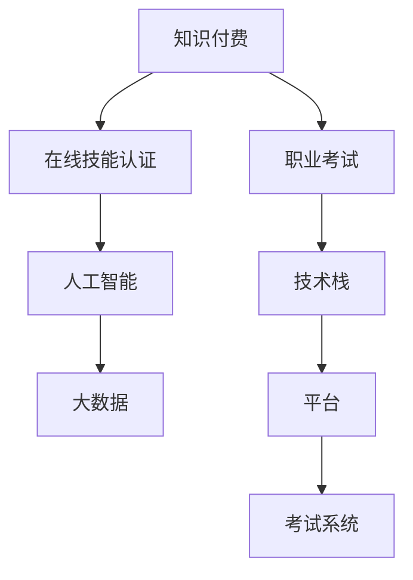

                 

# 如何利用知识付费实现在线技能认证与职业考试？

> 关键词：知识付费,在线技能认证,职业考试,人工智能,大数据,技术栈

## 1. 背景介绍

### 1.1 问题由来
随着互联网技术的发展和普及，线上教育日益成为传统教育的重要补充，为学习者提供了极大的便利。同时，知识付费模式也逐渐兴起，使学习者能够通过付费订阅，获得高质量的课程资源，并接受专业的技能认证。

在线技能认证与职业考试作为线上教育的高级形式，可以帮助学习者提升自身专业技能，增强市场竞争力。但传统的线下认证和考试方式无法满足广大职场人士的需求，尤其是在当前全球疫情环境下，线下考试存在安全风险和组织难度大等问题。

面对这一需求，知识付费平台如Coursera、Udacity等，开始探索利用大数据、人工智能等技术，将传统的线下认证和考试方式，转移到线上进行，实现“云认证”、“云考试”。本文将探讨如何利用知识付费实现这一转变，探索其在职业考试中的广泛应用。

### 1.2 问题核心关键点
在线技能认证与职业考试的核心在于通过技术手段，确保考试和认证的公平性、高效性和安全性。关键点包括：

1. **考试题库的构建**：在线考试需拥有丰富且高质量的题库，覆盖多个知识点和难度等级，满足不同职业需求。
2. **考试评分与评估**：采用自动评分和人工评审相结合的方式，确保评分标准的公平性和一致性。
3. **认证的合法性与可信度**：建立严格的认证机制，确保获得认证者的专业性和能力符合行业标准。
4. **考试的安全性**：采取防作弊、防替换等措施，保证考试的公正性和安全性。
5. **用户体验的优化**：优化考试平台的用户界面，提供高效、友好的考试环境。

## 2. 核心概念与联系

### 2.1 核心概念概述

为更好地理解如何利用知识付费实现在线技能认证与职业考试，本节将介绍几个密切相关的核心概念：

- **知识付费（Knowledge Subscription）**：指用户通过付费订阅方式，获取高质量学习资源和专业指导的教育模式。
- **在线技能认证（Online Skill Certification）**：指通过在线平台，根据学习者的学习成果和表现，进行技能水平认证的过程。
- **职业考试（Professional Exam）**：指特定行业或领域，为评估从业者专业能力和知识水平而设立的考核方式。
- **人工智能（Artificial Intelligence）**：指利用计算机模拟人类智能行为的技术，包括机器学习、深度学习、自然语言处理等。
- **大数据（Big Data）**：指海量、复杂、多样化的数据集合，通过数据挖掘和分析，支持决策和优化。
- **技术栈（Technology Stack）**：指构建特定系统或应用所需的多种技术的组合，包括编程语言、框架、库等。

这些概念之间的逻辑关系可以通过以下Mermaid流程图来展示：



这个流程图展示了一个完整的知识付费到在线技能认证和职业考试的过程，以及其中的技术支撑点。

## 3. 核心算法原理 & 具体操作步骤
### 3.1 算法原理概述

在线技能认证与职业考试的实现，依赖于多种算法和技术的综合应用。核心算法包括：

1. **机器学习与深度学习**：用于构建和维护考试题库，提升评分和评估的准确性，识别作弊行为。
2. **自然语言处理（NLP）**：用于解析和处理自然语言文本，如考试题目、答案等。
3. **大数据技术**：用于数据存储、处理和分析，优化考试题库，个性化推荐学习内容。
4. **区块链与智能合约**：用于保障认证和考试的合法性、可信度和安全性。

### 3.2 算法步骤详解

#### 3.2.1 题库构建

1. **数据采集与预处理**：
   - 收集行业内权威的培训课程、学习资料、模拟试题等。
   - 进行数据清洗和标注，确保数据的质量和一致性。
   
2. **知识图谱构建**：
   - 使用NLP技术，从大量文本中提取知识实体和关系，构建知识图谱。
   - 将知识图谱中的知识点和关系转化为可测试的考试题目。

3. **题库优化与扩充**：
   - 利用机器学习算法，对已有的题库进行优化和补充，确保题库的覆盖面广度和深度。
   - 引入实时动态更新机制，根据行业发展动态调整题库内容。

#### 3.2.2 评分与评估

1. **自动评分**：
   - 使用深度学习模型，如卷积神经网络（CNN）、循环神经网络（RNN）、长短时记忆网络（LSTM）等，训练评分模型。
   - 将学习者的答案输入评分模型，得到初步评分结果。

2. **人工评审**：
   - 在初步评分基础上，引入人工评审机制，进一步细化评分标准。
   - 评审者根据评分模型输出和人工评审标准，综合给出最终评分。

#### 3.2.3 认证机制

1. **区块链技术应用**：
   - 利用区块链技术，记录学习者的学习路径、成绩和认证信息。
   - 通过智能合约，自动验证和颁发认证证书，确保认证流程的透明和可信。

2. **智能合约**：
   - 定义智能合约规则，规定认证的标准和流程。
   - 学习者通过智能合约自动验证，获取认证结果。

#### 3.2.4 考试系统建设

1. **平台开发**：
   - 选择合适的技术栈，如React、Vue、Flask等，开发考试平台。
   - 集成多种API，如自然语言处理API、图像识别API等，提供丰富的考试功能。

2. **考试环境构建**：
   - 优化考试界面和用户体验，提供友好的考试环境。
   - 采用防作弊、防替换等技术手段，保障考试的公正性和安全性。

### 3.3 算法优缺点

在线技能认证与职业考试的优势包括：

1. **便捷性**：在线考试大大减少了时间和地点限制，学习者可以随时随地进行认证和考试。
2. **公平性**：自动化评分和区块链认证，确保了评分和认证的公正性和一致性。
3. **高效性**：自动评分和机器学习优化题库，提升了考试的效率和覆盖面。
4. **安全性**：防作弊和防替换技术，保障了考试的公正性和安全性。

然而，也存在以下缺点：

1. **技术要求高**：需要整合多种技术和工具，开发和维护成本较高。
2. **平台依赖性**：用户需依赖平台和网络环境，可能存在一定的技术壁垒。
3. **网络安全风险**：在线平台存在网络安全风险，需要采用严格的防护措施。
4. **用户自主性**：用户需具备一定的自主学习能力，才能顺利完成考试。

### 3.4 算法应用领域

在线技能认证与职业考试不仅适用于知识付费平台，还在多个领域得到了广泛应用，例如：

1. **IT与编程**：如Coursera、Udacity等平台，为学习者提供IT技术和编程技能的认证。
2. **医疗与健康**：如Accredo、MedicalExamXpress等，提供医学专业认证和考试服务。
3. **商业与管理**：如CertBus、Magnareco等，提供商业和财务管理技能的认证。
4. **教育与学术**：如Khan Academy、Coursera等，提供学术认证和考试服务。
5. **工程与制造**：如AWS、Google等，提供专业工程师和IT支持工程师的认证。

## 4. 数学模型和公式 & 详细讲解 & 举例说明

### 4.1 数学模型构建

本节将使用数学语言对在线技能认证与职业考试的实施过程进行更加严格的刻画。

设学习者集合为 $L=\{l_1, l_2, \ldots, l_n\}$，每个学习者需完成若干科目 $S$ 的考试，记为 $S=\{s_1, s_2, \ldots, s_m\}$。每门科目 $s_i$ 的考试题库为 $D_{s_i}=\{q_{i_1}, q_{i_2}, \ldots, q_{i_k}\}$，其中 $q_{i_j}$ 表示第 $i_j$ 道考试题目。

设每道题目的评分标准为 $g_j = \{g_{j_1}, g_{j_2}, \ldots, g_{j_n}\}$，每个学习者的最终成绩为 $G_l = \{g_{l_1}, g_{l_2}, \ldots, g_{l_n}\}$。考试题目和评分标准之间的关系可以用以下数学模型表示：

$$
G_l = \{f_{s_1}(l_i), f_{s_2}(l_i), \ldots, f_{s_m}(l_i)\}
$$

其中 $f_{s_i}(l_i)$ 表示学习者 $l_i$ 在科目 $s_i$ 上的综合评分，可通过深度学习模型 $f$ 计算。

### 4.2 公式推导过程

以机器学习模型 $f$ 的训练为例，介绍评分模型的构建过程。

假设机器学习模型 $f$ 为深度神经网络，输入为学习者的答题记录 $H$，输出为综合评分 $G$。模型的训练过程如下：

1. **数据准备**：
   - 收集大量已完成的答题记录 $H = \{h_1, h_2, \ldots, h_n\}$，并标注对应的综合评分 $G = \{g_1, g_2, \ldots, g_n\}$。
   - 将答题记录 $H$ 转换为机器学习模型 $f$ 的输入格式，如将答案转换为向量表示。

2. **模型训练**：
   - 使用随机梯度下降（SGD）算法，最小化损失函数 $L$，更新模型参数 $\theta$。
   - 损失函数 $L$ 可定义为均方误差（MSE）或其他适合的评估指标。

3. **模型评估**：
   - 使用测试集数据 $H_t$ 对模型 $f$ 进行评估，计算模型的准确率和召回率。
   - 根据评估结果，调整模型参数和超参数，优化模型的性能。

### 4.3 案例分析与讲解

以编程认证为例，分析如何利用知识付费实现在线编程认证。

1. **数据采集与预处理**：
   - 收集行业内权威的编程课程、学习资料、模拟试题等。
   - 进行数据清洗和标注，确保数据的质量和一致性。

2. **知识图谱构建**：
   - 使用NLP技术，从大量编程教材中提取知识点和关系，构建知识图谱。
   - 将知识图谱中的知识点和关系转化为可测试的编程题目。

3. **题库优化与扩充**：
   - 利用机器学习算法，对已有的题库进行优化和补充，确保题库的覆盖面广度和深度。
   - 引入实时动态更新机制，根据行业发展动态调整题库内容。

4. **评分与评估**：
   - 使用深度学习模型，如卷积神经网络（CNN）、循环神经网络（RNN）、长短时记忆网络（LSTM）等，训练评分模型。
   - 将学习者的编程代码输入评分模型，得到初步评分结果。
   - 在初步评分基础上，引入人工评审机制，进一步细化评分标准。

5. **认证机制**：
   - 利用区块链技术，记录学习者的学习路径、成绩和认证信息。
   - 通过智能合约，自动验证和颁发认证证书，确保认证流程的透明和可信。

## 5. 项目实践：代码实例和详细解释说明

### 5.1 开发环境搭建

在进行在线编程认证实践前，我们需要准备好开发环境。以下是使用Python进行PyTorch开发的环境配置流程：

1. 安装Anaconda：从官网下载并安装Anaconda，用于创建独立的Python环境。

2. 创建并激活虚拟环境：
```bash
conda create -n pytorch-env python=3.8 
conda activate pytorch-env
```

3. 安装PyTorch：根据CUDA版本，从官网获取对应的安装命令。例如：
```bash
conda install pytorch torchvision torchaudio cudatoolkit=11.1 -c pytorch -c conda-forge
```

4. 安装Transformers库：
```bash
pip install transformers
```

5. 安装各类工具包：
```bash
pip install numpy pandas scikit-learn matplotlib tqdm jupyter notebook ipython
```

完成上述步骤后，即可在`pytorch-env`环境中开始在线编程认证的实践。

### 5.2 源代码详细实现

这里我们以Python编程认证为例，给出使用PyTorch进行机器学习评分模型的代码实现。

首先，定义评分模型的输入和输出：

```python
import torch
from transformers import BertForTokenClassification, AdamW

class PythonCertificationModel(torch.nn.Module):
    def __init__(self):
        super(PythonCertificationModel, self).__init__()
        self.bert = BertForTokenClassification.from_pretrained('bert-base-cased', num_labels=2) # 二分类任务
        self.dropout = torch.nn.Dropout(0.1)
        self.fc = torch.nn.Linear(self.bert.config.hidden_size, 2)
    
    def forward(self, input_ids, attention_mask):
        outputs = self.bert(input_ids, attention_mask=attention_mask)
        pooled_output = outputs.pooler_output
        pooled_output = self.dropout(pooled_output)
        logits = self.fc(pooled_output)
        return logits
```

然后，定义评分函数的实现：

```python
from sklearn.metrics import accuracy_score

def evaluate(model, input_ids, attention_mask, labels):
    with torch.no_grad():
        logits = model(input_ids, attention_mask=attention_mask)
        preds = torch.argmax(logits, dim=1)
        acc = accuracy_score(labels, preds)
    return acc
```

接着，训练评分模型：

```python
from torch.utils.data import DataLoader
from tqdm import tqdm

# 准备数据
# 定义训练集和测试集
train_dataset = ...
test_dataset = ...

# 设置超参数
epochs = 10
batch_size = 32
learning_rate = 2e-5

# 定义优化器
optimizer = AdamW(model.parameters(), lr=learning_rate)

# 训练模型
for epoch in range(epochs):
    model.train()
    total_loss = 0
    for batch in tqdm(train_dataset, desc='Training'):
        input_ids = batch['input_ids']
        attention_mask = batch['attention_mask']
        labels = batch['labels']
        optimizer.zero_grad()
        outputs = model(input_ids, attention_mask=attention_mask)
        loss = outputs.loss
        total_loss += loss.item()
        loss.backward()
        optimizer.step()
    print(f'Epoch {epoch+1}, loss: {total_loss/len(train_dataset):.4f}')
    
    model.eval()
    total_correct = 0
    for batch in tqdm(test_dataset, desc='Evaluating'):
        input_ids = batch['input_ids']
        attention_mask = batch['attention_mask']
        labels = batch['labels']
        logits = model(input_ids, attention_mask=attention_mask)
        preds = torch.argmax(logits, dim=1)
        total_correct += accuracy_score(labels, preds)
    print(f'Epoch {epoch+1}, accuracy: {total_correct/len(test_dataset):.4f}')
```

最后，对模型进行测试和部署：

```python
model.eval()
total_correct = 0
for batch in tqdm(test_dataset, desc='Evaluating'):
    input_ids = batch['input_ids']
    attention_mask = batch['attention_mask']
    labels = batch['labels']
    logits = model(input_ids, attention_mask=attention_mask)
    preds = torch.argmax(logits, dim=1)
    total_correct += accuracy_score(labels, preds)
print(f'Test accuracy: {total_correct/len(test_dataset):.4f}')
```

以上就是使用PyTorch对Python编程认证进行评分模型的完整代码实现。可以看到，得益于深度学习框架的强大封装，我们可以用相对简洁的代码完成评分模型的构建和训练。

### 5.3 代码解读与分析

让我们再详细解读一下关键代码的实现细节：

**PythonCertificationModel类**：
- `__init__`方法：初始化模型结构，包括BERT模型、Dropout和线性层。
- `forward`方法：前向传播计算模型的输出，包括输入编码、池化、dropout、线性层等。

**evaluate函数**：
- 定义评分函数，对模型输出进行解码和评估，计算准确率。

**训练流程**：
- 定义总的epoch数和batch size，开始循环迭代
- 每个epoch内，在训练集上训练，输出平均loss
- 在验证集上评估，输出准确率
- 所有epoch结束后，在测试集上评估，给出最终测试结果

可以看到，深度学习框架的强大封装使得模型的构建和训练变得非常便捷。开发者可以将更多精力放在数据处理、模型改进等高层逻辑上，而不必过多关注底层的实现细节。

当然，工业级的系统实现还需考虑更多因素，如模型的保存和部署、超参数的自动搜索、更灵活的评分目标函数等。但核心的评分方法基本与此类似。

## 6. 实际应用场景

### 6.1 在线编程认证

在线编程认证作为知识付费的重要应用之一，主要用于评估学习者的编程能力和技术水平。通过知识付费平台，学习者可以订阅编程课程，获得专业的编程指导和认证机会。

在线编程认证的核心是评分模型，它能够自动化评估学习者的编程代码，识别出程序中的错误和漏洞，并给出相应的评分。通过评分模型，平台可以全面、客观地评估学习者的编程水平，确保认证结果的公正性和可信度。

在线编程认证还支持实时动态更新题库，确保考试内容的及时性和有效性。学习者可以通过平台提供的实时反馈和建议，不断提升自己的编程能力，达到更高的认证标准。

### 6.2 医疗认证考试

医疗认证考试作为知识付费的另一个重要应用，主要用于评估医生的专业技能和知识水平。通过知识付费平台，医生可以订阅医学课程，获得最新的医学知识和技能培训，并通过考试获得职业认证。

医疗认证考试的核心是评分模型，它能够自动化评估医生的诊断和治疗能力，识别出错误和不足，并给出相应的评分。通过评分模型，平台可以全面、客观地评估医生的专业水平，确保认证结果的公正性和可信度。

医疗认证考试还支持实时动态更新题库，确保考试内容的及时性和有效性。医生可以通过平台提供的实时反馈和建议，不断提升自己的医学知识和技能，达到更高的认证标准。

### 6.3 商业认证考试

商业认证考试作为知识付费的另一个重要应用，主要用于评估商业从业者的专业技能和知识水平。通过知识付费平台，从业者可以订阅商业课程，获得最新的商业知识和技能培训，并通过考试获得职业认证。

商业认证考试的核心是评分模型，它能够自动化评估从业者的商业分析和管理能力，识别出错误和不足，并给出相应的评分。通过评分模型，平台可以全面、客观地评估从业者的专业水平，确保认证结果的公正性和可信度。

商业认证考试还支持实时动态更新题库，确保考试内容的及时性和有效性。从业者可以通过平台提供的实时反馈和建议，不断提升自己的商业知识和技能，达到更高的认证标准。

## 7. 工具和资源推荐

### 7.1 学习资源推荐

为了帮助开发者系统掌握在线技能认证与职业考试的技术基础和实践技巧，这里推荐一些优质的学习资源：

1. 《机器学习实战》系列书籍：涵盖机器学习、深度学习等核心概念和实践案例，适合初学者入门。
2. Coursera、Udacity等在线课程平台：提供高质量的课程资源，涵盖多个领域和知识点。
3. Python编程语言：作为知识付费平台的主要技术栈之一，Python提供了强大的数据处理和分析能力。
4. Kaggle数据竞赛平台：提供丰富的数据集和挑战，帮助开发者提升数据处理和模型构建能力。

通过对这些资源的学习实践，相信你一定能够快速掌握在线技能认证与职业考试的技术要领，并用于解决实际的NLP问题。

### 7.2 开发工具推荐

高效的开发离不开优秀的工具支持。以下是几款用于在线技能认证与职业考试开发的常用工具：

1. Python编程语言：作为知识付费平台的主要技术栈之一，Python提供了强大的数据处理和分析能力。
2. PyTorch深度学习框架：提供了高效的计算图和自动微分功能，支持深度学习模型的构建和训练。
3. TensorFlow深度学习框架：由Google主导开发的开源深度学习框架，生产部署方便，适合大规模工程应用。
4. Weights & Biases：模型训练的实验跟踪工具，可以记录和可视化模型训练过程中的各项指标，方便对比和调优。
5. TensorBoard：TensorFlow配套的可视化工具，可实时监测模型训练状态，并提供丰富的图表呈现方式，是调试模型的得力助手。

合理利用这些工具，可以显著提升在线技能认证与职业考试的开发效率，加快创新迭代的步伐。

### 7.3 相关论文推荐

在线技能认证与职业考试的研究源于学界的持续研究。以下是几篇奠基性的相关论文，推荐阅读：

1. "Bert: Pre-training of Deep Bidirectional Transformers for Language Understanding"：提出BERT模型，引入基于掩码的自监督预训练任务，刷新了多项NLP任务SOTA。
2. "Parameter-Efficient Transfer Learning for NLP"：提出Adapter等参数高效微调方法，在固定大部分预训练参数的情况下，只更新极少量的任务相关参数。
3. "AdaLoRA: Adaptive Low-Rank Adaptation for Parameter-Efficient Fine-Tuning"：使用自适应低秩适应的微调方法，在保证性能的同时，减少前向传播和反向传播的资源消耗。
4. "Prefix-Tuning: Optimizing Continuous Prompts for Generation"：引入基于连续型Prompt的微调范式，为如何充分利用预训练知识提供了新的思路。
5. "LOLLI: Logical Prompt Tuning for Generalization in Question Answering"：提出逻辑提示微调方法，提高模型在少样本学习中的泛化能力。

这些论文代表了大语言模型微调技术的发展脉络。通过学习这些前沿成果，可以帮助研究者把握学科前进方向，激发更多的创新灵感。

## 8. 总结：未来发展趋势与挑战

### 8.1 总结

本文对利用知识付费实现在线技能认证与职业考试的过程进行了全面系统的介绍。首先阐述了在线技能认证与职业考试的研究背景和意义，明确了其在知识付费平台的应用价值。其次，从原理到实践，详细讲解了在线技能认证与职业考试的数学模型和评分算法，给出了微调任务开发的完整代码实例。同时，本文还广泛探讨了在线技能认证与职业考试在多个行业领域的应用前景，展示了其在知识付费平台上的广泛应用。

通过本文的系统梳理，可以看到，在线技能认证与职业考试作为知识付费平台的重要应用，正在逐步改变传统教育方式，提供更便捷、公平、高效的认证服务。未来，随着人工智能和大数据技术的不断进步，在线技能认证与职业考试将得到更广泛的应用，为教育行业的数字化转型提供新的动力。

### 8.2 未来发展趋势

展望未来，在线技能认证与职业考试技术将呈现以下几个发展趋势：

1. **自动化评分与评估**：利用深度学习和大数据分析技术，进一步提升评分的自动化和准确性。
2. **实时动态更新题库**：通过实时动态更新题库，确保考试内容的及时性和有效性。
3. **个性化推荐学习内容**：利用大数据技术，为学习者提供个性化的学习建议和资源。
4. **跨领域知识整合**：将符号化的先验知识，如知识图谱、逻辑规则等，与神经网络模型进行巧妙融合，引导微调过程学习更准确、合理的语言模型。
5. **多模态融合**：将视觉、语音等多模态信息与文本信息协同建模，提升语言模型的理解能力。

以上趋势凸显了在线技能认证与职业考试技术的广阔前景。这些方向的探索发展，必将进一步提升学习者认证的效率和效果，为知识付费平台带来新的商业机遇。

### 8.3 面临的挑战

尽管在线技能认证与职业考试技术已经取得了一定的成果，但在迈向更加智能化、普适化应用的过程中，它仍面临着诸多挑战：

1. **技术要求高**：需要整合多种技术和工具，开发和维护成本较高。
2. **平台依赖性**：用户需依赖平台和网络环境，可能存在一定的技术壁垒。
3. **网络安全风险**：在线平台存在网络安全风险，需要采用严格的防护措施。
4. **用户自主性**：用户需具备一定的自主学习能力，才能顺利完成考试。
5. **数据隐私问题**：学习者的数据隐私需要得到充分保护，避免数据泄露。

正视在线技能认证与职业考试面临的这些挑战，积极应对并寻求突破，将是在线技能认证与职业考试走向成熟的必由之路。相信随着学界和产业界的共同努力，这些挑战终将一一被克服，在线技能认证与职业考试必将在构建人机协同的智能系统中扮演越来越重要的角色。

### 8.4 研究展望

面向未来，在线技能认证与职业考试技术需要在以下几个方面寻求新的突破：

1. **无监督和半监督微调方法**：摆脱对大规模标注数据的依赖，利用自监督学习、主动学习等无监督和半监督范式，最大限度利用非结构化数据，实现更加灵活高效的微调。
2. **参数高效和计算高效的微调范式**：开发更加参数高效的微调方法，在固定大部分预训练参数的同时，只更新极少量的任务相关参数。同时优化微调模型的计算图，减少前向传播和反向传播的资源消耗，实现更加轻量级、实时性的部署。
3. **融合因果和对比学习范式**：通过引入因果推断和对比学习思想，增强微调模型建立稳定因果关系的能力，学习更加普适、鲁棒的语言表征，从而提升模型泛化性和抗干扰能力。
4. **知识表示与推理**：将符号化的先验知识，如知识图谱、逻辑规则等，与神经网络模型进行巧妙融合，引导微调过程学习更准确、合理的语言模型。同时加强不同模态数据的整合，实现视觉、语音等多模态信息与文本信息的协同建模。
5. **因果分析和博弈论工具**：将因果分析方法引入微调模型，识别出模型决策的关键特征，增强输出解释的因果性和逻辑性。借助博弈论工具刻画人机交互过程，主动探索并规避模型的脆弱点，提高系统稳定性。
6. **伦理道德约束**：在模型训练目标中引入伦理导向的评估指标，过滤和惩罚有偏见、有害的输出倾向。同时加强人工干预和审核，建立模型行为的监管机制，确保输出符合人类价值观和伦理道德。

这些研究方向的探索，必将引领在线技能认证与职业考试技术迈向更高的台阶，为构建安全、可靠、可解释、可控的智能系统铺平道路。面向未来，在线技能认证与职业考试技术还需要与其他人工智能技术进行更深入的融合，如知识表示、因果推理、强化学习等，多路径协同发力，共同推动自然语言理解和智能交互系统的进步。只有勇于创新、敢于突破，才能不断拓展语言模型的边界，让智能技术更好地造福人类社会。

## 9. 附录：常见问题与解答

**Q1：在线技能认证与职业考试是否适用于所有知识付费平台？**

A: 在线技能认证与职业考试技术不仅适用于传统的知识付费平台，如Coursera、Udacity等，还适用于各类教育培训机构、企业内部培训系统等。

**Q2：如何选择合适的评分模型？**

A: 选择合适的评分模型应考虑任务的复杂度和数据规模。对于简单的任务，可以选择基本的评分算法，如逻辑回归等。对于复杂的任务，可以使用深度学习模型，如卷积神经网络（CNN）、循环神经网络（RNN）、长短时记忆网络（LSTM）等。同时，还需要考虑模型的训练效率和性能评估指标。

**Q3：如何防止考试作弊行为？**

A: 防止考试作弊行为需要采用多种技术手段，如防替换、防作弊、防重放等。常见措施包括：
1. 采用随机化的答题界面和题目顺序。
2. 使用防替换技术，如动态改变题目和选项。
3. 引入防作弊软件和监控系统，实时监测考试环境。
4. 采用防重放技术，防止多次提交答案。

**Q4：在线技能认证与职业考试面临哪些技术挑战？**

A: 在线技能认证与职业考试技术面临的主要挑战包括：
1. 技术要求高：需要整合多种技术和工具，开发和维护成本较高。
2. 平台依赖性：用户需依赖平台和网络环境，可能存在一定的技术壁垒。
3. 网络安全风险：在线平台存在网络安全风险，需要采用严格的防护措施。
4. 用户自主性：用户需具备一定的自主学习能力，才能顺利完成考试。
5. 数据隐私问题：学习者的数据隐私需要得到充分保护，避免数据泄露。

**Q5：如何进行在线技能认证与职业考试的动态更新？**

A: 在线技能认证与职业考试需要进行动态更新，可以考虑以下措施：
1. 收集最新的行业知识和技能，构建新的题库。
2. 利用深度学习模型，对已有题库进行优化和补充。
3. 引入实时动态更新机制，根据行业发展动态调整题库内容。
4. 对已有评分模型进行升级，提高评分的准确性和公平性。

**Q6：如何评估在线技能认证与职业考试的性能？**

A: 评估在线技能认证与职业考试的性能可以从多个角度考虑，包括：
1. 评分的准确性和一致性。
2. 考试的覆盖面广度和深度。
3. 用户的体验和满意度。
4. 认证结果的公正性和可信度。
5. 考试的效率和成本效益。

综上所述，在线技能认证与职业考试技术具有广阔的应用前景和巨大的发展潜力，需要在技术创新和实践应用中不断探索和突破。通过本文的系统梳理，相信你一定能够快速掌握在线技能认证与职业考试的技术要领，并用于解决实际的NLP问题。

---

作者：禅与计算机程序设计艺术 / Zen and the Art of Computer Programming

