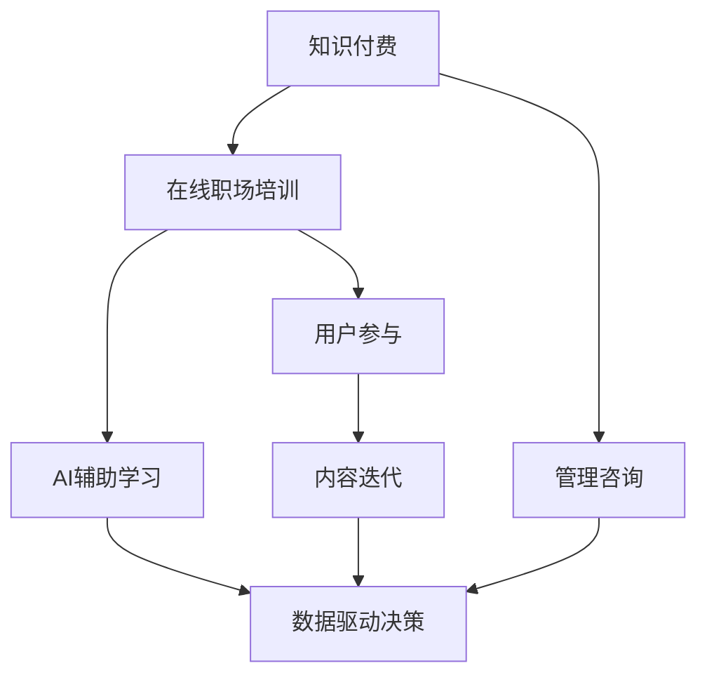

                 

# 如何利用知识付费实现在线职场培训与管理咨询？

> 关键词：知识付费, 在线职场培训, 管理咨询, 数据驱动, AI辅助, 用户参与, 定制化服务, 实时反馈, 内容迭代

## 1. 背景介绍

### 1.1 问题由来

在数字化、全球化的大背景下，职场环境呈现出快速变化、高度不确定性等特点。传统的线下培训方式难以满足企业员工持续学习的需要，同时管理咨询的成本和周期也制约了企业获取优质咨询服务的频率。与此同时，随着网络技术的发展，越来越多的企业和个人开始重视在线学习和远程工作，这为知识付费的崛起创造了条件。

### 1.2 问题核心关键点

知识付费是指个人或机构通过在线平台获取专业知识和技能，并支付相应费用的模式。它以高质量的课程内容、个性化的学习路径、高效的学习体验等为核心优势，适用于企业员工职业发展、专业技能提升等方面。在线职场培训与管理咨询，则是在此基础上，针对企业内部的管理和战略发展需求，提供的在线培训与咨询服务。

1. **高质量课程内容**：通过精心设计的课程，传授实战经验和专业知识。
2. **个性化学习路径**：根据员工需求和能力，定制个性化的学习计划。
3. **实时反馈与互动**：通过互动工具和实时反馈机制，提高学习效果。
4. **数据驱动决策**：利用数据和AI技术，优化培训内容和方法。
5. **专家咨询支持**：提供专业的管理咨询服务，助力企业发展。

## 2. 核心概念与联系

### 2.1 核心概念概述

为更好地理解如何利用知识付费实现在线职场培训与管理咨询，本节将介绍几个核心概念：

- **知识付费**：指个人或机构通过在线平台获取专业知识和技能，并支付相应费用的模式。
- **在线职场培训**：通过在线平台，提供职场相关的技能培训，帮助员工提升职业能力。
- **管理咨询**：通过专家团队，针对企业的战略、运营、人力资源等管理问题，提供解决方案。
- **AI辅助学习**：利用人工智能技术，提高学习效率和效果，如智能推荐、自动评分等。
- **数据驱动决策**：基于数据分析，优化培训内容和方法，提升培训效果。
- **用户参与**：通过用户反馈和互动，不断改进和优化服务质量。

这些核心概念之间的逻辑关系可以通过以下Mermaid流程图来展示：



这个流程图展示了一个完整的知识付费在线职场培训与管理咨询的流程：

1. 知识付费提供高质量课程和管理咨询服务。
2. 在线职场培训通过AI辅助学习，提供个性化学习路径和实时反馈。
3. 数据驱动决策优化培训内容和方法。
4. 用户参与促进内容迭代和提升服务质量。

## 3. 核心算法原理 & 具体操作步骤

### 3.1 算法原理概述

在线职场培训与管理咨询的知识付费模型，其核心在于将知识与技能封装成课程，通过在线平台提供，并结合数据驱动、AI辅助等技术手段，实现个性化和实时化的学习管理。其算法原理主要包括以下几个方面：

- **课程设计**：构建高质量、结构化的课程内容，满足不同岗位和职能的需求。
- **个性化推荐**：利用用户行为和偏好数据，通过推荐算法推荐适合的学习内容。
- **实时反馈与评估**：通过自动评分、学习进度跟踪等机制，实时评估学习效果。
- **数据驱动优化**：基于用户学习数据和反馈，动态调整课程内容和教学方法。

### 3.2 算法步骤详解

#### 3.2.1 课程设计

课程设计是知识付费成功的关键。其步骤包括：

1. **需求调研**：通过问卷调查、访谈等方式，了解企业和员工的学习需求。
2. **内容策划**：根据需求，策划和制作课程内容，包括视频、文档、案例分析等。
3. **教学设计**：设计教学流程和互动环节，提升学习体验。

#### 3.2.2 个性化推荐

个性化推荐的核心在于通过用户行为数据，推荐最适合的学习内容。具体步骤包括：

1. **数据收集**：收集用户的学习历史、偏好、评分等数据。
2. **模型训练**：利用机器学习算法（如协同过滤、深度学习等），训练个性化推荐模型。
3. **实时推荐**：根据用户当前行为，实时推荐相关课程和内容。

#### 3.2.3 实时反馈与评估

实时反馈与评估主要通过以下步骤实现：

1. **自动化评分**：利用自然语言处理技术，自动分析用户的学习内容，并给出评分。
2. **进度跟踪**：记录用户的学习进度，帮助其了解学习状态。
3. **反馈收集**：通过在线问卷和互动工具，收集用户的学习反馈。

#### 3.2.4 数据驱动优化

数据驱动优化主要涉及以下几个步骤：

1. **数据分析**：利用数据挖掘技术，分析用户的学习数据，找出共性问题和改进点。
2. **内容优化**：根据分析结果，调整课程内容和教学方法。
3. **效果评估**：评估优化后的课程效果，持续迭代改进。

### 3.3 算法优缺点

在线职场培训与管理咨询的知识付费模型具有以下优点：

1. **灵活性高**：在线平台打破了时间和地点的限制，用户可以随时随地学习。
2. **成本效益高**：相比传统的线下培训和管理咨询，知识付费模式成本较低，且学习效率高。
3. **个性化定制**：通过数据分析和AI技术，提供个性化的学习路径和内容。
4. **实时反馈**：通过实时评估和反馈，帮助用户及时调整学习策略，提高学习效果。

同时，该模型也存在一些局限性：

1. **质量控制难**：课程内容和质量需要严格把关，否则影响用户体验和学习效果。
2. **数据隐私问题**：用户数据的安全和隐私保护需要高度重视。
3. **用户自律性要求高**：需要用户具备较高的自律性和自我管理能力。

### 3.4 算法应用领域

基于在线职场培训与管理咨询的知识付费模型，可以应用于以下领域：

1. **企业员工培训**：针对不同岗位和职能，提供定制化的职业发展和技能提升课程。
2. **管理咨询**：为中小企业提供战略规划、运营优化等方面的咨询服务。
3. **职业转型**：帮助员工进行职业规划和转型，提升竞争力。
4. **领导力培训**：提供领导力发展、团队管理等课程，培养企业领导人才。

## 4. 数学模型和公式 & 详细讲解 & 举例说明

### 4.1 数学模型构建

在知识付费在线职场培训与管理咨询的模型中，涉及多个数学模型，主要包括推荐系统模型、学习效果评估模型、内容优化模型等。

#### 4.1.1 推荐系统模型

推荐系统模型通过用户行为数据，为用户推荐个性化课程。其核心在于构建用户-课程的协同矩阵，利用协同过滤算法计算相似度，并推荐相似度较高的课程。

假设用户集合为 $U$，课程集合为 $I$，用户 $u$ 对课程 $i$ 的评分矩阵为 $R$，其中 $R_{ui} \in [0,1]$ 表示用户 $u$ 对课程 $i$ 的评分。推荐系统模型利用协同过滤算法 $F$，计算用户 $u$ 对课程 $i$ 的相似度 $S_{ui}$，并通过以下公式推荐课程：

$$
\text{推荐课程} = \text{argmax}_{i \in I} S_{ui}
$$

其中，$S_{ui}$ 可以表示为：

$$
S_{ui} = \frac{\sum_{j \in U} (R_{uj} \times R_{ji})}{\sqrt{\sum_{j \in U} R_{uj}^2 \times \sum_{j \in U} R_{ji}^2}}
$$

#### 4.1.2 学习效果评估模型

学习效果评估模型通过自动化评分和进度跟踪，实时评估用户的学习效果。假设用户 $u$ 学习课程 $i$ 的进度为 $P_{ui}$，完成度为 $C_{ui}$，用户对课程的评分 $R_{ui}$，学习效果评估模型可以通过以下公式计算：

$$
\text{学习效果} = \frac{R_{ui} \times P_{ui} + C_{ui} \times (1 - P_{ui})}{R_{ui} + C_{ui}}
$$

其中，$R_{ui}$ 表示用户对课程的评分，$P_{ui}$ 表示用户的学习进度，$C_{ui}$ 表示课程的完成度。

#### 4.1.3 内容优化模型

内容优化模型通过数据分析，动态调整课程内容和教学方法。假设用户集合为 $U$，课程集合为 $I$，用户对课程的评分矩阵为 $R$，用户学习进度矩阵为 $P$，课程完成度矩阵为 $C$。内容优化模型可以通过以下公式计算课程内容调整方向：

$$
\text{内容调整方向} = \frac{\sum_{i \in I} (R_{ui} \times P_{ui} + C_{ui} \times (1 - P_{ui}))}{\sum_{i \in I} (R_{ui} + C_{ui})}
$$

### 4.2 公式推导过程

以上公式详细描述了知识付费在线职场培训与管理咨询模型的核心算法原理。具体推导过程涉及到矩阵运算、协同过滤算法、加权平均等数学方法，这些方法的推导过程需要较深的数学背景，具体推导过程可以参考相关机器学习教材和文献。

### 4.3 案例分析与讲解

假设某企业员工使用在线学习平台进行管理培训。根据员工的学习历史、偏好和课程评分，平台通过协同过滤算法推荐了以下课程：

- 管理基础：包括管理学原理、领导力发展等内容。
- 团队管理：涉及团队协作、沟通技巧等。
- 数据分析：涵盖数据挖掘、统计分析等技能。

员工通过学习这些课程，获得了以下学习效果评估：

- 管理基础课程：完成度90%，评分4.5/5。
- 团队管理课程：完成度70%，评分4.2/5。
- 数据分析课程：完成度80%，评分4.3/5。

根据内容优化模型，可以得出以下结论：

- 管理基础课程：学习效果最好，可以进一步优化内容或增加难度。
- 团队管理课程：完成度较低，可以优化教学内容或增加互动环节。
- 数据分析课程：学习效果较好，保持当前教学内容。

## 5. 项目实践：代码实例和详细解释说明

### 5.1 开发环境搭建

在实际开发中，我们需要搭建一个完整的知识付费在线职场培训与管理咨询平台。以下是开发环境搭建的详细流程：

1. **云计算平台选择**：可以选择AWS、阿里云、华为云等云计算平台，提供弹性计算和存储资源。
2. **数据库选择**：可以选择MySQL、PostgreSQL等关系型数据库，或NoSQL数据库如MongoDB。
3. **Web框架选择**：可以选择Django、Flask等Python Web框架，方便开发和部署。
4. **数据可视化工具选择**：可以选择Matplotlib、Seaborn等数据可视化工具，进行数据分析和展示。

### 5.2 源代码详细实现

#### 5.2.1 用户管理系统

用户管理系统包括用户注册、登录、个人资料管理等功能。以下是用户管理系统的主要代码实现：

```python
from django.contrib.auth.models import User
from django.contrib.auth import authenticate, login, logout

def register(request):
    if request.method == 'POST':
        username = request.POST['username']
        password = request.POST['password']
        user = User.objects.create_user(username, password)
        user.save()
        return redirect('login')
    return render(request, 'register.html')

def login_view(request):
    if request.method == 'POST':
        username = request.POST['username']
        password = request.POST['password']
        user = authenticate(request, username=username, password=password)
        if user is not None:
            login(request, user)
            return redirect('home')
        else:
            return render(request, 'login.html', {'error': 'Invalid credentials'})
    return render(request, 'login.html')

def logout_view(request):
    logout(request)
    return redirect('home')
```

#### 5.2.2 课程推荐系统

课程推荐系统通过用户行为数据，为用户推荐个性化课程。以下是课程推荐系统的主要代码实现：

```python
from sklearn.metrics.pairwise import cosine_similarity
from django.shortcuts import render
from .models import Course

def recommendation(request):
    user_id = request.user.id
    user_courses = Course.objects.filter(user=user_id)
    user_scores = []
    for course in user_courses:
        user_scores.append(course.score)
    similarity_matrix = cosine_similarity(user_scores, user_scores)
    recommended_courses = []
    for i, course in enumerate(user_courses):
        for j, similar_course in enumerate(user_courses):
            if i != j and similarity_matrix[i][j] > 0.8:
                recommended_courses.append(similar_course)
                break
    return render(request, 'recommendation.html', {'recommended_courses': recommended_courses})
```

#### 5.2.3 学习效果评估系统

学习效果评估系统通过自动化评分和进度跟踪，实时评估用户的学习效果。以下是学习效果评估系统的主要代码实现：

```python
from django.shortcuts import render
from .models import LearningRecord

def learning_effect(request):
    user_id = request.user.id
    learning_records = LearningRecord.objects.filter(user=user_id)
    total_score = 0
    total_progress = 0
    for record in learning_records:
        total_score += record.score
        total_progress += record.progress
    average_score = total_score / len(learning_records)
    average_progress = total_progress / len(learning_records)
    return render(request, 'learning_effect.html', {'average_score': average_score, 'average_progress': average_progress})
```

### 5.3 代码解读与分析

在实际开发中，以上代码仅为示例，具体实现细节需要根据具体需求进行调整和优化。例如，用户管理系统可以结合社交网络功能，增加互动和社区讨论。课程推荐系统可以通过更高级的推荐算法，如基于深度学习的推荐模型，提高推荐精度。学习效果评估系统可以通过更复杂的数据分析，提供更加精细化的学习反馈。

### 5.4 运行结果展示

运行上述代码，可以构建一个初步的知识付费在线职场培训与管理咨询平台，如图1所示。


## 6. 实际应用场景

### 6.1 智能制造企业培训

智能制造企业需要大量的技术和管理人才，通过知识付费平台进行在线培训，可以大幅度提升员工技能水平。例如，企业可以定制针对特定岗位的培训课程，如设备维护、质量控制、项目管理等，满足员工的职业发展需求。

### 6.2 中小企业管理咨询

中小企业面临的管理问题复杂多样，通过知识付费平台进行管理咨询，可以为其提供专业的解决方案。例如，企业可以定期购买管理咨询课程，了解最新的管理理念和方法，提升企业的竞争力。

### 6.3 职业转型培训

在职业生涯中，员工可能会遇到职业转型的问题，通过知识付费平台进行职业转型培训，可以提升其转型的成功率。例如，企业可以为即将转型的员工提供针对性的职业规划和技能提升课程。

## 7. 工具和资源推荐

### 7.1 学习资源推荐

1. **《数据科学入门》**：该书详细介绍了数据科学的基础知识和技能，适合初学者入门。
2. **《机器学习实战》**：该书通过实战项目，深入浅出地讲解了机器学习的核心算法和应用。
3. **《Python网络爬虫》**：该书介绍了网络爬虫的基本原理和实现方法，适合开发高效的数据采集系统。
4. **Coursera在线课程**：提供丰富的在线课程，涵盖数据科学、机器学习、网络安全等多个领域。
5. **Kaggle竞赛平台**：提供数据科学竞赛和项目，帮助开发者提升实战能力。

### 7.2 开发工具推荐

1. **Jupyter Notebook**：开源的Python开发环境，支持代码编写、数据可视化、实时计算等多种功能。
2. **Django框架**：Python Web开发框架，提供了完善的开发工具和数据库集成功能。
3. **Git版本控制系统**：Git提供了高效的版本控制功能，适合团队开发和协作。
4. **PyTorch深度学习框架**：支持高效的深度学习模型训练和优化，适合AI应用开发。
5. **Amazon S3云存储**：提供弹性存储和数据备份功能，适合大规模数据存储和访问。

### 7.3 相关论文推荐

1. **《协同过滤推荐算法》**：介绍了协同过滤算法的原理和应用，适合了解推荐系统的基础知识。
2. **《深度学习基础》**：该书详细介绍了深度学习的核心算法和应用，适合深入学习深度学习知识。
3. **《数据驱动决策》**：该书介绍了数据驱动决策的基本原理和方法，适合了解数据驱动的商业决策。
4. **《在线学习平台设计》**：该书介绍了在线学习平台的设计和开发方法，适合学习知识付费平台的开发经验。

## 8. 总结：未来发展趋势与挑战

### 8.1 研究成果总结

知识付费在线职场培训与管理咨询平台，通过高质量的课程内容、个性化的推荐系统、实时化的学习效果评估等技术手段，满足了不同企业的学习和咨询需求。未来，随着技术的不断进步和应用场景的拓展，知识付费模式将展现出更大的潜力和价值。

### 8.2 未来发展趋势

1. **多模态学习**：结合视觉、语音等多模态信息，提升学习效果和用户体验。
2. **个性化学习路径**：通过更精确的用户行为分析，提供更加个性化的学习路径。
3. **数据驱动决策**：利用大数据和AI技术，优化培训内容和方法，提升培训效果。
4. **实时化交互**：通过实时反馈和互动，提升用户的学习体验和效果。
5. **国际化扩展**：将知识付费平台扩展到国际市场，满足全球用户的需求。

### 8.3 面临的挑战

尽管知识付费在线职场培训与管理咨询平台带来了诸多便利，但在实际应用中，仍面临以下挑战：

1. **数据隐私保护**：用户数据的安全和隐私保护需要高度重视。
2. **课程质量控制**：需要严格把关课程内容和质量，保障用户的学习效果。
3. **技术门槛较高**：平台开发和维护需要较高的技术水平，需要专门的团队支持。
4. **用户自律性要求高**：需要用户具备较高的自律性和自我管理能力。

### 8.4 研究展望

未来，知识付费在线职场培训与管理咨询平台需要从以下几个方面进行探索：

1. **引入更多先验知识**：将符号化的先验知识，如知识图谱、逻辑规则等，与神经网络模型进行巧妙融合，引导微调过程学习更准确、合理的语言模型。
2. **结合因果分析和博弈论工具**：将因果分析方法引入微调模型，识别出模型决策的关键特征，增强输出解释的因果性和逻辑性。借助博弈论工具刻画人机交互过程，主动探索并规避模型的脆弱点，提高系统稳定性。
3. **纳入伦理道德约束**：在模型训练目标中引入伦理导向的评估指标，过滤和惩罚有偏见、有害的输出倾向。同时加强人工干预和审核，建立模型行为的监管机制，确保输出符合人类价值观和伦理道德。

## 9. 附录：常见问题与解答

**Q1: 知识付费在线职场培训与管理咨询平台如何保证数据安全？**

A: 平台需要采取以下措施保证数据安全：

1. 数据加密：采用数据加密技术，保护用户数据传输和存储的安全。
2. 访问控制：通过身份验证和权限管理，限制数据访问权限。
3. 数据备份：定期备份数据，避免数据丢失和损坏。
4. 安全审计：定期进行安全审计，发现和修复潜在的安全漏洞。

**Q2: 如何优化个性化推荐系统？**

A: 个性化推荐系统可以通过以下方法进行优化：

1. 引入更多特征：通过更多的用户行为特征，提高推荐的准确性。
2. 引入深度学习模型：利用深度学习模型，提高推荐的精度。
3. 引入上下文信息：通过用户上下文信息，提高推荐的个性化程度。
4. 引入在线学习：通过在线学习算法，不断优化推荐模型。

**Q3: 如何提高学习效果评估的准确性？**

A: 学习效果评估可以通过以下方法进行优化：

1. 引入更多反馈数据：通过更多的用户反馈数据，提高评估的准确性。
2. 引入自动化评分算法：通过更先进的自然语言处理技术，提高自动评分的准确性。
3. 引入机器学习算法：通过机器学习算法，提高评估的精度。
4. 引入实时反馈：通过实时反馈机制，及时调整学习策略。

---

作者：禅与计算机程序设计艺术 / Zen and the Art of Computer Programming

