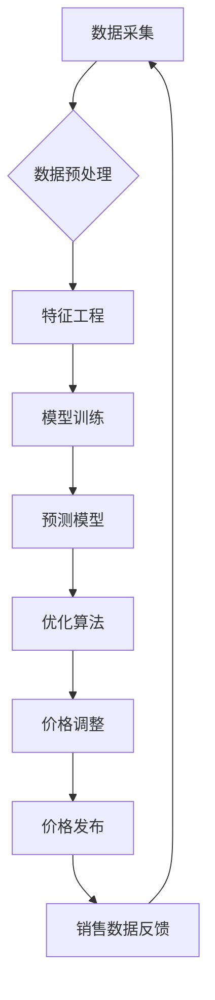

>  动态定价、机器学习、电商、预测模型、优化算法、价格策略、数据分析、人工智能

## 1. 背景介绍

在当今激烈的电商市场竞争中，制定有效的定价策略至关重要。传统的定价方法往往依赖于经验和市场调研，缺乏灵活性，难以适应瞬息万变的市场环境。随着人工智能技术的快速发展，动态定价逐渐成为电商行业的新趋势。动态定价是指根据实时数据和市场变化，动态调整商品价格的策略。它利用人工智能算法分析海量数据，预测未来市场需求和竞争情况，从而制定最优的定价方案，最大化电商平台的收益。

## 2. 核心概念与联系

**2.1 动态定价的核心概念**

* **实时数据采集:**  动态定价需要实时获取大量数据，包括商品库存、市场价格、用户行为、季节性因素、促销活动等。
* **预测模型:** 利用机器学习算法构建预测模型，预测未来商品需求、竞争对手价格、市场趋势等。
* **优化算法:** 根据预测结果，利用优化算法计算出最优价格，平衡利润最大化和市场竞争。
* **价格调整机制:**  建立自动化的价格调整机制，根据预测结果和实时数据动态调整商品价格。

**2.2 动态定价的架构**



**2.3 动态定价与电商平台的关系**

动态定价可以帮助电商平台实现以下目标：

* **提高利润率:** 通过精准定价，最大化商品销售利润。
* **优化库存管理:**  根据预测需求调整库存，减少库存积压和缺货风险。
* **提升用户体验:**  根据用户行为和偏好，提供个性化价格，提升用户购物体验。
* **增强市场竞争力:**  通过灵活的定价策略，应对市场竞争，抢占市场份额。

## 3. 核心算法原理 & 具体操作步骤

**3.1 算法原理概述**

动态定价的核心算法通常基于机器学习和优化算法。机器学习算法用于构建预测模型，预测未来商品需求和市场价格。优化算法则根据预测结果，计算出最优价格，平衡利润最大化和市场竞争。常见的机器学习算法包括线性回归、逻辑回归、决策树、支持向量机、神经网络等。常见的优化算法包括梯度下降法、遗传算法、模拟退火算法等。

**3.2 算法步骤详解**

1. **数据采集:** 收集商品信息、市场价格、用户行为、季节性因素、促销活动等数据。
2. **数据预处理:** 清洗、转换、标准化数据，使其适合机器学习算法训练。
3. **特征工程:**  提取数据中的特征，例如商品属性、用户画像、时间序列等，构建更有效的预测模型。
4. **模型训练:** 利用机器学习算法训练预测模型，例如预测未来商品需求、竞争对手价格等。
5. **模型评估:**  评估模型的预测精度，选择最优模型。
6. **优化算法:**  根据预测结果和实时数据，利用优化算法计算出最优价格，平衡利润最大化和市场竞争。
7. **价格调整:**  根据计算出的最优价格，动态调整商品价格。
8. **监控和评估:**  持续监控价格调整效果，并根据实际情况调整算法参数和策略。

**3.3 算法优缺点**

* **优点:**
    * 能够根据实时数据和市场变化动态调整价格，提高利润率。
    * 能够预测未来市场需求和竞争情况，降低风险。
    * 能够提供个性化价格，提升用户购物体验。
* **缺点:**
    * 需要大量数据和计算资源。
    * 模型训练和优化需要专业技术人员。
    * 价格调整过于频繁可能影响用户体验。

**3.4 算法应用领域**

动态定价算法广泛应用于电商平台、旅游平台、航空公司、酒店预订平台等领域。

## 4. 数学模型和公式 & 详细讲解 & 举例说明

**4.1 数学模型构建**

动态定价模型通常是一个复杂的数学模型，包含多个变量和参数。一个简单的动态定价模型可以表示为：

$$P = f(D, C, S, T)$$

其中：

* $P$：商品价格
* $D$：商品需求
* $C$：商品成本
* $S$：市场竞争情况
* $T$：时间因素

**4.2 公式推导过程**

具体的公式推导过程取决于具体的模型和算法。例如，如果使用线性回归模型，可以推导出以下公式：

$$P = a + bD + cC + dS + eT$$

其中 $a, b, c, d, e$ 是模型参数，可以通过训练数据拟合得到。

**4.3 案例分析与讲解**

假设一家电商平台销售一款手机，其成本为 $1000 元，市场竞争情况为中等，时间因素为促销活动期间。根据预测模型，该手机的需求量为 $1000 台，市场价格为 $1200 元。

使用上述线性回归模型，如果模型参数为 $a = 500, b = 0.5, c = -0.8, d = -100, e = 50$，则该手机的最优价格为：

$$P = 500 + 0.5 * 1000 + (-0.8) * 1000 + (-100) * 0.5 + 50 * 1 = 1050 元$$

## 5. 项目实践：代码实例和详细解释说明

**5.1 开发环境搭建**

* 操作系统：Linux/Windows/macOS
* Python 版本：3.6+
* 必要的库：pandas, numpy, scikit-learn, matplotlib

**5.2 源代码详细实现**

```python
import pandas as pd
from sklearn.linear_model import LinearRegression

# 数据加载
data = pd.read_csv('price_data.csv')

# 数据预处理
# ...

# 特征工程
# ...

# 模型训练
model = LinearRegression()
model.fit(X_train, y_train)

# 模型评估
# ...

# 价格预测
new_data = pd.DataFrame({
    'demand': [1000],
    'cost': [1000],
    'competition': [0.5],
    'time': [1]
})
predicted_price = model.predict(new_data)

print(f'Predicted price: {predicted_price[0]}')
```

**5.3 代码解读与分析**

* 代码首先加载数据，并进行预处理和特征工程。
* 然后使用线性回归模型训练预测模型。
* 最后使用训练好的模型预测新的商品价格。

**5.4 运行结果展示**

运行代码后，会输出预测的商品价格。

## 6. 实际应用场景

**6.1 电商平台**

电商平台可以利用动态定价算法，根据商品需求、市场价格、用户行为等因素，动态调整商品价格，提高利润率。例如，在促销活动期间，可以降低商品价格吸引用户购买；在商品库存充足时，可以提高商品价格获得更高的利润。

**6.2 旅游平台**

旅游平台可以利用动态定价算法，根据航班、酒店、旅游线路的供需情况，动态调整价格，提高收益。例如，在旅游旺季，可以提高价格；在淡季，可以降低价格吸引用户预订。

**6.3 航空公司**

航空公司可以利用动态定价算法，根据航班的座位剩余情况、市场需求、竞争对手价格等因素，动态调整机票价格，提高收益。例如，在航班接近满员时，可以提高机票价格；在航班座位充足时，可以降低机票价格吸引用户购买。

**6.4 未来应用展望**

随着人工智能技术的不断发展，动态定价算法将更加智能化、个性化。未来，动态定价将应用于更多领域，例如：

* **个性化定价:** 根据用户的购买历史、浏览记录、偏好等信息，为用户提供个性化的价格。
* **实时动态定价:**  根据实时数据，例如商品库存、市场价格、用户行为等，动态调整价格，实现更加精准的定价策略。
* **协同定价:**  多个平台或商家协同制定定价策略，共同应对市场竞争。

## 7. 工具和资源推荐

**7.1 学习资源推荐**

* **书籍:**
    * 《机器学习》 - 周志华
    * 《深度学习》 - Ian Goodfellow
* **在线课程:**
    * Coursera: Machine Learning
    * edX: Artificial Intelligence
* **博客和网站:**
    * Towards Data Science
    * Machine Learning Mastery

**7.2 开发工具推荐**

* **Python:**  Python 是机器学习和数据分析的常用语言。
* **Scikit-learn:**  Scikit-learn 是 Python 的一个机器学习库，提供各种机器学习算法和工具。
* **TensorFlow/PyTorch:** TensorFlow 和 PyTorch 是深度学习框架，用于构建和训练深度学习模型。

**7.3 相关论文推荐**

* **Dynamic Pricing with Machine Learning: A Survey**
* **Deep Learning for Dynamic Pricing**
* **A Reinforcement Learning Approach to Dynamic Pricing**

## 8. 总结：未来发展趋势与挑战

**8.1 研究成果总结**

动态定价技术在电商、旅游、航空等领域取得了显著成果，提高了企业利润率，提升了用户体验。

**8.2 未来发展趋势**

* **更加智能化:**  利用更先进的机器学习算法，例如深度学习，构建更加智能的预测模型。
* **更加个性化:**  根据用户的购买历史、浏览记录、偏好等信息，为用户提供个性化的价格。
* **更加协同化:**  多个平台或商家协同制定定价策略，共同应对市场竞争。

**8.3 面临的挑战**

* **数据质量:**  动态定价算法依赖于高质量的数据，数据不准确或不完整会影响模型的预测精度。
* **算法解释性:**  一些机器学习算法的决策过程难以解释，这可能会导致用户对动态定价产生 distrust。
* **公平性:**  动态定价算法可能会导致价格歧视，例如对不同用户群体提供不同的价格。

**8.4 研究展望**

未来，动态定价技术将继续发展，朝着更加智能化、个性化、协同化的方向发展。同时，需要解决数据质量、算法解释性和公平性等挑战，确保动态定价技术能够公平、透明、可解释地应用于各个领域。

## 9. 附录：常见问题与解答

**9.1  动态定价会影响用户体验吗？**

动态定价可能会导致价格波动，如果价格调整过于频繁，可能会影响用户体验。因此，需要根据实际情况，制定合理的定价策略，避免过度频繁的调整。

**9.2  动态定价是否会造成价格歧视？**

动态定价算法可能会根据用户的不同特征，例如购买历史、浏览记录、偏好等信息，提供不同的价格。如果算法设计不当，可能会导致价格歧视。因此，需要确保算法公平公正，避免对不同用户群体造成不公平的待遇。

**9.3  如何评估动态定价算法的性能？**

动态定价算法的性能可以评估指标包括：

* **预测精度:**  模型预测的商品需求和市场价格的准确性。
* **利润率:**  动态定价策略带来的利润增长。
* **用户满意度:**  用户对价格调整的接受程度。


作者：禅与计算机程序设计艺术 / Zen and the Art of Computer Programming 
<end_of_turn>