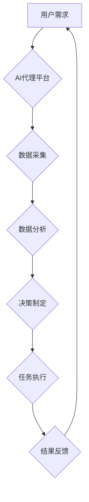

> AI代理, 智慧城市, 工作流, 应用场景, 算法原理, 数学模型, 代码实例, 未来趋势

## 1. 背景介绍

智慧城市作为未来城市发展的重要方向，旨在通过信息技术和数据分析，提升城市管理效率、提升居民生活品质。在智慧城市建设过程中，人工智能（AI）技术扮演着越来越重要的角色。AI代理作为一种新型的智能化服务模式，能够自动执行任务、学习和适应环境变化，在智慧城市中具有广泛的应用前景。

传统的城市管理模式往往依赖于人工操作，效率低下，难以应对复杂多变的城市环境。而AI代理能够自动处理大量数据，识别模式，并做出决策，从而提高城市管理效率，降低成本。例如，AI代理可以用于智能交通管理、环境监测、公共安全保障等领域，为城市居民提供更加便捷、高效、安全的公共服务。

## 2. 核心概念与联系

**2.1 AI代理的概念**

AI代理是一种能够自主执行任务的智能软件系统。它通常具有以下特征：

* **自主性:** AI代理能够根据预设的目标和环境信息，自主做出决策并执行相应的行动。
* **学习能力:** AI代理能够从经验中学习，不断改进自己的决策和行为。
* **适应性:** AI代理能够适应不断变化的环境，并调整自己的策略以实现目标。

**2.2 智慧城市的概念**

智慧城市是指利用信息技术和数据分析，提升城市管理效率、提升居民生活品质的城市。智慧城市建设的核心目标是：

* **提高城市管理效率:** 通过数据分析和智能化决策，优化城市资源配置，提高城市运行效率。
* **提升居民生活品质:** 提供更加便捷、高效、安全的公共服务，提升居民生活水平。
* **促进经济发展:** 利用信息技术和数据分析，促进城市产业升级，推动经济发展。

**2.3 AI代理在智慧城市中的应用**

AI代理能够在智慧城市中发挥重要的作用，例如：

* **智能交通管理:** AI代理可以分析交通流量数据，优化交通信号灯控制，减少拥堵，提高交通效率。
* **环境监测:** AI代理可以收集环境数据，监测空气质量、水质等，及时发现环境问题，并采取相应的措施。
* **公共安全保障:** AI代理可以分析视频监控数据，识别异常行为，提高城市安全水平。

**2.4 工作流图**



## 3. 核心算法原理 & 具体操作步骤

**3.1 算法原理概述**

AI代理的决策和行为通常基于机器学习算法。常见的机器学习算法包括：

* **监督学习:** 利用标记数据训练模型，预测未来结果。例如，可以利用历史交通流量数据训练模型，预测未来交通流量。
* **无监督学习:** 从未标记数据中发现模式和结构。例如，可以利用城市居民的移动轨迹数据，发现出行规律。
* **强化学习:** 通过试错学习，找到最优策略。例如，可以利用强化学习算法训练AI代理，优化交通信号灯控制策略。

**3.2 算法步骤详解**

1. **数据收集:** 收集与AI代理任务相关的各种数据，例如交通流量数据、环境监测数据、视频监控数据等。
2. **数据预处理:** 对收集到的数据进行清洗、转换、特征提取等操作，使其适合机器学习算法的训练。
3. **模型训练:** 选择合适的机器学习算法，利用预处理后的数据训练模型。
4. **模型评估:** 利用测试数据评估模型的性能，并根据评估结果进行模型调优。
5. **模型部署:** 将训练好的模型部署到AI代理平台，使其能够实时处理数据并做出决策。

**3.3 算法优缺点**

* **优点:**

    * 能够自动处理大量数据，提高效率。
    * 能够识别模式，发现隐藏的规律。
    * 能够学习和适应环境变化。

* **缺点:**

    * 需要大量的数据进行训练。
    * 模型的性能取决于训练数据的质量。
    * 算法的解释性较差，难以理解模型的决策过程。

**3.4 算法应用领域**

* **智能交通管理:** 交通流量预测、拥堵缓解、智能信号灯控制。
* **环境监测:** 空气质量监测、水质监测、环境污染预警。
* **公共安全保障:** 视频监控分析、异常行为识别、犯罪预测。
* **医疗保健:** 疾病诊断、药物研发、个性化医疗。

## 4. 数学模型和公式 & 详细讲解 & 举例说明

**4.1 数学模型构建**

在AI代理中，可以使用数学模型来描述代理的决策过程和行为。例如，可以使用马尔可夫决策过程（MDP）来建模代理在不同状态下采取不同行动的决策过程。

**4.2 公式推导过程**

MDP模型的核心是状态转移概率和奖励函数。状态转移概率描述了代理从一个状态转移到另一个状态的概率，奖励函数描述了代理在某个状态采取某个行动获得的奖励。

**状态转移概率:**

$$P(s_t'|s_t,a_t)$$

其中：

* $s_t$ 表示代理在时间步 $t$ 的状态。
* $a_t$ 表示代理在时间步 $t$ 采取的行动。
* $s_t'$ 表示代理在时间步 $t+1$ 的状态。

**奖励函数:**

$$R(s_t,a_t,s_t')$$

其中：

* $s_t$ 表示代理在时间步 $t$ 的状态。
* $a_t$ 表示代理在时间步 $t$ 采取的行动。
* $s_t'$ 表示代理在时间步 $t+1$ 的状态。

**4.3 案例分析与讲解**

例如，在智能交通管理场景中，我们可以使用MDP模型来建模交通信号灯的控制策略。

* 状态：交通流量、车道拥堵程度等。
* 行动：调整信号灯的绿灯时间。
* 奖励：减少拥堵时间、提高交通效率等。

通过训练MDP模型，可以学习到最优的信号灯控制策略，从而提高交通效率。

## 5. 项目实践：代码实例和详细解释说明

**5.1 开发环境搭建**

* 操作系统：Ubuntu 20.04
* Python 版本：3.8
* 必要的库：TensorFlow、PyTorch、NumPy、Pandas等

**5.2 源代码详细实现**

```python
# 导入必要的库
import tensorflow as tf

# 定义模型结构
model = tf.keras.models.Sequential([
    tf.keras.layers.Dense(64, activation='relu', input_shape=(10,)),
    tf.keras.layers.Dense(32, activation='relu'),
    tf.keras.layers.Dense(1)
])

# 定义损失函数和优化器
model.compile(loss='mse', optimizer='adam')

# 训练模型
model.fit(X_train, y_train, epochs=10)

# 评估模型
loss = model.evaluate(X_test, y_test)
print('Loss:', loss)

# 使用模型预测
predictions = model.predict(X_new)
```

**5.3 代码解读与分析**

* 代码首先导入必要的库。
* 然后定义一个简单的深度学习模型，包含一个全连接层和一个输出层。
* 模型使用均方误差损失函数和Adam优化器进行训练。
* 训练完成后，使用测试数据评估模型的性能。
* 最后，使用训练好的模型对新的数据进行预测。

**5.4 运行结果展示**

训练完成后，可以查看模型的损失值和预测结果。

## 6. 实际应用场景

**6.1 智能交通管理**

AI代理可以用于优化交通信号灯控制、预测交通流量、引导车辆避开拥堵路段等，从而提高交通效率和安全性。

**6.2 环境监测**

AI代理可以收集环境数据，监测空气质量、水质等，并及时发出预警，帮助政府和企业采取措施保护环境。

**6.3 公共安全保障**

AI代理可以分析视频监控数据，识别异常行为，例如犯罪行为、事故发生等，提高城市安全水平。

**6.4 未来应用展望**

随着人工智能技术的不断发展，AI代理在智慧城市中的应用场景将更加广泛。例如，AI代理可以用于智能医疗、智慧教育、智慧养老等领域，为城市居民提供更加便捷、高效、安全的公共服务。

## 7. 工具和资源推荐

**7.1 学习资源推荐**

* **书籍:**
    * 《深度学习》
    * 《机器学习》
    * 《人工智能：一种现代方法》
* **在线课程:**
    * Coursera
    * edX
    * Udacity

**7.2 开发工具推荐**

* **Python:** 广泛应用于人工智能开发，拥有丰富的库和工具。
* **TensorFlow:** Google开发的开源深度学习框架。
* **PyTorch:** Facebook开发的开源深度学习框架。

**7.3 相关论文推荐**

* **Reinforcement Learning: An Introduction**
* **Deep Learning**
* **Generative Adversarial Networks**

## 8. 总结：未来发展趋势与挑战

**8.1 研究成果总结**

近年来，AI代理在智慧城市中的应用取得了显著进展，例如智能交通管理、环境监测、公共安全保障等领域取得了成功应用。

**8.2 未来发展趋势**

* **模型更加智能化:** 未来AI代理的模型将更加智能化，能够更好地理解和适应复杂环境。
* **应用场景更加广泛:** AI代理的应用场景将更加广泛，覆盖更多领域，例如智能医疗、智慧教育、智慧养老等。
* **安全性与可靠性更高:** 未来AI代理的安全性与可靠性将得到进一步提升，能够更好地保障城市运行安全。

**8.3 面临的挑战**

* **数据获取与隐私保护:** AI代理需要大量的数据进行训练，如何获取高质量的数据，同时保障数据隐私是一个挑战。
* **算法解释性:** 许多AI算法的决策过程难以解释，如何提高算法的解释性，增强用户信任是一个挑战。
* **伦理问题:** AI代理的应用可能会带来一些伦理问题，例如算法偏见、责任归属等，需要进行深入研究和探讨。

**8.4 研究展望**

未来，我们将继续致力于AI代理在智慧城市中的应用研究，探索更智能、更安全、更可靠的AI代理技术，为智慧城市建设贡献力量。

## 9. 附录：常见问题与解答

**9.1 如何选择合适的AI代理算法？**

选择合适的AI代理算法需要根据具体的应用场景和数据特点进行选择。例如，如果需要预测未来趋势，可以使用监督学习算法；如果需要发现隐藏的模式，可以使用无监督学习算法；如果需要学习最优策略，可以使用强化学习算法。

**9.2 如何保障AI代理的安全性与可靠性？**

保障AI代理的安全性与可靠性需要从多个方面进行考虑，例如：

* 使用安全的训练数据，避免算法学习到偏见或错误信息。
* 对模型进行充分的测试和评估，确保模型的性能稳定可靠。
* 设计合理的安全机制，防止恶意攻击和数据泄露。

**9.3 AI代理的伦理问题如何解决？**

AI代理的伦理问题是一个复杂的问题，需要多方共同努力解决。例如：

* 制定相关的法律法规，规范AI代理的应用。
* 加强对AI算法的解释性研究，提高用户对算法决策的理解。
* 促进社会对AI伦理的讨论和共识形成。


作者：禅与计算机程序设计艺术 / Zen and the Art of Computer Programming 
<end_of_turn>