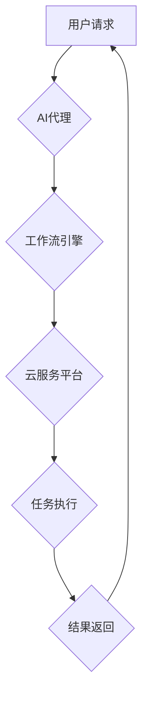

> AI代理, 工作流, 云服务, 部署策略, 容器化, 自动化, 可扩展性, 监控

## 1. 背景介绍

随着人工智能技术的飞速发展，AI代理作为一种新型的智能化服务，在各个领域展现出巨大的应用潜力。AI代理能够自动执行任务、处理请求、提供个性化服务，极大地提升了工作效率和用户体验。然而，传统的AI代理部署方式存在着诸多局限性，例如部署复杂、维护成本高、可扩展性差等问题。

云计算技术的兴起为AI代理的部署提供了新的解决方案。云服务平台提供弹性、可扩展、安全可靠的计算资源，能够有效解决传统部署方式的痛点。基于云服务的AI代理工作流部署策略，能够实现AI代理的快速部署、灵活扩展、高效管理，为AI代理的广泛应用奠定了坚实的基础。

## 2. 核心概念与联系

### 2.1 AI代理

AI代理是一种能够自主执行任务、与用户交互、提供智能化服务的软件系统。它通常由以下几个核心组件组成：

* **知识库:** 存储代理所需知识和规则，例如用户偏好、任务流程、业务逻辑等。
* **推理引擎:** 基于知识库和输入信息，进行逻辑推理和决策，确定执行的任务和操作步骤。
* **执行模块:** 执行代理所决定的任务，例如发送邮件、查询数据库、控制设备等。
* **用户接口:** 提供用户与代理交互的界面，例如文本聊天、语音对话、图形界面等。

### 2.2 工作流

工作流是一种描述业务流程的模型，它将业务流程分解成一系列的步骤，并定义了步骤之间的依赖关系和执行顺序。工作流能够提高业务流程的效率、可管理性和可扩展性。

### 2.3 云服务

云服务是一种基于互联网提供的计算资源、存储资源、网络资源等服务。云服务平台提供弹性、可扩展、安全可靠的计算资源，能够满足各种应用的需求。

### 2.4 核心架构

基于云服务的AI代理工作流部署策略，将AI代理与工作流引擎集成，并部署在云服务平台上。



## 3. 核心算法原理 & 具体操作步骤

### 3.1 算法原理概述

基于云服务的AI代理工作流部署策略的核心算法原理是将AI代理与工作流引擎进行集成，并利用云服务平台的弹性、可扩展性等特性，实现AI代理的快速部署、灵活扩展、高效管理。

### 3.2 算法步骤详解

1. **定义工作流:** 根据业务需求，定义AI代理的工作流程，包括各个步骤、步骤之间的依赖关系和执行顺序。
2. **部署AI代理:** 将AI代理部署到云服务平台上，并配置必要的资源和环境。
3. **集成工作流引擎:** 将AI代理与工作流引擎进行集成，实现工作流的自动化执行。
4. **触发工作流:** 当用户发出请求时，触发相应的AI代理工作流。
5. **执行工作流:** 工作流引擎根据定义的流程，执行各个步骤，并调用AI代理进行任务处理。
6. **返回结果:** AI代理完成任务后，返回结果给用户。

### 3.3 算法优缺点

**优点:**

* **快速部署:** 利用云服务平台的快速部署能力，可以快速部署AI代理。
* **灵活扩展:** 根据业务需求，可以灵活扩展AI代理的资源和功能。
* **高效管理:** 云服务平台提供完善的监控和管理工具，可以方便地管理AI代理。
* **可扩展性:** 云服务平台的弹性资源可以满足AI代理的快速扩展需求。

**缺点:**

* **依赖云服务:** 需要依赖云服务平台的稳定性和安全性。
* **成本较高:** 云服务平台的费用可能较高。

### 3.4 算法应用领域

基于云服务的AI代理工作流部署策略，在以下领域具有广泛的应用前景:

* **客户服务:** AI代理可以自动处理客户咨询、投诉等问题，提高客户服务效率。
* **业务流程自动化:** AI代理可以自动化执行业务流程，例如订单处理、合同管理等，提高业务效率。
* **数据分析:** AI代理可以自动收集、分析数据，提供数据驱动的决策支持。
* **个性化推荐:** AI代理可以根据用户的行为和偏好，提供个性化的产品或服务推荐。

## 4. 数学模型和公式 & 详细讲解 & 举例说明

### 4.1 数学模型构建

为了描述AI代理工作流的执行效率，我们可以构建一个数学模型：

```latex
E = \frac{T}{C}
```

其中：

* $E$ 表示AI代理工作流的执行效率。
* $T$ 表示工作流的执行时间。
* $C$ 表示工作流的复杂度。

### 4.2 公式推导过程

工作流的执行时间 $T$ 可以表示为各个步骤执行时间的总和：

```latex
T = \sum_{i=1}^{n} t_i
```

其中：

* $n$ 表示工作流中步骤的总数。
* $t_i$ 表示第 $i$ 个步骤的执行时间。

工作流的复杂度 $C$ 可以表示为工作流中步骤的个数和步骤之间的依赖关系的复杂度：

```latex
C = n + d
```

其中：

* $d$ 表示步骤之间的依赖关系的复杂度。

将上述公式代入到 $E$ 的公式中，得到：

```latex
E = \frac{\sum_{i=1}^{n} t_i}{n + d}
```

### 4.3 案例分析与讲解

假设一个工作流包含5个步骤，每个步骤的执行时间分别为10秒、20秒、30秒、40秒和50秒，步骤之间的依赖关系较为简单，复杂度为2。

则工作流的执行时间为：

```latex
T = 10 + 20 + 30 + 40 + 50 = 150 秒
```

工作流的复杂度为：

```latex
C = 5 + 2 = 7
```

因此，工作流的执行效率为：

```latex
E = \frac{150}{7} \approx 21.43
```

## 5. 项目实践：代码实例和详细解释说明

### 5.1 开发环境搭建

* 操作系统: Ubuntu 20.04
* 云服务平台: AWS
* 编程语言: Python
* 框架: Flask

### 5.2 源代码详细实现

```python
from flask import Flask, request, jsonify

app = Flask(__name__)

# AI代理逻辑
def process_request(request_data):
    # 使用AI模型处理请求数据
    # ...
    return response_data

@app.route('/api/process', methods=['POST'])
def process():
    request_data = request.get_json()
    response_data = process_request(request_data)
    return jsonify(response_data)

if __name__ == '__main__':
    app.run(host='0.0.0.0', port=5000)
```

### 5.3 代码解读与分析

* **Flask框架:** 使用Flask框架构建了一个简单的API接口。
* **process_request函数:** 模拟AI代理处理请求的逻辑，实际应用中需要使用具体的AI模型进行处理。
* **/api/process接口:** 接收用户请求，调用process_request函数处理请求，并返回处理结果。

### 5.4 运行结果展示

启动API服务后，可以通过发送POST请求到`/api/process`接口，向AI代理提交请求数据，并获取处理结果。

## 6. 实际应用场景

### 6.1 客户服务

AI代理可以接入企业客服系统，自动处理客户咨询、投诉等问题，例如：

* 回答常见问题
* 指导用户操作
* 转接人工客服

### 6.2 业务流程自动化

AI代理可以自动化执行业务流程，例如：

* 订单处理: 自动接收订单、核对库存、生成物流单等。
* 合同管理: 自动生成合同、发送合同、跟踪合同执行情况等。

### 6.3 数据分析

AI代理可以自动收集、分析数据，提供数据驱动的决策支持，例如：

* 销售数据分析: 分析销售趋势、客户行为等。
* 市场调研: 分析市场需求、竞争对手情况等。

### 6.4 未来应用展望

随着人工智能技术的不断发展，AI代理的应用场景将更加广泛，例如：

* 个性化教育: 根据学生的学习情况，提供个性化的学习内容和辅导。
* 智能医疗: 辅助医生诊断疾病、制定治疗方案。
* 智能家居: 控制家居设备、提供个性化服务。

## 7. 工具和资源推荐

### 7.1 学习资源推荐

* **书籍:**
    * 《深度学习》
    * 《人工智能：一种现代方法》
* **在线课程:**
    * Coursera: 深度学习
    * edX: 人工智能

### 7.2 开发工具推荐

* **云服务平台:** AWS, Azure, GCP
* **容器化平台:** Docker, Kubernetes
* **AI框架:** TensorFlow, PyTorch

### 7.3 相关论文推荐

* **《Attention Is All You Need》**
* **《BERT: Pre-training of Deep Bidirectional Transformers for Language Understanding》**

## 8. 总结：未来发展趋势与挑战

### 8.1 研究成果总结

基于云服务的AI代理工作流部署策略，能够有效解决传统AI代理部署方式的痛点，为AI代理的广泛应用奠定了坚实的基础。

### 8.2 未来发展趋势

* **更强大的AI模型:** 随着人工智能技术的不断发展，AI代理将能够处理更复杂的任务，提供更智能化的服务。
* **更完善的云服务平台:** 云服务平台将提供更丰富的功能和服务，支持AI代理的更灵活、更高效的部署和管理。
* **更广泛的应用场景:** AI代理将应用于更多领域，例如教育、医疗、金融等。

### 8.3 面临的挑战

* **数据安全:** AI代理需要处理大量用户数据，数据安全是一个重要的挑战。
* **算法可解释性:** AI代理的决策过程往往是复杂的，缺乏可解释性，这可能会导致用户信任问题。
* **伦理问题:** AI代理的应用可能会带来一些伦理问题，例如算法偏见、隐私侵犯等。

### 8.4 研究展望

未来，我们将继续研究基于云服务的AI代理工作流部署策略，探索更强大的AI模型、更完善的云服务平台、更广泛的应用场景，并积极应对数据安全、算法可解释性和伦理问题等挑战。

## 9. 附录：常见问题与解答

### 9.1 如何部署AI代理到云服务平台？

可以使用云服务平台提供的部署工具，例如AWS Elastic Beanstalk、Azure App Service等，将AI代理的代码和依赖库部署到云服务器上。

### 9.2 如何集成AI代理与工作流引擎？

可以使用工作流引擎提供的API接口，调用AI代理的接口，将AI代理集成到工作流中。

### 9.3 如何监控AI代理的运行状态？

可以使用云服务平台提供的监控工具，监控AI代理的CPU使用率、内存使用率、请求处理时间等指标。

### 9.4 如何保证AI代理的数据安全？

可以使用云服务平台提供的安全服务，例如数据加密、访问控制等，保障AI代理的数据安全。


作者：禅与计算机程序设计艺术 / Zen and the Art of Computer Programming 
<end_of_turn>