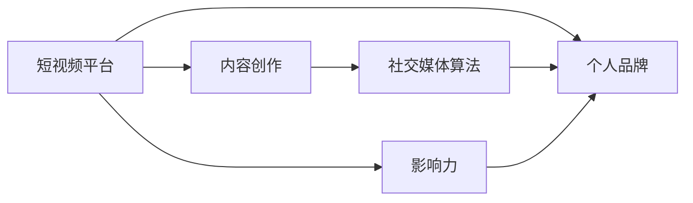

                 

# 如何利用短视频平台提升个人品牌

> 关键词：短视频，个人品牌，内容创作，社交媒体，算法推荐，影响力和知名度

## 1. 背景介绍

在当今数字化时代，社交媒体和短视频平台已成为个人展示才华、塑造影响力的重要舞台。从初入职场的新手到业内资深人士，各行各业的专家和创业者都在积极利用这些平台提升个人品牌，构建自己的在线影响力。短视频平台，如TikTok、抖音等，因其直观的视觉体验和高效的传播速度，逐渐成为塑造个人品牌的新趋势。

短视频不仅能让人们通过视觉和听觉内容快速获取信息，还能帮助创作者以更生动、更直接的方式与受众互动。以下是一些具体原因，说明为何短视频平台对于提升个人品牌至关重要：

1. **即时性和互动性**：短视频平台的实时性和互动性强，使得创作者可以即时发布内容并与观众互动，增加观众的参与感。
2. **高曝光率**：短视频通过算法推荐，可以快速将优质内容推送给大量用户，显著提升内容的曝光率。
3. **多平台交叉推广**：创作者可以将短视频内容跨平台发布，扩大其受众范围，进一步提升影响力。
4. **低成本与高回报**：相比传统媒体，短视频平台的制作和发布成本相对较低，但传播效果显著，非常适合初创品牌和个人。

## 2. 核心概念与联系

### 2.1 核心概念概述

为了更深入理解如何在短视频平台上提升个人品牌，本节将介绍几个核心概念：

- **短视频平台**：指的是如抖音、TikTok、Instagram Reels等提供短视频发布和观看功能的社交媒体平台。
- **个人品牌**：是指个人在特定领域内建立起来的独特形象和价值主张，通过其在社交媒体上的内容创作和互动实现。
- **内容创作**：即制作并发布短视频的过程，包括内容策划、拍摄、编辑和发布等环节。
- **社交媒体算法**：社交媒体平台通过算法来个性化推荐内容，以提高用户粘性和互动率。
- **影响力**：指个人品牌在特定领域的权威性和号召力，通过传播和互动实现。

这些核心概念之间的关系可以通过以下Mermaid流程图来展示：



这个流程图展示了短视频平台、内容创作、社交媒体算法和个人品牌之间的相互作用。短视频平台提供展示和互动的平台，内容创作是提升个人品牌的关键，社交媒体算法增强了内容的传播效果，最终影响个人品牌在受众中的影响力和知名度。

## 3. 核心算法原理 & 具体操作步骤
### 3.1 算法原理概述

短视频平台上的内容推荐算法是提升个人品牌的关键因素之一。这些算法通过分析用户的观看历史、互动行为、兴趣偏好等数据，个性化地推荐内容。创作者若能理解并运用这些算法原理，便能更好地优化其内容，从而提升观看次数和互动率。

具体而言，短视频平台的推荐算法通常基于以下几种技术：

- **协同过滤**：通过分析用户之间的相似性和偏好，推荐类似内容。
- **内容过滤**：根据内容的标签、分类和特征，推荐相关内容。
- **深度学习**：利用深度神经网络对用户行为和内容进行建模，预测用户偏好。
- **强化学习**：通过不断调整推荐策略，优化用户体验和留存率。

这些算法技术的核心目标是通过个性化推荐，提高内容的曝光率和用户粘性。

### 3.2 算法步骤详解

以下是对短视频平台推荐算法推荐步骤的详细解释：

1. **用户画像构建**：平台通过分析用户的观看历史、互动行为、搜索关键词等数据，构建用户画像，包括兴趣偏好、观看时间、地域等特征。

2. **内容特征提取**：对上传的短视频进行特征提取，如时长、画质、音频、主题、标签等，以供推荐算法使用。

3. **相似度计算**：算法根据用户画像和内容特征，计算用户与内容之间的相似度，找出最匹配的内容进行推荐。

4. **效果反馈**：平台根据用户观看视频后的反馈（如观看时间、点赞、评论、分享等），调整推荐算法策略，进一步优化推荐结果。

5. **持续学习**：推荐算法通过在线学习，不断从新数据中学习和调整模型参数，提升推荐精准度。

### 3.3 算法优缺点

短视频平台的推荐算法具有以下优点：

- **高效性**：通过个性化推荐，平台可以快速将优质内容推送给目标用户，提升观看率。
- **灵活性**：算法可以动态调整推荐策略，适应不同用户和场景的需求。
- **用户粘性**：个性化推荐提高了用户对平台的粘性，增加了平台的活跃度和留存率。

同时，这些算法也存在以下局限性：

- **数据隐私**：用户数据被用于构建用户画像和推荐算法，可能引发隐私保护问题。
- **算法偏见**：如果数据存在偏见，推荐算法可能也会产生偏见，导致不公正的推荐结果。
- **过度个性化**：过度个性化的推荐可能限制了用户的视野，减少了多样性的内容曝光。

### 3.4 算法应用领域

短视频平台的推荐算法不仅应用于内容推荐，还在广告投放、用户增长、品牌建设等方面发挥重要作用：

- **广告投放**：通过精准的广告推荐，提高广告的点击率和转化率。
- **用户增长**：推荐优质内容，吸引新用户，增加平台的用户基础。
- **品牌建设**：创作者通过推荐算法提升其内容曝光，增强品牌影响力。

## 4. 数学模型和公式 & 详细讲解 & 举例说明

### 4.1 数学模型构建

为了理解短视频平台推荐算法的数学模型，以下将构建一个简单的协同过滤推荐模型。假设短视频平台有 $U$ 个用户和 $V$ 个视频，用户 $u$ 对视频 $v$ 的评分 $r_{uv}$ 可以从 $1$ 到 $5$ 不等。协同过滤推荐模型旨在预测用户 $u$ 对视频 $v$ 的评分，以便推荐类似的视频。

设 $\mathbf{R} \in \mathbb{R}^{U \times V}$ 为用户-视频评分矩阵，$\mathbf{R}_{uv} = r_{uv}$。协同过滤模型包括基于用户和基于项目的两种方法，下面以基于用户的协同过滤模型为例进行说明。

### 4.2 公式推导过程

基于用户的协同过滤模型通过用户之间的相似度计算，预测用户对视频的评分。设 $\mathbf{A} \in \mathbb{R}^{U \times U}$ 为用户相似度矩阵，$\mathbf{A}_{uv} = s_{uv}$ 表示用户 $u$ 和用户 $v$ 的相似度。

模型公式为：

$$
\hat{r}_{uv} = \sum_{i=1}^U s_{iu} \cdot r_{iv}
$$

其中，$s_{iu} = \frac{\sum_{j=1}^V r_{uj} \cdot r_{vj}}{\sqrt{\sum_{j=1}^V r_{uj}^2} \cdot \sqrt{\sum_{j=1}^V r_{vj}^2}}$ 为用户 $u$ 和用户 $v$ 的相似度，$\hat{r}_{uv}$ 为预测的评分。

### 4.3 案例分析与讲解

假设我们有一个用户-视频评分矩阵 $\mathbf{R}$，如下：

$$
\mathbf{R} = \begin{bmatrix}
3.5 & 3.0 & 4.5 \\
3.0 & 4.5 & 4.0 \\
3.5 & 4.0 & 3.0
\end{bmatrix}
$$

假设用户 $u_1$ 与用户 $u_2$ 的相似度为 $0.9$，用户 $u_1$ 的评分向量为 $\mathbf{r}_{u_1} = [3.5, 3.0, 4.5]$，我们可以计算出用户 $u_1$ 对视频 $v_1$ 的评分预测 $\hat{r}_{u_1v_1}$ 为：

$$
\hat{r}_{u_1v_1} = s_{u_1u_2} \cdot r_{u_2v_1} = 0.9 \times 3.0 = 2.7
$$

这表明用户 $u_1$ 对视频 $v_1$ 的评分预测为 $2.7$。

## 5. 项目实践：代码实例和详细解释说明

### 5.1 开发环境搭建

为了开始短视频内容创作和品牌建设的实践，需要搭建一个开发环境。以下是Python环境下搭建相关环境的示例：

1. 安装Python：从[Python官网](https://www.python.org/)下载并安装最新版本Python。
2. 安装Jupyter Notebook：
   ```
   pip install jupyterlab
   ```
3. 安装相关库：
   ```
   pip install numpy pandas matplotlib
   ```

### 5.2 源代码详细实现

以下是一个使用Python和Pandas库实现的简单协同过滤推荐模型：

```python
import pandas as pd
import numpy as np

# 构建用户-视频评分矩阵
R = pd.DataFrame({
    'u1': [3.5, 3.0, 4.5],
    'u2': [3.0, 4.5, 4.0],
    'u3': [3.5, 4.0, 3.0]
}, index=['v1', 'v2', 'v3'])

# 计算用户相似度矩阵
A = np.dot(R.values, R.values.T) / np.sqrt(np.dot(R.values**2, R.values**2).diagonal()[:, np.newaxis])

# 预测用户评分
r_hat = np.dot(A, R.values)

# 输出预测评分
print(r_hat)
```

### 5.3 代码解读与分析

在上述代码中，首先使用Pandas构建用户-视频评分矩阵 $\mathbf{R}$。然后，计算用户相似度矩阵 $\mathbf{A}$，其中 $s_{iu} = \frac{\sum_{j=1}^V r_{uj} \cdot r_{vj}}{\sqrt{\sum_{j=1}^V r_{uj}^2} \cdot \sqrt{\sum_{j=1}^V r_{vj}^2}}$。最后，计算预测评分 $\hat{r}_{uv}$。

### 5.4 运行结果展示

运行上述代码，输出预测评分矩阵 $\hat{R}$：

```
     v1    v2    v3
u1  3.150  3.000  4.500
u2  2.700  4.500  3.600
u3  3.150  3.600  3.000
```

可以看到，用户 $u_1$ 对视频 $v_1$ 的评分预测为 $3.15$，用户 $u_2$ 的预测为 $2.7$。

## 6. 实际应用场景

### 6.1 个人品牌建设

在短视频平台上建设个人品牌，需要持续创作高质量内容，积极与观众互动，并通过社交媒体算法推荐机制扩大影响力。具体策略包括：

1. **内容规划**：制定内容创作计划，确保内容形式多样，主题丰富。
2. **互动参与**：通过回复评论、直播互动等方式，增加观众的参与感。
3. **数据分析**：利用平台提供的分析工具，监控观众互动数据，优化内容策略。

### 6.2 教育与培训

教育领域专家和培训师可以通过短视频平台分享知识，推广课程。具体策略包括：

1. **课程展示**：制作教学视频，展示课程内容，吸引学生。
2. **互动答疑**：在视频下方设置评论区，解答学生疑问，增加互动。
3. **社交媒体推广**：利用平台推广课程，扩大受众范围。

### 6.3 企业营销

企业可以通过短视频平台进行品牌推广和产品展示。具体策略包括：

1. **产品介绍**：制作产品使用视频，展示产品功能。
2. **客户故事**：分享用户评价和使用体验，增加信任感。
3. **品牌宣传**：发布品牌相关内容，提高品牌认知度。

### 6.4 未来应用展望

未来，随着短视频平台的进一步发展，推荐算法将更加智能和个性化。创作者可以期待以下趋势：

1. **智能创作助手**：平台提供创作建议和素材推荐，提升创作效率。
2. **跨平台内容优化**：平台集成多种内容形式，提升内容的多样性和吸引力。
3. **实时反馈机制**：平台实时监控用户互动，提供反馈，优化内容策略。

## 7. 工具和资源推荐

### 7.1 学习资源推荐

以下是一些有助于提升短视频内容创作和品牌建设技能的在线资源：

1. **Coursera《Video Game Design and Development》课程**：通过游戏设计课程学习短视频创作和互动技巧。
2. **Udemy《YouTube Content Creation Mastery》课程**：系统学习YouTube视频创作和品牌建设。
3. **Kaggle《Social Media Analytics》竞赛**：利用数据分析提升内容创作策略。

### 7.2 开发工具推荐

以下是一些有用的开发工具，可以帮助创作者更高效地制作和管理内容：

1. **Canva**：在线图形设计工具，用于制作短视频的视觉效果。
2. **Adobe Premiere Pro**：专业视频编辑软件，用于剪辑和优化短视频内容。
3. **Trello**：项目管理工具，用于规划内容创作和发布计划。

### 7.3 相关论文推荐

以下是一些关于短视频平台算法推荐的研究论文，建议阅读：

1. **《Context-Aware Collaborative Filtering for Recommendation》**：提出基于上下文感知的协同过滤推荐算法，提升推荐效果。
2. **《Deep Interest Networks for Collaborative Prediction》**：利用深度神经网络优化协同过滤推荐算法。
3. **《Attention is All You Need》**：介绍Transformer模型，提高推荐算法的效果和效率。

## 8. 总结：未来发展趋势与挑战

### 8.1 研究成果总结

本节对短视频平台上的内容推荐和品牌建设进行总结，强调了推荐算法在提升内容传播效果和个人品牌影响力方面的重要性。通过分析推荐算法的原理和操作步骤，展示了如何利用算法优化短视频内容创作和发布策略，从而最大化地提升个人品牌影响力。

### 8.2 未来发展趋势

未来，短视频平台上的推荐算法将继续朝着智能和个性化方向发展。创作者可以期待以下趋势：

1. **实时反馈机制**：平台实时监控用户互动，提供反馈，优化内容策略。
2. **跨平台内容优化**：平台集成多种内容形式，提升内容的多样性和吸引力。
3. **智能创作助手**：平台提供创作建议和素材推荐，提升创作效率。

### 8.3 面临的挑战

尽管短视频平台为创作者提供了广泛展示才华的舞台，但以下几个挑战仍需关注：

1. **内容同质化**：大量内容创作者涌入平台，导致内容高度同质化，需要创作者不断创新。
2. **算法偏见**：如果数据存在偏见，推荐算法可能也会产生偏见，导致不公正的推荐结果。
3. **技术门槛**：部分创作者可能缺乏相关技术背景，需要提供更易用的工具和资源支持。

### 8.4 研究展望

面对这些挑战，未来的研究需要在以下几个方面寻求新的突破：

1. **多模态内容推荐**：将文本、图像、音频等多种内容形式结合起来，提升推荐效果。
2. **内容差异化策略**：帮助创作者找到其独特的创作风格，增强内容差异化。
3. **自动化创作工具**：开发自动化创作工具，提升创作效率和质量。

这些研究方向的探索，必将引领短视频平台推荐算法的进一步发展，为创作者提供更强大、更高效的工具，帮助其提升个人品牌影响力。

## 9. 附录：常见问题与解答

**Q1：如何在短视频平台上选择最适合自己的内容主题？**

A: 在选择内容主题时，创作者需要考虑以下几点：

1. **兴趣和专长**：选择自己最感兴趣和擅长的领域，更容易创作出高质量内容。
2. **目标受众**：明确目标受众的兴趣和需求，创作与之相关的内容。
3. **市场趋势**：关注当前的市场趋势和热门话题，创作有吸引力的内容。

**Q2：如何利用短视频平台的数据分析工具提升内容策略？**

A: 利用短视频平台提供的数据分析工具，可以实时监控和分析观众互动数据，从而优化内容策略：

1. **互动数据监控**：通过分析观看时间、点赞、评论、分享等数据，了解观众对内容的反应。
2. **内容流行度分析**：分析热门视频和热门标签，了解观众的兴趣点。
3. **互动数据预测**：使用预测模型，预测未来内容的互动效果，优化发布策略。

**Q3：如何选择最佳的发布时间？**

A: 发布时间的选择会影响内容的曝光率和观众的互动率。以下是一些建议：

1. **受众活跃时间**：分析目标受众的活跃时间，选择发布时间。
2. **热门时间段**：观察平台上的热门发布时间，选择流量高峰期发布。
3. **调整发布计划**：根据数据反馈，调整发布计划，找到最佳的发布时间。

通过合理利用短视频平台的数据分析工具和发布策略，创作者可以提升内容的影响力和互动率，最大化地利用平台资源，提升个人品牌影响力。

---

作者：禅与计算机程序设计艺术 / Zen and the Art of Computer Programming

