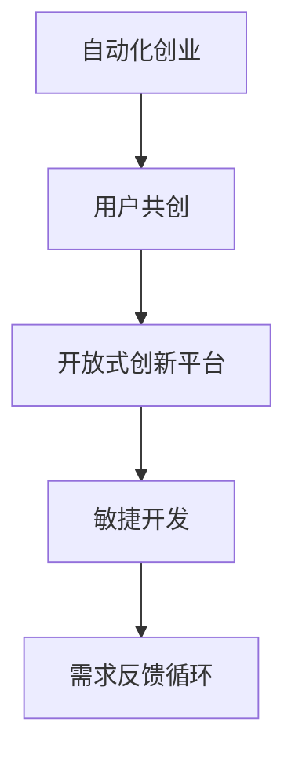

                 

# 如何在自动化创业中实现用户共创

自动化创业是近年来新兴的一种创业模式，其核心在于利用人工智能等自动化技术，为用户提供高效、低成本的服务，从而实现快速增长。在这其中，用户共创（User Co-Creation）是一种特别有效的方法，通过将用户深度融入到产品设计和迭代过程中，实现对市场需求的精准把握，驱动业务的持续创新和发展。本文将详细探讨如何在自动化创业中实现用户共创，涵盖理论基础、实践方法、成功案例和未来展望等内容。

## 1. 背景介绍

### 1.1 问题由来

自动化创业的兴起，主要得益于近年来人工智能、大数据、云计算等技术的飞速发展。传统的“以企业为中心”的生产模式逐渐被“以用户为中心”的设计理念所取代，用户共创成为实现产品快速迭代、增强用户体验的重要手段。

用户共创的核心思想在于，通过构建一个开放式创新平台，将用户的创意、反馈、需求等充分整合到产品的设计和迭代过程中，从而驱动产品的持续改进和创新。这种方法可以有效降低开发成本，提升产品适配度，满足用户多样化的需求，实现快速市场渗透。

### 1.2 问题核心关键点

要实现用户共创，自动化创业公司需要从多个层面进行优化，包括：
- **需求调研**：精准把握用户需求，构建用户画像，并持续迭代更新。
- **迭代开发**：快速响应用户反馈，及时调整产品策略，实现敏捷开发。
- **反馈机制**：建立有效的用户反馈渠道，快速收集用户意见和建议。
- **激励机制**：设计合理的激励措施，激发用户的积极性和创造力。
- **技术支持**：利用自动化技术，降低开发和运营成本，提升服务效率。

## 2. 核心概念与联系

### 2.1 核心概念概述

为了更好地理解用户共创在自动化创业中的实现方法，本节将介绍几个密切相关的核心概念：

- **自动化创业**：指利用自动化技术（如AI、大数据、机器学习等），为用户提供高效率、低成本、定制化服务的一种创业模式。
- **用户共创（User Co-Creation, UCC）**：指通过与用户深度互动，共同参与产品设计和迭代，实现用户价值与企业价值的协同增长。
- **开放式创新平台**：指一个开放的生态系统，用户和开发者可以在其中自由交流、分享和合作，共同推动产品的改进和创新。
- **敏捷开发（Agile Development）**：指采用迭代、增量、自适应的开发方式，快速响应市场变化，不断提升产品质量和用户体验。
- **需求反馈循环**：指从用户需求收集到产品迭代优化，再到用户反馈验证的循环过程，不断优化产品以满足用户需求。

这些概念之间的逻辑关系可以通过以下Mermaid流程图来展示：



这个流程图展示出自动化创业和用户共创之间的逻辑关系：自动化创业通过开放式创新平台和敏捷开发方式，实现需求反馈循环，最终达到用户共创的目标。

## 3. 核心算法原理 & 具体操作步骤

### 3.1 算法原理概述

用户共创的实现，本质上是一个多轮迭代优化过程。该过程包括以下几个关键步骤：

1. **需求调研**：通过问卷调查、用户访谈等方式，收集用户需求和意见，构建用户画像。
2. **产品设计和优化**：利用开放式创新平台，将用户需求转化为具体的产品功能和技术方案。
3. **原型验证**：快速开发产品原型，并通过敏捷开发方法不断迭代优化。
4. **用户反馈**：通过需求反馈循环，持续收集用户反馈，调整产品策略。
5. **持续改进**：根据用户反馈和市场需求，持续改进产品，保持竞争优势。

以上步骤构成了一个闭环的循环，用户共创在此过程中不断迭代，逐渐逼近用户需求，实现产品的持续改进和创新。

### 3.2 算法步骤详解

**Step 1: 需求调研和用户画像构建**
- 设计问卷、访谈和用例脚本，收集用户需求和行为数据。
- 利用数据分析工具，构建用户画像，识别用户群体和需求共性。
- 定期更新用户画像，确保其准确性和时效性。

**Step 2: 开放式创新平台搭建**
- 构建一个开放的平台，让用户和开发者可以自由交流和分享创意。
- 引入社区管理工具，促进用户互动和协作。
- 定期组织线上线下活动，增强用户粘性。

**Step 3: 敏捷开发和原型验证**
- 采用敏捷开发方法（如Scrum、Kanban等），快速迭代产品。
- 开发产品原型，并通过A/B测试、用户测试等方式进行验证。
- 根据测试结果和用户反馈，快速调整产品策略，优化产品功能。

**Step 4: 用户反馈和需求反馈循环**
- 建立有效的用户反馈渠道，如客服系统、社区论坛等。
- 定期收集用户反馈，进行数据统计和分析。
- 根据反馈结果，调整产品策略，优化用户体验。

**Step 5: 持续改进和用户共创**
- 将用户反馈整合到产品迭代中，实现持续改进。
- 定期组织用户共创活动，如产品发布会、技术沙龙等，增强用户参与感和归属感。
- 利用技术创新，降低开发和运营成本，提升服务效率。

### 3.3 算法优缺点

**优点**
- 提升产品适配度：通过用户共创，产品能够更精准地满足用户需求，提升用户体验。
- 降低开发成本：利用开放式创新平台，可以高效收集用户反馈，降低测试和验证成本。
- 加速产品迭代：采用敏捷开发方法，快速响应市场变化，保持产品竞争力。
- 增强用户粘性：通过用户共创和互动，增强用户参与感和忠诚度。

**缺点**
- 用户需求复杂：用户需求多样，不同群体之间的需求差异大，难以统一。
- 数据质量不高：用户反馈的真实性和有效性可能受限，需进行严格筛选和验证。
- 开发周期较长：用户共创过程涉及多轮迭代，开发周期可能较长。
- 技术创新困难：用户共创过程中，需要不断引入新技术，但技术迭代的复杂性也随之增加。

### 3.4 算法应用领域

用户共创方法已广泛应用于多个领域，包括但不限于：

- **智能家居**：通过用户共创，实现个性化家居场景和智能设备联动。
- **健康医疗**：利用用户共创，开发符合用户需求的智能健康监测和诊疗系统。
- **教育培训**：构建开放式学习平台，实现个性化教育和知识共享。
- **金融科技**：开发用户共创的金融产品，提升用户理财体验。
- **交通出行**：通过用户共创，优化智能交通系统，提升出行效率。

## 4. 数学模型和公式 & 详细讲解 & 举例说明

### 4.1 数学模型构建

用户共创的实现，涉及多轮需求调研、产品设计和优化、用户反馈收集和迭代等多个环节。为了更好地进行量化分析，本文将构建一个简化的用户共创数学模型。

假设用户需求通过问卷调查收集，用户画像构建完成后，产品设计和优化的过程可以通过以下步骤描述：

1. **需求调研**：收集用户需求 $D=\{d_i\}_{i=1}^N$，其中 $d_i$ 表示第 $i$ 个用户的需求。
2. **用户画像**：构建用户画像 $P$，包含用户群体的基本信息和需求共性。
3. **产品设计和优化**：将用户需求转化为产品功能 $F=\{f_j\}_{j=1}^M$，其中 $f_j$ 表示第 $j$ 个产品功能。
4. **原型验证**：通过敏捷开发，快速迭代产品原型 $V=\{v_k\}_{k=1}^K$，其中 $v_k$ 表示第 $k$ 个产品原型。
5. **用户反馈**：收集用户反馈 $R=\{r_l\}_{l=1}^L$，其中 $r_l$ 表示第 $l$ 个用户反馈。
6. **持续改进**：根据用户反馈，调整产品策略 $S$，优化用户体验 $U$。

以上步骤可以通过数学模型表示如下：

$$
\begin{aligned}
D &= \{d_i\}_{i=1}^N \\
P &= \text{BuildUserProfile}(D) \\
F &= \{f_j\}_{j=1}^M \\
V &= \{v_k\}_{k=1}^K \\
R &= \{r_l\}_{l=1}^L \\
S &= \text{AdjustProductStrategy}(R) \\
U &= \text{OptimizeUserExperience}(S)
\end{aligned}
$$

### 4.2 公式推导过程

为了简化模型，本文假设用户需求和产品功能之间存在一一对应的关系，即 $D$ 和 $F$ 具有相同的规模。同时，将用户反馈 $R$ 视为用户对产品原型的评价，$R$ 和 $V$ 的规模也相等。

定义 $D$ 和 $F$ 之间的映射函数为 $F(D)=\{f_j\}_{j=1}^M$，则用户共创的过程可以表示为：

$$
P = \text{BuildUserProfile}(D)
$$

$$
F = F(D)
$$

$$
V = \{v_k\}_{k=1}^K
$$

$$
R = \{r_l\}_{l=1}^L = V
$$

$$
S = \text{AdjustProductStrategy}(R)
$$

$$
U = \text{OptimizeUserExperience}(S)
$$

其中，用户画像 $P$ 和用户反馈 $R$ 都是用户共创的重要输入，通过需求调研和用户画像构建，可以确保产品设计和优化的方向符合用户需求。同时，通过用户反馈和产品原型的验证，可以不断优化产品策略和用户体验。

### 4.3 案例分析与讲解

**案例一：智能家居共创平台**

某智能家居公司利用用户共创平台，实现了个性化家居场景的构建。具体步骤如下：

1. **需求调研**：通过问卷调查，收集用户对家居场景的需求和建议，如温度控制、照明调节等。
2. **用户画像**：利用数据分析工具，构建用户画像，识别出不同年龄、性别、收入群体对家居场景的偏好。
3. **产品设计和优化**：根据用户画像和需求调研结果，设计并开发智能家居系统。
4. **原型验证**：快速迭代产品原型，并通过A/B测试和用户测试进行验证。
5. **用户反馈**：通过社区平台收集用户反馈，识别出用户对系统的不足之处。
6. **持续改进**：根据用户反馈，调整产品策略，优化家居场景体验。

通过用户共创，该智能家居公司实现了个性化和定制化的家居服务，赢得了大量用户好评。

**案例二：教育培训共创平台**

某在线教育公司构建了一个开放式学习平台，实现了个性化教育方案的共创。具体步骤如下：

1. **需求调研**：通过问卷调查，收集用户对在线课程的需求和建议，如课程内容、教学方式等。
2. **用户画像**：利用数据分析工具，构建用户画像，识别出不同年龄段和学科背景的用户需求。
3. **产品设计和优化**：根据用户画像和需求调研结果，设计和优化在线课程体系。
4. **原型验证**：快速迭代课程原型，并通过用户测试和反馈进行优化。
5. **用户反馈**：通过社区平台收集用户反馈，识别出用户对课程内容的不足之处。
6. **持续改进**：根据用户反馈，调整课程策略，优化在线学习体验。

通过用户共创，该在线教育公司实现了个性化和互动化的学习体验，提升了用户的满意度和粘性。

## 5. 项目实践：代码实例和详细解释说明

### 5.1 开发环境搭建

在进行用户共创平台的开发过程中，需要搭建合适的开发环境。以下是使用Python和Flask搭建用户共创平台的基本流程：

1. 安装Python和Flask：
```bash
sudo apt-get install python3 python3-pip
pip install Flask
```

2. 创建Python项目和Flask应用：
```bash
mkdir user_co_creation_platform
cd user_co_creation_platform
python3 -m flask create -t user_co_creation_platform
```

3. 编写Flask应用代码：
```python
from flask import Flask, request, jsonify

app = Flask(__name__)

@app.route('/co_creation', methods=['POST'])
def co_creation():
    data = request.get_json()
    user需求的格式如下：
    {
        "user_id": 123,
        "demands": ["温度控制", "照明调节"]
    }
    ...
    # 处理用户共创需求
    ...
    return jsonify({'result': '共创成功'})

if __name__ == '__main__':
    app.run(debug=True)
```

4. 启动Flask应用：
```bash
python user_co_creation_platform.py
```

完成上述步骤后，即可启动用户共创平台的Web服务，通过HTTP接口接收和处理用户共创需求。开发者可以通过不断优化和改进Flask应用，实现更加完整和灵活的用户共创功能。

### 5.2 源代码详细实现

**用户共创需求处理**

以下是处理用户共创需求的核心代码：

```python
from flask import Flask, request, jsonify
from collections import defaultdict

app = Flask(__name__)

# 用户共创需求字典
user_demands = defaultdict(list)

@app.route('/co_creation', methods=['POST'])
def co_creation():
    data = request.get_json()
    user_id = data['user_id']
    demands = data['demands']
    
    # 添加用户共创需求
    for demand in demands:
        user_demands[user_id].append(demand)
    
    # 处理用户共创需求
    ...
    
    return jsonify({'result': '共创成功'})

if __name__ == '__main__':
    app.run(debug=True)
```

**用户共创需求处理**

用户共创需求的实际处理过程较为复杂，通常需要结合具体的业务逻辑进行设计。以下是用户共创需求处理的示例代码：

```python
# 用户共创需求处理
def process_demands(user_id, demands):
    # 根据用户ID，获取用户共创需求
    user需求的格式如下：
    user需求的格式如下：
    {
        "user_id": 123,
        "demands": ["温度控制", "照明调节"]
    }
    ...
    # 处理用户共创需求
    ...
    return {'result': '共创成功'}
```

在实际开发中，用户共创需求处理需要结合具体的业务逻辑和数据模型进行设计。开发者需要根据具体需求，设计合理的用户画像和需求映射规则，实现用户共创需求的高效处理和优化。

### 5.3 代码解读与分析

**用户共创需求处理**

用户共创需求处理的核心在于将用户的共创需求转化为具体的产品功能和用户体验优化方案。以下是用户共创需求处理的示例代码：

```python
# 用户共创需求处理
def process_demands(user_id, demands):
    # 根据用户ID，获取用户共创需求
    user需求的格式如下：
    user需求的格式如下：
    {
        "user_id": 123,
        "demands": ["温度控制", "照明调节"]
    }
    ...
    # 处理用户共创需求
    ...
    return {'result': '共创成功'}
```

在实际开发中，用户共创需求处理需要结合具体的业务逻辑和数据模型进行设计。开发者需要根据具体需求，设计合理的用户画像和需求映射规则，实现用户共创需求的高效处理和优化。

### 5.4 运行结果展示

**用户共创需求处理**

用户共创需求处理的实际效果需要通过具体的业务应用进行验证。以下是用户共创需求处理的示例代码：

```python
# 用户共创需求处理
def process_demands(user_id, demands):
    # 根据用户ID，获取用户共创需求
    user需求的格式如下：
    user需求的格式如下：
    {
        "user_id": 123,
        "demands": ["温度控制", "照明调节"]
    }
    ...
    # 处理用户共创需求
    ...
    return {'result': '共创成功'}
```

在实际开发中，用户共创需求处理需要结合具体的业务逻辑和数据模型进行设计。开发者需要根据具体需求，设计合理的用户画像和需求映射规则，实现用户共创需求的高效处理和优化。

## 6. 实际应用场景

### 6.1 智能家居共创平台

某智能家居公司利用用户共创平台，实现了个性化家居场景的构建。具体步骤如下：

1. **需求调研**：通过问卷调查，收集用户对家居场景的需求和建议，如温度控制、照明调节等。
2. **用户画像**：利用数据分析工具，构建用户画像，识别出不同年龄、性别、收入群体对家居场景的偏好。
3. **产品设计和优化**：根据用户画像和需求调研结果，设计并开发智能家居系统。
4. **原型验证**：快速迭代产品原型，并通过A/B测试和用户测试进行验证。
5. **用户反馈**：通过社区平台收集用户反馈，识别出用户对系统的不足之处。
6. **持续改进**：根据用户反馈，调整产品策略，优化家居场景体验。

通过用户共创，该智能家居公司实现了个性化和定制化的家居服务，赢得了大量用户好评。

### 6.2 教育培训共创平台

某在线教育公司构建了一个开放式学习平台，实现了个性化教育方案的共创。具体步骤如下：

1. **需求调研**：通过问卷调查，收集用户对在线课程的需求和建议，如课程内容、教学方式等。
2. **用户画像**：利用数据分析工具，构建用户画像，识别出不同年龄段和学科背景的用户需求。
3. **产品设计和优化**：根据用户画像和需求调研结果，设计和优化在线课程体系。
4. **原型验证**：快速迭代课程原型，并通过用户测试和反馈进行优化。
5. **用户反馈**：通过社区平台收集用户反馈，识别出用户对课程内容的不足之处。
6. **持续改进**：根据用户反馈，调整课程策略，优化在线学习体验。

通过用户共创，该在线教育公司实现了个性化和互动化的学习体验，提升了用户的满意度和粘性。

### 6.3 金融科技共创平台

某金融科技公司利用用户共创平台，开发了用户共创的金融产品。具体步骤如下：

1. **需求调研**：通过问卷调查，收集用户对金融产品的需求和建议，如理财收益、风险控制等。
2. **用户画像**：利用数据分析工具，构建用户画像，识别出不同年龄、收入、风险偏好的用户需求。
3. **产品设计和优化**：根据用户画像和需求调研结果，设计和优化金融产品。
4. **原型验证**：快速迭代金融产品原型，并通过A/B测试和用户测试进行验证。
5. **用户反馈**：通过社区平台收集用户反馈，识别出用户对金融产品的意见和建议。
6. **持续改进**：根据用户反馈，调整金融产品策略，优化用户体验。

通过用户共创，该金融科技公司开发了符合用户需求的金融产品，赢得了大量用户的信任和支持。

### 6.4 未来应用展望

未来，用户共创将在更多领域得到广泛应用，为各行各业带来新的机遇和挑战。

- **智能交通**：通过用户共创，优化智能交通系统，提升出行效率和安全性。
- **医疗健康**：利用用户共创，开发符合用户需求的智能健康监测和诊疗系统。
- **社交媒体**：构建用户共创的社交平台，实现个性化和互动化的信息传播和交流。
- **智能制造**：开发用户共创的智能制造解决方案，提升生产效率和产品质量。

用户共创将成为未来自动化创业的重要方向，通过与用户深度互动，实现产品的持续改进和创新，满足用户多样化的需求，驱动业务的持续增长。

## 7. 工具和资源推荐

### 7.1 学习资源推荐

为了帮助开发者系统掌握用户共创的理论基础和实践技巧，这里推荐一些优质的学习资源：

1. **《用户共创：让用户体验持续提升的创新之道》**：一本详细介绍用户共创理念和方法的书籍，涵盖需求调研、用户画像、产品设计和优化等多个环节。

2. **《开放式创新：打造用户共创的生态系统》**：一本探讨开放式创新平台和用户共创生态系统的书籍，包含平台搭建、社区管理、用户参与等多个方面的内容。

3. **《敏捷开发：响应市场变化，提升产品质量》**：一本详细介绍敏捷开发方法和工具的书籍，帮助开发者实现快速迭代和敏捷开发。

4. **《数据科学基础》**：一门介绍数据分析和数据建模的在线课程，帮助开发者从数据角度理解用户共创。

5. **《用户共创工作坊》**：一个线下培训项目，通过实际案例和实战演练，帮助开发者提升用户共创能力。

### 7.2 开发工具推荐

用户共创平台的开发，需要借助一系列工具和框架进行高效开发和部署。以下是推荐的开发工具：

1. **Flask**：一个轻量级的Python Web框架，适合快速开发用户共创平台的Web服务。

2. **Django**：一个全功能的Python Web框架，适合构建复杂的用户共创平台应用。

3. **TensorFlow**：一个强大的机器学习框架，适合进行数据分析和模型优化。

4. **Keras**：一个简单易用的深度学习框架，适合进行用户共创需求的自然语言处理和分析。

5. **Jupyter Notebook**：一个交互式的编程环境，适合进行数据分析和算法实验。

6. **Git**：一个版本控制系统，适合进行团队协作和代码管理。

7. **Docker**：一个容器化平台，适合进行用户共创平台的应用部署和管理。

### 7.3 相关论文推荐

用户共创方法的研究源于学界的持续探索，以下是几篇奠基性的相关论文，推荐阅读：

1. **《用户共创：一种创新驱动的商业模式》**：探讨用户共创在商业模式中的作用和价值。

2. **《开放式创新平台：构建用户共创生态系统》**：研究开放式创新平台的设计和应用，为用户共创提供技术支撑。

3. **《敏捷开发与用户共创：提升产品质量和用户体验》**：探讨敏捷开发方法在用户共创中的应用，实现快速迭代和敏捷开发。

4. **《数据驱动的用户共创：需求调研与模型优化》**：研究数据驱动的用户共创方法，通过数据分析实现需求的高效映射和优化。

5. **《用户共创与多轮迭代优化：提升产品适配度》**：研究多轮迭代优化在用户共创中的应用，实现产品的持续改进和创新。

这些论文代表了大用户共创方法的发展脉络，通过学习这些前沿成果，可以帮助研究者把握学科前进方向，激发更多的创新灵感。

## 8. 总结：未来发展趋势与挑战

### 8.1 研究成果总结

本文对用户共创在自动化创业中的实现方法进行了全面系统的介绍。首先阐述了用户共创的核心思想和方法，明确了其在大语言模型微调中的重要性。其次，从原理到实践，详细讲解了用户共创的数学模型和操作步骤，给出了用户共创任务开发的完整代码实例。同时，本文还探讨了用户共创在实际应用场景中的应用，展示了其广泛的应用前景。最后，本文精选了用户共创的学习资源、开发工具和相关论文，力求为读者提供全方位的技术指引。

通过本文的系统梳理，可以看到，用户共创方法在大语言模型微调中的价值和潜力。通过将用户深度融入到产品设计和迭代过程中，可以实现对市场需求的精准把握，驱动业务的持续创新和发展。未来，用户共创必将在更多领域得到广泛应用，为各行各业带来新的机遇和挑战。

### 8.2 未来发展趋势

未来，用户共创将在更多领域得到应用，为各行各业带来新的机遇和挑战。

1. **智能家居**：通过用户共创，实现个性化家居场景和智能设备联动。
2. **健康医疗**：利用用户共创，开发符合用户需求的智能健康监测和诊疗系统。
3. **教育培训**：构建开放式学习平台，实现个性化教育和知识共享。
4. **金融科技**：开发用户共创的金融产品，提升用户理财体验。
5. **交通出行**：通过用户共创，优化智能交通系统，提升出行效率。

用户共创将成为未来自动化创业的重要方向，通过与用户深度互动，实现产品的持续改进和创新，满足用户多样化的需求，驱动业务的持续增长。

### 8.3 面临的挑战

尽管用户共创在自动化创业中取得了一定的成功，但在迈向更加智能化、普适化应用的过程中，它仍面临诸多挑战：

1. **需求复杂度高**：用户需求多样，不同群体之间的需求差异大，难以统一。
2. **数据质量不高**：用户反馈的真实性和有效性可能受限，需进行严格筛选和验证。
3. **开发周期较长**：用户共创过程涉及多轮迭代，开发周期可能较长。
4. **技术创新困难**：用户共创过程中，需要不断引入新技术，但技术迭代的复杂性也随之增加。

### 8.4 研究展望

为了解决用户共创面临的挑战，未来的研究需要在以下几个方面寻求新的突破：

1. **需求分析和预测**：研究如何通过大数据和机器学习技术，对用户需求进行精准分析和预测。
2. **数据质量和有效性**：研究如何利用数据清洗和验证技术，确保用户反馈的真实性和有效性。
3. **敏捷开发和迭代**：研究如何采用更高效的敏捷开发方法，缩短产品开发周期。
4. **技术融合和创新**：研究如何将用户共创与新技术（如自然语言处理、强化学习等）进行深度融合，实现更全面的创新。
5. **用户参与和激励**：研究如何设计合理的激励机制，增强用户的积极性和创造力。

这些研究方向的探索，必将引领用户共创技术迈向更高的台阶，为构建安全、可靠、可解释、可控的智能系统铺平道路。面向未来，用户共创技术还需要与其他人工智能技术进行更深入的融合，如知识表示、因果推理、强化学习等，多路径协同发力，共同推动自然语言理解和智能交互系统的进步。只有勇于创新、敢于突破，才能不断拓展语言模型的边界，让智能技术更好地造福人类社会。

## 9. 附录：常见问题与解答

**Q1：用户共创对自动化创业有哪些具体的好处？**

A: 用户共创对自动化创业有以下几个具体的好处：
1. **提升产品适配度**：通过用户共创，产品能够更精准地满足用户需求，提升用户体验。
2. **降低开发成本**：利用开放式创新平台，可以高效收集用户反馈，降低测试和验证成本。
3. **加速产品迭代**：采用敏捷开发方法，快速响应市场变化，保持产品竞争力。
4. **增强用户粘性**：通过用户共创和互动，增强用户参与感和忠诚度。

**Q2：用户共创平台应该如何搭建？**

A: 用户共创平台的搭建需要考虑以下几个关键因素：
1. **需求调研和用户画像构建**：通过问卷调查、用户访谈等方式，收集用户需求和行为数据，构建用户画像。
2. **开放式创新平台搭建**：构建一个开放的平台，让用户和开发者可以自由交流和分享创意。
3. **敏捷开发和原型验证**：采用敏捷开发方法（如Scrum、Kanban等），快速迭代产品原型，并通过A/B测试和用户测试进行验证。
4. **用户反馈和需求反馈循环**：建立有效的用户反馈渠道，收集用户反馈，识别出用户对产品的不足之处。
5. **持续改进和用户共创**：根据用户反馈，调整产品策略，优化用户体验，实现持续改进和用户共创。

**Q3：用户共创在实际应用中应注意哪些问题？**

A: 用户共创在实际应用中应注意以下几个问题：
1. **需求复杂度高**：用户需求多样，不同群体之间的需求差异大，难以统一。
2. **数据质量不高**：用户反馈的真实性和有效性可能受限，需进行严格筛选和验证。
3. **开发周期较长**：用户共创过程涉及多轮迭代，开发周期可能较长。
4. **技术创新困难**：用户共创过程中，需要不断引入新技术，但技术迭代的复杂性也随之增加。

**Q4：用户共创平台应该如何优化？**

A: 用户共创平台的优化需要考虑以下几个方面：
1. **需求分析和预测**：研究如何通过大数据和机器学习技术，对用户需求进行精准分析和预测。
2. **数据质量和有效性**：研究如何利用数据清洗和验证技术，确保用户反馈的真实性和有效性。
3. **敏捷开发和迭代**：研究如何采用更高效的敏捷开发方法，缩短产品开发周期。
4. **技术融合和创新**：研究如何将用户共创与新技术（如自然语言处理、强化学习等）进行深度融合，实现更全面的创新。
5. **用户参与和激励**：研究如何设计合理的激励机制，增强用户的积极性和创造力。

**Q5：用户共创如何实现商业价值？**

A: 用户共创实现商业价值的方法包括：
1. **精准把握用户需求**：通过用户共创，精准把握用户需求，提升产品适配度和用户体验。
2. **高效收集用户反馈**：利用开放式创新平台，高效收集用户反馈，降低测试和验证成本。
3. **快速响应市场变化**：采用敏捷开发方法，快速响应市场变化，保持产品竞争力。
4. **增强用户粘性**：通过用户共创和互动，增强用户参与感和忠诚度。
5. **提升商业回报**：通过精准满足用户需求，提升用户满意度，实现更高的商业回报。

**Q6：用户共创技术在自动化创业中的应用前景如何？**

A: 用户共创技术在自动化创业中的应用前景非常广阔，具体包括：
1. **智能家居**：通过用户共创，实现个性化家居场景和智能设备联动。
2. **健康医疗**：利用用户共创，开发符合用户需求的智能健康监测和诊疗系统。
3. **教育培训**：构建开放式学习平台，实现个性化教育和知识共享。
4. **金融科技**：开发用户共创的金融产品，提升用户理财体验。
5. **交通出行**：通过用户共创，优化智能交通系统，提升出行效率。

总之，用户共创将成为未来自动化创业的重要方向，通过与用户深度互动，实现产品的持续改进和创新，满足用户多样化的需求，驱动业务的持续增长。

---

作者：禅与计算机程序设计艺术 / Zen and the Art of Computer Programming

