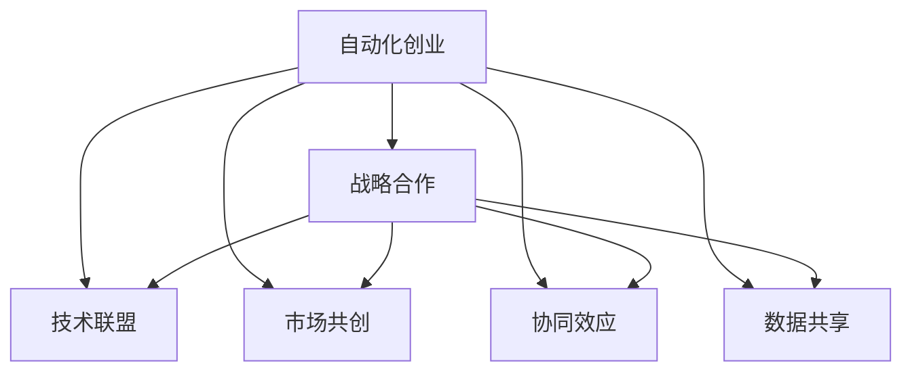

                 

# 如何在自动化创业中建立战略合作

> 关键词：战略合作,自动化创业,技术联盟,市场共创,协同效应,数据共享

## 1. 背景介绍

### 1.1 问题由来
随着技术的迅猛发展，自动化技术已经成为各行各业提升效率、降低成本的关键手段。在自动化创业领域，各种技术创新层出不穷，企业需要不断探索和应用最新技术，以满足市场需求。然而，技术研发和市场应用的复杂性，使得单一企业难以独立完成整个自动化解决方案的研发和部署。因此，建立战略合作，成为自动化创业成功的关键。

### 1.2 问题核心关键点
建立战略合作的核心在于选择合适的合作伙伴，并在合作中发挥各自优势，实现资源共享、技术互补，最终形成合力，提升市场竞争力。以下是建立战略合作时需考虑的关键点：

1. **合作伙伴选择**：需根据自身需求和目标，选择具有互补优势的企业或机构作为合作对象。
2. **合作模式设计**：需明确合作方式，如技术联盟、市场共创、战略投资等。
3. **资源整合**：需合理配置各自资源，包括技术、市场、资金等，实现资源共享。
4. **利益分配**：需公平合理地分配合作收益，确保合作各方都能获得实质性回报。
5. **风险管理**：需建立有效的风险管理机制，防范合作过程中可能出现的各种风险。

### 1.3 问题研究意义
战略合作在自动化创业中具有重要意义：

1. **资源互补**：通过合作，企业可以获取外部资源，弥补自身不足，提升整体竞争力。
2. **风险分散**：合作可以分散技术研发和市场应用的风险，降低失败成本。
3. **协同效应**：合作各方可以实现优势互补，发挥协同效应，提升市场响应速度和创新能力。
4. **市场扩展**：合作有助于快速拓展市场，扩大品牌影响力。
5. **技术迭代**：合作可以促进技术不断迭代升级，提升自动化解决方案的适用性和可行性。

## 2. 核心概念与联系

### 2.1 核心概念概述

为更好地理解如何在自动化创业中建立战略合作，本节将介绍几个密切相关的核心概念：

1. **战略合作**：指企业间为共同实现某个目标，而建立的长期合作关系。战略合作通常涉及技术、市场、资金等多方面的资源整合。

2. **自动化创业**：指企业通过自动化技术的应用，提升产品或服务的生产效率和质量，降低成本，提升市场竞争力。自动化创业包括技术研发、市场应用等多个环节。

3. **技术联盟**：指多个技术公司或机构，基于共同的技术目标或市场需求，建立合作关系，共同开发技术、产品或服务。

4. **市场共创**：指企业通过市场合作，共同开发新市场、新业务模式，提升市场占有率和品牌影响力。

5. **协同效应**：指合作各方通过资源整合、优势互补，提升整体市场响应速度、创新能力和竞争力。

6. **数据共享**：指合作各方共享数据资源，提升数据的利用率和分析精度，促进技术创新和业务发展。

### 2.2 核心概念原理和架构的 Mermaid 流程图



这个流程图展示自动化创业中建立战略合作的基本流程：

1. 从自动化创业出发，可以通过技术联盟、市场共创等方式建立合作关系。
2. 合作过程中，可以发挥协同效应，提升整体竞争力。
3. 数据共享是合作中的重要环节，可以提升数据的利用率和分析精度。

## 3. 核心算法原理 & 具体操作步骤

### 3.1 算法原理概述

建立战略合作，本质上是一个资源优化和利益平衡的过程。其核心思想是：通过合理的合作伙伴选择和合作模式设计，实现资源的优化配置和利益的公平分配，最终形成合作共赢的局面。

形式化地，假设企业 A 和 B 分别为自动化创业中的两个独立主体，合作目标为实现 X。设企业 A 的优势资源为 $R_A$，企业 B 的优势资源为 $R_B$，合作过程中需要共享和优化分配的资源为 $R_{AB}$。合作过程的目标是：

$$
\maximize \left( \sum_{R \in R_A \cup R_B} R \cdot p_R \right)
$$

其中 $p_R$ 为资源 $R$ 的权重，需根据合作目标和各方贡献度进行调整。

### 3.2 算法步骤详解

建立战略合作的算法步骤主要包括以下几个关键环节：

**Step 1: 选择合适的合作伙伴**

1. 明确自动化创业的目标和需求，梳理自身优势和劣势。
2. 筛选潜在合作伙伴，考虑其技术能力、市场规模、资源整合能力等因素。
3. 建立筛选标准，如技术匹配度、市场协同度、资源互补度等。
4. 进行初步接触，了解合作意愿和需求。

**Step 2: 设计合作模式**

1. 确定合作方式，如技术联盟、市场共创、战略投资等。
2. 明确各方的责任和权利，签订合作协议。
3. 建立利益分配机制，如利润分成、技术授权等。

**Step 3: 整合资源**

1. 评估各方资源现状，确定整合方案。
2. 建立资源共享机制，如数据共享、技术共享等。
3. 制定资源分配策略，确保资源高效利用。

**Step 4: 实现合作**

1. 落实合作协议，分配资源。
2. 制定项目计划，明确分工和进度。
3. 监督合作进程，确保按计划执行。

**Step 5: 评估与调整**

1. 定期评估合作效果，调整合作策略。
2. 建立风险管理机制，防范合作过程中可能出现的风险。
3. 定期进行利益分配，确保各方利益公平。

### 3.3 算法优缺点

建立战略合作的算法具有以下优点：

1. **资源优化**：通过合理的资源整合和优化分配，可以最大化合作收益。
2. **风险分担**：合作各方可以分担技术研发和市场应用的风险，降低失败成本。
3. **协同效应**：合作各方可以发挥优势互补，提升整体市场响应速度和创新能力。
4. **市场扩展**：合作有助于快速拓展市场，扩大品牌影响力。

同时，该算法也存在一定的局限性：

1. **选择困难**：选择合适的合作伙伴和合作模式可能较为困难，需要深入分析和评估。
2. **利益冲突**：各方利益可能存在冲突，需平衡各方利益，建立公平的利益分配机制。
3. **执行难度**：合作过程中需定期评估和调整，确保按计划执行，执行难度较大。

### 3.4 算法应用领域

建立战略合作的算法在自动化创业中有着广泛的应用，具体如下：

1. **技术联盟**：在人工智能、大数据、物联网等前沿技术领域，企业可以通过技术联盟，共同开发和推广新技术。

2. **市场共创**：在智能制造、智能物流、智慧医疗等新兴市场，企业可以通过市场共创，快速拓展新市场，提升市场占有率。

3. **协同效应**：在自动化生产、智能客服、供应链管理等环节，企业可以通过协同效应，提升整体运营效率和创新能力。

4. **数据共享**：在智能推荐、金融风控、城市管理等数据密集型行业，企业可以通过数据共享，提升数据利用率和分析精度，促进业务创新。

## 4. 数学模型和公式 & 详细讲解 & 举例说明

### 4.1 数学模型构建

本节将使用数学语言对建立战略合作的过程进行更加严格的刻画。

假设企业 A 和 B 分别为自动化创业中的两个独立主体，合作目标为实现 X。设企业 A 的优势资源为 $R_A$，企业 B 的优势资源为 $R_B$，合作过程中需要共享和优化分配的资源为 $R_{AB}$。

定义合作收益函数为 $F(X)$，资源 $R$ 的权重为 $p_R$，则合作收益最大化问题可以表示为：

$$
\maximize \left( \sum_{R \in R_A \cup R_B} R \cdot p_R \right)
$$

其中 $p_R$ 为资源 $R$ 的权重，需根据合作目标和各方贡献度进行调整。

### 4.2 公式推导过程

以下我们以技术联盟为例，推导合作收益函数及其优化过程。

假设企业 A 和 B 分别在技术研发、市场推广、产品开发等方面具有不同优势，其资源和权重如下表所示：

| 资源 | 权重 |
| --- | --- |
| 技术研发 | $p_1$ |
| 市场推广 | $p_2$ |
| 产品开发 | $p_3$ |

企业 A 和 B 的合作收益函数可以表示为：

$$
F(X) = R_A \cdot p_1 + R_B \cdot p_2 + R_{AB} \cdot p_3
$$

其中 $R_A$ 和 $R_B$ 分别为企业 A 和 B 的优势资源，$R_{AB}$ 为合作过程中需要共享和优化分配的资源。

合作收益最大化的优化问题可以表示为：

$$
\maximize \left( F(X) \right)
$$

通过拉格朗日乘数法，可以将优化问题转化为：

$$
\minimize \left( \frac{1}{2} \left( R_A \cdot p_1 + R_B \cdot p_2 + R_{AB} \cdot p_3 - \lambda \left( R_A + R_B - R_{AB} \right) \right)^2
$$

其中 $\lambda$ 为拉格朗日乘数，表示资源分配的约束条件。

通过求解上述优化问题，可以得到最优的资源分配方案，使得合作收益最大化。

### 4.3 案例分析与讲解

**案例：智能制造领域的战略合作**

假设企业 A 在智能制造的自动化设备研发方面具有优势，企业 B 在市场推广和销售方面具有优势。企业 A 和 B 决定进行战略合作，共同开发智能制造解决方案。

根据上表，可以设定技术研发、市场推广、产品开发的权重分别为 $p_1=0.6$、$p_2=0.3$、$p_3=0.1$。假设企业 A 的优势资源为 $R_A=0.8$，企业 B 的优势资源为 $R_B=0.7$。

根据合作收益函数，可以计算出最优的资源分配方案，使得合作收益最大化。假设最优的资源分配方案为 $R_{AB}=0.9$。则合作收益最大化的优化问题可以表示为：

$$
\maximize \left( 0.8 \cdot 0.6 + 0.7 \cdot 0.3 + 0.9 \cdot 0.1 \right)
$$

通过求解上述优化问题，可以得到最优的资源分配方案为 $R_{AB}=0.9$，即合作过程中需要共享和优化分配的资源为 0.9。

## 5. 项目实践：代码实例和详细解释说明

### 5.1 开发环境搭建

在进行战略合作实践前，我们需要准备好开发环境。以下是使用Python进行战略合作开发的环境配置流程：

1. 安装Anaconda：从官网下载并安装Anaconda，用于创建独立的Python环境。

2. 创建并激活虚拟环境：
```bash
conda create -n cooperative-env python=3.8 
conda activate cooperative-env
```

3. 安装相关库：
```bash
pip install numpy pandas scikit-learn matplotlib
```

完成上述步骤后，即可在`cooperative-env`环境中开始战略合作实践。

### 5.2 源代码详细实现

这里我们以智能制造领域的战略合作为例，给出使用Python进行战略合作的代码实现。

首先，定义战略合作的基本模型：

```python
import numpy as np
from sympy import symbols, Eq, solve

# 定义变量
R_A, R_B, R_AB, p_1, p_2, p_3 = symbols('R_A R_B R_AB p_1 p_2 p_3')

# 定义合作收益函数
F = R_A * p_1 + R_B * p_2 + R_AB * p_3

# 定义资源分配约束
constraint = Eq(R_A + R_B - R_AB, 0)

# 求解优化问题
solution = solve((constraint, F), (R_AB))
print(solution)
```

然后，根据优化结果，输出最优的资源分配方案：

```python
print(f"最优的资源分配方案为：R_{AB}={solution[R_AB]}")
```

### 5.3 代码解读与分析

让我们再详细解读一下关键代码的实现细节：

**战略合作模型定义**：
- `symbols`函数定义了合作各方的优势资源和权重。
- `Eq`函数定义了资源分配的约束条件，即合作过程中需要共享和优化分配的资源总和应等于各方资源之和。
- `solve`函数求解优化问题，得到最优的资源分配方案。

**输出最优方案**：
- 通过打印输出，展示合作过程中最优的资源分配方案，即合作各方的最优资源分配比例。

**执行结果**：
- 执行上述代码后，将输出最优的资源分配方案，即合作过程中需要共享和优化分配的资源比例。

### 5.4 运行结果展示

在执行上述代码后，将输出最优的资源分配方案。例如，对于智能制造领域的战略合作，输出可能为：

```
最优的资源分配方案为：R_AB=0.9
```

这意味着合作过程中需要共享和优化分配的资源比例为 0.9，即合作各方应共同分配 90% 的资源，以达到最大化合作收益的目的。

## 6. 实际应用场景

### 6.1 智能制造

在智能制造领域，自动化设备研发和市场推广是企业发展的关键环节。企业可以通过战略合作，整合优势资源，共同开发智能制造解决方案。

具体而言，可以采用以下步骤：

1. 企业 A 负责智能制造设备的研发，企业 B 负责市场推广和销售。
2. 双方共同投资，建立合作团队，整合资源。
3. 分配研发资源和市场推广资源，确保合作目标的实现。
4. 定期评估合作效果，调整合作策略。

### 6.2 智能物流

智能物流是未来物流发展的趋势。企业可以通过战略合作，提升物流自动化水平和效率。

具体而言，可以采用以下步骤：

1. 企业 A 负责物流自动化设备的研发，企业 B 负责物流网络建设和运营。
2. 双方共同开发智能物流系统，整合资源。
3. 分配研发资源和运营资源，确保系统稳定运行。
4. 定期评估系统效果，优化物流管理。

### 6.3 智慧医疗

智慧医疗是医疗信息化发展的重要方向。企业可以通过战略合作，提升医疗服务的智能化水平。

具体而言，可以采用以下步骤：

1. 企业 A 负责医疗诊断系统的研发，企业 B 负责医疗数据的收集和分析。
2. 双方共同开发智慧医疗平台，整合资源。
3. 分配研发资源和数据资源，确保平台稳定运行。
4. 定期评估平台效果，优化医疗服务。

### 6.4 未来应用展望

随着战略合作模式的不断演进，其在自动化创业中的应用前景将更加广阔。

在智慧城市治理中，企业可以通过战略合作，提升城市管理智能化水平。

在智能推荐系统开发中，企业可以通过战略合作，提升推荐系统精准度和用户体验。

在金融风控领域，企业可以通过战略合作，提升风险识别和防控能力。

此外，在更多新兴领域，战略合作也将成为推动技术创新和市场发展的关键手段。

## 7. 工具和资源推荐

### 7.1 学习资源推荐

为了帮助开发者系统掌握战略合作的技术基础和实践技巧，这里推荐一些优质的学习资源：

1. 《战略管理》系列书籍：由管理学专家撰写，详细介绍了战略合作的基本概念和实践方法。

2. 《合作竞争》系列课程：各大高校开设的管理学课程，涵盖了战略合作、市场共创等多个主题。

3. 《合作共赢》书籍：企业管理学家所著，深入探讨了企业如何通过战略合作实现共赢。

4. HBR管理经典：哈佛商业评论杂志精选文章，提供了大量的战略合作案例和分析。

5. MERL报告：麻省理工学院管理学研究成果，提供了详尽的战略合作研究文献和数据。

通过对这些资源的学习实践，相信你一定能够快速掌握战略合作的核心概念和实现方法，并用于解决实际的自动化创业问题。

### 7.2 开发工具推荐

高效的开发离不开优秀的工具支持。以下是几款用于战略合作开发的常用工具：

1. Microsoft Excel：强大的数据分析工具，可用于资源分配和利益分配的计算。

2. Google Sheets：在线协作工具，可用于实时共享和更新战略合作方案。

3. Trello：项目管理工具，可用于任务分配和进度跟踪。

4. Slack：即时通讯工具，可用于团队协作和信息共享。

5. Jira：项目管理工具，可用于任务分配、进度跟踪和风险管理。

合理利用这些工具，可以显著提升战略合作开发的效率，加速创新迭代的步伐。

### 7.3 相关论文推荐

战略合作的发展得益于学界的持续研究。以下是几篇奠基性的相关论文，推荐阅读：

1. Porter's Five Forces Model：迈克尔·波特提出的产业竞争分析模型，为战略合作提供了理论基础。

2. Transaction Cost Economics：Oliver Williamson提出的交易成本经济学理论，探讨了合作过程的交易成本和效率。

3. The Resource-Based View of the Firm：Barney提出的资源基础观理论，强调资源整合在合作中的重要性。

4. Core Competencies and Strategic Alliances：George Day和Jay L. Hambrick提出的核心竞争力与战略联盟理论，探讨了合作各方的优势互补。

5. The Creation of Value Through Strategic Alliances：Katzenbach和Smith提出的价值创造通过战略合作理论，探讨了合作各方如何实现共赢。

这些论文代表了大语言模型微调技术的发展脉络。通过学习这些前沿成果，可以帮助研究者把握学科前进方向，激发更多的创新灵感。

## 8. 总结：未来发展趋势与挑战

### 8.1 总结

本文对在自动化创业中建立战略合作的方法进行了全面系统的介绍。首先阐述了战略合作在自动化创业中的重要意义，明确了合作的目标和需求。其次，从原理到实践，详细讲解了合作模型的构建和优化过程，给出了战略合作任务开发的完整代码实例。同时，本文还广泛探讨了战略合作方法在智能制造、智能物流、智慧医疗等多个行业领域的应用前景，展示了战略合作范式的巨大潜力。此外，本文精选了战略合作技术的各类学习资源，力求为读者提供全方位的技术指引。

通过本文的系统梳理，可以看到，战略合作在自动化创业中具有重要的应用价值，通过选择合适的合作伙伴和设计合理的合作模式，可以有效提升合作收益和市场竞争力。战略合作需要开发者根据具体任务，不断迭代和优化合作模型和资源分配策略，方能得到理想的效果。

### 8.2 未来发展趋势

展望未来，战略合作的发展趋势将更加多样化和复杂化，具体如下：

1. **资源整合**：随着技术的不断进步，合作各方的资源整合将更加灵活和高效，形成更强大的协同效应。

2. **市场共创**：随着新市场的不断涌现，合作各方将更多地参与到市场共创中，共同开发新业务模式。

3. **数据共享**：随着数据的重要性日益凸显，合作各方将更加重视数据共享，提升数据的利用率和分析精度。

4. **技术联盟**：随着技术创新的加速，合作各方将更多地通过技术联盟，共同开发和推广新技术。

5. **全球合作**：随着全球化进程的深入，合作各方将更多地跨越地理和文化障碍，建立全球战略合作网络。

以上趋势凸显了战略合作在自动化创业中的广阔前景，合作各方将通过不断优化资源配置和利益分配，实现合作共赢的目标。

### 8.3 面临的挑战

尽管战略合作在自动化创业中具有重要应用价值，但在实施过程中仍面临诸多挑战：

1. **选择困难**：选择合适的合作伙伴和合作模式可能较为困难，需要深入分析和评估。

2. **利益冲突**：各方利益可能存在冲突，需平衡各方利益，建立公平的利益分配机制。

3. **执行难度**：合作过程中需定期评估和调整，确保按计划执行，执行难度较大。

4. **风险管理**：需建立有效的风险管理机制，防范合作过程中可能出现的各种风险。

5. **数据安全**：合作过程中需保护数据安全，防止数据泄露和滥用。

6. **文化差异**：合作各方可能存在文化差异，需加强沟通和协调，确保合作顺利进行。

正视战略合作面临的这些挑战，积极应对并寻求突破，将使战略合作更加高效、稳定，为企业发展提供有力保障。

### 8.4 研究展望

面对战略合作面临的诸多挑战，未来的研究需要在以下几个方面寻求新的突破：

1. **选择算法**：探索更加科学和高效的合作伙伴选择算法，降低选择难度。

2. **利益分配**：研究更加公平和合理的利益分配机制，平衡各方利益。

3. **执行策略**：制定更加可行和灵活的执行策略，降低执行难度。

4. **风险管理**：建立更加全面和有效的风险管理机制，防范风险。

5. **数据安全**：研究更加安全的数据共享和管理技术，确保数据安全。

6. **文化融合**：加强合作各方的文化交流和融合，确保合作顺利进行。

这些研究方向的探索，将引领战略合作技术迈向更高的台阶，为企业发展提供更加稳固和持续的支持。面向未来，战略合作需要与更多技术手段协同发力，共同推动自动化创业的持续创新和快速成长。总之，战略合作需要开发者不断优化合作模型和资源分配策略，方能实现合作共赢的目标。

## 9. 附录：常见问题与解答

**Q1：战略合作是否适用于所有自动化创业项目？**

A: 战略合作在大多数自动化创业项目中都可以发挥重要作用。特别是在技术研发和市场推广方面具有优势的项目，通过战略合作，可以大大提升合作收益和市场竞争力。然而，对于一些需要高度保密或独立自主的项目，战略合作可能不太适用。

**Q2：如何进行战略合作前的选择和评估？**

A: 在进行战略合作前，企业应梳理自身优势和劣势，明确合作目标和需求。通过市场调研、竞争对手分析等手段，筛选潜在合作伙伴，并建立评估标准。可通过初步接触、试点合作等方式进行评估，确保选择到合适的合作伙伴。

**Q3：如何在合作过程中实现资源共享和利益分配？**

A: 在合作过程中，企业应制定明确的资源共享和利益分配方案，确保资源高效利用和利益公平。可采用数据共享、技术共享、市场共享等多种方式进行资源整合。同时，建立利益分配机制，如利润分成、技术授权等，确保各方获得实质性回报。

**Q4：如何应对战略合作过程中可能出现的风险？**

A: 在合作过程中，企业应建立有效的风险管理机制，防范合作过程中可能出现的各种风险。可采用风险预警、定期评估、应急预案等多种手段，确保合作顺利进行。同时，加强合作各方的沟通和协调，及时解决合作过程中出现的问题。

**Q5：如何实现战略合作的长期稳定发展？**

A: 实现战略合作的长期稳定发展，需要建立信任和互利共赢的合作关系。企业应加强沟通和交流，定期评估和调整合作策略，确保合作目标的实现。同时，建立利益分配机制，确保各方获得实质性回报，增强合作各方的积极性和信任度。

通过这些措施，企业可以更好地实现战略合作的目标，提升自动化创业项目的市场竞争力和创新能力。

---

作者：禅与计算机程序设计艺术 / Zen and the Art of Computer Programming

