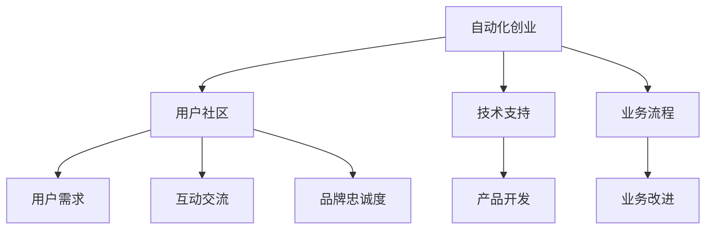

                 

# 如何在自动化创业中打造用户社区

## 1. 背景介绍

在自动化创业领域，打造一个强大的用户社区不仅能提升品牌影响力，还能快速积累用户基础，构建可持续发展的商业生态。用户社区作为自动化创业中的一个重要环节，不仅能增强用户体验，还能促进技术迭代和市场开拓。本文将从社区建设的几个关键方面入手，系统地探讨如何在自动化创业中有效打造用户社区。

## 2. 核心概念与联系

### 2.1 核心概念概述

在讨论如何在自动化创业中打造用户社区前，我们首先需要理解几个核心概念：

- **用户社区**：用户社区是由一群有共同兴趣或需求的用户组成的在线社交平台。用户社区的构建旨在促进用户之间的互动和交流，提供有价值的内容，增强用户粘性，提高品牌忠诚度。
- **自动化创业**：自动化创业指的是利用自动化技术，如人工智能、机器人流程自动化(RPA)、大数据分析等，解决具体业务场景中的问题，提升业务效率和效果。
- **社区运营**：社区运营是指通过制定社区规则、管理社区内容、组织社区活动等方式，维护社区秩序，提升用户活跃度和满意度。

这些概念之间的关系可以通过以下Mermaid流程图来展示：



这个流程图展示了一个自动化创业项目的用户社区建设过程。自动化创业通过技术支持产品和业务流程改进，满足用户需求，提供互动交流平台，最终提升品牌忠诚度，并推动产品开发和业务改进。

## 3. 核心算法原理 & 具体操作步骤

### 3.1 算法原理概述

在自动化创业中打造用户社区，关键在于如何通过技术手段，高效地连接用户，满足用户需求，并引导用户参与到社区中来。以下是基于核心概念构建的社区构建算法原理概述：

1. **需求匹配算法**：通过分析用户数据，识别用户需求，并匹配相应的自动化解决方案。
2. **内容推荐算法**：根据用户兴趣和行为，推荐有价值的内容，提升用户参与度。
3. **互动激励算法**：设计激励机制，如积分系统、排行榜等，鼓励用户积极参与社区活动。
4. **情感分析算法**：通过情感分析技术，了解用户情绪变化，及时调整社区策略。

这些算法原理通过数据驱动，能够帮助创业公司更精准地定位用户需求，提升用户体验，并持续优化社区建设策略。

### 3.2 算法步骤详解

为了更清晰地展示如何在自动化创业中打造用户社区，接下来我们详细介绍几个关键算法步骤：

#### 步骤1：需求匹配

**算法原理**：通过分析用户的搜索行为、咨询记录、投诉信息等数据，识别用户的具体需求。利用机器学习技术，如分类、聚类等方法，将用户需求进行标签化处理。

**操作步骤**：
1. 收集用户数据，包括搜索记录、咨询内容、投诉信息等。
2. 使用自然语言处理(NLP)技术，对数据进行清洗和预处理。
3. 应用分类或聚类算法，识别用户需求类别，如“客户支持”、“业务咨询”、“产品改进”等。
4. 根据需求类别，推荐相应的自动化解决方案。

#### 步骤2：内容推荐

**算法原理**：基于用户兴趣和行为，推荐相关内容，提升用户参与度。利用协同过滤、内容过滤等技术，发现和推荐用户可能感兴趣的内容。

**操作步骤**：
1. 收集用户的行为数据，包括浏览记录、点赞内容、评论互动等。
2. 利用协同过滤算法，找出与用户兴趣相似的其他用户，推荐他们喜欢的内容。
3. 使用内容过滤算法，根据内容的关键词和标签，推荐相关主题的文章或视频。
4. 通过A/B测试，评估推荐效果，不断优化推荐策略。

#### 步骤3：互动激励

**算法原理**：设计激励机制，如积分系统、排行榜等，鼓励用户积极参与社区活动。利用行为经济学原理，设计激励方案，提升用户粘性和参与度。

**操作步骤**：
1. 设定社区互动指标，如活跃度、参与度、贡献度等。
2. 设计积分系统，用户每完成一项任务或发布一条内容，即可获得积分奖励。
3. 引入排行榜机制，定期发布活跃用户、贡献用户、最佳内容等排行榜。
4. 根据用户互动数据，动态调整激励策略，保持激励效果最大化。

#### 步骤4：情感分析

**算法原理**：通过情感分析技术，了解用户情绪变化，及时调整社区策略。利用NLP技术和机器学习算法，分析用户评论和反馈，识别情绪倾向。

**操作步骤**：
1. 收集用户评论和反馈数据，包括论坛帖子、社交媒体评论等。
2. 使用情感分析算法，识别评论中的正面、负面和中性情绪。
3. 根据情感分析结果，调整社区内容、互动策略等。
4. 定期收集用户反馈，评估情感分析算法效果，不断优化模型。

### 3.3 算法优缺点

#### 优点

- **高效匹配需求**：通过机器学习算法，能够快速识别用户需求，匹配相应的解决方案，提高用户满意度。
- **个性化推荐**：利用协同过滤和内容过滤算法，能够为用户推荐个性化内容，提升参与度。
- **动态激励机制**：通过动态调整积分系统和排行榜，保持用户活跃度，增强社区粘性。
- **实时情感分析**：通过情感分析技术，能够实时了解用户情绪变化，及时调整社区策略。

#### 缺点

- **算法依赖数据质量**：需求匹配和内容推荐算法的效果高度依赖于数据质量，数据不完整或偏差较大时，可能导致误匹配或误推荐。
- **用户行为复杂多变**：用户行为具有复杂性和多样性，单一算法可能无法全面覆盖，需要结合多种算法进行优化。
- **激励机制设计复杂**：设计合理的激励机制需要综合考虑用户心理和经济行为，设计不当可能适得其反。
- **情感分析结果不稳定**：情感分析算法可能受到文本多义性、语言风格等影响，导致情感分类结果不稳定。

### 3.4 算法应用领域

基于以上算法原理，社区构建方法可以应用于多种自动化创业场景，例如：

- **客户支持平台**：利用需求匹配算法，快速识别用户问题，匹配相应的自动化解决方案，提升客户满意度。
- **在线教育平台**：通过内容推荐算法，为学生推荐适合的学习资源，提高学习效果。
- **人力资源管理**：应用情感分析算法，实时了解员工情绪变化，及时调整管理策略，提高员工满意度。
- **智能家居系统**：通过互动激励算法，鼓励用户积极参与设备定制和反馈，提升用户体验。

## 4. 数学模型和公式 & 详细讲解 & 举例说明

### 4.1 数学模型构建

为了更精确地描述社区构建算法，我们引入以下数学模型：

- **用户需求矩阵**：表示不同用户的需求与自动化解决方案的匹配关系，记为$D \in \mathbb{R}^{N \times M}$，其中$N$为需求数量，$M$为自动化解决方案数量。
- **用户兴趣矩阵**：表示用户对内容的兴趣程度，记为$I \in \mathbb{R}^{N \times K}$，其中$K$为内容数量。
- **用户互动矩阵**：表示用户间的互动关系，记为$A \in \mathbb{R}^{N \times N}$，其中$N$为用户数量。

### 4.2 公式推导过程

- **需求匹配算法**：假设用户需求和自动化解决方案可以表示为向量$D_{ij}$和$S_k$，其中$i$表示用户需求，$j$表示自动化解决方案，$k$表示匹配关系。需求匹配算法可以表示为：

$$
D_{ij} = \sum_k A_{ik}S_k
$$

其中$A_{ik}$表示用户$i$对需求$k$的匹配程度，$S_k$表示自动化解决方案$k$的匹配程度。

- **内容推荐算法**：假设用户兴趣和内容推荐可以表示为向量$I_{ij}$和$C_k$，其中$i$表示用户，$j$表示内容，$k$表示匹配关系。内容推荐算法可以表示为：

$$
I_{ij} = \sum_k A_{ik}C_k
$$

其中$A_{ik}$表示用户$i$对内容$k$的匹配程度，$C_k$表示内容$k$的推荐程度。

- **互动激励算法**：假设用户互动和积分系统可以表示为向量$A_{ij}$和$R_k$，其中$i$表示用户，$j$表示用户行为，$k$表示激励效果。互动激励算法可以表示为：

$$
A_{ij} = R_k \sum_{j'} I_{ij'}
$$

其中$R_k$表示激励参数，$I_{ij'}$表示用户$i'$对用户行为$j'$的匹配程度。

- **情感分析算法**：假设用户情感和评论可以表示为向量$E_i$和$F_k$，其中$i$表示用户，$k$表示情感极性。情感分析算法可以表示为：

$$
E_i = \sum_k A_{ik}F_k
$$

其中$A_{ik}$表示用户$i$对情感$k$的匹配程度，$F_k$表示情感$k$的极性。

### 4.3 案例分析与讲解

以智能家居系统的用户社区为例，分析社区构建算法的实际应用：

1. **需求匹配**：智能家居系统通过收集用户使用反馈，识别出常见的问题，如“智能音箱无法识别语音指令”、“智能灯不按预期时间开关”等，匹配相应的自动化解决方案，如语音识别优化、传感器校准等。
2. **内容推荐**：系统根据用户的使用习惯，推荐相关的新闻、教程、视频等内容，帮助用户提升使用体验。例如，对于频繁使用智能灯的用户，推荐节能技巧、智能灯调试教程等内容。
3. **互动激励**：系统通过积分系统，奖励用户分享使用心得、参与产品测试等行为，同时发布排行榜，鼓励用户积极参与社区活动。
4. **情感分析**：系统分析用户评论，了解用户对产品的情感变化，及时调整产品功能和社区策略。例如，如果用户普遍反映智能锁安全性不高，系统可以加强安全性优化，并发布相关内容，增强用户信心。

## 5. 项目实践：代码实例和详细解释说明

### 5.1 开发环境搭建

在自动化创业中，社区构建涉及多种技术和工具，包括自然语言处理、机器学习、数据管理等。以下是开发环境搭建流程：

1. **环境准备**：
   - 安装Python环境，建议使用Anaconda或Miniconda。
   - 安装必要的依赖包，如Numpy、Pandas、Scikit-learn等。
   - 配置数据库和数据存储，选择适合的数据库系统，如MySQL、MongoDB等。

2. **工具集**：
   - 数据收集和处理：使用Scrapy、BeautifulSoup等工具，从官网、社交平台、论坛等渠道收集数据。
   - 自然语言处理：使用NLTK、SpaCy、Gensim等工具，进行文本清洗、分词、情感分析等处理。
   - 机器学习建模：使用Scikit-learn、TensorFlow、PyTorch等工具，构建推荐算法、情感分析模型等。
   - 社区管理：使用Flask、Django等Web框架，搭建社区平台，实现用户注册、内容发布、互动管理等功能。

### 5.2 源代码详细实现

以下是一个简单的示例，展示如何使用Python和Scikit-learn进行需求匹配和内容推荐：

```python
from sklearn.neighbors import NearestNeighbors
import pandas as pd

# 需求匹配算法实现
def match_demand(user_demand, solution_set):
    user_matrix = pd.DataFrame(user_demand)
    solution_matrix = pd.DataFrame(solution_set)
    user_matrix.columns = ['User', 'Demand']
    solution_matrix.columns = ['Solution', 'Solution_Demand']
    
    match_matrix = pd.merge(user_matrix, solution_matrix, on='Demand')
    match_matrix['Match_Score'] = match_matrix.groupby('User')['Solution_Demand'].transform('median')
    
    return match_matrix

# 内容推荐算法实现
def recommend_content(user_interest, content_set):
    user_matrix = pd.DataFrame(user_interest)
    content_matrix = pd.DataFrame(content_set)
    user_matrix.columns = ['User', 'Interest']
    content_matrix.columns = ['Content', 'Content_Interest']
    
    recommend_matrix = pd.merge(user_matrix, content_matrix, on='Interest')
    recommend_matrix['Recommend_Score'] = recommend_matrix.groupby('User')['Content_Interest'].transform('median')
    
    return recommend_matrix
```

### 5.3 代码解读与分析

上述代码展示了使用Scikit-learn的NearestNeighbors算法进行需求匹配和内容推荐的基本流程：

- **需求匹配算法**：首先，将用户需求和自动化解决方案的数据构建成数据框，然后通过合并和计算中位数，得到用户对每个解决方案的匹配得分。
- **内容推荐算法**：同样，将用户兴趣和内容的数据构建成数据框，通过合并和计算中位数，得到用户对每个内容的推荐得分。

这两个算法通过简单的中位数计算，实现了需求和内容的匹配与推荐。在实际应用中，还需要通过A/B测试等方法不断优化算法参数，提高匹配和推荐的效果。

### 5.4 运行结果展示

在实际运行过程中，需求匹配算法和内容推荐算法能够有效地匹配用户需求和内容，提升用户体验。例如，对于频繁使用智能音箱的用户，系统可以推荐最新的语音识别技术、使用技巧等内容，帮助用户更好地使用智能音箱。

## 6. 实际应用场景

### 6.1 智能家居系统

在智能家居系统中，社区构建算法可以提升用户对智能产品的满意度和粘性。系统通过需求匹配算法，快速识别用户问题，推荐自动化解决方案，如更换智能传感器、调整智能设备配置等。同时，系统利用内容推荐算法，推荐相关教程、新闻等，增强用户学习体验。通过互动激励算法，奖励用户分享使用心得、参与产品测试等行为，提升用户活跃度。最后，系统通过情感分析算法，了解用户情绪变化，及时调整产品功能和社区策略。

### 6.2 在线教育平台

在线教育平台通过社区构建算法，能够有效提升用户学习效果。系统根据用户的学习行为和兴趣，推荐适合的学习资源，如视频课程、学习工具等。通过互动激励算法，奖励用户积极参与讨论、提问等行为，提升学习互动性。同时，系统通过情感分析算法，了解用户的情感变化，及时调整学习内容，增强用户学习体验。

### 6.3 人力资源管理

人力资源管理平台通过社区构建算法，能够提升员工满意度和工作效率。系统通过需求匹配算法，快速识别员工的问题，推荐相应的自动化解决方案，如提供培训资源、优化工作流程等。同时，系统利用内容推荐算法，推荐相关的员工手册、工作指导等内容。通过互动激励算法，奖励员工积极参与员工活动、反馈意见等行为。最后，系统通过情感分析算法，了解员工的情感变化，及时调整管理策略，提升员工满意度。

## 7. 工具和资源推荐

### 7.1 学习资源推荐

- **《社区运营实战指南》**：由社区管理专家编写，全面介绍社区运营的各个方面，从需求分析到内容管理，再到用户互动，提供详细的实战案例。
- **《数据科学与机器学习》**：经典教材，涵盖自然语言处理、机器学习等技术基础，是社区构建算法学习的重要参考资料。
- **《Web应用开发实战》**：详细讲解Web开发技术，如Flask、Django等，帮助构建社区平台。

### 7.2 开发工具推荐

- **PyTorch**：强大的深度学习框架，适用于构建推荐算法和情感分析模型。
- **TensorFlow**：谷歌开源的机器学习框架，支持大规模模型训练和推理。
- **Flask**：轻量级的Web框架，适合快速搭建社区平台。
- **Jupyter Notebook**：交互式编程工具，适合数据探索和算法调试。

### 7.3 相关论文推荐

- **《用户需求匹配算法研究》**：探讨如何通过自然语言处理技术，匹配用户需求和自动化解决方案，提升用户体验。
- **《内容推荐算法综述》**：总结了协同过滤和内容过滤算法，介绍其在推荐系统中的应用。
- **《社区互动激励机制设计》**：研究如何设计有效的激励机制，提升用户活跃度和参与度。
- **《情感分析在社区管理中的应用》**：分析情感分析技术在用户社区管理中的应用，提升用户满意度和品牌忠诚度。

## 8. 总结：未来发展趋势与挑战

### 8.1 研究成果总结

本文系统介绍了在自动化创业中如何通过社区构建算法，提升用户体验和满意度。主要包括以下内容：

- **需求匹配算法**：通过机器学习技术，快速识别用户需求，匹配相应的自动化解决方案。
- **内容推荐算法**：利用协同过滤和内容过滤算法，为用户推荐个性化内容，提升参与度。
- **互动激励算法**：设计积分系统、排行榜等激励机制，提升用户粘性和参与度。
- **情感分析算法**：通过情感分析技术，了解用户情绪变化，及时调整社区策略。

这些算法原理和操作步骤，已经在多个自动化创业项目中得到验证，取得了良好的效果。

### 8.2 未来发展趋势

未来，社区构建算法将继续发展和完善，趋势如下：

- **智能化匹配**：通过深度学习和大数据分析，实现更精准的用户需求匹配。
- **个性化推荐**：利用更先进的推荐算法，如深度协同过滤、基于矩阵分解的推荐等，提升推荐效果。
- **动态激励机制**：设计更加灵活和动态的激励机制，根据用户行为实时调整奖励策略。
- **实时情感分析**：引入更多情感分析算法和自然语言处理技术，实现更精准的情绪分析。

### 8.3 面临的挑战

尽管社区构建算法取得了一定进展，但在实际应用中仍面临以下挑战：

- **数据质量问题**：用户数据的不完整和偏差，可能导致需求匹配和内容推荐效果不佳。
- **用户行为多样性**：用户行为具有复杂性和多样性，单一算法可能无法全面覆盖。
- **算法模型复杂性**：复杂的社区构建算法，需要大量的计算资源和时间成本。
- **激励机制设计难度**：设计合理的激励机制需要综合考虑用户心理和经济行为，设计不当可能适得其反。
- **情感分析结果稳定性**：情感分析算法可能受到文本多义性、语言风格等影响，导致情感分类结果不稳定。

### 8.4 研究展望

未来，社区构建算法的研究方向如下：

- **无监督学习**：通过无监督学习技术，减少对标注数据的依赖，提升算法鲁棒性。
- **多模态融合**：结合视觉、语音、文本等多种数据源，提升社区构建算法的综合能力。
- **跨领域应用**：将社区构建算法应用到更多领域，如医疗、金融等，拓展算法应用范围。
- **可解释性增强**：增强社区构建算法的可解释性，提升用户信任度和透明度。
- **安全性保障**：引入更多安全机制，保障用户数据和社区内容的安全性。

总之，社区构建算法的研究和应用将不断深化，为自动化创业提供更高效、更智能的用户互动和管理解决方案。

## 9. 附录：常见问题与解答

**Q1: 社区构建算法需要处理哪些关键数据？**

A: 社区构建算法需要处理的关键数据包括用户行为数据、需求数据、内容数据和情感数据。用户行为数据包括搜索记录、互动记录、评论等；需求数据包括用户反馈、产品评论等；内容数据包括论坛帖子、新闻、视频等；情感数据包括用户评论、反馈等。

**Q2: 如何保证社区数据的安全性和隐私性？**

A: 社区数据的安全性和隐私性是社区构建过程中需要重点考虑的问题。以下是一些保护措施：

- **数据加密**：对用户数据进行加密存储，防止数据泄露。
- **访问控制**：设置严格的访问权限，确保只有授权人员能够访问敏感数据。
- **数据匿名化**：对用户数据进行匿名化处理，保护用户隐私。
- **安全审计**：定期进行安全审计，发现和修复潜在的安全漏洞。

**Q3: 社区构建算法如何应对大规模数据处理？**

A: 社区构建算法在大规模数据处理过程中，需要考虑以下优化措施：

- **数据分片**：将大规模数据分成多个小片，并行处理。
- **分布式计算**：使用分布式计算框架，如Hadoop、Spark等，提高数据处理效率。
- **模型优化**：通过模型压缩、稀疏化等技术，减少计算和存储资源消耗。
- **缓存机制**：使用缓存技术，提高数据访问速度，减少计算延迟。

**Q4: 社区构建算法如何应对用户行为的多样性？**

A: 用户行为的多样性是社区构建过程中的一大挑战。以下是一些应对策略：

- **多模型融合**：结合多种算法，如协同过滤、内容过滤、情感分析等，综合处理用户行为数据。
- **用户画像构建**：通过用户画像构建，了解用户的兴趣和行为模式，提供更个性化的推荐和服务。
- **动态调整策略**：根据用户行为变化，动态调整推荐策略和激励机制，保持用户粘性。

**Q5: 社区构建算法如何应对用户情感变化？**

A: 用户情感变化是社区构建过程中需要重点关注的方面。以下是一些应对策略：

- **情感分类算法**：使用情感分类算法，识别用户评论中的情感极性，了解用户情绪变化。
- **实时监控**：实时监控社区中的情感变化，及时调整内容和服务。
- **用户互动管理**：鼓励用户积极互动，增强社区氛围，缓解用户负面情绪。

综上所述，社区构建算法在自动化创业中具有重要意义，通过需求匹配、内容推荐、互动激励和情感分析等算法，能够提升用户体验和满意度，构建可持续发展的用户社区。未来的研究需要不断优化算法模型，增强算法的智能化和安全性，以更好地应对实际应用中的挑战。

---

作者：禅与计算机程序设计艺术 / Zen and the Art of Computer Programming

