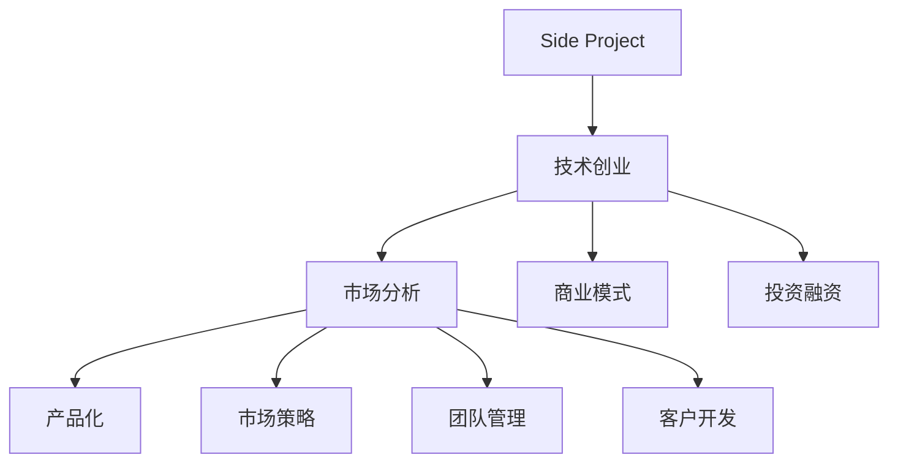

                 

# 如何将Side Project转化为主要收入来源

> 关键词：Side Project, 收入来源, 技术创业, 市场分析, 商业模式, 产品化, 市场策略, 团队管理, 客户开发, 投资融资

## 1. 背景介绍

在快速变化的技术和商业环境中，许多技术爱好者和从业者可能会在闲暇时间开发一些有趣的Side Project。这些Side Project往往源于个人兴趣或对现有产品的不满，有时还可能产生创新的解决方案。然而，这些创新产品如何在市场上获得成功，最终实现收入，是很多Side Project开发者面临的挑战。本文将探讨如何将Side Project转化为主要收入来源的策略、方法，以及可能的陷阱和解决方案。

## 2. 核心概念与联系

### 2.1 核心概念概述

为了帮助开发者理解和转化Side Project，下面简要介绍几个核心概念及其相互联系：

1. **Side Project**：指在主工作（全职工作）之外的开发项目，通常出于兴趣或个人创意，不直接贡献于主工作收入。

2. **技术创业**：指利用技术能力创建新公司，为社会或特定市场提供新价值。

3. **市场分析**：通过分析市场需求、竞争格局、客户行为等，制定合适的市场策略。

4. **商业模式**：指公司如何赚钱的模式，包括产品定价、收入来源等。

5. **产品化**：将技术想法或原型转化为可以商业化销售的实际产品。

6. **市场策略**：制定和执行市场推广计划，提升产品知名度和市场份额。

7. **团队管理**：有效组织和管理开发团队，确保项目顺利进行。

8. **客户开发**：获取、维护和扩展客户群体，实现商业增长。

9. **投资融资**：通过吸引投资，获取资金支持，加速公司成长。

### 2.2 核心概念原理和架构的 Mermaid 流程图

这个流程图展示了从Side Project到技术创业、产品化、市场策略等一系列核心概念之间的联系。开发者可以通过理解这些概念和它们之间的相互关系，更好地指导Side Project的转化和运营。

## 3. 核心算法原理 & 具体操作步骤

### 3.1 算法原理概述

将Side Project转化为主要收入来源，本质上是一个从创意到商业化的过程，涉及技术开发、市场分析、商业模式设计等多个方面的决策和实施。其核心算法原理可以概括为：

1. **需求识别**：识别目标市场的需求和痛点，评估潜在市场的规模和增长潜力。

2. **竞争分析**：分析竞争者的情况，了解市场现状和潜在竞争优势。

3. **产品定位**：基于市场需求和竞争分析，确定产品定位和核心竞争力。

4. **原型开发**：快速开发MVP（最小可行产品），验证市场需求和产品概念。

5. **市场测试**：在小范围内测试产品，收集用户反馈，迭代改进。

6. **市场推广**：根据市场策略，进行有针对性的推广活动，提升产品知名度。

7. **客户获取**：通过各种手段获取并维护客户，构建用户社区。

8. **收入模型设计**：设计合理的收入模式，包括付费订阅、广告、交易佣金等。

9. **团队和资源管理**：有效管理团队和资源，确保项目的持续推进。

10. **投资融资**：根据公司发展需要，寻找合适的投资人和融资渠道。

### 3.2 算法步骤详解

以下是具体的算法步骤和操作步骤：

**Step 1: 识别和验证市场需求**

1. **市场调研**：通过问卷调查、焦点小组、访谈等方式，了解目标市场的用户需求和痛点。
2. **需求验证**：通过最小可行产品(MVP)验证需求，收集用户反馈。

**Step 2: 竞争分析**

1. **竞争者分析**：分析竞争对手的产品、市场份额、定价策略、优劣势等。
2. **差异化策略**：根据竞争分析，确定产品的独特卖点(USP)。

**Step 3: 产品原型开发**

1. **MVP开发**：快速开发产品原型，验证核心功能。
2. **功能迭代**：根据用户反馈，快速迭代改进产品。

**Step 4: 市场测试**

1. **小范围测试**：在一小部分目标用户中测试产品，收集反馈。
2. **数据分析**：分析测试数据，评估产品性能和用户接受度。

**Step 5: 市场推广**

1. **制定策略**：根据市场分析结果，制定推广策略，如SEO、社交媒体、内容营销等。
2. **执行计划**：执行推广计划，提升产品曝光度和用户量。

**Step 6: 客户获取**

1. **获取渠道**：选择适合的客户获取渠道，如社交媒体、SEO、合作推广等。
2. **客户维护**：通过客户反馈、社群建设等方式，维护和扩展客户群体。

**Step 7: 收入模型设计**

1. **定价策略**：根据市场和产品定位，设计合适的定价策略，如免费+付费模式、订阅制等。
2. **收入管理**：实施有效的收入管理和客户关系管理系统，确保稳定收入。

**Step 8: 团队和资源管理**

1. **团队建设**：组建和培训高效的团队，确保技术、市场、运营等各环节的协同。
2. **资源管理**：合理分配和利用资源，确保项目可持续推进。

**Step 9: 投资融资**

1. **融资渠道**：根据公司发展需要，选择合适的融资渠道，如天使投资、风投、众筹等。
2. **谈判和协议**：与投资人进行谈判，签订投资协议，获取资金支持。

### 3.3 算法优缺点

#### 3.3.1 优点

1. **创新驱动**：Side Project往往源于创意和技术兴趣，具有较高的创新潜力。
2. **成本低**：相比全新创业，Side Project的初期投入较低，风险较小。
3. **灵活性**：Side Project的开发不受全职工作干扰，可以灵活调整方向。
4. **市场空间**：市场需求广泛，提供了广阔的商业机会。

#### 3.3.2 缺点

1. **时间成本**：将Side Project转化为主要收入来源需要大量时间和精力投入。
2. **资源限制**：Side Project往往缺乏足够的资源，限制了产品开发的规模和速度。
3. **市场风险**：市场需求和竞争格局的不确定性，可能导致商业失败。
4. **团队管理**：管理一个Side Project团队，需要较高的领导力和协调能力。

### 3.4 算法应用领域

Side Project的转化策略和模型设计，不仅适用于新兴技术创业，也适用于现有公司的产品线拓展和市场开发。这些策略和技术方法在多个领域均有广泛应用，例如：

1. **软件企业**：开发新产品线或服务，开拓新市场。
2. **传统行业**：利用新技术提升产品或服务，进入数字化转型。
3. **创业公司**：从创意到产品的全过程，实现从零到一。
4. **个人开发者**：利用业余时间开发应用，实现个人价值。

## 4. 数学模型和公式 & 详细讲解 & 举例说明

### 4.1 数学模型构建

为了更好地指导Side Project的商业化过程，以下构建一个简单的数学模型，用于描述市场需求、竞争分析、收入模型等关键变量之间的关系。

假设市场规模为 $M$，目标市场占比为 $P$，产品价格为 $P_{\text{price}}$，边际成本为 $C_{\text{marginal}}$，固定成本为 $C_{\text{fixed}}$，收入为 $I$。

模型表达式为：

$$ I = P \cdot M \cdot P_{\text{price}} - (C_{\text{fixed}} + C_{\text{marginal}} \cdot I) $$

### 4.2 公式推导过程

1. **市场规模 $M$**：通过调研和数据分析，确定目标市场的潜在用户数量。
2. **目标市场占比 $P$**：根据市场分析，确定产品的目标用户群体。
3. **产品价格 $P_{\text{price}}$**：基于产品定位和市场需求，设定合理的价格。
4. **边际成本 $C_{\text{marginal}}$**：计算单位销售的变动成本。
5. **固定成本 $C_{\text{fixed}}$**：计算固定成本总额。
6. **收入 $I$**：计算总收入，考虑定价策略和市场需求。

### 4.3 案例分析与讲解

以SaaS订阅服务为例，假设市场规模为1000万用户，目标市场占比为5%，每月订阅价格为10美元，边际成本为5美元，固定成本为100万美元。根据模型计算，每月潜在收入为100万美元，需要支持2万名用户。

若实际销售1万名用户，则实际收入为100万美元，每月净收入为50万美元。若每月新增用户1000名，则收入增长10万美元，直至达到2万用户的目标。

## 5. 项目实践：代码实例和详细解释说明

### 5.1 开发环境搭建

1. **选择合适的开发环境**：如AWS、Google Cloud等云平台，提供资源和工具支持。
2. **配置开发工具**：如Git、IDE、CI/CD工具等，提高开发效率。
3. **基础设施搭建**：选择合适的主机和数据库，确保稳定性。

### 5.2 源代码详细实现

**MVP开发**：

1. **选择开发框架**：如React、Flutter、Spring等，根据需求选择合适的技术栈。
2. **设计产品原型**：使用原型设计工具如Sketch、Figma等，设计UI/UX。
3. **实现核心功能**：编写代码实现关键功能，测试验证。

**市场测试**：

1. **选择测试平台**：如App Store、Google Play等，发布测试版本。
2. **收集用户反馈**：使用用户调查、数据分析工具收集反馈。
3. **产品迭代**：根据反馈，快速迭代改进产品。

**市场推广**：

1. **制定推广计划**：根据市场分析，制定推广策略。
2. **执行推广活动**：如社交媒体广告、SEO优化、内容营销等。
3. **数据分析**：使用Google Analytics、Mixpanel等工具，分析推广效果。

### 5.3 代码解读与分析

**MVP开发**：

1. **代码结构**：模块化设计，清晰分工，便于维护。
2. **版本控制**：使用Git进行版本控制，确保代码历史可追溯。
3. **测试机制**：单元测试、集成测试、端到端测试，确保代码质量。

**市场测试**：

1. **测试方法**：A/B测试、灰度发布、用户行为分析，优化产品体验。
2. **数据收集**：使用Google Analytics、Mixpanel等工具，收集用户行为数据。
3. **数据分析**：使用Tableau、Power BI等工具，进行数据可视化分析。

**市场推广**：

1. **推广策略**：社交媒体广告、SEO优化、内容营销等，多渠道推广。
2. **数据分析**：Google Analytics、Mixpanel等工具，实时监测推广效果。
3. **反馈收集**：社交媒体、邮件、调查问卷等，获取用户反馈。

### 5.4 运行结果展示

**MVP测试结果**：

1. **用户满意度**：调查问卷收集的用户反馈，显示产品满意度。
2. **用户留存率**：数据分析工具显示的月活跃用户比例，显示用户粘性。
3. **收入数据**：MVP版本收入数据，显示初步商业化的效果。

## 6. 实际应用场景

### 6.4 未来应用展望

**技术创业**：

1. **新兴技术**：利用最新技术，开拓新的市场和业务领域。
2. **全球市场**：扩展到国际市场，提升用户和收入。

**软件企业**：

1. **产品创新**：不断推出新产品线，满足市场需求。
2. **市场拓展**：利用现有客户资源，开拓新市场和用户群体。

**传统行业**：

1. **数字化转型**：利用新技术，提升产品和服务质量。
2. **客户体验**：提升用户体验，提高客户满意度和忠诚度。

## 7. 工具和资源推荐

### 7.1 学习资源推荐

1. **技术博客**：如Medium、Towards Data Science，学习最新技术和实践经验。
2. **在线课程**：如Coursera、Udacity，系统学习技术和管理知识。
3. **技术社区**：如Stack Overflow、GitHub，交流技术问题，获取代码资源。

### 7.2 开发工具推荐

1. **IDE**：如Visual Studio Code、PyCharm、Android Studio，提高开发效率。
2. **版本控制**：如Git、SVN，确保代码版本管理。
3. **CI/CD**：如Jenkins、CircleCI、GitHub Actions，自动化测试和部署。

### 7.3 相关论文推荐

1. **技术创业**：如《The Lean Startup》、《Zero to One》，学习创业思维和商业模式设计。
2. **市场分析**：如《Crossing the Chasm》、《The Innovator's Dilemma》，了解市场变革和创新路径。
3. **产品化**：如《Don't Make Me Think》、《The Product Manager's Survival Guide》，学习产品设计和市场策略。

## 8. 总结：未来发展趋势与挑战

### 8.1 研究成果总结

1. **市场规模**：全球市场广阔，技术需求强劲，提供广阔的商业机会。
2. **技术创新**：新技术和算法不断涌现，推动市场快速迭代。
3. **竞争格局**：市场竞争激烈，需要不断创新和优化。
4. **客户需求**：客户需求不断变化，需要快速响应和调整。
5. **商业模式**：多样化的收入模式，如订阅制、广告、交易佣金等，满足不同客户需求。

### 8.2 未来发展趋势

1. **技术迭代**：技术不断进步，推动产品和市场创新。
2. **数据驱动**：利用大数据分析，优化市场策略和产品设计。
3. **用户定制**：个性化产品和服务，提升用户体验。
4. **多渠道营销**：多渠道推广，提升市场覆盖率。
5. **全球化扩展**：全球市场拓展，提升国际化竞争力。

### 8.3 面临的挑战

1. **技术风险**：新技术的快速变化，可能导致产品过时。
2. **市场竞争**：激烈的市场竞争，可能影响市场份额。
3. **用户期望**：用户需求变化，可能要求不断调整产品。
4. **资金压力**：初期投入和市场推广，可能带来财务压力。
5. **团队管理**：高效管理和协作，可能面临团队合作难题。

### 8.4 研究展望

1. **技术突破**：持续技术创新，提升产品竞争力。
2. **数据挖掘**：利用大数据分析，洞察市场和用户需求。
3. **用户研究**：深入了解用户行为，优化产品设计。
4. **资金优化**：合理分配和利用资金，提升投资回报率。
5. **团队建设**：建立高效的团队，提升整体效能。

## 9. 附录：常见问题与解答

**Q1: 如何将Side Project转化为主要收入来源？**

A: 1. 识别和验证市场需求，2. 竞争分析，3. 产品定位，4. MVP开发，5. 市场测试，6. 市场推广，7. 客户获取，8. 收入模型设计，9. 团队和资源管理，10. 投资融资。

**Q2: 如何制定有效的市场推广策略？**

A: 1. 确定目标市场和用户群体，2. 选择合适的推广渠道，3. 制定推广计划和预算，4. 实施推广活动，5. 监测和分析推广效果，6. 调整和优化推广策略。

**Q3: 如何管理Side Project团队？**

A: 1. 明确团队目标和角色，2. 建立有效的沟通机制，3. 制定项目管理计划，4. 提供必要的培训和支持，5. 激励和奖励团队成员。

**Q4: 如何优化Side Project的成本结构？**

A: 1. 控制固定成本，如合理选择托管平台和基础设施，2. 降低变动成本，如优化开发流程和代码质量，3. 选择低成本的推广渠道，4. 合理定价，提升用户黏性。

**Q5: 如何处理Side Project的知识产权问题？**

A: 1. 明确知识产权归属，如通过协议和合同，2. 保护专利和技术秘密，如申请专利和保密协议，3. 合理利用开源社区，如分享和获取开源代码，4. 管理知识产权风险，如避免侵权和纠纷。

---

作者：禅与计算机程序设计艺术 / Zen and the Art of Computer Programming

