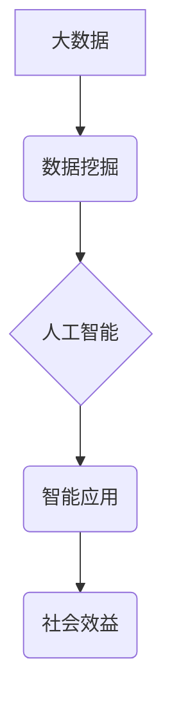

> 大数据，人工智能，机器学习，深度学习，数据挖掘，算法，模型，应用场景

## 1. 背景介绍

人工智能（AI）作为科技发展的重要方向，近年来取得了显著进展，并在各个领域展现出巨大的应用潜力。而大数据作为人工智能发展的基石，为其提供了海量的数据支撑，推动了人工智能技术的快速发展。

随着互联网、移动互联网、物联网等技术的快速发展，海量数据正在以指数级增长。这些数据蕴含着丰富的知识和价值，为人工智能的训练和应用提供了宝贵的资源。大数据时代，人工智能技术能够从海量数据中挖掘出隐藏的模式和规律，从而实现更精准、更智能的决策和服务。

## 2. 核心概念与联系

**2.1 大数据**

大数据是指规模庞大、结构复杂、更新速度快、类型多样化的数据。其特征通常被概括为“五V”：

* **Volume（体积）**: 数据量巨大，难以用传统方法处理。
* **Velocity（速度）**: 数据生成和更新速度快，需要实时处理。
* **Variety（多样性）**: 数据类型多样，包括结构化数据、半结构化数据和非结构化数据。
* **Veracity（真实性）**: 数据质量参差不齐，需要进行清洗和验证。
* **Value（价值）**: 数据蕴含着潜在的价值，需要进行挖掘和分析。

**2.2 人工智能**

人工智能是指模拟人类智能行为的计算机系统。其目标是使机器能够像人类一样学习、推理、解决问题和做出决策。人工智能技术主要包括：

* **机器学习**: 使机器从数据中学习，无需明确编程。
* **深度学习**: 基于多层神经网络，能够学习更复杂的模式。
* **自然语言处理**: 使机器能够理解和生成人类语言。
* **计算机视觉**: 使机器能够“看”图像和视频，并从中提取信息。

**2.3 核心概念联系**

大数据为人工智能提供了训练数据和应用场景，而人工智能则能够对大数据进行分析和挖掘，从而创造出新的价值。两者相互促进，共同推动了科技发展。



## 3. 核心算法原理 & 具体操作步骤

**3.1 算法原理概述**

机器学习算法是人工智能的核心，它使机器能够从数据中学习，并根据学习到的知识进行预测或分类。常见的机器学习算法包括：

* **线性回归**: 用于预测连续数值。
* **逻辑回归**: 用于分类问题。
* **决策树**: 用于分类和回归问题，通过树状结构进行决策。
* **支持向量机**: 用于分类问题，寻找最佳的分隔超平面。
* **k近邻**: 用于分类和回归问题，根据最近的k个邻居进行预测。
* **神经网络**: 用于更复杂的模式识别，例如图像识别和自然语言处理。

**3.2 算法步骤详解**

以线性回归为例，其步骤如下：

1. **数据准备**: 收集和预处理数据，包括清洗、转换和特征工程。
2. **模型训练**: 使用训练数据训练线性回归模型，找到最佳的模型参数。
3. **模型评估**: 使用测试数据评估模型的性能，例如准确率、召回率和F1-score。
4. **模型调优**: 根据评估结果，调整模型参数，提高模型性能。
5. **模型部署**: 将训练好的模型部署到实际应用场景中。

**3.3 算法优缺点**

不同的机器学习算法具有不同的优缺点，需要根据具体应用场景选择合适的算法。例如，线性回归简单易实现，但对非线性关系的拟合能力较弱；神经网络能够学习更复杂的模式，但训练时间长，参数量大。

**3.4 算法应用领域**

机器学习算法广泛应用于各个领域，例如：

* **医疗保健**: 疾病诊断、药物研发、患者风险预测。
* **金融**: 欺诈检测、信用评分、投资决策。
* **电商**: 商品推荐、用户画像、价格预测。
* **交通**: 交通流量预测、自动驾驶、路线规划。

## 4. 数学模型和公式 & 详细讲解 & 举例说明

**4.1 数学模型构建**

线性回归模型的数学模型如下：

$$
y = \theta_0 + \theta_1x_1 + \theta_2x_2 + ... + \theta_nx_n + \epsilon
$$

其中：

* $y$ 是预测值。
* $\theta_0, \theta_1, ..., \theta_n$ 是模型参数。
* $x_1, x_2, ..., x_n$ 是输入特征。
* $\epsilon$ 是误差项。

**4.2 公式推导过程**

线性回归模型的目标是找到最佳的模型参数，使得预测值与真实值之间的误差最小。常用的损失函数是均方误差（MSE）：

$$
MSE = \frac{1}{n} \sum_{i=1}^{n} (y_i - \hat{y}_i)^2
$$

其中：

* $n$ 是样本数量。
* $y_i$ 是真实值。
* $\hat{y}_i$ 是预测值。

通过最小化MSE，可以得到最佳的模型参数。

**4.3 案例分析与讲解**

假设我们想要预测房价，输入特征包括房屋面积、房间数量、地理位置等。我们可以使用线性回归模型训练一个预测房价的模型。

通过训练数据，模型会学习到房屋面积、房间数量等特征与房价之间的关系，并找到最佳的模型参数。然后，我们可以使用这个模型预测新房子的房价。

## 5. 项目实践：代码实例和详细解释说明

**5.1 开发环境搭建**

* Python 3.x
* Jupyter Notebook
* scikit-learn

**5.2 源代码详细实现**

```python
from sklearn.linear_model import LinearRegression
from sklearn.model_selection import train_test_split
from sklearn.metrics import mean_squared_error

# 加载数据
data = ...

# 分割数据
X = data[['面积', '房间数量']]
y = data['房价']
X_train, X_test, y_train, y_test = train_test_split(X, y, test_size=0.2)

# 创建线性回归模型
model = LinearRegression()

# 训练模型
model.fit(X_train, y_train)

# 预测测试数据
y_pred = model.predict(X_test)

# 评估模型性能
mse = mean_squared_error(y_test, y_pred)
print(f'均方误差: {mse}')
```

**5.3 代码解读与分析**

* 使用 `train_test_split` 函数将数据分为训练集和测试集。
* 使用 `LinearRegression` 类创建线性回归模型。
* 使用 `fit` 方法训练模型。
* 使用 `predict` 方法预测测试数据。
* 使用 `mean_squared_error` 函数评估模型性能。

**5.4 运行结果展示**

运行代码后，会输出模型的均方误差值，可以用来评估模型的性能。

## 6. 实际应用场景

**6.1 医疗保健**

* 疾病诊断: 利用机器学习算法分析患者的病历、影像数据等，辅助医生诊断疾病。
* 药物研发: 利用机器学习算法分析药物的结构和作用机制，加速药物研发过程。
* 患者风险预测: 利用机器学习算法分析患者的医疗历史和生活习惯，预测患者患病风险。

**6.2 金融**

* 欺诈检测: 利用机器学习算法分析交易数据，识别异常交易行为，防止欺诈行为。
* 信用评分: 利用机器学习算法分析用户的信用历史和财务状况，评估用户的信用风险。
* 投资决策: 利用机器学习算法分析市场数据，预测股票价格走势，辅助投资决策。

**6.3 电商**

* 商品推荐: 利用机器学习算法分析用户的购买历史和浏览记录，推荐用户可能感兴趣的商品。
* 用户画像: 利用机器学习算法分析用户的行为数据，构建用户的画像，以便进行精准营销。
* 价格预测: 利用机器学习算法分析市场数据，预测商品价格走势，帮助商家制定价格策略。

**6.4 未来应用展望**

随着大数据的不断积累和人工智能技术的不断发展，大数据对人工智能的影响将更加深远。未来，人工智能将更加智能化、个性化和自动化，在各个领域发挥更大的作用。

## 7. 工具和资源推荐

**7.1 学习资源推荐**

* **书籍**:
    * 《深度学习》
    * 《机器学习实战》
    * 《Python机器学习》
* **在线课程**:
    * Coursera
    * edX
    * Udacity

**7.2 开发工具推荐**

* **Python**: 
    * scikit-learn
    * TensorFlow
    * PyTorch
* **数据处理工具**:
    * Pandas
    * NumPy
    * Spark

**7.3 相关论文推荐**

* **《ImageNet Classification with Deep Convolutional Neural Networks》**
* **《Attention Is All You Need》**
* **《BERT: Pre-training of Deep Bidirectional Transformers for Language Understanding》**

## 8. 总结：未来发展趋势与挑战

**8.1 研究成果总结**

大数据为人工智能的发展提供了强有力的支撑，人工智能技术也为大数据分析和挖掘提供了新的工具和方法。两者相互促进，共同推动了科技发展。

**8.2 未来发展趋势**

* **模型更加复杂**: 深度学习模型将更加复杂，能够学习更复杂的模式。
* **数据更加多样化**: 人工智能将处理更多类型的数据，例如图像、视频、音频等。
* **应用更加广泛**: 人工智能将应用于更多领域，例如医疗保健、金融、教育等。

**8.3 面临的挑战**

* **数据质量**: 大数据中存在大量噪声和错误数据，需要进行有效的数据清洗和预处理。
* **算法解释性**: 许多人工智能算法是黑箱模型，难以解释其决策过程，这限制了其在一些领域应用的推广。
* **伦理问题**: 人工智能的应用可能带来一些伦理问题，例如算法偏见、隐私泄露等，需要进行深入研究和探讨。

**8.4 研究展望**

未来，我们需要继续探索更有效的算法和模型，提高人工智能的效率和准确性。同时，还需要关注人工智能的伦理问题，确保其安全、可控和可持续发展。

## 9. 附录：常见问题与解答

**9.1 如何选择合适的机器学习算法？**

选择合适的机器学习算法需要根据具体应用场景和数据特点进行选择。例如，对于分类问题，可以考虑使用逻辑回归、支持向量机或决策树；对于回归问题，可以考虑使用线性回归或支持向量回归。

**9.2 如何处理大数据？**

处理大数据需要使用分布式计算框架，例如Spark或Hadoop，并采用数据分片、并行处理等技术。

**9.3 如何评估机器学习模型的性能？**

常用的机器学习模型性能评估指标包括准确率、召回率、F1-score、AUC等。

作者：禅与计算机程序设计艺术 / Zen and the Art of Computer Programming


<end_of_turn>