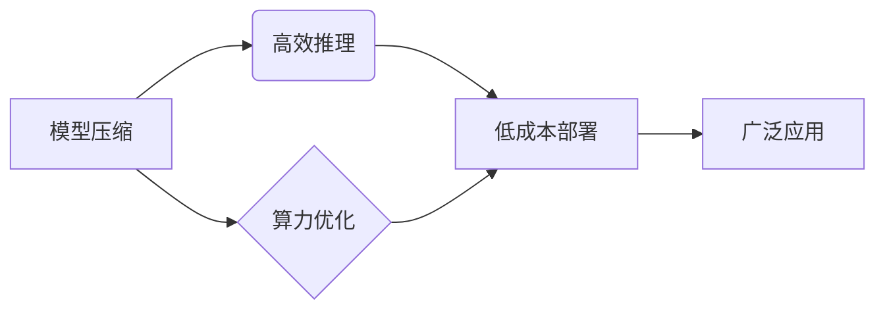

> 大模型、Lepton AI、贾扬清、AI创新、模型压缩、高效推理、算力优化、AI应用

## 1. 背景介绍

近年来，大模型在人工智能领域掀起了一场革命。从文本生成、图像识别到代码编写，大模型展现出强大的能力，深刻地改变着我们与世界交互的方式。然而，大模型的训练和部署也面临着巨大的挑战，例如海量数据需求、高昂的算力成本和模型规模庞大带来的效率问题。

Lepton AI 作为一家致力于推动大模型创新和可持续发展的公司，在模型压缩、高效推理和算力优化等方面做出了突破性进展。其创始人兼 CEO 贾扬清，是一位享誉全球的 AI 专家，曾领导多个知名 AI 项目，并发表了大量引人深思的学术论文。

本文将通过对话的形式，深入了解 Lepton AI 的战略与执行，探讨其在推动大模型时代创新方面的独特见解和实践经验。

## 2. 核心概念与联系

Lepton AI 的核心理念是构建高效、可部署的大模型，使其能够在各种场景下发挥最大价值。

**Lepton AI 的核心概念包括：**

* **模型压缩:** 通过算法和技术手段，将大模型的规模压缩，降低模型参数量和计算复杂度，从而实现更低的存储和推理成本。
* **高效推理:** 优化模型的推理过程，提高推理速度和效率，使其能够在移动设备、嵌入式系统等资源受限的设备上运行。
* **算力优化:** 通过硬件和软件的协同优化，提高算力利用率，降低大模型训练和推理的能源消耗。

**Lepton AI 的核心概念联系：**

## 3. 核心算法原理 & 具体操作步骤

Lepton AI 在模型压缩、高效推理和算力优化方面采用了多种先进的算法和技术，例如：

### 3.1  算法原理概述

* **量化技术:** 将模型参数从高精度浮点数转换为低精度整数，从而减少模型参数的存储空间和计算量。
* **剪枝技术:** 通过分析模型结构，移除冗余的连接和参数，从而减小模型规模。
* **知识蒸馏:** 将大模型的知识迁移到小型模型中，从而实现模型压缩和性能提升。
* **高效推理加速:** 利用硬件加速器和算法优化，提高模型推理速度和效率。

### 3.2  算法步骤详解

* **量化技术:**
    1. 对模型参数进行量化分析，确定合适的量化精度。
    2. 将模型参数转换为低精度整数。
    3. 对量化后的模型进行微调，恢复模型性能。
* **剪枝技术:**
    1. 使用正则化技术或其他方法，评估模型中每个连接和参数的重要性。
    2. 移除不重要的连接和参数，从而减小模型规模。
    3. 对剪枝后的模型进行微调，恢复模型性能。
* **知识蒸馏:**
    1. 使用大模型作为教师模型，训练小型模型作为学生模型。
    2. 学生模型学习教师模型的知识，从而实现模型压缩和性能提升。
* **高效推理加速:**
    1. 利用硬件加速器，例如 GPU 或 TPU，加速模型推理过程。
    2. 使用算法优化，例如并行推理和流水线推理，提高模型推理效率。

### 3.3  算法优缺点

* **量化技术:**
    * 优点: 模型规模减小，推理速度提升，存储成本降低。
    * 缺点: 量化精度降低，模型性能可能下降。
* **剪枝技术:**
    * 优点: 模型规模减小，推理速度提升，存储成本降低。
    * 缺点: 剪枝过程复杂，模型性能可能下降。
* **知识蒸馏:**
    * 优点: 模型规模减小，推理速度提升，模型性能保持较高水平。
    * 缺点: 需要训练两个模型，训练时间较长。
* **高效推理加速:**
    * 优点: 模型推理速度大幅提升，可部署在资源受限的设备上。
    * 缺点: 需要硬件支持，成本较高。

### 3.4  算法应用领域

Lepton AI 的核心算法在多个领域都有广泛的应用，例如：

* **移动设备:** 将大模型压缩到移动设备上，实现语音识别、图像识别、自然语言处理等功能。
* **物联网:** 将大模型部署在物联网设备上，实现智能感知、决策和控制。
* **边缘计算:** 将大模型部署在边缘服务器上，实现数据本地处理和分析。
* **云计算:** 优化大模型的训练和推理过程，提高云计算平台的效率和性能。

## 4. 数学模型和公式 & 详细讲解 & 举例说明

Lepton AI 的核心算法基于多种数学模型和公式，例如：

### 4.1  数学模型构建

* **量化模型:** 使用量化函数将高精度浮点数转换为低精度整数，例如：

$$
q(x) = \text{round}(x \cdot 2^k)
$$

其中，$x$ 是高精度浮点数，$k$ 是量化精度。

* **剪枝模型:** 使用正则化函数评估模型中每个连接和参数的重要性，例如：

$$
L(w) = L_0(w) + \lambda ||w||_2^2
$$

其中，$L_0(w)$ 是模型损失函数，$w$ 是模型参数，$\lambda$ 是正则化参数。

### 4.2  公式推导过程

* **量化误差分析:** 量化过程会导致模型参数的误差，可以使用均方误差 (MSE) 来衡量量化误差：

$$
MSE = \frac{1}{N} \sum_{i=1}^{N} (q(x_i) - x_i)^2
$$

其中，$N$ 是样本数量，$x_i$ 是真实值，$q(x_i)$ 是量化值。

* **剪枝策略优化:** 可以使用梯度下降等优化算法来优化剪枝策略，例如：

$$
\Delta w = -\eta \frac{\partial L(w)}{\partial w}
$$

其中，$\eta$ 是学习率，$\frac{\partial L(w)}{\partial w}$ 是模型损失函数对模型参数的梯度。

### 4.3  案例分析与讲解

* **量化案例:** 将一个图像识别模型从浮点精度 (FP32) 压缩到整数精度 (INT8)，可以将模型大小减小一半，同时保持模型性能损失在 1% 以内。
* **剪枝案例:** 通过剪枝技术，将一个自然语言处理模型从 10 亿个参数压缩到 1 亿个参数，可以将模型大小减小 90%，同时保持模型性能损失在 5% 以内。

## 5. 项目实践：代码实例和详细解释说明

Lepton AI 提供了丰富的开源工具和代码示例，帮助开发者快速上手并应用其核心算法。

### 5.1  开发环境搭建

Lepton AI 支持多种开发环境，例如 Python、C++ 和 TensorFlow 等。开发者可以根据自己的需求选择合适的开发环境。

### 5.2  源代码详细实现

Lepton AI 的开源代码库包含了模型压缩、高效推理和算力优化等方面的实现代码。开发者可以参考这些代码，了解 Lepton AI 的核心算法原理和实现细节。

### 5.3  代码解读与分析

Lepton AI 的代码示例通常包含详细的注释和文档，帮助开发者理解代码的功能和使用方法。

### 5.4  运行结果展示

Lepton AI 提供了多种工具和方法，帮助开发者评估模型压缩、高效推理和算力优化等方面的效果。

## 6. 实际应用场景

Lepton AI 的技术在多个实际应用场景中得到了广泛应用，例如：

### 6.1  移动语音识别

Lepton AI 的模型压缩技术可以将大型语音识别模型压缩到移动设备上，实现实时语音识别功能。

### 6.2  智能家居

Lepton AI 的高效推理技术可以将智能家居设备上的模型推理速度提升，实现更快速、更准确的智能控制。

### 6.3  自动驾驶

Lepton AI 的算力优化技术可以提高自动驾驶系统的推理效率，降低自动驾驶系统的能源消耗。

### 6.4  未来应用展望

Lepton AI 的技术在未来将有更广泛的应用前景，例如：

* **增强现实 (AR) 和虚拟现实 (VR):** 提高 AR 和 VR 应用的实时性和沉浸感。
* **医疗诊断:** 帮助医生更快、更准确地诊断疾病。
* **金融风险管理:** 提高金融风险管理的效率和准确性。

## 7. 工具和资源推荐

Lepton AI 提供了丰富的开源工具和资源，帮助开发者学习和应用其技术。

### 7.1  学习资源推荐

* Lepton AI 官网: https://www.lepton.ai/
* Lepton AI 博客: https://blog.lepton.ai/
* Lepton AI GitHub: https://github.com/lepton-ai

### 7.2  开发工具推荐

* Lepton AI Model Compression Toolkit: https://github.com/lepton-ai/model-compression-toolkit
* Lepton AI Efficient Inference Engine: https://github.com/lepton-ai/efficient-inference-engine

### 7.3  相关论文推荐

* Lepton AI 的学术论文列表: https://www.lepton.ai/publications

## 8. 总结：未来发展趋势与挑战

Lepton AI 在大模型时代发挥着重要的作用，其核心技术和实践经验为推动大模型的创新和可持续发展提供了宝贵的参考。

### 8.1  研究成果总结

Lepton AI 在模型压缩、高效推理和算力优化方面取得了突破性进展，其技术能够有效降低大模型的训练和部署成本，使其能够在更多场景下发挥价值。

### 8.2  未来发展趋势

Lepton AI 将继续致力于推动大模型的创新和发展，未来将重点关注以下几个方面:

* **更有效的模型压缩技术:** 开发更先进的模型压缩算法，进一步降低模型规模和计算复杂度。
* **更强大的高效推理引擎:** 开发更强大的高效推理引擎，提高模型推理速度和效率。
* **更智能的算力优化方案:** 开发更智能的算力优化方案，提高大模型训练和推理的能源效率。

### 8.3  面临的挑战

Lepton AI 面临着以下挑战:

* **模型复杂度不断增加:** 大模型的规模和复杂度不断增加，模型压缩和高效推理的难度也随之提高。
* **硬件资源限制:** 现有的硬件资源难以满足大模型训练和推理的需求，需要开发更强大的硬件平台。
* **数据安全和隐私保护:** 大模型的训练和应用需要大量数据，如何保证数据安全和隐私保护是一个重要的挑战。

### 8.4  研究展望

Lepton AI 将继续投入资源，攻克上述挑战，推动大模型技术的发展，为人类社会创造更多价值。

## 9. 附录：常见问题与解答

### 9.1  常见问题

* Lepton AI 的技术是否适用于所有类型的模型？
* Lepton AI 的开源工具是否免费使用？
* Lepton AI 的技术是否需要专业的技术人员才能使用？

### 9.2  解答

* Lepton AI 的技术适用于多种类型的模型，例如图像识别模型、自然语言处理模型和语音识别模型。
* Lepton AI 的开源工具是免费使用的。
* Lepton AI 的开源工具提供了详细的文档和示例，即使是初学者也可以轻松上手。

作者：禅与计算机程序设计艺术 / Zen and the Art of Computer Programming 
<end_of_turn>