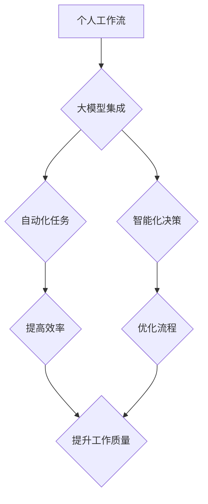

> 大模型、个人工作流、AI集成、自动化、效率提升、代码生成、文本创作、数据分析

## 1. 背景介绍

近年来，大模型技术取得了飞速发展，其强大的泛化能力和知识表示能力，为个人工作流的自动化和智能化提供了前所未有的机遇。大模型能够理解和生成人类语言，处理复杂数据，并执行各种任务，例如代码生成、文本创作、数据分析等。

传统的个人工作流通常依赖于手工操作和工具链，效率低下，且难以应对复杂的任务。而大模型的集成可以有效提升个人工作效率，解放人力，并为个人工作流程注入智能化。

## 2. 核心概念与联系

### 2.1 大模型

大模型是指参数量巨大、训练数据海量的人工智能模型。它们通过学习海量数据，掌握了丰富的知识和模式，能够执行各种复杂的任务。常见的代表性大模型包括GPT-3、LaMDA、BERT等。

### 2.2 个人工作流

个人工作流是指个人在完成特定任务过程中所遵循的一系列步骤和操作。它可以包括各种活动，例如写作、编程、数据分析、项目管理等。

### 2.3 大模型在个人工作流中的集成

将大模型集成到个人工作流中，是指利用大模型的强大能力，自动化和智能化个人工作流程中的某些步骤或任务。例如，利用大模型进行代码生成、文本摘要、数据分析等，从而提高工作效率和准确性。

**Mermaid 流程图**



## 3. 核心算法原理 & 具体操作步骤

### 3.1 算法原理概述

大模型在个人工作流中的集成主要基于以下核心算法：

* **自然语言处理 (NLP)**：用于理解和生成人类语言，例如文本摘要、翻译、问答等。
* **机器学习 (ML)**：用于从数据中学习模式和规律，例如预测、分类、推荐等。
* **深度学习 (DL)**：一种更高级的机器学习方法，利用多层神经网络学习复杂数据，例如图像识别、语音识别等。

### 3.2 算法步骤详解

将大模型集成到个人工作流中的具体步骤如下：

1. **识别自动化任务**: 分析个人工作流，识别哪些任务可以被自动化，例如代码生成、文档总结、数据分析等。
2. **选择合适的模型**: 根据任务需求选择合适的预训练大模型，例如GPT-3用于文本生成，BERT用于文本理解等。
3. **数据准备**: 为模型提供训练数据，例如代码示例、文档片段、数据表格等。
4. **模型微调**: 对预训练模型进行微调，使其适应特定任务和数据。
5. **集成到工作流**: 将微调后的模型集成到个人工作流中，例如通过API调用、插件扩展等方式。
6. **评估和优化**: 评估模型性能，并根据实际情况进行模型优化和调整。

### 3.3 算法优缺点

**优点**:

* **提高效率**: 自动化重复性任务，释放人力，提高工作效率。
* **提升准确性**: 利用大模型的强大能力，提高任务的准确性和可靠性。
* **智能化决策**: 基于数据分析和预测，辅助个人做出更智能化的决策。

**缺点**:

* **模型依赖**: 需要依赖于预训练模型，且模型性能受数据质量影响。
* **技术门槛**: 集成大模型需要一定的技术知识和经验。
* **数据安全**: 需要谨慎处理个人数据，确保数据安全和隐私。

### 3.4 算法应用领域

大模型在个人工作流中的应用领域非常广泛，例如：

* **软件开发**: 代码生成、代码修复、文档自动生成等。
* **写作创作**: 文本生成、文章摘要、创意写作等。
* **数据分析**: 数据可视化、数据挖掘、数据分析报告生成等。
* **项目管理**: 任务分配、进度跟踪、风险评估等。

## 4. 数学模型和公式 & 详细讲解 & 举例说明

### 4.1 数学模型构建

大模型的训练过程本质上是一个优化问题，目标是找到模型参数，使得模型在训练数据上的预测性能达到最佳。常用的数学模型包括：

* **损失函数**: 用于衡量模型预测结果与真实值的差距。常见的损失函数包括交叉熵损失、均方误差等。
* **优化算法**: 用于更新模型参数，使得损失函数最小化。常见的优化算法包括梯度下降、Adam等。

### 4.2 公式推导过程

**交叉熵损失函数**:

$$
Loss = - \sum_{i=1}^{N} y_i \log(\hat{y}_i)
$$

其中：

* $N$ 为样本数量
* $y_i$ 为真实标签
* $\hat{y}_i$ 为模型预测结果

**梯度下降算法**:

$$
\theta = \theta - \alpha \nabla Loss(\theta)
$$

其中：

* $\theta$ 为模型参数
* $\alpha$ 为学习率
* $\nabla Loss(\theta)$ 为损失函数对参数的梯度

### 4.3 案例分析与讲解

假设我们训练一个文本分类模型，目标是将文本分类为正类或负类。我们可以使用交叉熵损失函数和梯度下降算法进行训练。

在训练过程中，模型会不断更新参数，使得预测结果与真实标签的差距最小化。最终，模型能够准确地将文本分类为正类或负类。

## 5. 项目实践：代码实例和详细解释说明

### 5.1 开发环境搭建

* Python 3.7+
* TensorFlow/PyTorch
* Jupyter Notebook

### 5.2 源代码详细实现

```python
# 导入必要的库
import tensorflow as tf

# 定义模型结构
model = tf.keras.Sequential([
    tf.keras.layers.Embedding(input_dim=10000, output_dim=128),
    tf.keras.layers.LSTM(units=64),
    tf.keras.layers.Dense(units=1, activation='sigmoid')
])

# 编译模型
model.compile(optimizer='adam', loss='binary_crossentropy', metrics=['accuracy'])

# 训练模型
model.fit(x_train, y_train, epochs=10)

# 评估模型
loss, accuracy = model.evaluate(x_test, y_test)
print('Loss:', loss)
print('Accuracy:', accuracy)
```

### 5.3 代码解读与分析

* 代码首先导入必要的库，包括 TensorFlow 库。
* 然后定义了一个简单的文本分类模型，包含 Embedding 层、LSTM 层和 Dense 层。
* 模型使用 Adam 优化器、二分类交叉熵损失函数和准确率作为评估指标进行训练。
* 训练完成后，使用测试数据评估模型的性能。

### 5.4 运行结果展示

训练完成后，可以查看模型的损失值和准确率。

## 6. 实际应用场景

### 6.1 代码生成

大模型可以根据自然语言描述生成代码，例如：

* 用户输入：“创建一个 Python 函数，计算两个整数的和。”
* 大模型输出：

```python
def sum_two_integers(a, b):
  return a + b
```

### 6.2 文本创作

大模型可以辅助写作，例如：

* 用户输入：“写一篇关于人工智能的文章。”
* 大模型输出：一篇关于人工智能的文章草稿，用户可以根据需要进行修改和完善。

### 6.3 数据分析

大模型可以帮助分析数据，例如：

* 用户上传一个数据表格，大模型可以自动生成数据可视化图表，并提供数据分析报告。

### 6.4 未来应用展望

大模型在个人工作流中的应用前景广阔，未来可能在以下方面得到进一步发展：

* **更个性化的工作流**: 根据用户的习惯和需求，定制个性化的工作流。
* **更智能化的决策**: 利用大模型的预测能力，辅助用户做出更智能化的决策。
* **更协作性的工作模式**: 利用大模型，实现更有效的团队协作。

## 7. 工具和资源推荐

### 7.1 学习资源推荐

* **OpenAI API**: https://beta.openai.com/docs/api-reference/introduction
* **Hugging Face**: https://huggingface.co/
* **TensorFlow Tutorials**: https://www.tensorflow.org/tutorials

### 7.2 开发工具推荐

* **Jupyter Notebook**: https://jupyter.org/
* **VS Code**: https://code.visualstudio.com/

### 7.3 相关论文推荐

* **Attention Is All You Need**: https://arxiv.org/abs/1706.03762
* **BERT: Pre-training of Deep Bidirectional Transformers for Language Understanding**: https://arxiv.org/abs/1810.04805

## 8. 总结：未来发展趋势与挑战

### 8.1 研究成果总结

大模型在个人工作流中的集成取得了显著成果，有效提升了工作效率和智能化水平。

### 8.2 未来发展趋势

未来，大模型在个人工作流中的应用将更加广泛和深入，例如：

* **更强大的模型**: 模型参数量更大，能力更强，能够处理更复杂的任务。
* **更个性化的服务**: 模型能够根据用户的需求和习惯，提供更个性化的服务。
* **更安全的应用**: 模型能够更好地保护用户隐私和数据安全。

### 8.3 面临的挑战

大模型在个人工作流中的应用也面临一些挑战，例如：

* **模型训练成本**: 训练大模型需要大量的计算资源和时间。
* **数据安全**: 需要确保模型训练数据和应用过程中的数据安全。
* **伦理问题**: 需要考虑大模型应用带来的伦理问题，例如算法偏见、数据隐私等。

### 8.4 研究展望

未来，需要进一步研究大模型的训练方法、应用场景和伦理问题，推动大模型技术在个人工作流中的安全、有效和可持续发展。

## 9. 附录：常见问题与解答

### 9.1 如何选择合适的模型？

选择合适的模型需要根据具体任务需求和数据特点进行评估。

### 9.2 如何训练大模型？

训练大模型需要强大的计算资源和专业的技术知识。

### 9.3 如何保证数据安全？

需要采取相应的技术措施和安全策略，确保数据安全和隐私保护。


作者：禅与计算机程序设计艺术 / Zen and the Art of Computer Programming 
<end_of_turn>