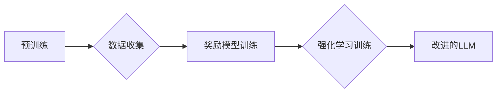

> 大规模语言模型，强化学习，人类反馈，文本生成，自然语言处理，深度学习

## 1. 背景介绍

近年来，大规模语言模型（LLM）在自然语言处理（NLP）领域取得了显著进展，展现出强大的文本生成、翻译、问答等能力。这些模型通常基于Transformer架构，拥有数十亿甚至数千亿的参数，通过海量文本数据进行预训练，能够捕捉语言的复杂结构和语义关系。然而，传统的预训练方法往往缺乏针对特定任务的优化，生成的文本可能存在偏差、不准确或缺乏逻辑性。

基于人类反馈的强化学习（RLHF） emerged as a promising approach to address these limitations. RLHF 结合了人类反馈和强化学习算法，通过奖励机制引导模型生成更符合人类期望的文本。

## 2. 核心概念与联系

**2.1 核心概念**

* **大规模语言模型 (LLM):** 拥有大量参数的深度学习模型，能够理解和生成人类语言。
* **强化学习 (RL):** 一种机器学习方法，通过奖励和惩罚机制训练模型，使其在特定环境中采取最优行动。
* **人类反馈 (Human Feedback):** 由人类提供对模型输出的评价和指导，例如评分、标注、修改等。

**2.2 核心联系**

RLHF 将人类反馈融入强化学习流程，通过以下步骤训练 LLM：

1. **预训练:** 使用海量文本数据预训练 LLM，使其具备基本的语言理解和生成能力。
2. **数据收集:** 利用预训练模型生成文本，并收集人类对这些文本的反馈。
3. **奖励模型训练:** 使用收集到的反馈数据训练一个奖励模型，该模型能够评估文本的质量和符合人类期望程度。
4. **强化学习训练:** 使用奖励模型作为奖励函数，通过强化学习算法进一步训练 LLM，使其生成更符合人类期望的文本。

**2.3 流程图**



## 3. 核心算法原理 & 具体操作步骤

**3.1 算法原理概述**

RLHF 的核心思想是利用人类反馈来引导模型学习。通过训练一个奖励模型，将人类反馈转化为模型可以理解的奖励信号，从而使模型能够学习生成更符合人类期望的文本。

**3.2 算法步骤详解**

1. **预训练:** 使用大量的文本数据训练一个初始的 LLM，使其具备基本的语言理解和生成能力。
2. **数据收集:** 利用预训练模型生成一系列文本，并收集人类对这些文本的反馈。反馈可以是评分、标注、修改等形式。
3. **奖励模型训练:** 使用收集到的反馈数据训练一个奖励模型。奖励模型的输入是文本，输出是文本的质量或符合人类期望程度的评分。常用的奖励模型包括神经网络、支持向量机等。
4. **强化学习训练:** 使用奖励模型作为奖励函数，通过强化学习算法进一步训练 LLM。强化学习算法的目标是找到一个策略，使得模型在执行动作（生成文本）时能够获得最大的奖励。常用的强化学习算法包括策略梯度、Q学习等。

**3.3 算法优缺点**

**优点:**

* 可以生成更符合人类期望的文本。
* 可以适应不同的任务和领域。
* 可以不断改进模型的性能。

**缺点:**

* 需要大量的标注数据，成本较高。
* 奖励模型的训练可能比较复杂。
* 强化学习训练过程可能比较耗时。

**3.4 算法应用领域**

RLHF 在以下领域具有广泛的应用前景：

* 文本生成：例如小说、诗歌、剧本等。
* 机器翻译：提高翻译质量和流畅度。
* 聊天机器人：使聊天机器人更自然、更人性化。
* 代码生成：帮助程序员编写代码。

## 4. 数学模型和公式 & 详细讲解 & 举例说明

**4.1 数学模型构建**

假设我们有一个 LLM 模型 $M$, 它接受文本输入 $x$ 并生成文本输出 $y$. 我们希望训练一个奖励模型 $R(x,y)$ 来评估文本 $y$ 的质量，其中 $R(x,y)$ 是一个实数，表示文本 $y$ 的奖励得分。

**4.2 公式推导过程**

强化学习的目标是找到一个策略 $\pi(x)$，使得模型在执行动作（生成文本）时能够获得最大的奖励。策略 $\pi(x)$ 是一个映射函数，将文本输入 $x$ 映射到输出文本 $y$。

我们可以使用策略梯度算法来训练策略 $\pi(x)$。策略梯度的核心思想是通过梯度上升来更新策略参数，使得奖励得分最大化。

策略梯度算法的公式如下：

$$\theta_{t+1} = \theta_t + \alpha \nabla_{\theta} \mathbb{E}_{x \sim p(x)} [R(x, \pi(x; \theta))]$$

其中：

* $\theta$ 是策略参数
* $\alpha$ 是学习率
* $p(x)$ 是文本输入的分布
* $\mathbb{E}_{x \sim p(x)} [R(x, \pi(x; \theta))]$ 是期望奖励得分

**4.3 案例分析与讲解**

假设我们训练一个文本生成模型，目标是生成流畅、语法正确的英文句子。我们可以使用 RLHF 来训练这个模型。

1. **预训练:** 使用大量的英文文本数据预训练一个 LLM。
2. **数据收集:** 利用预训练模型生成一系列英文句子，并收集人类对这些句子的评分。
3. **奖励模型训练:** 使用收集到的评分数据训练一个奖励模型，该模型能够评估句子的流畅度和语法正确性。
4. **强化学习训练:** 使用奖励模型作为奖励函数，通过策略梯度算法训练 LLM，使其生成更符合人类期望的英文句子。

## 5. 项目实践：代码实例和详细解释说明

**5.1 开发环境搭建**

* Python 3.7+
* PyTorch 1.7+
* Transformers 4.0+

**5.2 源代码详细实现**

```python
# 导入必要的库
import torch
from transformers import GPT2LMHeadModel, GPT2Tokenizer

# 加载预训练模型和词典
model_name = "gpt2"
tokenizer = GPT2Tokenizer.from_pretrained(model_name)
model = GPT2LMHeadModel.from_pretrained(model_name)

# 定义奖励模型
class RewardModel(torch.nn.Module):
    def __init__(self):
        super(RewardModel, self).__init__()
        # 定义模型结构
        # ...

    def forward(self, text):
        # 计算奖励得分
        # ...

# 训练奖励模型
# ...

# 使用强化学习算法训练模型
# ...
```

**5.3 代码解读与分析**

* 代码首先导入必要的库，并加载预训练模型和词典。
* 然后定义一个奖励模型，该模型能够评估文本的质量。
* 接着训练奖励模型，并使用强化学习算法训练 LLM。

**5.4 运行结果展示**

* 使用训练好的 LLM 生成文本，并评估生成的文本的质量。

## 6. 实际应用场景

**6.1 文本生成**

RLHF 可以用于生成各种类型的文本，例如小说、诗歌、剧本等。例如，我们可以使用 RLHF 训练一个模型，使其能够生成符合特定风格的诗歌。

**6.2 机器翻译**

RLHF 可以提高机器翻译的质量和流畅度。例如，我们可以使用 RLHF 训练一个模型，使其能够将英文翻译成流畅自然的中文。

**6.3 聊天机器人**

RLHF 可以使聊天机器人更自然、更人性化。例如，我们可以使用 RLHF 训练一个模型，使其能够进行更自然的对话，并能够理解用户的意图。

**6.4 未来应用展望**

RLHF 在未来将有更广泛的应用前景，例如：

* 代码生成：帮助程序员编写代码。
* 数据标注：自动标注数据，减少人工标注成本。
* 个性化推荐：根据用户的喜好生成个性化的推荐。

## 7. 工具和资源推荐

**7.1 学习资源推荐**

* **论文:**
    * "Language Models are Few-Shot Learners" (Brown et al., 2020)
    * "Reinforcement Learning from Human Feedback" (Amodei et al., 2016)
* **博客:**
    * OpenAI Blog: https://openai.com/blog/
    * DeepMind Blog: https://deepmind.com/blog/

**7.2 开发工具推荐**

* **PyTorch:** https://pytorch.org/
* **Transformers:** https://huggingface.co/transformers/

**7.3 相关论文推荐**

* "Training Language Models to Follow Instructions" (Brown et al., 2021)
* "Scaling Laws for Neural Language Models" (Kaplan et al., 2020)

## 8. 总结：未来发展趋势与挑战

**8.1 研究成果总结**

RLHF 是一种有效的训练大规模语言模型的方法，能够生成更符合人类期望的文本。

**8.2 未来发展趋势**

* 更高效的奖励模型设计
* 更强大的强化学习算法
* 更大规模的训练数据
* 更广泛的应用场景

**8.3 面临的挑战**

* 奖励模型的训练复杂度高
* 强化学习训练过程耗时
* 数据标注成本高

**8.4 研究展望**

未来研究将集中在以下方面：

* 设计更有效的奖励模型
* 开发更强大的强化学习算法
* 探索新的数据标注方法
* 拓展 RLHF 的应用场景


## 9. 附录：常见问题与解答

**9.1 Q: RLHF 的训练过程需要多长时间？**

**A:** RLHF 的训练时间取决于模型规模、数据量和硬件资源等因素。一般来说，训练时间可能需要几天到几周。

**9.2 Q: RLHF 需要多少数据才能训练一个有效的模型？**

**A:** RLHF 需要大量的标注数据才能训练一个有效的模型。数据量通常需要达到数百万甚至数十万级别。

**9.3 Q: RLHF 是否适用于所有类型的任务？**

**A:** RLHF 适用于许多类型的任务，例如文本生成、机器翻译、聊天机器人等。但对于一些特定类型的任务，例如图像识别，RLHF 可能不适用。


作者：禅与计算机程序设计艺术 / Zen and the Art of Computer Programming 
<end_of_turn>