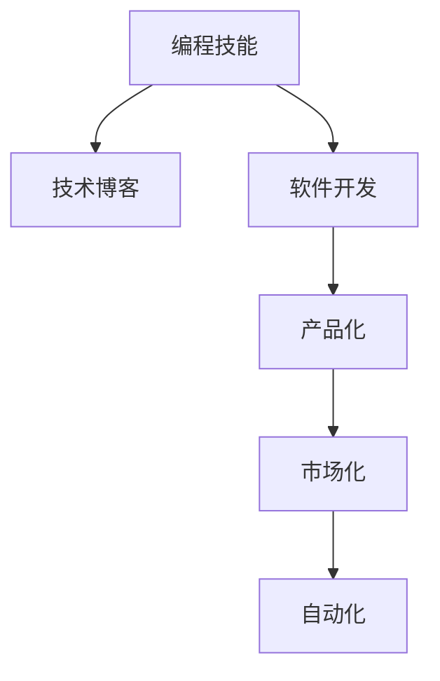

                 

# 如何将编程技能转化为被动收入

> 关键词：编程技能, 被动收入, 技术博客, 软件开发, 产品化

## 1. 背景介绍

### 1.1 问题由来
在信息爆炸的时代，如何通过编程技能获得持续的收入流，是许多技术人员关注的话题。与传统的工作方式不同，被动收入指的是无需持续投入时间和精力，即可持续获得的收入。这种模式在互联网时代尤为普遍，尤其是对于技术开发者而言，他们可以通过开发产品、服务、工具等多种形式，将编程技能转化为长期的经济收益。

### 1.2 问题核心关键点
要实现从编程技能到被动收入的转化，需关注以下核心关键点：
- **编程技能**：编程技能是基础，意味着需要有扎实的编程基础，掌握多种编程语言和开发工具。
- **产品化**：开发出有价值的产品或服务，解决实际问题或满足用户需求。
- **市场化**：将产品推向市场，获得用户的认可和付费。
- **自动化**：设计自动化的商业模式，如订阅制、广告分成、技术咨询等，无需持续的运营投入。
- **持续学习**：随着技术发展，需不断学习新技术，调整和优化产品，保持竞争力。

## 2. 核心概念与联系

### 2.1 核心概念概述

为了更好地理解如何通过编程技能转化为被动收入，下面将介绍几个关键概念：

- **编程技能**：指开发软件、系统或应用程序所需的知识、技能和能力，包括算法、数据结构、软件工程、用户体验设计等。
- **被动收入**：指无需主动投入时间或精力，通过资产或产品获得持续的现金流。
- **技术博客**：通过分享编程知识和经验，建立品牌和社区，吸引流量和广告收入。
- **软件开发**：涵盖应用程序、网站、移动应用等的开发过程。
- **产品化**：将技术想法转化为实际的产品或服务。
- **市场化**：将产品推向市场，通过各种渠道获得用户和收入。
- **自动化**：设计无需持续运营的商业模式，如订阅制、广告分成、技术咨询等。

### 2.2 核心概念原理和架构的 Mermaid 流程图



这个流程图展示了这个转化过程的核心环节：编程技能通过技术博客和软件开发逐步积累用户和品牌价值，然后通过产品化和市场化实现商业化，最终通过自动化商业模式持续获得被动收入。

## 3. 核心算法原理 & 具体操作步骤

### 3.1 算法原理概述

将编程技能转化为被动收入的过程，可以视为一种算法优化过程，目标是通过不断调整和优化算法，最大化被动收入的获取。算法原理主要包括以下几个步骤：

1. **输入**：编程技能、市场需求、资源（如时间、资金、技术团队）。
2. **处理**：根据市场需求，确定产品或服务方向，使用编程技能进行开发。
3. **输出**：产品或服务，通过市场化获得用户反馈和收入。
4. **反馈**：根据用户反馈，调整产品或服务，优化算法。
5. **重复**：持续迭代优化，提升产品价值和收入。

### 3.2 算法步骤详解

下面是将编程技能转化为被动收入的具体操作步骤：

**Step 1: 识别市场需求**
- 调研市场，找到用户未被满足的需求。
- 分析用户痛点，确定产品或服务的方向。

**Step 2: 构建最小可行产品(MVP)**
- 快速开发一个能够满足核心需求的最简产品。
- 获取早期用户的反馈，验证市场需求。

**Step 3: 市场推广与用户获取**
- 利用社交媒体、技术博客、开发者社区等渠道推广产品。
- 优化用户体验，吸引更多用户。

**Step 4: 产品迭代与优化**
- 根据用户反馈，不断优化产品功能和服务。
- 引入新技术，提升产品竞争力。

**Step 5: 实现自动化商业模式**
- 设计无需持续运营的商业模式，如订阅制、广告分成、技术咨询等。
- 通过自动化工具，降低运营成本。

### 3.3 算法优缺点

将编程技能转化为被动收入的算法有以下优点：

- **效率高**：无需不断投入时间和精力，可以持续获得收入。
- **可扩展性强**：可以不断优化算法，提升产品价值和收入。
- **风险低**：有稳定的商业模式，降低失败风险。

但同时也有以下缺点：

- **前期投入大**：产品开发和市场推广需要一定的资金和时间。
- **技术变化快**：需要持续学习新技术，保持竞争力。
- **市场不确定性**：市场需求和竞争环境可能发生变化，需要灵活应对。

### 3.4 算法应用领域

将编程技能转化为被动收入的算法在多个领域有广泛应用，包括：

- **软件开发**：开发应用程序、网站、移动应用等，通过销售软件获得收入。
- **技术咨询**：提供技术方案、开发外包服务，获取咨询费。
- **技术培训**：开发在线课程、书籍，获得订阅费或销售收入。
- **工具和插件**：开发编程工具、插件，通过付费下载或订阅获取收入。
- **广告分成**：开发网站或应用，通过广告分成获得收入。

## 4. 数学模型和公式 & 详细讲解 & 举例说明

### 4.1 数学模型构建

为更系统地理解这个过程，我们可以通过数学模型进行建模：

设 $X$ 为市场需求，$S$ 为编程技能，$P$ 为产品或服务，$M$ 为市场推广费用，$R$ 为收入。模型可以表示为：

$$ R = f(S, X, P, M) $$

其中 $f$ 为函数，表示在给定市场需求、编程技能、产品和市场推广费用的情况下，收入的计算方法。

### 4.2 公式推导过程

以软件开发为例，推导收入与编程技能的关系：

设 $T$ 为开发时间，$C$ 为开发成本，$U$ 为用户数，$P$ 为单价，$R$ 为总收入：

$$ R = U \times P $$

根据需求分析，$U$ 与 $T$、$C$、$S$ 相关，$P$ 与市场定位和竞争环境相关。

### 4.3 案例分析与讲解

假设市场需求稳定，开发时间为6个月，开发成本为50万元，用户数为10万人，单价为5元：

$$ U = f(T, C, S) $$

$$ R = 10 \times 10^4 \times 5 = 50 \times 10^4 $$

根据市场需求，调整 $T$、$C$、$S$，优化产品功能和服务，提升用户满意度和用户数。

## 5. 项目实践：代码实例和详细解释说明

### 5.1 开发环境搭建

首先，需要搭建一个开发环境：

1. **安装开发工具**：如IDE（Integrated Development Environment），如IntelliJ IDEA、Visual Studio Code等。
2. **配置版本控制**：如Git，用于代码管理和团队协作。
3. **配置项目管理工具**：如Jira、Trello等，用于任务管理和进度跟踪。
4. **配置自动化测试工具**：如Junit、Selenium等，确保代码质量。
5. **配置部署工具**：如Docker、Kubernetes等，确保代码的可靠部署和运行。

### 5.2 源代码详细实现

以下是一个简单的技术博客平台开发项目示例：

```python
# 搭建技术博客平台
from flask import Flask, render_template
app = Flask(__name__)

@app.route('/')
def index():
    return render_template('index.html')

@app.route('/about')
def about():
    return render_template('about.html')

@app.route('/contact')
def contact():
    return render_template('contact.html')

if __name__ == '__main__':
    app.run(debug=True)
```

### 5.3 代码解读与分析

上述代码实现了一个简单的技术博客平台，包括首页、关于、联系三个页面：

- **Flask**：一个轻量级的Web框架，用于搭建平台。
- **模板**：使用HTML和Python模板语法，实现动态内容渲染。
- **路由**：定义了网站的页面和请求处理函数。
- **运行**：启动Web服务，监听请求。

### 5.4 运行结果展示

运行上述代码，访问 `http://127.0.0.1:5000`，可以看到搭建好的技术博客平台。

## 6. 实际应用场景

### 6.1 技术博客平台

技术博客平台是将编程技能转化为被动收入的典型应用场景：

- **内容创作**：持续发布原创技术文章，建立品牌和影响力。
- **广告收入**：通过Google AdSense等广告平台，获得流量广告分成。
- **付费订阅**：提供高级文章、电子书、在线课程等，收取订阅费。

### 6.2 应用程序开发

应用程序开发是将编程技能转化为被动收入的重要手段：

- **APP开发**：开发具有实用价值的应用程序，获取用户下载和付费。
- **API服务**：提供定制化的API服务，获取技术咨询和开发费。
- **工具和插件**：开发编程工具和插件，通过付费下载或订阅获取收入。

### 6.3 广告收入

广告收入是常见的被动收入来源：

- **网站广告**：通过自有网站或应用，接入Google AdSense等广告平台，获得流量广告分成。
- **原生广告**：在自有平台上投放原生广告，获取广告分成。

### 6.4 技术咨询

技术咨询是通过提供技术方案和开发服务获取收入：

- **技术方案**：为企业或个人提供技术咨询，收取咨询费。
- **开发外包**：提供开发外包服务，获取项目开发费。

## 7. 工具和资源推荐

### 7.1 学习资源推荐

以下是一些推荐的学习资源，可以帮助技术开发者掌握将编程技能转化为被动收入的实践技巧：

1. **《程序员如何从零开始赚钱》**：一本系统介绍如何将编程技能转化为被动收入的书籍，适合初学者。
2. **《技术博客入门》**：一门系统介绍技术博客创建和运营的课程，涵盖内容创作、SEO优化、广告收入等。
3. **《应用程序开发实战》**：一门系统介绍应用程序开发的课程，涵盖前端、后端、数据库等技术栈。
4. **《广告收入优化》**：一门系统介绍如何通过广告收入获取被动收入的课程，涵盖广告平台选择、投放策略等。
5. **《技术咨询实战》**：一门系统介绍技术咨询的课程，涵盖项目需求分析、解决方案设计、项目管理等。

### 7.2 开发工具推荐

以下是一些推荐的开发工具，可以帮助技术开发者更高效地实现编程技能到被动收入的转化：

1. **IDE**：如IntelliJ IDEA、Visual Studio Code等，提供强大的代码编辑和调试功能。
2. **版本控制**：如Git，用于代码管理和团队协作。
3. **项目管理工具**：如Jira、Trello等，用于任务管理和进度跟踪。
4. **自动化测试工具**：如Junit、Selenium等，确保代码质量。
5. **部署工具**：如Docker、Kubernetes等，确保代码的可靠部署和运行。

### 7.3 相关论文推荐

以下是几篇推荐的相关论文，可以帮助技术开发者更深入地理解如何将编程技能转化为被动收入：

1. **《技术博客的商业价值》**：研究技术博客如何通过内容创作、广告收入和付费订阅实现商业化。
2. **《应用程序开发的市场策略》**：研究应用程序开发的市场策略和商业模式。
3. **《广告收入的优化方法》**：研究如何通过广告收入获取被动收入的方法和策略。
4. **《技术咨询的实践指南》**：研究技术咨询的实践方法和案例。

## 8. 总结：未来发展趋势与挑战

### 8.1 总结

本文对如何通过编程技能转化为被动收入进行了系统介绍，包括核心概念、算法原理、具体操作步骤、数学模型等。通过本文的系统梳理，可以看到，将编程技能转化为被动收入是一个系统性工程，需要持续学习、优化和迭代。

### 8.2 未来发展趋势

未来，将编程技能转化为被动收入的发展趋势包括：

1. **自动化程度提升**：通过自动化工具和平台，简化开发和运营过程，降低人工成本。
2. **数据驱动决策**：通过数据分析和人工智能，优化产品设计和市场推广策略。
3. **多渠道收入模式**：结合多种收入模式，如广告、订阅、技术咨询等，最大化收入来源。
4. **全球化扩展**：将产品和服务扩展到国际市场，获取更广泛的用户和收入。
5. **技术融合**：结合新兴技术如区块链、AI等，开发更具创新性的产品和服务。

### 8.3 面临的挑战

尽管将编程技能转化为被动收入有诸多优势，但也面临以下挑战：

1. **市场需求变化**：市场需求和技术趋势不断变化，需要持续学习和调整。
2. **市场竞争激烈**：市场竞争激烈，需要不断创新和优化产品。
3. **技术更新快**：新技术不断涌现，需要持续学习新技术和工具。
4. **用户需求多样**：用户需求多样，需要灵活调整产品和服务。
5. **运营成本高**：开发和运营初期成本较高，需要谨慎规划和资金准备。

### 8.4 研究展望

未来的研究应在以下方面进行突破：

1. **模型优化**：进一步优化算法模型，提升产品价值和收入。
2. **自动化技术**：研究自动化技术，如机器学习、自然语言处理等，提升运营效率。
3. **跨领域融合**：结合其他领域的技术，如AI、大数据、区块链等，开发更具创新性的产品和服务。
4. **用户体验优化**：通过用户反馈和数据分析，持续优化用户体验和满意度。
5. **多渠道拓展**：结合多种渠道，如广告、订阅、技术咨询等，最大化收入来源。

## 9. 附录：常见问题与解答

**Q1：编程技能如何转化为被动收入？**

A: 通过开发有价值的产品或服务，如技术博客、应用程序、工具和插件等，并通过市场推广和自动化商业模式获取收入。

**Q2：如何降低前期投入？**

A: 利用开源工具和平台，简化开发过程，减少开发成本。同时，采用众包和开源社区的力量，分担开发和运营成本。

**Q3：如何持续优化产品？**

A: 通过用户反馈和数据分析，不断优化产品功能和用户体验，提升产品竞争力。

**Q4：如何应对市场需求变化？**

A: 持续学习新技术和市场趋势，灵活调整产品方向和市场策略。

**Q5：如何提升自动化程度？**

A: 使用自动化工具和平台，如持续集成和部署工具、自动化测试工具等，减少人工操作和运营成本。

作者：禅与计算机程序设计艺术 / Zen and the Art of Computer Programming

