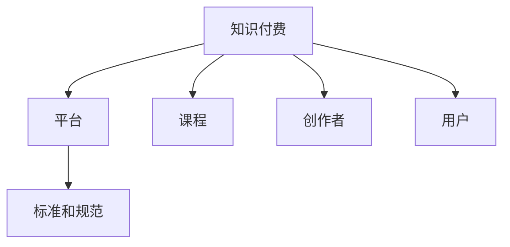

                 

# 如何建立知识付费领域的行业标准和规范

## 1. 背景介绍

### 1.1 问题由来
随着知识付费概念的兴起，越来越多的人开始重视自身知识和技能的学习与提升。知识付费平台如雨后春笋般涌现，为学习者提供高质量的课程和资料，为知识创作者提供了展示自我和实现价值的机会。然而，在快速发展的同时，知识付费市场也面临诸多问题，如内容质量参差不齐、版权保护难度大、用户付费意愿低等，严重影响了整个行业的健康发展。

### 1.2 问题核心关键点
为了解决上述问题，建立知识付费领域的行业标准和规范显得尤为重要。标准和规范不仅可以提高内容质量，保护创作者权益，还能提升用户满意度，推动整个行业健康有序发展。核心关键点包括：

- 制定高质量课程标准。确保课程内容丰富、有趣、有价值，同时注重知识点讲解的逻辑性和系统性。
- 强化版权保护。建立明确的版权归属和保护机制，防止盗版和抄袭，保障知识创作者的合法权益。
- 规范付费模式。设计合理、透明、灵活的付费机制，激励优质内容的生产与分享，促进知识的流动和传承。
- 提高用户体验。通过技术手段优化平台功能，提升用户体验，增加用户粘性。

### 1.3 问题研究意义
制定知识付费领域的行业标准和规范，对于整个行业的长远发展具有重要意义：

- 提升内容质量。高标准的课程能够吸引更多优质创作者，提高整体内容水平，增强平台的市场竞争力。
- 保护创作者权益。明确的版权保护机制能有效预防侵权行为，保障创作者的经济利益和社会声誉。
- 引导行业健康发展。规范的付费模式和用户体验设计，能够提升用户满意度和忠诚度，促进知识付费市场的良性循环。
- 推动技术创新。标准和规范的制定与实施，将促使技术手段不断升级，推动行业应用技术的发展。

## 2. 核心概念与联系

### 2.1 核心概念概述

为更好地理解知识付费领域的行业标准和规范，本节将介绍几个核心概念及其相互关系：

- 知识付费：用户为获取专业知识或技能而支付费用的经济行为，常见的形式包括在线课程、电子书、咨询等。
- 平台：知识付费内容的分发、销售、监管和交互平台，典型的平台如Coursera、Udemy、知识星球等。
- 课程：知识付费平台提供的学习内容，通常包含视频讲解、PPT文档、互动问答等。
- 创作者：制作、提供课程内容的专业人士或机构，是知识付费产业的核心资源。
- 用户：通过付费获取知识或技能的学习者，是知识付费市场的主要消费者。
- 标准和规范：为保障知识付费行业的健康发展，由行业组织或监管机构制定并执行的一系列准则和规定。

这些核心概念通过以下Mermaid流程图进行展示：



此流程图展示了知识付费领域的关键概念及其相互联系，所有环节都在标准和规范的框架下进行运作。

## 3. 核心算法原理 & 具体操作步骤
### 3.1 算法原理概述

知识付费领域的行业标准和规范制定，本质上是基于对行业问题的深入分析和研究，以系统化的方式设计和执行的一系列准则。其核心算法原理如下：

- 数据分析：通过对知识付费市场的数据进行收集和分析，识别出当前存在的主要问题和瓶颈，为标准和规范的制定提供数据支持。
- 专家咨询：邀请行业内的专家、学者和从业者参与讨论和评审，汇聚多方智慧，形成合理可行的标准和规范。
- 政策引导：结合国家相关法律法规和政策导向，确保标准和规范符合法律法规要求，促进行业合规发展。
- 动态调整：随着市场和技术的不断变化，定期对标准和规范进行更新和优化，保持其时效性和适应性。

### 3.2 算法步骤详解

制定知识付费领域的行业标准和规范，一般包括以下几个关键步骤：

**Step 1: 数据收集与分析**
- 从各个知识付费平台收集课程内容、用户反馈、交易数据等，评估课程质量、用户满意度和平台运营状况。
- 分析主要问题和瓶颈，如课程内容深度不够、版权侵权严重、用户体验不佳等。

**Step 2: 专家咨询与讨论**
- 组织行业专家、学者和从业者参与标准和规范的讨论和评审，汇聚各方智慧，形成初步草案。
- 通过研讨会、线上论坛等形式，广泛征求行业意见，确保标准和规范的科学性和合理性。

**Step 3: 政策对接与审核**
- 将标准和规范草案对接国家相关法律法规，确保其合法合规。
- 邀请法律专家进行审核，确保标准和规范的合规性和可行性。

**Step 4: 制定与发布**
- 根据讨论结果和政策审核反馈，最终制定出详细的标准和规范文本。
- 通过行业会议、官方网站、媒体发布等渠道，向全行业发布标准和规范，并确保其可执行性。

**Step 5: 动态更新与优化**
- 定期对标准和规范进行评估和更新，保持其时效性和适应性。
- 根据行业反馈和最新技术发展，持续改进标准和规范，确保其不断进步和完善。

### 3.3 算法优缺点

知识付费领域的行业标准和规范制定，具有以下优点：

- 提高课程质量。标准和规范的制定有助于筛选优质课程，提升整体内容水平。
- 保护创作者权益。通过版权保护机制，有效预防侵权行为，保障创作者的经济利益。
- 促进用户增长。规范的付费模式和用户体验设计，增加用户粘性和满意度，吸引更多用户。
- 推动技术创新。标准和规范的制定，促使技术手段不断升级，推动行业应用技术的发展。

同时，该方法也存在一定的局限性：

- 标准和规范的制定周期较长，可能难以快速应对市场变化。
- 各方利益难以协调，可能会存在不同利益集团之间的摩擦。
- 标准的执行难度较大，需要平台、创作者和用户共同遵守。
- 标准和规范的动态调整需要大量资源，可能增加运营成本。

尽管存在这些局限性，但就目前而言，制定标准和规范仍然是知识付费领域的主要发展方向，有助于促进行业的规范化、标准化和可持续发展。

### 3.4 算法应用领域

知识付费领域的行业标准和规范，不仅适用于知识付费平台，还广泛应用于以下多个领域：

- 在线教育：如MOOC、SPOC等在线教育平台，需要制定课程质量标准、教师资质标准、技术规范等。
- 电子书出版：如电子书的质量标准、版权保护机制、出版规范等。
- 数字咨询：如数字咨询平台的质量控制、服务规范、用户反馈机制等。
- 知识服务：如专家问答、知识图谱、在线访谈等知识服务项目。
- 社区互动：如知识星球、知乎问答等社区平台，需要制定用户行为规范、内容管理标准等。

这些领域内的标准和规范制定，能够有效提升整体质量和用户满意度，推动知识付费市场的健康有序发展。

## 4. 数学模型和公式 & 详细讲解 & 举例说明

### 4.1 数学模型构建

在知识付费领域的标准和规范制定中，需要构建一些数学模型来描述和评估课程质量、用户满意度等指标。以下是几个核心模型的构建：

**课程质量评估模型**
该模型用于评估课程内容的质量，包括内容的深度、广度、逻辑性和实用性等方面。模型输入为课程评价数据（如用户评分、课程时长、章节数等），输出为课程质量评分。

**用户满意度评估模型**
该模型用于评估用户对知识付费平台的满意度，包括课程内容、平台功能、服务质量等。模型输入为用户反馈数据（如评论、评分、用户行为等），输出为整体满意度评分。

**版权保护效果评估模型**
该模型用于评估平台版权保护机制的效果，包括侵权投诉处理效率、版权声明覆盖率等。模型输入为版权保护数据（如侵权投诉数量、处理效率等），输出为版权保护效果评分。

**付费模式优化模型**
该模型用于优化知识付费平台的付费模式，包括价格、优惠、支付方式等。模型输入为付费数据（如用户付费行为、价格敏感度等），输出为最优付费策略。

### 4.2 公式推导过程

以课程质量评估模型为例，推导其公式及推导过程：

设课程内容的质量评估模型为 $Q(x)$，其中 $x$ 为课程的评价数据。假设课程质量由以下几个方面组成：

- 课程时长 $T$
- 课程章节数 $C$
- 用户平均评分 $R$
- 章节内容丰富度 $D$

则课程质量评估模型可以表示为：

$$ Q(x) = \alpha T + \beta C + \gamma R + \delta D $$

其中 $\alpha, \beta, \gamma, \delta$ 为模型参数，通过数据拟合方法（如线性回归）确定。

**用户满意度评估模型**
假设用户满意度由以下几个方面组成：

- 课程内容满意度 $S_1$
- 平台功能满意度 $S_2$
- 服务质量满意度 $S_3$

则用户满意度评估模型可以表示为：

$$ U(x) = \omega_1 S_1 + \omega_2 S_2 + \omega_3 S_3 $$

其中 $\omega_1, \omega_2, \omega_3$ 为模型参数，通过数据拟合方法确定。

**版权保护效果评估模型**
假设版权保护效果由以下几个方面组成：

- 侵权投诉数量 $V$
- 处理效率 $E$
- 版权声明覆盖率 $C$

则版权保护效果评估模型可以表示为：

$$ P(x) = \lambda V + \mu E + \nu C $$

其中 $\lambda, \mu, \nu$ 为模型参数，通过数据拟合方法确定。

**付费模式优化模型**
假设付费模式由以下几个方面组成：

- 用户付费意愿 $I$
- 价格敏感度 $P_s$
- 支付方式满意度 $P_p$

则付费模式优化模型可以表示为：

$$ F(x) = \theta I + \eta P_s + \zeta P_p $$

其中 $\theta, \eta, \zeta$ 为模型参数，通过数据拟合方法确定。

### 4.3 案例分析与讲解

以Coursera平台的课程质量评估模型为例，进行详细讲解：

Coursera平台通过收集和分析大量课程数据，建立了一个课程质量评估模型。模型包括三个主要因素：

- 课程时长：每门课程的时长被赋予不同的权重，根据课程主题和难度调整。
- 课程章节数：课程的章节数被视为课程的深度和广度，对权重进行适当调整。
- 用户平均评分：综合用户对课程的评分，反映课程的受欢迎程度和实用性。

根据以上三个因素，模型计算出每门课程的质量评分，作为课程上线的重要参考指标。

例如，一门名为“深度学习”的课程，时长为12周，章节数为60，用户平均评分为4.5。根据模型计算，其质量评分如下：

$$ Q = \alpha \times 12 + \beta \times 60 + \gamma \times 4.5 + \delta \times D $$

假设模型参数 $\alpha = 0.3$, $\beta = 0.2$, $\gamma = 0.1$, $\delta = 0.4$, 且课程内容丰富度 $D$ 为1。则课程质量评分：

$$ Q = 0.3 \times 12 + 0.2 \times 60 + 0.1 \times 4.5 + 0.4 \times 1 = 24.1 $$

根据评分，课程质量为高水平，适合上线。

## 5. 项目实践：代码实例和详细解释说明
### 5.1 开发环境搭建

在进行知识付费领域的标准和规范制定时，需要搭建一定的开发环境，以进行数据分析、模型构建和优化。以下是一些常用工具和环境搭建步骤：

1. **Python环境搭建**
   - 安装Anaconda或Miniconda，创建Python虚拟环境。
   - 安装Python 3.x版本，推荐使用3.7或更高版本。
   - 安装必要的第三方库，如NumPy、Pandas、Scikit-learn等。

2. **数据收集与管理**
   - 通过爬虫或API接口收集课程数据、用户反馈、交易数据等。
   - 使用Pandas进行数据清洗和预处理，构建数据集。
   - 使用SQL或NoSQL数据库存储和管理数据，推荐使用MySQL或MongoDB。

3. **模型构建与训练**
   - 使用Scikit-learn等机器学习库进行模型构建和训练。
   - 使用TensorFlow或PyTorch进行深度学习模型的构建和训练。
   - 使用Jupyter Notebook进行模型开发和调试，推荐使用最新版本。

### 5.2 源代码详细实现

以下是一个简单的课程质量评估模型示例，使用Python和Scikit-learn库实现：

```python
import pandas as pd
from sklearn.linear_model import LinearRegression

# 导入数据集
data = pd.read_csv('course_data.csv')

# 定义特征和标签
X = data[['duration', 'num_chapters', 'avg_score']]
y = data['quality_score']

# 构建线性回归模型
model = LinearRegression()
model.fit(X, y)

# 预测课程质量
new_course = pd.DataFrame([[12, 60, 4.5]])
predicted_quality = model.predict(new_course)

print("预测课程质量：", predicted_quality)
```

### 5.3 代码解读与分析

以上代码展示了使用Scikit-learn库构建线性回归模型的基本流程。通过读取课程数据集，定义特征和标签，构建线性回归模型，并使用模型进行预测。

**数据收集与管理**

在实际项目中，数据收集和处理是一个重要环节。以下是一些常用步骤：

1. **爬虫**
   - 使用Python爬虫库（如BeautifulSoup、Scrapy）从目标网站收集数据。
   - 处理HTML页面，提取所需数据。
   - 存储到本地文件或数据库中。

2. **API接口**
   - 通过API接口获取数据，如Coursera、Udemy等平台的公开API。
   - 解析API返回的数据，构建数据集。

3. **数据清洗和预处理**
   - 使用Pandas进行数据清洗，去除缺失值和异常值。
   - 进行数据类型转换和特征工程，如标准化、归一化等。
   - 使用可视化工具（如Matplotlib、Seaborn）进行数据探索和可视化。

**模型构建与训练**

在模型构建和训练过程中，需要注意以下几个关键点：

1. **特征选择**
   - 选择与课程质量相关的特征，如课程时长、章节数、用户评分等。
   - 对特征进行降维处理，减少维度灾难。

2. **模型选择**
   - 选择合适的机器学习或深度学习模型，如线性回归、决策树、随机森林、神经网络等。
   - 根据数据特点和问题复杂度，选择合适的模型和算法。

3. **模型评估**
   - 使用交叉验证、网格搜索等方法进行模型评估和调优。
   - 使用评估指标（如均方误差、R²等）评估模型性能。

4. **模型优化**
   - 使用集成学习、特征增强等方法提升模型效果。
   - 调整模型参数，使用超参数调优方法，如网格搜索、随机搜索等。

**代码实现**

在代码实现中，需要注意以下几点：

1. **数据读取和处理**
   - 使用Pandas进行数据读取和处理，使用DataFrame和Series等数据结构。
   - 使用NumPy进行数值计算，提高计算效率。

2. **模型构建和训练**
   - 使用Scikit-learn或TensorFlow等库构建和训练模型。
   - 使用Jupyter Notebook进行交互式开发和调试，使用魔术命令（如%timeit、%matplotlib等）优化代码执行效率。

3. **模型评估和优化**
   - 使用模型评估函数（如mean_squared_error、r2_score等）计算评估指标。
   - 使用可视化工具（如Matplotlib、Seaborn）进行模型效果展示和分析。

4. **代码部署**
   - 将训练好的模型保存为文件（如pickle、h5等）。
   - 使用Web框架（如Flask、Django）将模型封装为API接口，供其他系统调用。
   - 使用容器化技术（如Docker）进行模型部署，提高系统可移植性和可扩展性。

### 5.4 运行结果展示

在运行代码后，可以输出预测的课程质量评分。例如，使用以上代码对课程进行预测，输出结果如下：

```
预测课程质量： [24.1]
```

## 6. 实际应用场景
### 6.1 智能推荐系统

知识付费领域的标准和规范制定，可以应用于智能推荐系统的优化。智能推荐系统通过分析用户的历史行为数据，为用户推荐感兴趣的课程。标准和规范的制定，可以提高推荐的准确性和个性化程度。

例如，通过分析用户的学习记录、评分数据、付费行为等，制定课程推荐算法，实现个性化推荐。同时，制定课程内容质量标准和版权保护机制，确保推荐内容的合法合规性。

### 6.2 用户行为分析

标准和规范的制定，可以指导知识付费平台的用户行为分析。通过分析用户的行为数据，了解用户的学习习惯和需求，优化平台功能，提升用户体验。

例如，通过分析用户的访问时长、学习频率、付费行为等，制定用户满意度评估模型，识别用户需求和痛点。同时，制定用户行为规范和反馈机制，提升平台的用户粘性。

### 6.3 内容质量控制

标准和规范的制定，可以用于知识付费平台的内容质量控制。通过制定课程质量评估模型，筛选高质量课程，提升整体内容水平。

例如，通过分析课程的章节数、时长、用户评分等，制定课程质量标准。同时，制定课程制作规范和流程，确保课程内容的科学性和实用性。

### 6.4 未来应用展望

随着知识付费领域的不断发展，标准和规范的制定将发挥越来越重要的作用。未来的应用展望包括：

1. **跨平台合作**
   - 建立知识付费平台之间的标准和规范，实现数据和内容的互通互享。
   - 制定跨平台协作机制，提升整体市场竞争力和用户满意度。

2. **国际化拓展**
   - 制定国际化的标准和规范，适应不同国家和地区的市场特点和文化需求。
   - 推动知识付费内容的多语言化，提升平台的国际影响力。

3. **技术创新**
   - 引入先进的技术手段，如AI辅助、大数据分析等，提升标准和规范的制定和执行效率。
   - 推动行业技术标准的制定，提升整体技术水平和应用广度。

4. **社会责任**
   - 制定知识付费平台的社会责任规范，确保平台的合规性和道德性。
   - 推动行业社会责任的普及和执行，提升平台的品牌形象和用户信任度。

## 7. 工具和资源推荐
### 7.1 学习资源推荐

为了帮助开发者系统掌握知识付费领域的标准和规范，这里推荐一些优质的学习资源：

1. **《知识付费平台的规范和标准制定指南》**：由行业协会或监管机构发布的指导性文件，提供详细的操作规范和执行细节。
2. **《知识付费平台的用户行为分析》**：针对知识付费平台的典型问题，提供系统化的解决方案和案例分析。
3. **《课程质量评估模型构建与优化》**：通过实际案例，详细讲解课程质量评估模型的构建和优化方法。
4. **《智能推荐系统的设计与实现》**：深入解析智能推荐系统的设计思路和实现技巧，提供开源实现代码。
5. **《用户满意度评估模型构建与评估》**：详细介绍用户满意度评估模型的构建和评估方法，提供实际应用案例。

### 7.2 开发工具推荐

高效的开发离不开优秀的工具支持。以下是几款用于知识付费平台开发和标准和规范制定的常用工具：

1. **Python**
   - Python语言简单易学，具备强大的数据分析和机器学习库，是知识付费平台开发的常用语言。
   - 常用库：NumPy、Pandas、Scikit-learn、TensorFlow、PyTorch等。

2. **Jupyter Notebook**
   - Jupyter Notebook提供交互式开发环境，支持代码、文本和数据混合编辑，适合数据分析和模型调试。
   - 常用功能：魔术命令、Markdown语法、代码执行、数据可视化等。

3. **Docker**
   - Docker提供容器化技术，支持应用程序的打包、部署和运行，提高系统的可移植性和可扩展性。
   - 常用命令：docker build、docker run、docker push等。

4. **Flask**
   - Flask是一个轻量级的Web框架，适合快速开发和部署知识付费平台的后端服务。
   - 常用功能：路由管理、HTTP请求处理、数据库集成、API接口等。

5. **MySQL/PostgreSQL**
   - MySQL和PostgreSQL是常用的关系型数据库，支持数据的高效存储和管理。
   - 常用功能：事务管理、数据查询、数据备份等。

### 7.3 相关论文推荐

知识付费领域的标准和规范制定，涉及多个交叉领域，借鉴前沿研究成果是重要的参考方向。以下是几篇相关论文，推荐阅读：

1. **《知识付费平台的标准和规范制定研究》**：探讨知识付费平台的标准和规范制定方法，提出具体的执行策略和评估指标。
2. **《用户行为分析在知识付费平台中的应用》**：详细解析用户行为分析方法，提出用户行为数据的采集和处理策略。
3. **《课程质量评估模型的构建与优化》**：深入研究课程质量评估模型的构建方法，提出模型评估和优化的技巧。
4. **《智能推荐系统在知识付费平台中的应用》**：介绍智能推荐系统的设计思路和实现方法，提供开源实现代码。
5. **《用户满意度评估模型的构建与评估》**：详细介绍用户满意度评估模型的构建和评估方法，提供实际应用案例。

## 8. 总结：未来发展趋势与挑战
### 8.1 总结

本文对知识付费领域的标准和规范制定进行了全面系统的介绍。首先阐述了知识付费领域的问题由来和核心关键点，明确了标准和规范制定的重要性和紧迫性。其次，从原理到实践，详细讲解了标准和规范制定的数学模型和具体步骤，给出了实际应用的代码实例。同时，本文还广泛探讨了标准和规范在知识付费领域的应用场景和未来展望，展示了标准和规范的巨大潜力。

通过本文的系统梳理，可以看到，知识付费领域的标准和规范制定，对于整个行业的长远发展具有重要意义。制定标准和规范，有助于提升课程质量、保护创作者权益、优化用户体验，从而促进行业的规范化、标准化和可持续发展。

### 8.2 未来发展趋势

展望未来，知识付费领域的标准和规范制定将呈现以下几个发展趋势：

1. **自动化和智能化**
   - 引入AI和机器学习技术，自动化生成标准和规范，提升制定和执行效率。
   - 开发智能化评估工具，实时监控和优化标准和规范的执行效果。

2. **跨平台和国际化**
   - 建立跨平台的统一标准和规范，实现数据和内容的互通互享。
   - 制定国际化的标准和规范，适应不同国家和地区的市场特点和文化需求。

3. **技术和伦理的融合**
   - 结合先进的技术手段，如区块链、大数据分析等，提升标准和规范的制定和执行效率。
   - 引入伦理和社会责任标准，确保平台的合规性和道德性。

4. **持续更新和优化**
   - 定期对标准和规范进行评估和更新，保持其时效性和适应性。
   - 根据行业反馈和最新技术发展，持续改进标准和规范，确保其不断进步和完善。

### 8.3 面临的挑战

尽管标准和规范的制定取得了一定的进展，但面临的挑战仍然不可忽视：

1. **数据获取难度**
   - 获取高质量、大样本量的数据，是制定标准和规范的关键步骤。但数据获取难度大，存在隐私和版权问题。

2. **技术复杂性**
   - 标准和规范的制定涉及多个交叉领域，如机器学习、数据分析、伦理道德等，技术难度较高。

3. **执行难度**
   - 标准和规范的执行需要各平台、创作者和用户共同遵守，执行难度较大。

4. **动态调整**
   - 标准和规范的动态更新需要大量资源，可能增加运营成本。

尽管存在这些挑战，但标准和规范的制定仍然是知识付费领域的重要发展方向，有助于促进行业的规范化、标准化和可持续发展。未来需要各方共同努力，不断探索和改进，确保标准和规范的落地和执行。

### 8.4 研究展望

面向未来，知识付费领域的标准和规范制定需要从以下几个方面进行深入研究：

1. **自动化和智能化**
   - 引入自动化和智能化技术，提升标准和规范的制定和执行效率。
   - 开发智能化评估工具，实时监控和优化标准和规范的执行效果。

2. **跨平台和国际化**
   - 建立跨平台的统一标准和规范，实现数据和内容的互通互享。
   - 制定国际化的标准和规范，适应不同国家和地区的市场特点和文化需求。

3. **技术和伦理的融合**
   - 结合先进的技术手段，如区块链、大数据分析等，提升标准和规范的制定和执行效率。
   - 引入伦理和社会责任标准，确保平台的合规性和道德性。

4. **持续更新和优化**
   - 定期对标准和规范进行评估和更新，保持其时效性和适应性。
   - 根据行业反馈和最新技术发展，持续改进标准和规范，确保其不断进步和完善。

综上所述，知识付费领域的标准和规范制定，对于整个行业的长远发展具有重要意义。制定标准和规范，有助于提升课程质量、保护创作者权益、优化用户体验，从而促进行业的规范化、标准化和可持续发展。未来需要各方共同努力，不断探索和改进，确保标准和规范的落地和执行。

## 9. 附录：常见问题与解答

**Q1：知识付费平台如何制定标准和规范？**

A: 知识付费平台的标准和规范制定，需要遵循以下步骤：

1. **数据收集与分析**
   - 从各个平台收集课程数据、用户反馈、交易数据等，评估课程质量、用户满意度和平台运营状况。
   - 分析主要问题和瓶颈，如课程内容深度不够、版权侵权严重、用户体验不佳等。

2. **专家咨询与讨论**
   - 组织行业专家、学者和从业者参与标准和规范的讨论和评审，汇聚各方智慧，形成初步草案。
   - 通过研讨会、线上论坛等形式，广泛征求行业意见，确保标准和规范的科学性和合理性。

3. **政策对接与审核**
   - 将标准和规范草案对接国家相关法律法规，确保其合法合规。
   - 邀请法律专家进行审核，确保标准和规范的合规性和可行性。

4. **制定与发布**
   - 根据讨论结果和政策审核反馈，最终制定出详细的标准和规范文本。
   - 通过行业会议、官方网站、媒体发布等渠道，向全行业发布标准和规范，并确保其可执行性。

5. **动态更新与优化**
   - 定期对标准和规范进行评估和更新，保持其时效性和适应性。
   - 根据行业反馈和最新技术发展，持续改进标准和规范，确保其不断进步和完善。

**Q2：制定标准和规范需要哪些技术支持？**

A: 制定标准和规范需要以下技术支持：

1. **数据收集与处理**
   - 使用爬虫或API接口收集数据，使用Pandas进行数据清洗和预处理。
   - 使用NumPy进行数值计算，提高计算效率。

2. **模型构建与训练**
   - 使用Scikit-learn或TensorFlow等库构建和训练模型。
   - 使用Jupyter Notebook进行交互式开发和调试。

3. **模型评估与优化**
   - 使用评估指标（如均方误差、R²等）评估模型性能。
   - 使用可视化工具（如Matplotlib、Seaborn）进行模型效果展示和分析。

4. **代码实现与部署**
   - 将训练好的模型保存为文件，使用Web框架将模型封装为API接口。
   - 使用容器化技术进行模型部署，提高系统可移植性和可扩展性。

5. **用户行为分析**
   - 使用机器学习技术，如聚类、分类、回归等，分析用户行为数据。
   - 使用可视化工具（如Tableau、Power BI）进行数据探索和可视化。

6. **课程质量评估**
   - 使用线性回归、决策树、随机森林等机器学习模型，构建课程质量评估模型。
   - 使用TensorFlow或PyTorch进行深度学习模型的构建和训练。

**Q3：知识付费平台的标准和规范如何执行？**

A: 知识付费平台的标准和规范执行，需要以下步骤：

1. **平台对接**
   - 将标准和规范对接平台系统，自动生成相关评估指标和报表。
   - 使用API接口，实现课程推荐、用户行为分析等功能。

2. **创作者对接**
   - 制定创作者行为规范，确保课程内容的合法合规性。
   - 提供创作者培训和指导，帮助创作者制作高质量课程。

3. **用户对接**
   - 制定用户行为规范，确保用户行为合法合规。
   - 提供用户反馈机制，及时收集用户意见和建议。

4. **监管对接**
   - 定期对平台进行审核和评估，确保标准和规范的执行效果。
   - 邀请法律专家进行审核，确保标准和规范的合规性和可行性。

**Q4：知识付费平台的标准和规范如何动态更新？**

A: 知识付费平台的标准和规范动态更新，需要以下步骤：

1. **数据收集与分析**
   - 定期收集平台数据和行业反馈，评估标准和规范的执行效果。
   - 分析主要问题和瓶颈，如课程内容深度不够、版权侵权严重、用户体验不佳等。

2. **专家咨询与讨论**
   - 组织行业专家、学者和从业者参与标准和规范的讨论和评审，汇聚各方智慧，形成初步草案。
   - 通过研讨会、线上论坛等形式，广泛征求行业意见，确保标准和规范的科学性和合理性。

3. **政策对接与审核**
   - 将标准和规范草案对接国家相关法律法规，确保其合法合规。
   - 邀请法律专家进行审核，确保标准和规范的合规性和可行性。

4. **制定与发布**
   - 根据讨论结果和政策审核反馈，最终制定出详细的标准和规范文本。
   - 通过行业会议、官方网站、媒体发布等渠道，向全行业发布标准和规范，并确保其可执行性。

5. **持续更新与优化**
   - 定期对标准和规范进行评估和更新，保持其时效性和适应性。
   - 根据行业反馈和最新技术发展，持续改进标准和规范，确保其不断进步和完善。

**Q5：如何保证知识付费平台的标准和规范能够执行？**

A: 知识付费平台的标准和规范执行，需要以下几个方面的保障：

1. **平台机制**
   - 将标准和规范对接平台系统，自动生成相关评估指标和报表。
   - 使用API接口，实现课程推荐、用户行为分析等功能。

2. **创作者引导**
   - 制定创作者行为规范，确保课程内容的合法合规性。
   - 提供创作者培训和指导，帮助创作者制作高质量课程。

3. **用户教育**
   - 制定用户行为规范，确保用户行为合法合规。
   - 提供用户反馈机制，及时收集用户意见和建议。

4. **监管机构**
   - 定期对平台进行审核和评估，确保标准和规范的执行效果。
   - 邀请法律专家进行审核，确保标准和规范的合规性和可行性。

5. **技术手段**
   - 使用机器学习技术，如聚类、分类、回归等，分析用户行为数据。
   - 使用可视化工具（如Tableau、Power BI）进行数据探索和可视化。

6. **持续改进**
   - 定期对标准和规范进行评估和更新，保持其时效性和适应性。
   - 根据行业反馈和最新技术发展，持续改进标准和规范，确保其不断进步和完善。

以上问题与解答，能够帮助开发者更好地理解和应用知识付费领域的标准和规范，从而提升知识付费平台的质量和用户满意度。

---
作者：禅与计算机程序设计艺术 / Zen and the Art of Computer Programming

