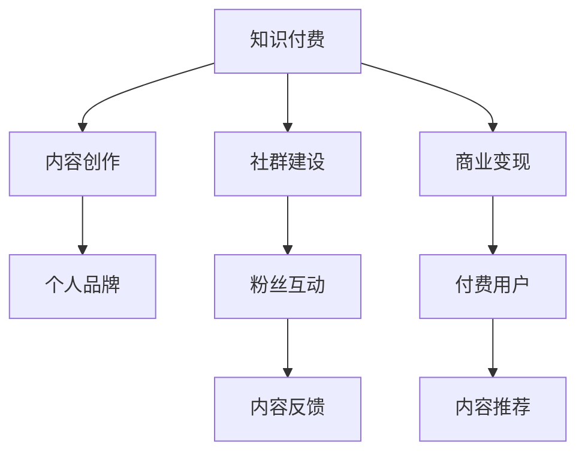

                 

# 如何打造个人知识付费商业帝国

> 关键词：知识付费, 内容创作, 社群建设, 商业变现, 个人品牌

## 1. 背景介绍

随着互联网的普及和技术的进步，信息获取的方式已经发生了翻天覆地的变化。从搜索引擎的搜索、社交媒体的浏览，到视频平台的观看，人们获取信息的渠道越来越多样化。然而，信息质量参差不齐，内容碎片化严重，高质量、系统化的知识获取越来越难。在这种情况下，知识付费模式应运而生，成为互联网经济的重要组成部分。

知识付费是指消费者为获取专业知识和信息而支付费用的商业模式。知识付费的兴起，主要基于以下几点原因：

1. **信息爆炸**：互联网时代，信息呈爆炸式增长，筛选和获取高质量内容变得困难。
2. **时间成本**：在信息过载的情况下，人们愿意为节省时间支付一定的费用。
3. **知识价值**：深度、系统化的知识往往具有较高的价值，能够解决实际问题。
4. **专业需求**：职场竞争加剧，专业技能提升成为刚需，知识付费提供了便捷的学习途径。

在这样的背景下，打造个人知识付费商业帝国成为了很多专业人士和创作者的新方向。本文将从核心概念、算法原理、具体操作步骤、数学模型、项目实践、实际应用、工具和资源推荐等方面，系统介绍如何构建一个成功的知识付费商业帝国。

## 2. 核心概念与联系

### 2.1 核心概念概述

为了更好地理解如何打造个人知识付费商业帝国，我们需要首先介绍几个核心概念：

- **知识付费**：指消费者为获取高质量知识而支付费用的模式，包括在线课程、电子书、咨询服务等多种形式。
- **内容创作**：包括文章、视频、音频等多种形式的知识内容创作，是知识付费的基石。
- **社群建设**：通过建立粉丝社群，增强用户粘性，提高内容传播效果，构建知识付费生态。
- **商业变现**：通过广告、付费订阅、社群付费、课程销售等多种方式，实现知识付费的商业模式变现。
- **个人品牌**：通过持续输出有价值的内容，建立自己的专业形象和品牌影响力，提升商业变现能力。

这些核心概念之间的关系可以通过以下Mermaid流程图来展示：



这个流程图展示了知识付费商业帝国的各个关键环节及其相互关系：

1. **内容创作**是知识付费的核心，是知识付费的基础。
2. **社群建设**通过增强用户粘性，提高内容传播效果。
3. **商业变现**通过多渠道变现，实现盈利。
4. **个人品牌**通过高质量内容输出，提升品牌影响力。

这些环节相互作用，共同构成了知识付费商业帝国的完整生态。

### 2.2 核心概念原理和架构

#### 2.2.1 内容创作

内容创作是知识付费的基础。高质量的内容能够吸引用户，建立品牌信任，最终实现变现。内容创作的原理和架构如下：

1. **内容主题选择**：根据市场需求和自身优势，选择有价值的内容主题，如编程、金融、心理等。
2. **内容形式设计**：选择合适的输出形式，如文章、视频、音频、直播等。
3. **内容结构设计**：确保内容逻辑清晰、结构严谨，易于用户理解和吸收。
4. **内容质量提升**：不断优化内容质量，提高用户满意度。

#### 2.2.2 社群建设

社群建设是知识付费的重要环节。通过社群，创作者能够与用户建立更紧密的联系，实现内容的双向互动。社群建设的原理和架构如下：

1. **社群平台选择**：选择合适的社群平台，如微信公众号、知识星球、B站等。
2. **社群规则制定**：明确社群规则，营造积极的互动氛围。
3. **内容发布机制**：制定内容发布计划，定期发布高质量内容。
4. **用户互动管理**：及时响应用户提问，提升用户满意度。

#### 2.2.3 商业变现

商业变现是知识付费的最终目的。通过多渠道变现，创作者能够实现盈利。商业变现的原理和架构如下：

1. **付费订阅**：通过订阅模式，获取稳定的现金流。
2. **课程销售**：通过开发高质量课程，获取更高的单次收益。
3. **广告分成**：通过平台广告分成，获取额外的收益。
4. **会员服务**：提供专属会员服务，提高用户粘性，增加附加价值。

#### 2.2.4 个人品牌

个人品牌是知识付费的核心竞争力。通过建立专业形象和品牌影响力，创作者能够吸引更多粉丝和付费用户。个人品牌的原理和架构如下：

1. **品牌定位**：明确个人品牌定位，建立专业形象。
2. **内容输出**：持续输出高质量内容，提升品牌影响力。
3. **品牌推广**：通过社交媒体、个人博客等渠道，推广个人品牌。
4. **品牌互动**：积极与粉丝互动，增强用户粘性。

## 3. 核心算法原理 & 具体操作步骤

### 3.1 算法原理概述

打造个人知识付费商业帝国，其核心在于内容创作、社群建设、商业变现和个人品牌构建。这些环节需要综合考虑，形成一套系统化、高效化的操作流程。

内容创作、社群建设、商业变现和个人品牌构建的算法原理如下：

1. **内容创作算法**：基于用户需求和自身优势，选择合适的内容主题，设计高质量的内容形式和结构。
2. **社群建设算法**：选择合适的社群平台，制定合理的社群规则和内容发布计划，及时响应用户互动。
3. **商业变现算法**：通过付费订阅、课程销售、广告分成和会员服务等渠道，实现多渠道变现。
4. **个人品牌算法**：通过持续输出高质量内容，建立专业形象，并通过品牌推广和互动，提升品牌影响力。

### 3.2 算法步骤详解

#### 3.2.1 内容创作步骤

1. **市场调研**：通过问卷调查、数据分析等手段，了解用户需求和市场趋势。
2. **主题选择**：根据调研结果，选择有价值的内容主题。
3. **内容设计**：设计内容形式和结构，确保内容易于理解和吸收。
4. **内容生产**：利用工具和资源，高效生产高质量内容。
5. **内容优化**：根据用户反馈，不断优化内容质量和形式。

#### 3.2.2 社群建设步骤

1. **平台选择**：选择合适的社群平台，确保平台稳定、用户活跃。
2. **规则制定**：制定合理的社群规则，营造积极的互动氛围。
3. **内容发布**：制定内容发布计划，定期发布高质量内容。
4. **互动管理**：及时响应用户提问，提升用户满意度。
5. **社群扩展**：通过优质内容吸引新用户，扩大社群规模。

#### 3.2.3 商业变现步骤

1. **渠道选择**：选择合适的变现渠道，如付费订阅、课程销售、广告分成和会员服务。
2. **定价策略**：根据内容价值和市场定位，制定合理的定价策略。
3. **推广活动**：通过社交媒体、广告等渠道，推广内容和服务。
4. **用户反馈**：根据用户反馈，不断优化内容和商业变现策略。

#### 3.2.4 个人品牌建设步骤

1. **品牌定位**：明确个人品牌定位，建立专业形象。
2. **内容输出**：持续输出高质量内容，提升品牌影响力。
3. **品牌推广**：通过社交媒体、个人博客等渠道，推广个人品牌。
4. **品牌互动**：积极与粉丝互动，增强用户粘性。

### 3.3 算法优缺点

#### 3.3.1 内容创作算法

- **优点**：
  - **高价值内容**：高质量内容能够吸引用户，建立品牌信任。
  - **多样化形式**：不同形式的内容可以满足不同用户的需求。
  - **持续优化**：不断优化内容质量，提升用户满意度。

- **缺点**：
  - **时间和资源投入**：内容创作需要大量的时间和资源投入。
  - **内容质量难以保证**：内容创作质量不稳定，难以保证每次都产出优质内容。

#### 3.3.2 社群建设算法

- **优点**：
  - **增强用户粘性**：通过社群互动，增强用户粘性，提高用户满意度。
  - **提升内容传播效果**：通过社群建设，提升内容传播效果。
  - **双向互动**：社群建设实现内容的双向互动，提高用户粘性。

- **缺点**：
  - **管理难度大**：社群管理难度较大，需要投入大量时间和精力。
  - **用户质量参差不齐**：社群中用户质量参差不齐，管理难度较大。

#### 3.3.3 商业变现算法

- **优点**：
  - **多渠道变现**：通过多渠道变现，实现盈利。
  - **稳定现金流**：付费订阅模式提供稳定的现金流。
  - **高附加值**：课程销售和会员服务提供更高的附加价值。

- **缺点**：
  - **竞争激烈**：知识付费市场竞争激烈，需要不断创新。
  - **用户流失率**：用户流失率较高，需要不断优化用户粘性。

#### 3.3.4 个人品牌算法

- **优点**：
  - **品牌影响力**：通过高质量内容输出，建立品牌影响力。
  - **用户粘性高**：高粘性的用户能够带来稳定的现金流。
  - **商业变现能力强**：通过个人品牌，实现更高效的商业变现。

- **缺点**：
  - **时间和精力投入**：品牌建设需要大量的时间和精力投入。
  - **品牌定位模糊**：品牌定位不清晰，难以形成独特形象。

### 3.4 算法应用领域

打造个人知识付费商业帝国，涉及多个领域，包括内容创作、社群建设、商业变现和个人品牌建设。这些领域的应用范围如下：

1. **内容创作**：适用于多种形式的知识输出，包括文章、视频、音频、直播等。
2. **社群建设**：适用于知识星球、微信公众号、B站等社群平台。
3. **商业变现**：适用于付费订阅、课程销售、广告分成和会员服务等变现渠道。
4. **个人品牌**：适用于社交媒体、个人博客、微信公众号等品牌推广渠道。

## 4. 数学模型和公式 & 详细讲解 & 举例说明

### 4.1 数学模型构建

为了更好地理解和优化知识付费商业帝国的运营，我们可以使用数学模型来描述和分析其中的关键环节。以下是一个简单的知识付费商业帝国的数学模型：

- **用户数**：$U$
- **内容数量**：$C$
- **用户付费率**：$R$
- **单次付费金额**：$A$
- **内容更新频率**：$F$
- **广告点击率**：$C_{ad}$
- **会员订阅率**：$C_{sub}$
- **会员续费率**：$R_{sub}$

### 4.2 公式推导过程

#### 4.2.1 用户增长模型

用户增长模型描述了用户数的变化趋势。假设用户数呈指数增长，则用户数的变化方程为：

$$
U(t+1) = U(t) + \lambda \times U(t)
$$

其中，$\lambda$ 为增长率，$t$ 为时间。

#### 4.2.2 内容付费模型

内容付费模型描述了内容变现的收益。假设内容更新频率为 $F$，每次内容更新的平均付费人数为 $R \times C$，每次付费的平均金额为 $A$，则总付费金额为：

$$
Total\_earning = (R \times C) \times F \times A
$$

#### 4.2.3 广告收益模型

广告收益模型描述了广告变现的收益。假设广告点击率为 $C_{ad}$，每次点击的平均收益为 $A_{ad}$，则总广告收益为：

$$
Total\_ad\_earning = C_{ad} \times A_{ad}
$$

#### 4.2.4 会员收益模型

会员收益模型描述了会员变现的收益。假设会员订阅率为 $C_{sub}$，会员续费率为 $R_{sub}$，每次订阅的平均金额为 $A_{sub}$，则总会员收益为：

$$
Total\_sub\_earning = C_{sub} \times A_{sub} + R_{sub} \times A_{sub}
$$

### 4.3 案例分析与讲解

以一名编程教育领域的知识付费专家为例，分析其运营情况：

- **用户数**：假设每月新增用户 1000 人，总用户数 $U=1000$。
- **内容数量**：假设每月发布 5 篇高质量文章，内容数量 $C=5$。
- **用户付费率**：假设付费率为 10%，$R=0.1$。
- **单次付费金额**：假设每次付费金额为 100 元，$A=100$。
- **内容更新频率**：假设每月发布一次，$F=1$。
- **广告点击率**：假设广告点击率为 1%，$C_{ad}=0.01$。
- **会员订阅率**：假设订阅率为 5%，$C_{sub}=0.05$。
- **会员续费率**：假设续费率为 50%，$R_{sub}=0.5$。
- **会员单次订阅金额**：假设每次订阅金额为 200 元，$A_{sub}=200$。

根据以上数据，我们可以计算总收益：

- **内容付费收益**：$(0.1 \times 5) \times 1 \times 100 = 50$ 元/月
- **广告收益**：$0.01 \times 200 = 2$ 元/月
- **会员收益**：$(0.05 \times 200) + (0.5 \times 200) = 150$ 元/月

总收益为：$50 + 2 + 150 = 202$ 元/月。

## 5. 项目实践：代码实例和详细解释说明

### 5.1 开发环境搭建

为了方便知识付费项目的开发和部署，我们需要搭建一个完整的开发环境。以下是一个简单的开发环境搭建步骤：

1. **服务器选择**：选择合适的云服务器，如阿里云、腾讯云、AWS 等。
2. **编程语言选择**：选择适合的项目编程语言，如 Python、Java、Go 等。
3. **框架选择**：选择适合的框架，如 Django、Flask、Spring Boot 等。
4. **数据库选择**：选择适合的数据库，如 MySQL、PostgreSQL、MongoDB 等。
5. **开发工具选择**：选择适合的开发工具，如 VSCode、PyCharm、IntelliJ IDEA 等。
6. **部署工具选择**：选择适合的部署工具，如 Docker、Kubernetes、AWS EC2 等。

### 5.2 源代码详细实现

以下是一个简单的知识付费平台的项目结构示例：

```
myknowledgepay.com
├── frontend
│   ├── index.html
│   ├── styles.css
│   ├── scripts.js
│   └── ...
├── backend
│   ├── models.py
│   ├── views.py
│   ├── controllers.py
│   ├── services.py
│   └── ...
├── db
│   ├── config.py
│   ├── models.py
│   └── ...
├── static
│   ├── css
│   ├── js
│   └── ...
└── tests
    ├── unit_tests.py
    └── ...
```

### 5.3 代码解读与分析

- **前端**：负责用户界面展示，包括文章列表、用户登录、在线课程等。
- **后端**：负责处理用户请求，包括内容发布、付费管理、广告点击等。
- **数据库**：负责存储用户信息、内容信息、付费信息等。
- **静态资源**：包括样式文件、JavaScript 文件等，用于前端渲染。
- **测试**：包括单元测试、集成测试等，确保系统稳定可靠。

## 6. 实际应用场景

### 6.4 未来应用展望

随着互联网技术的不断发展，知识付费市场将迎来更多的创新和机遇。以下列举几个未来应用展望：

1. **AI辅助内容创作**：利用 AI 技术，辅助创作者进行内容创作，提高内容质量和生产效率。
2. **多模态内容输出**：结合视频、音频、图像等多模态内容，提高用户体验和内容吸引力。
3. **个性化推荐**：通过算法推荐，提升用户粘性和满意度，实现精准变现。
4. **用户社区运营**：通过社区运营，增强用户互动和粘性，提升品牌影响力。
5. **国际化拓展**：将知识付费平台拓展到海外市场，实现全球化运营。

## 7. 工具和资源推荐

### 7.1 学习资源推荐

为了更好地掌握知识付费项目的开发和运营，以下是一些推荐的学习资源：

1. **知识付费平台运营指南**：介绍知识付费平台的运营策略和实践经验。
2. **内容创作和品牌建设**：介绍内容创作和品牌建设的最佳实践和技巧。
3. **社群运营和用户管理**：介绍社群运营和用户管理的策略和工具。
4. **商业变现和财务管理**：介绍商业变现和财务管理的知识和技术。

### 7.2 开发工具推荐

为了高效开发知识付费项目，以下是一些推荐的工具：

1. **编程语言和框架**：Python、Django、Flask 等。
2. **数据库**：MySQL、PostgreSQL、MongoDB 等。
3. **开发工具**：VSCode、PyCharm、IntelliJ IDEA 等。
4. **部署工具**：Docker、Kubernetes、AWS EC2 等。

### 7.3 相关论文推荐

以下是几篇相关领域的经典论文，供进一步学习和研究：

1. **知识付费平台用户行为分析**：介绍知识付费平台用户行为分析和用户留存策略。
2. **内容推荐算法研究**：介绍基于协同过滤、深度学习等技术的内容推荐算法。
3. **社群运营和用户互动**：介绍社群运营和用户互动的策略和工具。
4. **商业变现和财务管理**：介绍知识付费平台的商业变现和财务管理策略。

## 8. 总结：未来发展趋势与挑战

### 8.1 研究成果总结

本文从内容创作、社群建设、商业变现和个人品牌构建等方面，系统介绍了如何打造个人知识付费商业帝国。通过以上分析，我们可以得出以下结论：

1. **内容创作是基础**：高质量内容能够吸引用户，建立品牌信任。
2. **社群建设是关键**：通过社群建设，增强用户粘性，提升内容传播效果。
3. **商业变现是目标**：通过多渠道变现，实现盈利。
4. **个人品牌是保障**：通过个人品牌，提升品牌影响力和商业变现能力。

### 8.2 未来发展趋势

未来知识付费市场将呈现以下几个发展趋势：

1. **AI技术的广泛应用**：利用 AI 技术，提高内容创作效率和质量。
2. **多模态内容的融合**：结合视频、音频、图像等多模态内容，提升用户体验和内容吸引力。
3. **个性化推荐的普及**：通过算法推荐，实现精准变现。
4. **国际化市场的拓展**：将知识付费平台拓展到海外市场，实现全球化运营。
5. **用户社区的繁荣**：通过社区运营，增强用户互动和粘性。

### 8.3 面临的挑战

知识付费市场在发展过程中也面临诸多挑战：

1. **内容质量不稳定**：内容质量不稳定，难以保证每次都产出优质内容。
2. **用户流失率高**：用户流失率高，难以维持稳定的用户基础。
3. **市场竞争激烈**：知识付费市场竞争激烈，需要不断创新。
4. **用户需求多样化**：用户需求多样化，需要不断适应市场需求。

### 8.4 研究展望

未来知识付费市场的关键在于持续创新和优化。以下是几个研究方向：

1. **内容创作效率提升**：通过 AI 技术，提高内容创作效率和质量。
2. **个性化推荐算法优化**：通过算法优化，实现更精准的内容推荐。
3. **用户社区运营优化**：通过社区运营，增强用户互动和粘性。
4. **商业变现策略创新**：通过多渠道变现，实现更高效的商业变现。

## 9. 附录：常见问题与解答

**Q1: 如何选择合适的知识付费内容主题？**

A: 选择合适的知识付费内容主题，需要考虑以下几个因素：
1. **市场需求**：通过市场调研，了解用户需求。
2. **自身优势**：根据自身专业背景和经验，选择有优势的内容主题。
3. **竞争情况**：了解竞争者的内容主题，避免同质化竞争。
4. **可持续性**：选择有持续性和可扩展性的内容主题。

**Q2: 如何提高知识付费平台的用户粘性？**

A: 提高知识付费平台的用户粘性，需要采取以下措施：
1. **优质内容输出**：持续输出高质量内容，提升用户满意度。
2. **互动和反馈**：通过互动和反馈机制，增强用户粘性。
3. **社群建设**：建立粉丝社群，增强用户粘性。
4. **会员服务**：提供专属会员服务，提高用户粘性。

**Q3: 知识付费平台如何进行商业变现？**

A: 知识付费平台的商业变现，可以通过以下渠道实现：
1. **付费订阅**：通过订阅模式，获取稳定的现金流。
2. **课程销售**：通过开发高质量课程，获取更高的单次收益。
3. **广告分成**：通过平台广告分成，获取额外的收益。
4. **会员服务**：提供专属会员服务，提高用户粘性，增加附加价值。

**Q4: 如何进行知识付费平台的品牌建设？**

A: 进行知识付费平台的品牌建设，需要采取以下措施：
1. **品牌定位**：明确品牌定位，建立专业形象。
2. **内容输出**：持续输出高质量内容，提升品牌影响力。
3. **品牌推广**：通过社交媒体、个人博客等渠道，推广品牌。
4. **品牌互动**：积极与粉丝互动，增强用户粘性。

**Q5: 如何进行知识付费平台的用户管理？**

A: 进行知识付费平台的用户管理，需要采取以下措施：
1. **用户数据分析**：通过数据分析，了解用户行为和需求。
2. **用户反馈机制**：建立用户反馈机制，及时响应用户需求。
3. **用户激励机制**：通过激励机制，增强用户活跃度。
4. **用户关系管理**：建立用户关系管理系统，提高用户管理效率。

**Q6: 如何进行知识付费平台的广告投放？**

A: 进行知识付费平台的广告投放，需要采取以下措施：
1. **选择合适的广告平台**：选择适合的广告平台，如 Google Ads、百度推广等。
2. **广告创意设计**：设计吸引人的广告创意，提高广告点击率。
3. **广告预算管理**：合理分配广告预算，提高广告投放效果。
4. **广告效果监测**：通过监测工具，实时监测广告效果，优化广告投放策略。

---

作者：禅与计算机程序设计艺术 / Zen and the Art of Computer Programming

