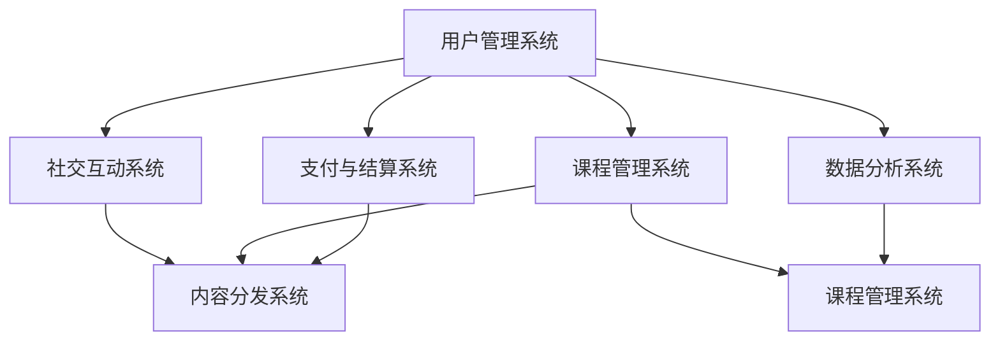

                 

# 如何打造个人知识付费平台

## 1. 背景介绍

### 1.1 问题由来
随着知识经济和在线教育市场的快速崛起，越来越多的个人和机构开始转向知识付费。知识付费平台不仅能够帮助创作者拓宽收入渠道，同时也能够帮助学习者高效获取专业知识和技能。然而，创建和管理一个高效、稳定的知识付费平台并不是一件容易的事情。本文将从技术角度出发，系统梳理个人知识付费平台的核心构建要素，并介绍在实际开发过程中所需考虑的关键技术和方案。

### 1.2 问题核心关键点
构建一个成功的个人知识付费平台，需要考虑以下几个核心关键点：
1. **用户管理与身份认证**：确保用户身份的安全与可信，并提供方便的用户管理功能。
2. **课程设计与资源管理**：设计易于查找、组织和导航的课程体系，以及高效管理课程资源的能力。
3. **支付与结算系统**：实现安全和透明的支付流程，以及自动化的结算和退款处理。
4. **内容生产与分发**：支持多种形式的课程内容（如文字、视频、音频），并提供高效的内容分发机制。
5. **用户互动与社交**：构建社区氛围，促进用户之间的互动和交流。
6. **数据统计与分析**：收集和分析用户行为数据，以提升平台的用户体验和内容质量。

这些关键点构成了个人知识付费平台的整体框架，是技术实现的基础。本文将从这些方面出发，详细探讨如何在技术层面上打造一个高效、稳定、用户友好的知识付费平台。

## 2. 核心概念与联系

### 2.1 核心概念概述

为更好地理解个人知识付费平台的构建，本节将介绍几个密切相关的核心概念：

- **知识付费平台**：提供知识商品（如课程、讲座、文章等），并以此进行收费的在线平台。其目标是链接创作者和消费者，实现知识的价值变现。
- **用户管理系统**：用于管理用户账户、权限和行为的系统，是平台的核心功能之一。
- **课程管理系统**：负责课程的创建、编辑、发布和版本控制，确保课程内容的准确性和时效性。
- **支付与结算系统**：实现用户支付、课程费用结算、退款处理等功能，保障支付流程的安全和透明。
- **内容分发系统**：支持多种形式的内容存储和分发，提供高效的内容访问机制。
- **社交互动系统**：构建用户社区，促进学习者之间的交流和互动，增强平台粘性。
- **数据分析系统**：通过收集和分析用户行为数据，提供数据驱动的平台优化建议，提升用户满意度和课程质量。

这些核心概念之间的逻辑关系可以通过以下Mermaid流程图来展示：



这个流程图展示了知识付费平台的核心组件及其之间的相互作用关系：

1. 用户管理系统管理用户身份和行为。
2. 课程管理系统负责课程的创建和版本控制。
3. 支付与结算系统保障支付流程的安全和透明。
4. 内容分发系统支持多种形式的内容存储和分发。
5. 社交互动系统构建用户社区，增强平台粘性。
6. 数据分析系统收集和分析用户行为数据，优化平台体验。

## 3. 核心算法原理 & 具体操作步骤
### 3.1 算法原理概述

个人知识付费平台的构建涉及到多个技术环节，包括但不限于：用户管理、课程设计、支付处理、内容分发、社交互动和数据分析。这些环节之间相互依赖，共同构建了一个高效、稳定的知识付费生态系统。

### 3.2 算法步骤详解

**Step 1: 用户管理与身份认证**

用户管理与身份认证是个人知识付费平台的基础，涉及以下步骤：

- **用户注册与登录**：用户可以通过手机号、邮箱、第三方账号等方式注册并登录平台。
- **身份认证与权限管理**：通过短信验证码、邮箱验证等方式确保用户身份的真实性，同时根据用户角色设置不同的权限。
- **密码安全与找回**：提供密码找回、重置功能，确保用户账户安全。

具体实现中，可以使用OAuth2.0协议进行第三方登录，采用JWT（JSON Web Tokens）实现身份验证，使用Shibboleth进行单点登录，以及采用HTTPS协议加密数据传输。

**Step 2: 课程设计与资源管理**

课程设计与资源管理是知识付费平台的核心功能之一，涉及以下步骤：

- **课程设计**：根据学科领域和用户需求设计课程体系，包括课程名称、描述、教学大纲、授课计划等。
- **课程内容制作**：支持文字、图片、音频、视频等多种形式的内容制作和上传。
- **资源管理**：管理课程的各类资源，如教材、讲义、习题等，确保内容的准确性和时效性。

具体实现中，可以使用Markdown或HTML格式制作课程内容，支持在线编辑器，如CodeMirror、Quill、CKEditor等。资源管理方面，可以采用云存储服务，如阿里云OSS、腾讯云COS、七牛云Kodo等，确保资源的安全存储和快速访问。

**Step 3: 支付与结算系统**

支付与结算系统是知识付费平台的经济保障，涉及以下步骤：

- **支付方式选择**：支持多种支付方式，如支付宝、微信支付、银联支付等。
- **订单处理与支付**：处理用户订单，包括支付确认、订单生成、订单状态管理等。
- **费用结算与退款**：自动进行课程费用结算，并提供方便的退款处理机制。

具体实现中，可以采用支付宝、微信支付等第三方支付API，使用Spring Cloud Alibaba实现订单服务的高可用性和可伸缩性，使用MyBatis或Hibernate实现数据库操作，确保数据的安全和一致性。

**Step 4: 内容分发系统**

内容分发系统是知识付费平台的重要组成部分，涉及以下步骤：

- **内容存储与分发**：采用云存储服务存储内容，并提供CDN加速，确保内容的快速访问。
- **视频直播与录播**：支持视频直播和录播功能，使用RTMP协议进行视频流传输。
- **互动功能实现**：提供问答、讨论、投票等功能，增强学习互动性。

具体实现中，可以采用阿里云CDN、七牛云CDN等提供CDN服务，使用OpenResty实现视频直播与录播功能，使用WebSocket协议实现实时互动功能。

**Step 5: 社交互动系统**

社交互动系统是知识付费平台的社交功能，涉及以下步骤：

- **用户社区构建**：构建用户社区，支持用户发表文章、评论、点赞等功能。
- **讨论组与话题**：提供讨论组和话题功能，促进用户之间的交流和讨论。
- **消息系统**：实现私信、群聊等功能，增强用户间的互动。

具体实现中，可以采用Redis或Memcached实现缓存和消息队列，使用WebSocket协议实现实时消息推送，使用ElasticSearch实现搜索和索引功能。

**Step 6: 数据分析系统**

数据分析系统是知识付费平台的重要支撑，涉及以下步骤：

- **数据采集与存储**：采集用户行为数据，如课程访问量、学习时长、评价等，并存储到数据库中。
- **数据分析与可视化**：分析用户行为数据，提供数据报表和可视化工具，支持决策支持。
- **用户画像构建**：通过用户行为数据构建用户画像，支持个性化推荐。

具体实现中，可以采用MySQL或PostgreSQL数据库存储数据，使用Hadoop或Spark进行大数据分析，使用Tableau或PowerBI实现数据可视化。

### 3.3 算法优缺点

个人知识付费平台构建的优势在于：

1. **高效与便捷**：通过平台化的管理，大大提高了课程设计和分发效率，同时也方便了用户的学习。
2. **成本控制**：通过平台化操作，降低了内容制作和分发的成本。
3. **用户粘性增强**：通过社交互动功能，增强了用户之间的互动和社区粘性。
4. **数据驱动优化**：通过数据分析，能够及时优化平台体验和课程质量。

然而，个人知识付费平台构建也存在一些缺点：

1. **高技术门槛**：需要涉及多个技术环节，对开发团队的技术水平要求较高。
2. **高成本投入**：平台搭建和运维需要较高的技术资源和资金投入。
3. **市场竞争激烈**：知识付费市场竞争激烈，需要不断创新以保持竞争力。

## 4. 数学模型和公式 & 详细讲解 & 举例说明
### 4.1 数学模型构建

个人知识付费平台的核心技术环节可以通过以下数学模型进行刻画：

- **用户管理模型**：$U = (u_i, p_i, a_i)$，其中$u_i$为用户信息，$p_i$为用户权限，$a_i$为用户行为记录。
- **课程管理模型**：$C = (t_i, d_i, c_i)$，其中$t_i$为课程信息，$d_i$为课程设计参数，$c_i$为课程内容。
- **支付模型**：$P = (s_i, o_i, r_i)$，其中$s_i$为支付方式，$o_i$为订单信息，$r_i$为退款记录。
- **内容分发模型**：$D = (c_i, v_i, i_i)$，其中$c_i$为内容信息，$v_i$为视频流传输参数，$i_i$为互动信息。
- **社交互动模型**：$S = (m_i, g_i, t_i)$，其中$m_i$为消息信息，$g_i$为讨论组信息，$t_i$为话题信息。
- **数据分析模型**：$A = (d_i, r_i, p_i)$，其中$d_i$为数据采集记录，$r_i$为报表信息，$p_i$为用户画像信息。

### 4.2 公式推导过程

以下我们以课程设计与资源管理为例，推导课程设计与资源管理的数学模型。

假设课程内容$C$由文本、图片、音频、视频等多种形式组成，用向量表示：

$$
C = (c_{text}, c_{image}, c_{audio}, c_{video})
$$

其中$c_{text}$为文本内容，$c_{image}$为图片内容，$c_{audio}$为音频内容，$c_{video}$为视频内容。

课程设计$d$包括课程名称、描述、教学大纲等，用向量表示：

$$
d = (n_i, d_i, t_i)
$$

其中$n_i$为课程名称，$d_i$为课程描述，$t_i$为教学大纲。

课程设计参数$p$包括课程时长、授课教师、学习目标等，用向量表示：

$$
p = (l_i, t_i, o_i)
$$

其中$l_i$为课程时长，$t_i$为授课教师，$o_i$为学习目标。

课程设计与资源管理的数学模型可以表示为：

$$
C = f(d, p)
$$

其中$f$为课程设计函数，表示根据课程设计$d$和课程设计参数$p$生成课程内容$C$。

通过上述数学模型，我们可以设计出相应的课程管理系统，支持课程的创建、编辑、发布和版本控制。具体实现中，可以使用RESTful API进行课程的增删改查操作，使用Git版本控制工具进行课程版本管理。

### 4.3 案例分析与讲解

以下我们以在线视频课程的实现为例，展示如何使用大语言模型进行课程设计和管理。

假设有一个在线视频课程$C$，由视频内容$c_{video}$和课程描述$d$组成。使用Transformer模型作为大语言模型，将课程描述$d$作为输入，输出课程内容$c_{video}$。

具体实现步骤如下：

1. 首先，使用Transformer模型对课程描述$d$进行编码，得到文本表示$h$：

$$
h = T(d)
$$

其中$T$为Transformer编码器，$d$为课程描述。

2. 然后，将文本表示$h$作为条件，生成视频内容$c_{video}$：

$$
c_{video} = G(h)
$$

其中$G$为视频生成器，$h$为文本表示。

3. 最后，将视频内容$c_{video}$存储到云存储服务中，并支持视频流传输和互动功能。

通过上述步骤，我们可以实现一个基于大语言模型的视频课程生成系统，大大提高了课程设计的效率和质量。

## 5. 项目实践：代码实例和详细解释说明
### 5.1 开发环境搭建

在进行知识付费平台开发前，我们需要准备好开发环境。以下是使用Python进行Django开发的环境配置流程：

1. 安装Anaconda：从官网下载并安装Anaconda，用于创建独立的Python环境。

2. 创建并激活虚拟环境：
```bash
conda create -n pyenv python=3.8 
conda activate pyenv
```

3. 安装Django：根据CUDA版本，从官网获取对应的安装命令。例如：
```bash
pip install django==3.2
```

4. 安装各类工具包：
```bash
pip install numpy pandas scikit-learn matplotlib tqdm jupyter notebook ipython
```

5. 安装Django REST framework：
```bash
pip install djangorestframework
```

6. 安装Django-allauth：
```bash
pip install django-allauth
```

完成上述步骤后，即可在`pyenv`环境中开始知识付费平台开发。

### 5.2 源代码详细实现

下面我们以知识付费平台的用户管理系统为例，给出使用Django进行开发的PyTorch代码实现。

首先，定义用户模型的数据模型：

```python
from django.contrib.auth.models import AbstractUser
from django.db import models
from django.conf import settings

class CustomUser(AbstractUser):
    pass
```

然后，定义用户管理的相关视图和控制器：

```python
from django.contrib.auth import views as auth_views
from django.urls import path

urlpatterns = [
    path('login/', auth_views.LoginView.as_view(), name='login'),
    path('logout/', auth_views.LogoutView.as_view(), name='logout'),
    path('signup/', views.SignupView.as_view(), name='signup'),
    path('profile/', views.ProfileView.as_view(), name='profile'),
]
```

接着，定义用户注册和登录的相关视图和控制器：

```python
from django.shortcuts import render, redirect
from django.contrib.auth.forms import UserCreationForm
from django.contrib.auth import login

class SignupView(View):
    def get(self, request):
        form = UserCreationForm()
        return render(request, 'signup.html', {'form': form})

    def post(self, request):
        form = UserCreationForm(request.POST)
        if form.is_valid():
            user = form.save()
            login(request, user)
            return redirect('home')
```

最后，启动用户管理系统并在测试环境上测试：

```python
from django.core.management import execute_from_command_line
execute_from_command_line(['runserver', '0.0.0.0:8000'])
```

以上就是使用Django进行知识付费平台用户管理的完整代码实现。可以看到，通过Django的强大封装，我们可以用相对简洁的代码实现用户注册、登录等核心功能。

### 5.3 代码解读与分析

让我们再详细解读一下关键代码的实现细节：

**CustomUser类**：
- 继承Django的AbstractUser类，定制用户模型。

**SignupView类**：
- 定义了用户注册视图，包括表单验证和用户登录。
- 使用Django的UserCreationForm表单，简化注册过程。
- 注册成功后，自动登录用户，并提供重定向。

**execute_from_command_line函数**：
- 启动Django服务器，监听8000端口。

通过Django框架提供的强大工具和库，我们能够快速构建出一个高效、安全的用户管理系统。然而，要实现一个完整的知识付费平台，还需要进一步开发课程管理、支付系统、内容分发、社交互动等功能模块。

## 6. 实际应用场景
### 6.1 智能客服系统

基于知识付费平台的用户管理系统和互动功能，可以构建智能客服系统。传统客服往往需要配备大量人力，高峰期响应缓慢，且一致性和专业性难以保证。而使用知识付费平台的用户管理系统，可以7x24小时不间断服务，快速响应客户咨询，用自然流畅的语言解答各类常见问题。

在技术实现上，可以收集企业内部的历史客服对话记录，将问题和最佳答复构建成监督数据，在此基础上对知识付费平台的用户管理系统进行微调。微调后的用户管理系统能够自动理解用户意图，匹配最合适的答复模板进行回复。对于客户提出的新问题，还可以接入检索系统实时搜索相关内容，动态组织生成回答。如此构建的智能客服系统，能大幅提升客户咨询体验和问题解决效率。

### 6.2 金融舆情监测

金融机构需要实时监测市场舆论动向，以便及时应对负面信息传播，规避金融风险。传统的人工监测方式成本高、效率低，难以应对网络时代海量信息爆发的挑战。基于知识付费平台的社交互动功能，可以在用户社区构建舆情监测系统。

具体而言，可以收集金融领域相关的新闻、报道、评论等文本数据，并对其进行主题标注和情感标注。在此基础上对知识付费平台的社交互动功能进行微调，使其能够自动判断文本属于何种主题，情感倾向是正面、中性还是负面。将微调后的社交互动功能应用到实时抓取的网络文本数据，就能够自动监测不同主题下的情感变化趋势，一旦发现负面信息激增等异常情况，系统便会自动预警，帮助金融机构快速应对潜在风险。

### 6.3 个性化推荐系统

当前的推荐系统往往只依赖用户的历史行为数据进行物品推荐，无法深入理解用户的真实兴趣偏好。基于知识付费平台的课程管理系统和数据分析功能，可以构建个性化推荐系统。

在实践中，可以收集用户浏览、点击、评论、分享等行为数据，提取和用户交互的物品标题、描述、标签等文本内容。将文本内容作为模型输入，用户的后续行为（如是否点击、购买等）作为监督信号，在此基础上微调知识付费平台的课程管理系统和数据分析功能。微调后的系统能够从文本内容中准确把握用户的兴趣点。在生成推荐列表时，先用候选物品的文本描述作为输入，由课程管理系统和数据分析功能预测用户的兴趣匹配度，再结合其他特征综合排序，便可以得到个性化程度更高的推荐结果。

### 6.4 未来应用展望

随着知识付费平台的发展，其应用场景将不断拓展，为各行各业带来新的机遇和挑战：

在智慧医疗领域，基于知识付费平台的课程管理系统和数据分析功能，可以构建在线医疗咨询服务。医疗专家可以通过平台发布课程和解答，患者可以方便地咨询专家，获取个性化的健康建议。

在智能教育领域，基于知识付费平台的社交互动功能，可以构建在线学习社区，促进学习者之间的交流和互动，提升学习效果。

在智慧城市治理中，基于知识付费平台的课程管理系统和数据分析功能，可以构建城市管理培训课程，提升城市管理者的专业水平。

此外，在企业培训、在线电商、在线金融等领域，知识付费平台也具有广泛的应用前景。相信随着平台的不断迭代和优化，知识付费将成为一种普及的、高效的学习方式，推动各行各业的发展和进步。

## 7. 工具和资源推荐
### 7.1 学习资源推荐

为了帮助开发者系统掌握知识付费平台的核心构建要素，这里推荐一些优质的学习资源：

1. Django官方文档：《Django实战》系列博文：由Django官方团队撰写，深入浅出地介绍了Django框架的用法和最佳实践。

2. Django REST framework官方文档：《Django REST framework实战》系列博文：由Django REST framework社区撰写，提供了丰富的教程和案例。

3. Django-allauth官方文档：《Django-allauth实战》系列博文：由Django-allauth社区撰写，提供了丰富的教程和案例。

4. Django-allauth插件：提供了用户认证和授权功能，可以简化用户管理模块的开发。

5. 《Django实战教程》书籍：详细介绍了Django框架的用法和最佳实践，适合初学者和中级开发者。

通过对这些资源的学习实践，相信你一定能够快速掌握知识付费平台的核心构建要素，并用于解决实际的业务问题。
###  7.2 开发工具推荐

高效的开发离不开优秀的工具支持。以下是几款用于知识付费平台开发的常用工具：

1. Django：基于Python的开源Web框架，功能强大，易于扩展，适合快速迭代研究。

2. Django REST framework：基于Django的开源Web API框架，支持RESTful API设计，提供高效的数据交互方式。

3. Django-allauth：基于Django的开源认证插件，提供用户认证和授权功能，简化用户管理系统开发。

4. PyTorch：基于Python的开源深度学习框架，支持TensorFlow和PyTorch混合开发。

5. Django图形界面：可视化开发工具，支持快速搭建和管理Web应用。

6. Jupyter Notebook：交互式开发环境，支持编写、测试和运行代码。

7. Postman：API测试工具，支持发送HTTP请求、自动化测试等。

合理利用这些工具，可以显著提升知识付费平台开发效率，加快创新迭代的步伐。

### 7.3 相关论文推荐

知识付费平台的研究源于学界的持续研究。以下是几篇奠基性的相关论文，推荐阅读：

1. RESTful API设计：《RESTful Web Services》论文：提出了RESTful架构的基本原则和设计规范，为构建高效、可扩展的API提供了理论基础。

2. Web框架选择：《Django vs Flask》论文：比较了Django和Flask两种Web框架的优缺点，为选择合适的Web框架提供了指导。

3. 用户认证与授权：《OAuth2.0协议》论文：详细介绍了OAuth2.0协议的设计原理和实现方法，为构建安全的认证系统提供了指导。

4. 内容分发与缓存：《CDN原理与设计》论文：详细介绍了CDN的工作原理和设计方法，为构建高效的内容分发系统提供了指导。

5. 数据分析与可视化：《Tableau实战》书籍：详细介绍了Tableau数据可视化的用法和最佳实践，适合数据科学家和开发者。

这些论文代表了大语言模型微调技术的发展脉络。通过学习这些前沿成果，可以帮助研究者把握学科前进方向，激发更多的创新灵感。

## 8. 总结：未来发展趋势与挑战

### 8.1 总结

本文对基于知识付费平台的核心构建要素进行了全面系统的介绍。首先阐述了知识付费平台的基本概念和核心组件，明确了知识付费平台的构建方向。其次，从技术角度出发，详细讲解了知识付费平台的各个核心模块，提供了具体的代码实例和详细解释。同时，本文还广泛探讨了知识付费平台在实际应用中的多种场景，展示了知识付费平台的巨大潜力。

通过本文的系统梳理，可以看到，基于知识付费平台的知识付费模式正在成为新型的知识传播方式，极大地拓展了知识传播的广度和深度，为各行各业带来了新的机遇。未来，伴随知识付费平台的发展，我们相信知识传播的形态将会更加丰富，知识消费的体验将会更加高效，知识创作者和消费者的互动将会更加紧密。

### 8.2 未来发展趋势

展望未来，知识付费平台将呈现以下几个发展趋势：

1. **平台多元化**：知识付费平台将不再局限于单一领域，而是向多个垂直行业扩展，如教育、医疗、金融、电商等。

2. **内容个性化**：通过数据分析和推荐系统，实现对用户兴趣的精准定位，提供个性化推荐内容。

3. **社交互动增强**：知识付费平台将进一步强化社交互动功能，构建用户社区，增强学习者之间的互动和交流。

4. **技术创新融合**：知识付费平台将与AI、VR、AR等前沿技术进行深度融合，提供更加沉浸式的学习体验。

5. **平台国际化**：知识付费平台将向全球扩展，提供多语言支持，满足全球用户的需求。

6. **智能客服普及**：基于知识付费平台的用户管理系统和互动功能，智能客服系统将得到广泛应用，提升客户体验。

以上趋势凸显了知识付费平台的广阔前景。这些方向的探索发展，必将进一步提升知识传播的效率和质量，为知识经济的发展提供强大的支撑。

### 8.3 面临的挑战

尽管知识付费平台的发展前景广阔，但在迈向更加智能化、普适化应用的过程中，仍面临诸多挑战：

1. **用户粘性不足**：如何通过互动功能和个性化推荐，增强用户的长期留存，是知识付费平台面临的一个重要问题。

2. **内容质量控制**：如何确保课程内容的准确性和时效性，提升平台的权威性和信任度，是知识付费平台的核心挑战之一。

3. **平台监管难度**：如何构建有效的平台监管机制，防范假冒伪劣内容，保障用户权益，是知识付费平台的重要任务。

4. **技术架构复杂**：知识付费平台涉及多种技术环节，对开发团队的技术水平要求较高，如何简化架构、降低开发难度，是知识付费平台的技术挑战之一。

5. **市场竞争激烈**：知识付费市场竞争激烈，如何通过技术创新和用户管理，提升平台的竞争力和市场占有率，是知识付费平台的商业挑战之一。

6. **国际化和本地化**：如何将知识付费平台成功扩展到全球市场，提供本地化的服务，是知识付费平台的国际化挑战之一。

正视知识付费平台面临的这些挑战，积极应对并寻求突破，将是大语言模型微调走向成熟的必由之路。相信随着学界和产业界的共同努力，这些挑战终将一一被克服，知识付费平台必将在构建人机协同的智能时代中扮演越来越重要的角色。

### 8.4 未来突破

面对知识付费平台所面临的种种挑战，未来的研究需要在以下几个方面寻求新的突破：

1. **内容聚合与分发**：通过爬虫、API等技术手段，聚合更多的优质内容，并借助推荐算法和缓存技术，提升内容的聚合效率和分发速度。

2. **用户行为分析**：通过数据分析和机器学习技术，深入理解用户的行为模式和需求，实现更加精准的个性化推荐。

3. **平台智能化**：结合AI、自然语言处理、图像识别等技术，提升知识付费平台的智能化水平，提供更加个性化和沉浸式的学习体验。

4. **平台国际化**：通过多语言支持、本地化定制等技术手段，将知识付费平台成功扩展到全球市场，满足全球用户的需求。

5. **平台监管**：构建有效的平台监管机制，防范假冒伪劣内容，保障用户权益，提升平台的权威性和信任度。

6. **平台社交化**：强化社交互动功能，构建用户社区，增强学习者之间的互动和交流，提升用户的长期留存。

这些研究方向的探索，必将引领知识付费平台技术的发展，为知识经济的发展提供强大的技术支撑。面向未来，知识付费平台还需要与其他人工智能技术进行更深入的融合，如知识表示、因果推理、强化学习等，多路径协同发力，共同推动知识传播的进步。只有勇于创新、敢于突破，才能不断拓展知识付费平台的边界，让知识传播更加高效、精准和智能化。

## 9. 附录：常见问题与解答

**Q1：知识付费平台是否适用于所有领域？**

A: 知识付费平台在大多数领域都可以取得不错的效果，特别是对于知识传播需求较大的领域，如教育、医疗、金融等。但对于一些特定领域，如司法、军事等，知识付费平台可能需要根据具体需求进行定制化开发。

**Q2：如何提高知识付费平台的运营效率？**

A: 提高知识付费平台的运营效率，可以从以下几个方面入手：
1. 优化用户管理系统，提升用户注册和登录速度。
2. 优化课程管理系统，减少内容制作和分发的延迟。
3. 优化支付与结算系统，提升支付和结算的速度和稳定性。
4. 优化内容分发系统，提高内容访问速度和带宽利用率。
5. 优化社交互动系统，提升用户互动效率。

**Q3：知识付费平台如何保证内容质量？**

A: 保证知识付费平台的内容质量，可以从以下几个方面入手：
1. 引入专家审核机制，对课程内容进行严格审核。
2. 引入用户评价机制，让用户对课程内容进行评分和评论。
3. 引入数据分析工具，实时监测课程访问量和用户反馈，及时调整课程内容。
4. 引入版权保护机制，防止盗版和侵权行为。

**Q4：知识付费平台如何防范假冒伪劣内容？**

A: 防范假冒伪劣内容，可以从以下几个方面入手：
1. 引入专家审核机制，对课程内容进行严格审核。
2. 引入用户评价机制，让用户对课程内容进行评分和评论。
3. 引入数据分析工具，实时监测课程访问量和用户反馈，及时调整课程内容。
4. 引入版权保护机制，防止盗版和侵权行为。

**Q5：知识付费平台如何提升用户体验？**

A: 提升知识付费平台的用户体验，可以从以下几个方面入手：
1. 优化用户管理系统，提升用户注册和登录速度。
2. 优化课程管理系统，减少内容制作和分发的延迟。
3. 优化支付与结算系统，提升支付和结算的速度和稳定性。
4. 优化内容分发系统，提高内容访问速度和带宽利用率。
5. 优化社交互动系统，提升用户互动效率。

通过这些措施，可以大大提升知识付费平台的用户体验，增强用户的长期留存。

---

作者：禅与计算机程序设计艺术 / Zen and the Art of Computer Programming

