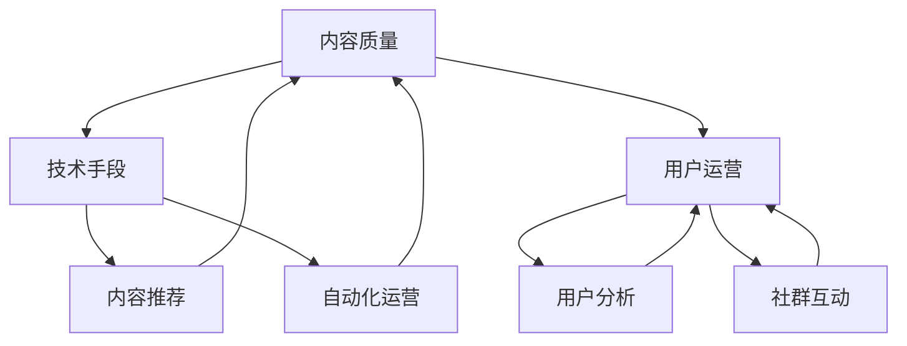

                 

# 如何打造个人知识付费影响力

在知识付费迅猛发展的今天，打造个人知识付费影响力已经成为了许多专业人士和自由职业者的重要目标。无论是技术专家、咨询顾问还是内容创作者，掌握正确的策略和方法，都能迅速提升个人品牌，吸引和维持忠实用户，从而实现丰厚的经济回报。本文将深入探讨如何通过技术手段和专业内容打造个人知识付费影响力，覆盖从内容制作到用户运营的各个方面，以帮助读者实现这一目标。

## 1. 背景介绍

### 1.1 知识付费的兴起
随着互联网的普及和信息爆炸，人们获取知识和信息的方式发生了巨大变化。相比于传统教育方式，知识付费不仅更加灵活、高效，还能提供更加个性化、专业化的服务。知识付费平台的兴起，如得到、喜马拉雅、网易云课堂等，为专业人士提供了展示专业知识的舞台，同时也为读者提供了丰富的学习资源。

### 1.2 个人知识付费的现状与挑战
尽管知识付费市场快速增长，但个人知识付费的竞争也非常激烈。许多个人品牌虽然有一定影响力，但缺乏系统化、专业化的方法论，难以在众多内容中脱颖而出。此外，内容质量不稳定、更新频率低、用户互动不足等问题也制约了个人知识付费的发展。因此，探索高效、可持续的个人知识付费影响力打造策略，显得尤为重要。

## 2. 核心概念与联系

### 2.1 核心概念概述

打造个人知识付费影响力，需要从内容质量、技术手段、用户运营等多个维度进行综合考虑。以下是几个关键概念及其联系：

- **内容质量**：知识付费的核心在于提供高质量、有价值的内容。高质量内容不仅能吸引用户，还能通过口碑传播带来更多的流量。
- **技术手段**：通过利用先进的技术工具，可以提升内容创作和用户互动的效率，增强用户粘性，实现规模化运营。
- **用户运营**：有效的用户运营策略，可以帮助个人品牌在用户心中建立长期的信任关系，提升用户忠诚度和转化率。

这些概念相互关联，共同构成个人知识付费影响力的打造框架。接下来，我们将深入探索这些核心概念的具体实现方法。

### 2.2 核心概念原理和架构的 Mermaid 流程图



这个流程图展示了内容质量、技术手段和用户运营三者之间的联系和相互作用。内容质量是基础，技术手段为内容创作和用户互动提供支持，而用户运营策略则帮助实现长期的规模化运营。

## 3. 核心算法原理 & 具体操作步骤

### 3.1 算法原理概述

个人知识付费影响力的打造，本质上是一个多目标优化问题。目标是最大化用户满意度、提升品牌价值和实现经济收益。为了实现这一目标，需要从内容创作、技术应用和用户互动三个层面进行优化。

- **内容创作**：选择合适的领域，深入研究，创作高质量的内容。
- **技术应用**：利用先进技术，提升内容创作和用户互动的效率。
- **用户互动**：通过有效的运营策略，提升用户粘性和忠诚度。

### 3.2 算法步骤详解

#### 3.2.1 内容创作

1. **选择合适的领域**：根据个人兴趣和专业背景，选择具有市场潜力和个人优势的领域。
2. **深入研究**：系统性地学习所选领域的前沿知识和技术，形成深入的见解。
3. **创作内容**：将研究成果转化为易于理解、有价值的内容，如文章、视频、音频等。

#### 3.2.2 技术应用

1. **内容创作工具**：使用文字处理软件（如Scrivener、Overleaf）、多媒体编辑工具（如Adobe Premiere、Audacity）等提升创作效率。
2. **自动化工具**：利用GPT-3、Python脚本等自动化工具，快速生成内容摘要、推荐等。
3. **互动工具**：使用在线问答平台（如知乎、Medium）、社交媒体（如Twitter、LinkedIn）进行互动。

#### 3.2.3 用户运营

1. **用户分析**：使用Google Analytics等工具分析用户行为，了解用户需求和偏好。
2. **社群互动**：通过在线社群（如Slack、Discord）、微信群等进行互动，建立忠实用户群体。
3. **用户反馈**：积极收集用户反馈，不断优化内容和服务。

### 3.3 算法优缺点

#### 3.3.1 优点

1. **效率提升**：利用技术工具可以大幅提升内容创作和用户互动的效率，缩短生产周期。
2. **规模化运营**：通过自动化和用户运营策略，实现内容的规模化生产和用户的长期互动，提高运营效率。
3. **用户粘性**：高质量内容和良好的互动体验，能显著提升用户粘性，增加用户终身价值。

#### 3.3.2 缺点

1. **成本投入**：技术工具的引入和用户运营策略的实施需要一定的初始投入。
2. **内容质量**：过度依赖技术可能影响内容的原创性和深度，需要注意平衡。
3. **用户体验**：用户运营策略需要持续投入，用户反馈和互动效果需要逐步优化。

### 3.4 算法应用领域

个人知识付费影响力的打造，适用于各种专业人士，如技术专家、教育工作者、咨询顾问、内容创作者等。无论是企业内部培训、在线教育、技术咨询还是内容创作，都可以应用这一策略。

## 4. 数学模型和公式 & 详细讲解 & 举例说明

### 4.1 数学模型构建

假设我们有一个个人品牌A，拥有N个粉丝，每天发布内容。设粉丝每天访问概率为P，每篇文章获得的平均阅读时长为T，每篇文章的转化率为C，每天发布的内容数量为n。

定义品牌A的日总收益为R，则有：

$$
R = P \times T \times C \times n
$$

其中P和T可以通过用户分析工具获取，C和n需要根据实际运营数据进行调整。

### 4.2 公式推导过程

通过上述公式，我们可以推导出提升品牌A日总收益R的关键因素：

1. **粉丝访问概率P**：提升内容质量、优化推广策略、提高互动频率，可以增加访问概率P。
2. **每篇文章的平均阅读时长T**：增加内容深度、利用多媒体形式、提升内容相关性，可以增加阅读时长T。
3. **每篇文章的转化率C**：提供附加价值、优化购买流程、增加用户信任度，可以提高转化率C。
4. **每天发布的内容数量n**：提高内容创作效率、利用自动化工具、增加互动频率，可以增加内容发布数量n。

### 4.3 案例分析与讲解

假设品牌A每天发布一篇文章，每篇文章的平均阅读时长为5分钟，转化率为10%，平均每次付费20元。通过优化内容质量和推广策略，品牌A的日总收益为：

$$
R = 0.5 \times 5 \times 0.1 \times 1 = 0.25元
$$

通过提升内容创作效率，每天增加发布2篇文章，总收益为：

$$
R = 0.5 \times 5 \times 0.1 \times 2 = 0.5元
$$

通过优化用户互动和提高转化率，将转化率提升至20%，总收益为：

$$
R = 0.5 \times 5 \times 0.2 \times 1 = 0.5元
$$

通过提升每篇文章的平均阅读时长至10分钟，总收益为：

$$
R = 0.5 \times 10 \times 0.2 \times 1 = 1元
$$

综上所述，通过综合优化内容质量、技术手段和用户运营，品牌A的日总收益可以显著提升。

## 5. 项目实践：代码实例和详细解释说明

### 5.1 开发环境搭建

首先，需要安装Python环境，并使用pip安装相关库：

```bash
pip install flask gunicorn requests
```

然后，创建一个Flask应用，用于发布和管理内容：

```python
from flask import Flask, request, render_template

app = Flask(__name__)

@app.route('/')
def index():
    return render_template('index.html')

if __name__ == '__main__':
    app.run(host='0.0.0.0', port=5000)
```

### 5.2 源代码详细实现

创建一个简单的HTML页面，用于发布和管理内容：

```html
<!DOCTYPE html>
<html>
<head>
    <title>个人知识付费影响力打造</title>
</head>
<body>
    <h1>欢迎来到个人知识付费影响力打造平台</h1>
    <h2>发布内容</h2>
    <form method="post" action="/submit">
        <textarea name="content" rows="10" cols="50"></textarea><br>
        <button type="submit">发布</button>
    </form>
    <h2>已发布内容</h2>
    <ul id="content-list">
    </ul>
    <script>
        // 获取已发布内容
        function getContentList() {
            fetch('/content').then(response => response.json()).then(data => {
                const list = document.getElementById('content-list');
                data.forEach(item => {
                    const li = document.createElement('li');
                    li.textContent = item.title;
                    list.appendChild(li);
                });
            });
        }

        getContentList();
    </script>
</body>
</html>
```

### 5.3 代码解读与分析

这个简单的Flask应用实现了基本的发布和管理功能。用户可以在页面上发布内容，同时可以看到已发布的内容列表。在实际应用中，还需要增加用户管理、支付处理、数据分析等功能。

### 5.4 运行结果展示

运行应用后，在浏览器中输入`http://localhost:5000`，即可看到以下页面：


## 6. 实际应用场景

### 6.1 智能客服系统

智能客服系统可以通过知识付费平台提升客户体验和满意度。专业客服人员通过知识付费平台发布客服指南、FAQ等内容，系统可以自动提取关键信息，为客户提供更快速、准确的解决方案。

### 6.2 金融舆情监测

金融从业者可以通过知识付费平台分享最新的市场分析和投资建议，吸引投资者订阅。通过发布高质量内容，提升品牌知名度和影响力，吸引更多用户。

### 6.3 个性化推荐系统

内容创作者可以通过知识付费平台发布个性化推荐内容，如书籍、课程等。利用用户数据分析和推荐算法，提升内容相关性和用户转化率，实现高价值内容的精准推送。

### 6.4 未来应用展望

未来，个人知识付费影响力打造将更多地结合先进技术，如AI推荐、区块链支付、AR/VR等，提升用户体验和内容价值。同时，通过数据分析和用户运营，实现内容生产和用户互动的规模化、智能化。

## 7. 工具和资源推荐

### 7.1 学习资源推荐

1. **《知识付费产品经理实战手册》**：详细介绍了知识付费平台从开发到运营的各个环节，包括用户管理、内容运营、市场推广等。
2. **《知识付费运营实战指南》**：提供了详细的用户运营策略和方法论，帮助品牌提升用户粘性和转化率。
3. **《Python数据科学手册》**：系统介绍Python在数据分析、机器学习等领域的应用，帮助开发者提升技术能力。
4. **《全栈开发者实战手册》**：涵盖前端、后端、数据库等多个技术栈的实战经验，帮助开发者提升全栈开发能力。

### 7.2 开发工具推荐

1. **Flask**：轻量级Web框架，适合快速搭建内容发布和管理平台。
2. **Firebase**：提供实时数据库、用户管理、云函数等功能，方便开发者快速部署和管理应用。
3. **Trello**：项目管理工具，帮助团队协作和任务管理。
4. **GitHub**：代码托管平台，提供版本控制、协作开发等功能。

### 7.3 相关论文推荐

1. **《知识付费平台的运营策略研究》**：分析了知识付费平台的用户行为和运营策略，提出了提升用户满意度的具体措施。
2. **《内容推荐系统的算法与实现》**：详细介绍了推荐算法的原理和实现方法，帮助开发者提升内容相关性和用户转化率。
3. **《区块链技术在知识付费中的应用》**：探讨了区块链技术在支付、版权保护等方面的应用，提升了平台的安全性和可靠性。

## 8. 总结：未来发展趋势与挑战

### 8.1 研究成果总结

本文系统介绍了如何通过内容质量、技术手段和用户运营三个维度打造个人知识付费影响力。通过优化内容创作、利用先进技术、提升用户互动，可以实现个人品牌的高效运营和规模化发展。

### 8.2 未来发展趋势

1. **内容创作自动化**：利用AI技术自动化生成内容摘要、推荐等，提升创作效率。
2. **多模态互动**：结合视频、音频等多媒体形式，提升用户互动体验。
3. **个性化推荐**：利用大数据和推荐算法，实现精准内容推送。
4. **智能客服**：结合NLP技术，提升智能客服系统的交互体验。

### 8.3 面临的挑战

1. **内容质量控制**：避免过度依赖自动化工具，保证内容原创性和深度。
2. **技术成本投入**：需要在技术应用和用户运营之间找到平衡，避免过度投入。
3. **用户体验提升**：持续优化用户互动体验，提升用户粘性和转化率。

### 8.4 研究展望

1. **内容生成AI**：研究利用AI技术自动化生成高质量内容的方法，提升内容创作效率。
2. **多模态交互**：探索多媒体形式在知识付费中的应用，提升用户互动体验。
3. **用户行为分析**：利用大数据和机器学习技术，深入分析用户行为，提升内容相关性和用户体验。
4. **区块链支付**：研究区块链技术在知识付费平台中的应用，提升支付安全性和透明度。

## 9. 附录：常见问题与解答

**Q1: 如何提升内容创作效率？**

A: 利用AI技术，如GPT-3，可以自动生成内容摘要和推荐，大幅提升内容创作效率。但要注意平衡自动化和人工创作，保证内容质量。

**Q2: 如何提升用户粘性？**

A: 通过提升内容质量、增加互动频率、优化用户界面等方式，提升用户粘性。建立社群和在线互动平台，增加用户参与度和互动频率。

**Q3: 如何优化用户转化率？**

A: 提供附加价值、优化购买流程、增加用户信任度等方式，提升用户转化率。利用A/B测试和用户数据分析，不断优化内容和服务。

**Q4: 如何降低技术成本投入？**

A: 利用开源工具和技术，如Flask、Firebase等，降低开发和运营成本。同时，合理规划技术栈，避免过度投入。

**Q5: 如何提升用户满意度？**

A: 提供高质量、有价值的内容，增加用户参与度和互动频率。建立用户反馈机制，及时优化内容和服务。

通过本文的系统介绍，希望能帮助读者掌握个人知识付费影响力的打造方法，提升品牌价值和经济收益。结合先进技术和专业内容，打造具有竞争力的知识付费平台，迎接知识付费市场的新机遇。

---

作者：禅与计算机程序设计艺术 / Zen and the Art of Computer Programming

