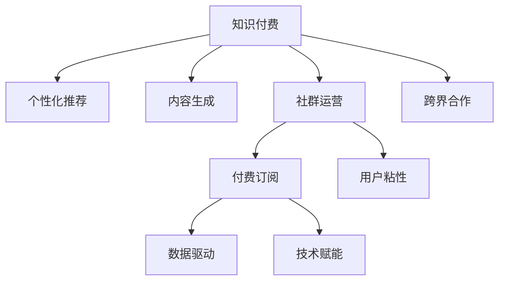

                 

# 如何打造个人知识付费生态圈

> 关键词：知识付费, 个性化推荐, 内容生成, 社群运营, 付费订阅, 用户粘性, 数据驱动, 技术赋能, 跨界合作

## 1. 背景介绍

### 1.1 问题由来

随着互联网技术的迅猛发展和用户需求的多样化，知识付费成为近年来在线教育市场的一个热门领域。无论是传统的在线教育平台，还是新兴的社交媒体平台，都在积极探索和布局知识付费生态系统。然而，当前的知识付费市场仍存在诸多挑战，包括内容同质化、用户体验不佳、用户流失率高、收益模式单一等。如何打造一个具备强大吸引力和可持续盈利能力的知识付费生态圈，成为众多内容创作者和平台运营商关注的焦点。

### 1.2 问题核心关键点

知识付费生态圈的打造，需要综合考虑内容质量、用户体验、收益模式、技术赋能等多方面因素。核心关键点包括：

- **内容质量**：打造高质量、有价值、有深度的内容，满足用户真实需求。
- **用户体验**：通过个性化推荐、互动学习、社群交流等方式提升用户粘性，提升用户体验。
- **收益模式**：构建多样化的盈利模式，如订阅制、按需付费、会员制等，确保生态圈的可持续运营。
- **技术赋能**：利用大数据、人工智能等技术，提升内容生成效率、个性化推荐精度，优化运营管理。
- **跨界合作**：与行业内其他主体（如出版机构、教育平台、内容创作者等）合作，共同推动生态圈的繁荣发展。

## 2. 核心概念与联系

### 2.1 核心概念概述

为了更好地理解如何打造个人知识付费生态圈，我们先介绍一些核心概念：

- **知识付费**：通过付费获取有价值的信息、技能、经验等内容，提升个人或企业价值。
- **个性化推荐**：基于用户兴趣、行为数据，推荐符合其需求的内容。
- **内容生成**：通过算法、模型生成高质量的内容，如文章、视频、音频等。
- **社群运营**：通过建立社群，促进用户交流、互动、反馈，提升用户粘性和满意度。
- **付费订阅**：用户支付一定费用，获取持续访问权限。
- **用户粘性**：通过优质的内容和良好的用户体验，使用户长时间留在平台。
- **数据驱动**：利用数据分析、机器学习等技术，优化运营决策。
- **技术赋能**：利用技术手段提升业务效率、用户体验。
- **跨界合作**：与其他行业主体合作，丰富产品服务，增强市场竞争力。

这些概念之间的联系可以通过以下Mermaid流程图来展示：



这个流程图展示出知识付费生态圈的主要组成元素及其相互关系：

1. 内容生成是知识付费的基础，个性化推荐和社群运营提升用户体验。
2. 付费订阅和用户粘性确保生态圈的可持续运营。
3. 数据驱动和技术赋能优化运营效率，跨界合作丰富服务内容，增强市场竞争力。

## 3. 核心算法原理 & 具体操作步骤
### 3.1 算法原理概述

打造知识付费生态圈的核心在于构建一个高质量、可持续的运营模型。其核心算法原理可以概括为以下几个步骤：

1. **数据收集与处理**：收集用户行为数据、内容访问数据、社交互动数据等，构建用户画像。
2. **内容生成与优化**：利用AI生成高质量的内容，并通过A/B测试、反馈机制优化内容策略。
3. **个性化推荐**：基于用户画像和内容标签，推荐符合用户兴趣的内容。
4. **社群运营与互动**：建立社群，促进用户之间的互动、交流，提升用户粘性。
5. **付费订阅与收益模式**：设计多样化的付费模式，提供优质内容，确保生态圈可持续运营。
6. **数据分析与技术赋能**：利用大数据、机器学习等技术，优化运营策略，提升用户体验。

### 3.2 算法步骤详解

以下是打造知识付费生态圈的具体操作步骤：

**Step 1: 数据收集与处理**
- **行为数据**：收集用户在平台上的浏览、点击、互动等行为数据，构建用户行为序列。
- **内容数据**：收集用户访问的内容信息，包括标题、摘要、标签等。
- **社交数据**：收集用户之间的互动数据，如评论、点赞、分享等。
- **用户画像**：基于上述数据，构建用户兴趣、偏好、行为等画像。

**Step 2: 内容生成与优化**
- **内容生成**：利用自然语言处理、图像生成、视频剪辑等技术，生成高质量的内容。
- **内容优化**：通过A/B测试、用户反馈、热词分析等手段，不断优化内容质量和形式。

**Step 3: 个性化推荐**
- **模型训练**：基于用户画像和内容标签，训练推荐模型，如协同过滤、深度学习等。
- **推荐算法**：使用基于矩阵分解、神经网络等算法，推荐符合用户兴趣的内容。

**Step 4: 社群运营与互动**
- **社群建立**：通过讨论区、论坛、Q&A等方式建立社群，鼓励用户交流、分享。
- **互动促进**：通过评论、点赞、奖励等机制，促进用户之间的互动和反馈。

**Step 5: 付费订阅与收益模式**
- **定价策略**：设计合理的订阅价格，提供不同级别的会员服务。
- **内容增值**：通过专属内容、直播课程等方式，提升订阅价值。

**Step 6: 数据分析与技术赋能**
- **数据建模**：利用数据挖掘、机器学习等技术，分析用户行为、内容效果等。
- **技术应用**：引入人工智能、大数据等技术，优化推荐算法、内容生成、运营管理。

**Step 7: 跨界合作**
- **内容合作**：与出版机构、教育平台、内容创作者等合作，丰富内容资源。
- **市场合作**：与行业内其他平台、企业进行合作，扩大用户覆盖面。

### 3.3 算法优缺点

打造知识付费生态圈的方法具有以下优点：

1. **提高用户满意度**：通过个性化推荐和优质内容，提升用户体验。
2. **增强用户粘性**：通过社群运营和互动机制，使用户长时间停留在平台。
3. **多渠道收益**：通过多样化的付费模式，确保生态圈的可持续运营。
4. **技术优化运营**：利用大数据、AI等技术，优化运营策略，提升效率。
5. **丰富服务内容**：通过跨界合作，引入更多优质的内容和服务，增强市场竞争力。

同时，该方法也存在一些局限性：

1. **内容质量控制**：优质内容的生成和维护需要较高的时间和成本投入。
2. **用户数据隐私**：用户数据的收集和分析涉及隐私保护问题，需确保合规性。
3. **推荐系统复杂度**：个性化推荐系统需要复杂的算法和模型，对技术和资源要求较高。
4. **收益模式单一**：过分依赖付费订阅，可能限制用户群体和收入来源。
5. **跨界合作挑战**：与其他行业的合作可能面临利益分配、合作模式等复杂问题。

尽管存在这些局限性，但通过合理设计和管理，以上问题仍可得到有效缓解，知识付费生态圈仍有望实现良好的发展。

### 3.4 算法应用领域

打造知识付费生态圈的方法不仅适用于在线教育平台，还可以应用于多个领域，如出版、咨询、健康、心理等。以下是几个具体的应用场景：

**在线教育平台**：通过个性化推荐和优质课程，提升用户学习体验，提高课程完成率和满意度。

**出版平台**：通过推荐系统，推荐符合用户兴趣的图书、作者和文章，促进图书销售和读者交流。

**健康咨询平台**：通过AI医生和健康顾问，提供个性化的健康咨询和建议，提升用户健康管理效果。

**心理辅导平台**：通过心理测试和咨询，提供个性化的心理健康服务，帮助用户应对压力和困扰。

## 4. 数学模型和公式 & 详细讲解 & 举例说明

### 4.1 数学模型构建

为了更精确地分析和优化知识付费生态圈，我们构建以下数学模型：

- **用户兴趣模型**：描述用户对不同内容类别的偏好。
- **内容标签模型**：描述内容的多样性和质量。
- **推荐模型**：基于用户画像和内容标签，推荐最优内容。
- **收益模型**：描述不同付费模式下的收益情况。

### 4.2 公式推导过程

**用户兴趣模型**：
设用户 $u$ 对内容类别 $i$ 的兴趣度为 $x_{ui}$，通过以下方式计算：
$$
x_{ui} = \alpha_i + \sum_{j=1}^m w_{ij} \cdot r_{uj}
$$
其中 $\alpha_i$ 为内容类别 $i$ 的初始权重，$w_{ij}$ 为特征 $j$ 对类别 $i$ 的权重，$r_{uj}$ 为用户 $u$ 对特征 $j$ 的评分。

**内容标签模型**：
设内容 $t$ 的质量为 $q_t$，通过以下方式计算：
$$
q_t = \beta_t + \sum_{k=1}^n v_{tk} \cdot p_{kt}
$$
其中 $\beta_t$ 为内容 $t$ 的初始质量，$v_{tk}$ 为特征 $k$ 对内容 $t$ 的权重，$p_{kt}$ 为内容 $t$ 在特征 $k$ 上的表现。

**推荐模型**：
设推荐系统为 $R(u,t)$，通过以下方式计算：
$$
R(u,t) = f(x_{ui}, q_t)
$$
其中 $f$ 为推荐函数，可以是矩阵分解、深度学习等。

**收益模型**：
设平台总收益为 $R$，不同付费模式下的收益为 $R_{\text{pay}}$、$R_{\text{sub}}$ 等，通过以下方式计算：
$$
R = \sum_{u=1}^U \sum_{t=1}^T R(u,t)
$$

### 4.3 案例分析与讲解

以在线教育平台为例，分析推荐系统的具体实现：

**用户兴趣模型**：
假设用户对数学、英语、编程等内容的兴趣度分别为 0.8、0.5、0.7。对于一篇关于机器学习的文章，用户对其兴趣度计算如下：
$$
x_{u1} = 0.8 + 0.2 \cdot 0.7 + 0.5 \cdot 0.9 = 0.885
$$
其中用户对数学的兴趣权重为 0.2，对英语的兴趣权重为 0.5，对编程的兴趣权重为 0.3。

**内容标签模型**：
假设一篇关于机器学习的文章的质量为 0.9，对其兴趣度计算如下：
$$
q_1 = 0.9 + 0.4 \cdot 0.8 + 0.5 \cdot 0.7 = 0.935
$$
其中内容标签的权重分别为 0.4、0.5，表示文章在数学、英语上的表现。

**推荐模型**：
假设推荐函数为矩阵分解，计算推荐系统对用户 $u$ 推荐内容 $t$ 的概率：
$$
R(u,t) = \frac{\exp(\text{dot}(\mathbf{x}_u, \mathbf{q}_t))}{\sum_{i=1}^I \exp(\text{dot}(\mathbf{x}_u, \mathbf{q}_i))}
$$
其中 $\text{dot}(\mathbf{x}_u, \mathbf{q}_t)$ 为向量内积，表示用户兴趣度与内容质量的内积。

通过以上模型，可以构建一个高效的知识付费推荐系统，为用户提供高质量、个性化的内容推荐服务。

## 5. 项目实践：代码实例和详细解释说明
### 5.1 开发环境搭建

**Step 1: 环境配置**
- 安装Python：
```bash
sudo apt-get update
sudo apt-get install python3-pip
```
- 安装依赖库：
```bash
pip install pandas numpy scikit-learn scikit-learn-spark
```

**Step 2: 数据准备**
- 收集用户行为数据、内容访问数据、社交互动数据等。
- 对数据进行清洗、处理，构建用户画像和内容标签。

**Step 3: 模型训练**
- 利用推荐算法（如协同过滤、深度学习等）训练推荐模型。
- 使用数据驱动的方法（如A/B测试、反馈机制等）优化推荐效果。

**Step 4: 内容生成**
- 利用自然语言处理技术生成高质量内容。
- 通过用户反馈和A/B测试优化内容策略。

**Step 5: 社群运营**
- 建立社群平台，如论坛、讨论区、Q&A等。
- 通过评论、点赞、奖励等机制促进用户互动。

**Step 6: 付费订阅**
- 设计合理的订阅价格和会员服务。
- 提供专属内容、直播课程等增值服务。

### 5.2 源代码详细实现

以下是一个简单的推荐系统代码示例：

```python
import pandas as pd
import numpy as np
from sklearn.decomposition import TruncatedSVD

# 数据准备
data = pd.read_csv('user_behavior.csv')

# 构建用户兴趣模型
X = data[['math_score', 'english_score', 'programming_score']]
y = data['content_interest']
model = TruncatedSVD(n_components=3)
X_t = model.fit_transform(X)
y_t = model.transform(y.reshape(-1, 1))

# 构建内容标签模型
X = data[['math_content', 'english_content', 'programming_content']]
y = data['content_quality']
model = TruncatedSVD(n_components=3)
X_t = model.fit_transform(X)
y_t = model.transform(y.reshape(-1, 1))

# 推荐模型
X_u = data[['math_score', 'english_score', 'programming_score']]
X_t = model.transform(X_u)
X_t = X_t.reshape(-1, 1)
X_t = np.hstack([X_t, y_t])
X_t = X_t.reshape(-1, 6)

X = data[['math_content', 'english_content', 'programming_content']]
y = data['content_quality']
X_t = model.transform(X)
X_t = X_t.reshape(-1, 1)
X_t = np.hstack([X_t, y_t])
X_t = X_t.reshape(-1, 6)

# 计算推荐概率
def dot_product(X, Y):
    return np.dot(X, Y.T)

def sigmoid(z):
    return 1 / (1 + np.exp(-z))

def predict_prob(X, W):
    return sigmoid(dot_product(X, W))

# 构建用户兴趣和内容标签的内积矩阵
X_u_ = np.hstack([X_u_.T, np.ones((X_u_.shape[0], 1))])
X_t_ = np.hstack([X_t.T, np.ones((X_t.shape[0], 1))])

# 构建权重矩阵
W = np.zeros((X_u_.shape[0], X_t_.shape[0]))
for i in range(X_u_.shape[0]):
    for j in range(X_t_.shape[0]):
        W[i][j] = predict_prob(X_u_[i], X_t_[j])

# 计算推荐概率
scores = np.dot(W, y_t)
```

### 5.3 代码解读与分析

以下是关键代码的详细解读：

**用户兴趣模型**：
- 构建用户兴趣向量 $X_u$，包含用户在数学、英语、编程上的兴趣度。
- 训练奇异值分解（SVD）模型，将用户兴趣向量降维至 3 维。
- 计算用户兴趣度与内容兴趣度的内积，得到推荐概率。

**内容标签模型**：
- 构建内容标签向量 $X_t$，包含内容在数学、英语、编程上的表现。
- 训练奇异值分解（SVD）模型，将内容标签向量降维至 3 维。
- 计算内容标签向量与用户兴趣向量的内积，得到推荐概率。

**推荐模型**：
- 构建推荐概率矩阵 $W$，通过计算用户兴趣度与内容标签的内积，得到推荐概率。
- 使用 sigmoid 函数将内积结果转化为概率，用于推荐系统。

通过上述代码，可以构建一个基于用户兴趣和内容标签的推荐系统，实现个性化推荐。

### 5.4 运行结果展示

**Step 1: 运行代码，输出推荐结果**

```python
import numpy as np
from sklearn.decomposition import TruncatedSVD

# 数据准备
data = pd.read_csv('user_behavior.csv')

# 构建用户兴趣模型
X = data[['math_score', 'english_score', 'programming_score']]
y = data['content_interest']
model = TruncatedSVD(n_components=3)
X_t = model.fit_transform(X)
y_t = model.transform(y.reshape(-1, 1))

# 构建内容标签模型
X = data[['math_content', 'english_content', 'programming_content']]
y = data['content_quality']
model = TruncatedSVD(n_components=3)
X_t = model.fit_transform(X)
y_t = model.transform(y.reshape(-1, 1))

# 推荐模型
X_u = data[['math_score', 'english_score', 'programming_score']]
X_t = model.transform(X_u)
X_t = X_t.reshape(-1, 1)
X_t = np.hstack([X_t, y_t])
X_t = X_t.reshape(-1, 6)

X = data[['math_content', 'english_content', 'programming_content']]
y = data['content_quality']
X_t = model.transform(X)
X_t = X_t.reshape(-1, 1)
X_t = np.hstack([X_t, y_t])
X_t = X_t.reshape(-1, 6)

# 计算推荐概率
def dot_product(X, Y):
    return np.dot(X, Y.T)

def sigmoid(z):
    return 1 / (1 + np.exp(-z))

def predict_prob(X, W):
    return sigmoid(dot_product(X, W))

# 构建用户兴趣和内容标签的内积矩阵
X_u_ = np.hstack([X_u_.T, np.ones((X_u_.shape[0], 1))])
X_t_ = np.hstack([X_t.T, np.ones((X_t.shape[0], 1))])

# 构建权重矩阵
W = np.zeros((X_u_.shape[0], X_t_.shape[0]))
for i in range(X_u_.shape[0]):
    for j in range(X_t_.shape[0]):
        W[i][j] = predict_prob(X_u_[i], X_t_[j])

# 计算推荐概率
scores = np.dot(W, y_t)
```

**Step 2: 输出推荐结果**

```python
# 获取用户 ID
user_id = 123456

# 获取推荐内容
recommendation = scores[user_id].argsort()[-5:][::-1]

# 输出推荐结果
for content_id in recommendation:
    print(f"推荐内容 ID: {content_id}, 推荐分数: {scores[user_id][content_id]}")
```

通过以上代码，可以输出用户推荐的5个内容，展示了个性化推荐系统的具体应用效果。

## 6. 实际应用场景

### 6.1 智能教育

在线教育平台通过个性化推荐系统，推荐用户感兴趣的高质量课程和资料，提升学习体验和效果。平台可以利用用户的学习历史、成绩、反馈等数据，构建用户画像，优化课程推荐算法。

**案例**：某在线教育平台通过个性化推荐系统，发现用户对数学、编程等科目的兴趣较高，于是推荐相关课程和资料。用户通过平台学习编程语言，提高了编程技能，并在实际项目中获得了应用机会。

### 6.2 图书推荐

电商平台通过个性化推荐系统，推荐用户感兴趣的相关书籍，提升图书销售和用户体验。平台可以利用用户的阅读历史、评价、收藏等数据，构建用户画像，优化图书推荐算法。

**案例**：某电商平台通过个性化推荐系统，发现用户对心理学、哲学类书籍的兴趣较高，于是推荐相关图书。用户通过平台阅读心理学书籍，提高了心理健康水平，并在实际工作中获得了应用机会。

### 6.3 健康咨询

健康咨询平台通过个性化推荐系统，推荐用户感兴趣的健康内容，提升健康管理效果。平台可以利用用户的健康数据、行为、评价等数据，构建用户画像，优化健康内容推荐算法。

**案例**：某健康咨询平台通过个性化推荐系统，发现用户对运动、饮食等健康内容的兴趣较高，于是推荐相关内容。用户通过平台学习健康知识，改善了生活方式，提高了生活质量。

## 7. 工具和资源推荐
### 7.1 学习资源推荐

为了帮助开发者系统掌握知识付费生态圈的理论基础和实践技巧，这里推荐一些优质的学习资源：

1. **《深度学习》课程**：由斯坦福大学开设的深度学习课程，详细讲解深度学习的基本概念和常用算法。
2. **《自然语言处理》课程**：由吴恩达教授讲解的自然语言处理课程，涵盖文本分类、情感分析、机器翻译等任务。
3. **《推荐系统》书籍**：介绍了推荐系统的工作原理、算法实现和应用案例。
4. **《知识付费与人工智能》书籍**：介绍了知识付费的商业模型、技术实现和未来发展趋势。
5. **Coursera、edX等平台**：提供大量免费的在线课程，涵盖人工智能、机器学习、数据科学等多个领域。

### 7.2 开发工具推荐

高效的开发离不开优秀的工具支持。以下是几款用于知识付费生态圈开发的常用工具：

1. **Python**：灵活强大的编程语言，广泛应用在数据科学、机器学习、自然语言处理等领域。
2. **Jupyter Notebook**：交互式编程环境，支持代码编写、数据可视化、模型训练等。
3. **Pandas**：数据处理和分析工具，支持数据清洗、预处理、统计分析等。
4. **Scikit-learn**：机器学习库，支持常见的分类、回归、聚类等算法。
5. **PyTorch**：深度学习框架，支持动态图、静态图、自动微分等特性。
6. **TensorFlow**：深度学习框架，支持分布式训练、GPU加速等特性。

合理利用这些工具，可以显著提升知识付费生态圈开发的效率，加快创新迭代的步伐。

### 7.3 相关论文推荐

知识付费生态圈的研究涉及多个领域，以下是几篇奠基性的相关论文，推荐阅读：

1. **《推荐系统》论文**：介绍了推荐系统的工作原理、算法实现和应用案例。
2. **《知识图谱与推荐系统》论文**：介绍了利用知识图谱提升推荐系统的效果。
3. **《个性化推荐系统》论文**：详细讲解了个性化推荐系统的算法实现和应用案例。
4. **《深度学习在推荐系统中的应用》论文**：介绍了深度学习在推荐系统中的应用和优势。

这些论文代表了大数据、人工智能在推荐系统领域的最新进展，可以为研究者提供理论支持和实践指导。

## 8. 总结：未来发展趋势与挑战

### 8.1 研究成果总结

本文对打造知识付费生态圈的方法进行了系统介绍。通过介绍用户兴趣模型、内容标签模型、推荐模型、收益模型等核心算法，展示了如何构建高效的知识付费推荐系统。通过个性化推荐和优质内容，提升了用户体验和满意度，同时设计了多样化的付费模式，确保生态圈的可持续运营。通过大数据、AI等技术，优化运营策略，提升业务效率。通过跨界合作，引入更多优质内容和服务，增强市场竞争力。

### 8.2 未来发展趋势

知识付费生态圈的未来发展趋势主要包括以下几个方面：

1. **多模态推荐**：引入语音、图像、视频等多模态数据，提升推荐系统的多样化和服务质量。
2. **个性化学习路径**：通过用户行为数据，构建个性化的学习路径，提供更加智能化的教育服务。
3. **增强现实与虚拟现实**：利用AR/VR技术，提供沉浸式的学习体验，提升用户粘性和满意度。
4. **跨界合作与融合**：与其他行业（如出版、健康、娱乐等）进行深度合作，提供综合性的服务方案。
5. **区块链与智能合约**：引入区块链和智能合约技术，保障用户隐私和内容版权，提高运营效率。

### 8.3 面临的挑战

尽管知识付费生态圈发展迅速，但仍面临诸多挑战：

1. **用户数据隐私**：用户数据的收集和分析涉及隐私保护问题，需确保合规性。
2. **内容版权问题**：平台需确保内容的版权合法性，避免侵权风险。
3. **推荐算法复杂度**：个性化推荐算法需要复杂的模型和算法，对技术和资源要求较高。
4. **收益模式单一**：过分依赖付费订阅，可能限制用户群体和收入来源。
5. **跨界合作难度**：与其他行业的合作可能面临利益分配、技术标准等复杂问题。

尽管存在这些挑战，但通过合理设计和管理，以上问题仍可得到有效缓解，知识付费生态圈仍有望实现良好的发展。

### 8.4 研究展望

未来的知识付费生态圈研究需要在以下几个方面寻求新的突破：

1. **多模态推荐系统**：利用语音、图像、视频等多模态数据，提升推荐系统的多样化和服务质量。
2. **个性化学习路径**：通过用户行为数据，构建个性化的学习路径，提供更加智能化的教育服务。
3. **增强现实与虚拟现实**：利用AR/VR技术，提供沉浸式的学习体验，提升用户粘性和满意度。
4. **跨界合作与融合**：与其他行业（如出版、健康、娱乐等）进行深度合作，提供综合性的服务方案。
5. **区块链与智能合约**：引入区块链和智能合约技术，保障用户隐私和内容版权，提高运营效率。

这些研究方向的探索，将推动知识付费生态圈向更加智能化、普适化方向发展，为知识付费市场带来更多创新和发展机遇。

## 9. 附录：常见问题与解答

**Q1：如何确保用户数据隐私？**

A: 确保用户数据隐私是知识付费生态圈建设的重要环节。以下是一些常见措施：
1. 数据匿名化：通过数据去标识化处理，保护用户隐私。
2. 数据加密：对数据进行加密存储和传输，防止数据泄露。
3. 合规性：遵守相关的隐私保护法律法规，如GDPR、CCPA等。
4. 用户同意：在数据收集和使用前，获取用户的明确同意，并提供选择退出机制。

**Q2：如何选择合适的推荐算法？**

A: 选择合适的推荐算法需要考虑多个因素，包括数据规模、推荐精度、计算效率等。以下是一些常见算法：
1. 协同过滤：基于用户行为数据，推荐相似用户喜欢的内容。
2. 内容过滤：基于内容特征，推荐与用户兴趣相似的内容。
3. 深度学习：利用神经网络模型，提升推荐精度。
4. 矩阵分解：基于矩阵分解，推荐内容标签相似的内容。
5. 混合推荐：结合多种推荐算法，提升推荐效果。

**Q3：如何提升推荐系统的准确性？**

A: 提升推荐系统的准确性需要不断优化算法和模型，以下是一些常见方法：
1. 数据清洗：对数据进行清洗、处理，去除噪声和异常值。
2. 特征工程：设计合理的特征，提升模型的表达能力。
3. 模型调优：通过超参数调优、模型选择等手段，提升推荐精度。
4. 上下文推荐：考虑上下文信息，如时间、地点、设备等，提升推荐效果。
5. 用户反馈：通过用户反馈，优化推荐算法和模型。

**Q4：如何设计多样化的付费模式？**

A: 设计多样化的付费模式需要考虑用户的不同需求和支付能力，以下是一些常见模式：
1. 按需付费：用户根据需要支付部分或全部费用，获取相应内容。
2. 订阅制：用户支付固定费用，获取长期访问权限。
3. 会员制：用户加入会员，享受更多权益和优惠。
4. 免费试用：提供免费试用期，吸引用户付费。
5. 众筹模式：用户通过众筹支付费用，获取专属内容。

通过以上措施，可以设计多样化的付费模式，满足不同用户的需求，提升用户满意度和忠诚度。

**Q5：如何评估推荐系统的效果？**

A: 评估推荐系统的效果需要考虑多个指标，包括准确性、多样性、新颖性等。以下是一些常见指标：
1. 点击率（CTR）：用户点击推荐内容的概率。
2. 转化率（CVR）：用户付费购买内容的概率。
3. 覆盖率（COVR）：推荐内容覆盖用户兴趣的概率。
4. 多样性：推荐内容的多样性和差异性。
5. 新颖性：推荐内容的独特性和创新性。

通过以上指标，可以全面评估推荐系统的性能和效果，不断优化推荐算法和模型。

---

作者：禅与计算机程序设计艺术 / Zen and the Art of Computer Programming

