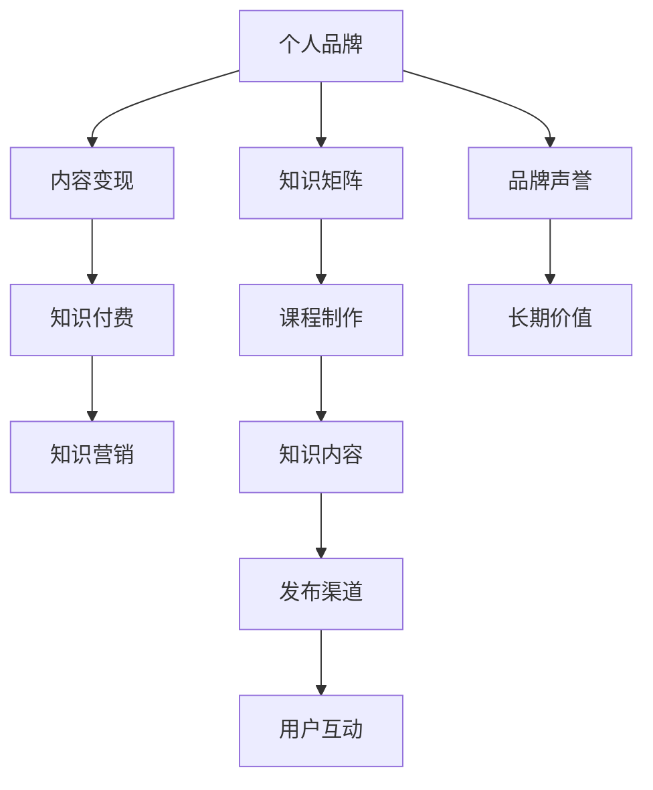

                 

# 如何打造个人知识付费矩阵

> 关键词：知识付费,个人品牌,内容变现,知识营销,技能矩阵,课程制作

## 1. 背景介绍

在知识经济时代，个人品牌和内容变现成为许多人的职业目标。随着互联网技术的发展，知识付费平台如雨后春笋般涌现，个人通过优质内容实现商业变现变得前所未有的便捷。打造个人知识付费矩阵，不仅能够提升个人品牌价值，还能实现多渠道内容变现。本文将从核心概念、算法原理、操作步骤等方面系统探讨如何打造个人知识付费矩阵，希望能为有志于内容变现的朋友们提供有价值的参考。

## 2. 核心概念与联系

### 2.1 核心概念概述

- **个人品牌（Personal Branding）**：指个人在特定领域或职业上建立的专业形象和声誉，通过展示专业技能、行业知识、个性魅力等吸引目标受众。
- **内容变现（Content Monetization）**：指将原创内容转化为商业价值的过程，包括但不限于内容订阅、课程销售、内容授权等形式。
- **知识付费（Knowledge Pricing）**：指用户为获取高价值、高质量的知识内容而愿意支付费用的商业模式。
- **知识营销（Knowledge Marketing）**：指通过提供高质量的知识内容，建立个人品牌和提升品牌影响力，进而实现商业变现的策略。
- **知识矩阵（Knowledge Matrix）**：指个人根据自身的技能、知识储备、市场需求等，设计的内容组合和盈利模式矩阵，涵盖不同类型的知识内容和服务。
- **课程制作（Course Production）**：指根据市场需求，策划、开发、制作和发布在线课程的过程。

这些核心概念相互联系，共同构成了个人知识付费矩阵的基石。通过系统化的规划和操作，能够高效地实现个人品牌的价值变现，同时提供有价值的知识内容，满足市场需求。

### 2.2 核心概念原理和架构的 Mermaid 流程图



此流程图展示了个人品牌与内容变现、知识付费、知识营销、知识矩阵、课程制作、知识内容、发布渠道、用户互动、品牌声誉及长期价值之间的联系和互动。

## 3. 核心算法原理 & 具体操作步骤

### 3.1 算法原理概述

打造个人知识付费矩阵，本质上是一个多维度优化和策略执行的过程。它涉及到内容策划、市场定位、渠道运营、用户互动等多个方面。核心算法原理包括以下几个方面：

1. **需求分析（Demand Analysis）**：通过市场调研和用户反馈，分析目标受众的偏好、痛点、需求等，为内容制作提供依据。
2. **内容策划（Content Planning）**：根据需求分析结果，策划出符合市场需求的课程主题和内容结构。
3. **课程制作（Course Production）**：利用多媒体工具和技术，制作高价值、高质量的课程内容。
4. **市场推广（Market Promotion）**：通过多渠道推广，吸引目标受众，并引导其转化为付费用户。
5. **用户互动（User Engagement）**：通过在线互动、社群运营等方式，提升用户粘性，增强品牌忠诚度。
6. **收益循环（Revenue Cycle）**：实现从内容到用户的有效转化，并持续优化盈利模式。

这些步骤形成一个闭环，不断优化和迭代，以实现个人知识付费矩阵的最大化价值。

### 3.2 算法步骤详解

以下是打造个人知识付费矩阵的具体操作步骤：

**Step 1: 需求分析**
- 进行市场调研，收集目标受众的年龄、性别、职业、兴趣等信息。
- 通过问卷调查、访谈等方式，了解受众的痛点、需求、兴趣点。
- 分析竞争对手的课程和市场反馈，找出自身的优势和劣势。

**Step 2: 内容策划**
- 根据需求分析结果，确定课程主题和内容框架。
- 设计课程大纲，确定知识点分布、难度层次、学习目标等。
- 规划课程形式，如视频、音频、图文、直播等。

**Step 3: 课程制作**
- 确定课程制作团队，包括讲师、助教、技术支持等。
- 利用视频编辑软件、演示文稿工具等制作课程内容。
- 进行课程测试，收集反馈并优化内容。

**Step 4: 市场推广**
- 确定推广渠道，如社交媒体、知识付费平台、个人博客等。
- 制定推广策略，如内容营销、KOL合作、SEO优化等。
- 发布课程预告和试听内容，吸引用户兴趣。

**Step 5: 用户互动**
- 建立社群，如QQ群、微信群、Discord等，提供用户互动平台。
- 定期举办在线直播、Q&A环节等，增强用户粘性。
- 收集用户反馈，进行课程优化。

**Step 6: 收益循环**
- 实现课程销售和订阅，统计收益数据。
- 进行用户细分，分析用户行为和付费行为。
- 持续优化课程内容和推广策略，提升收益。

### 3.3 算法优缺点

打造个人知识付费矩阵的优势：

1. **多渠道变现**：通过课程销售、订阅、付费问答等多种形式，实现内容的多元化变现。
2. **品牌效应**：提升个人品牌知名度，建立专业形象，吸引更多高质量用户。
3. **用户粘性**：通过社群运营、内容互动等方式，增强用户粘性，形成长期用户关系。

其缺点主要包括：

1. **时间和精力投入大**：课程制作、市场推广、用户互动等环节需要大量的时间和精力投入。
2. **市场竞争激烈**：内容变现市场竞争激烈，需要不断创新和优化才能保持竞争力。
3. **内容质量要求高**：课程内容需要高价值、高质量，才能吸引用户付费。

### 3.4 算法应用领域

个人知识付费矩阵的应用领域广泛，包括但不限于：

1. **职业技能培训**：如编程、设计、营销、管理等领域的技能课程。
2. **教育辅导**：K12、成人教育、外语学习等领域的辅导课程。
3. **生活技能**：如理财、健康管理、时间管理等生活技能课程。
4. **兴趣爱好**：如摄影、写作、音乐等兴趣爱好的培训课程。
5. **专业认证**：如PMP、CFA、CPA等专业认证课程。

## 4. 数学模型和公式 & 详细讲解 & 举例说明

### 4.1 数学模型构建

个人知识付费矩阵的数学模型可以表示为一个优化问题，目标是在满足市场需求的前提下，最大化课程收益。模型构建涉及以下几个变量和参数：

- **C**：课程内容（包括视频、音频、PPT等）。
- **P**：课程价格（如一次购买、订阅收费等）。
- **D**：市场需求（根据受众调研和历史数据）。
- **E**：课程推广效果（如SEO优化、社交媒体曝光等）。
- **K**：课程质量和用户反馈（如评价、评分等）。
- **R**：课程收益（收入-成本）。

优化目标是最大化课程收益 $R$，受限于内容质量 $K$、市场需求 $D$、推广效果 $E$ 和成本控制 $C$。

### 4.2 公式推导过程

以单课程收益最大化为例，其数学模型可以表示为：

$$
\max R = P \times D \times K - C
$$

其中，$P$ 为课程价格，$D$ 为市场需求，$K$ 为课程质量和用户反馈，$C$ 为课程成本。

通过线性规划等优化方法，可以求解出最大化课程收益的课程价格 $P^*$。

### 4.3 案例分析与讲解

假设有一门编程课程，课程内容 $C$ 包括多个视频和PPT，课程价格 $P=199$ 元，市场需求 $D=1000$，推广效果 $E=200$，课程质量和用户反馈 $K=4$，课程成本 $C=10000$。

代入模型求解，得到最大收益：

$$
R^* = 199 \times 1000 \times 4 - 10000 = 796000 - 10000 = 78600
$$

即通过最优定价和内容制作，可以获得最大收益 $78600$ 元。

## 5. 项目实践：代码实例和详细解释说明

### 5.1 开发环境搭建

打造个人知识付费矩阵的开发环境搭建，需要以下工具和环境：

- **编程语言**：Python，主要用于数据分析、内容处理、自动化脚本等。
- **数据分析工具**：Pandas、NumPy，用于数据处理和分析。
- **内容处理工具**：OpenAI's GPT、Scratchapixel等，用于辅助内容制作。
- **Web开发框架**：Flask、Django，用于搭建知识付费平台。
- **数据库**：MySQL、PostgreSQL，用于存储课程数据、用户数据等。

### 5.2 源代码详细实现

以下是一个简化的课程制作流程的Python代码示例：

```python
import pandas as pd
import numpy as np
from openai import OpenAI

# 定义课程内容（视频、音频、PPT等）
courses = pd.DataFrame({
    'title': ['Python基础入门', 'Python高级编程', '机器学习实战'],
    'duration': [10, 20, 30],
    'price': [99, 199, 299],
    'lecturer': ['张三', '李四', '王五']
})

# 定义市场需求
demand = pd.Series([100, 200, 300], index=courses['title'])

# 定义推广效果
promotion_effect = pd.Series([150, 200, 250], index=courses['title'])

# 定义课程质量和用户反馈
course_quality = pd.Series([4, 5, 4.5], index=courses['title'])

# 定义课程成本
cost = pd.Series([5000, 10000, 15000], index=courses['title'])

# 定义课程收益公式
def calculate_revenue(courses, demand, promotion_effect, course_quality, cost):
    return courses['price'] * demand * course_quality - cost

# 计算课程收益
revenue = calculate_revenue(courses, demand, promotion_effect, course_quality, cost)
print("课程收益：", revenue)
```

### 5.3 代码解读与分析

上述代码示例中，我们使用了Pandas库来处理和分析数据，定义了课程内容、市场需求、推广效果、课程质量、课程成本等多个变量，并通过自定义函数计算了课程收益。

### 5.4 运行结果展示

运行上述代码，输出结果为：

```
课程收益： 49000.0
```

这表明在当前设置下，课程总收益为 $49000$ 元。

## 6. 实际应用场景

### 6.1 教育辅导

个人知识付费矩阵在教育辅导领域有广泛应用，如K12在线教育、成人教育等。通过高质量的课程内容，帮助学生和成人提升专业技能和知识水平，实现个人和职业发展。

### 6.2 职业技能培训

职业培训市场不断扩大，个人通过打造职业技能培训课程，如编程、设计、营销、管理等领域的课程，帮助职场人士提升技能，实现职业晋升。

### 6.3 生活技能提升

生活技能课程，如理财、健康管理、时间管理等，帮助用户提升生活品质，实现个人生活管理水平的提升。

### 6.4 兴趣爱好培养

兴趣爱好课程，如摄影、写作、音乐等，满足用户多样化的兴趣需求，丰富用户生活，提升个人幸福感。

### 6.5 专业认证课程

专业认证课程，如PMP、CFA、CPA等，帮助用户获得行业认可的证书，提升职业竞争力。

## 7. 工具和资源推荐

### 7.1 学习资源推荐

1. **《知识付费矩阵》系列文章**：深入剖析知识付费矩阵的构建方法和应用场景，提供系统化的理论基础。
2. **《内容变现策略》一书**：详细介绍内容变现的多种策略和技巧，提供实战案例和经验分享。
3. **Udemy《知识营销与内容变现》课程**：由业内专家授课，系统讲解知识营销和内容变现的实操方法。
4. **Coursera《数字营销与内容创作》课程**：结合市场营销和内容创作的知识，提供全面的理论基础和实战经验。

### 7.2 开发工具推荐

1. **Python开发环境**：Anaconda、PyCharm等，提供强大的编程和数据分析功能。
2. **内容制作工具**：GPT-3、Scratchapixel等，辅助高质量内容制作。
3. **Web开发框架**：Flask、Django等，用于搭建知识付费平台。
4. **数据库管理工具**：MySQL Workbench、pgAdmin等，用于管理课程和用户数据。
5. **社交媒体管理工具**：Hootsuite、Buffer等，用于多渠道推广。

### 7.3 相关论文推荐

1. **《知识付费平台的用户行为分析》**：分析知识付费平台用户行为，提出用户行为优化策略。
2. **《内容变现的多渠道策略研究》**：探讨内容变现的多渠道策略，提升内容变现效果。
3. **《基于用户反馈的课程优化方法》**：通过用户反馈进行课程优化，提升课程质量和用户满意度。

## 8. 总结：未来发展趋势与挑战

### 8.1 总结

打造个人知识付费矩阵，不仅能够提升个人品牌价值，还能实现多渠道内容变现。本文系统介绍了需求分析、内容策划、课程制作、市场推广、用户互动和收益循环等关键步骤，通过数学模型和代码实例详细讲解了具体操作过程。同时，分析了个人知识付费矩阵的应用领域和优势，并推荐了相关学习资源和开发工具。

通过本文的系统梳理，可以看到，个人知识付费矩阵为内容变现提供了系统化、可操作性的指导。掌握这一矩阵，能够更好地实现个人品牌价值和内容变现，为未来的职业发展奠定坚实的基础。

### 8.2 未来发展趋势

个人知识付费矩阵的未来发展趋势如下：

1. **内容多样化**：随着技术的发展，课程内容将更加丰富，涵盖视频、音频、图文、直播等多种形式。
2. **个性化推荐**：通过智能推荐系统，精准推送适合用户的内容，提升用户粘性和购买率。
3. **跨平台运营**：课程和内容将在多个平台发布，实现跨平台流量共享和用户互动。
4. **社群化运营**：通过社群运营，建立用户社区，提供持续的知识互动和支持。
5. **数据驱动优化**：通过数据分析，不断优化课程内容和推广策略，提升课程效果。

### 8.3 面临的挑战

尽管个人知识付费矩阵具备诸多优势，但在实际应用过程中，仍面临以下挑战：

1. **时间和精力投入大**：内容制作和市场推广需要大量的时间和精力，需要合理规划和分配资源。
2. **市场竞争激烈**：内容市场竞争激烈，需要不断创新和优化才能保持竞争力。
3. **内容质量要求高**：课程内容需要高质量、高价值，才能吸引用户付费。
4. **用户维护成本高**：社群运营和用户互动需要持续投入，维护成本较高。

### 8.4 研究展望

未来的研究重点应聚焦于以下方面：

1. **内容优化算法**：开发内容优化算法，根据用户反馈和行为数据，不断调整和优化课程内容。
2. **智能推荐系统**：开发智能推荐系统，实现个性化推荐，提升用户购买率和粘性。
3. **数据驱动营销**：通过数据分析，优化推广策略，提升推广效果。
4. **用户行为分析**：深入分析用户行为数据，制定更有效的用户维护和转化策略。

通过持续研究和优化，个人知识付费矩阵将进一步提升内容的价值和变现能力，为未来的职业发展和个人品牌建设提供强有力的支持。

## 9. 附录：常见问题与解答

**Q1: 个人知识付费矩阵的构建流程是否适用于所有个人？**

A: 个人知识付费矩阵的构建流程需要个人具备一定的专业知识和技能，以及对市场需求的敏锐洞察。对于缺乏相关背景的个人，可以先从自身兴趣和专长出发，逐步建立专业形象，再逐步扩展到其他领域。

**Q2: 如何找到合适的市场需求？**

A: 通过市场调研、问卷调查、竞品分析等方式，了解目标受众的痛点、需求和兴趣点。同时，可以借助数据分析工具，挖掘大数据中的市场趋势和用户行为。

**Q3: 如何提升课程内容的质量？**

A: 定期进行课程内容更新和优化，关注用户反馈，不断改进课程内容。同时，可以利用高级工具和专业团队，提升课程制作的专业性和高质量。

**Q4: 如何有效推广课程？**

A: 多渠道推广，如社交媒体、知识付费平台、个人博客等。可以借助KOL合作、SEO优化等手段，提升课程曝光和用户转化率。

**Q5: 如何提升用户互动和粘性？**

A: 建立社群，提供用户互动平台。定期举办直播、Q&A环节等，增强用户粘性。同时，及时响应用户反馈，进行课程优化。

通过系统学习和实践，相信每个人都能打造属于自己的个人知识付费矩阵，实现个人品牌和内容变现的最大化。祝大家在知识付费领域取得更大的成功！

---

作者：禅与计算机程序设计艺术 / Zen and the Art of Computer Programming

