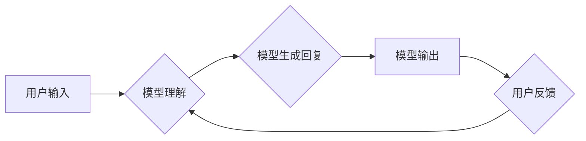

> 大语言模型、对话能力、评测指标、Transformer、BERT、GPT、LLaMA

## 1. 背景介绍

近年来，深度学习技术取得了飞速发展，特别是Transformer模型的出现，为自然语言处理（NLP）领域带来了革命性的变革。大语言模型（LLM）作为Transformer模型的升级版，拥有海量参数和强大的语义理解能力，在文本生成、机器翻译、问答系统等领域展现出令人瞩目的应用潜力。

然而，LLM的对话能力评测仍然是一个具有挑战性的问题。传统的评测指标，例如BLEU和ROUGE，主要侧重于文本的语法和结构，难以全面评估对话系统的流畅度、语义理解和交互性。因此，需要开发更加精准、全面的对话能力评测指标，以更好地评估LLM在对话场景下的表现。

## 2. 核心概念与联系

### 2.1 大语言模型

大语言模型（LLM）是指参数量巨大、训练数据海量的人工智能模型，能够理解和生成人类语言。它们通常基于Transformer架构，通过学习大量的文本数据，掌握语言的语法、语义和上下文关系。

### 2.2 对话能力

对话能力是指模型在与人类进行交互时，能够理解用户的意图、生成自然流畅的回复，并保持上下文一致性的能力。

### 2.3 对话能力评测

对话能力评测是指对模型在对话场景下的表现进行评估，常用的指标包括流畅度、语义理解、上下文一致性、相关性等。

**Mermaid 流程图**



## 3. 核心算法原理 & 具体操作步骤

### 3.1 算法原理概述

LLM的训练主要基于自监督学习，通过预测文本序列中的下一个词，学习语言的概率分布和上下文关系。常用的训练方法包括：

* **Masked Language Modeling (MLM):** 随机遮盖文本序列中的部分词，让模型预测被遮盖词。
* **Next Sentence Prediction (NSP):** 判断两个句子是否连续，训练模型学习句子之间的关系。

### 3.2 算法步骤详解

1. **数据预处理:** 将文本数据清洗、分词、标记等预处理。
2. **模型构建:** 选择合适的Transformer架构，例如BERT、GPT、LLaMA等。
3. **模型训练:** 使用自监督学习方法，训练模型预测文本序列中的下一个词。
4. **模型评估:** 使用评测指标，例如 perplexity、BLEU 等，评估模型的性能。
5. **模型调优:** 根据评估结果，调整模型参数和训练策略，提高模型性能。

### 3.3 算法优缺点

**优点:**

* 能够学习到丰富的语言知识和语义关系。
* 训练数据量大，模型泛化能力强。
* 在文本生成、机器翻译等任务中表现出色。

**缺点:**

* 训练成本高，需要大量的计算资源和时间。
* 模型参数量大，部署成本高。
* 容易受到训练数据偏差的影响。

### 3.4 算法应用领域

* 文本生成：小说、诗歌、剧本等。
* 机器翻译：将一种语言翻译成另一种语言。
* 问答系统：回答用户提出的问题。
* 对话机器人：与用户进行自然语言交互。
* 代码生成：自动生成代码。

## 4. 数学模型和公式 & 详细讲解 & 举例说明

### 4.1 数学模型构建

LLM通常基于Transformer架构，其核心是注意力机制。注意力机制允许模型关注输入序列中与当前词语相关的部分，从而更好地理解上下文信息。

**注意力机制公式:**

$$
Attention(Q, K, V) = softmax(\frac{QK^T}{\sqrt{d_k}})V
$$

其中：

* $Q$：查询矩阵
* $K$：键矩阵
* $V$：值矩阵
* $d_k$：键向量的维度
* $softmax$：softmax函数

### 4.2 公式推导过程

注意力机制的公式通过计算查询向量与键向量的点积，并使用softmax函数归一化，得到每个键向量的权重。然后，将权重与值向量相乘，得到最终的注意力输出。

### 4.3 案例分析与讲解

例如，在机器翻译任务中，查询向量表示目标语言中的词语，键向量表示源语言中的词语，值向量表示源语言词语的嵌入向量。通过注意力机制，模型可以关注源语言中与目标语言词语相关的词语，从而更好地理解语义关系并进行翻译。

## 5. 项目实践：代码实例和详细解释说明

### 5.1 开发环境搭建

* Python 3.7+
* PyTorch 1.7+
* CUDA 10.2+

### 5.2 源代码详细实现

```python
import torch
import torch.nn as nn

class Transformer(nn.Module):
    def __init__(self, vocab_size, embedding_dim, num_heads, num_layers):
        super(Transformer, self).__init__()
        self.embedding = nn.Embedding(vocab_size, embedding_dim)
        self.transformer_layers = nn.ModuleList([
            nn.TransformerEncoderLayer(embedding_dim, num_heads)
            for _ in range(num_layers)
        ])
        self.linear = nn.Linear(embedding_dim, vocab_size)

    def forward(self, x):
        x = self.embedding(x)
        for layer in self.transformer_layers:
            x = layer(x)
        x = self.linear(x)
        return x
```

### 5.3 代码解读与分析

* `Transformer`类定义了Transformer模型的结构。
* `embedding`层将词语索引映射到词向量。
* `transformer_layers`是一个模块列表，包含多个Transformer编码器层。
* `linear`层将编码后的输出映射到词汇表大小。

### 5.4 运行结果展示

训练完成后，可以使用模型生成文本，例如：

```python
model.eval()
input_text = torch.tensor([1, 2, 3])  # 输入词语索引
output_text = model(input_text)
predicted_word = torch.argmax(output_text, dim=-1)
print(predicted_word)
```

## 6. 实际应用场景

### 6.1 文本生成

LLM可以用于生成各种类型的文本，例如：

* **小说、诗歌、剧本:** 通过学习大量的文学作品，LLM可以生成具有文学风格的文本。
* **新闻报道、文章:** LLM可以根据给定的主题和关键词，生成新闻报道或文章。
* **广告文案、营销材料:** LLM可以根据目标受众和产品特点，生成吸引人的广告文案。

### 6.2 机器翻译

LLM可以用于将一种语言翻译成另一种语言，例如：

* **英语-中文翻译:** LLM可以将英文文本翻译成中文，反之亦然。
* **多语言翻译:** LLM可以支持多种语言的翻译，例如英语、中文、日语、韩语等。

### 6.3 问答系统

LLM可以用于构建问答系统，例如：

* **知识问答系统:** LLM可以根据给定的问题，从知识库中查找答案。
* **对话式问答系统:** LLM可以与用户进行对话，并根据用户的提问，提供相关信息。

### 6.4 对话机器人

LLM可以用于构建对话机器人，例如：

* **客服机器人:** LLM可以帮助企业处理客户咨询，例如订单查询、退换货等。
* **聊天机器人:** LLM可以与用户进行自然语言对话，例如聊天、娱乐等。

### 6.5 未来应用展望

LLM在未来将有更广泛的应用场景，例如：

* **个性化教育:** 根据学生的学习情况，提供个性化的学习内容和辅导。
* **医疗诊断:** 辅助医生进行疾病诊断，提高诊断准确率。
* **法律服务:** 帮助律师进行法律研究和案件分析。

## 7. 工具和资源推荐

### 7.1 学习资源推荐

* **书籍:**
    * 《深度学习》
    * 《自然语言处理》
    * 《Transformer模型》
* **在线课程:**
    * Coursera: 自然语言处理
    * Udacity: 深度学习
* **博客:**
    * Jay Alammar's Blog
    * The Gradient

### 7.2 开发工具推荐

* **PyTorch:** 深度学习框架
* **TensorFlow:** 深度学习框架
* **Hugging Face Transformers:** 预训练模型库

### 7.3 相关论文推荐

* Attention Is All You Need
* BERT: Pre-training of Deep Bidirectional Transformers for Language Understanding
* GPT-3: Language Models are Few-Shot Learners

## 8. 总结：未来发展趋势与挑战

### 8.1 研究成果总结

近年来，LLM取得了显著进展，在文本生成、机器翻译、问答系统等领域展现出强大的应用潜力。

### 8.2 未来发展趋势

* **模型规模更大:** 随着计算资源的不断提升，LLM的规模将进一步扩大，模型能力将得到进一步提升。
* **多模态学习:** LLM将与其他模态数据，例如图像、音频等进行融合，实现多模态理解和生成。
* **可解释性增强:** 研究如何提高LLM的透明度和可解释性，使其决策过程更加清晰。

### 8.3 面临的挑战

* **数据偏见:** LLM的训练数据可能存在偏见，导致模型输出存在歧视或不准确的情况。
* **计算成本高:** 训练大型LLM需要大量的计算资源，成本较高。
* **安全风险:** LLM可能被用于生成虚假信息、进行恶意攻击等，需要加强安全防护。

### 8.4 研究展望

未来，LLM的研究将继续朝着更强大、更安全、更可解释的方向发展，为人类社会带来更多福祉。

## 9. 附录：常见问题与解答

### 9.1 如何选择合适的LLM模型？

选择合适的LLM模型需要根据具体的应用场景和需求进行考虑，例如：

* **文本生成:** GPT-3、Jurassic-1 Jumbo
* **机器翻译:** T5、MarianMT
* **问答系统:** BERT、RoBERTa

### 9.2 如何训练自己的LLM模型？

训练自己的LLM模型需要准备大量的文本数据、强大的计算资源和专业的机器学习知识。

### 9.3 如何评估LLM模型的性能？

常用的LLM模型性能评估指标包括：

* **Perplexity:** 衡量模型预测文本序列的概率。
* **BLEU:** 衡量机器翻译模型的准确率。
* **ROUGE:** 衡量文本摘要模型的质量。

### 9.4 如何解决LLM模型的偏见问题？

可以采用以下方法来解决LLM模型的偏见问题：

* 使用更均衡的数据集进行训练。
* 在训练过程中加入对抗训练，减少模型对偏见数据的敏感性。
* 开发可解释性更高的模型，以便更好地理解模型的决策过程。


作者：禅与计算机程序设计艺术 / Zen and the Art of Computer Programming 
<end_of_turn>