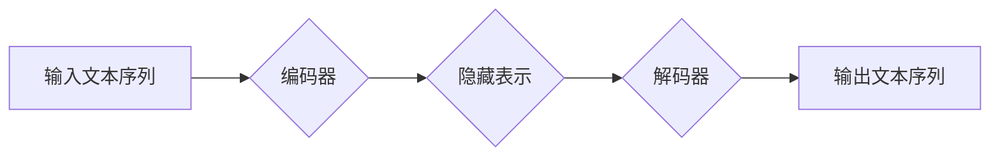

> 大语言模型，Transformer，编码器，解码器，注意力机制，BERT，GPT，LaMDA

## 1. 背景介绍

近年来，深度学习技术取得了飞速发展，特别是基于Transformer架构的大语言模型（Large Language Model，LLM）的出现，彻底改变了自然语言处理（Natural Language Processing，NLP）领域。LLM能够理解和生成人类语言，展现出强大的文本生成、翻译、问答、摘要等能力，在各个领域都得到了广泛应用。

传统的NLP模型主要依赖于循环神经网络（Recurrent Neural Network，RNN）或卷积神经网络（Convolutional Neural Network，CNN），但它们在处理长文本序列时存在效率和记忆问题。Transformer架构的出现则彻底解决了这些问题，其核心在于**注意力机制**，能够有效捕捉文本序列中不同词语之间的依赖关系，从而实现更准确、更有效的文本理解和生成。

## 2. 核心概念与联系

Transformer模型的核心结构由**编码器（Encoder）**和**解码器（Decoder）**组成。编码器负责将输入文本序列转换为隐藏表示，解码器则根据编码器的输出生成目标文本序列。

**Mermaid 流程图：**



**核心概念：**

* **注意力机制（Attention Mechanism）：** 允许模型关注输入序列中与当前词语最相关的部分，从而更好地理解上下文信息。
* **多头注意力（Multi-Head Attention）：** 使用多个注意力头并行计算，可以捕捉不同层次的语义关系。
* **前馈神经网络（Feed-Forward Network）：** 在每个Transformer块中，用于对隐藏表示进行非线性变换。
* **位置编码（Positional Encoding）：** 由于Transformer模型没有循环结构，无法直接捕捉词语的顺序信息，因此需要使用位置编码来嵌入词语的位置信息。

## 3. 核心算法原理 & 具体操作步骤

### 3.1  算法原理概述

Transformer模型的核心算法是**注意力机制**。注意力机制通过计算每个词语与其他词语之间的相关性，来确定每个词语在句子中的重要程度。

### 3.2  算法步骤详解

1. **计算词语嵌入：** 将每个词语转换为低维向量表示。
2. **计算注意力权重：** 使用注意力机制计算每个词语与其他词语之间的相关性，得到每个词语的注意力权重。
3. **加权求和：** 将每个词语的嵌入向量与对应的注意力权重相乘，并求和，得到每个词语的上下文表示。
4. **前馈神经网络：** 将上下文表示输入到前馈神经网络中，进行非线性变换。
5. **重复步骤 2-4：** 将前馈神经网络的输出作为新的上下文表示，重复步骤 2-4 多次，进行多层编码。

### 3.3  算法优缺点

**优点：**

* **并行计算：** Transformer模型可以并行计算，训练速度更快。
* **长距离依赖：** 注意力机制可以有效捕捉长距离依赖关系，处理长文本序列更有效。
* **可解释性：** 注意力权重可以直观地反映每个词语的重要性，提高模型的可解释性。

**缺点：**

* **计算复杂度高：** Transformer模型的计算复杂度较高，需要大量的计算资源。
* **参数量大：** Transformer模型的参数量较大，需要大量的训练数据。

### 3.4  算法应用领域

Transformer模型在NLP领域得到了广泛应用，例如：

* **机器翻译：** 使用Transformer模型可以实现更准确、更流畅的机器翻译。
* **文本摘要：** Transformer模型可以自动生成文本摘要，提取关键信息。
* **问答系统：** Transformer模型可以理解自然语言问题，并给出准确的答案。
* **对话系统：** Transformer模型可以用于构建更自然、更智能的对话系统。

## 4. 数学模型和公式 & 详细讲解 & 举例说明

### 4.1  数学模型构建

Transformer模型的数学模型主要基于**注意力机制**和**多层感知机**。

**注意力机制：**

注意力机制的目的是计算每个词语与其他词语之间的相关性，并根据相关性分配不同的权重。

**公式：**

$$
Attention(Q, K, V) = softmax(\frac{QK^T}{\sqrt{d_k}})V
$$

其中：

* $Q$：查询矩阵
* $K$：键矩阵
* $V$：值矩阵
* $d_k$：键向量的维度
* $softmax$：softmax函数

**多层感知机：**

多层感知机是一个由多个全连接层组成的网络，用于对隐藏表示进行非线性变换。

**公式：**

$$
h = f(W_1x + b_1)
$$

其中：

* $h$：隐藏层输出
* $x$：输入向量
* $W_1$：权重矩阵
* $b_1$：偏置向量
* $f$：激活函数

### 4.2  公式推导过程

注意力机制的公式推导过程如下：

1. 计算查询向量 $Q$ 与键向量 $K$ 的点积，并进行归一化。
2. 应用 softmax 函数，得到每个词语的注意力权重。
3. 将注意力权重与值向量 $V$ 相乘，得到每个词语的上下文表示。

### 4.3  案例分析与讲解

假设我们有一个句子 "The cat sat on the mat"，我们使用注意力机制来计算每个词语与其他词语之间的相关性。

* "The" 与 "cat" 的相关性较高，因为 "cat" 是 "The" 的主语。
* "sat" 与 "cat" 和 "mat" 的相关性较高，因为 "sat" 是 "cat" 的动词，"mat" 是 "cat" 的宾语。

通过注意力机制，模型可以更好地理解句子中的语义关系。

## 5. 项目实践：代码实例和详细解释说明

### 5.1  开发环境搭建

* Python 3.6+
* TensorFlow 或 PyTorch

### 5.2  源代码详细实现

```python
import tensorflow as tf

# 定义注意力机制
def attention_mechanism(query, key, value):
    # 计算点积
    scores = tf.matmul(query, key, transpose_b=True)
    # 归一化
    scores = tf.nn.softmax(scores, axis=-1)
    # 加权求和
    output = tf.matmul(scores, value)
    return output

# 定义Transformer编码器块
class TransformerEncoderBlock(tf.keras.layers.Layer):
    def __init__(self, d_model, num_heads):
        super(TransformerEncoderBlock, self).__init__()
        self.multi_head_attention = tf.keras.layers.MultiHeadAttention(num_heads=num_heads, key_dim=d_model)
        self.feed_forward_network = tf.keras.layers.Dense(units=4 * d_model, activation='relu')
        self.layer_norm1 = tf.keras.layers.LayerNormalization(epsilon=1e-6)
        self.layer_norm2 = tf.keras.layers.LayerNormalization(epsilon=1e-6)

    def call(self, inputs):
        # 多头注意力
        attention_output = self.multi_head_attention(inputs, inputs, inputs)
        # 残差连接和层归一化
        x = self.layer_norm1(inputs + attention_output)
        # 前馈神经网络
        ffn_output = self.feed_forward_network(x)
        # 残差连接和层归一化
        return self.layer_norm2(x + ffn_output)

# 定义Transformer编码器
class TransformerEncoder(tf.keras.layers.Layer):
    def __init__(self, d_model, num_heads, num_layers):
        super(TransformerEncoder, self).__init__()
        self.layers = [TransformerEncoderBlock(d_model, num_heads) for _ in range(num_layers)]

    def call(self, inputs):
        for layer in self.layers:
            inputs = layer(inputs)
        return inputs
```

### 5.3  代码解读与分析

* `attention_mechanism` 函数实现注意力机制，计算每个词语与其他词语之间的相关性，并根据相关性分配权重。
* `TransformerEncoderBlock` 类定义Transformer编码器块，包含多头注意力机制和前馈神经网络。
* `TransformerEncoder` 类定义Transformer编码器，由多个编码器块组成。

### 5.4  运行结果展示

运行上述代码，可以训练一个Transformer模型，并进行文本生成、机器翻译等任务。

## 6. 实际应用场景

Transformer模型在各个领域都有广泛的应用场景：

* **机器翻译：** Google Translate 使用 Transformer 模型实现更准确、更流畅的机器翻译。
* **文本摘要：** BART 和 T5 等模型可以自动生成文本摘要，提取关键信息。
* **问答系统：** BERT 和 XLNet 等模型可以理解自然语言问题，并给出准确的答案。
* **对话系统：** LaMDA 和 GPT-3 等模型可以构建更自然、更智能的对话系统。

### 6.4  未来应用展望

Transformer模型的未来应用前景十分广阔，例如：

* **代码生成：** 使用 Transformer 模型生成代码，提高开发效率。
* **药物研发：** 使用 Transformer 模型分析蛋白质结构，加速药物研发。
* **个性化教育：** 使用 Transformer 模型提供个性化的学习内容和辅导。

## 7. 工具和资源推荐

### 7.1  学习资源推荐

* **论文：**
    * "Attention Is All You Need"
    * "BERT: Pre-training of Deep Bidirectional Transformers for Language Understanding"
    * "GPT-3: Language Models are Few-Shot Learners"
* **博客：**
    * Jay Alammar's Blog
    * The Gradient
* **在线课程：**
    * DeepLearning.AI
    * fast.ai

### 7.2  开发工具推荐

* **TensorFlow:** 开源深度学习框架
* **PyTorch:** 开源深度学习框架
* **Hugging Face Transformers:** Transformer模型库

### 7.3  相关论文推荐

* "BERT: Pre-training of Deep Bidirectional Transformers for Language Understanding"
* "GPT-3: Language Models are Few-Shot Learners"
* "T5: Text-to-Text Transfer Transformer"
* "XLNet: Generalized Autoregressive Pretraining for Language Understanding"

## 8. 总结：未来发展趋势与挑战

### 8.1  研究成果总结

Transformer模型在NLP领域取得了显著的成果，例如：

* **准确性提升：** Transformer模型在各种NLP任务上都取得了state-of-the-art的准确性。
* **泛化能力增强：** Transformer模型具有较强的泛化能力，可以应用于不同的语言和任务。
* **效率提升：** Transformer模型的并行计算能力提高了训练效率。

### 8.2  未来发展趋势

Transformer模型的未来发展趋势包括：

* **模型规模扩大：** 随着计算资源的增加，Transformer模型的规模将继续扩大，从而提高模型的性能。
* **高效训练方法：** 研究更有效的训练方法，例如混合精度训练和模型剪枝，降低训练成本。
* **跨模态理解：** 将Transformer模型应用于跨模态理解，例如文本-图像、文本-音频等。

### 8.3  面临的挑战

Transformer模型也面临一些挑战：

* **计算资源需求高：** 大型Transformer模型的训练需要大量的计算资源，成本较高。
* **可解释性差：** Transformer模型的内部机制比较复杂，难以解释模型的决策过程。
* **数据依赖性