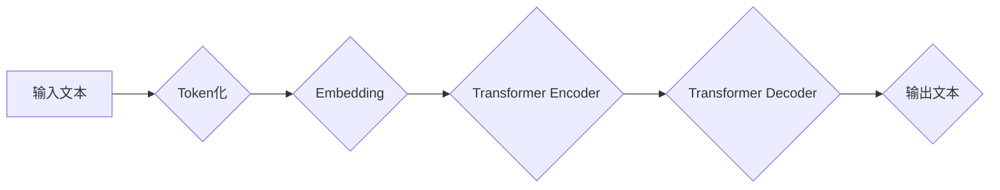

> 大语言模型、Transformer、BERT、GPT、LLM、自然语言处理、深度学习、文本生成

## 1. 背景介绍

近年来，深度学习技术取得了飞速发展，特别是Transformer模型的出现，为自然语言处理（NLP）领域带来了革命性的变革。大语言模型（LLM）作为Transformer模型的升级版，拥有强大的文本理解和生成能力，在文本分类、机器翻译、问答系统、代码生成等领域展现出巨大的应用潜力。

大语言模型的训练需要海量文本数据和强大的计算资源，其训练过程复杂且耗时。为了更好地理解和应用LLM，我们需要深入了解其原理基础和前沿研究进展。

## 2. 核心概念与联系

大语言模型的核心概念包括：

* **Transformer模型:** Transformer模型是一种基于注意力机制的深度神经网络架构，能够有效处理长距离依赖关系，是LLM的基础。
* **自回归语言模型:** 自回归语言模型是一种预测下一个词的概率分布的模型，通过训练大量的文本数据，学习语言的语法和语义规律。
* **预训练和微调:** 预训练是指在大量文本数据上训练一个通用语言模型，微调是指在特定任务数据上对预训练模型进行进一步训练，以提高其在特定任务上的性能。

**Mermaid 流程图:**



## 3. 核心算法原理 & 具体操作步骤

### 3.1  算法原理概述

Transformer模型的核心是注意力机制，它能够学习文本中不同词之间的关系，并赋予每个词不同的权重。

**注意力机制:**

注意力机制是一种机制，它允许模型关注输入序列中与当前任务最相关的部分。

**Transformer Encoder:**

Transformer Encoder由多个编码器层组成，每个编码器层包含多头注意力机制和前馈神经网络。

**Transformer Decoder:**

Transformer Decoder也由多个解码器层组成，每个解码器层包含多头注意力机制、掩码注意力机制和前馈神经网络。

### 3.2  算法步骤详解

1. **Token化:** 将输入文本分割成一个个独立的词或子词。
2. **Embedding:** 将每个词转换为一个向量表示。
3. **Transformer Encoder:** 将输入的词向量序列输入到Transformer Encoder中，通过多头注意力机制和前馈神经网络进行编码，得到隐藏状态。
4. **Transformer Decoder:** 将隐藏状态输入到Transformer Decoder中，通过多头注意力机制、掩码注意力机制和前馈神经网络进行解码，生成输出文本。

### 3.3  算法优缺点

**优点:**

* 能够有效处理长距离依赖关系。
* 训练效率高。
* 表现优异。

**缺点:**

* 计算量大。
* 训练数据量大。

### 3.4  算法应用领域

* 文本分类
* 机器翻译
* 问答系统
* 代码生成
* 文本摘要

## 4. 数学模型和公式 & 详细讲解 & 举例说明

### 4.1  数学模型构建

Transformer模型的数学模型主要包括以下几个部分：

* **词嵌入:** 将每个词转换为一个向量表示。
* **多头注意力机制:** 计算每个词与其他词之间的注意力权重。
* **前馈神经网络:** 对每个词的隐藏状态进行非线性变换。

### 4.2  公式推导过程

**多头注意力机制公式:**

$$
Attention(Q, K, V) = softmax(\frac{QK^T}{\sqrt{d_k}})V
$$

其中：

* $Q$：查询矩阵
* $K$：键矩阵
* $V$：值矩阵
* $d_k$：键向量的维度

**前馈神经网络公式:**

$$
FFN(x) = \max(0, xW_1 + b_1)W_2 + b_2
$$

其中：

* $x$：输入向量
* $W_1$、$W_2$：权重矩阵
* $b_1$、$b_2$：偏置项

### 4.3  案例分析与讲解

**举例说明:**

假设我们有一个句子“The cat sat on the mat”，我们需要计算每个词与其他词之间的注意力权重。

1. 将句子中的每个词转换为词向量。
2. 将词向量作为查询矩阵 $Q$、键矩阵 $K$ 和值矩阵 $V$。
3. 计算注意力权重矩阵。
4. 将注意力权重矩阵与值矩阵相乘，得到每个词的上下文向量。

## 5. 项目实践：代码实例和详细解释说明

### 5.1  开发环境搭建

* Python 3.7+
* PyTorch 1.7+
* CUDA 10.2+

### 5.2  源代码详细实现

```python
import torch
import torch.nn as nn

class Transformer(nn.Module):
    def __init__(self, vocab_size, embedding_dim, num_heads, num_layers):
        super(Transformer, self).__init__()
        self.embedding = nn.Embedding(vocab_size, embedding_dim)
        self.encoder_layers = nn.ModuleList([EncoderLayer(embedding_dim, num_heads) for _ in range(num_layers)])
        self.decoder_layers = nn.ModuleList([DecoderLayer(embedding_dim, num_heads) for _ in range(num_layers)])

    def forward(self, src, tgt):
        src = self.embedding(src)
        tgt = self.embedding(tgt)
        # ...
```

### 5.3  代码解读与分析

* **`__init__`方法:** 初始化模型参数，包括词嵌入层、编码器层和解码器层。
* **`forward`方法:** 定义模型的正向传播过程，将输入序列转换为输出序列。

### 5.4  运行结果展示

运行模型后，可以得到输出文本序列。

## 6. 实际应用场景

### 6.1  文本分类

LLM可以用于文本分类任务，例如情感分析、主题分类等。

### 6.2  机器翻译

LLM可以用于机器翻译任务，例如将英文翻译成中文。

### 6.3  问答系统

LLM可以用于问答系统，例如回答用户提出的问题。

### 6.4  未来应用展望

LLM在未来将有更广泛的应用场景，例如：

* 自动写作
* 代码生成
* 聊天机器人
* 个性化教育

## 7. 工具和资源推荐

### 7.1  学习资源推荐

* **论文:**
    * Attention Is All You Need
    * BERT: Pre-training of Deep Bidirectional Transformers for Language Understanding
    * GPT-3: Language Models are Few-Shot Learners
* **博客:**
    * The Illustrated Transformer
    * Jay Alammar's Blog

### 7.2  开发工具推荐

* **Hugging Face Transformers:** 一个开源的LLM库，提供预训练模型和训练工具。
* **TensorFlow:** 一个开源的机器学习框架。
* **PyTorch:** 一个开源的深度学习框架。

### 7.3  相关论文推荐

* **Attention Is All You Need**
* **BERT: Pre-training of Deep Bidirectional Transformers for Language Understanding**
* **GPT-3: Language Models are Few-Shot Learners**

## 8. 总结：未来发展趋势与挑战

### 8.1  研究成果总结

LLM在自然语言处理领域取得了显著的进展，展现出强大的文本理解和生成能力。

### 8.2  未来发展趋势

* **模型规模更大:** 训练更大规模的LLM，以提高其性能。
* **多模态学习:** 将文本与其他模态数据（例如图像、音频）进行融合，以实现更全面的理解和生成。
* **可解释性增强:** 研究LLM的决策过程，提高其可解释性和可信度。

### 8.3  面临的挑战

* **数据获取和标注:** 训练LLM需要海量文本数据，数据获取和标注成本高。
* **计算资源:** 训练LLM需要大量的计算资源，成本高昂。
* **伦理问题:** LLM可能被用于生成虚假信息或进行恶意攻击，需要关注其伦理问题。

### 8.4  研究展望

未来，LLM的研究将继续朝着更强大、更安全、更可解释的方向发展。


## 9. 附录：常见问题与解答

**常见问题:**

* **什么是LLM？**

LLM是指大语言模型，是一种能够理解和生成人类语言的深度学习模型。

* **LLM的训练数据是什么？**

LLM的训练数据通常是海量文本数据，例如书籍、文章、网站内容等。

* **LLM有哪些应用场景？**

LLM的应用场景非常广泛，例如文本分类、机器翻译、问答系统、代码生成等。

**解答:**

* **什么是LLM？**

LLM是指大语言模型，是一种能够理解和生成人类语言的深度学习模型。

* **LLM的训练数据是什么？**

LLM的训练数据通常是海量文本数据，例如书籍、文章、网站内容等。

* **LLM有哪些应用场景？**

LLM的应用场景非常广泛，例如文本分类、机器翻译、问答系统、代码生成等。


作者：禅与计算机程序设计艺术 / Zen and the Art of Computer Programming 
<end_of_turn>