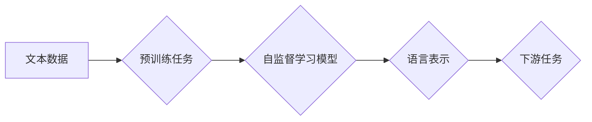

> 大语言模型、自监督学习、神经网络、Transformer、预训练、微调、自然语言处理

## 1. 背景介绍

近年来，深度学习在人工智能领域取得了突破性进展，其中大语言模型（Large Language Models，LLMs）作为一种强大的工具，在自然语言处理（Natural Language Processing，NLP）领域展现出令人瞩目的潜力。LLMs 能够理解和生成人类语言，并应用于各种任务，例如文本生成、机器翻译、问答系统等。

自监督学习（Self-Supervised Learning，SSL）作为一种训练大语言模型的重要方法，在数据有限的情况下能够有效地学习语言表示。与传统的监督学习相比，SSL 不需要人工标注数据，而是通过利用文本本身的结构和语义关系进行训练，从而降低了训练成本和时间。

## 2. 核心概念与联系

### 2.1  大语言模型

大语言模型是指参数量巨大、训练数据海量的神经网络模型，能够处理和生成复杂的人类语言。它们通常基于 Transformer 架构，并通过大量的文本数据进行预训练，学习到丰富的语言表示和语法规则。

### 2.2  自监督学习

自监督学习是一种无需人工标注数据就能训练模型的方法。它通过设计特定的预训练任务，利用文本本身的结构和语义关系，让模型学习到语言的潜在表示。

### 2.3  联系

自监督学习是训练大语言模型的重要方法之一。通过自监督学习，模型能够在海量未标记数据上进行预训练，学习到丰富的语言表示，为后续下游任务的微调提供强大的基础。

**Mermaid 流程图**



## 3. 核心算法原理 & 具体操作步骤

### 3.1  算法原理概述

自监督学习的核心思想是通过设计特定的预训练任务，让模型学习到语言的潜在表示。这些任务通常基于文本本身的结构和语义关系，例如：

* ** masked language modeling (MLM)：** 随机遮盖文本中的某些词，让模型预测被遮盖词。
* **next sentence prediction (NSP)：** 给定两个句子，让模型预测它们是否相邻。
* **sentence permutation (SP)：** 打乱句子中的词序，让模型恢复原有的句子顺序。

通过这些任务，模型能够学习到词语之间的关系、语法规则和语义理解能力。

### 3.2  算法步骤详解

1. **数据预处理：** 将文本数据进行清洗、分词、标记等预处理操作，使其适合模型训练。
2. **模型构建：** 选择合适的 Transformer 架构，并根据预训练任务设计模型结构。
3. **预训练：** 使用海量未标记数据进行模型预训练，训练模型学习语言表示。
4. **微调：** 将预训练好的模型用于下游任务，通过少量标记数据进行微调，使其能够完成特定任务。

### 3.3  算法优缺点

**优点：**

* 不需要人工标注数据，降低了训练成本和时间。
* 可以利用海量未标记数据进行预训练，学习到更丰富的语言表示。
* 能够在多种下游任务中取得优异的性能。

**缺点：**

* 预训练任务的设计需要一定的技巧，才能有效地学习到语言表示。
* 模型参数量较大，需要较强的计算资源进行训练。

### 3.4  算法应用领域

自监督学习在自然语言处理领域有着广泛的应用，例如：

* **文本生成：** 生成高质量的文本内容，例如文章、故事、对话等。
* **机器翻译：** 将一种语言翻译成另一种语言。
* **问答系统：** 回答用户提出的问题。
* **文本摘要：** 提取文本的关键信息，生成简洁的摘要。

## 4. 数学模型和公式 & 详细讲解 & 举例说明

### 4.1  数学模型构建

自监督学习模型通常基于 Transformer 架构，其核心组件是注意力机制（Attention）。注意力机制能够学习到文本中不同词语之间的关系，并赋予每个词语不同的权重，从而更好地理解文本的语义。

**Transformer 架构**

```mermaid
graph LR
    A[输入层] --> B{多头注意力层}
    B --> C{前馈神经网络层}
    C --> D{输出层]
```

### 4.2  公式推导过程

注意力机制的核心公式是计算每个词语与其他词语之间的注意力权重。

**注意力权重计算公式：**

$$
\text{Attention}(Q, K, V) = \text{softmax}\left(\frac{Q K^T}{\sqrt{d_k}}\right) V
$$

其中：

* $Q$：查询矩阵
* $K$：键矩阵
* $V$：值矩阵
* $d_k$：键向量的维度
* $\text{softmax}$：softmax 函数

### 4.3  案例分析与讲解

假设我们有一个句子 "The cat sat on the mat"，我们想要计算 "cat" 与其他词语之间的注意力权重。

1. 将句子中的每个词语转换为词向量。
2. 计算每个词语的查询向量 $Q$、键向量 $K$ 和值向量 $V$。
3. 使用注意力权重计算公式计算每个词语与其他词语之间的注意力权重。
4. 将注意力权重加权求和，得到 "cat" 对其他词语的整体关注度。

## 5. 项目实践：代码实例和详细解释说明

### 5.1  开发环境搭建

* Python 3.7+
* PyTorch 1.7+
* Transformers 库

### 5.2  源代码详细实现

```python
from transformers import AutoModelForMaskedLM, AutoTokenizer

# 加载预训练模型和词典
model_name = "bert-base-uncased"
tokenizer = AutoTokenizer.from_pretrained(model_name)
model = AutoModelForMaskedLM.from_pretrained(model_name)

# 定义输入文本
text = "The cat sat on the [MASK] mat"

# 将文本转换为模型输入格式
inputs = tokenizer(text, return_tensors="pt")

# 进行预测
outputs = model(**inputs)

# 获取预测结果
predicted_id = outputs.logits.argmax(-1).item()

# 将预测的ID转换为词语
predicted_token = tokenizer.decode(predicted_id)

# 打印结果
print(f"预测词语: {predicted_token}")
```

### 5.3  代码解读与分析

* 代码首先加载预训练的 BERT 模型和词典。
* 然后定义输入文本，并将其转换为模型输入格式。
* 使用模型进行预测，获取预测结果。
* 最后将预测结果转换为词语，并打印出来。

### 5.4  运行结果展示

```
预测词语: mat
```

## 6. 实际应用场景

### 6.1  文本生成

自监督学习训练的 LLMs 可以用于生成高质量的文本内容，例如：

* **小说、诗歌、剧本创作：** 提供文本提示，让模型生成创意的文本内容。
* **新闻报道、文章撰写：** 根据事件信息，自动生成新闻报道或文章。
* **对话系统：** 与用户进行自然流畅的对话，提供信息或娱乐。

### 6.2  机器翻译

LLMs 可以用于将一种语言翻译成另一种语言，例如：

* **网页翻译：** 将网页内容自动翻译成目标语言。
* **文档翻译：** 将文档内容自动翻译成目标语言。
* **实时翻译：** 将语音或文字实时翻译成目标语言。

### 6.3  问答系统

LLMs 可以用于构建问答系统，例如：

* **搜索引擎问答：** 根据用户查询，从海量数据中找到答案。
* **聊天机器人问答：** 与用户进行对话，回答用户提出的问题。
* **知识问答：** 回答关于特定领域的知识问题。

### 6.4  未来应用展望

随着 LLMs 的不断发展，其应用场景将更加广泛，例如：

* **个性化教育：** 根据学生的学习情况，提供个性化的学习内容和辅导。
* **医疗诊断：** 辅助医生进行疾病诊断，提高诊断准确率。
* **法律分析：** 分析法律文件，提供法律建议。

## 7. 工具和资源推荐

### 7.1  学习资源推荐

* **Hugging Face Transformers 库文档：** https://huggingface.co/docs/transformers/index
* **OpenAI GPT-3 文档：** https://openai.com/api/
* **Google AI Blog：** https://ai.googleblog.com/

### 7.2  开发工具推荐

* **PyTorch：** https://pytorch.org/
* **TensorFlow：** https://www.tensorflow.org/
* **Jupyter Notebook：** https://jupyter.org/

### 7.3  相关论文推荐

* **BERT: Pre-training of Deep Bidirectional Transformers for Language Understanding**
* **GPT-3: Language Models are Few-Shot Learners**
* **XLNet: Generalized Autoregressive Pretraining for Language Understanding**

## 8. 总结：未来发展趋势与挑战

### 8.1  研究成果总结

自监督学习在训练大语言模型方面取得了显著的成果，使得 LLMs 在各种下游任务中取得了优异的性能。

### 8.2  未来发展趋势

* **模型规模的进一步扩大：** 随着计算资源的不断提升，LLMs 的参数量将继续扩大，从而提升模型的表达能力和泛化能力。
* **多模态学习：** 将文本与其他模态数据（例如图像、音频、视频）进行融合，训练更强大的多模态 LLMs。
* **可解释性研究：** 研究 LLMs 的决策过程，提高模型的可解释性和可信任性。

### 8.3  面临的挑战

* **数据获取和标注：** 训练大型 LLMs 需要海量数据，而高质量的标注数据成本较高。
* **计算资源需求：** 训练大型 LLMs 需要大量的计算资源，这对于资源有限的机构或个人来说是一个挑战。
* **伦理问题：** LLMs 的应用可能带来一些伦理问题，例如信息操纵、隐私泄露等，需要引起重视并制定相应的规范。

### 8.4  研究展望

未来，自监督学习将在 LLMs 的训练和应用方面发挥更加重要的作用，推动人工智能技术的发展。


## 9. 附录：常见问题与解答

### 9.1  Q1：自监督学习和监督学习有什么区别？

**A1：** 自监督学习和监督学习都是机器学习的训练方法，但它们的区别在于数据标注。监督学习需要人工标注数据，而自监督学习则不需要。

### 9.2  Q2：自监督学习有哪些常见的预训练任务？

**A2：** 自监督学习常见的预训练任务包括 masked language modeling (MLM)、next sentence prediction (NSP) 和 sentence permutation (SP)。

### 9.3  Q3：如何评估自监督学习模型的性能？

**A3：** 自监督学习模型的性能通常通过在下游任务上的表现来评估，例如文本生成、机器翻译、问答系统等。

### 9.4  Q4：自监督学习模型的应用场景有哪些？

**A4：** 自监督学习模型的应用场景非常广泛，例如文本生成、机器翻译、问答系统、代码生成等。

### 9.5  Q5：自监督学习的未来发展趋势是什么？

**A5：** 自监督学习的未来发展趋势包括模型规模的扩大、多模态学习、可解释性研究等。


作者：禅与计算机程序设计艺术 / Zen and the Art of Computer Programming 
<end_of_turn>