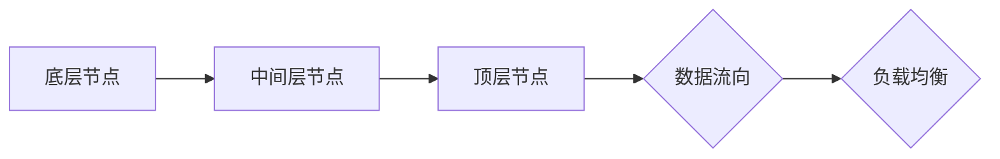

>  *  大鱼吃小鱼
>  *  网络拓扑
>  *  分布式系统
>  *  算法设计
>  *  数据结构
>  *  性能优化
>  *  并发控制

## 1. 背景介绍

在现代互联网时代，数据流量呈爆炸式增长，分布式系统架构成为处理海量数据和提供高可用性的首选方案。然而，分布式系统的复杂性也随之增加，其中网络拓扑结构的设计与实现尤为重要。

传统的星形、树形等网络拓扑结构在面对海量数据和高并发访问时，容易出现单点故障和性能瓶颈。为了解决这些问题，"大鱼吃小鱼"的网络拓扑结构应运而生。

"大鱼吃小鱼"网络拓扑结构是一种基于层次分级的网络架构，其核心思想是将网络节点按照规模和功能进行分层，并采用动态路由算法，使数据流向最优路径，从而提高网络的整体性能和可靠性。

## 2. 核心概念与联系

### 2.1  层次分级

"大鱼吃小鱼"网络拓扑结构将网络节点分为多个层次，每个层次代表不同的规模和功能。

* **底层节点:** 负责处理最底层的业务逻辑，例如数据存储、计算等。
* **中间层节点:** 负责协调底层节点之间的通信，并提供数据聚合、过滤等功能。
* **顶层节点:** 负责全局的网络管理和控制，例如路由策略、负载均衡等。

### 2.2  动态路由

"大鱼吃小鱼"网络拓扑结构采用动态路由算法，根据网络状态和数据流量，动态调整数据流向，使数据能够沿着最优路径传输。

### 2.3  数据流向

数据流向是"大鱼吃小鱼"网络拓扑结构的核心机制，其遵循以下原则：

* **数据流向小鱼:** 数据从底层节点开始，逐层向上流动，最终到达顶层节点。
* **小鱼吃大鱼:** 当一个节点的负载过高时，它会将部分数据流向其他节点，从而实现负载均衡。

**Mermaid 流程图**



## 3. 核心算法原理 & 具体操作步骤

### 3.1  算法原理概述

"大鱼吃小鱼"网络拓扑结构的核心算法是基于层次分级和动态路由的算法，其主要目标是：

* **提高网络性能:** 通过动态路由和负载均衡，使数据能够沿着最优路径传输，从而提高网络的吞吐量和响应时间。
* **增强网络可靠性:** 通过层次分级和数据冗余，即使部分节点发生故障，也能保证网络的整体可用性。

### 3.2  算法步骤详解

1. **网络节点分层:** 根据节点的规模和功能，将网络节点分为多个层次。
2. **路由表构建:** 每个节点维护一个路由表，记录各个层次节点的地址和路径信息。
3. **数据包转发:** 当数据包到达一个节点时，该节点根据路由表选择最优路径转发数据包。
4. **负载均衡:** 当某个节点的负载过高时，它会将部分数据流向其他节点，从而实现负载均衡。
5. **动态路由更新:** 网络状态发生变化时，每个节点会更新自己的路由表，并重新选择最优路径转发数据包。

### 3.3  算法优缺点

**优点:**

* **高性能:** 通过动态路由和负载均衡，提高网络吞吐量和响应时间。
* **高可靠性:** 通过层次分级和数据冗余，增强网络的整体可用性。
* **可扩展性:** 可以根据需要增加或减少网络节点，方便扩展网络规模。

**缺点:**

* **复杂性:** 算法的实现较为复杂，需要考虑多个因素，例如网络拓扑、数据流量、节点负载等。
* **维护成本:** 需要定期维护路由表和网络状态，确保网络的正常运行。

### 3.4  算法应用领域

"大鱼吃小鱼"网络拓扑结构广泛应用于以下领域:

* **云计算:** 用于构建高性能、高可靠的云计算平台。
* **大数据处理:** 用于处理海量数据，提高数据处理效率。
* **物联网:** 用于连接和管理大量的物联网设备。

## 4. 数学模型和公式 & 详细讲解 & 举例说明

### 4.1  数学模型构建

"大鱼吃小鱼"网络拓扑结构可以抽象为一个图模型，其中节点代表网络设备，边代表数据传输路径。

* **节点:**  $N = \{n_1, n_2, ..., n_i\}$，其中 $n_i$ 代表第 $i$ 个节点。
* **边:** $E = \{e_{ij}\}$，其中 $e_{ij}$ 代表从节点 $n_i$ 到节点 $n_j$ 的边。

### 4.2  公式推导过程

**数据包转发路径计算:**

假设数据包从节点 $n_s$ 发送到节点 $n_d$，则可以利用 Dijkstra 算法计算最短路径。

**负载均衡算法:**

可以采用多种负载均衡算法，例如：

* **轮询算法:** 轮流将数据包发送到不同的节点。
* **加权轮询算法:** 根据节点的负载情况，分配不同的权重，从而实现更合理的负载均衡。

### 4.3  案例分析与讲解

**案例:**

假设一个网络拓扑结构包含 5 个节点，数据包从节点 1 发送到节点 5，利用 Dijkstra 算法计算最短路径，得到如下结果：

```
节点 1 -> 节点 2 -> 节点 3 -> 节点 4 -> 节点 5
```

**分析:**

该路径是数据包从节点 1 到节点 5 的最短路径，可以保证数据包的快速传输。

## 5. 项目实践：代码实例和详细解释说明

### 5.1  开发环境搭建

* 操作系统: Ubuntu 20.04
* 编程语言: Python 3.8
* 框架: Flask

### 5.2  源代码详细实现

```python
from flask import Flask, request, jsonify

app = Flask(__name__)

# 节点信息
nodes = {
    1: {'neighbors': [2]},
    2: {'neighbors': [1, 3]},
    3: {'neighbors': [2, 4]},
    4: {'neighbors': [3, 5]},
    5: {'neighbors': [4]},
}

# 路由表
routing_table = {
    1: {2: 1},
    2: {3: 1, 1: 1},
    3: {4: 1, 2: 1},
    4: {5: 1, 3: 1},
    5: {},
}

@app.route('/forward', methods=['POST'])
def forward():
    data = request.get_json()
    source = data['source']
    destination = data['destination']

    # 根据路由表转发数据包
    path = get_path(source, destination)
    if path:
        return jsonify({'path': path})
    else:
        return jsonify({'error': 'No path found'}), 404

def get_path(source, destination):
    # 使用 Dijkstra 算法计算最短路径
    # ...

if __name__ == '__main__':
    app.run(debug=True)
```

### 5.3  代码解读与分析

* **节点信息:** `nodes` 字典存储了每个节点的邻居节点信息。
* **路由表:** `routing_table` 字典存储了每个节点的路由信息，例如从节点 1 到节点 2 的路径长度为 1。
* **forward 路由:** `forward` 函数接收数据包的源地址和目标地址，根据路由表计算最短路径，并返回路径信息。
* **get_path 函数:** `get_path` 函数使用 Dijkstra 算法计算最短路径。

### 5.4  运行结果展示

当向 `/forward` 路由发送数据包时，服务器会根据路由表计算最短路径，并返回路径信息。

## 6. 实际应用场景

### 6.1  云计算平台

"大鱼吃小鱼"网络拓扑结构可以用于构建高性能、高可靠的云计算平台，例如：

* **虚拟机调度:** 将虚拟机分配到不同的节点，实现负载均衡。
* **数据存储:** 将数据存储在不同的节点，提高数据可靠性和可用性。

### 6.2  大数据处理

"大鱼吃小鱼"网络拓扑结构可以用于构建大数据处理平台，例如：

* **数据流处理:** 将数据流实时处理，例如日志分析、实时监控等。
* **数据仓库:** 将数据存储在不同的节点，实现数据备份和恢复。

### 6.3  物联网

"大鱼吃小鱼"网络拓扑结构可以用于构建物联网平台，例如：

* **设备连接:** 连接大量的物联网设备，实现数据采集和控制。
* **数据分析:** 对物联网设备的数据进行分析，例如设备故障预测、用户行为分析等。

### 6.4  未来应用展望

随着互联网技术的不断发展， "大鱼吃小鱼"网络拓扑结构将在更多领域得到应用，例如：

* **边缘计算:** 将计算资源部署到网络边缘，实现低延迟、高可靠的计算服务。
* **人工智能:** 用于构建高性能的机器学习平台，加速人工智能算法的训练和推理。

## 7. 工具和资源推荐

### 7.1  学习资源推荐

* **书籍:**
    * 《计算机网络》
    * 《分布式系统》
* **在线课程:**
    * Coursera: Distributed Systems
    * edX: Introduction to Computer Networks

### 7.2  开发工具推荐

* **网络模拟器:**
    * GNS3
    * Cisco Packet Tracer
* **编程语言:**
    * Python
    * Go

### 7.3  相关论文推荐

* **论文:**
    * "The Big Fish, Little Fish Network Topology"
    * "Dynamic Routing Algorithms for Large-Scale Networks"

## 8. 总结：未来发展趋势与挑战

### 8.1  研究成果总结

"大鱼吃小鱼"网络拓扑结构是一种高效、可靠的网络架构，在云计算、大数据处理、物联网等领域具有广泛的应用前景。

### 8.2  未来发展趋势

* **智能化:** 利用人工智能技术，实现网络拓扑的智能化管理和优化。
* **安全化:** 加强网络安全防护，防止网络攻击和数据泄露。
* **可扩展性:** 提高网络的扩展能力，满足未来海量数据和高并发访问的需求。

### 8.3  面临的挑战

* **复杂性:** "大鱼吃小鱼"网络拓扑结构的实现较为复杂，需要考虑多个因素，例如网络拓扑、数据流量、节点负载等。
* **维护成本:** 需要定期维护路由表和网络状态，确保网络的正常运行。
* **安全问题:** 需要加强网络安全防护，防止网络攻击和数据泄露。

### 8.4  研究展望

未来，我们将继续研究 "大鱼吃小鱼"网络拓扑结构的优化算法、安全机制和应用场景，推动其在未来网络架构中的应用。

## 9. 附录：常见问题与解答

**常见问题:**

* **"大鱼吃小鱼"网络拓扑结构的优点是什么？**

**解答:**

"大鱼吃小鱼"网络拓扑结构的优点包括：高性能、高可靠性、可扩展性。

* **"大鱼吃小鱼"网络拓扑结构的缺点是什么？**

**解答:**

"大鱼吃小鱼"网络拓扑结构的缺点包括：复杂性、维护成本。

* **"大鱼吃小鱼"