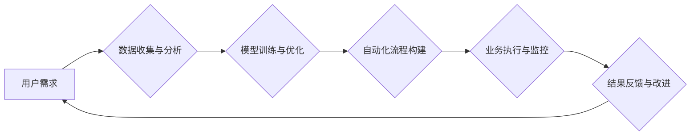

> 自动化创业, 规模化增长, 机器学习, 深度学习, 自然语言处理, 流程自动化, 数据分析, 云计算

## 1. 背景介绍

在当今科技飞速发展的时代，创业者们面临着前所未有的机遇和挑战。传统创业模式的局限性日益凸显，而自动化创业模式则成为了一种新的趋势。自动化创业是指利用人工智能、机器学习等技术，构建自动化流程，实现创业项目的规模化增长。

自动化创业的核心在于利用技术的力量，解放人力，提高效率，降低成本，从而实现可持续的增长。例如，利用机器学习算法自动完成客户服务、内容创作、市场营销等任务，可以帮助创业者节省大量人力成本，并将精力集中在更重要的战略决策上。

## 2. 核心概念与联系

**2.1 自动化创业的核心概念**

* **自动化:** 通过代码、流程和工具，将重复性、规则性任务自动化，减少人工干预。
* **创业:**  建立新企业，开发新产品或服务，创造新的价值。
* **规模化增长:**  通过自动化和数据驱动，实现业务快速扩张，扩大市场份额。

**2.2 自动化创业的联系**

自动化创业将自动化技术与创业模式相结合，通过以下方式实现规模化增长：

* **提高效率:** 自动化流程可以显著提高工作效率，减少人工错误，释放人力资源。
* **降低成本:** 自动化可以降低运营成本，例如人力成本、营销成本等。
* **个性化体验:** 利用数据分析和机器学习，可以提供更个性化的产品和服务，提升用户体验。
* **数据驱动决策:** 自动化可以收集和分析大量数据，为创业者提供数据驱动的决策支持。

**2.3 自动化创业流程图**



## 3. 核心算法原理 & 具体操作步骤

**3.1 算法原理概述**

自动化创业的核心算法原理主要包括：

* **机器学习:** 利用算法从数据中学习，不断改进模型性能，实现自动化决策。
* **深度学习:**  一种更高级的机器学习算法，能够处理更复杂的数据，例如图像、语音、文本等。
* **自然语言处理:**  使计算机能够理解和处理人类语言，例如文本分类、情感分析、机器翻译等。
* **流程自动化:**  利用软件工具，自动执行重复性任务，例如数据录入、报表生成等。

**3.2 算法步骤详解**

以机器学习为例，其核心步骤包括：

1. **数据收集与预处理:** 收集相关数据，并进行清洗、转换、特征提取等预处理工作。
2. **模型选择:** 根据任务需求选择合适的机器学习模型，例如线性回归、决策树、支持向量机等。
3. **模型训练:** 利用训练数据，训练机器学习模型，使其能够学习数据中的规律。
4. **模型评估:** 利用测试数据，评估模型的性能，例如准确率、召回率、F1-score等。
5. **模型优化:** 根据评估结果，调整模型参数，提高模型性能。
6. **模型部署:** 将训练好的模型部署到生产环境中，用于实际应用。

**3.3 算法优缺点**

* **优点:** 能够自动学习和改进，提高效率和准确性。
* **缺点:** 需要大量数据进行训练，模型训练时间长，对数据质量要求高。

**3.4 算法应用领域**

* **客户服务:** 自动化客服机器人，提供24小时在线服务。
* **内容创作:** 利用机器学习生成文章、广告文案等内容。
* **市场营销:**  精准营销，根据用户画像推送个性化广告。
* **风险控制:**  利用机器学习识别欺诈行为，降低风险。

## 4. 数学模型和公式 & 详细讲解 & 举例说明

**4.1 数学模型构建**

在机器学习中，常用的数学模型包括线性回归、逻辑回归、支持向量机等。

**4.1.1 线性回归模型**

线性回归模型假设数据之间存在线性关系，可以用以下公式表示：

$$y = w_0 + w_1x_1 + w_2x_2 + ... + w_nx_n + \epsilon$$

其中：

* $y$ 是预测值
* $x_1, x_2, ..., x_n$ 是输入特征
* $w_0, w_1, w_2, ..., w_n$ 是模型参数
* $\epsilon$ 是误差项

**4.1.2 逻辑回归模型**

逻辑回归模型用于分类问题，将输入特征映射到0到1之间的概率值，表示样本属于某一类别的概率。其数学公式如下：

$$P(y=1|x) = \frac{1}{1 + e^{-(w_0 + w_1x_1 + w_2x_2 + ... + w_nx_n)}}$$

其中：

* $P(y=1|x)$ 是样本属于类别1的概率
* $x_1, x_2, ..., x_n$ 是输入特征
* $w_0, w_1, w_2, ..., w_n$ 是模型参数

**4.2 公式推导过程**

线性回归模型的参数可以通过最小二乘法进行估计，逻辑回归模型的参数可以通过最大似然估计进行估计。

**4.3 案例分析与讲解**

例如，我们可以利用线性回归模型预测房价，输入特征包括房屋面积、房间数量、地理位置等，输出预测房价。

## 5. 项目实践：代码实例和详细解释说明

**5.1 开发环境搭建**

* Python 3.x
* Jupyter Notebook
* scikit-learn 机器学习库
* pandas 数据处理库
* matplotlib 数据可视化库

**5.2 源代码详细实现**

```python
import pandas as pd
from sklearn.linear_model import LinearRegression
from sklearn.model_selection import train_test_split
from sklearn.metrics import mean_squared_error

# 加载数据
data = pd.read_csv('house_price.csv')

# 选择特征和目标变量
X = data[['area', 'rooms', 'location']]
y = data['price']

# 将数据分为训练集和测试集
X_train, X_test, y_train, y_test = train_test_split(X, y, test_size=0.2, random_state=42)

# 创建线性回归模型
model = LinearRegression()

# 训练模型
model.fit(X_train, y_train)

# 预测测试集数据
y_pred = model.predict(X_test)

# 计算模型性能
mse = mean_squared_error(y_test, y_pred)
print(f'Mean Squared Error: {mse}')
```

**5.3 代码解读与分析**

* 首先，我们加载数据，选择特征和目标变量。
* 然后，我们将数据分为训练集和测试集，用于训练和评估模型。
* 创建线性回归模型，并使用训练集训练模型。
* 预测测试集数据，并计算模型性能。

**5.4 运行结果展示**

运行代码后，会输出模型的均方误差值，该值越小，模型性能越好。

## 6. 实际应用场景

**6.1 自动化客服机器人**

利用自然语言处理技术，可以构建自动化客服机器人，24小时在线解答用户问题，提高客户服务效率。

**6.2 内容创作平台**

利用机器学习算法，可以自动生成文章、广告文案等内容，帮助内容创作平台提高效率，降低成本。

**6.3 个性化推荐系统**

利用数据分析和机器学习，可以构建个性化推荐系统，根据用户的兴趣爱好，推荐相关产品或服务。

**6.4 风险控制系统**

利用机器学习算法，可以识别欺诈行为，降低金融机构的风险。

**6.5 未来应用展望**

自动化创业的应用场景还在不断扩展，未来将更加广泛地应用于各个领域，例如医疗、教育、交通等。

## 7. 工具和资源推荐

**7.1 学习资源推荐**

* **在线课程:** Coursera, edX, Udemy 等平台提供丰富的机器学习、深度学习课程。
* **书籍:** 《Python机器学习》、《深度学习》等书籍。
* **开源项目:** TensorFlow, PyTorch 等开源机器学习框架。

**7.2 开发工具推荐**

* **Python:**  机器学习开发的常用语言。
* **Jupyter Notebook:**  交互式编程环境，方便机器学习开发和调试。
* **scikit-learn:**  Python机器学习库。

**7.3 相关论文推荐**

* **《ImageNet Classification with Deep Convolutional Neural Networks》**
* **《Attention Is All You Need》**
* **《BERT: Pre-training of Deep Bidirectional Transformers for Language Understanding》**

## 8. 总结：未来发展趋势与挑战

**8.1 研究成果总结**

自动化创业技术取得了显著进展，机器学习、深度学习等算法在各个领域得到了广泛应用。

**8.2 未来发展趋势**

* **更强大的算法:**  未来将出现更强大的机器学习算法，能够处理更复杂的数据，实现更精准的预测。
* **更广泛的应用场景:**  自动化创业将应用于更多领域，例如医疗、教育、交通等。
* **更智能的系统:**  自动化创业系统将更加智能化，能够自主学习和改进，提供更个性化的服务。

**8.3 面临的挑战**

* **数据安全:**  自动化创业需要大量数据，如何保证数据安全是一个重要挑战。
* **算法偏见:**  机器学习算法可能存在偏见，需要进行公平性评估和改进。
* **伦理问题:**  自动化创业可能带来一些伦理问题，例如工作岗位替代等，需要进行深入探讨和解决。

**8.4 研究展望**

未来，自动化创业领域的研究将更加注重算法的公平性、安全性、可解释性等方面，并探索更智能、更可持续的自动化创业模式。

## 9. 附录：常见问题与解答

**9.1 如何选择合适的机器学习算法？**

选择合适的机器学习算法需要根据具体任务需求和数据特点进行选择。例如，对于分类问题，可以考虑逻辑回归、支持向量机等算法；对于回归问题，可以考虑线性回归、决策树等算法。

**9.2 如何处理不完整的数据？**

处理不完整的数据可以使用多种方法，例如删除缺失值、填充缺失值、使用缺失值指示器等。

**9.3 如何评估机器学习模型的性能？**

常用的机器学习模型性能评估指标包括准确率、召回率、F1-score、AUC等。

**9.4 如何防止机器学习算法的过拟合？**

过拟合是指模型在训练数据上表现很好，但在测试数据上表现较差。可以使用正则化、交叉验证等方法来防止过拟合。


作者：禅与计算机程序设计艺术 / Zen and the Art of Computer Programming 
<end_of_turn>