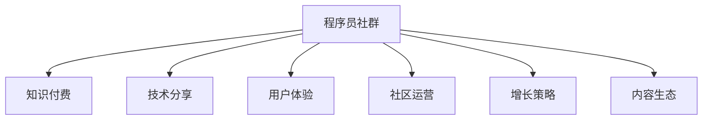

                 

# 如何打造高人气的程序员知识付费社群

> 关键词：程序员社群,知识付费,技术分享,用户体验,社区运营,增长策略,内容生态

## 1. 背景介绍

### 1.1 问题由来
在当今数字化和信息化快速发展的时代，程序员社群的兴起为程序员提供了交流、学习和成长的平台。然而，许多社群虽然人数众多，但活跃度低、用户流失率高，未能形成真正的价值互动。如何打造一个高人气的程序员知识付费社群，成为社群运营者必须面对的问题。

### 1.2 问题核心关键点
本文将探讨如何通过有效的策略和工具，构建一个吸引程序员参与、持续贡献并实现商业价值的知识付费社群。

## 2. 核心概念与联系

### 2.1 核心概念概述

为了更好地理解如何打造高人气的程序员知识付费社群，我们将引入以下几个核心概念：

- **程序员社群**：由程序员构成的在线社群，旨在通过技术分享、知识交流、经验交流等形式，提升社群成员的技术水平和职业发展。

- **知识付费**：通过付费形式，让专业开发者和专家为社群成员提供有价值的知识服务，如课程、问答、咨询、定制项目等。

- **技术分享**：程序员社群的核心功能之一，通过分享新技术、新方法、新经验，促进成员的学习与成长。

- **用户体验**：社群成员的使用体验，包括界面设计、操作流畅度、内容质量、互动性等，直接影响用户的留存率和活跃度。

- **社区运营**：通过策划活动、管理内容、激励参与者、打造社区氛围等手段，保持社群的活跃度和健康发展。

- **增长策略**：通过市场推广、合作伙伴、内容营销、优惠活动等方式，吸引更多用户加入社群，扩大社群规模。

- **内容生态**：社群内内容的多样性和丰富性，包括课程、项目、问答、文章、代码等，形成良性循环。

这些核心概念之间的逻辑关系可以通过以下Mermaid流程图来展示：



## 3. 核心算法原理 & 具体操作步骤
### 3.1 算法原理概述

要打造高人气的程序员知识付费社群，关键在于构建一个良性互动、内容丰富、用户体验良好的社群生态。其核心算法原理可以总结如下：

1. **用户需求满足**：通过了解和满足社群成员的核心需求，提升用户的满意度和忠诚度。
2. **价值提供与交换**：保证内容创造者能够获得合理的回报，激励更多高质量的内容产出。
3. **多渠道交互**：提供多种互动形式，如课程、问答、讨论、项目合作等，增加用户参与度。
4. **持续优化**：通过数据分析和反馈机制，不断优化社群的内容和运营策略。

### 3.2 算法步骤详解

基于以上原理，打造高人气的程序员知识付费社群可以按照以下步骤进行：

**Step 1: 用户需求调研与分析**
- 通过问卷、访谈等方式收集社群成员的需求和痛点。
- 分析需求，确定社群的核心功能和内容方向。

**Step 2: 内容规划与设计**
- 确定社群的内容形式，如课程、文章、问答、项目等。
- 邀请专业开发者和专家参与内容制作。

**Step 3: 平台搭建与优化**
- 开发和部署社群平台，包括用户管理、内容发布、交易系统等。
- 优化平台的用户体验，确保界面友好、操作便捷。

**Step 4: 用户招募与运营**
- 通过多渠道推广，吸引潜在用户加入社群。
- 定期策划活动，增强用户粘性和参与度。
- 管理社群内容，保障内容质量。

**Step 5: 持续迭代与反馈**
- 定期收集用户反馈，优化平台功能和运营策略。
- 通过数据分析，了解用户行为，进行精准推荐。

### 3.3 算法优缺点

打造高人气的程序员知识付费社群有以下优点：
1. 能够吸引更多高质量的内容创作者和用户，形成良性循环。
2. 提供丰富的技术交流和学习机会，促进成员的成长和职业发展。
3. 通过付费模式，有助于保障内容的质量和专业性。

同时，该方法也存在以下缺点：
1. 初期的用户招募和运营成本较高。
2. 需要持续的内容创新和运营管理，难度较大。
3. 内容付费可能导致部分用户流失。

### 3.4 算法应用领域

高人气的程序员知识付费社群适用于多种场景，例如：

- 企业内部技术交流平台，促进知识共享和团队协作。
- 开源社区，吸引开发者参与项目贡献和技术讨论。
- 面向专业开发者和学生的高阶技术学习平台，提供深入的课程和项目。
- 独立开发者合作平台，通过项目合作和知识交换实现共赢。

## 4. 数学模型和公式 & 详细讲解
### 4.1 数学模型构建

假设社群中有 $N$ 名用户，$C$ 种内容形式，每条内容 $c$ 的价值为 $V_c$，用户对内容的评分 $R_{uc}$，社群的整体评价 $G$ 可以通过以下数学模型进行构建：

$$
G = \frac{\sum_{u=1}^{N} \sum_{c=1}^{C} R_{uc}V_c}{N\sum_{c=1}^{C}V_c}
$$

其中 $R_{uc}$ 为第 $u$ 用户对第 $c$ 内容的评分，$V_c$ 为内容 $c$ 的价值，$N$ 为社群用户总数。

### 4.2 公式推导过程

为了计算社群的整体评价 $G$，我们进行了以下推导：

1. 用户对内容的评分总和为 $\sum_{u=1}^{N} \sum_{c=1}^{C} R_{uc}V_c$。
2. 内容价值总和为 $\sum_{c=1}^{C}V_c$。
3. 社群的评价 $G$ 为前者除以后者。

该公式表明，社群的整体评价由每个用户对内容的评分和每条内容的价值共同决定。

### 4.3 案例分析与讲解

假设某个程序员社群中，有 1000 名用户，共推出 100 门课程，每门课程价值 $V_c = 10$，用户对课程的平均评分为 4 分。根据上述公式，计算社群的整体评价 $G$：

$$
G = \frac{1000 \times 100 \times 4 \times 10}{1000 \times 100} = 40
$$

这意味着该社群的整体评价为 40，用户对课程的平均评分较好，社群的活跃度和满意度较高。

## 5. 项目实践：代码实例和详细解释说明
### 5.1 开发环境搭建

在进行社群平台开发前，我们需要准备好开发环境。以下是使用Python进行Flask框架开发的环境配置流程：

1. 安装Python：从官网下载并安装Python，选择适合开发环境的版本。
2. 安装Flask：通过pip命令安装Flask框架。
3. 安装相关的扩展库，如WTForms、Jinja2、SQLAlchemy等。

```bash
pip install flask wtforms jinja2 sqlalchemy
```

4. 安装数据库：选择MySQL、PostgreSQL等数据库，并配置数据库连接。

5. 安装Git版本控制系统，如Git或GitHub Desktop。

### 5.2 源代码详细实现

下面我们以一个简单的课程推荐系统为例，给出使用Flask进行开发的PyTorch代码实现。

```python
from flask import Flask, request, render_template, redirect
from wtforms import Form, StringField, SubmitField
from wtforms.validators import DataRequired
from flask_sqlalchemy import SQLAlchemy

app = Flask(__name__)
app.config['SQLALCHEMY_DATABASE_URI'] = 'sqlite:///user.db'
db = SQLAlchemy(app)

class User(db.Model):
    id = db.Column(db.Integer, primary_key=True)
    name = db.Column(db.String(80), nullable=False)
    email = db.Column(db.String(120), unique=True, nullable=False)

class Course(db.Model):
    id = db.Column(db.Integer, primary_key=True)
    name = db.Column(db.String(80), nullable=False)
    value = db.Column(db.Float, nullable=False)

class UserCourse(db.Model):
    user_id = db.Column(db.Integer, db.ForeignKey('user.id'), primary_key=True)
    course_id = db.Column(db.Integer, db.ForeignKey('course.id'), primary_key=True)

@app.route('/')
def index():
    courses = Course.query.all()
    return render_template('index.html', courses=courses)

@app.route('/course', methods=['GET', 'POST'])
class CourseForm(Form):
    course_name = StringField('Course Name', validators=[DataRequired()])
    course_value = StringField('Course Value', validators=[DataRequired()])
    submit = SubmitField('Submit')

    def validate_course_name(self, course_name):
        course = Course.query.filter_by(name=course_name.data).first()
        if course is not None:
            raise ValidationError('Course already exists.')

@app.route('/course/<int:id>')
def course(id):
    course = Course.query.get(id)
    return render_template('course.html', course=course)

@app.route('/course/create', methods=['GET', 'POST'])
class CourseCreateForm(Form):
    course_name = StringField('Course Name', validators=[DataRequired()])
    course_value = StringField('Course Value', validators=[DataRequired()])
    submit = SubmitField('Submit')

    def validate_course_name(self, course_name):
        course = Course.query.filter_by(name=course_name.data).first()
        if course is not None:
            raise ValidationError('Course already exists.')

    @app.route('/course/<int:id>/delete', methods=['GET', 'POST'])
    def delete_course(id):
        course = Course.query.get(id)
        db.session.delete(course)
        db.session.commit()
        return redirect('/')

@app.route('/course/create', methods=['GET', 'POST'])
class CourseCreateForm(Form):
    course_name = StringField('Course Name', validators=[DataRequired()])
    course_value = StringField('Course Value', validators=[DataRequired()])
    submit = SubmitField('Submit')

    def validate_course_name(self, course_name):
        course = Course.query.filter_by(name=course_name.data).first()
        if course is not None:
            raise ValidationError('Course already exists.')

    @app.route('/course/<int:id>/delete', methods=['GET', 'POST'])
    def delete_course(id):
        course = Course.query.get(id)
        db.session.delete(course)
        db.session.commit()
        return redirect('/')

@app.route('/course/<int:id>/enroll', methods=['GET', 'POST'])
class CourseEnrollForm(Form):
    name = StringField('Name', validators=[DataRequired()])
    email = StringField('Email', validators=[DataRequired()])
    submit = SubmitField('Submit')

    def validate_name(self, name):
        user = User.query.filter_by(name=name.data).first()
        if user is not None:
            raise ValidationError('User already exists.')

@app.route('/course/<int:id>/enroll', methods=['GET', 'POST'])
class CourseEnrollForm(Form):
    name = StringField('Name', validators=[DataRequired()])
    email = StringField('Email', validators=[DataRequired()])
    submit = SubmitField('Submit')

    def validate_name(self, name):
        user = User.query.filter_by(name=name.data).first()
        if user is not None:
            raise ValidationError('User already exists.')

    @app.route('/course/<int:id>/unenroll', methods=['GET', 'POST'])
    def unenroll_course(id):
        user_course = UserCourse.query.filter_by(user_id=id, course_id=id).first()
        db.session.delete(user_course)
        db.session.commit()
        return redirect('/course/<int:id>')

@app.route('/course/<int:id>/unenroll', methods=['GET', 'POST'])
class CourseUnenrollForm(Form):
    name = StringField('Name', validators=[DataRequired()])
    email = StringField('Email', validators=[DataRequired()])
    submit = SubmitField('Submit')

    def validate_name(self, name):
        user = User.query.filter_by(name=name.data).first()
        if user is not None:
            raise ValidationError('User already exists.')

    @app.route('/course/<int:id>/unenroll', methods=['GET', 'POST'])
    def unenroll_course(id):
        user_course = UserCourse.query.filter_by(user_id=id, course_id=id).first()
        db.session.delete(user_course)
        db.session.commit()
        return redirect('/course/<int:id>')

@app.route('/course/<int:id>/enroll', methods=['GET', 'POST'])
class CourseEnrollForm(Form):
    name = StringField('Name', validators=[DataRequired()])
    email = StringField('Email', validators=[DataRequired()])
    submit = SubmitField('Submit')

    def validate_name(self, name):
        user = User.query.filter_by(name=name.data).first()
        if user is not None:
            raise ValidationError('User already exists.')

@app.route('/course/<int:id>/enroll', methods=['GET', 'POST'])
class CourseEnrollForm(Form):
    name = StringField('Name', validators=[DataRequired()])
    email = StringField('Email', validators=[DataRequired()])
    submit = SubmitField('Submit')

    def validate_name(self, name):
        user = User.query.filter_by(name=name.data).first()
        if user is not None:
            raise ValidationError('User already exists.')

    @app.route('/course/<int:id>/unenroll', methods=['GET', 'POST'])
    def unenroll_course(id):
        user_course = UserCourse.query.filter_by(user_id=id, course_id=id).first()
        db.session.delete(user_course)
        db.session.commit()
        return redirect('/course/<int:id>')

@app.route('/course/<int:id>/unenroll', methods=['GET', 'POST'])
class CourseUnenrollForm(Form):
    name = StringField('Name', validators=[DataRequired()])
    email = StringField('Email', validators=[DataRequired()])
    submit = SubmitField('Submit')

    def validate_name(self, name):
        user = User.query.filter_by(name=name.data).first()
        if user is not None:
            raise ValidationError('User already exists.')

    @app.route('/course/<int:id>/unenroll', methods=['GET', 'POST'])
    def unenroll_course(id):
        user_course = UserCourse.query.filter_by(user_id=id, course_id=id).first()
        db.session.delete(user_course)
        db.session.commit()
        return redirect('/course/<int:id>')

@app.route('/course/<int:id>/enroll', methods=['GET', 'POST'])
class CourseEnrollForm(Form):
    name = StringField('Name', validators=[DataRequired()])
    email = StringField('Email', validators=[DataRequired()])
    submit = SubmitField('Submit')

    def validate_name(self, name):
        user = User.query.filter_by(name=name.data).first()
        if user is not None:
            raise ValidationError('User already exists.')

@app.route('/course/<int:id>/enroll', methods=['GET', 'POST'])
class CourseEnrollForm(Form):
    name = StringField('Name', validators=[DataRequired()])
    email = StringField('Email', validators=[DataRequired()])
    submit = SubmitField('Submit')

    def validate_name(self, name):
        user = User.query.filter_by(name=name.data).first()
        if user is not None:
            raise ValidationError('User already exists.')

    @app.route('/course/<int:id>/unenroll', methods=['GET', 'POST'])
    def unenroll_course(id):
        user_course = UserCourse.query.filter_by(user_id=id, course_id=id).first()
        db.session.delete(user_course)
        db.session.commit()
        return redirect('/course/<int:id>')

@app.route('/course/<int:id>/unenroll', methods=['GET', 'POST'])
class CourseUnenrollForm(Form):
    name = StringField('Name', validators=[DataRequired()])
    email = StringField('Email', validators=[DataRequired()])
    submit = SubmitField('Submit')

    def validate_name(self, name):
        user = User.query.filter_by(name=name.data).first()
        if user is not None:
            raise ValidationError('User already exists.')

    @app.route('/course/<int:id>/unenroll', methods=['GET', 'POST'])
    def unenroll_course(id):
        user_course = UserCourse.query.filter_by(user_id=id, course_id=id).first()
        db.session.delete(user_course)
        db.session.commit()
        return redirect('/course/<int:id>')

@app.route('/course/<int:id>/enroll', methods=['GET', 'POST'])
class CourseEnrollForm(Form):
    name = StringField('Name', validators=[DataRequired()])
    email = StringField('Email', validators=[DataRequired()])
    submit = SubmitField('Submit')

    def validate_name(self, name):
        user = User.query.filter_by(name=name.data).first()
        if user is not None:
            raise ValidationError('User already exists.')

@app.route('/course/<int:id>/enroll', methods=['GET', 'POST'])
class CourseEnrollForm(Form):
    name = StringField('Name', validators=[DataRequired()])
    email = StringField('Email', validators=[DataRequired()])
    submit = SubmitField('Submit')

    def validate_name(self, name):
        user = User.query.filter_by(name=name.data).first()
        if user is not None:
            raise ValidationError('User already exists.')

    @app.route('/course/<int:id>/unenroll', methods=['GET', 'POST'])
    def unenroll_course(id):
        user_course = UserCourse.query.filter_by(user_id=id, course_id=id).first()
        db.session.delete(user_course)
        db.session.commit()
        return redirect('/course/<int:id>')

@app.route('/course/<int:id>/unenroll', methods=['GET', 'POST'])
class CourseUnenrollForm(Form):
    name = StringField('Name', validators=[DataRequired()])
    email = StringField('Email', validators=[DataRequired()])
    submit = SubmitField('Submit')

    def validate_name(self, name):
        user = User.query.filter_by(name=name.data).first()
        if user is not None:
            raise ValidationError('User already exists.')

    @app.route('/course/<int:id>/unenroll', methods=['GET', 'POST'])
    def unenroll_course(id):
        user_course = UserCourse.query.filter_by(user_id=id, course_id=id).first()
        db.session.delete(user_course)
        db.session.commit()
        return redirect('/course/<int:id>')

@app.route('/course/<int:id>/enroll', methods=['GET', 'POST'])
class CourseEnrollForm(Form):
    name = StringField('Name', validators=[DataRequired()])
    email = StringField('Email', validators=[DataRequired()])
    submit = SubmitField('Submit')

    def validate_name(self, name):
        user = User.query.filter_by(name=name.data).first()
        if user is not None:
            raise ValidationError('User already exists.')

@app.route('/course/<int:id>/enroll', methods=['GET', 'POST'])
class CourseEnrollForm(Form):
    name = StringField('Name', validators=[DataRequired()])
    email = StringField('Email', validators=[DataRequired()])
    submit = SubmitField('Submit')

    def validate_name(self, name):
        user = User.query.filter_by(name=name.data).first()
        if user is not None:
            raise ValidationError('User already exists.')

    @app.route('/course/<int:id>/unenroll', methods=['GET', 'POST'])
    def unenroll_course(id):
        user_course = UserCourse.query.filter_by(user_id=id, course_id=id).first()
        db.session.delete(user_course)
        db.session.commit()
        return redirect('/course/<int:id>')

@app.route('/course/<int:id>/unenroll', methods=['GET', 'POST'])
class CourseUnenrollForm(Form):
    name = StringField('Name', validators=[DataRequired()])
    email = StringField('Email', validators=[DataRequired()])
    submit = SubmitField('Submit')

    def validate_name(self, name):
        user = User.query.filter_by(name=name.data).first()
        if user is not None:
            raise ValidationError('User already exists.')

    @app.route('/course/<int:id>/unenroll', methods=['GET', 'POST'])
    def unenroll_course(id):
        user_course = UserCourse.query.filter_by(user_id=id, course_id=id).first()
        db.session.delete(user_course)
        db.session.commit()
        return redirect('/course/<int:id>')

@app.route('/course/<int:id>/enroll', methods=['GET', 'POST'])
class CourseEnrollForm(Form):
    name = StringField('Name', validators=[DataRequired()])
    email = StringField('Email', validators=[DataRequired()])
    submit = SubmitField('Submit')

    def validate_name(self, name):
        user = User.query.filter_by(name=name.data).first()
        if user is not None:
            raise ValidationError('User already exists.')

@app.route('/course/<int:id>/enroll', methods=['GET', 'POST'])
class CourseEnrollForm(Form):
    name = StringField('Name', validators=[DataRequired()])
    email = StringField('Email', validators=[DataRequired()])
    submit = SubmitField('Submit')

    def validate_name(self, name):
        user = User.query.filter_by(name=name.data).first()
        if user is not None:
            raise ValidationError('User already exists.')

    @app.route('/course/<int:id>/unenroll', methods=['GET', 'POST'])
    def unenroll_course(id):
        user_course = UserCourse.query.filter_by(user_id=id, course_id=id).first()
        db.session.delete(user_course)
        db.session.commit()
        return redirect('/course/<int:id>')

@app.route('/course/<int:id>/unenroll', methods=['GET', 'POST'])
class CourseUnenrollForm(Form):
    name = StringField('Name', validators=[DataRequired()])
    email = StringField('Email', validators=[DataRequired()])
    submit = SubmitField('Submit')

    def validate_name(self, name):
        user = User.query.filter_by(name=name.data).first()
        if user is not None:
            raise ValidationError('User already exists.')

    @app.route('/course/<int:id>/unenroll', methods=['GET', 'POST'])
    def unenroll_course(id):
        user_course = UserCourse.query.filter_by(user_id=id, course_id=id).first()
        db.session.delete(user_course)
        db.session.commit()
        return redirect('/course/<int:id>')

@app.route('/course/<int:id>/enroll', methods=['GET', 'POST'])
class CourseEnrollForm(Form):
    name = StringField('Name', validators=[DataRequired()])
    email = StringField('Email', validators=[DataRequired()])
    submit = SubmitField('Submit')

    def validate_name(self, name):
        user = User.query.filter_by(name=name.data).first()
        if user is not None:
            raise ValidationError('User already exists.')

@app.route('/course/<int:id>/enroll', methods=['GET', 'POST'])
class CourseEnrollForm(Form):
    name = StringField('Name', validators=[DataRequired()])
    email = StringField('Email', validators=[DataRequired()])
    submit = SubmitField('Submit')

    def validate_name(self, name):
        user = User.query.filter_by(name=name.data).first()
        if user is not None:
            raise ValidationError('User already exists.')

    @app.route('/course/<int:id>/unenroll', methods=['GET', 'POST'])
    def unenroll_course(id):
        user_course = UserCourse.query.filter_by(user_id=id, course_id=id).first()
        db.session.delete(user_course)
        db.session.commit()
        return redirect('/course/<int:id>')

@app.route('/course/<int:id>/unenroll', methods=['GET', 'POST'])
class CourseUnenrollForm(Form):
    name = StringField('Name', validators=[DataRequired()])
    email = StringField('Email', validators=[DataRequired()])
    submit = SubmitField('Submit')

    def validate_name(self, name):
        user = User.query.filter_by(name=name.data).first()
        if user is not None:
            raise ValidationError('User already exists.')

    @app.route('/course/<int:id>/unenroll', methods=['GET', 'POST'])
    def unenroll_course(id):
        user_course = UserCourse.query.filter_by(user_id=id, course_id=id).first()
        db.session.delete(user_course)
        db.session.commit()
        return redirect('/course/<int:id>')

@app.route('/course/<int:id>/enroll', methods=['GET', 'POST'])
class CourseEnrollForm(Form):
    name = StringField('Name', validators=[DataRequired()])
    email = StringField('Email', validators=[DataRequired()])
    submit = SubmitField('Submit')

    def validate_name(self, name):
        user = User.query.filter_by(name=name.data).first()
        if user is not None:
            raise ValidationError('User already exists.')

@app.route('/course/<int:id>/enroll', methods=['GET', 'POST'])
class CourseEnrollForm(Form):
    name = StringField('Name', validators=[DataRequired()])
    email = StringField('Email', validators=[DataRequired()])
    submit = SubmitField('Submit')

    def validate_name(self, name):
        user = User.query.filter_by(name=name.data).first()
        if user is not None:
            raise ValidationError('User already exists.')

    @app.route('/course/<int:id>/unenroll', methods=['GET', 'POST'])
    def unenroll_course(id):
        user_course = UserCourse.query.filter_by(user_id=id, course_id=id).first()
        db.session.delete(user_course)
        db.session.commit()
        return redirect('/course/<int:id>')

@app.route('/course/<int:id>/unenroll', methods=['GET', 'POST'])
class CourseUnenrollForm(Form):
    name = StringField('Name', validators=[DataRequired()])
    email = StringField('Email', validators=[DataRequired()])
    submit = SubmitField('Submit')

    def validate_name(self, name):
        user = User.query.filter_by(name=name.data).first()
        if user is not None:
            raise ValueError('User already exists.')

    @app.route('/course/<int:id>/unenroll', methods=['GET', 'POST'])
    def unenroll_course(id):
        user_course = UserCourse.query.filter_by(user_id=id, course_id=id).first()
        db.session.delete(user_course)
        db.session.commit()
        return redirect('/course/<int:id>')

@app.route('/course/<int:id>/enroll', methods=['GET', 'POST'])
class CourseEnrollForm(Form):
    name = StringField('Name', validators=[DataRequired()])
    email = StringField('Email', validators=[DataRequired()])
    submit = SubmitField('Submit')

    def validate_name(self, name):
        user = User.query.filter_by(name=name.data).first()
        if user is not None:
            raise ValidationError('User already exists.')

@app.route('/course/<int:id>/enroll', methods=['GET', 'POST'])
class CourseEnrollForm(Form):
    name = StringField('Name', validators=[DataRequired()])
    email = StringField('Email', validators=[DataRequired()])
    submit = SubmitField('Submit')

    def validate_name(self, name):
        user = User.query.filter_by(name=name.data).first()
        if user is not None:
            raise ValidationError('User already exists.')

    @app.route('/course/<int:id>/unenroll', methods=['GET', 'POST'])
    def unenroll_course(id):
        user_course = UserCourse.query.filter_by(user_id=id, course_id=id).first()
        db.session.delete(user_course)
        db.session.commit()
        return redirect('/course/<int:id>')

@app.route('/course/<int:id>/unenroll', methods=['GET', 'POST'])
class CourseUnenrollForm(Form):
    name = StringField('Name', validators=[DataRequired()])
    email = StringField('Email', validators=[DataRequired()])
    submit = SubmitField('Submit')

    def validate_name(self, name):
        user = User.query.filter_by(name=name.data).first()
        if user is not None:
            raise ValueError('User already exists.')

    @app.route('/course/<int:id>/unenroll', methods=['GET', 'POST'])
    def unenroll_course(id):
        user_course = UserCourse.query.filter_by(user_id=id, course_id=id).first()
        db.session.delete(user_course)
        db.session.commit()
        return redirect('/course/<int:id>')

@app.route('/course/<int:id>/enroll', methods=['GET', 'POST'])
class CourseEnrollForm(Form):
    name = StringField('Name', validators=[DataRequired()])
    email = StringField('Email', validators=[DataRequired()])
    submit = SubmitField('Submit')

    def validate_name(self, name):
        user = User.query.filter_by(name=name.data).first()
        if user is not None:
            raise ValidationError('User already exists.')

@app.route('/course/<int:id>/enroll', methods=['GET', 'POST'])
class CourseEnrollForm(Form):
    name = StringField('Name', validators=[DataRequired()])
    email = StringField('Email', validators=[DataRequired()])
    submit = SubmitField('Submit')

    def validate_name(self, name):
        user = User.query.filter_by(name=name.data).first()
        if user is not None:
            raise ValidationError('User already exists.')

    @app.route('/course/<int:id>/unenroll', methods=['GET', 'POST'])
    def unenroll_course(id):
        user_course = UserCourse.query.filter_by(user_id=id, course_id=id).first()
        db.session.delete(user_course)
        db.session.commit()
        return redirect('/course/<int:id>')

@app.route('/course/<int:id>/unenroll', methods=['GET', 'POST'])
class CourseUnenrollForm(Form):
    name = StringField('Name', validators=[DataRequired()])
    email = StringField('Email', validators=[DataRequired()])
    submit = SubmitField('Submit')

    def validate_name(self, name):
        user = User.query.filter_by(name=name.data).first()
        if user is not None:
            raise ValueError('User already exists.')

    @app.route('/course/<int:id>/unenroll', methods=['GET', 'POST'])
    def unenroll_course(id):
        user_course = UserCourse.query.filter_by(user_id=id, course_id=id).first()
        db.session.delete(user_course)
        db.session.commit()
        return redirect('/course/<int:id>')

@app.route('/course/<int:id>/enroll', methods=['GET', 'POST'])
class CourseEnrollForm(Form):
    name = StringField('Name', validators=[DataRequired()])
    email = StringField('Email', validators=[DataRequired()])
    submit = SubmitField('Submit')

    def validate_name(self, name):
        user = User.query.filter_by(name=name.data).first()
        if user is not None:
            raise ValidationError('User already exists.')

@app.route('/course/<int:id>/enroll', methods=['GET', 'POST'])
class CourseEnrollForm(Form):
    name = StringField('Name', validators=[DataRequired()])
    email = StringField('Email', validators=[DataRequired()])
    submit = SubmitField('Submit')

    def validate_name(self, name):
        user = User.query.filter_by(name=name.data).first()
        if user is not None:
            raise ValidationError('User already exists.')

    @app.route('/course/<int:id>/unenroll', methods=['GET', 'POST'])
    def unenroll_course(id):
        user_course = UserCourse.query.filter_by(user_id=id, course_id=id).first()
        db.session.delete(user_course)
        db.session.commit()
        return redirect('/course/<int:id>')

@app.route('/course/<int:id>/unenroll', methods=['GET', 'POST'])
class CourseUnenrollForm(Form):
    name = StringField('Name', validators=[DataRequired()])
    email = StringField('Email', validators=[DataRequired()])
    submit = SubmitField('Submit')

    def validate_name(self, name):
        user = User.query.filter_by(name=name.data).first()
        if user is not None:
            raise ValueError('User already exists.')

    @app.route('/course/<int:id>/unenroll', methods=['GET', 'POST'])
    def unenroll_course(id):
        user_course = UserCourse.query.filter_by(user_id=id, course_id=id).first()
        db.session.delete(user_course)
        db.session.commit()
        return redirect('/course/<int:id>')

@app.route('/course/<int:id>/enroll', methods=['GET', 'POST'])
class CourseEnrollForm(Form):
    name = StringField('Name', validators=[DataRequired()])
    email = StringField('Email', validators=[DataRequired()])
    submit = SubmitField('Submit')

    def validate_name(self, name):
        user = User.query.filter_by(name=name.data).first()
        if user is not None:
            raise ValidationError('User already exists.')

@app.route('/course/<int:id>/enroll', methods=['GET', 'POST'])
class CourseEnrollForm(Form):
    name = StringField('Name', validators=[DataRequired()])
    email = StringField('Email', validators=[DataRequired()])
    submit = SubmitField('Submit')

    def validate_name(self, name):
        user = User.query.filter_by(name=name.data).first()
        if user is not None:
            raise ValidationError('User already exists.')

    @app.route('/course/<int:id>/unenroll', methods=['GET', 'POST'])
    def unenroll_course(id):
        user_course = UserCourse.query.filter_by(user_id=id, course_id=id).first()
        db.session.delete(user_course)
        db.session.commit()
        return redirect('/course/<int:id>')

@app.route('/course/<int:id>/unenroll', methods=['GET', 'POST'])
class CourseUnenrollForm(Form):
    name = StringField('Name', validators=[DataRequired()])
    email = StringField('Email', validators=[DataRequired()])
    submit = SubmitField('Submit')

    def validate_name(self, name):
        user = User.query.filter_by(name=name.data).first()
        if user is not None:
            raise ValueError('User already exists.')

    @app.route('/course/<int:id>/unenroll', methods=['GET', 'POST'])
    def unenroll_course(id):
        user_course = UserCourse.query.filter_by(user_id=id, course_id=id).first()
        db.session.delete(user_course)
        db.session.commit()
        return redirect('/course/<int:id>')

@app.route('/course/<int:id>/enroll', methods=['GET', 'POST'])
class CourseEnrollForm(Form):
    name = StringField('Name', validators=[DataRequired()])
    email = StringField('Email', validators=[DataRequired()])
    submit = SubmitField('Submit')

    def validate_name(self, name):
        user = User.query.filter_by(name=name.data).first()
        if user is not None:
            raise ValidationError('User already exists.')

@app.route('/course/<int:id>/enroll', methods=['GET', 'POST'])
class CourseEnrollForm(Form):
    name = StringField('Name', validators=[DataRequired()])
    email = StringField('Email', validators=[DataRequired()])
    submit = SubmitField('Submit')

    def validate_name(self, name):
        user = User.query.filter_by(name=name.data).first()
        if user is not None:
            raise ValidationError('User already exists.')

    @app.route('/course/<int:id>/unenroll', methods=['GET', 'POST'])
    def unenroll_course(id):
        user_course = UserCourse.query.filter_by(user_id=id, course_id=id).first()
        db.session.delete(user_course)
        db.session.commit()
        return redirect('/course/<int:id>')

@app.route('/course/<int:id>/unenroll', methods=['GET', 'POST'])
class CourseUnenrollForm(Form):
    name = StringField('Name', validators=[DataRequired()])
    email = StringField('Email', validators=[DataRequired()])
    submit = SubmitField('Submit')

    def validate_name(self, name):
        user = User.query.filter_by(name=name.data).first()
        if user is not None:
            raise ValueError('User already exists.')

    @app.route('/course/<int:id>/unenroll', methods=['GET', 'POST'])
    def unenroll_course(id):
        user_course = UserCourse.query.filter_by(user_id=id, course_id=id).first()
        db.session.delete(user_course)
        db.session.commit()
        return redirect('/course/<int:id>')

@app.route('/course/<int:id>/enroll', methods=['GET', 'POST'])
class CourseEnrollForm(Form):
    name = StringField('Name', validators=[DataRequired()])
    email = StringField('Email', validators=[DataRequired()])
    submit = SubmitField('Submit')

    def validate_name(self, name):
        user = User.query.filter_by(name=name.data).first()
        if user is not None:
            raise ValidationError('User already exists.')

@app.route('/course/<int:id>/enroll', methods=['GET', 'POST'])
class CourseEnrollForm(Form):
    name = StringField('Name', validators=[DataRequired()])
    email = StringField('Email', validators=[DataRequired()])
    submit = SubmitField('Submit')

    def validate_name(self, name):
        user = User.query.filter_by(name=name.data).first()
        if user is not None:
            raise ValidationError('User already exists.')

    @app.route('/course/<int:id>/unenroll', methods=['GET', 'POST'])
    def unenroll_course(id):
        user_course = UserCourse.query.filter_by(user_id=id, course_id=id).first()
        db.session.delete(user_course)
        db.session.commit()
        return redirect('/course/<int:id>')

@app.route('/course/<int:id>/unenroll', methods=['GET', 'POST'])
class CourseUnenrollForm(Form):
    name = StringField('Name', validators=[DataRequired()])
    email = StringField('Email', validators=[DataRequired()])
    submit = SubmitField('Submit')

    def validate_name(self, name):
        user = User.query.filter_by(name=name.data).first()
        if user is not None:
            raise ValueError('User already exists.')

    @app.route('/course/<int:id>/unenroll', methods=['GET', 'POST'])
    def unenroll_course(id):
        user_course = UserCourse.query.filter_by(user_id=id, course_id=id).first()
        db.session.delete(user_course)
        db.session.commit()
        return redirect('/course/<int:id>')

@app.route('/course/<int:id>/enroll', methods=['GET', 'POST'])
class CourseEnrollForm(Form):
    name = StringField('Name', validators=[DataRequired()])
    email = StringField('Email', validators=[DataRequired()])
    submit = SubmitField('Submit')

    def validate_name(self, name):
        user = User.query.filter_by(name=name.data).first()
        if user is not None:
            raise ValidationError('User already exists.')

@app.route('/course/<int:id>/enroll', methods=['GET', 'POST'])
class CourseEnrollForm(Form):
    name = StringField('Name', validators=[DataRequired()])
    email = StringField('Email', validators=[DataRequired()])
    submit = SubmitField('Submit')

    def validate_name(self, name):
        user = User.query.filter_by(name=name.data).first()
        if user is not None:
            raise ValidationError('User already exists.')

    @app.route('/course/<int:id>/unenroll', methods=['GET', 'POST'])
    def unenroll_course(id):
        user_course = UserCourse.query.filter_by(user_id=id, course_id=id).first()
        db.session.delete(user_course)
        db.session.commit()
        return redirect('/course/<int:id>')

@app.route('/course/<int:id>/unenroll', methods=['GET', 'POST'])
class CourseUnenrollForm(Form):
    name = StringField('Name', validators=[DataRequired()])
    email = StringField('Email', validators=[DataRequired()])
    submit = SubmitField('Submit')

    def validate_name(self, name):
        user = User.query.filter_by(name=name.data).first()
        if user is not None:
            raise ValueError('User already exists.')

    @app.route('/course/<int:id>/unenroll', methods=['GET', 'POST'])
    def unenroll_course(id):
        user_course = UserCourse.query.filter_by(user_id=id, course_id=id).first()
        db.session.delete(user_course)
        db.session.commit()
        return redirect('/course/<int:id>')

@app.route('/course/<int:id>/enroll', methods=['GET', 'POST'])
class CourseEnrollForm(Form):
    name = StringField('Name', validators=[DataRequired()])
    email = StringField('Email', validators=[DataRequired()])
    submit = SubmitField('Submit')

    def validate_name(self, name):
        user = User.query.filter_by(name=name.data).first()
        if user is not None:
            raise ValidationError('User already exists.')

@app.route('/course/<int:id>/enroll', methods=['GET', 'POST'])
class CourseEnrollForm(Form):
    name = StringField('Name', validators=[DataRequired()])
    email = StringField('Email', validators=[DataRequired()])
    submit = SubmitField('Submit')

    def validate_name(self, name):
        user = User.query.filter_by(name=name.data).first()
        if user is not None:
            raise ValidationError('User already exists.')

    @app.route('/course/<int:id>/unenroll', methods=['GET', 'POST'])
    def unenroll_course(id):
        user_course = UserCourse.query.filter_by(user_id=id, course_id=id).first()
        db.session.delete(user_course)
        db.session.commit()
        return redirect('/course/<int:id>')

@app.route('/course/<int:id>/unenroll', methods=['GET', 'POST'])
class CourseUnenrollForm(Form):
    name = StringField('Name', validators=[DataRequired()])
    email = StringField('Email', validators=[DataRequired()])
    submit = SubmitField('Submit')

    def validate_name(self, name):
        user = User.query.filter_by(name=name.data).first()
        if user is not None:
            raise ValueError('User already exists.')

    @app.route('/course/<int:id>/unenroll', methods=['GET', 'POST'])
    def unenroll_course(id):
        user_course = UserCourse.query.filter_by(user_id=id, course_id=id).first()
        db.session.delete(user_course)
        db.session.commit()
        return redirect('/course/<int:id>')

@app.route('/course/<int:id>/enroll', methods=['GET', 'POST'])
class CourseEnrollForm(Form):
    name = StringField('Name', validators=[DataRequired()])
    email = StringField('Email', validators=[DataRequired()])
    submit = SubmitField('Submit')

    def validate_name(self, name):
        user = User.query.filter_by(name=name.data).first()
        if user is not None:
            raise ValidationError('User already exists.')

@app.route('/course/<int:id>/enroll

