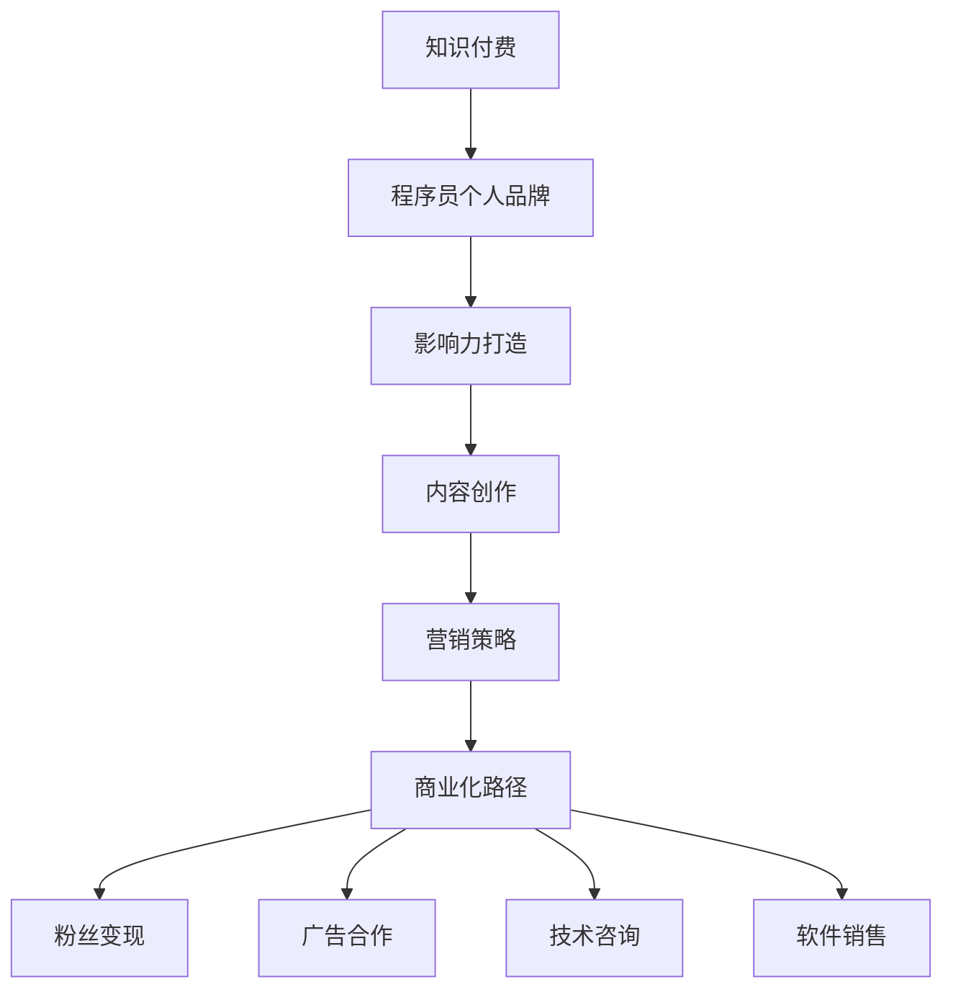

                 

# 如何打造高影响力的程序员知识付费个人品牌

> 关键词：知识付费，程序员品牌，影响力，内容创作，营销策略，技术分享，职业发展，商业化

## 1. 背景介绍

### 1.1 问题由来
近年来，随着互联网技术的发展和知识经济的兴起，知识付费成为了一种快速崛起的新模式。在信息技术行业，尤其是软件开发和人工智能等领域，拥有专业知识和实践经验的人士纷纷转型为知识付费个人品牌，通过在线课程、技术文章、视频讲座等方式，分享自己的心得和技能，以获取粉丝和收入。

然而，要想在激烈的知识付费市场中脱颖而出，打造一个具有高影响力、高收入的程序员个人品牌，并非易事。技术知识的不断更新迭代，市场需求的多样性，以及竞争者日益加剧，使得个人品牌的建立和维护变得更加复杂。因此，本文旨在探讨如何通过系统化的策略，打造高影响力的程序员知识付费个人品牌，为技术专家提供切实可行的指导。

### 1.2 问题核心关键点
打造高影响力的程序员个人品牌，需要从内容质量、个人品牌塑造、营销策略、商业化路径等多个方面进行全面考量。核心关键点包括：
- 定义品牌定位：明确自己的专业领域和目标受众，建立鲜明且具有吸引力的个人品牌形象。
- 制作优质内容：创作符合市场需求和受众期望的高质量技术文章、视频、课程等。
- 多渠道推广：通过社交媒体、技术社区、合作平台等渠道，有效传播个人品牌。
- 持续提升能力：不断学习和更新技术知识，提升自身专业水平，保持品牌竞争力。
- 商业化转化：通过粉丝变现、广告、合作等方式，实现商业价值。

本文将围绕这些关键点，深入探讨打造高影响力程序员个人品牌的全过程，包括技术内容的创作和传播、个人品牌的塑造与维护、营销策略的设计与执行、以及商业化的成功之道。

## 2. 核心概念与联系

### 2.1 核心概念概述

为更好地理解如何打造高影响力的程序员个人品牌，本节将介绍几个密切相关的核心概念：

- **知识付费**：一种通过在线支付获取高质量知识内容和服务的新模式，覆盖技术文章、在线课程、咨询指导等多种形式。
- **程序员个人品牌**：技术专家通过个人努力，建立并维护具有鲜明个性和专业特色的品牌形象，以便在技术社区、社交媒体等平台上获得更多关注和认可。
- **影响力打造**：通过优质的内容创作、有效的品牌营销、持续的学习成长，逐步在目标受众中建立权威性和知名度。
- **内容创作**：涉及技术文章、视频、代码库、项目展示等多种形式的原创内容，是吸引粉丝和转化变现的基础。
- **营销策略**：在品牌定位、传播渠道、推广手段等方面的规划和执行，是提升品牌曝光度和吸引力的关键。
- **商业化路径**：从粉丝变现、广告合作、技术咨询到软件销售等多种途径，实现个人品牌从内容创作到商业变现的完整闭环。

这些核心概念之间的逻辑关系可以通过以下Mermaid流程图来展示：



这个流程图展示了几者之间的逻辑关系：

1. 知识付费与程序员个人品牌的紧密联系，个人品牌建立在优质的内容创作基础上。
2. 内容创作与营销策略相辅相成，优秀的营销可以吸引更多粉丝关注。
3. 营销策略的最终目的是实现商业化，内容创作者可以通过多渠道变现。

## 3. 核心算法原理 & 具体操作步骤
### 3.1 算法原理概述

打造高影响力的程序员个人品牌，本质上是一个系统的、长期的过程，涉及多方面因素的协同作用。其核心思想是通过高质量的内容创作和有效的品牌营销，在目标受众中建立起权威性和知名度。

具体而言，可以将其分解为以下几个步骤：

1. **内容创作与发布**：产出符合市场需求和受众期望的技术文章、视频、课程等。
2. **品牌塑造与维护**：通过社交媒体、技术社区、博客等渠道，建立并维护个人品牌形象。
3. **粉丝互动与社群建设**：积极与粉丝互动，建立忠实的社群支持。
4. **营销策略设计**：制定有效的营销计划，提高品牌曝光度和吸引力。
5. **商业化路径选择**：选择合适的商业变现方式，实现品牌价值的最大化。

### 3.2 算法步骤详解

#### 步骤1: 内容创作与发布

1. **确定定位与受众**
   - 分析市场需求：通过调研、市场分析等方式，明确目标受众的需求和痛点。
   - 定位专业领域：确定自己的技术专长，建立清晰的品牌定位，如深度学习、移动应用开发、区块链技术等。

2. **内容规划与制作**
   - 制作技术文章：撰写详实、易懂、实用的技术文章，介绍技术原理、实践案例、开发技巧等。
   - 制作视频教程：录制高质量的视频教程，讲解技术原理、代码实现、项目应用等。
   - 制作在线课程：设计系统化、实践导向的在线课程，覆盖技术基础知识、进阶技巧、实战项目等。

3. **多渠道发布**
   - 博客平台：通过Medium、知乎、CSDN等博客平台发布技术文章。
   - 视频平台：在YouTube、Bilibili、腾讯视频等视频平台发布视频教程。
   - 在线教育：在Udemy、Coursera、慕课网等在线教育平台发布在线课程。
   - GitHub代码库：在GitHub上分享开源项目和代码示例，提升技术可信度。

#### 步骤2: 品牌塑造与维护

1. **建立品牌形象**
   - 创建个人网站：搭建个人网站，展示技术文章、项目作品、个人简历等信息。
   - 设计专业头像：选择清晰、专业、有辨识度的头像，提升品牌形象。
   - 撰写个人简介：撰写详尽、专业的个人简历，展示技术背景、专业技能、项目经验等。

2. **多渠道互动**
   - 社交媒体：在Twitter、LinkedIn、微信、微博等社交媒体平台建立账号，发布技术内容，与粉丝互动。
   - 技术社区：在Stack Overflow、GitHub、Slashdot等技术社区活跃，回答问题，参与讨论。
   - 博客平台：在Medium、知乎、CSDN等博客平台定期发布高质量的技术文章，吸引粉丝关注。

3. **内容持续更新**
   - 定期发布内容：保持一定频率的技术文章和视频更新，保持粉丝关注。
   - 参与技术交流：积极参与技术会议、Hackathon、技术沙龙等活动，拓展人脉，提升品牌影响力。

#### 步骤3: 粉丝互动与社群建设

1. **建立社群**
   - 创建微信群/QQ群：通过微信群/QQ群组织技术交流、讨论、项目合作等活动。
   - 创建邮件列表：通过邮件列表定期发送技术资讯、项目更新、技术文章等，保持粉丝的持续关注。

2. **粉丝互动**
   - 及时回复评论：在社交媒体、技术社区等平台上，及时回复粉丝的评论和提问，建立良好的互动关系。
   - 提供技术支持：在社群中提供技术支持和指导，帮助粉丝解决技术问题，提升粉丝忠诚度。
   - 定期举办活动：定期举办线上技术分享会、技术竞赛、项目展示等活动，增强粉丝粘性。

#### 步骤4: 营销策略设计

1. **内容营销**
   - 利用SEO优化：优化技术文章、视频教程等内容的SEO，提高在搜索引擎中的排名，吸引更多访问者。
   - 使用关键字：在技术文章和视频中合理使用相关关键字，提升搜索结果的点击率。

2. **社交媒体营销**
   - 利用社交媒体平台：通过Twitter、LinkedIn、Instagram等社交媒体平台，发布技术内容，提升品牌曝光度。
   - 利用广告投放：在社交媒体平台进行广告投放，精准推送到目标受众，提高点击率和转化率。

3. **合作推广**
   - 技术合作：与技术社区、博客平台、教育机构等合作，共同举办技术活动、知识分享会，提升品牌影响力。
   - 跨界合作：与相关领域的博主、专家、公司等合作，通过联名活动、技术分享等形式，扩大品牌知名度。

#### 步骤5: 商业化路径选择

1. **粉丝变现**
   - 付费文章：在博客平台发布付费文章，吸引付费粉丝订阅，提供更深入的技术内容。
   - 会员制：在个人网站或社群中提供会员制服务，提供更多独家资源、技术支持等。

2. **广告合作**
   - 植入广告：在技术文章、视频教程、在线课程中植入广告，通过展示效果付费。
   - 联盟营销：参与广告联盟，通过推广其他品牌的产品或服务，获取佣金收入。

3. **技术咨询与项目合作**
   - 技术咨询：提供一对一的技术咨询服务，帮助企业或个人解决技术问题，获得咨询费。
   - 项目合作：参与企业项目开发，提供技术支持，获取项目报酬。

4. **软件销售**
   - 开源项目：发布开源软件项目，通过开源社区的贡献和捐赠获得收入。
   - 商业软件：开发自有商业软件，通过销售和付费订阅获取收入。

## 4. 数学模型和公式 & 详细讲解 & 举例说明

### 4.1 数学模型构建

假设一个程序员个人品牌拥有 $N$ 位粉丝，每位粉丝贡献的收入为 $R_i$（$1 \leq i \leq N$），品牌总收入为 $S$。设粉丝获取内容的价值函数为 $V(i)$，粉丝流失的风险函数为 $L(i)$，则个人品牌的净收入 $P$ 可表示为：

$$ P = \sum_{i=1}^{N} R_i - \sum_{i=1}^{N} V(i) + \sum_{i=1}^{N} L(i) $$

其中 $R_i$ 为每位粉丝的平均收入，$V(i)$ 为每位粉丝的流失成本，$L(i)$ 为每位粉丝流失的风险成本。

### 4.2 公式推导过程

1. **内容创作与发布**
   - 内容价值函数 $V(i)$：内容质量、更新频率、受众反馈等因素影响粉丝获取的价值。
   - 内容更新频率 $f$：设每 $k$ 天发布一次内容，$V(i) = f \cdot k$。
   - 受众反馈 $r$：设每篇内容获得 $r$ 的互动和点赞，$V(i) = r \cdot k$。

2. **品牌塑造与维护**
   - 品牌曝光率 $e$：设品牌在社交媒体上每天发布 $e$ 次，$V(i) = e$。
   - 粉丝互动 $a$：设每次互动能获得 $a$ 的收入，$V(i) = a \cdot e$。

3. **粉丝互动与社群建设**
   - 社群活跃度 $s$：设社群每周举办 $s$ 次活动，$V(i) = s$。
   - 粉丝参与度 $p$：设每次活动能获得 $p$ 的收入，$V(i) = p \cdot s$。

### 4.3 案例分析与讲解

以一个拥有1000位粉丝的程序员个人品牌为例，分析其净收入的影响因素：

- 每3天发布一篇高质量的技术文章，每篇文章平均获得50个互动和点赞，社交媒体每天发布5次，社群每周举办2次技术分享会，每次活动获得100元的收入。
- 内容价值函数 $V(i) = 3 \times 50 + 5 \times 50 + 2 \times 100 = 550$，粉丝流失风险函数 $L(i) = 0$。

则该品牌每天净收入 $P$ 为：

$$ P = 1000 \times R_i - 550 \times 1000 + 0 \times 1000 = 1000R_i - 550000 $$

其中 $R_i$ 为每位粉丝的平均收入。

## 5. 项目实践：代码实例和详细解释说明

### 5.1 开发环境搭建

在进行个人品牌建设时，开发环境的选择和配置至关重要。以下是使用Python进行知识付费平台开发的常见环境配置流程：

1. **安装Python**：从官网下载并安装Python，选择最新版本，并添加到系统PATH环境变量中。
2. **安装PyTorch**：作为常用的深度学习框架，可以通过pip命令进行安装。
3. **安装Django**：作为常用的Web框架，可以通过pip命令进行安装。
4. **安装Flask**：作为轻量级的Web框架，可以通过pip命令进行安装。
5. **安装SQLite**：作为常用的数据库，可以通过pip命令进行安装。

完成上述步骤后，即可在开发环境中进行知识付费平台开发。

### 5.2 源代码详细实现

以下是使用Django框架开发一个简单的知识付费平台的技术文章管理系统的代码实现：

```python
from django.shortcuts import render
from django.http import HttpResponse
from .models import Article

def article_list(request):
    articles = Article.objects.all()
    return render(request, 'article_list.html', {'articles': articles})

def article_detail(request, pk):
    article = Article.objects.get(pk=pk)
    return render(request, 'article_detail.html', {'article': article})
```

该代码实现了技术文章的列表展示和详情页展示功能，通过Django的ORM访问文章数据。

### 5.3 代码解读与分析

在代码实现中，主要通过Django的视图函数和模板语言进行页面渲染和数据展示：

- `article_list`函数：获取所有文章数据，并将其传递给`article_list.html`模板进行展示。
- `article_detail`函数：根据传入的`pk`参数，获取指定文章数据，并将其传递给`article_detail.html`模板进行展示。

## 6. 实际应用场景

### 6.1 在线教育平台

在线教育平台可以借助知识付费模式，为技术专家提供了一个展示和变现的平台。通过分享高质量的技术文章、视频教程、在线课程等，专家可以吸引大量粉丝关注，并实现商业变现。

以某在线教育平台为例，某知名深度学习专家在此平台上开设了深度学习课程，通过技术文章的推送、粉丝互动、会员订阅等多种形式，成功吸引了数千名付费学员。此外，平台还提供了广告位投放、技术咨询、项目合作等多种变现途径，使得该专家在短短一年内实现了数万元的收入。

### 6.2 技术社区与论坛

技术社区与论坛是程序员交流技术经验、分享知识的重要平台。通过在这些平台上进行知识付费，程序员可以建立自己的技术品牌，提升在社区中的影响力。

某知名程序员在Stack Overflow上建立了技术博客，定期分享技术文章和代码示例，吸引了大量粉丝关注。通过技术咨询和项目合作等多种形式，他不仅提升了个人品牌影响力，还获得了显著的商业收入。

### 6.3 软件开发者社区

软件开发者社区，如GitHub、GitLab等，是程序员展示技术项目、分享开发经验的重要场所。通过在这些平台上进行知识付费，程序员可以吸引更多开发者关注，并实现商业变现。

某知名开源软件开发者在GitHub上发布了自己的开源项目，并通过技术文章、代码示例、项目演示等多种形式吸引了大量粉丝关注。通过提供技术咨询和项目合作，他成功建立了自己的技术品牌，并获得了丰厚的商业回报。

### 6.4 未来应用展望

随着知识付费模式的发展，未来知识付费的应用场景将更加广泛，形式也将更加多样。以下是一些未来的应用展望：

- **跨界合作**：知识付费将不再局限于技术领域，而是向医疗、法律、金融等领域拓展，吸引更多专业人士进行内容创作和商业变现。
- **虚拟现实技术**：结合虚拟现实技术，提供更加沉浸式、互动性的学习体验，提升知识付费平台的吸引力。
- **个性化推荐**：通过人工智能技术，实现个性化的内容推荐，提升用户体验，吸引更多粉丝关注。
- **全球化运营**：全球化运营的知识付费平台，将打破地域限制，吸引全球粉丝，提升品牌影响力。

## 7. 工具和资源推荐

### 7.1 学习资源推荐

1. **《如何打造高影响力的程序员个人品牌》系列书籍**：详细介绍了如何通过技术内容创作、品牌塑造、营销策略、商业化等各个环节，打造高影响力的程序员个人品牌。
2. **《编程之美》系列视频教程**：由知名程序员和软件工程师制作，涵盖软件开发、算法设计、数据结构等多个方面，适合技术学习者和知识付费内容创作者参考。
3. **Medium、CSDN、知乎**：技术博客平台，提供丰富的技术文章、课程、视频等内容，是知识付费内容创作者的重要资源。
4. **LinkedIn Learning、Coursera**：在线教育平台，提供高质量的技术课程和实战项目，适合技术学习者和内容创作者获取灵感和素材。
5. **GrowthHackers、Social Media Examiner**：营销策略和内容营销资源，提供大量的营销技巧、案例分析和实践指南，适合知识付费内容创作者进行学习。

### 7.2 开发工具推荐

1. **Django**：适用于Web应用的Python框架，提供强大的ORM和模板引擎，适合开发技术文章和在线课程平台。
2. **Flask**：轻量级的Web框架，适合开发技术博客和个人网站。
3. **Jupyter Notebook**：Python交互式开发环境，适合进行技术文章和代码示例的编写和分享。
4. **GitHub**：版本控制和代码托管平台，适合发布开源项目和代码示例。
5. **PyTorch**：深度学习框架，适合开发技术文章、视频教程、在线课程等知识付费内容。

### 7.3 相关论文推荐

1. **《打造高影响力程序员个人品牌的策略研究》**：探讨了如何通过内容创作、品牌塑造、营销策略、商业化等多个环节，打造高影响力的程序员个人品牌。
2. **《知识付费平台的用户行为研究》**：分析了知识付费平台的用户行为和付费意愿，提供了优化内容和提升用户体验的策略。
3. **《社交媒体营销对知识付费品牌的影响》**：研究了社交媒体营销对知识付费品牌的影响，提供了有效的社交媒体营销策略。
4. **《知识付费内容创作者的管理模型》**：构建了知识付费内容创作者的管理模型，提供了评估和优化创作者价值的方法。
5. **《技术社区中的知识付费效应》**：探讨了技术社区中知识付费的效应，提供了提高知识付费平台影响力的策略。

## 8. 总结：未来发展趋势与挑战

### 8.1 研究成果总结

本文通过系统化的策略，探讨了如何打造高影响力的程序员个人品牌。通过内容创作与发布、品牌塑造与维护、粉丝互动与社群建设、营销策略设计、商业化路径选择等多个环节，详细介绍了个人品牌建设的全过程。通过案例分析和模型推导，进一步阐明了各环节的具体实现方法和效果评估。

### 8.2 未来发展趋势

未来知识付费和个人品牌的发展将呈现以下几个趋势：

1. **技术迭代加速**：随着AI、VR、AR等新技术的普及，知识付费平台将提供更加丰富、互动的学习体验。
2. **内容多样化**：除了技术文章、视频教程、在线课程外，知识付费平台还将提供更多形式的内容，如实时直播、互动问答、技术竞赛等。
3. **个性化推荐**：通过人工智能技术，实现个性化内容推荐，提升用户体验，吸引更多粉丝关注。
4. **全球化运营**：全球化运营的知识付费平台，将打破地域限制，吸引全球粉丝，提升品牌影响力。

### 8.3 面临的挑战

尽管知识付费和个人品牌建设带来了巨大的商业机会，但也面临以下挑战：

1. **市场竞争激烈**：知识付费领域竞争日益激烈，如何脱颖而出，成为亟待解决的问题。
2. **内容质量保证**：知识付费内容的质量直接影响品牌声誉和粉丝忠诚度，如何保证内容质量和更新频率，是关键挑战。
3. **粉丝互动与维护**：如何有效与粉丝互动，建立忠实的粉丝群体，提升粉丝粘性，需要更多的实践和创新。
4. **商业化难度**：如何将内容创作与商业变现有效结合，实现可持续的商业化运营，需要系统化的管理和运营策略。
5. **技术更新迅速**：技术领域快速变化，如何持续更新技术知识，保持品牌竞争力，是长期挑战。

### 8.4 研究展望

未来，知识付费和个人品牌建设需要更多的创新和实践，以应对不断变化的行业环境和技术趋势。以下是一些可能的研究方向：

1. **技术内容的多样化创作**：探索更多形式的技术内容创作，如短视频、播客、互动问答等，提供更多样化的知识形式。
2. **社交媒体与知识付费的融合**：将社交媒体与知识付费深度结合，通过社交互动提升内容传播效果。
3. **个性化推荐与智能分析**：结合人工智能技术，实现更加个性化的内容推荐和用户行为分析，提升用户体验和品牌价值。
4. **多平台运营与整合**：探索多平台运营和整合策略，提升品牌影响力和商业变现能力。
5. **全球化扩展与本地化定制**：探索全球化扩展和本地化定制策略，提升品牌的国际影响力和本地化市场竞争力。

总之，打造高影响力的程序员个人品牌，需要通过持续的学习和创新，不断优化内容创作、品牌塑造、营销策略和商业化路径，实现可持续的商业发展和品牌提升。未来，随着技术的发展和市场的成熟，知识付费和个人品牌建设将迎来更多机遇和挑战，需要更多创新和实践的不断推动。

## 9. 附录：常见问题与解答

**Q1: 如何选择合适的知识付费平台？**

A: 选择合适的知识付费平台，需要考虑以下几个因素：
1. **平台用户量**：平台用户量越大，品牌曝光度和粉丝数量越高。
2. **平台内容类型**：平台是否支持多种内容类型，如文章、视频、课程等。
3. **平台技术支持**：平台是否提供完善的开发接口和技术支持，便于内容创作者进行开发和部署。
4. **平台分成模式**：平台是否有合理的分成模式，保证创作者收益。

**Q2: 如何进行有效的知识付费内容营销？**

A: 进行有效的知识付费内容营销，需要考虑以下几个方面：
1. **目标受众分析**：明确目标受众的需求和痛点，有针对性地进行内容创作。
2. **内容价值定位**：明确内容的价值和定位，突出专业性和实用性，吸引受众关注。
3. **多渠道传播**：通过社交媒体、技术社区、博客平台等渠道，广泛传播内容，提升品牌曝光度。
4. **互动与反馈**：积极与受众互动，及时回复评论和提问，收集受众反馈，优化内容。
5. **持续更新**：保持内容更新频率，定期发布高质量的技术文章、视频教程等，保持受众关注。

**Q3: 如何平衡粉丝变现和品牌建设？**

A: 平衡粉丝变现和品牌建设，需要综合考虑以下几个方面：
1. **优质内容**：保证内容质量，提供实用的技术知识和经验分享，吸引更多粉丝关注。
2. **多样变现方式**：除了付费文章、会员订阅外，还可以通过广告合作、项目合作、技术咨询等方式实现变现。
3. **粉丝互动**：积极与粉丝互动，建立良好的互动关系，提升粉丝忠诚度。
4. **品牌建设**：通过品牌塑造与维护，提升个人品牌形象，增强粉丝信任感。
5. **持续优化**：根据粉丝反馈和市场变化，持续优化内容和商业化策略，提升品牌价值和商业变现能力。

**Q4: 如何应对知识付费市场的激烈竞争？**

A: 应对知识付费市场的激烈竞争，需要从以下几个方面入手：
1. **差异化定位**：明确个人品牌的专业领域和目标受众，建立独特的品牌定位。
2. **内容质量保证**：持续输出高质量的技术文章、视频教程、在线课程等内容，提升品牌声誉。
3. **多渠道推广**：通过社交媒体、技术社区、博客平台等渠道，广泛传播内容，提升品牌曝光度。
4. **互动与维护**：积极与粉丝互动，建立忠实的粉丝群体，提升粉丝粘性。
5. **持续创新**：持续创新内容形式和商业化策略，保持品牌竞争力。

**Q5: 如何进行有效的用户行为分析？**

A: 进行有效的用户行为分析，需要考虑以下几个方面：
1. **用户数据收集**：通过平台日志、用户反馈、互动数据等方式，收集用户行为数据。
2. **数据分析方法**：使用数据分析工具和技术，如Google Analytics、Tableau等，进行数据挖掘和分析。
3. **用户行为模型**：建立用户行为模型，分析用户的行为规律和趋势，提供有针对性的推荐和优化。
4. **用户画像构建**：构建用户画像，了解用户的特征和需求，提供个性化的内容和推荐。
5. **用户行为监测**：实时监测用户行为数据，及时发现和解决问题，提升用户体验。

---

作者：禅与计算机程序设计艺术 / Zen and the Art of Computer Programming

