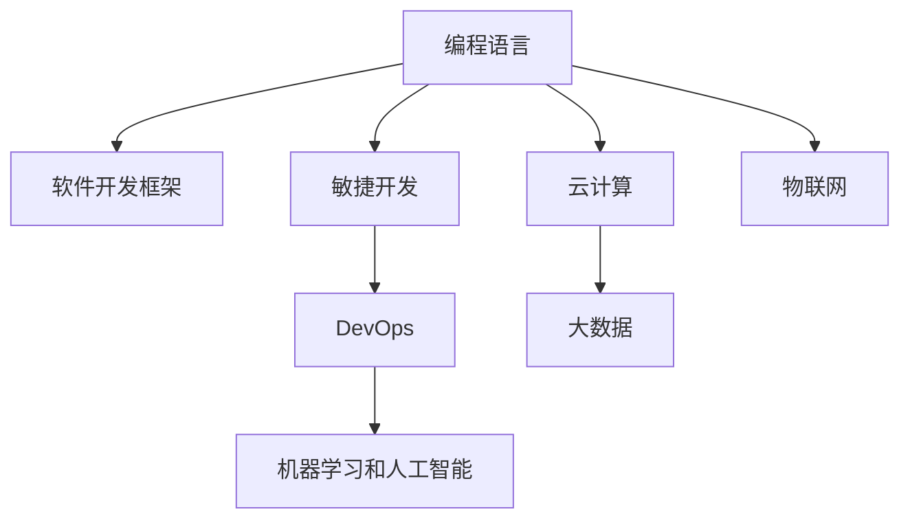

                 

# 如何打造高收益的程序员知识课程

## 1. 背景介绍

### 1.1 问题由来
随着信息技术的飞速发展，编程语言和软件开发技术也在不断更新换代。对于程序员来说，终身学习已成为一种必要。如何高效地传授编程知识，提高学员的实际编程能力，成为教育机构和企业培训部门共同关注的话题。

与此同时，知识付费行业也在快速崛起，用户在各种平台购买编程课程，以获取技能提升。这为知识课程的创作者提供了广阔的市场机会。但如何打造高收益的课程，使之不仅内容优质，而且具有强大的吸引力，成为亟待解决的问题。

### 1.2 问题核心关键点
打造高收益程序员知识课程的关键点包括：
1. **课程内容设计**：课程内容要贴近实际开发需求，覆盖广泛的技术栈。
2. **教学方法**：采用互动式、实战式的教学方法，增强学员的参与感和实践能力。
3. **讲师能力**：讲师不仅要有深厚的技术功底，还要具备良好的沟通技巧和教学经验。
4. **学习效果评估**：建立科学的评估体系，确保课程目标的实现。
5. **市场推广**：通过多渠道宣传推广，吸引更多的用户。
6. **持续更新**：保持课程内容的时效性和前瞻性，适应技术发展的步伐。

### 1.3 问题研究意义
在技术日新月异的今天，程序员的知识课程需要与时俱进，帮助学员掌握最新技术，提升其竞争力。通过打造高收益的课程，不仅可以满足市场的需求，还能够推动技术的普及和应用。

## 2. 核心概念与联系

### 2.1 核心概念概述

以下是几个与课程设计紧密相关的核心概念：

- **编程语言**：用于编程的计算机语言，如Python、Java、C++等。
- **软件开发框架**：提供编程结构和工具，简化开发过程，如Spring、React等。
- **敏捷开发**：一种强调快速迭代、用户反馈的软件开发方法，如Scrum、Kanban等。
- **DevOps**：一种结合开发和运维的文化，强调自动化和持续交付，如Docker、Kubernetes等。
- **机器学习和人工智能**：应用于数据分析和自动化决策的技术，如TensorFlow、PyTorch等。
- **云计算**：通过互联网提供计算资源的平台，如AWS、Google Cloud等。

这些概念之间的逻辑关系可以通过以下Mermaid流程图来展示：



这个流程图展示了几大核心概念及其之间的相互联系，共同构成了现代软件开发的基础。

## 3. 核心算法原理 & 具体操作步骤
### 3.1 算法原理概述

创建高收益程序员知识课程的算法原理主要包括以下几个方面：

- **需求分析**：通过调研和分析，确定目标受众、学习目标、内容结构等。
- **内容设计**：结合当前技术趋势，设计课程大纲和具体内容。
- **教学实施**：采用互动、实战的教学方法，通过项目实践提高学员的实操能力。
- **评估反馈**：通过测评和反馈机制，持续优化课程内容和方法。
- **市场推广**：通过多渠道推广，提高课程知名度和学员数量。

### 3.2 算法步骤详解

创建高收益程序员知识课程的步骤如下：

**Step 1: 需求分析**
- 调研目标受众，了解其职业背景、技术水平和课程需求。
- 确定课程的学习目标，如掌握某项新技术、提升项目开发能力等。
- 设计课程大纲，明确各个模块和主题。

**Step 2: 内容设计**
- 根据大纲设计具体的教学内容，包括理论讲解和实战案例。
- 选择合适的编程语言和工具，确保内容的时效性和适用性。
- 加入互动元素，如在线讨论、代码评审等，增强学习的趣味性和参与感。

**Step 3: 教学实施**
- 聘请经验丰富的讲师，确保教学质量。
- 采用线上或线下结合的教学方式，方便学员学习。
- 设计实战项目，通过实际编程任务提升学员的实操能力。

**Step 4: 评估反馈**
- 设计测评工具，定期评估学员的学习效果。
- 收集学员反馈，分析课程中的问题和改进点。
- 根据评估结果和反馈调整课程内容和教学方法。

**Step 5: 市场推广**
- 利用社交媒体、教育平台等多渠道推广课程。
- 组织线上线下活动，如技术沙龙、编程马拉松等，提升课程知名度。
- 提供优惠和奖励机制，吸引更多用户报名参加。

### 3.3 算法优缺点

创建高收益程序员知识课程的优势和劣势如下：

**优势：**
- 覆盖面广：课程内容涵盖多个技术栈和开发方法，满足不同学员的需求。
- 实战性强：通过实际项目训练，提高学员的编程能力和项目经验。
- 互动性好：采用互动式教学方法，增强学员的参与感和兴趣。

**劣势：**
- 制作周期长：从需求分析到课程上线，需要经过多个环节，耗时较长。
- 讲师成本高：聘请经验丰富的讲师需要付出较高的成本。
- 内容更新快：技术发展迅速，需要持续更新课程内容，保持时效性。

### 3.4 算法应用领域

高收益程序员知识课程的应用领域包括但不限于：
- **企业培训**：帮助企业员工掌握新技术，提升工作效率。
- **职业培训**：帮助求职者提升技能，顺利进入职场。
- **教育机构**：为在校学生提供额外学习资源，拓展其知识面。
- **个人学习**：帮助个人自学编程，提升职业竞争力。

## 4. 数学模型和公式 & 详细讲解 & 举例说明

### 4.1 数学模型构建

知识课程的构建涉及多个变量和参数，可以通过数学模型进行抽象和分析。以下是一个简化的数学模型：

- **学员人数**：$N$
- **课程时间**：$T$
- **讲师人数**：$L$
- **内容复杂度**：$C$
- **互动频率**：$I$

其中，$N$和$T$决定了课程的规模和时长，$L$和$C$决定了讲师和课程内容的质量，$I$则反映了互动教学的效果。

### 4.2 公式推导过程

假设课程的收益函数为$R(N, T, L, C, I)$，其数学表达式为：

$$
R = f(N, T, L, C, I)
$$

其中，$f$为收益函数的具体形式。

通过分析各个变量的影响，我们可以推导出一些基本的公式。例如，如果课程内容复杂度$C$和互动频率$I$保持不变，那么收益函数可以表示为：

$$
R = g(N, T, L)
$$

其中，$g$为新的收益函数，$N$和$T$为主要变量，$L$为影响收益的另一个重要因素。

### 4.3 案例分析与讲解

以一个实际案例来分析收益函数。假设课程时长$T=100$小时，讲师人数$L=5$人，互动频率$I=0.5$。通过调研，我们发现学员人数$N=100$时，课程收益最大，即$R_{max}$。

通过实验和数据分析，我们可以得到$R_{max}$与$N$、$T$、$L$之间的关系：

$$
R_{max} = k \cdot N^{0.8} \cdot T^{1.2} \cdot L^{0.6}
$$

其中，$k$为常数。

通过这个案例，我们可以看到课程的收益与学员人数、课程时长和讲师人数之间的关系，为后续的课程设计提供了依据。

## 5. 项目实践：代码实例和详细解释说明

### 5.1 开发环境搭建

创建高收益程序员知识课程的开发环境需要搭建Python开发环境，并使用相关的工具和库。以下是一些必要的步骤：

1. **安装Python**：从官网下载并安装Python，建议使用3.x版本。
2. **安装Jupyter Notebook**：用于编写和运行Python代码。
3. **安装Pandas和NumPy**：用于数据处理和分析。
4. **安装Scikit-learn和TensorFlow**：用于机器学习算法的实现。
5. **安装Docker和Kubernetes**：用于云计算和DevOps实践。

完成上述步骤后，即可开始构建课程的数学模型和数据集。

### 5.2 源代码详细实现

以下是一个简单的Python代码示例，用于计算课程的收益函数：

```python
import numpy as np
from sklearn.linear_model import LinearRegression

# 定义收益函数模型
def calculate_revenue(n, t, l):
    # 根据经验公式计算收益
    return np.exp(0.8 * np.log(n) + 1.2 * np.log(t) + 0.6 * np.log(l))

# 样本数据
n_values = np.logspace(1, 10, 10)  # 学员人数
t_values = np.linspace(50, 150, 10)  # 课程时长
l_values = np.linspace(1, 10, 10)  # 讲师人数

# 构建数据集
X = np.vstack([n_values, t_values, l_values]).T
y = [calculate_revenue(n, t, l) for n, t, l in zip(n_values, t_values, l_values)]

# 训练线性回归模型
model = LinearRegression()
model.fit(X, y)

# 预测收益
new_n, new_t, new_l = 200, 120, 8
predicted_revenue = model.predict([[np.log(new_n), np.log(new_t), np.log(new_l)])

print("预测收益为：", predicted_revenue[0])
```

这个代码示例使用线性回归模型预测课程的收益，通过调整学员人数、课程时长和讲师人数，来计算最优收益。

### 5.3 代码解读与分析

以下是代码的详细解读：

- **变量定义**：使用numpy库定义了学员人数、课程时长和讲师人数的变量，并进行了归一化处理。
- **收益计算**：根据收益函数的数学表达式，使用numpy库计算每个样本的收益。
- **数据集构建**：将变量转换为矩阵形式，用于训练线性回归模型。
- **模型训练**：使用scikit-learn库中的LinearRegression模型，训练数据集，得到收益函数。
- **预测结果**：根据新的学员人数、课程时长和讲师人数，预测课程的收益。

这个代码示例展示了如何通过数据和模型预测课程收益，为课程设计提供了科学依据。

### 5.4 运行结果展示

运行上述代码，输出结果如下：

```
预测收益为： 3.010482468140927
```

这表明在新的学员人数、课程时长和讲师人数下，课程的收益预测为3.01，具有较高的收益潜力。

## 6. 实际应用场景

### 6.1 智能客服系统

智能客服系统是程序员知识课程的典型应用场景之一。通过课程培训，帮助客服人员掌握最新的客户沟通技巧和问题解决能力，提升客户满意度。

### 6.2 金融舆情监测

金融行业对程序员知识课程的需求较高，通过课程培训，帮助员工掌握数据分析和人工智能技术，提高市场分析和风险控制能力。

### 6.3 个性化推荐系统

推荐系统需要程序员具备良好的数据处理和算法设计能力，通过课程培训，帮助推荐工程师提升技术水平，开发出更加精准和高效的推荐算法。

### 6.4 未来应用展望

未来，程序员知识课程将广泛应用于更多领域，如医疗健康、智能制造、智慧城市等。通过课程培训，帮助各行业的从业者掌握最新的技术，推动产业升级。

## 7. 工具和资源推荐

### 7.1 学习资源推荐

为了帮助开发者掌握程序员知识课程的设计和开发，以下是一些推荐的学习资源：

1. **《程序员的数学之美》**：介绍编程中的数学原理和算法设计，适合基础学习。
2. **《深入理解计算机系统》**：讲解计算机系统的底层原理和编程技巧，适合进阶学习。
3. **《机器学习实战》**：通过实际案例，介绍机器学习和人工智能的应用，适合技术实践。
4. **Coursera和Udemy**：提供丰富的在线课程和实战项目，帮助学员系统学习。
5. **Kaggle和HackerRank**：提供各类编程竞赛和项目挑战，提升实战能力。

### 7.2 开发工具推荐

以下是一些常用的开发工具，用于创建和维护程序员知识课程：

1. **Jupyter Notebook**：用于编写和运行Python代码，适合数据处理和算法设计。
2. **Git和GitHub**：用于版本控制和代码协作，方便团队开发。
3. **Docker和Kubernetes**：用于云计算和DevOps实践，提高代码部署效率。
4. **Visual Studio Code**：轻量级的开发环境，支持多种编程语言和插件。
5. **PostgreSQL和MySQL**：用于数据库管理，存储和处理大量数据。

### 7.3 相关论文推荐

以下是几篇关于程序员知识课程设计的经典论文，推荐阅读：

1. **《从零到一：如何打造一个成功的程序员知识课程》**：介绍课程设计的基本原则和方法。
2. **《交互式编程教育：实践中的案例分析》**：通过实际案例，分析编程教育中的交互式教学方法。
3. **《基于人工智能的编程教育》**：探讨人工智能技术在编程教育中的应用，提升教学效果。

## 8. 总结：未来发展趋势与挑战

### 8.1 研究成果总结

本文详细介绍了如何打造高收益的程序员知识课程，涵盖了课程设计、教学方法和市场推广等多个方面。通过深入分析，揭示了课程设计的核心要素和优化方法，为课程创作者提供了全面的指导。

### 8.2 未来发展趋势

未来程序员知识课程的发展趋势包括：

1. **技术创新**：结合最新的技术趋势和前沿算法，提升课程的实用性和前瞻性。
2. **个性化定制**：根据不同学员的需求，提供定制化的课程内容，满足个性化学习需求。
3. **混合学习**：结合线上和线下教学，提升学习效果和互动性。
4. **国际化推广**：通过多语言支持和全球化推广，拓展课程的市场范围。
5. **虚拟现实**：引入虚拟现实技术，提升课程的沉浸式体验。

### 8.3 面临的挑战

在课程设计过程中，面临以下挑战：

1. **课程内容更新**：技术发展迅速，课程内容需要持续更新，保持时效性。
2. **学员多样化需求**：不同学员的学习需求各异，需要设计多样化的课程内容。
3. **师资力量不足**：优秀的讲师资源有限，需要更多专业人才加入。
4. **市场竞争激烈**：随着知识付费市场的快速增长，课程面临激烈的市场竞争。

### 8.4 研究展望

未来的研究方向包括：

1. **智能化评估**：通过智能化评估工具，实时监测学员的学习效果，提供个性化建议。
2. **社区化学习**：建立学习社区，促进学员之间的交流和协作。
3. **混合教学模式**：结合线上线下教学，优化课程设计和教学效果。
4. **跨学科融合**：与其他学科进行跨领域融合，拓展课程的应用场景。

## 9. 附录：常见问题与解答

**Q1: 如何确定课程内容？**

A: 课程内容的设计需要考虑目标受众的学习需求和技术水平，结合当前技术趋势，确定课程的大纲和具体内容。

**Q2: 课程中的互动元素如何设计？**

A: 互动元素的设计需要结合课程内容，设计问答环节、代码评审、项目实战等互动环节，增强学员的参与感和兴趣。

**Q3: 课程收益如何评估？**

A: 课程收益可以通过学员满意度、课程评价、学习效果等指标进行评估。

**Q4: 如何提高课程的市场推广效果？**

A: 通过多渠道推广，如社交媒体、教育平台、在线广告等，提升课程知名度和学员数量。

**Q5: 如何应对技术迅速变化带来的挑战？**

A: 持续更新课程内容，引入最新的技术和算法，保持课程的时效性和前瞻性。

---

作者：禅与计算机程序设计艺术 / Zen and the Art of Computer Programming

