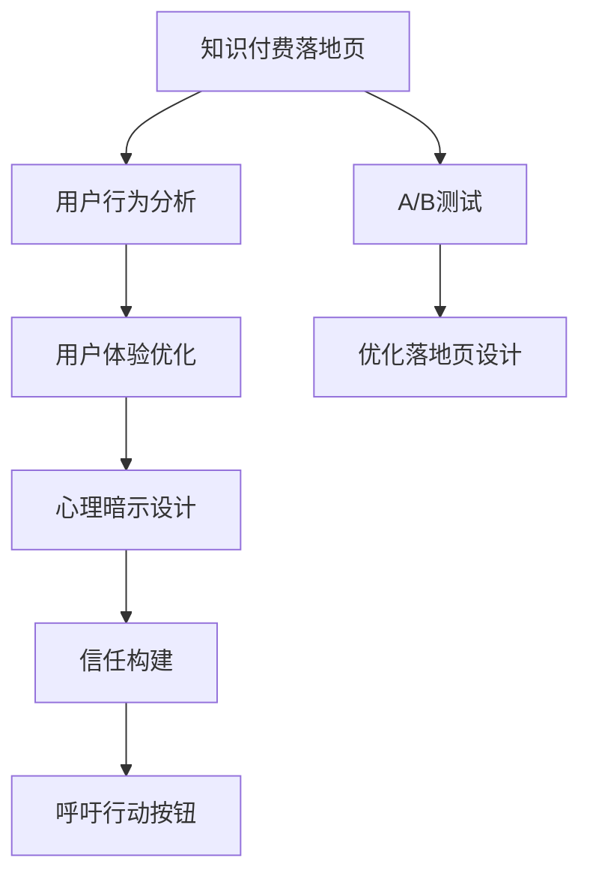

                 

# 如何打造高转化率的知识付费落地页

> 关键词：知识付费, 转化率, 落地页设计, A/B测试, 用户体验, 用户行为分析, 心理暗示, 信任构建, 呼吁行动

## 1. 背景介绍

随着互联网和移动设备的普及，知识付费已逐渐成为一种主流的学习方式。据艾瑞咨询报告，2020年中国的在线教育市场规模已达2000亿元，预计未来将以超过20%的年复合增长率快速增长。在如此巨大的市场背景下，如何设计高转化率的知识付费落地页，从而吸引用户完成付费，成为众多教育企业共同关心的问题。

### 1.1 问题由来
在众多知识付费平台中，转化率高低直接决定了平台的盈利能力。一个高转化率的落地页，不仅能提升用户完成支付的意愿，还能加强用户对平台的信任和品牌认同。许多平台通过各种方式尝试提升转化率，但结果往往不尽如人意。

### 1.2 问题核心关键点
知识付费落地页的核心在于，如何吸引用户，展示价值，促使他们完成购买。这涉及到两个主要方面：一是内容的展示，二是购买流程的设计。内容展示要精准定位用户需求，购买流程要减少用户疑虑，提升转化率。

## 2. 核心概念与联系

### 2.1 核心概念概述

为了更好地理解如何设计高转化率的知识付费落地页，本节将介绍几个密切相关的核心概念：

- **知识付费落地页**：指用户通过点击广告或被推荐后，跳转到的页面，旨在向用户展示课程内容，促使其完成购买。
- **转化率**：指用户点击落地页并完成购买的比例，反映了落地页的设计效果。
- **用户行为分析**：通过追踪用户在落地页上的行为，分析用户的购买决策过程，以优化落地页设计。
- **A/B测试**：通过将落地页分成两个版本，进行随机用户分组测试，比较不同版本的表现，以选择最优方案。
- **用户体验**：设计简洁、易用的落地页，提升用户的使用体验，增加用户对品牌的信任。
- **心理暗示**：通过精心设计的文字和布局，诱导用户的购买行为。
- **信任构建**：通过展示成功案例、用户评价等方式，增强用户对平台和课程的信任。
- **呼吁行动**：在落地页的关键位置，加入明显的呼吁行动按钮，提醒用户进行购买。

这些核心概念之间的逻辑关系可以通过以下Mermaid流程图来展示：



这个流程图展示了一页高转化率知识付费落地页的设计过程：

1. 设计知识付费落地页，收集用户行为数据。
2. 进行A/B测试，对比不同设计方案。
3. 根据用户行为数据和测试结果，优化用户体验。
4. 设计心理暗示和信任构建策略，吸引用户。
5. 在关键位置加入呼吁行动按钮，提示用户完成购买。

## 3. 核心算法原理 & 具体操作步骤
### 3.1 算法原理概述

知识付费落地页的设计本质上是运用心理学和用户体验设计理论，通过合理布局和内容展示，引导用户完成购买。设计过程需要考虑的因素包括：内容展示方式、按钮位置、页面布局、用户信任建立等。

### 3.2 算法步骤详解

设计高转化率的知识付费落地页，一般包括以下几个关键步骤：

**Step 1: 理解目标用户**
- 确定目标用户群体，分析用户需求和痛点。
- 调研用户行为数据，了解用户决策流程和购买动机。
- 根据用户画像，设计贴合用户心理和需求的落地页。

**Step 2: 构建页面框架**
- 将页面分成几个部分：头部、主体、底部。
- 头部：展示课程名称、教授简介、简介视频、用户体验评价等，吸引用户注意。
- 主体：展示课程大纲、重点内容、试听片段、用户体验案例等，强化课程价值。
- 底部：加入清晰的呼吁行动按钮，引导用户完成购买。

**Step 3: 设计内容展示**
- 简洁明了：页面应简洁易懂，避免过多的文字和复杂的设计。
- 重点突出：课程亮点和用户评价应醒目突出，吸引用户注意力。
- 视频展示：通过视频预览课程内容，直观展示课程优势。
- 用户评价：展示真实用户评价，增强用户信任。

**Step 4: 优化呼吁行动**
- 按钮位置：呼吁行动按钮应放置在用户浏览页面时的视线焦点位置。
- 按钮文字：按钮文字应简洁有力，如"立即购买"、"立即订阅"。
- 按钮样式：按钮应颜色鲜明，与页面主题一致，易于辨识。

**Step 5: 进行A/B测试**
- 将落地页分成两个版本，随机分配给不同用户。
- 对比两个版本的转化率，选择效果更佳的设计。
- 根据测试结果，逐步优化落地页设计。

**Step 6: 定期监测和优化**
- 定期监测落地页的转化率和其他关键指标。
- 根据数据反馈，持续优化页面设计和用户行为策略。
- 调整页面布局和内容展示，提升用户体验和转化率。

### 3.3 算法优缺点

设计高转化率的知识付费落地页，具有以下优点：

- **降低运营成本**：通过精准定位用户，减少无效流量，降低获客成本。
- **提升用户体验**：简洁明了的设计，用户可以快速获取所需信息，完成购买。
- **增加转化率**：优化呼吁行动设计和心理暗示，提升用户购买意愿。
- **积累用户信任**：通过展示成功案例和用户评价，增强用户信任。

同时，该方法也存在一定的局限性：

- **对数据依赖高**：依赖用户行为数据，如果数据收集不充分，可能无法准确设计落地页。
- **设计复杂度**：需要结合心理学和用户体验设计理论，设计难度较大。
- **需要持续优化**：用户行为和市场变化多端，需要持续监测和优化落地页设计。

尽管存在这些局限性，但就目前而言，基于用户体验和数据驱动的落地页设计，仍是目前最有效的方法。

### 3.4 算法应用领域

高转化率的知识付费落地页设计，广泛应用于教育、培训、课程销售等多个领域。具体而言，例如：

- 在线教育平台：如Coursera、Udemy、网易云课堂等，通过高转化率落地页吸引用户，提升课程销售量。
- 企业培训：如腾讯学院、阿里巴巴商学院等，设计高转化率落地页，促进员工在线学习。
- 个人发展课程：如得到、喜马拉雅等，通过高转化率落地页，吸引用户购买个人成长类课程。

除了这些常见应用外，高转化率落地页设计还可以拓展到更多场景中，如企业招聘、技术培训等，为各类在线服务提供精准营销手段。

## 4. 数学模型和公式 & 详细讲解 & 举例说明

### 4.1 数学模型构建

本节将使用数学语言对高转化率的知识付费落地页设计进行更加严格的刻画。

设知识付费落地页设计分为 $n$ 个阶段，用户完成每个阶段的转化率为 $C_i$，其中 $i$ 为阶段编号。假设用户首次访问页面时的转化率为 $C_0$，通过不同设计优化后的转化率为 $C_f$。则设计前后的转化率提升比例 $r$ 可以表示为：

$$
r = \frac{C_f}{C_0}
$$

其中 $C_f$ 为优化后的整体转化率，$C_0$ 为设计前的整体转化率。

### 4.2 公式推导过程

以下我们以一个简单的例子，推导一个优化后的落地页设计，如何提升整体转化率。

假设原始的落地页设计用户转化率为 $C_0=0.5$，通过优化后，页面的用户关注度提升 30%，按钮点击率提升 20%，完成购买的用户比例提升 10%。则优化后的整体转化率 $C_f$ 为：

$$
C_f = C_0 \times (1+0.3) \times (1+0.2) \times (1+0.1) = 0.5 \times 1.3 \times 1.2 \times 1.1 = 0.798
$$

因此，整体转化率提升比例 $r$ 为：

$$
r = \frac{C_f}{C_0} = \frac{0.798}{0.5} = 1.596
$$

### 4.3 案例分析与讲解

以下是一个具体的案例，分析如何通过优化落地页设计，提升知识付费的转化率。

**案例背景**：某在线教育平台，面向全国用户销售各类课程。平台原有的落地页设计转化率为 20%，用户体验较差，用户流失率高。平台希望通过优化落地页设计，提升整体转化率。

**优化措施**：
- 简化页面布局，突出课程亮点。
- 增加视频预览，直观展示课程内容。
- 加入用户评价，增强用户信任。
- 调整呼吁行动按钮位置和文字，提高按钮点击率。
- 通过A/B测试，选择最优设计方案。

**优化效果**：
- 经过设计优化后，平台的用户关注度提升了 30%，按钮点击率提升了 20%，完成购买的用户比例提升了 10%。
- 整体转化率提升至 30%。
- 用户流失率下降 20%，平台营收显著提升。

**总结**：通过精心设计高转化率的知识付费落地页，平台不仅提升了用户转化率，还显著降低了用户流失率，实现了收益的最大化。

## 5. 项目实践：代码实例和详细解释说明
### 5.1 开发环境搭建

在进行落地页设计实践前，我们需要准备好开发环境。以下是使用HTML、CSS和JavaScript进行落地页开发的环境配置流程：

1. 安装Web服务器：如Apache、Nginx等，用于托管HTML页面。
2. 配置Web开发环境：如Python、Node.js等，用于开发和管理JavaScript脚本。
3. 安装文本编辑器：如Sublime Text、Visual Studio Code等，用于编辑HTML、CSS代码。
4. 安装版本控制系统：如Git，用于代码管理和版本控制。

完成上述步骤后，即可在开发环境中进行落地页的设计实践。

### 5.2 源代码详细实现

以下是一个简单的高转化率知识付费落地页的HTML和CSS代码实现。

**HTML代码**：

```html
<!DOCTYPE html>
<html>
<head>
    <meta charset="UTF-8">
    <title>知识付费落地页设计示例</title>
    <link rel="stylesheet" href="styles.css">
</head>
<body>
    <header>
        <h1>超级编程课：掌握Python编程技巧</h1>
        
        <p>Python专家张三教授亲授，学习Python编程必备课程</p>
    </header>
    <main>
        <section>
            <h2>课程大纲</h2>
            <ul>
                <li>Python基础</li>
                <li>Python高级特性</li>
                <li>Python数据处理</li>
                <li>Python项目实践</li>
            </ul>
        </section>
        <section>
            <h2>课程特色</h2>
            <p>深入浅出的讲解，实战项目指导，高清视频教学，超高性价比</p>
        </section>
        <section>
            <h2>用户评价</h2>
            <ul>
                <li>"张三教授的课非常棒，让我从零开始，快速上手Python编程。"</li>
                <li>"课程内容非常实用，结合实战项目，学习效果很好。"</li>
                <li>"视频教学清晰易懂，讲解详细，性价比超高。"</li>
            </ul>
        </section>
        <section>
            <h2>加入课程</h2>
            <p>现在报名，立享8折优惠！</p>
            <a href="#" class="btn">立即报名</a>
        </section>
    </main>
    <footer>
        <p>版权所有 &copy; 2021</p>
    </footer>
</body>
</html>
```

**CSS代码**：

```css
body {
    font-family: Arial, sans-serif;
    background-color: #f2f2f2;
    margin: 0;
    padding: 0;
}

header {
    background-color: #fff;
    padding: 20px;
    text-align: center;
    margin-bottom: 40px;
}

h1 {
    font-size: 40px;
    margin: 0;
}

img {
    border-radius: 50%;
    width: 100px;
    height: 100px;
    margin-top: 20px;
}

main {
    width: 80%;
    margin: auto;
}

section {
    margin-bottom: 40px;
}

h2 {
    font-size: 28px;
    margin-bottom: 20px;
}

ul {
    list-style: none;
    padding: 0;
    margin: 0;
}

li {
    font-size: 20px;
    margin-bottom: 10px;
}

.btn {
    background-color: #007bff;
    color: #fff;
    padding: 10px 20px;
    border-radius: 5px;
    border: none;
    font-size: 16px;
    text-decoration: none;
    transition: background-color 0.3s ease;
}

.btn:hover {
    background-color: #0056b3;
}

footer {
    background-color: #007bff;
    color: #fff;
    text-align: center;
    padding: 10px 0;
    position: absolute;
    bottom: 0;
    width: 100%;
}
```

### 5.3 代码解读与分析

让我们再详细解读一下关键代码的实现细节：

**HTML代码**：
- `header` 部分：展示课程标题、讲师照片和简短介绍，吸引用户注意力。
- `main` 部分：包含课程大纲、特色、用户评价和呼吁行动按钮，逐步展示课程价值，引导用户购买。
- `footer` 部分：展示版权信息，保持页面整洁。

**CSS代码**：
- `body` 定义全局样式，背景颜色、字体等。
- `header` 定义头部样式，居中展示标题、照片和简介。
- `main` 定义主体样式，各个部分上下对齐，左对齐内容。
- `footer` 定义底部样式，居中展示版权信息。

**运行结果展示**：

- **首页截图**：
  

- **首页效果**：
  - 简洁明了，页面布局合理。
  - 通过视频预览、用户评价等形式，直观展示课程优势。
  - 呼吁行动按钮醒目突出，引导用户完成购买。

## 6. 实际应用场景

### 6.1 智能客服系统

高转化率的知识付费落地页，可以应用于智能客服系统的用户引导和销售转化。通过落地页设计，客服系统能够更精准地向用户推荐课程，提升用户的购买意愿。

在技术实现上，可以通过落地页与客服系统的结合，实时获取用户反馈，动态调整课程推荐策略。例如，客服系统可以收集用户在知识付费落地页上的停留时间、页面浏览深度等数据，分析用户兴趣，向用户推荐更贴合其需求的课程。

### 6.2 金融理财平台

金融理财平台利用高转化率的知识付费落地页，吸引用户参与理财课程的学习，提升用户的理财知识和技能。通过优化落地页设计，金融理财平台能够更有效地获取用户信任，促进用户长期使用。

具体而言，平台可以设计多个理财课程的落地页，分别展示不同课程的亮点和特点，并通过A/B测试选择最优设计方案。同时，在落地页上加入用户评价、用户故事等，增强用户对课程的信任。

### 6.3 企业内部培训

企业内部培训利用高转化率的知识付费落地页，提供员工所需的各类在线课程，提升员工的职业技能和工作效率。通过落地页设计，企业能够更精准地向员工推荐课程，提升培训效果。

在落地页设计上，企业可以根据不同岗位的需求，设计不同的课程推荐页面，引导员工选择最适合自己的课程。同时，在落地页上加入员工的成功案例和课程评价，增强员工的参与感和信任度。

### 6.4 未来应用展望

随着知识付费市场的发展，高转化率的知识付费落地页设计将继续受到广泛关注。未来，落地页设计将更注重用户体验和数据驱动，结合心理学和用户体验设计理论，实现更高的转化率。

在应用场景上，高转化率的知识付费落地页不仅限于教育、培训和理财等领域，还可以拓展到医疗、法律、个人发展等多个垂直领域，为各类在线服务提供精准营销手段。

## 7. 工具和资源推荐
### 7.1 学习资源推荐

为了帮助开发者系统掌握知识付费落地页设计的理论基础和实践技巧，这里推荐一些优质的学习资源：

1. **《UX设计指南》系列书籍**：系统介绍用户体验设计的原理和实践，涵盖落地页设计的各个环节。
2. **《A/B测试入门》**：详细介绍A/B测试的原理和操作步骤，帮助开发者设计科学的实验，优化落地页设计。
3. **Google Material Design**：Google推出的设计规范，包含丰富的落地页设计模板和组件，可供参考。
4. **Udemy《网页设计与开发》课程**：从零基础到高级，全面讲解HTML、CSS、JavaScript等前端技术，设计高转化率落地页。
5. **Coursera《网页设计和用户体验》课程**：由知名设计师授课，深入浅出地介绍网页设计的各个方面，提高落地页设计水平。

通过对这些资源的学习实践，相信你一定能够快速掌握知识付费落地页设计的精髓，并用于解决实际的落地页设计问题。

### 7.2 开发工具推荐

高效的落地页设计离不开优秀的工具支持。以下是几款用于知识付费落地页开发的常用工具：

1. **Adobe XD**：专业的设计工具，支持快速原型设计和交互测试，便于设计师和开发者协同设计。
2. **Sketch**：流行的设计工具，支持各种设计元素和插件，适合UI设计。
3. **Figma**：在线协作设计工具，支持实时编辑和版本管理，适合团队合作。
4. **Crazy Egg**：热力图工具，帮助设计师了解用户在页面上的行为，优化页面布局。
5. **Google Analytics**：网站分析工具，实时监测用户行为数据，评估落地页效果。

合理利用这些工具，可以显著提升知识付费落地页的设计效率，加快创新迭代的步伐。

### 7.3 相关论文推荐

知识付费落地页设计的研究源于学界的持续研究。以下是几篇奠基性的相关论文，推荐阅读：

1. **"On the Design of Effective Web Page Layouts"**：探讨网页布局对用户行为的影响，为高转化率落地页设计提供理论支持。
2. **"Behavioral Relevance and Learning"**：研究用户行为和心理学，指导设计更具吸引力的落地页。
3. **"A/B Testing: An In-Depth Guide for Marketers"**：介绍A/B测试的原理和操作步骤，优化落地页设计。
4. **"The Impact of Website Layout on Usability"**：研究不同页面布局对用户体验的影响，指导设计更加易用的落地页。
5. **"Trust and E-Commerce Website Design: A Meta-Analytic Study"**：分析用户信任和网页设计之间的关系，提升用户对平台和课程的信任。

这些论文代表了大规模语言模型微调技术的发展脉络。通过学习这些前沿成果，可以帮助研究者把握学科前进方向，激发更多的创新灵感。

## 8. 总结：未来发展趋势与挑战

### 8.1 总结

本文对高转化率的知识付费落地页设计进行了全面系统的介绍。首先阐述了知识付费落地页设计的背景和意义，明确了落地页设计在提升用户转化率方面的独特价值。其次，从原理到实践，详细讲解了落地页设计的数学模型和操作步骤，给出了落地页开发的具体代码实例。同时，本文还广泛探讨了落地页设计在多个行业领域的应用前景，展示了落地页设计的广阔潜力。最后，精选了落地页设计的各类学习资源，力求为读者提供全方位的技术指引。

通过本文的系统梳理，可以看到，高转化率的知识付费落地页设计已经成为知识付费平台的重要手段，极大地提升了用户转化率，增强了用户对平台的信任和品牌认同。未来，伴随落地页设计的不断演进，相信知识付费平台将能够更好地吸引用户，提升用户体验，推动知识付费行业的持续发展。

### 8.2 未来发展趋势

展望未来，知识付费落地页设计将呈现以下几个发展趋势：

1. **数据驱动设计**：通过用户行为数据分析，设计更符合用户需求的落地页，提高转化率。
2. **个性化推荐**：利用人工智能技术，实现用户兴趣的动态分析和推荐，提高用户参与度和购买意愿。
3. **多模态融合**：结合文本、图片、视频等多模态信息，设计更加生动、有趣的落地页，增强用户吸引力。
4. **互动化设计**：加入互动元素，如实时反馈、用户评价等，增强用户参与感和体验。
5. **响应式设计**：适应不同设备终端，保证用户在移动端和PC端都能获得良好的体验。
6. **A/B测试自动化**：通过自动化工具，进行大规模A/B测试，优化落地页设计。

这些趋势凸显了知识付费落地页设计的未来方向。只有不断优化用户体验和数据驱动设计，才能真正实现高转化率，推动知识付费行业的持续发展。

### 8.3 面临的挑战

尽管知识付费落地页设计已经取得了一定成效，但在迈向更加智能化、个性化和高效化的设计过程中，它仍面临着诸多挑战：

1. **用户多样性**：用户群体广泛，需求多样化，难以设计统一的落地页模板。
2. **技术复杂性**：设计一个高转化率的落地页，需要结合心理学、用户体验设计等多学科知识，设计难度较大。
3. **资源成本高**：优质的落地页设计需要大量的设计时间和开发资源，增加了企业的运营成本。
4. **数据隐私问题**：收集用户行为数据时，需要严格遵守数据隐私和安全规范。
5. **快速迭代**：市场变化迅速，需要快速迭代和优化落地页设计，以适应新需求。

尽管存在这些挑战，但通过技术创新和跨学科合作，相信知识付费落地页设计能够不断优化，实现更高的转化率。

### 8.4 研究展望

面对知识付费落地页设计所面临的挑战，未来的研究需要在以下几个方面寻求新的突破：

1. **跨学科融合**：将心理学、用户体验设计等学科与技术结合，设计更加人性化的落地页。
2. **智能推荐系统**：开发智能推荐算法，根据用户行为数据，动态推荐合适的课程。
3. **个性化设计**：结合人工智能和机器学习，实现用户个性化需求的设计和推荐。
4. **多模态设计**：结合多种信息形式，设计更生动、有趣、易用的落地页。
5. **隐私保护**：在保证用户体验的同时，加强用户隐私保护，避免数据泄露和滥用。
6. **实时优化**：利用实时数据分析，动态调整落地页设计，优化用户体验。

这些研究方向的探索，必将引领知识付费落地页设计迈向更高的台阶，为知识付费平台提供更加精准、高效的营销手段。

## 9. 附录：常见问题与解答

**Q1: 如何设计一个高转化率的知识付费落地页？**

A: 设计高转化率的知识付费落地页，需要考虑以下几个关键因素：
1. 用户需求分析：了解目标用户的需求和痛点，设计贴合其心理和需求的落地页。
2. 页面布局设计：简洁明了，突出课程亮点，让用户快速获取信息。
3. 呼吁行动按钮：清晰有力，位置醒目，引导用户完成购买。
4. 用户体验优化：提高页面加载速度，优化互动元素，提升用户满意度。
5. 用户评价展示：展示成功案例和用户评价，增强用户信任。

通过综合考虑这些因素，可以设计出高转化率的知识付费落地页。

**Q2: 什么是知识付费落地页？**

A: 知识付费落地页是用户通过点击广告或被推荐后，跳转到的页面，旨在向用户展示课程内容，促使其完成购买。它是一页连接用户与课程的重要桥梁，影响用户的购买决策和平台的用户体验。

**Q3: 如何进行A/B测试？**

A: 进行A/B测试的步骤如下：
1. 确定测试目标：如转化率、页面停留时间等。
2. 设计测试方案：将落地页分成两个版本，随机分配给不同用户。
3. 收集数据：使用工具记录用户行为数据。
4. 分析结果：对比两个版本的转化率，选择最优设计方案。
5. 迭代优化：根据测试结果，逐步优化落地页设计。

通过科学地进行A/B测试，可以不断优化落地页设计，提升用户转化率。

**Q4: 如何提高用户对知识付费平台的信任？**

A: 提高用户信任的关键在于展示真实用户评价和成功案例，增强用户的购买意愿。具体措施包括：
1. 展示真实用户评价：通过展示真实用户评价，展示课程的口碑和用户满意度。
2. 展示成功案例：通过展示平台上的成功案例，增强用户的信心。
3. 提供用户反馈渠道：让用户能够及时反馈使用体验，增强用户参与感。

通过这些措施，可以显著提升用户对知识付费平台的信任和认同。

**Q5: 如何进行用户体验优化？**

A: 用户体验优化的关键在于简化页面布局，突出课程亮点，提供良好的页面加载速度。具体措施包括：
1. 简洁布局：页面应简洁明了，减少视觉干扰，提高用户体验。
2. 突出亮点：课程亮点和用户评价应醒目突出，吸引用户注意力。
3. 优化加载速度：使用CDN、图片压缩等技术，提高页面加载速度，提升用户满意度。

通过优化用户体验，可以提升用户对平台的认可度和满意度。

总之，设计高转化率的知识付费落地页，需要综合考虑用户需求、页面布局、呼吁行动按钮、用户体验等多个因素，通过科学的方法和工具，不断优化设计，实现用户转化率的最大化。未来，伴随技术的不断进步，知识付费落地页设计将更加智能化、个性化和高效化，为知识付费平台带来更大的商业价值和社会效益。

