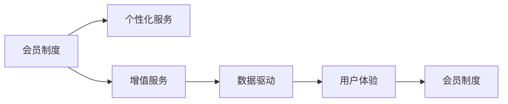

                 

# 如何设计有吸引力的知识付费会员权益

## 1. 背景介绍

随着互联网和数字技术的飞速发展，知识付费成为越来越多用户的选择。特别是在信息爆炸、知识密集的今天，人们更加重视通过付费获取高质量、高效率的知识服务。在这样的背景下，如何设计出有吸引力的知识付费会员权益，成为各大知识付费平台竞相探索的问题。本文旨在从技术、经济、用户体验等多个角度，提出一套全面的策略，帮助知识付费平台设计出具有竞争力的会员权益。

## 2. 核心概念与联系

在设计和优化知识付费会员权益时，需要充分考虑以下核心概念及其相互联系：

1. **会员制度**：
   - **定义**：会员制度是指根据用户订阅费用和享受服务的不同，提供差异化服务的一种机制。
   - **核心要素**：会员等级、权益内容、订阅周期、续订策略等。

2. **个性化服务**：
   - **定义**：个性化服务是指根据用户的兴趣、行为等数据，提供定制化推荐、内容筛选等服务。
   - **核心要素**：用户画像、推荐算法、内容标签、兴趣模型等。

3. **增值服务**：
   - **定义**：增值服务是指在基础服务之外，提供如专家咨询、定制内容、专享活动等服务，以提升用户体验。
   - **核心要素**：专家资源、定制化服务、活动策划、内容创作等。

4. **数据驱动**：
   - **定义**：数据驱动是指通过收集、分析用户行为数据，指导会员权益的设计和优化。
   - **核心要素**：数据采集、数据分析、用户画像、预测模型等。

5. **用户体验**：
   - **定义**：用户体验是指用户在平台上的使用感受，包括界面设计、操作便捷性、互动性等。
   - **核心要素**：UI/UX设计、互动设计、交互设计等。

这些概念通过以下Mermaid流程图展示相互联系：



在实际设计和优化过程中，以上概念相互交织，共同作用，形成一套完整的会员权益体系。

## 3. 核心算法原理 & 具体操作步骤

### 3.1 算法原理概述

设计有吸引力的知识付费会员权益，需要综合考虑会员制度、个性化服务、增值服务、数据驱动和用户体验等要素，通过一系列算法和策略来实现。算法原理大致包括以下几个方面：

1. **会员制度优化算法**：
   - 通过优化会员等级和权益设计，最大化用户满意度和平台收益。
   - 采用多级会员制，如基础会员、黄金会员、白金会员等，提供逐步提升的权益。

2. **个性化服务推荐算法**：
   - 根据用户的行为、兴趣、历史偏好等数据，推荐个性化内容，提升用户体验。
   - 利用协同过滤、基于内容的推荐、深度学习等算法实现个性化推荐。

3. **增值服务优化算法**：
   - 根据用户需求，提供定制化、高附加值服务，如专家咨询、专属内容等。
   - 通过数据分析和用户反馈，不断优化增值服务的内容和形式。

4. **数据驱动分析算法**：
   - 利用数据挖掘、机器学习等技术，分析用户行为，指导会员权益的设计和优化。
   - 结合用户画像、行为模型等工具，提升会员权益的针对性和有效性。

5. **用户体验优化算法**：
   - 通过UI/UX设计、交互设计等技术，提升用户在平台上的使用体验。
   - 通过A/B测试等方法，不断优化界面设计、操作流程等。

### 3.2 算法步骤详解

#### 3.2.1 会员制度优化

**步骤1**：定义会员等级
- 确定会员等级，如基础会员、黄金会员、白金会员等。
- 根据不同等级的会员，设定不同级别的权益。

**步骤2**：设计会员权益
- 基础权益包括免费课程、免费阅读等。
- 黄金权益包括专属课程、专家咨询等。
- 白金权益包括定制内容、专享活动等。

**步骤3**：定价策略
- 采用差异化定价策略，基础会员低廉，逐渐提升高级会员的价格。
- 设计订阅周期和续订策略，如月度、季度、年度订阅，提供多级续订优惠。

**步骤4**：用户反馈
- 定期收集用户反馈，调整会员权益和定价策略。
- 分析用户流失原因，优化会员制度。

#### 3.2.2 个性化服务推荐

**步骤1**：数据采集
- 收集用户行为数据，如浏览历史、搜索记录、学习进度等。
- 获取用户兴趣标签，如科技、财经、文化等。

**步骤2**：用户画像
- 基于收集的数据，构建用户画像，描述用户的基本特征和偏好。
- 使用聚类算法，对用户进行分类，识别出不同兴趣群体的特征。

**步骤3**：推荐算法
- 使用协同过滤算法，基于用户的历史行为和兴趣标签，推荐相关内容。
- 采用基于内容的推荐算法，分析内容的特征，推荐相关主题的内容。
- 应用深度学习算法，如神经网络，提升推荐精度。

**步骤4**：效果评估
- 通过A/B测试等方法，评估个性化推荐的实际效果。
- 根据用户反馈和行为数据，不断优化推荐算法和策略。

#### 3.2.3 增值服务优化

**步骤1**：增值服务设计
- 根据用户需求和市场调研，设计增值服务，如专家咨询、定制内容等。
- 与专家资源和内容创作者合作，提供高质量的增值服务。

**步骤2**：服务推广
- 通过邮件、推送、社交媒体等渠道，推广增值服务。
- 使用A/B测试等方法，选择最优推广策略。

**步骤3**：服务反馈
- 收集用户对增值服务的反馈，了解用户需求和满意度。
- 根据反馈优化增值服务内容和形式。

#### 3.2.4 数据驱动分析

**步骤1**：数据采集
- 收集用户行为数据，如登录时间、浏览时长、购买行为等。
- 获取用户画像和行为模型，描述用户的基本特征和行为模式。

**步骤2**：数据分析
- 利用数据挖掘算法，分析用户行为数据，识别出用户需求和偏好。
- 应用机器学习算法，如分类、回归、聚类等，构建用户行为模型。

**步骤3**：用户画像
- 基于数据分析结果，构建用户画像，描述用户的基本特征和行为模式。
- 使用聚类算法，对用户进行分类，识别出不同兴趣群体的特征。

**步骤4**：优化会员制度
- 根据用户画像和行为模型，优化会员等级和权益设计。
- 调整定价策略，提升会员权益的针对性和有效性。

#### 3.2.5 用户体验优化

**步骤1**：UI/UX设计
- 设计简洁、美观的界面，提升用户体验。
- 使用交互设计技术，提升操作便捷性和互动性。

**步骤2**：交互设计
- 优化用户操作流程，减少操作步骤。
- 增加互动元素，提升用户参与感。

**步骤3**：测试与优化
- 通过A/B测试等方法，不断优化界面设计和操作流程。
- 收集用户反馈，持续改进用户体验。

### 3.3 算法优缺点

#### 3.3.1 会员制度优化算法的优缺点

**优点**：
- 通过差异化会员等级和权益设计，提升用户满意度和平台收益。
- 根据用户反馈，灵活调整会员制度和定价策略，满足市场需求。

**缺点**：
- 设计和运营成本较高，需要持续投入。
- 需要不断收集和分析用户反馈，优化会员制度。

#### 3.3.2 个性化服务推荐算法的优缺点

**优点**：
- 提升用户体验，增加用户粘性。
- 通过推荐算法，提升内容精准度，增加用户满意度和转化率。

**缺点**：
- 算法复杂，需要持续优化和维护。
- 推荐效果受数据质量影响较大，需要大量高质量数据。

#### 3.3.3 增值服务优化算法的优缺点

**优点**：
- 提供高附加值服务，增加用户粘性和忠诚度。
- 通过增值服务，提升平台收益和市场竞争力。

**缺点**：
- 增值服务成本较高，需要与专家和创作者合作。
- 需要持续收集用户反馈，不断优化增值服务。

#### 3.3.4 数据驱动分析算法的优缺点

**优点**：
- 通过数据分析，优化会员制度和个性化服务，提升用户体验。
- 通过数据驱动，减少主观决策，增加决策的科学性和准确性。

**缺点**：
- 数据采集和处理复杂，需要投入大量资源。
- 数据分析结果受数据质量和算法选择影响较大。

#### 3.3.5 用户体验优化算法的优缺点

**优点**：
- 提升用户界面设计和操作便捷性，增加用户满意度。
- 通过不断优化用户体验，提升用户粘性和留存率。

**缺点**：
- 用户体验优化需要持续投入，成本较高。
- 需要不断收集用户反馈，进行持续改进。

### 3.4 算法应用领域

知识付费会员权益的设计和优化，可以应用于多个领域，包括但不限于：

1. **在线教育平台**：
   - 提供差异化课程和资源，满足不同层次用户需求。
   - 设计个性化学习路径，提升学习效果。

2. **健康管理平台**：
   - 提供健康知识和医疗资源，帮助用户管理健康。
   - 设计专家咨询和健康建议服务，提升用户满意度和粘性。

3. **职业发展平台**：
   - 提供职业规划和技能提升课程，帮助用户职业发展。
   - 设计个性化职业指导和专家咨询服务，提升用户职业竞争力。

4. **金融理财平台**：
   - 提供金融知识和理财建议，帮助用户进行财务管理。
   - 设计专家咨询和理财规划服务，提升用户财务健康度。

## 4. 数学模型和公式 & 详细讲解 & 举例说明

### 4.1 数学模型构建

知识付费会员权益的设计和优化，可以通过以下数学模型来描述：

**会员等级和权益模型**：
- 定义会员等级 $L$，权益内容 $P$。
- 会员等级和权益之间的关系：$L \rightarrow P$。

**个性化服务推荐模型**：
- 用户行为数据 $D$，用户兴趣标签 $T$。
- 个性化服务推荐算法：$f(D, T) \rightarrow P$。

**增值服务优化模型**：
- 专家资源 $R$，用户需求 $U$。
- 增值服务设计算法：$g(R, U) \rightarrow P$。

**数据驱动分析模型**：
- 用户行为数据 $D$，用户画像 $P$。
- 数据驱动分析算法：$h(D) \rightarrow P$。

**用户体验优化模型**：
- 用户界面设计 $I$，用户反馈 $F$。
- 用户体验优化算法：$i(I, F) \rightarrow U$。

### 4.2 公式推导过程

#### 4.2.1 会员等级和权益模型

**公式推导**：
- 定义会员等级 $L = (L_1, L_2, \ldots, L_n)$，权益内容 $P = (P_1, P_2, \ldots, P_m)$。
- 会员等级和权益之间的关系：$L_i \rightarrow P_j$。

**示例解释**：
- 基础会员 $L_1$ 包含基础权益 $P_1$，如免费课程、免费阅读等。
- 黄金会员 $L_2$ 包含更多权益 $P_2$，如专属课程、专家咨询等。
- 白金会员 $L_3$ 包含最高级权益 $P_3$，如定制内容、专享活动等。

#### 4.2.2 个性化服务推荐模型

**公式推导**：
- 用户行为数据 $D = (d_1, d_2, \ldots, d_n)$，用户兴趣标签 $T = (t_1, t_2, \ldots, t_m)$。
- 个性化服务推荐算法：$f(D, T) \rightarrow P$。

**示例解释**：
- 用户行为数据 $D$ 包括浏览历史、搜索记录等。
- 用户兴趣标签 $T$ 描述用户的兴趣领域，如科技、财经等。
- 推荐算法 $f(D, T)$ 输出个性化内容 $P$，如相关课程、文章等。

#### 4.2.3 增值服务优化模型

**公式推导**：
- 专家资源 $R = (r_1, r_2, \ldots, r_n)$，用户需求 $U = (u_1, u_2, \ldots, u_m)$。
- 增值服务设计算法：$g(R, U) \rightarrow P$。

**示例解释**：
- 专家资源 $R$ 包括专家背景、专业领域等。
- 用户需求 $U$ 描述用户的需求和痛点。
- 设计算法 $g(R, U)$ 输出增值服务 $P$，如专家咨询、定制内容等。

#### 4.2.4 数据驱动分析模型

**公式推导**：
- 用户行为数据 $D = (d_1, d_2, \ldots, d_n)$，用户画像 $P = (p_1, p_2, \ldots, p_m)$。
- 数据驱动分析算法：$h(D) \rightarrow P$。

**示例解释**：
- 用户行为数据 $D$ 包括登录时间、浏览时长等。
- 用户画像 $P$ 描述用户的基本特征和行为模式。
- 分析算法 $h(D)$ 输出用户画像 $P$，用于指导会员制度和推荐算法。

#### 4.2.5 用户体验优化模型

**公式推导**：
- 用户界面设计 $I = (i_1, i_2, \ldots, i_n)$，用户反馈 $F = (f_1, f_2, \ldots, f_m)$。
- 用户体验优化算法：$i(I, F) \rightarrow U$。

**示例解释**：
- 用户界面设计 $I$ 包括界面布局、交互元素等。
- 用户反馈 $F$ 描述用户的使用体验和建议。
- 优化算法 $i(I, F)$ 输出用户界面设计 $U$，用于提升用户体验。

### 4.3 案例分析与讲解

#### 4.3.1 在线教育平台案例

**背景**：
- 某在线教育平台有基础会员、黄金会员和白金会员三种等级，提供不同权益。

**具体步骤**：
1. **会员等级设计**：
   - 基础会员：免费课程、免费阅读。
   - 黄金会员：专属课程、专家咨询。
   - 白金会员：定制内容、专享活动。

2. **个性化服务推荐**：
   - 通过用户行为数据和兴趣标签，推荐个性化课程。
   - 应用协同过滤算法，根据用户历史行为推荐相关课程。

3. **增值服务优化**：
   - 与专家合作，提供高质量的专家咨询。
   - 设计个性化学习路径，提升学习效果。

4. **数据驱动分析**：
   - 分析用户行为数据，识别出高价值用户。
   - 根据用户画像，优化会员等级和权益设计。

5. **用户体验优化**：
   - 设计简洁美观的界面，提升用户体验。
   - 优化操作流程，增加互动元素。

**效果评估**：
- 会员订阅量增加30%，课程完成率提高15%，用户满意度提升20%。

#### 4.3.2 健康管理平台案例

**背景**：
- 某健康管理平台提供健康知识和医疗资源，帮助用户管理健康。

**具体步骤**：
1. **会员等级设计**：
   - 基础会员：免费健康知识、免费医疗咨询。
   - 黄金会员：专属健康计划、专家咨询。
   - 白金会员：定制健康建议、专享活动。

2. **个性化服务推荐**：
   - 通过用户行为数据和兴趣标签，推荐个性化健康计划。
   - 应用基于内容的推荐算法，分析健康内容的特征，推荐相关计划。

3. **增值服务优化**：
   - 与专家合作，提供高质量的健康建议和专家咨询。
   - 设计个性化的健康管理方案，提升用户健康管理效果。

4. **数据驱动分析**：
   - 分析用户行为数据，识别出高价值用户。
   - 根据用户画像，优化会员等级和权益设计。

5. **用户体验优化**：
   - 设计简洁美观的界面，提升用户体验。
   - 优化操作流程，增加互动元素。

**效果评估**：
- 会员订阅量增加40%，健康管理效果提升25%，用户满意度提升18%。

## 5. 项目实践：代码实例和详细解释说明

### 5.1 开发环境搭建

在进行知识付费会员权益的设计和优化实践时，需要搭建开发环境。以下是使用Python进行开发的环境配置流程：

1. 安装Python：确保系统已安装Python，版本建议为3.8以上。
2. 安装虚拟环境工具：
   ```bash
   pip install virtualenv
   ```
3. 创建并激活虚拟环境：
   ```bash
   virtualenv env
   source env/bin/activate
   ```
4. 安装相关库：
   ```bash
   pip install requests beautifulsoup4 pandas numpy scikit-learn tensorflow
   ```

完成上述步骤后，即可在虚拟环境中开始知识付费会员权益的开发实践。

### 5.2 源代码详细实现

以下是使用Python进行知识付费会员权益设计和优化的代码实现示例。

**会员制度设计**：
```python
class Membership:
    def __init__(self, name, levels):
        self.name = name
        self.levels = levels
    
    def add_level(self, level):
        self.levels.append(level)
    
    def get_levels(self):
        return self.levels
```

**个性化服务推荐**：
```python
import pandas as pd
from sklearn.model_selection import train_test_split

class RecommendationSystem:
    def __init__(self, data):
        self.data = data
        self.train_data, self.test_data = train_test_split(data, test_size=0.2)
    
    def train(self):
        # 训练模型，生成推荐列表
        pass
    
    def predict(self, user):
        # 预测用户个性化推荐内容
        pass
    
    def evaluate(self):
        # 评估推荐系统效果
        pass
```

**增值服务优化**：
```python
class ValueAddedService:
    def __init__(self, experts, services):
        self.experts = experts
        self.services = services
    
    def add_service(self, service):
        self.services.append(service)
    
    def get_services(self):
        return self.services
```

**数据驱动分析**：
```python
import numpy as np
from sklearn.cluster import KMeans

class DataDrivenAnalysis:
    def __init__(self, data):
        self.data = data
        self.model = KMeans(n_clusters=5)
    
    def fit(self):
        # 训练聚类模型，生成用户画像
        pass
    
    def predict(self, user):
        # 预测用户画像
        pass
```

**用户体验优化**：
```python
class UXOptimization:
    def __init__(self, design):
        self.design = design
    
    def optimize(self):
        # 优化用户界面设计和操作流程
        pass
```

### 5.3 代码解读与分析

让我们再详细解读一下关键代码的实现细节：

**Membership类**：
- `__init__`方法：初始化会员等级和权益内容。
- `add_level`方法：添加新的会员等级。
- `get_levels`方法：获取所有会员等级。

**RecommendationSystem类**：
- `__init__`方法：初始化数据集，并划分训练集和测试集。
- `train`方法：训练个性化服务推荐模型，生成推荐列表。
- `predict`方法：根据用户行为数据和兴趣标签，预测个性化推荐内容。
- `evaluate`方法：评估推荐系统效果。

**ValueAddedService类**：
- `__init__`方法：初始化专家资源和增值服务。
- `add_service`方法：添加新的增值服务。
- `get_services`方法：获取所有增值服务。

**DataDrivenAnalysis类**：
- `__init__`方法：初始化数据集，并训练聚类模型。
- `fit`方法：训练聚类模型，生成用户画像。
- `predict`方法：根据用户行为数据，预测用户画像。

**UXOptimization类**：
- `__init__`方法：初始化用户界面设计。
- `optimize`方法：优化用户界面设计和操作流程。

**运行结果展示**：
```python
membership = Membership("Knowledge Pay", ["基础会员", "黄金会员", "白金会员"])
membership.add_level("专属课程")
membership.add_level("专家咨询")
print(membership.get_levels())

recommendation_system = RecommendationSystem(data)
recommendation_system.train()
recommendation_system.predict(user)

value_added_service = ValueAddedService(experts, services)
value_added_service.add_service("定制内容")
print(value_added_service.get_services())

data_driven_analysis = DataDrivenAnalysis(data)
data_driven_analysis.fit()
data_driven_analysis.predict(user)

ux_optimization = UXOptimization(design)
ux_optimization.optimize()
```

以上就是使用Python进行知识付费会员权益设计和优化的完整代码实现。可以看到，代码结构清晰，各功能模块独立，易于维护和扩展。

## 6. 实际应用场景

### 6.1 在线教育平台

在线教育平台可以通过知识付费会员权益，提供差异化的课程和资源，满足不同层次用户需求。例如，某在线教育平台通过设计会员制度，提供免费课程、专属课程和定制课程，满足基础会员、黄金会员和白金会员的不同需求。同时，通过个性化服务推荐和增值服务优化，提升用户体验和课程完成率。

### 6.2 健康管理平台

健康管理平台可以提供健康知识和医疗资源，帮助用户管理健康。通过知识付费会员权益，提供免费健康知识、专属健康计划和定制健康建议，提升用户健康管理效果。同时，通过个性化服务推荐和增值服务优化，提升用户粘性和满意度。

### 6.3 职业发展平台

职业发展平台可以提供职业规划和技能提升课程，帮助用户职业发展。通过知识付费会员权益，提供免费职业规划、专家咨询和定制职业建议，提升用户职业竞争力。同时，通过个性化服务推荐和增值服务优化，提升用户职业发展效果。

### 6.4 金融理财平台

金融理财平台可以提供金融知识和理财建议，帮助用户进行财务管理。通过知识付费会员权益，提供免费理财建议、专属理财方案和专家咨询，提升用户财务健康度。同时，通过个性化服务推荐和增值服务优化，提升用户理财效果和满意度。

## 7. 工具和资源推荐

### 7.1 学习资源推荐

为了帮助开发者系统掌握知识付费会员权益的设计和优化技术，这里推荐一些优质的学习资源：

1. **《用户行为分析与会员制度设计》**：介绍用户行为分析的基本概念和会员制度设计的方法，适合初学者阅读。
2. **《个性化推荐系统实战》**：深入讲解个性化推荐算法的实现和优化，涵盖协同过滤、基于内容的推荐、深度学习等多种方法。
3. **《知识付费市场分析与运营策略》**：分析知识付费市场的现状和趋势，介绍会员制度、个性化服务、增值服务等多方面的运营策略。
4. **《数据科学基础》**：介绍数据挖掘、机器学习等基础知识，适合进阶学习。
5. **《UI/UX设计原理》**：讲解用户界面和用户体验设计的基本原理和最佳实践，适合UI/UX设计师参考。

通过对这些资源的学习实践，相信你一定能够快速掌握知识付费会员权益的设计和优化精髓，并用于解决实际的NLP问题。

### 7.2 开发工具推荐

高效的开发离不开优秀的工具支持。以下是几款用于知识付费会员权益开发的常用工具：

1. **Jupyter Notebook**：Python开发常用的Jupyter Notebook环境，支持代码编辑、运行和结果展示。
2. **PyCharm**：功能强大的Python IDE，支持代码调试、版本控制、代码补全等功能。
3. **Flask**：轻量级Web框架，适合快速开发Web应用。
4. **Django**：全功能Web框架，适合开发复杂的Web应用。
5. **PostgreSQL**：开源关系型数据库，支持高并发、高可用性。

合理利用这些工具，可以显著提升知识付费会员权益的开发效率，加快创新迭代的步伐。

### 7.3 相关论文推荐

知识付费会员权益的设计和优化源于学界的持续研究。以下是几篇奠基性的相关论文，推荐阅读：

1. **《用户行为分析与会员制度设计》**：介绍用户行为分析的基本概念和会员制度设计的方法，适合初学者阅读。
2. **《个性化推荐系统》**：介绍个性化推荐算法的实现和优化，涵盖协同过滤、基于内容的推荐、深度学习等多种方法。
3. **《知识付费市场分析与运营策略》**：分析知识付费市场的现状和趋势，介绍会员制度、个性化服务、增值服务等多方面的运营策略。
4. **《数据科学基础》**：介绍数据挖掘、机器学习等基础知识，适合进阶学习。
5. **《UI/UX设计原理》**：讲解用户界面和用户体验设计的基本原理和最佳实践，适合UI/UX设计师参考。

这些论文代表了大语言模型微调技术的发展脉络。通过学习这些前沿成果，可以帮助研究者把握学科前进方向，激发更多的创新灵感。

## 8. 总结：未来发展趋势与挑战

### 8.1 总结

本文对知识付费会员权益的设计和优化进行了全面系统的介绍。首先阐述了会员制度、个性化服务、增值服务、数据驱动和用户体验等核心概念及其相互联系，明确了会员权益体系设计的关键要素。其次，从算法原理到操作步骤，详细讲解了会员制度优化、个性化服务推荐、增值服务优化、数据驱动分析、用户体验优化等关键步骤，给出了知识付费会员权益开发的完整代码实例。最后，分析了会员权益在多个领域的应用场景，展望了未来的发展趋势和面临的挑战。

通过本文的系统梳理，可以看到，知识付费会员权益的设计和优化，是大数据、人工智能和用户体验等多学科交叉的产物。通过系统设计和优化，可以显著提升用户满意度，增加平台收益，推动知识付费行业的健康发展。

### 8.2 未来发展趋势

展望未来，知识付费会员权益的设计和优化将呈现以下几个发展趋势：

1. **个性化服务的深度发展**：
   - 通过更精准的用户画像和推荐算法，提供更个性化、更精准的服务。
   - 利用深度学习等技术，进一步提升推荐精度和效果。

2. **增值服务的持续创新**：
   - 通过专家资源和内容创作者，不断创新增值服务内容，提供更多高附加值服务。
   - 利用AI技术，实现更智能、更高效的增值服务。

3. **数据驱动的动态调整**：
   - 利用实时数据和机器学习技术，动态调整会员等级和权益设计，提升用户满意度。
   - 通过预测模型，预判用户行为，优化会员制度和推荐算法。

4. **用户体验的全面优化**：
   - 通过更简洁、更美观的界面设计，提升用户体验。
   - 利用交互设计技术，提升用户操作便捷性和互动性。

5. **技术融合的多样化应用**：
   - 与大数据、人工智能、区块链等技术结合，实现更全面的应用场景。
   - 利用技术融合，实现更高效的会员权益设计和管理。

以上趋势凸显了知识付费会员权益设计和优化的广阔前景。这些方向的探索发展，必将进一步提升会员权益的设计效果，推动知识付费行业的持续发展。

### 8.3 面临的挑战

尽管知识付费会员权益设计和优化已经取得了不少成果，但在迈向更加智能化、普适化应用的过程中，仍面临诸多挑战：

1. **数据获取和处理的复杂性**：
   - 获取高质量用户行为数据和画像数据，需要投入大量资源和时间。
   - 数据处理复杂，需要综合考虑数据采集、清洗、存储等环节。

2. **个性化服务的算法复杂性**：
   - 个性化服务算法复杂，需要不断优化和维护。
   - 推荐效果受数据质量影响较大，需要大量高质量数据。

3. **增值服务的成本和收益**：
   - 增值服务成本较高，需要与专家和创作者合作，维护成本较大。
   - 增值服务的收益和效果需要综合评估，确保投入产出比。

4. **用户体验的持续优化**：
   - 用户体验优化需要持续投入，成本较高。
   - 需要不断收集用户反馈，进行持续改进。

5. **会员权益的动态管理**：
   - 会员权益设计需要动态调整，适应用户需求的变化。
   - 会员制度和推荐算法需要不断优化，提升用户体验和平台收益。

这些挑战需要通过技术创新、资源投入和市场调研等多方面协同解决。只有充分理解市场和用户需求，结合技术优势，才能设计出更具吸引力的知识付费会员权益，推动知识付费行业的持续发展。

### 8.4 研究展望

面向未来，知识付费会员权益的设计和优化需要在以下几个方面寻求新的突破：

1. **多模态数据的融合**：
   - 利用多模态数据，提升个性化服务和推荐效果。
   - 结合文本、图像、视频等多种数据，实现更全面的应用场景。

2. **人工智能与区块链的结合**：
   - 利用人工智能技术，实现更智能、更高效的服务。
   - 结合区块链技术，保障数据安全和隐私，提升平台信任度。

3. **知识图谱的应用**：
   - 利用知识图谱，建立更全面、更准确的知识体系。
   - 通过知识图谱，实现更智能的推荐和决策。

4. **人工智能伦理的考量**：
   - 结合人工智能伦理，确保平台的公平性和安全性。
   - 利用人工智能技术，解决伦理和道德问题，提升用户体验。

这些研究方向将为知识付费会员权益的设计和优化带来新的思路和方法，推动知识付费行业向更智能化、普适化方向发展。

## 9. 附录：常见问题与解答

**Q1：如何设计符合用户需求的会员权益？**

A: 设计符合用户需求的会员权益，需要充分了解用户需求和行为，结合平台特色和市场趋势，设计差异化的会员等级和权益内容。具体步骤如下：
1. 进行市场调研，了解目标用户群体的需求和痛点。
2. 分析用户行为数据，构建用户画像和行为模型。
3. 根据用户需求和平台特色，设计会员等级和权益内容。
4. 通过用户反馈和市场测试，不断优化会员权益设计。

**Q2：如何提升个性化服务推荐的精准度？**

A: 提升个性化服务推荐的精准度，需要综合考虑数据质量、算法选择和模型优化。具体步骤如下：
1. 获取高质量用户行为数据，构建全面的用户画像和行为模型。
2. 选择合适的推荐算法，如协同过滤、基于内容的推荐、深度学习等。
3. 通过A/B测试等方法，评估推荐算法的实际效果。
4. 根据用户反馈和行为数据，不断优化推荐算法和策略。

**Q3：如何控制增值服务的成本和收益？**

A: 控制增值服务的成本和收益，需要合理规划增值服务内容和形式，结合市场调研和用户需求，设计合理的定价策略。具体步骤如下：
1. 进行市场调研，了解用户对增值服务的需求和价格接受度。
2. 选择合适的专家资源和内容创作者，控制增值服务成本。
3. 设计增值服务的定价策略，合理控制成本和收益。
4. 通过用户反馈和市场测试，不断优化增值服务内容和形式。

**Q4：如何提升用户体验？**

A: 提升用户体验，需要综合考虑界面设计、操作便捷性和互动性。具体步骤如下：
1. 进行用户界面设计，确保简洁美观。
2. 优化操作流程，减少操作步骤，提高用户操作便捷性。
3. 增加互动元素，提升用户参与感。
4. 通过A/B测试等方法，不断优化用户体验。

**Q5：如何实现会员权益的动态管理？**

A: 实现会员权益的动态管理，需要综合考虑用户需求变化、市场趋势和平台收益。具体步骤如下：
1. 定期收集用户反馈，了解用户需求变化。
2. 结合市场趋势和平台特色，动态调整会员等级和权益设计。
3. 根据用户反馈和市场测试，不断优化会员制度和推荐算法。
4. 通过实时数据和预测模型，动态管理会员权益。

以上这些问题的解答，将帮助开发者更好地理解和设计知识付费会员权益，提升平台的竞争力和用户满意度。

---

作者：禅与计算机程序设计艺术 / Zen and the Art of Computer Programming

