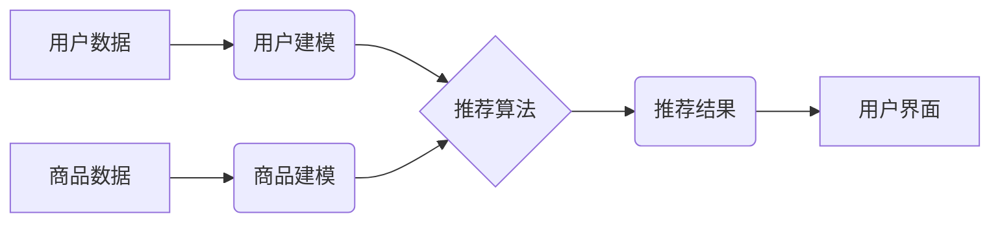

> 实时推荐,电商,机器学习,协同过滤,内容过滤,深度学习,模型优化

## 1. 背景介绍

在当今数字经济时代，电商平台已成为人们购物的首选方式。然而，面对海量商品和用户需求，如何精准推荐用户感兴趣的产品，提升用户体验和转化率，成为电商平台面临的重大挑战。实时推荐技术应运而生，它通过对用户行为、商品特征等数据的实时分析和学习，为用户提供个性化、即时的商品推荐，从而提升用户粘性、促进交易。

## 2. 核心概念与联系

实时推荐技术的核心是利用机器学习算法对用户和商品进行建模，并根据用户的历史行为、偏好、上下文等信息，预测用户对商品的兴趣程度，从而进行精准推荐。

**2.1  核心概念**

* **用户建模:** 通过分析用户的历史购买记录、浏览记录、评分、评论等数据，构建用户的兴趣偏好、购买习惯等模型。
* **商品建模:** 通过分析商品的属性、类别、价格、销量等数据，构建商品的特征模型。
* **推荐算法:** 利用用户和商品模型，预测用户对商品的兴趣程度，并根据预测结果进行排序和推荐。

**2.2  架构图**



## 3. 核心算法原理 & 具体操作步骤

**3.1  算法原理概述**

实时推荐算法主要分为两大类：协同过滤和内容过滤。

* **协同过滤:** 基于用户的相似度或商品的相似度进行推荐。
* **内容过滤:** 基于用户的兴趣偏好和商品的特征进行推荐。

**3.2  算法步骤详解**

**协同过滤算法:**

1. **用户相似度计算:** 计算用户之间的相似度，例如使用余弦相似度或皮尔逊相关系数。
2. **商品相似度计算:** 计算商品之间的相似度，例如使用余弦相似度或Jaccard系数。
3. **推荐生成:** 根据用户的相似用户或商品的相似商品，推荐用户可能感兴趣的商品。

**内容过滤算法:**

1. **特征提取:** 从商品描述、属性、标签等信息中提取特征。
2. **用户兴趣建模:** 根据用户的历史行为数据，构建用户的兴趣偏好模型。
3. **推荐生成:** 根据用户的兴趣模型和商品的特征，预测用户对商品的兴趣程度，并进行排序和推荐。

**3.3  算法优缺点**

**协同过滤算法:**

* **优点:** 可以发现用户之间的隐性关系，推荐更个性化的商品。
* **缺点:** 数据稀疏性问题，新用户和新商品的推荐效果较差。

**内容过滤算法:**

* **优点:** 不受数据稀疏性问题影响，可以推荐新用户和新商品。
* **缺点:** 推荐结果可能过于单一，缺乏个性化。

**3.4  算法应用领域**

实时推荐算法广泛应用于电商平台、社交媒体、音乐平台、视频平台等领域，例如：

* **电商平台:** 商品推荐、个性化促销、新品推荐。
* **社交媒体:** 内容推荐、好友推荐、兴趣小组推荐。
* **音乐平台:** 歌曲推荐、音乐人推荐、歌单推荐。
* **视频平台:** 视频推荐、用户画像、内容分类。

## 4. 数学模型和公式 & 详细讲解 & 举例说明

**4.1  数学模型构建**

协同过滤算法中常用的数学模型是矩阵分解模型，它将用户-商品交互矩阵分解成两个低维矩阵，分别表示用户特征和商品特征。

**4.2  公式推导过程**

假设用户-商品交互矩阵为R，用户特征矩阵为U，商品特征矩阵为V，则有：

$$R \approx U V^T$$

其中，$R_{ui}$表示用户$u$对商品$i$的评分，$U_{u}$表示用户$u$的特征向量，$V_{i}$表示商品$i$的特征向量。

**4.3  案例分析与讲解**

假设有一个用户-商品交互矩阵，其中$R_{12}=5$表示用户1对商品2的评分为5，$R_{23}=3$表示用户2对商品3的评分为3。

通过矩阵分解模型，可以将用户-商品交互矩阵分解成两个低维矩阵，例如：

$$U = \begin{bmatrix} 0.8 & 0.6 \\ 0.2 & 0.8 \end{bmatrix}, V = \begin{bmatrix} 0.6 & 0.8 \\ 0.8 & 0.6 \end{bmatrix}$$

其中，$U_{1}$表示用户1的特征向量，$V_{2}$表示商品2的特征向量。

通过计算$U_{1}V_{2}^T$，可以得到用户1对商品2的评分为5，与原始数据一致。

## 5. 项目实践：代码实例和详细解释说明

**5.1  开发环境搭建**

* Python 3.x
* TensorFlow/PyTorch
* Scikit-learn
* Pandas
* NumPy

**5.2  源代码详细实现**

```python
import pandas as pd
from sklearn.model_selection import train_test_split
from sklearn.metrics import mean_squared_error
from tensorflow.keras.layers import Input, Dense
from tensorflow.keras.models import Model

# 加载用户-商品交互数据
data = pd.read_csv('user_item_data.csv')

# 将数据转换为用户-商品评分矩阵
ratings_matrix = data.pivot_table(index='user_id', columns='item_id', values='rating')

# 将数据分为训练集和测试集
train_data, test_data = train_test_split(ratings_matrix, test_size=0.2)

# 建立深度学习模型
user_input = Input(shape=(ratings_matrix.shape[1],))
user_embedding = Dense(64, activation='relu')(user_input)
item_input = Input(shape=(ratings_matrix.shape[0],))
item_embedding = Dense(64, activation='relu')(item_input)
prediction = Dense(1, activation='linear')(user_embedding * item_embedding)
model = Model(inputs=[user_input, item_input], outputs=prediction)

# 编译模型
model.compile(optimizer='adam', loss='mse')

# 训练模型
model.fit([train_data.values, train_data.values.T], train_data.values.flatten(), epochs=10)

# 评估模型
predictions = model.predict([test_data.values, test_data.values.T])
rmse = mean_squared_error(test_data.values.flatten(), predictions.flatten(), squared=False)
print(f'RMSE: {rmse}')
```

**5.3  代码解读与分析**

* 代码首先加载用户-商品交互数据，并将其转换为用户-商品评分矩阵。
* 然后，将数据分为训练集和测试集。
* 建立深度学习模型，使用两个输入层分别表示用户和商品的特征，并通过多层神经网络进行学习。
* 编译模型，使用均方误差作为损失函数，使用Adam优化器进行训练。
* 训练模型后，使用测试集评估模型性能，并计算均方根误差（RMSE）作为评价指标。

**5.4  运行结果展示**

运行代码后，可以得到模型的训练过程和测试结果，例如RMSE值。

## 6. 实际应用场景

**6.1  电商平台商品推荐**

* **个性化推荐:** 根据用户的历史购买记录、浏览记录、评分等数据，推荐用户可能感兴趣的商品。
* **新品推荐:** 推荐平台上最新的商品，吸引用户关注。
* **促销推荐:** 推荐正在促销的商品，提高用户购买意愿。

**6.2  社交媒体内容推荐**

* **个性化内容推荐:** 根据用户的兴趣爱好、关注的人、浏览记录等数据，推荐用户可能感兴趣的内容。
* **好友推荐:** 推荐用户可能认识的朋友，扩展用户社交圈。
* **兴趣小组推荐:** 推荐用户可能感兴趣的兴趣小组，帮助用户找到志同道合的朋友。

**6.3  音乐平台歌曲推荐**

* **个性化歌曲推荐:** 根据用户的听歌记录、喜欢的歌手、喜欢的音乐类型等数据，推荐用户可能喜欢的歌曲。
* **音乐人推荐:** 推荐用户可能喜欢的音乐人，扩展用户的音乐视野。
* **歌单推荐:** 推荐用户可能喜欢的歌单，帮助用户发现新的音乐。

**6.4  未来应用展望**

实时推荐技术在未来将更加智能化、个性化和精准化。

* **多模态推荐:** 将文本、图像、音频等多种数据类型融合在一起，进行更全面的用户和商品建模，从而提供更精准的推荐。
* **实时个性化:** 基于用户的实时行为和上下文信息，动态调整推荐结果，提供更个性化的体验。
* **跨平台推荐:** 将用户数据和商品数据进行整合，实现跨平台的个性化推荐。

## 7. 工具和资源推荐

**7.1  学习资源推荐**

* **书籍:**
    * 《推荐系统实践》
    * 《机器学习》
    * 《深度学习》
* **在线课程:**
    * Coursera: Recommender Systems
    * Udacity: Machine Learning Engineer Nanodegree
* **博客和网站:**
    * Towards Data Science
    * Machine Learning Mastery

**7.2  开发工具推荐**

* **Python:** 
    * TensorFlow
    * PyTorch
    * Scikit-learn
* **Spark:** 
    * Apache Spark MLlib
* **云平台:**
    * AWS SageMaker
    * Google Cloud AI Platform
    * Azure Machine Learning

**7.3  相关论文推荐**

* **协同过滤:**
    * "Collaborative Filtering for Implicit Feedback Datasets"
    * "Matrix Factorization Techniques for Recommender Systems"
* **内容过滤:**
    * "Content-Based Recommendation Systems"
    * "Hybrid Recommender Systems"
* **深度学习推荐:**
    * "Deep Learning for Recommender Systems"
    * "Neural Collaborative Filtering"

## 8. 总结：未来发展趋势与挑战

**8.1  研究成果总结**

实时推荐技术在电商、社交媒体、音乐平台等领域取得了显著的成果，为用户提供更个性化、精准的推荐服务。

**8.2  未来发展趋势**

* **多模态推荐:** 将文本、图像、音频等多种数据类型融合在一起，进行更全面的用户和商品建模。
* **实时个性化:** 基于用户的实时行为和上下文信息，动态调整推荐结果。
* **跨平台推荐:** 将用户数据和商品数据进行整合，实现跨平台的个性化推荐。

**8.3  面临的挑战**

* **数据稀疏性:** 用户-商品交互数据往往是稀疏的，如何有效处理数据稀疏性问题是重要的挑战。
* **冷启动问题:** 新用户和新商品的推荐效果较差，如何解决冷启动问题也是一个重要的挑战。
* **公平性与可解释性:** 确保推荐结果公平公正，并提高推荐结果的可解释性也是一个重要的挑战。

**8.4  研究展望**

未来，实时推荐技术将继续朝着更智能化、个性化和精准化的方向发展，为用户提供更优质的体验。


## 9. 附录：常见问题与解答

**9.1  Q: 如何解决数据稀疏性问题？**

**A:** 

* 使用矩阵分解模型进行数据填充。
* 使用协同过滤算法中的基于内容的过滤方法。
* 使用深度学习模型，例如图神经网络，进行数据挖掘和特征提取。

**9.2  Q: 如何解决冷启动问题？**

**A:**

* 利用