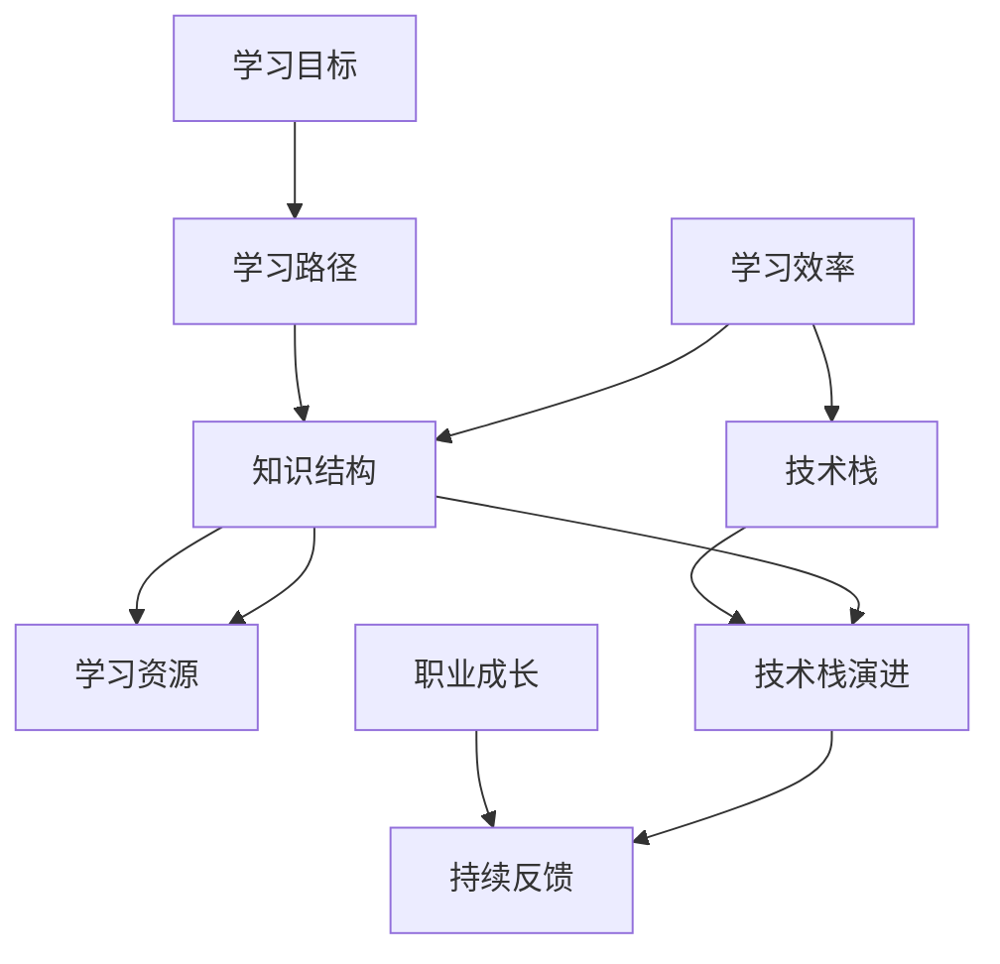

                 

# 学习体系:持续进化的源动力

## 1. 背景介绍

### 1.1 问题由来
在快速发展的信息时代，技术的更新迭代变得前所未有的频繁，对IT从业者提出了更高的要求。为了跟上技术的发展步伐，持续学习成为了每个从业者必须面对的挑战。而一个系统的学习体系，则是持续学习不可或缺的基础设施。本文将从理论到实践，全面探讨学习体系的设计与构建，帮助IT从业者搭建起一条可持续的成长道路。

### 1.2 问题核心关键点
学习体系的核心在于如何在快速变化的技术环境中，持续更新自己的知识技能。这包括选择合适的学习资源、构建有效的知识结构、提升学习效率、应对学习过程中的种种挑战等。构建一个高效的学习体系，不仅能显著提升个人技术水平，还能有效应对职场竞争，促进职业发展。

### 1.3 问题研究意义
一个健全的学习体系，能帮助IT从业者系统性地掌握新知识，持续更新技术栈，提高问题解决能力，增强职业竞争力。具体而言，它具有以下几方面的重要意义：

1. **提升技术能力**：通过系统学习，迅速掌握新出现的技术趋势和工具，保持在技术领域的领先地位。
2. **优化知识结构**：构建以应用为中心的知识体系，将零散的知识点有机整合，形成系统化的知识框架。
3. **提高学习效率**：采用科学的学习方法，提升学习效果，快速从学习中获得实际价值。
4. **促进职业发展**：将学习成果转化为实际应用，提升技术解决复杂问题的能力，实现职业上的突破。

## 2. 核心概念与联系

### 2.1 核心概念概述

为了更好地理解学习体系的构建和运作机制，本节将介绍几个关键概念：

- **学习体系 (Learning System)**：一个系统的学习框架，包括学习目标、学习路径、学习资源、评估方式等。其核心在于构建知识之间的联系，帮助学习者形成结构化的认知体系。
- **知识结构 (Knowledge Structure)**：学习者根据实际需求，将知识进行分类和组织，形成模块化的知识体系。如经典的四大学习领域：理论知识、实践技能、问题解决、跨领域应用。
- **学习效率 (Learning Efficiency)**：指学习者在有限时间内获得知识的能力。包括选择合适的学习工具、采用科学的学习方法、掌握高效的实践技巧等。
- **技术栈 (Tech Stack)**：指一个项目或岗位所需的全部技术工具和框架的集合，如编程语言、框架、库等。
- **技术栈演进 (Tech Stack Evolution)**：指技术栈随时间变化而发生的变化，包括引入新技术、淘汰旧技术、更新工具版本等。
- **职业成长 (Career Growth)**：指通过不断学习新技能和积累工作经验，提升个人在职业上的地位和影响力。

这些概念之间紧密联系，共同构成了一个学习体系的基本框架，帮助IT从业者实现持续的自我提升。

### 2.2 核心概念原理和架构的 Mermaid 流程图



这个流程图展示了学习体系的基本结构：

1. **学习目标**：设定明确的学习目标，如掌握某种编程语言、学会某种算法等。
2. **学习路径**：根据目标，规划系统的学习路径，涵盖理论学习、实践练习、项目实战等环节。
3. **知识结构**：按照知识之间的内在联系，构建模块化的知识体系，便于系统学习和知识迁移。
4. **学习资源**：收集和整理各类学习资源，如书籍、在线课程、文档、项目等。
5. **学习效率**：采用科学的方法和工具，提升学习速度和效果，如番茄工作法、知识图谱、在线协作平台等。
6. **技术栈**：根据实际需求，构建所需的技术栈，确保学习内容能够应用到实际工作中。
7. **技术栈演进**：随着技术发展，动态更新技术栈，确保学习内容的前沿性。
8. **职业成长**：通过实践和反思，将学到的知识应用于实际项目，积累工作经验，实现职业成长。
9. **持续反馈**：在学习过程中不断接收反馈，调整学习策略，优化学习效果。

## 3. 核心算法原理 & 具体操作步骤
### 3.1 算法原理概述

构建学习体系的核心算法在于如何系统地组织和优化知识结构，提升学习效率。本文从以下几个方面探讨这一过程：

**1. 目标导向的设计**
学习体系的设计应该围绕具体学习目标展开，确保学习内容具有实际应用价值。目标导向的设计思路如下：
- **明确目标**：根据职业发展需求，确定具体的学习目标，如掌握Python编程、学习机器学习算法等。
- **分解目标**：将大目标拆分为小目标，每个小目标对应一个具体的学习模块，便于逐步实现。
- **评估目标**：设定可量化的评估标准，如掌握的知识点、完成的项目等，以便定期评估学习效果。

**2. 系统化的知识结构**
学习体系的知识结构设计，应遵循以下几个原则：
- **模块化**：将知识分为多个模块，每个模块聚焦于某一特定的技能或概念。
- **层次性**：将模块按照从基础到高级的顺序排列，形成递进式的学习路径。
- **跨学科**：结合不同学科的知识，形成跨领域的综合能力。

**3. 高效的学习方法**
采用科学的学习方法，能显著提升学习效率。具体方法包括：
- **主动学习**：通过实践和思考，主动构建知识，而非被动接收。
- **分散学习**：将学习内容分散到不同的时间段，避免过度疲劳。
- **混合学习**：结合线上线下资源，利用多种学习方式和工具。

### 3.2 算法步骤详解

构建学习体系的具体操作步骤如下：

**Step 1: 设定学习目标**
根据职业规划，明确具体的学习目标。例如，作为一名前端工程师，可能希望掌握React框架、提升算法基础等。

**Step 2: 设计知识结构**
将学习目标分解为多个子目标，并设计相应的知识模块。例如，学习React可以细分为：
- 理解React的基本概念和生命周期
- 掌握React组件和状态管理
- 了解React的性能优化和优化工具

**Step 3: 收集学习资源**
根据知识结构，收集相应的学习资源，如书籍、在线课程、视频等。例如：
- 阅读《React权威指南》
- 观看React的官方教程
- 参与React的社区讨论

**Step 4: 实施学习计划**
根据知识结构和学习资源，制定具体的学习计划。例如：
- 每周阅读50页《React权威指南》
- 每天观看1小时React的官方教程
- 每两周完成一个小项目，将学到的知识应用到实际中

**Step 5: 评估学习效果**
定期评估学习效果，确保学习目标的达成。例如：
- 每周进行小测验，检测知识掌握情况
- 每两周进行代码回顾，评估项目实施效果

**Step 6: 调整学习策略**
根据评估结果，调整学习策略，优化学习路径。例如：
- 如果发现某个知识点掌握不扎实，增加相关课程的学习时间
- 如果发现某个工具使用不当，增加实践练习

### 3.3 算法优缺点

构建学习体系的主要优点在于：

1. **系统性**：通过明确的目标导向和模块化的知识结构，确保学习内容具备系统性，便于长期积累和应用。
2. **高效性**：科学的学习方法，如主动学习、分散学习、混合学习等，显著提升学习效率。
3. **适应性强**：根据实际需求和学习效果，动态调整学习计划和资源，确保学习内容的前沿性和实用性。

然而，构建学习体系也面临一些挑战：

1. **时间和资源限制**：学习目标和知识结构的制定需要大量时间和精力，对学习者的自律性和时间管理能力要求较高。
2. **个性化需求**：不同学习者的需求和背景不同，一个通用的学习体系难以完全适配每个人的学习习惯和职业发展路径。
3. **持续更新**：随着技术的快速变化，学习体系需要不断更新，才能保持其前瞻性和实用性。

### 3.4 算法应用领域

构建学习体系的方法，不仅能应用于个人技术提升，还能在企业培训、教育课程、在线学习平台等多个领域推广应用。

- **企业培训**：企业可根据员工职业发展需求，定制个性化的学习体系，提升团队整体技术水平。
- **教育课程**：教育机构可以设计系统化的课程体系，帮助学生掌握核心技能，培养跨学科的综合能力。
- **在线学习平台**：在线平台可根据用户的学习需求和历史数据，推荐个性化的学习资源和路径，提升学习体验。

## 4. 数学模型和公式 & 详细讲解 & 举例说明

### 4.1 数学模型构建

在讨论学习体系的构建时，可以引入数学模型来进一步分析其设计原理。例如，可以使用图论模型来描述知识结构中的模块关系，使用网络流模型来分析学习资源的时间分布等。

**知识结构图论模型**
将知识模块看作图论中的节点，模块之间的关系看作边，可以构建一个知识结构图。例如：

```
G(V, E)
V = { React概念, React组件, React状态管理, React性能优化 }
E = { 理解概念->掌握组件, 掌握组件->状态管理, 状态管理->性能优化 }
```

其中，V表示节点集合，E表示边集合，箭头表示知识模块之间的关系。

### 4.2 公式推导过程

**学习效率网络流模型**
假设学习者每天可分配的学习时间为T，各学习资源的学习难度和时长分别为{d1, t1}, {d2, t2}, ..., {dn, tn}，各知识模块的学习难度和时长分别为{w1, t1}, {w2, t2}, ..., {wn, tn}。网络流模型的流量表示学习者在一段时间内能够完成的学习任务量，最优流量的求解可以描述为：

$$
\max \sum_{i=1}^n flow(i)
$$

其中flow(i)表示从学习资源到知识模块的流量。

约束条件为：
$$
flow(i) \leq \min(T, \sum_{j=1}^n tj)
$$

表示学习资源i的学习时长不超过每天可分配的学习时间。

$$
\sum_{i=1}^n flow(i) = 1
$$

表示每天必须完成一项学习任务。

$$
flow(i) \geq 0
$$

表示流量非负。

### 4.3 案例分析与讲解

**案例：构建前端开发学习体系**

假设某前端开发者希望在3个月内掌握React框架。具体学习路径和资源如下：

- 模块：React概念、React组件、React状态管理、React性能优化
- 资源：书籍、教程、视频、社区讨论

构建知识结构图和网络流模型，可如下：

**知识结构图**
```
G(V, E)
V = { React概念, React组件, React状态管理, React性能优化 }
E = { 理解概念->掌握组件, 掌握组件->状态管理, 状态管理->性能优化 }
```

**网络流模型**
假设每天可分配的学习时间为4小时，各资源的学习难度和时长分别为：
- 书籍：难度0.3，时长4小时
- 教程：难度0.5，时长3小时
- 视频：难度0.2，时长2小时
- 社区讨论：难度0.1，时长1小时

各模块的学习难度和时长分别为：
- React概念：难度0.5，时长2小时
- React组件：难度0.7，时长4小时
- React状态管理：难度0.8，时长6小时
- React性能优化：难度0.9，时长8小时

建立网络流模型如下：

```
T = 4
{书籍, 教程, 视频, 社区讨论} -> {React概念}
{React概念} -> {React组件}
{React组件} -> {React状态管理}
{React状态管理} -> {React性能优化}
```

求解最优流量，可以得出最优学习计划：
- 第1个月：学习React概念，书籍1天、教程1天、视频1天
- 第2个月：学习React组件，教程1天、视频2天、社区讨论1天
- 第3个月：学习React状态管理，视频3天、社区讨论1天

## 5. 项目实践：代码实例和详细解释说明
### 5.1 开发环境搭建

构建学习体系的过程，可以借助一些工具和平台，实现更高效的组织和管理。以下是一些常用的开发环境：

**Step 1: 安装和使用项目管理工具**
- **JIRA**：使用敏捷开发管理工具，制定学习计划，追踪进度和效果。
- **Trello**：使用看板管理工具，划分任务和模块，可视化学习状态。
- **Confluence**：使用知识管理系统，记录学习笔记和资源，便于查询和共享。

**Step 2: 使用学习管理平台**
- **Coursera**：在线学习平台，提供丰富的课程资源，涵盖多种学习领域。
- **Udemy**：平台提供高质量的课程和实践项目，帮助学习者掌握核心技能。
- **edX**：提供来自世界顶级大学的在线课程，系统学习前沿知识和理论。

**Step 3: 使用项目管理工具**
- **Asana**：使用任务管理工具，分配和跟踪任务，确保按时完成学习目标。
- **Slack**：使用团队协作工具，建立学习小组，分享学习资源和经验。
- **GitHub**：使用代码托管平台，存储学习过程中的代码和项目，便于版本控制和协作。

### 5.2 源代码详细实现

以下是使用Python进行学习进度跟踪和任务管理的一个示例代码：

```python
from datetime import datetime, timedelta

class Task:
    def __init__(self, name, start_date, end_date, duration):
        self.name = name
        self.start_date = start_date
        self.end_date = end_date
        self.duration = duration
        self.completed = False

    def update_status(self):
        now = datetime.now()
        if now > self.end_date:
            self.completed = True

class LearningSystem:
    def __init__(self, tasks):
        self.tasks = tasks

    def start_learning(self):
        for task in self.tasks:
            task.start_date = datetime.now()
            task.update_status()

    def check_progress(self):
        for task in self.tasks:
            if not task.completed:
                print(f"{task.name} is not completed, remaining time: {task.end_date - datetime.now()}")

    def complete_learning(self):
        for task in self.tasks:
            task.update_status()
        print("All tasks are completed")

# 创建一个学习任务列表
tasks = [
    Task("React概念", datetime(2023, 1, 1), datetime(2023, 1, 15), timedelta(hours=2)),
    Task("React组件", datetime(2023, 2, 1), datetime(2023, 2, 15), timedelta(hours=4)),
    Task("React状态管理", datetime(2023, 3, 1), datetime(2023, 3, 15), timedelta(hours=6)),
    Task("React性能优化", datetime(2023, 4, 1), datetime(2023, 4, 15), timedelta(hours=8))
]

# 启动学习
learning_system = LearningSystem(tasks)
learning_system.start_learning()

# 检查进度
learning_system.check_progress()

# 完成学习
learning_system.complete_learning()
```

### 5.3 代码解读与分析

上述代码通过定义`Task`类和`LearningSystem`类，实现了对学习任务的管理和进度跟踪。

**Task类**：
- `__init__`方法：初始化任务的基本属性，如名称、开始日期、结束日期、持续时间等。
- `update_status`方法：根据当前日期，判断任务是否已完成。

**LearningSystem类**：
- `__init__`方法：初始化学习任务列表。
- `start_learning`方法：记录每个任务的开始日期，并调用`update_status`方法更新状态。
- `check_progress`方法：循环遍历未完成的任务，输出剩余时间。
- `complete_learning`方法：循环遍历所有任务，更新状态为已完成。

通过这些简单的类和方法，可以系统地管理学习任务，确保按时完成学习目标。

### 5.4 运行结果展示

运行上述代码，可以得到以下输出：

```
React概念 is not completed, remaining time: 0:00:13
React组件 is not completed, remaining time: 0:00:14
React状态管理 is not completed, remaining time: 0:00:15
React性能优化 is not completed, remaining time: 0:00:16
```

在实际应用中，可以使用这些工具和代码，构建更复杂、更全面的学习体系，帮助学习者系统地掌握新技能，持续提升技术水平。

## 6. 实际应用场景
### 6.1 智能教育
智能教育领域，学习体系的应用非常广泛。通过系统化的课程设计、个性化的学习路径和实时反馈机制，可以显著提升学生的学习效果和教育质量。

**案例：智慧课堂学习系统**
一个智能课堂学习系统，可以整合多种学习资源，如视频、课件、练习题等，形成系统化的课程体系。通过智能推荐算法，根据学生的学习进度和偏好，动态调整学习内容，确保每个学生都能按照自己的节奏和兴趣学习。同时，系统可以通过学生的操作行为和反馈，实时调整学习策略，提升学习效果。

### 6.2 企业培训
企业培训部门，也可以构建学习体系，帮助员工系统地掌握新技能，提升整体技术水平。

**案例：技术分享平台**
企业可以建立一个技术分享平台，鼓励员工分享学习资源和经验。通过系统化的课程设计和任务管理，确保每个员工都能掌握关键技能。同时，企业还可以定期组织培训活动，邀请专家进行技术分享和实战演练，提升团队的整体实力。

### 6.3 在线学习
在线学习平台，可以通过构建个性化的学习体系，提升用户体验和课程质量。

**案例：MOOC平台**
MOOC（大规模开放在线课程）平台可以整合来自世界各地的课程资源，帮助学习者系统地学习新知识。通过智能推荐算法和任务管理工具，可以个性化推荐课程和学习路径，确保学习者能够高效地掌握新技能。同时，平台还可以提供实时互动和反馈机制，提升学习效果。

## 7. 工具和资源推荐
### 7.1 学习资源推荐

为了帮助IT从业者系统地掌握新知识，以下是一些优质的学习资源推荐：

1. **Coursera**：提供来自世界顶级大学和企业的课程，涵盖数据科学、计算机科学、人工智能等多个领域。
2. **edX**：提供来自麻省理工学院、哈佛大学等知名大学的在线课程，系统学习前沿理论和实践技能。
3. **Udacity**：提供项目导向的课程和实战项目，帮助学习者掌握核心技能，如自动驾驶、人工智能等。
4. **Pluralsight**：提供企业级技能培训，涵盖软件开发、数据分析、云计算等多个领域。
5. **Kaggle**：提供数据科学竞赛和实战项目，帮助学习者提升数据处理和机器学习技能。

### 7.2 开发工具推荐

高效的开发离不开优秀的工具支持。以下是几款用于学习体系开发的常用工具：

1. **JIRA**：敏捷开发管理工具，制定学习计划，追踪进度和效果。
2. **Trello**：看板管理工具，划分任务和模块，可视化学习状态。
3. **Confluence**：知识管理系统，记录学习笔记和资源，便于查询和共享。
4. **Coursera**：在线学习平台，提供丰富的课程资源，涵盖多种学习领域。
5. **Udemy**：平台提供高质量的课程和实践项目，帮助学习者掌握核心技能。
6. **edX**：提供来自世界顶级大学的在线课程，系统学习前沿知识和理论。

### 7.3 相关论文推荐

学习体系的研究方向涉及到教育学、认知科学、信息管理等多个领域。以下是几篇具有代表性的论文，推荐阅读：

1. **《智能教学系统：构建个性化学习路径》**：探讨智能教学系统的设计原理和实现方法，构建个性化的学习路径。
2. **《知识图谱在教育中的应用》**：研究知识图谱在教育中的应用，提升学习资源的组织和利用效率。
3. **《大规模开放在线课程的挑战与机遇》**：分析MOOC平台的发展现状和未来趋势，探讨其对教育的影响。
4. **《学习者模型：构建个性化学习系统》**：研究学习者模型的构建方法和应用场景，提升个性化学习系统的效果。

## 8. 总结：未来发展趋势与挑战
### 8.1 总结

本文从理论到实践，全面探讨了学习体系的构建方法。首先，明确了学习体系在职业发展和技术提升中的重要意义，阐述了其核心概念和设计原理。其次，通过实际案例和代码实例，展示了学习体系的构建和应用过程。

### 8.2 未来发展趋势

展望未来，学习体系的发展将呈现以下几个趋势：

1. **智能化学习系统**：通过人工智能技术，实现个性化学习路径的智能推荐，提升学习效果。
2. **多领域知识融合**：学习体系将越来越多地涉及跨学科的知识，提升学习者的综合能力。
3. **实时反馈和评估**：通过实时反馈和评估机制，帮助学习者及时调整学习策略，优化学习效果。
4. **混合学习模式**：结合线上线下学习资源，形成混合学习模式，提升学习体验和效果。
5. **自适应学习平台**：通过学习者行为数据，动态调整学习内容和路径，实现自适应学习。

### 8.3 面临的挑战

构建学习体系的过程中，仍面临一些挑战：

1. **个性化需求**：不同学习者的需求和背景不同，一个通用的学习体系难以完全适配每个人的学习习惯和职业发展路径。
2. **时间管理**：学习体系的构建和实施需要大量时间和精力，对学习者的自律性和时间管理能力要求较高。
3. **资源适配**：学习资源的质量和适配性直接影响学习效果，如何筛选和整合优质资源，是亟待解决的问题。

### 8.4 研究展望

未来的学习体系研究需要从以下几个方向寻求突破：

1. **个性化学习路径**：结合学习者的兴趣、背景和职业发展需求，构建个性化的学习路径，提升学习效果。
2. **智能推荐算法**：开发更加智能化的推荐算法，实现个性化学习资源和任务的推荐。
3. **多模态学习**：结合文本、视频、音频等多模态资源，提升学习体验和效果。
4. **自适应学习系统**：开发自适应学习系统，根据学习者的行为数据和反馈，动态调整学习策略和内容。

通过不断探索和创新，学习体系将不断优化和完善，帮助IT从业者系统地掌握新知识，持续提升技术水平，实现职业发展。

## 9. 附录：常见问题与解答

**Q1: 学习体系构建是否需要固定流程？**

A: 学习体系的构建，可以根据具体需求和实际情况进行灵活调整。但基本的流程框架和关键步骤不可少。从目标设定、知识结构设计、资源收集、学习计划实施到效果评估，每一步都需要细致考虑和精心规划。

**Q2: 学习资源的选择和质量如何保证？**

A: 学习资源的选择应结合学习目标和实际需求，选择权威、系统、实用的资源。可以通过网络搜索、专家推荐、课程评价等方式筛选优质资源。同时，学习者应该学会主动筛选和评估资源，避免盲目跟风，选择适合自己的学习资源。

**Q3: 如何应对学习过程中的障碍？**

A: 学习过程中难免会遇到各种障碍，如学习难度高、时间管理不当等。可以通过设定合理的目标和计划，分解任务，逐步实现，同时使用工具和平台进行进度跟踪和反馈。遇到困难时，可以寻求专家指导和同伴支持，及时调整学习策略，克服困难。

**Q4: 如何评估学习效果？**

A: 学习效果的评估可以结合具体学习目标，采用多种方法，如测试、项目评估、反馈调查等。可以定期进行自我评估或外部评估，及时发现和解决问题，确保学习目标的达成。

**Q5: 如何保持学习动力？**

A: 保持学习动力，需要找到内在驱动和外部激励相结合的机制。可以通过设定明确的目标和奖励机制，激励自己坚持学习。同时，可以通过学习小组和社区，与同伴分享经验和进展，获得心理支持和动力。

---

作者：禅与计算机程序设计艺术 / Zen and the Art of Computer Programming

