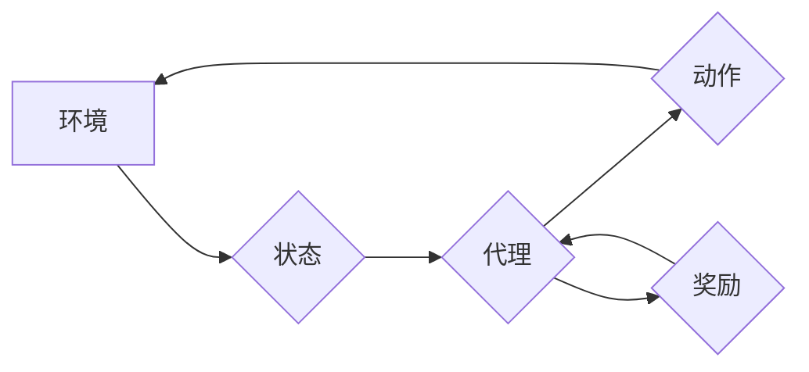

> 强化学习，人工智能，法规，伦理，安全，可解释性，监管

## 1. 背景介绍

人工智能（AI）正以惊人的速度发展，其应用领域不断扩展，从自动驾驶到医疗诊断，再到金融交易，AI正在深刻地改变着我们的生活。其中，强化学习（Reinforcement Learning，RL）作为一种强大的机器学习范式，在解决复杂决策问题方面展现出巨大的潜力。RL算法通过与环境交互，学习策略以最大化累积奖励，类似于人类通过试错学习的方式。

然而，RL技术的快速发展也带来了新的挑战，尤其是在法规和伦理方面。由于RL算法的自主性和复杂性，其行为难以预测和解释，这使得监管和责任归属问题变得更加复杂。

## 2. 核心概念与联系

**2.1 强化学习的核心概念**

* **环境（Environment）：** RL系统所处的外部世界，它提供状态信息和对动作的反馈。
* **代理（Agent）：** 与环境交互的智能体，其目标是通过采取行动来最大化累积奖励。
* **状态（State）：** 环境的当前状态，代理根据状态信息做出决策。
* **动作（Action）：** 代理可以采取的行动，这些行动会改变环境的状态。
* **奖励（Reward）：** 环境对代理动作的反馈，奖励可以是正值或负值，代理的目标是最大化累积奖励。
* **策略（Policy）：** 代理根据状态选择动作的规则，策略可以是确定性的或概率性的。

**2.2 RL与法规的联系**

RL算法的自主性和复杂性使得其行为难以预测和解释，这带来了以下法规挑战：

* **责任归属：** 当RL系统做出错误决策导致损害时，责任应该归属谁？是开发人员、部署方还是RL系统本身？
* **透明度和可解释性：** RL系统的决策过程通常是复杂的，难以理解，这使得监管和问责变得困难。
* **公平性和偏见：** RL算法的训练数据可能包含偏见，导致系统做出不公平或歧视性的决策。
* **安全性和稳定性：** RL系统在某些情况下可能表现出不可预测的行为，这可能导致安全风险。

**2.3  RL流程图**



## 3. 核心算法原理 & 具体操作步骤

**3.1 算法原理概述**

强化学习的核心思想是通过试错学习，让代理在与环境交互的过程中不断调整策略，以最大化累积奖励。RL算法通常使用价值函数来评估状态或状态-动作对的价值，并根据价值函数更新策略。

**3.2 算法步骤详解**

1. **初始化：** 初始化代理的策略和价值函数。
2. **环境交互：** 代理与环境交互，观察状态并采取行动。
3. **奖励获取：** 环境根据代理的动作提供奖励。
4. **价值函数更新：** 根据奖励和状态信息更新价值函数。
5. **策略更新：** 根据价值函数更新策略，选择更优的动作。
6. **重复步骤2-5：** 直到代理达到预设的目标或训练结束。

**3.3 算法优缺点**

**优点：**

* 可以解决复杂决策问题，无需明确的规则。
* 可以学习动态变化的环境。
* 可以实现自主学习和适应性。

**缺点：**

* 训练过程可能很长，需要大量的样本数据。
* 难以解释和理解算法的决策过程。
* 可能出现不稳定或不可预测的行为。

**3.4 算法应用领域**

* 自动驾驶
* 机器人控制
* 游戏人工智能
* 医疗诊断
* 金融交易

## 4. 数学模型和公式 & 详细讲解 & 举例说明

**4.1 数学模型构建**

RL系统可以建模为马尔可夫决策过程（MDP），其中包含以下元素：

* 状态空间 S：所有可能的系统状态。
* 动作空间 A：代理可以采取的所有动作。
* 转移概率 P(s' | s, a)：从状态 s 执行动作 a 到状态 s' 的概率。
* 奖励函数 R(s, a)：代理在状态 s 执行动作 a 得到的奖励。
* 策略 π(a | s)：代理在状态 s 选择动作 a 的概率分布。

**4.2 公式推导过程**

价值函数 V(s) 表示状态 s 的期望累积奖励，其定义如下：

$$V(s) = \mathbb{E}_{\pi} \left[ \sum_{t=0}^{\infty} \gamma^t R(s_t, a_t) \right]$$

其中：

* $\gamma$ 是折扣因子，控制未来奖励的权重。
* $R(s_t, a_t)$ 是在时间步 t 状态 $s_t$ 执行动作 $a_t$ 得到的奖励。

**4.3 案例分析与讲解**

例如，考虑一个简单的强化学习问题：一个机器人需要在迷宫中找到出口。

* 状态空间 S：迷宫中的所有位置。
* 动作空间 A：向上、向下、向左、向右四个方向。
* 转移概率 P(s' | s, a)：取决于机器人当前位置和选择的动作。
* 奖励函数 R(s, a)：到达出口时奖励为 1，否则为 0。
* 策略 π(a | s)：机器人根据当前位置选择动作的概率分布。

通过训练 RL 算法，机器人可以学习到一个策略，使得它能够在迷宫中找到出口并最大化累积奖励。

## 5. 项目实践：代码实例和详细解释说明

**5.1 开发环境搭建**

* Python 3.x
* TensorFlow 或 PyTorch 等深度学习框架
* OpenAI Gym 或其他强化学习环境

**5.2 源代码详细实现**

```python
import gym
import tensorflow as tf

# 定义环境
env = gym.make('CartPole-v1')

# 定义神经网络模型
model = tf.keras.Sequential([
    tf.keras.layers.Dense(128, activation='relu'),
    tf.keras.layers.Dense(env.action_space.n)
])

# 定义损失函数和优化器
optimizer = tf.keras.optimizers.Adam()
loss_fn = tf.keras.losses.SparseCategoricalCrossentropy()

# 训练循环
for episode in range(1000):
    state = env.reset()
    done = False
    total_reward = 0

    while not done:
        # 选择动作
        action = model.predict(state[None, :])[0]
        action = tf.argmax(action).numpy()

        # 执行动作并获取奖励和下一个状态
        next_state, reward, done, _ = env.step(action)

        # 更新模型参数
        with tf.GradientTape() as tape:
            prediction = model(state[None, :])
            loss = loss_fn(tf.one_hot(action, depth=env.action_space.n), prediction)
        gradients = tape.gradient(loss, model.trainable_variables)
        optimizer.apply_gradients(zip(gradients, model.trainable_variables))

        # 更新状态
        state = next_state

        # 更新总奖励
        total_reward += reward

    print(f'Episode {episode+1}, Total Reward: {total_reward}')

# 保存模型
model.save('cartpole_model.h5')
```

**5.3 代码解读与分析**

这段代码实现了一个简单的强化学习模型，用于解决 CartPole-v1 环境中的任务。

* 首先，定义了环境和神经网络模型。
* 然后，定义了损失函数和优化器。
* 训练循环中，代理与环境交互，根据模型预测的动作执行动作，并根据奖励更新模型参数。
* 最后，保存训练好的模型。

**5.4 运行结果展示**

训练完成后，模型能够在 CartPole-v1 环境中保持平衡杆的稳定时间达到较高的水平。

## 6. 实际应用场景

**6.1 自动驾驶**

RL算法可以用于训练自动驾驶系统的决策策略，使其能够在复杂道路环境中安全地行驶。

**6.2 机器人控制**

RL算法可以用于训练机器人执行复杂的任务，例如抓取物体、导航和组装。

**6.3 游戏人工智能**

RL算法可以用于训练游戏人工智能，使其能够学习游戏规则并取得高分。

**6.4 未来应用展望**

RL算法在未来将有更广泛的应用，例如：

* 个性化推荐系统
* 医疗诊断和治疗
* 金融风险管理
* 优化能源消耗

## 7. 工具和资源推荐

**7.1 学习资源推荐**

* **书籍：**
    * Reinforcement Learning: An Introduction by Richard S. Sutton and Andrew G. Barto
    * Deep Reinforcement Learning Hands-On by Maxim Lapan
* **在线课程：**
    * DeepMind's Reinforcement Learning Specialization
    * Udacity's Intro to Artificial Intelligence
* **博客和网站：**
    * OpenAI Blog
    * DeepMind Blog
    * Towards Data Science

**7.2 开发工具推荐**

* **TensorFlow:** https://www.tensorflow.org/
* **PyTorch:** https://pytorch.org/
* **OpenAI Gym:** https://gym.openai.com/

**7.3 相关论文推荐**

* Deep Q-Network (DQN)
* Proximal Policy Optimization (PPO)
* Trust Region Policy Optimization (TRPO)

## 8. 总结：未来发展趋势与挑战

**8.1 研究成果总结**

近年来，RL算法取得了显著的进展，在许多领域取得了突破性成果。

**8.2 未来发展趋势**

* **更强大的算法：** 研究人员正在开发更强大的RL算法，例如基于模型的RL和强化学习迁移学习。
* **更广泛的应用：** RL算法将应用于更多领域，例如医疗保健、金融和教育。
* **更安全的RL系统：** 研究人员正在开发更安全的RL系统，以确保其在实际应用中能够安全可靠地运行。

**8.3 面临的挑战**

* **数据效率：** RL算法通常需要大量的样本数据进行训练，这在某些情况下可能难以获得。
* **可解释性：** RL算法的决策过程通常是复杂的，难以理解，这使得监管和问责变得困难。
* **安全性和稳定性：** RL系统在某些情况下可能表现出不可预测的行为，这可能导致安全风险。

**8.4 研究展望**

未来，RL研究将继续朝着更强大、更安全、更可解释的方向发展。

## 9. 附录：常见问题与解答

**9.1 如何选择合适的RL算法？**

选择合适的RL算法取决于具体的应用场景和问题特点。

**9.2 如何解决RL算法的数据效率问题？**

可以使用数据增强、迁移学习和模仿学习等技术提高RL算法的数据效率。

**9.3 如何提高RL算法的可解释性？**

可以使用可解释机器学习技术，例如LIME和SHAP，来解释RL算法的决策过程。


作者：禅与计算机程序设计艺术 / Zen and the Art of Computer Programming 
<end_of_turn>