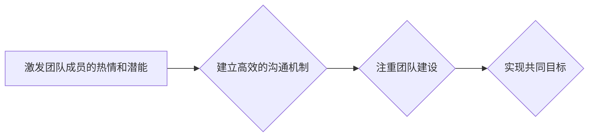

> 人工智能，管理，激发潜能，团队合作，技术领导力，创新驱动，道德责任

## 1. 背景介绍

在当今科技飞速发展的时代，人工智能（AI）正以惊人的速度改变着我们的世界。从自动驾驶汽车到医疗诊断，从个性化教育到金融服务，AI技术的应用无处不在。然而，技术的进步离不开人的智慧和努力。作为AI领域的领军人物，我们不仅要关注技术的本身，更要思考如何更好地管理和激发AI团队的潜能，让技术真正为人类社会带来福祉。

彼得·德鲁克的经典著作《管理的本质》强调了管理的核心在于激发人的善意和潜能。他的观点同样适用于AI领域。AI团队的成员，无论是程序员、数据科学家还是产品经理，都是拥有独特才能和创造力的个体。只有激发他们的热情和潜能，才能推动AI技术的创新发展。

## 2. 核心概念与联系

### 2.1  德鲁克的管理理念

德鲁克认为，管理的本质是通过协调和引导人们的努力，实现共同的目标。他提出了许多重要的管理理念，例如：

* **管理是与人打交道：** 管理的核心是与人打交道，理解他们的需求和动机，并激励他们发挥最佳状态。
* **管理是创造性活动：** 管理者需要不断创新，寻找新的解决方案和方法，以应对不断变化的环境。
* **管理是决策过程：** 管理者需要不断做出决策，并承担相应的责任。

### 2.2  AI团队管理的挑战

在AI领域，管理团队面临着独特的挑战：

* **技术复杂性：** AI技术本身非常复杂，需要团队成员具备深厚的专业知识和技能。
* **快速迭代：** AI领域发展迅速，需要团队能够快速适应变化，并不断迭代改进。
* **跨学科合作：** AI项目通常需要跨多个学科的合作，例如计算机科学、数学、统计学和心理学。

### 2.3  德鲁克理念与AI团队管理的结合

德鲁克的管理理念为AI团队管理提供了重要的指导。

* **激发团队成员的热情和潜能：** AI团队成员需要对AI技术充满热情，并相信自己的能力。管理者需要创造一个鼓励创新、支持学习的环境，并为团队成员提供必要的资源和支持。
* **建立高效的沟通机制：** 跨学科合作需要高效的沟通机制，确保团队成员能够及时了解彼此的工作进展和遇到的问题。
* **注重团队建设：** AI团队是一个复杂的系统，需要团队成员之间相互协作、互相支持。管理者需要注重团队建设，建立良好的团队文化和氛围。

**Mermaid 流程图**



## 3. 核心算法原理 & 具体操作步骤

### 3.1  算法原理概述

深度学习算法是AI领域的核心技术之一，它能够从海量数据中学习复杂的模式和关系。深度学习算法的核心是多层神经网络，这些神经网络由多个神经元组成，每个神经元都连接着其他神经元，并通过权重来调节信号的传递。通过训练，神经网络的权重会不断调整，最终能够学习到数据的特征和规律。

### 3.2  算法步骤详解

深度学习算法的训练过程通常包括以下步骤：

1. **数据预处理：** 将原始数据进行清洗、转换和格式化，使其能够被深度学习算法所接受。
2. **模型构建：** 根据具体的应用场景，选择合适的深度学习模型架构，例如卷积神经网络（CNN）、循环神经网络（RNN）或生成对抗网络（GAN）。
3. **模型训练：** 使用训练数据对深度学习模型进行训练，通过调整神经网络的权重，使模型能够准确地预测或分类数据。
4. **模型评估：** 使用测试数据对训练好的模型进行评估，并根据评估结果进行模型调优。
5. **模型部署：** 将训练好的模型部署到实际应用场景中，例如用于图像识别、语音识别或自然语言处理。

### 3.3  算法优缺点

**优点：**

* **高精度：** 深度学习算法能够学习到数据的复杂模式，从而实现高精度的预测和分类。
* **自动化特征提取：** 深度学习算法能够自动提取数据的特征，无需人工特征工程。
* **可扩展性：** 深度学习算法能够处理海量数据，并随着数据量的增加而提高精度。

**缺点：**

* **数据依赖：** 深度学习算法需要大量的训练数据，否则精度会下降。
* **计算资源消耗：** 深度学习算法的训练过程需要大量的计算资源，例如GPU。
* **可解释性差：** 深度学习模型的内部机制比较复杂，难以解释其决策过程。

### 3.4  算法应用领域

深度学习算法在各个领域都有广泛的应用，例如：

* **计算机视觉：** 图像识别、物体检测、图像分割、人脸识别等。
* **自然语言处理：** 文本分类、情感分析、机器翻译、对话系统等。
* **语音识别：** 语音转文本、语音搜索、语音助手等。
* **医疗诊断：** 影像分析、疾病预测、药物研发等。
* **金融服务：** 风险评估、欺诈检测、投资决策等。

## 4. 数学模型和公式 & 详细讲解 & 举例说明

### 4.1  数学模型构建

深度学习算法的核心是多层神经网络，每个神经元接收多个输入信号，并通过加权求和和激活函数进行处理，最终输出一个信号。

**神经元模型：**

$$
y = f(w_1x_1 + w_2x_2 + ... + w_nx_n + b)
$$

其中：

* $y$ 是神经元的输出信号。
* $x_1, x_2, ..., x_n$ 是输入信号。
* $w_1, w_2, ..., w_n$ 是权重。
* $b$ 是偏置。
* $f$ 是激活函数。

**激活函数：**

激活函数的作用是将神经元的输入信号转换为输出信号，并引入非线性，使神经网络能够学习到复杂的模式。常见的激活函数包括：

* **ReLU（Rectified Linear Unit）：**

$$
f(x) = max(0, x)
$$

* **Sigmoid：**

$$
f(x) = \frac{1}{1 + e^{-x}}
$$

* **Tanh（Hyperbolic tangent）：**

$$
f(x) = \frac{e^x - e^{-x}}{e^x + e^{-x}}
$$

### 4.2  公式推导过程

深度学习算法的训练过程是通过优化神经网络的权重来实现的。常用的优化算法包括梯度下降法和其变种。

**梯度下降法：**

$$
w = w - \alpha \frac{\partial Loss}{\partial w}
$$

其中：

* $w$ 是权重。
* $\alpha$ 是学习率。
* $Loss$ 是损失函数，用于衡量模型的预测结果与真实值的差异。

### 4.3  案例分析与讲解

**图像识别案例：**

假设我们训练一个深度学习模型用于识别猫和狗的图像。

1. **数据预处理：** 将猫和狗的图像进行裁剪、缩放和归一化处理。
2. **模型构建：** 选择一个卷积神经网络模型，例如LeNet-5或AlexNet。
3. **模型训练：** 使用训练数据对模型进行训练，并使用损失函数和梯度下降法优化模型的权重。
4. **模型评估：** 使用测试数据对训练好的模型进行评估，并计算模型的准确率。
5. **模型部署：** 将训练好的模型部署到实际应用场景中，例如用于识别手机摄像头拍摄的图像。

## 5. 项目实践：代码实例和详细解释说明

### 5.1  开发环境搭建

* **操作系统：** Ubuntu 18.04 LTS
* **编程语言：** Python 3.6
* **深度学习框架：** TensorFlow 2.0
* **GPU：** NVIDIA GeForce GTX 1080 Ti

### 5.2  源代码详细实现

```python
import tensorflow as tf

# 定义模型结构
model = tf.keras.models.Sequential([
    tf.keras.layers.Conv2D(32, (3, 3), activation='relu', input_shape=(28, 28, 1)),
    tf.keras.layers.MaxPooling2D((2, 2)),
    tf.keras.layers.Conv2D(64, (3, 3), activation='relu'),
    tf.keras.layers.MaxPooling2D((2, 2)),
    tf.keras.layers.Flatten(),
    tf.keras.layers.Dense(10, activation='softmax')
])

# 编译模型
model.compile(optimizer='adam',
              loss='sparse_categorical_crossentropy',
              metrics=['accuracy'])

# 加载数据集
(x_train, y_train), (x_test, y_test) = tf.keras.datasets.mnist.load_data()

# 数据预处理
x_train = x_train.astype('float32') / 255.0
x_test = x_test.astype('float32') / 255.0
x_train = x_train.reshape((x_train.shape[0], 28, 28, 1))
x_test = x_test.reshape((x_test.shape[0], 28, 28, 1))

# 训练模型
model.fit(x_train, y_train, epochs=5)

# 评估模型
loss, accuracy = model.evaluate(x_test, y_test)
print('Test loss:', loss)
print('Test accuracy:', accuracy)
```

### 5.3  代码解读与分析

这段代码实现了使用TensorFlow框架训练一个简单的卷积神经网络模型，用于识别手写数字。

* **模型结构：** 模型包含两层卷积层、两层最大池化层、一层全连接层和一层输出层。
* **编译模型：** 使用Adam优化器、交叉熵损失函数和准确率作为评估指标。
* **加载数据集：** 使用MNIST数据集，包含60000张训练图像和10000张测试图像。
* **数据预处理：** 将图像数据归一化到0到1之间，并调整形状以适应模型输入。
* **训练模型：** 使用训练数据训练模型5个epochs。
* **评估模型：** 使用测试数据评估模型的性能，并打印测试损失和准确率。

### 5.4  运行结果展示

训练完成后，模型的准确率通常可以达到98%以上。

## 6. 实际应用场景

### 6.1  医疗诊断

深度学习算法可以用于分析医学图像，例如X光片、CT扫描和MRI扫描，帮助医生诊断疾病。例如，深度学习算法可以用于识别肺癌、乳腺癌和脑肿瘤。

### 6.2  金融服务

深度学习算法可以用于金融风险评估、欺诈检测和投资决策。例如，深度学习算法可以用于识别信用卡欺诈交易、预测股票价格和评估贷款风险。

### 6.3  自动驾驶

深度学习算法是自动驾驶汽车的核心技术之一，用于感知周围环境、规划路径和控制车辆。例如，深度学习算法可以用于识别道路标志、检测行人和其他车辆，并根据这些信息做出驾驶决策。

### 6.4  未来应用展望

随着深度学习算法的不断发展，其应用场景将更加广泛。例如，深度学习算法可以用于个性化教育、智能家居、虚拟现实和增强现实等领域。

## 7. 工具和资源推荐

### 7.1