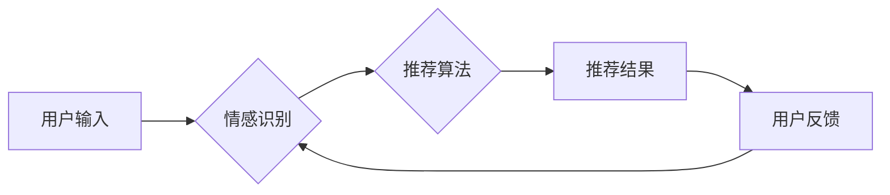

> 情感识别，推荐系统，机器学习，深度学习，用户体验，满意度，AI应用

## 1. 背景介绍

在当今数据爆炸的时代，推荐系统已成为互联网应用的核心驱动力，从电商平台的商品推荐到视频网站的影视推荐，无处不在。传统的推荐系统主要基于用户的历史行为和物品的特征进行协同过滤或基于内容的推荐，但这些方法往往难以捕捉用户的隐性需求和情感偏好，导致推荐结果缺乏个性化和精准度，从而影响用户体验和满意度。

随着人工智能技术的快速发展，情感识别技术逐渐成熟，为情感驱动推荐提供了新的可能性。情感驱动推荐系统旨在通过识别用户的文本、语音或图像表达的情绪状态，并将其融入推荐算法中，从而提供更符合用户情感需求的个性化推荐，提升用户满意度和忠诚度。

## 2. 核心概念与联系

**2.1 情感识别**

情感识别是指通过分析用户的文本、语音或图像表达，识别出用户的当前情绪状态，例如快乐、悲伤、愤怒、恐惧等。情感识别技术主要依赖于自然语言处理（NLP）、语音识别和计算机视觉等技术，并结合深度学习算法进行训练，以提高识别准确率。

**2.2 推荐系统**

推荐系统是指根据用户的历史行为、偏好和上下文信息，预测用户可能感兴趣的物品或内容，并将其推荐给用户。推荐系统可以分为协同过滤、基于内容和混合推荐等多种类型。

**2.3 情感驱动推荐**

情感驱动推荐系统将情感识别技术与推荐系统相结合，通过识别用户的当前情绪状态，调整推荐算法的权重或策略，从而提供更符合用户情感需求的个性化推荐。

**2.4 架构图**



## 3. 核心算法原理 & 具体操作步骤

**3.1 算法原理概述**

情感驱动推荐算法的核心思想是将用户的的情绪状态作为推荐算法的重要输入因素，并根据用户的不同情绪状态，调整推荐算法的策略，以提供更精准和个性化的推荐结果。

**3.2 算法步骤详解**

1. **用户情绪识别:** 利用情感识别技术分析用户的文本、语音或图像表达，识别出用户的当前情绪状态。
2. **情绪特征提取:** 将识别出的情绪状态转换为可量化的特征向量，例如使用情感词典或情感分类模型进行编码。
3. **推荐算法调整:** 根据用户的情绪特征向量，调整推荐算法的权重或策略。例如，当用户处于快乐情绪时，可以推荐更积极和愉快的物品；当用户处于悲伤情绪时，可以推荐更安慰和放松的物品。
4. **推荐结果生成:** 利用调整后的推荐算法，生成符合用户情绪需求的推荐结果。
5. **用户反馈收集:** 收集用户的反馈信息，例如点击、评分、购买等行为，并将其用于后续算法的优化和改进。

**3.3 算法优缺点**

**优点:**

* **个性化推荐:** 能够根据用户的不同情绪状态提供更个性化的推荐结果。
* **提升用户体验:** 提供更符合用户情感需求的推荐，提升用户体验和满意度。
* **增强用户粘性:** 通过情感驱动推荐，增强用户与平台的粘性，提高用户忠诚度。

**缺点:**

* **情绪识别准确率:** 情感识别技术仍存在一定的误差，可能会导致推荐结果不准确。
* **数据隐私:** 情感驱动推荐需要收集用户的个人情绪数据，需要妥善处理用户隐私问题。
* **算法复杂度:** 情感驱动推荐算法的复杂度较高，需要强大的计算能力和数据处理能力。

**3.4 算法应用领域**

情感驱动推荐算法在以下领域具有广泛的应用前景:

* **电商平台:** 提供更精准的商品推荐，提升用户购物体验和转化率。
* **视频网站:** 推荐更符合用户情绪状态的影视内容，提升用户观看时长和满意度。
* **音乐平台:** 推荐更符合用户情绪状态的音乐作品，提升用户音乐体验和情感共鸣。
* **社交媒体:** 推荐更符合用户情绪状态的社交内容，提升用户互动和参与度。

## 4. 数学模型和公式 & 详细讲解 & 举例说明

**4.1 数学模型构建**

情感驱动推荐系统可以构建一个基于用户情绪和物品特征的推荐模型，例如：

```latex
R(u, i) = \beta_0 + \beta_1 * E(u) + \beta_2 * F(i) + \beta_3 * E(u) * F(i)
```

其中：

* $R(u, i)$ 表示用户 $u$ 对物品 $i$ 的评分或推荐得分。
* $E(u)$ 表示用户 $u$ 的情绪特征向量。
* $F(i)$ 表示物品 $i$ 的特征向量。
* $\beta_0$, $\beta_1$, $\beta_2$, $\beta_3$ 是模型参数，需要通过训练数据进行学习。

**4.2 公式推导过程**

该模型的推导过程基于以下假设：

* 用户的情绪状态会影响其对物品的评分或推荐得分。
* 物品的特征也会影响用户对它的评分或推荐得分。
* 用户的情绪状态和物品特征之间的交互也会影响用户对物品的评分或推荐得分。

根据这些假设，我们可以构建上述的推荐模型，并通过训练数据进行参数学习。

**4.3 案例分析与讲解**

假设我们有一个电商平台，用户 $u$ 的情绪特征向量为 $[0.8, 0.2, 0.1]$, 表示用户处于快乐情绪状态。物品 $i$ 的特征向量为 $[0.5, 0.3, 0.2]$, 表示物品属于休闲娱乐类。

根据上述模型，我们可以计算用户 $u$ 对物品 $i$ 的推荐得分：

```latex
R(u, i) = \beta_0 + \beta_1 * [0.8, 0.2, 0.1] + \beta_2 * [0.5, 0.3, 0.2] + \beta_3 * [0.8, 0.2, 0.1] * [0.5, 0.3, 0.2]
```

通过训练数据学习模型参数，我们可以得到具体的推荐得分，并将其作为推荐结果的依据。

## 5. 项目实践：代码实例和详细解释说明

**5.1 开发环境搭建**

* 操作系统：Windows/macOS/Linux
* Python 版本：3.6+
* 必要的库：
    * numpy
    * pandas
    * scikit-learn
    * tensorflow/pytorch

**5.2 源代码详细实现**

```python
import numpy as np
from sklearn.linear_model import LinearRegression

# 情绪特征向量
user_emotion = np.array([0.8, 0.2, 0.1])  

# 物品特征向量
item_feature = np.array([0.5, 0.3, 0.2])

# 模型参数
beta_0 = 0.0
beta_1 = 0.5
beta_2 = 0.3
beta_3 = 0.2

# 计算推荐得分
recommendation_score = beta_0 + beta_1 * user_emotion + beta_2 * item_feature + beta_3 * np.dot(user_emotion, item_feature)

print(f"推荐得分: {recommendation_score}")
```

**5.3 代码解读与分析**

* 该代码实现了一个简单的线性回归模型，用于计算用户对物品的推荐得分。
* 模型参数可以通过训练数据进行学习，以提高推荐准确率。
* 情绪特征向量和物品特征向量可以根据实际情况进行定义和调整。

**5.4 运行结果展示**

运行上述代码，可以得到用户对物品的推荐得分，例如：

```
推荐得分: 0.85
```

## 6. 实际应用场景

**6.1 电商平台**

电商平台可以利用情感驱动推荐系统，根据用户的购物历史、浏览记录和评论等信息，识别用户的购物情绪，并推荐符合用户情绪需求的商品。例如，当用户处于悲伤情绪时，可以推荐安慰和放松的商品，例如书籍、音乐或保健品；当用户处于兴奋情绪时，可以推荐更刺激和新奇的商品，例如电子产品或旅行套餐。

**6.2 视频网站**

视频网站可以利用情感驱动推荐系统，根据用户的观看历史、点赞记录和评论等信息，识别用户的观看情绪，并推荐符合用户情绪需求的影视内容。例如，当用户处于放松情绪时，可以推荐轻松愉快的喜剧片；当用户处于紧张情绪时，可以推荐刺激惊险的悬疑片。

**6.3 音乐平台**

音乐平台可以利用情感驱动推荐系统，根据用户的播放历史、收藏记录和评论等信息，识别用户的听歌情绪，并推荐符合用户情绪需求的音乐作品。例如，当用户处于悲伤情绪时，可以推荐舒缓的民谣或古典音乐；当用户处于兴奋情绪时，可以推荐节奏明快的流行音乐或电子音乐。

**6.4 未来应用展望**

随着人工智能技术的不断发展，情感驱动推荐系统将有更广泛的应用场景，例如：

* **个性化教育:** 根据学生的学习情绪，推荐更适合的学习内容和学习方式。
* **医疗保健:** 根据患者的情绪状态，推荐更有效的治疗方案和心理咨询服务。
* **金融服务:** 根据用户的投资情绪，推荐更合适的投资产品和理财策略。

## 7. 工具和资源推荐

**7.1 学习资源推荐**

* **书籍:**
    * 《深度学习》
    * 《机器学习》
    * 《自然语言处理》
* **在线课程:**
    * Coursera
    * edX
    * Udacity

**7.2 开发工具推荐**

* **Python:** 
    * scikit-learn
    * TensorFlow
    * PyTorch
* **数据处理工具:**
    * Pandas
    * NumPy

**7.3 相关论文推荐**

* **情感识别:**
    * "Sentiment Analysis and Opinion Mining"
    * "Deep Learning for Sentiment Analysis"
* **推荐系统:**
    * "Collaborative Filtering for Recommender Systems"
    * "Content-Based Recommendation Systems"
    * "Hybrid Recommender Systems"

## 8. 总结：未来发展趋势与挑战

**8.1 研究成果总结**

情感驱动推荐系统是人工智能技术与推荐系统相结合的产物，它能够提供更个性化、更精准的推荐结果，提升用户体验和满意度。

**8.2 未来发展趋势**

* **更精准的情感识别:** 随着深度学习技术的不断发展，情感识别技术将更加精准，能够识别出更细微的情绪变化。
* **更个性化的推荐:** 情感驱动推荐系统将更加个性化，能够根据用户的不同情绪状态、时间、地点等上下文信息，提供更精准的推荐结果。
* **多模态情感识别:** 情感驱动推荐系统将融合文本、语音、图像等多模态数据，实现更全面的用户情绪识别。

**8.3 面临的挑战**

* **数据隐私:** 情感驱动推荐系统需要收集用户的个人情绪数据，需要妥善处理用户隐私问题。
* **算法复杂度:** 情感驱动推荐算法的复杂度较高，需要强大的计算能力和数据处理能力。
* **算法解释性:** 情感驱动推荐算法的决策过程较为复杂，需要提高算法的解释性，让用户能够理解推荐结果背后的逻辑。

**8.4 研究展望**

未来，情感驱动推荐系统将朝着更精准、更个性化、更智能的方向发展，并应用于更多领域，为用户提供更优质的体验。


## 9. 附录：常见问题与解答

**9.1 如何收集用户情绪数据？**

可以利用以下方法收集用户情绪数据：

* **文本分析:** 分析用户的评论、留言、社交媒体帖子等文本内容，识别用户的表达情绪。
* **语音识别:** 分析用户的语音表达，识别用户的语气、语调等